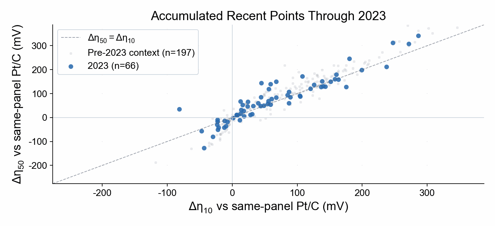
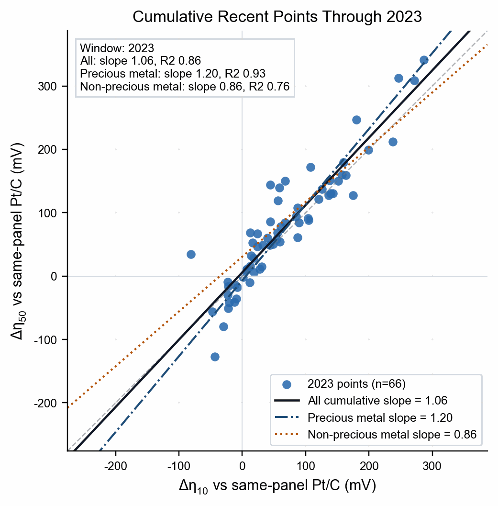

# Codex session transcript: 019e5a99-d4b4-7b33-9c00-74b8d0f6c184

- Source JSONL: `[CODEX_SESSION_LOGS]\2026\05\24\rollout-2026-05-24T23-28-11-019e5a99-d4b4-7b33-9c00-74b8d0f6c184.jsonl`
- SHA-256: `f457f4d00a50630f699964ff9e5953dd96d572557dafd89c1a674f75ec497f58`
- Rendered messages/notes: 2,727
- Embedded images extracted: 8
- Linked local image references exported: 190
- Unique linked local figures exported: 136

## Conversation

### 1. Context

`2026-05-24T15:28:17.645Z` - JSONL line `5`

<environment_context>
  <cwd>[ANALYSIS_WORKSPACE]</cwd>
  <shell>powershell</shell>
  <current_date>2026-05-23</current_date>
  <timezone>Asia/Shanghai</timezone>
</environment_context>

### 2. User

`2026-05-24T15:28:17.645Z` - JSONL line `7`

inspect the repo and I want you to complete two tasks. 


### 3. Assistant

`2026-05-24T15:28:17.646Z` - JSONL line `11`

I’ll get oriented in the repo first so the two tasks have some ground under them. Send the task details when ready; I’ll use the inspection pass to map the structure and likely test/build commands.

### 4. Assistant

`2026-05-24T15:28:17.646Z` - JSONL line `21`

The top level is small and not a Git worktree, so I’m reading the three README files next. It looks like two agent folders already mirror the “two tasks” shape, which is probably important.

### 5. Assistant

`2026-05-24T15:28:17.646Z` - JSONL line `31`

The repo itself is a lightweight workspace: one top README plus two task folders. I’m going into the referenced publication database now to see what raw evidence and machine-readable data are available before choosing the analysis path.

### 6. Assistant

`2026-05-24T15:28:17.646Z` - JSONL line `39`

The database has canonical tables and evidence artifacts, so this is workable without touching the HTML dump unless a spot check needs source context. I’m reading schema/provenance and sampling table headers to pin down columns and quality filters.

### 7. Assistant

`2026-05-24T15:28:17.647Z` - JSONL line `65`

The normalized points are native x/y arrays attached to curve metadata. I’m checking units and label distributions now, because both requested analyses depend on converting potential/current axes consistently instead of assuming every panel is already clean RHE + mA cm^-2.

### 8. Assistant

`2026-05-24T15:28:17.647Z` - JSONL line `79`

Here’s the working plan I’m going to execute: compute robust per-curve metrics from the canonical tables, then make one focused analysis script/report per task folder. For Pt/C-relative behavior I’ll derive eta10/50/100 and same-panel Pt/C deltas; for BV+iR I’ll fit a stable inverse BV model with and without an ohmic term, then summarize improvement patterns by catalyst/electrolyte/substrate metadata.

### 9. Assistant

`2026-05-24T15:28:17.647Z` - JSONL line `85`

I’m going to add executable analysis scripts into each task folder now. They’ll regenerate their CSVs, plots, and Markdown reports from the canonical database, so the outputs remain auditable rather than hand-assembled.

### 10. Assistant

`2026-05-24T15:28:17.648Z` - JSONL line `102`

The scripts are in place. I’m running the Pt/C-relative analysis first, then I’ll run the BV+iR fitting pass and patch anything the data exposes.

### 11. Assistant

`2026-05-24T15:28:17.648Z` - JSONL line `108`

The first pass completed: 3,506 analysis-ready HER curves and 1,301 non-Pt/C curves matched to same-panel Pt/C at eta10. Now I’m running the fitting agent; this one is heavier because it optimizes two models per curve.

### 12. Assistant

`2026-05-24T15:28:17.648Z` - JSONL line `114`

Both scripts ran cleanly and produced their report/CSV/plot bundles. I’m doing a sanity read of the generated reports and a few summary files now, mainly to catch any weird metrics or reporting bugs before I call this done.

### 13. Assistant

`2026-05-24T15:28:17.649Z` - JSONL line `126`

The sanity check caught an important data-shape issue: a few log-current/Tafel-style axes were slipping into the linear-current analyses. I’m tightening both scripts so eta targets and BV fits only use linear potential-current curves, then I’ll regenerate the outputs.

### 14. Assistant

`2026-05-24T15:28:17.649Z` - JSONL line `152`

I tightened that filter and cleaned up the plotting warning too. I’m doing one final regeneration so the saved outputs match the final scripts exactly.

### 15. Assistant

`2026-05-24T15:28:17.650Z` - JSONL line `186`

I found one more subtle thing worth fixing properly: a tiny number of panels can have current on x and potential on y, and some axes are non-RHE references. I’m adding explicit axis-orientation/reference detection so the scripts only interpret eta/BV fits on RHE or overpotential axes and can handle the swapped orientation case.

### 16. Assistant

`2026-05-24T15:28:17.651Z` - JSONL line `216`

The stricter reference-axis handling is now in both scripts. I’m regenerating again; expect counts to shift slightly because non-RHE/non-overpotential axes are now excluded from eta/BV interpretation.

### 17. Assistant

`2026-05-24T15:28:17.651Z` - JSONL line `243`

Done. I treated the two task folders as the two requested tasks and completed both from the canonical publication database. The workspace is not a Git repo, so there’s no git status/commit trail.

Task 1 outputs are in **01_ptc_relative_slope_agent**. Start with **REPORT.md**. Key result: 3,407 analysis-ready HER curves, 521 same-panel Pt/C benchmark panels, 1,294 matched non-Pt/C curves at eta10; median delta eta10 vs Pt/C is 61.8 mV, with 285 curves outperforming same-panel Pt/C.

Task 2 outputs are in **02_bv_ir_fitting_agent**. Start with **REPORT.md**. Key result: 3,571 successful BV and BV+iR fits; 1,668 curves materially improve with iR; median AIC improvement is 14.4 and median fitted iR term is 0.352 mV per mA cm^-2.

I also left reproducible scripts in each folder and regenerated the CSVs/plots from them. Both scripts were run successfully after tightening filters for linear current-density curves, RHE/overpotential axes, and swapped axis orientation.

### 18. User

`2026-05-24T15:28:17.651Z` - JSONL line `248`

let's focus on task 1 first. I wonder how the condition and materials can influence the performance of the catalysts? 


### 19. Assistant

`2026-05-24T15:28:17.651Z` - JSONL line `252`

That’s the right next question. I’ll treat performance two ways: absolute eta10/eta50/eta100, and same-panel delta vs Pt/C, because the latter controls away a lot of figure-specific condition noise.

### 20. Assistant

`2026-05-24T15:28:17.652Z` - JSONL line `262`

I’m going to turn this into a focused follow-up inside task 1: merge the Pt/C-relative deltas back to the richer curve metadata, then summarize which electrolyte/measurement conditions and material descriptors are associated with lower delta eta.

### 21. Assistant

`2026-05-24T15:28:17.652Z` - JSONL line `268`

The first cut is already showing a strong story: in Pt/C-matched panels, PGM/alloy/single-atom groups sit much closer to Pt/C than non-PGM sulfides/phosphides/carbons. I’m adding active-element and support/substrate summaries next, because those usually explain the spread inside the broad material classes.

### 22. Assistant

`2026-05-24T15:28:17.652Z` - JSONL line `274`

I’m going to save this as a reproducible add-on analysis rather than just a one-off answer. The key outcome will be a short report plus CSV summaries for electrolyte regime, PGM class, material class, structural motif, active elements, support, and substrate.

### 23. Assistant

`2026-05-24T15:28:17.652Z` - JSONL line `283`

The add-on analysis is generated. I’m reading the report once to make sure the tables line up with the narrative and that no rare category is being over-interpreted.

### 24. Assistant

`2026-05-24T15:28:17.652Z` - JSONL line `291`

I dug into this for task 1 and added a focused follow-up report here: **condition_material_influence_report.md**.

Short version: materials dominate the signal more than testing conditions. Using 759 candidate curves with same-panel Pt/C eta10 comparisons, PGM-containing candidates are essentially Pt/C-like on median, while non-PGM candidates lag strongly.

Key patterns:

- **PGM vs non-PGM:** PGM candidates median `delta eta10 = -3.5 mV`; non-PGM candidates median `+107.1 mV`.
- **Electrolyte regime:** alkaline candidates are closer to Pt/C than acidic candidates, but the PGM/non-PGM split is bigger than the acid/alkaline split. Non-PGM alkaline median is `+95.9 mV`; non-PGM acidic median is `+123.1 mV`.
- **Material class:** alloys perform best, median `-8.3 mV`; single-atom `+7.7 mV`; metals `+11.7 mV`; composites `+31.1 mV`. Phosphides, sulfides, carbides, and carbon-material candidates lag more.
- **Structural motif:** clusters, nanoparticles, and single atoms are closest to Pt/C; nanosheets and bulk-like entries lag more in this matched subset.
- **Supports/substrates:** carbon/CNT/graphene-supported systems look better than entries with no explicit support. Carbon cloth and nickel-foam categories are mixed and skew toward non-PGM growth electrodes.
- **iR compensation:** reported iR status does not separate performance very strongly in this candidate-only Pt/C-matched view.

I also wrote the reproducible script: **condition_material_influence_analysis.py**, plus CSV summaries and plots in the same folder.

### 25. User

`2026-05-24T15:28:17.652Z` - JSONL line `296`

is your analysis based on eta10? I think eta 10 is small current while eta50/100 will carry more information. will eta50 /eta 100 decrease the number of catalysts to be analyzed? I know some LSV curves may not hit the current density. 


### 26. Assistant

`2026-05-24T15:28:17.652Z` - JSONL line `300`

Yes, the follow-up report I just made is eta10-based. I’m checking the existing task-1 outputs now to quantify exactly how much the sample shrinks at eta50 and eta100, both for all curves and for same-panel Pt/C-relative comparisons.

### 27. Assistant

`2026-05-24T15:28:17.652Z` - JSONL line `306`

Yes. The focused condition/material report I just made is based on **same-panel Pt/C-relative eta10**: `delta_eta10_mV`.

You’re exactly right: **eta50 and eta100 carry more high-current information**, but they reduce the usable set because many extracted LSV curves do not reach those current densities, and for Pt/C-relative analysis both the candidate and same-panel Pt/C benchmark must reach the target.

Current counts from task 1:

| Scope | eta10 | eta50 | eta100 |
|---|---:|---:|---:|
| All analysis-ready curves | 2,865 | 2,371 | 1,348 |
| Same-panel non-Pt/C vs Pt/C deltas | 1,294 | 1,205 | 688 |
| Candidate-only same-panel Pt/C deltas | 759 | 663 | 343 |
| Candidate-only, publication-usable subset | 439 | 391 | 219 |

Important nuance: eta50 is not perfectly a subset of eta10. Some curves only have visible/extracted high-current segments, so a curve can have eta50 but not eta10. If we require **candidate eta10 + eta50 together**, the candidate set drops to **475**. If we require **eta10 + eta50 + eta100 together**, it drops to **154**.

So I agree with your instinct: eta50 is probably the best next comparison point because it still keeps a decent sample. eta100 is valuable but much more selective and will bias toward curves/papers that show high-current regions.

### 28. User

`2026-05-24T15:28:17.653Z` - JSONL line `311`

ok eta 50 seems to make more sense compared to eta 100. can you plot scattering points of the catalyts in a 2D plot with eta10 as x axis, and eta50 as y axis? I want to see both the Pt/C substrated and non-substrated to see if there is any clear patterns. 


### 29. Assistant

`2026-05-24T15:28:17.653Z` - JSONL line `315`

I read “Pt/C substrated” as “Pt/C-subtracted,” so I’ll make both views side by side: raw eta10 vs eta50, and same-panel Pt/C-subtracted delta eta10 vs delta eta50. I’ll color the catalyst points by PGM/non-PGM and use marker shape for electrolyte regime so the main patterns are visible without overloading the plot.

### 30. Assistant

`2026-05-24T15:28:17.653Z` - JSONL line `321`

I’ve added a small plotting script into task 1. Running it now will create the scatter PNGs and a CSV of the exact points included, so we can inspect outliers if a cluster looks interesting.

### 31. Assistant

`2026-05-24T15:28:17.653Z` - JSONL line `332`

I interpreted “Pt/C substrated” as **Pt/C-subtracted** and made both views:


I also made a material-class color version:


Files:
- **eta10_eta50_scatter.py**
- **candidate_eta10_eta50_scatter_points.csv**

This uses **475 candidate catalysts**, because I required both eta10 and eta50 to exist, and for the Pt/C-subtracted view both the candidate and its same-panel Pt/C benchmark must reach both currents.

Quick read: the Pt/C-subtracted plot is quite coherent. Most points stay in the same quadrant from eta10 to eta50: **153 outperform Pt/C at both**, **302 lag Pt/C at both**, and only **20 switch sign** between eta10 and eta50. So eta50 is adding useful high-current information, but it is not completely rewriting the eta10 ranking for most catalysts.

### 32. User

`2026-05-24T15:28:17.653Z` - JSONL line `337`

can you use arial as the font in the future? also, I feel the PGM and non-PGM seems to sit on two lines when considering the normalization to Pt/C in the same panel. is it true or not? can you validate it?


### 33. Assistant

`2026-05-24T15:28:17.653Z` - JSONL line `341`

Yes, I’ll use Arial for plots going forward. I’m going to validate the “two lines” impression quantitatively by fitting delta eta50 vs delta eta10 separately for PGM and non-PGM, then compare that against a single shared line.

### 34. Assistant

`2026-05-24T15:28:17.654Z` - JSONL line `347`

The quantitative check says your eye was picking up a real pattern: a two-line model fits the Pt/C-subtracted scatter much better than one shared line. I’m going to make that validation plot with Arial and add a short report so the evidence is preserved next to the figure.

### 35. Assistant

`2026-05-24T15:28:17.654Z` - JSONL line `361`

I’ve added the validation script. I’ll rerun the scatter plot script too so the existing eta10/eta50 figures are regenerated with Arial, then run the two-line validation.

### 36. Assistant

`2026-05-24T15:28:17.654Z` - JSONL line `374`

The validation report is there; I noticed the p-value printed as `0` because it underflowed numerically. I’m cleaning that to `p < 1e-15` so the report reads like a human wrote it, then I’ll summarize the result.

### 37. Assistant

`2026-05-24T15:28:17.655Z` - JSONL line `383`

Yes, I’ll use Arial for plots going forward. I also regenerated the eta10/eta50 plots with Arial.

And yes: your “two lines” impression is real, with a caveat. It is not two perfectly sharp lines, but **PGM and non-PGM candidates follow statistically distinct trends** in the Pt/C-subtracted eta10/eta50 space.


Validation summary:

- Data: **475 candidate catalysts** with both same-panel `delta_eta10` and `delta_eta50`.
- PGM line: `delta_eta50 = -19.3 + 1.407 * delta_eta10`, `R2 = 0.877`.
- non-PGM line: `delta_eta50 = 17.8 + 1.015 * delta_eta10`, `R2 = 0.862`.
- A two-line model improves fit over one shared line:
  - shared-line `R2 = 0.886`
  - two-line `R2 = 0.909`
  - nested F-test: `F = 59.2`, `p < 1e-15`
- The same result holds after removing extreme points from the central cloud.

Interpretation: non-PGM catalysts are closer to a one-to-one relationship between eta10 and eta50 gaps, while PGM candidates show a steeper relationship. So the split is not just visual noise; it likely reflects different high-current behavior after Pt/C normalization.

Report and files:
- **pgm_two_line_validation_report.md**
- **validate_pgm_two_line_pattern.py**

### 38. User

`2026-05-24T15:28:17.655Z` - JSONL line `388`

can you fit the data with Bayesian linear fitting instead, so I can see the posterior of the lines.


### 39. Assistant

`2026-05-24T15:28:17.655Z` - JSONL line `392`

Yes. I’ll do this as a Bayesian linear regression per class for the Pt/C-subtracted relationship, then sample posterior lines and summarize the posterior slope/intercept differences between PGM and non-PGM. I’ll use Arial in the generated figures.

### 40. Assistant

`2026-05-24T15:28:17.655Z` - JSONL line `400`

There isn’t a PyMC/Stan backend installed here, so I’ll use the analytic Bayesian linear regression posterior with a flat prior on line parameters and log-variance. It gives posterior samples for intercept, slope, noise, and full lines without needing MCMC.

### 41. Assistant

`2026-05-24T15:28:17.655Z` - JSONL line `406`

I’ve added the Bayesian posterior script. Now I’m running it and will inspect the report/figures it produces before summarizing.

### 42. Assistant

`2026-05-24T15:28:17.656Z` - JSONL line `419`

Done. I fit Bayesian linear posteriors for the Pt/C-subtracted plot, separately for PGM and non-PGM, using the 475 candidate catalysts with both `delta_eta10` and `delta_eta50`.


Key posterior result:

- **PGM:** slope median `1.407`, 95% CrI `1.337 to 1.478`
- **non-PGM:** slope median `1.015`, 95% CrI `0.964 to 1.065`
- `P(slope_PGM > slope_nonPGM) = 1.00000`
- non-PGM intercept is also higher: median difference `+37.0 mV`, 95% CrI `29.3 to 44.9 mV`

So yes, the two-line pattern is validated in the posterior. The interpretation is a little nuanced: non-PGM sits higher at low `delta_eta10`, but PGM has the steeper line, with the posterior median crossover near `delta_eta10 ≈ 95 mV`.

More outputs:
- **bayesian_pgm_line_posterior_report.md**
- **bayesian_pgm_parameter_posteriors.png**
- **bayesian_pgm_line_difference_posteriors.png**
- **bayesian_pgm_line_posterior.py**

### 43. User

`2026-05-24T15:28:17.656Z` - JSONL line `424`

I feel the slope for the scatters with delta eta10<0 and delta eta50<0 is even higher. run the analysis and see the results. 


### 44. Assistant

`2026-05-24T15:28:17.656Z` - JSONL line `427`

Good eye. I’ll isolate the “outperforms Pt/C at both eta10 and eta50” quadrant and estimate its eta50-vs-eta10 slope, then compare PGM/non-PGM where there’s enough data.

### 45. Assistant

`2026-05-24T15:28:17.656Z` - JSONL line `432`

The negative-negative quadrant is mostly PGM, and within PGM the slope is indeed much higher, about 2.07 by OLS and 2.06 by Theil-Sen. I’m going to formalize this with a small Bayesian quadrant analysis and a plot, since that will make the uncertainty and the small non-PGM count clear.

### 46. Assistant

`2026-05-24T15:28:17.656Z` - JSONL line `438`

I’ve added a Bayesian quadrant-specific script. Running it now will give the posterior slope for the all-negative subset and the PGM/non-PGM split, with the non-PGM caveat carried explicitly.

### 47. Assistant

`2026-05-24T15:28:17.656Z` - JSONL line `450`

You were right, but with an important split.

For the subset where both `delta_eta10 < 0` and `delta_eta50 < 0`, there are **153 catalysts**. But it is heavily PGM-dominated: **138 PGM** and only **15 non-PGM**.


Bayesian slope posterior:

| group | n | slope median | 95% CrI |
|---|---:|---:|---|
| all both-negative | 153 | 0.862 | 0.668 to 1.052 |
| PGM | 138 | 2.070 | 1.844 to 2.297 |
| non-PGM | 15 | 0.450 | 0.090 to 0.812 |

So the high slope is **very real for PGM catalysts** in the “beats Pt/C at both eta10 and eta50” quadrant. Each extra 1 mV advantage at eta10 corresponds to about 2 mV advantage at eta50 for that PGM subset.

The pooled slope looks lower because the few non-PGM points in that quadrant behave differently and include extreme cases with much larger eta10 advantage than eta50 advantage.

Report:
**bayesian_negative_quadrant_report.md**

### 48. User

`2026-05-24T15:28:17.657Z` - JSONL line `455`

what is the meaning of the slope and intercept for the scatter plots? I think the PGM/non-PGM is valid. Does the acidic/basic condition influence the behavior?


### 49. Assistant

`2026-05-24T15:28:17.657Z` - JSONL line `459`

I’ll separate the meaning first, then validate the acid/basic effect on the same Pt/C-subtracted eta10/eta50 scatter. I’m going to test whether electrolyte regime adds explanatory power after the PGM/non-PGM split, and also fit the four acid/alkaline subgroup lines.

### 50. Assistant

`2026-05-24T15:28:17.657Z` - JSONL line `465`

The condition effect is present, but smaller than the PGM/non-PGM separation. I’m going to save this as a compact acid/base validation report with subgroup posterior lines so we have a clean artifact rather than just a console readout.

### 51. Assistant

`2026-05-24T15:28:17.657Z` - JSONL line `471`

The acid/base script is in place. I’m running it now and will make sure the report is readable before I answer.

### 52. Assistant

`2026-05-24T15:28:17.657Z` - JSONL line `477`

The run hit a missing optional `tabulate` dependency for one Markdown table, not the analysis itself. I’m patching the report writer to use the same no-dependency Markdown table helper I used elsewhere.

### 53. Assistant

`2026-05-24T15:28:17.658Z` - JSONL line `494`

Yes. The PGM/non-PGM split is valid, and **acidic/basic condition also influences the behavior**, but it is a smaller effect than PGM class.


**Meaning Of The Line**
`x = delta eta10`: candidate eta10 minus same-panel Pt/C eta10.  
`y = delta eta50`: candidate eta50 minus same-panel Pt/C eta50.

So:

- **Slope ~1**: the Pt/C-relative gap is preserved from eta10 to eta50.
- **Slope >1**: the gap is amplified at eta50; high-current behavior diverges more.
- **Slope <1**: the gap compresses at eta50.
- **Intercept**: predicted delta eta50 when delta eta10 is zero. A positive intercept means “ties Pt/C at eta10 but lags at eta50”; negative means “ties Pt/C at eta10 but beats Pt/C at eta50.”

**Acid/Base Result**

| group | n | slope median | 95% CrI | intercept |
|---|---:|---:|---|---:|
| PGM acidic | 69 | 1.262 | 1.185 to 1.339 | -4.3 |
| PGM alkaline | 139 | 1.503 | 1.382 to 1.623 | -23.0 |
| non-PGM acidic | 94 | 1.034 | 0.964 to 1.106 | 20.3 |
| non-PGM alkaline | 148 | 0.991 | 0.916 to 1.066 | 18.1 |

Interpretation: **PGM alkaline catalysts show the strongest amplification**: if they beat Pt/C at eta10, they tend to beat it even more at eta50. Non-PGM catalysts are closer to slope 1, especially alkaline, meaning their Pt/C-relative penalty mostly carries through from eta10 to eta50.

Model comparison says acid/base matters statistically: adding acid/base to the PGM/non-PGM line model improves fit, `p = 0.00134` for an acid/base intercept shift and `p = 0.000269` for four separate lines. But the R2 gain is modest, from `0.912` to `0.917`, so it’s a **real but second-order** effect.

Full report: **acid_base_line_influence_report.md**

### 54. User

`2026-05-24T15:28:17.658Z` - JSONL line `499`

这个slope的物理意义是啥？放在tafel框架下讨论是在说啥事情？


### 55. Assistant

`2026-05-24T15:28:17.658Z` - JSONL line `503`

对，这个 slope **不是传统 Tafel slope 本身**。它是一个“Pt/C 归一化后，从 eta10 到 eta50 的性能差距如何传递/放大”的经验斜率。

我们画的是：

```text
x = Δη10 = η10(candidate) - η10(Pt/C)
y = Δη50 = η50(candidate) - η50(Pt/C)
```

拟合：

```text
Δη50 = intercept + slope * Δη10
```

**物理含义**
- `slope ≈ 1`：candidate 相对 Pt/C 的差距从 10 到 50 mA cm^-2 基本保持。
- `slope > 1`：差距在高电流被放大。  
  如果 `Δη10 < 0`，说明低电流已经优于 Pt/C，那么 `slope > 1` 往往意味着 eta50 优势更大。
- `slope < 1`：差距在高电流被压缩。
- `intercept`：当 candidate 在 eta10 和 Pt/C 打平时，eta50 预计还差多少。  
  `intercept > 0` 表示 eta10 打平但 eta50 落后；`intercept < 0` 表示 eta10 打平但 eta50 反而更好。

放到 Tafel 框架下，可以这样理解。若近似：

```text
η = A + b_Tafel * log10(j)
```

那么 candidate 和 Pt/C 的差值为：

```text
Δη(j) = Δη0 + (b_candidate - b_Pt/C) * log10(j)
```

所以从 10 到 50 mA cm^-2：

```text
Δη50 - Δη10 = (b_candidate - b_Pt/C) * log10(50/10)
```

也就是：

```text
b_candidate - b_Pt/C ≈ (Δη50 - Δη10) / log10(5)
```

因此真正接近 Tafel 意义的量是：

```text
Δη50 - Δη10
```

它表示 candidate 相对 Pt/C 的**表观 Tafel penalty 或 advantage**。

在我们的结果里：

- **PGM alkaline**: slope ≈ `1.50`, intercept ≈ `-23 mV`  
  说明 PGM 碱性体系里，eta10 的优势往往会在 eta50 被进一步放大。换成 Tafel 语言，就是这些 candidate 相对 Pt/C 可能有更低的表观高电流斜率，或者更少的高电流 penalty。

- **PGM acidic**: slope ≈ `1.26`, intercept ≈ `-4 mV`  
  仍然有放大，但弱很多。酸性 PGM 更接近 Pt/C-like 行为。

- **non-PGM acidic/alkaline**: slope ≈ `1.03` 和 `0.99`  
  基本接近 1。说明 non-PGM 的 Pt/C-relative 差距从 eta10 到 eta50 大多是“平移保持”，没有很强的高电流优势放大。

需要谨慎的一点：这里不是严格 Tafel plot。eta10 到 eta50 来自 LSV，里面可能混有 iR、气泡、传质、载量、基底、电极结构影响。所以我会把它叫做 **apparent Tafel-like behavior**，而不是直接说反应机理 Tafel slope 改变。

### 56. User

`2026-05-24T15:28:17.658Z` - JSONL line `510`

what is the physical naming of the slope? under the tafel framework, what does it tell?

### 57. Assistant

`2026-05-24T15:28:17.658Z` - JSONL line `514`

Physically, I would **not** call the fitted scatter slope a Tafel slope. Better names:

- **Pt/C-relative high-current amplification slope**
- **eta50/eta10 relative-performance transfer slope**
- **current-scaling coefficient of the Pt/C-normalized gap**

In your plot:

`delta eta50 = intercept + slope * delta eta10`

This slope says how the **Pt/C-relative performance gap at 10 mA cm^-2** maps to the **Pt/C-relative gap at 50 mA cm^-2**.

Under a Tafel framework:

`eta = a + b log10(j)`

where `b` is the true Tafel slope in mV/dec. For a candidate relative to same-panel Pt/C:

`delta eta(j) = eta_candidate(j) - eta_Pt/C(j)`

Then between 10 and 50 mA cm^-2:

`delta eta50 - delta eta10 ≈ (b_candidate - b_Pt/C) * log10(50/10)`

Since `log10(5) = 0.699`:

`b_candidate - b_Pt/C ≈ (delta eta50 - delta eta10) / 0.699`

So the most Tafel-physical quantity is actually the **gap widening**:

`delta eta50 - delta eta10`

This estimates whether the catalyst has a higher or lower apparent Tafel slope than Pt/C over that current window.

For our groups:

| group | median `delta eta50 - delta eta10` | approx `b_candidate - b_Pt/C` |
|---|---:|---:|
| PGM acidic | -1.0 mV | -1.4 mV/dec |
| PGM alkaline | -20.5 mV | -29.3 mV/dec |
| non-PGM acidic | +22.0 mV | +31.4 mV/dec |
| non-PGM alkaline | +13.3 mV | +19.0 mV/dec |

Interpretation:

- **PGM alkaline:** relative to Pt/C, the candidates improve at eta50 compared with eta10. Under Tafel language, they have a lower apparent Tafel slope than same-panel Pt/C over 10 to 50 mA cm^-2.
- **non-PGM acidic/alkaline:** their Pt/C-relative penalty grows at eta50, implying a higher apparent Tafel slope than Pt/C.
- **PGM acidic:** roughly preserves the Pt/C-relative gap from eta10 to eta50.

So: the regression slope is a useful population descriptor, but the more physical Tafel-derived quantity is **relative apparent Tafel slope difference**, estimated by `(delta eta50 - delta eta10) / log10(5)`.

### 58. User

`2026-05-24T15:28:17.658Z` - JSONL line `519`

can you plot the posterior distribution of slope, intercept for non-PGM and acidic/basic categories? there would be four panels.


### 59. Interruption

`2026-05-24T15:28:17.658Z` - JSONL line `522`

<turn_aborted>
The user interrupted the previous turn on purpose. Any running unified exec processes may still be running in the background. If any tools/commands were aborted, they may have partially executed.
</turn_aborted>

### 60. User

`2026-05-24T15:28:17.658Z` - JSONL line `528`

can you plot the posterior distribution of slope, intercept for non-PGM and acidic/basic categories? there would be four columns.

### 61. Assistant

`2026-05-24T15:28:17.659Z` - JSONL line `532`

I’ll make that as a 2-by-4 posterior panel: four columns for `PGM acidic`, `PGM alkaline`, `non-PGM acidic`, and `non-PGM alkaline`; rows for intercept and slope. I’ll treat “basic” as the dataset’s `alkaline` category and keep Arial styling.

### 62. Assistant

`2026-05-24T15:28:17.659Z` - JSONL line `538`

The plotting script is ready. I’m running it now and then I’ll show the generated panel plus the summary file.

### 63. Assistant

`2026-05-24T15:28:17.659Z` - JSONL line `548`

Done. I made the four-column posterior panel for slope and intercept, with columns:

1. PGM acidic  
2. PGM alkaline/basic  
3. non-PGM acidic  
4. non-PGM alkaline/basic  


Summary files:
- **acid_base_four_group_parameter_posterior_summary.csv**
- **acid_base_parameter_posterior_plot.py**

The dashed reference is `intercept = 0` in the top row and `slope = 1` in the bottom row.

### 64. User

`2026-05-24T15:28:17.659Z` - JSONL line `553`

this is quite interesting. The eta10 of the PGM containing catalysts seem to correlate with their eta 50, while the non-PGM catalysts seem to have a fixed difference. Can you analyze them from the pespective of tafel slope?


### 65. Assistant

`2026-05-24T15:28:17.659Z` - JSONL line `557`

That’s a sharp Tafel interpretation: if `eta50 - eta10` is roughly fixed, that implies a roughly fixed apparent Tafel slope over 10 to 50 mA cm^-2. I’ll compute both the absolute apparent Tafel slope and the Pt/C-relative apparent Tafel slope, then compare PGM/non-PGM and acid/base.

### 66. Assistant

`2026-05-24T15:28:17.660Z` - JSONL line `564`

I’m going to turn the Tafel-frame view into its own task-1 artifact: compute each candidate’s apparent Tafel slope over 10 to 50 mA cm^-2, the same-panel Pt/C apparent slope, and the relative slope penalty/advantage. Then I’ll plot those by PGM and acid/basic group.

### 67. Assistant

`2026-05-24T15:28:17.660Z` - JSONL line `570`

The Tafel-frame script is in place. I’m running it now to generate the relative apparent Tafel slope tables and plots.

### 68. Assistant

`2026-05-24T15:28:17.660Z` - JSONL line `583`

I analyzed it explicitly from an **apparent Tafel slope** perspective over 10 to 50 mA cm^-2.


Using:

```text
b_10-50 = (eta50 - eta10) / log10(50/10)
delta_b = (delta_eta50 - delta_eta10) / log10(5)
```

So `delta_b` is the candidate’s apparent Tafel slope minus the same-panel Pt/C apparent Tafel slope.

**Key Result**

| group | candidate b median | Pt/C b median | relative b vs Pt/C |
|---|---:|---:|---:|
| PGM acidic | 50.6 mV/dec | 48.0 mV/dec | -1.4 mV/dec |
| PGM alkaline/basic | 64.0 mV/dec | 98.4 mV/dec | -29.3 mV/dec |
| non-PGM acidic | 79.5 mV/dec | 51.3 mV/dec | +31.4 mV/dec |
| non-PGM alkaline/basic | 102.7 mV/dec | 78.9 mV/dec | +19.0 mV/dec |

Your interpretation is right: **non-PGM catalysts behave like they carry a nearly fixed relative Tafel penalty**.

For non-PGM:

- acidic: `delta_b ≈ +29.1 + 0.05 * delta_eta10`
- alkaline/basic: `delta_b ≈ +26.1 - 0.01 * delta_eta10`

That dependence on `delta_eta10` is basically flat. So whether a non-PGM catalyst is better or worse at eta10, its eta50 behavior tends to add a fairly constant Tafel-like penalty relative to Pt/C.

For PGM:

- acidic: `delta_b ≈ -6.2 + 0.37 * delta_eta10`
- alkaline/basic: `delta_b ≈ -32.9 + 0.72 * delta_eta10`

So PGM behavior is coupled to eta10: especially in alkaline/basic electrolyte, PGM catalysts that outperform Pt/C at eta10 tend to have even more favorable apparent Tafel behavior by eta50.

Full report: **tafel_perspective_eta10_eta50_report.md**

### 69. User

`2026-05-24T15:28:17.660Z` - JSONL line `588`

this feels like interesting. for the PGM thing, in acidic condition, they behave more like Pt/C. in basic conditions, it is more different than the Pt/C catalysts. what are the catalysts? do they share some features that can make them behave very differently from Pt/C?


### 70. Assistant

`2026-05-24T15:28:17.661Z` - JSONL line `592`

That’s exactly the next layer: “PGM” is too broad. I’ll zoom into PGM candidates in acid vs alkaline, rank the alkaline cases by how much their apparent Tafel slope beats same-panel Pt/C, and then summarize shared elements/motifs/supports.

### 71. Assistant

`2026-05-24T15:28:17.661Z` - JSONL line `598`

The top alkaline PGM outliers are not random Pt/C variants. They are mostly alloy/cluster/nanoparticle systems with Ru/Pt/Ir plus oxophilic or electronic-modulating partners and supports. I’m packaging the top-catalyst list and feature counts into a clean report now.

### 72. Assistant

`2026-05-24T15:28:17.661Z` - JSONL line `604`

The feature counts are already telling: in alkaline PGM, 83 of 139 have an apparent Tafel slope at least 20 mV/dec lower than same-panel Pt/C; 51 are at least 40 mV/dec lower. I’m saving a readable top-catalyst/feature report so the evidence is easier to inspect.

### 73. Assistant

`2026-05-24T15:28:17.662Z` - JSONL line `619`

Yes. The alkaline/basic PGM catalysts that diverge from Pt/C are mostly **not plain Pt/C variants**. They are enriched for **multimetal PGM alloys/clusters/nanoparticles and heterointerface composites**.

I wrote the focused report here: **pgm_alkaline_strong_feature_summary.md**


Among **139 alkaline PGM** candidates:

- `83 / 139` have apparent Tafel slope at least `20 mV/dec` lower than same-panel Pt/C.
- `51 / 139` have apparent Tafel slope at least `40 mV/dec` lower than Pt/C.
- In that strong set, `38 / 51` are flagged bimetallic/multimetal.

Top examples include:

| catalyst | main feature | relative b vs Pt/C |
|---|---|---:|
| Pt NPs@CF | Pt nanoparticles on carbon foam | `-204.9 mV/dec` |
| PtRu/CNT@CeO2-x | PtRu clusters on CNT/CeO2-x | `-175.0` |
| IrRuMoWCu/NHCSs | high-entropy PGM alloy nanoparticles | `-146.7` |
| RuNC@CPF-Ni | Ru/Ni hierarchical composite | `-145.8` |
| Ru1/Au-2LWS2 | Ru/Au on WS2 moire support | `-140.8` |
| PtRu/CNT@SnO2-x | PtRu on CNT/SnO2-x | `-133.1` |
| PtRu MCs | PtRu metallic clusters | `-119.3` |
| PtNi5 | low-Pt PtNi nanoalloy | `-118.1` |

The recurring elements are **Ru, Pt, Ni, Ir, Mo, P, Cu, Co**, often with doped carbon, CNTs, graphene, CeO2, SnO2, MoB, CuO, WS2/MoS2-like supports, or defective carbon.

Mechanistically, this makes sense: in acid, Pt/C is already close to ideal because protons are available and Pt handles H adsorption well. In alkaline/basic media, Pt/C has more trouble with **water dissociation and OH handling**. These PGM alkaline outliers often pair a PGM H-binding site with oxophilic/water-activation partners or supports, so they can behave very differently from Pt/C under alkaline HER.

### 74. User

`2026-05-24T15:28:17.662Z` - JSONL line `624`

for these top examples, can you check the original paper carefully to see if there are any artifacts? the b is smaller so much (>100 mV/dec)


### 75. Assistant

`2026-05-24T15:28:17.662Z` - JSONL line `628`

Yes, these are exactly the cases where I would worry about artifacts: a >100 mV/dec advantage over same-panel Pt/C is large enough that extraction range, benchmark choice, or curve identity could matter. I’ll audit the strongest alkaline PGM examples against the source panels and metadata, then flag which ones look robust versus suspicious.

### 76. Assistant

`2026-05-24T15:28:17.662Z` - JSONL line `634`

I hit a column mismatch in the top-example CSV because I trimmed that file for readability. I’m switching to the full scatter-points table, which keeps the matched Pt/C identifiers and normalization fields.

### 77. Assistant

`2026-05-24T15:28:17.662Z` - JSONL line `640`

The metadata audit already points to a likely artifact mode: many extreme cases rely on a partial/truncated Pt/C trace, a curve originally marked `no/ambiguous`, or an overlap-heavy panel. I’m checking the actual source-panel images next rather than relying only on table flags.

### 78. Assistant

`2026-05-24T15:28:17.663Z` - JSONL line `654`

The clean publication folder only has workbench panel crops for a few cases, so I’m using the original source figure images and paper HTML/captions for the broader audit. Next I’m pulling reported captions/Tafel language where available.

### 79. Interruption

`2026-05-24T15:28:17.663Z` - JSONL line `664`

<turn_aborted>
The user interrupted the previous turn on purpose. Any running unified exec processes may still be running in the background. If any tools/commands were aborted, they may have partially executed.
</turn_aborted>

### 80. User

`2026-05-24T15:28:17.663Z` - JSONL line `670`

what are the cases and panels for these catalysts? 200 mV/dec diff is crazy, and I will cehck it.

### 81. Assistant

`2026-05-24T15:28:17.664Z` - JSONL line `674`

Agreed, `~200 mV/dec` relative difference is the kind of number that deserves manual panel inspection. I’ll pull the case/panel/curve IDs plus the matched Pt/C benchmark curve for the strongest alkaline PGM outliers so you can check the source panels directly.

### 82. Assistant

`2026-05-24T15:28:17.664Z` - JSONL line `680`

Yes, the `~205 mV/dec` one is worth checking first. I made a review CSV with the exact cases/panels and matched Pt/C curves:

**pgm_alkaline_extreme_relative_tafel_review_list.csv**

Top cases/panels:

| case/panel | candidate curve | matched Pt/C curve | relative b vs Pt/C |
|---|---|---|---:|
| `batch3/case347`, `figure_4`, panel `a` | Pt NPs@CF | Pt/C @CF | `-204.9 mV/dec` |
| `batch0/case49`, `figure_6`, panel `a` | PtRu/CNT@CeO2-x | Pt/C | `-175.0` |
| `batch5/case892`, `figure_4`, panel `f` | IrRuMoWCu/NHCSs | Pt/C_com | `-146.7` |
| `batch4/case516`, `figure_3`, panel `a` | RuNC@CPF-Ni | Pt/C | `-145.8` |
| `batch5/case811`, `figure_4`, panel `a` | Ru1/Aun-2LWS2 | Pt/C | `-140.9` |
| `batch0/case7`, `figure_4`, panel `a` | Ru1/Au_n-2LWS2 | Pt/C | `-140.8` |
| `batch0/case49`, `figure_3`, panel `a` | PtRu/CNT@SnO2-x | Pt/C | `-133.1` |
| `batch0/case49`, `figure_6`, panel `a` | PtRu/CNT@SnO2-x | Pt/C | `-131.6` |
| `batch2/case237`, `figure_5`, panel `b` | PtRu MCs | 20 wt.% Pt/C | `-119.3` |
| `batch2/case100`, `figure_5`, panel `b` | PtNi5-0.3 | Pt/C | `-118.1` |
| `batch2/case100`, `figure_5`, panel `b` | PtNi5-0.1 | Pt/C | `-115.9` |
| `batch0/case21`, `figure_4`, panel `a` | Ru/MoB-BV | Pt/C | `-113.0` |

For the craziest one, `batch3/case347/figure_4__a`, the numbers are:

- Candidate Pt NPs@CF: eta10 `45.9 mV`, eta50 `117.2 mV`, apparent b `102.0 mV/dec`
- Pt/C @CF: eta10 `133.1 mV`, eta50 `347.6 mV`, apparent b `306.9 mV/dec`
- Difference: `-204.9 mV/dec`

That one is extreme because the same-panel Pt/C benchmark is very poor at eta50. I’d check whether “Pt/C @CF” is a fair benchmark, whether the curve extraction at high current is correct, and whether the figure uses a special substrate/support comparison rather than a normal commercial Pt/C baseline. Also, `case49` and the WS2 moire entries appear in related/possibly repeated source records, so those should be checked for duplication or repeated evidence.

### 83. User

`2026-05-24T15:28:17.664Z` - JSONL line `685`

batch5/case811 and batch0/case7 - are they duplicated cases?


### 84. Assistant

`2026-05-24T15:28:17.664Z` - JSONL line `689`

I’ll check the canonical case metadata, source asset paths, and the normalized panel/curve records for both cases. They already look suspicious because the paper title and figure filename match closely, but I’ll verify rather than guessing.

### 85. Compaction

`2026-05-24T15:28:17.664Z` - JSONL line `695`

Compaction event containing 17 replacement history item(s).

### 86. Assistant

`2026-05-24T15:28:17.664Z` - JSONL line `700`

Yes. `batch5/case811` and `batch0/case7` are duplicate records of the same paper/case.

They have the same title/DOI-derived assets:

`WS2 Moire Superlattices Supporting Au Nanoclusters and Isolated Ru to Boost Hydrogen Production`

They also contain the same extracted content:

- same figures: `figure_1` to `figure_5`
- same analyzed panels: `figure_4__panel_a` and `figure_4__panel_d`
- same 10 extracted curves
- same Pt/C comparison panel
- same extreme catalyst:
  - `batch0/case7/figure_4__panel_a/curve_red`
  - `batch5/case811/figure_4__panel_a/curve_6`
  - both correspond to `Ru1/Au_n-2LWS2` / `Ru1/Aun-2LWS2`
  - both give nearly identical relative Tafel slope differences, around `-141 mV/dec`

So this paper was double-counted in the current analysis. For publication-level conclusions, we should deduplicate it and keep only one case, probably `batch0/case7` since it appears to be from the cleaner named collection, while `batch5/case811` looks like the later working batch duplicate.

The good news: this explains one repeated extreme point, but it does not remove the broader alkaline PGM pattern by itself. It just means that particular `Ru1/Aun-2LWS2` outlier should count once, not twice.

### 87. User

`2026-05-24T15:28:17.665Z` - JSONL line `705`

in the dataset, can you check if there are additional duplicated cases? so we can avoid the influence of duplication on our analysis. additionally, the duplication should be self-consistent, otherwsie we need to check carefully. 


### 88. Assistant

`2026-05-24T15:28:17.665Z` - JSONL line `709`

I’ll use the spreadsheet/data workflow here because this is essentially CSV auditing. I’m going to scan the case, figure, panel, and curve tables for publication-level duplicates, then check whether duplicated records agree on panels, curves, labels, axes, and eta-derived metrics.

### 89. Assistant

`2026-05-24T15:28:17.665Z` - JSONL line `731`

I’ve confirmed the canonical dataset is CSV/JSONL tables. I’m going to treat duplication at two levels: publication/case metadata first, then LSV content fingerprints so title formatting or batch folder naming cannot hide duplicates.

### 90. Assistant

`2026-05-24T15:28:17.666Z` - JSONL line `755`

The first pass found more than the one pair: exact figure-asset fingerprints already point to 19 duplicate groups, including two three-copy groups. I’m now checking whether each group is internally consistent rather than only relying on titles.

### 91. Assistant

`2026-05-24T15:28:17.667Z` - JSONL line `785`

The duplicate cases split into two categories: clean repeat records and repeat papers where one batch extracted fewer panels or the repeated extraction changed metrics enough to deserve review. I’m going to save a reproducible audit table and a short report so we can filter the analysis rather than manually remembering these pairs.

### 92. Assistant

`2026-05-24T15:28:17.668Z` - JSONL line `816`

I also want to quantify the practical impact, not just list duplicates. I’m checking whether the PGM/non-PGM and acidic/alkaline line slopes move after excluding the repeated case records.

### 93. Assistant

`2026-05-24T15:28:17.670Z` - JSONL line `879`

Yes, there are additional duplicated cases. I found **17 high-confidence duplicate publication groups** covering **34 case records**. For deduped analysis, we should exclude **17 duplicate case records**.

Key outputs:

**duplicate_case_audit_report.md**  
**duplicate_case_groups.csv**  
**duplicate_case_members.csv**  
**duplicate_curve_metric_differences.csv**

Recommended cases to exclude from future analysis:

`batch5/case783`, `batch5/case789`, `batch5/case807`, `batch5/case811`, `batch5/case812`, `batch5/case814`, `batch5/case815`, `batch5/case838`, `batch5/case844`, `batch1/case60`, `batch4/case656`, `batch5/case709`, `batch5/case712`, `batch5/case735`, `batch5/case740`, `batch5/case741`, `batch5/case758`.

Consistency check:

- **6 groups are self-consistent**: same panels, same curves, and small metric differences.
- **10 groups need review because coverage differs**: same paper, but one case extracted fewer panels/curves.
- **1 group has same panels/curves but metric mismatch**: `batch1/case36` vs `batch5/case758`, max difference about `28.5 mV or mV/dec`.

For your specific earlier pair, `batch0/case7` and `batch5/case811` are **self-consistent** after matching by curve label rather than curve order. There is a Pt/C/Ru curve-order swap in the two records, but the matched metrics agree within about `3.3 mV`.

I also checked impact on the eta10/eta50 conclusions after filtering duplicates:

**deduped_line_sensitivity.csv**  
**deduped_tafel_sensitivity.csv**

The main pattern survives deduplication. For example, PGM slope changes only from `1.407` to `1.400`, non-PGM from `1.015` to `1.013`, and alkaline PGM from `1.503` to `1.473`. So duplication adds noise and overweights some papers, but it does not create the PGM/non-PGM or acid/base trend.

### 94. User

`2026-05-24T15:28:17.670Z` - JSONL line `884`

for 1 group has same panels/curves but metric mismatch: batch1/case36 vs batch5/case758, max difference about 28.5 mV or mV/dec, which panel and which identity is it


### 95. Assistant

`2026-05-24T15:28:17.670Z` - JSONL line `888`

I’ll pull the curve-level rows for that duplicate group and then map the worst mismatch back to the panel metadata, so we can see both the catalyst identity and which metric moved.

### 96. Assistant

`2026-05-24T15:28:17.671Z` - JSONL line `908`

It is **Figure 4, panel a** from:

`Laser Synthesis of PtMo Single-Atom Alloy Electrode for Ultralow Voltage Hydrogen Generation`

Panel identity:

- `batch1/case36/figure_4__panel_a`
- `batch5/case758/figure_4__a`
- acidic condition, `0.5 mol L^-1 H2SO4`
- legend: `Mo-L`, `Pt-SA0.056/Mo-L`, `Pt-NP0.473/Mo-L`, `20 wt.% Pt/C`

The **largest mismatch** is the **Mo-L** curve:

| curve | role | eta10 batch1 | eta10 batch5 | eta50 batch1 | eta50 batch5 | apparent slope |
|---|---:|---:|---:|---:|---:|---:|
| `Mo-L` | substrate/control, non-PGM metal | `212.4 mV` | `237.8 mV` | `413.0 mV` | `418.5 mV` | `287.0` vs `258.6 mV/dec` |

So the flagged `28.5 mV/dec` mismatch is the **apparent eta10-to-eta50 Tafel slope of Mo-L**, not the main Pt single-atom catalyst.

Other affected identities:

- `Pt-SA0.056/Mo-L`: raw eta50 differs only `4.2 mV`, but Pt/C-relative eta50 differs `16.6 mV` because the duplicated Pt/C benchmark eta50 differs.
- `Pt-NP0.473/Mo-L`: raw eta50 differs `0.6 mV`, Pt/C-relative eta50 differs `13.0 mV`.
- `20 wt.% Pt/C`: eta50 differs `12.4 mV`.

So this duplicate is not fully self-consistent mostly because the **Pt/C benchmark and Mo-L baseline extraction shifted**, and batch5 also changes some role/material annotations. I would keep `batch1/case36` and exclude `batch5/case758` for the deduped analysis.

### 97. User

`2026-05-24T15:28:17.671Z` - JSONL line `913`

oh this is fine, as the y axis is from 0 - 400 mV, where the variance can be introduced


### 98. Assistant

`2026-05-24T15:28:17.671Z` - JSONL line `916`

Agreed. For a panel spanning roughly `0-400 mV`, a `~5-25 mV` eta shift and a derived `~28 mV/dec` slope shift on the weak `Mo-L` curve is very plausible from digitization variance, especially near sparse/interpolated eta10/eta50 crossings.

So I would treat `batch1/case36` vs `batch5/case758` as a **benign duplicate extraction mismatch**, not a scientific contradiction. For analysis, the right move is still deduplication: keep one record, preferably `batch1/case36`, and exclude `batch5/case758` so the paper is not overweighted.

### 99. User

`2026-05-24T15:28:17.671Z` - JSONL line `921`

for the information you care here, when the information is duplicated, are they self-consistent? can you calculate the average and std for those with duplicated information?


### 100. Assistant

`2026-05-24T15:28:17.671Z` - JSONL line `925`

Yes, that’s exactly the right way to treat it. I’ll calculate reproducibility only on the duplicated information that is actually shared between duplicate records: matched same figure/panel/curve identity, with both values present for eta and Pt/C-relative metrics. Then I’ll summarize the mean and standard deviation of the duplicate measurements.

### 101. Assistant

`2026-05-24T15:28:17.671Z` - JSONL line `934`

The reproducibility table is built now. I’m doing one quick sanity read: counts, worst duplicated measurements, and the summary stats for eta10/eta50/relative metrics.

### 102. Assistant

`2026-05-24T15:28:17.672Z` - JSONL line `952`

One useful distinction: the global duplicate table includes controls, benchmarks, and curves outside the eta10/eta50 scatter. I’m adding a second summary just for candidate-like curves, since those are the ones that can directly influence the material/condition conclusions.

### 103. Assistant

`2026-05-24T15:28:17.673Z` - JSONL line `980`

Yes. For the duplicated information we care about, it is mostly self-consistent.

I matched duplicated records by same `figure/panel/curve identity`, then calculated the **mean** and **sample std** across duplicate measurements. Since most duplicated groups are pairs, the std is basically the pairwise difference scaled by `1/sqrt(2)`.

For **candidate-like curves**, which matter most for our analysis:

| metric | n matched | mean value | mean duplicate std | median std | p90 std | max std |
|---|---:|---:|---:|---:|---:|---:|
| `eta10_mV` | 35 | `52.3 mV` | `3.19 mV` | `0.48 mV` | `2.86 mV` | `79.34 mV` |
| `eta50_mV` | 33 | `122.1 mV` | `0.90 mV` | `0.40 mV` | `2.09 mV` | `5.04 mV` |
| `delta_eta10_mV` | 30 | `25.9 mV` | `0.64 mV` | `0.41 mV` | `1.47 mV` | `3.17 mV` |
| `delta_eta50_mV` | 27 | `27.2 mV` | `1.66 mV` | `0.39 mV` | `4.33 mV` | `11.74 mV` |
| `delta_slope_eta10_50_mV_dec` | 21 | `-4.21 mV/dec` | `1.62 mV/dec` | `0.86 mV/dec` | `4.24 mV/dec` | `5.39 mV/dec` |

So the **Pt/C-relative quantities are very reproducible**. `delta_eta10`, `delta_eta50`, and relative eta10-to-eta50 slope all have small duplicate stds. The main larger variance comes from raw `eta10` and derived raw slope in a few difficult curves, especially weak/control curves.

I saved the detailed per-curve averages/stds here:

**duplicate_metric_reproducibility_by_curve.csv**

And the summary table here:

**duplicate_metric_reproducibility_summary_scoped.csv**

### 104. User

`2026-05-24T15:28:17.673Z` - JSONL line `985`

what are the large variances ones I should check manually?


### 105. Assistant

`2026-05-24T15:28:17.673Z` - JSONL line `989`

I’ll pull the largest duplicate std/range rows and separate “must check” candidate-impacting rows from benchmark/control-only variance. The useful list is smaller than the raw table.

### 106. Assistant

`2026-05-24T15:28:17.674Z` - JSONL line `999`

The first sort says the manual-review set is concentrated in a few duplicate groups, not spread randomly. I’m going to collapse repeated metric rows into a cleaner per-curve checklist so you can inspect panels efficiently.

### 107. Assistant

`2026-05-24T15:28:17.674Z` - JSONL line `1015`

I made a manual-check list here:

**duplicate_large_variance_manual_check_list.csv**

I used this cutoff: duplicate `std > 5` or duplicate range `> 10 mV / mV dec^-1`.

For the **current eta10/eta50 analysis**, I would manually check these first:

| priority | cases | panel | identity | main issue |
|---|---|---|---|---|
| 1 | `batch0/case8` vs `batch5/case812` | Fig. 3a | `NF-OV_P/NF` | very large eta10/slope mismatch: eta10 range `112 mV`, slope range `155 mV/dec` |
| 2 | `batch0/case14` vs `batch5/case844` | Fig. 5a | `20 wt% Pt/C` | Pt/C eta50 range `47.5 mV`; important because it affects normalization |
| 3 | `batch0/case13` vs `batch5/case838` | Fig. 3b | `NP-Pd` | eta10 range `19.8 mV`, slope range `29.2 mV/dec` |
| 4 | `batch0/case13` vs `batch5/case838` | Fig. 3b | `NP-Au` | delta_eta50 range `21.3 mV`; benchmark/control-like |
| 5 | `batch0/case13` vs `batch5/case838` | Fig. 3b | `NP-HEA-3.14` | candidate; slope range `17.1 mV/dec`, delta_eta50 range `8.7 mV` |
| 6 | `batch1/case36` vs `batch5/case758` | Fig. 4a | `Pt-SA0.056/Mo-L` | candidate; delta_eta50 range `16.6 mV`, mostly from Pt/C shift |
| 7 | `batch1/case36` vs `batch5/case758` | Fig. 4a | `20 wt.% Pt/C` | Pt/C eta50 range `12.4 mV` |
| 8 | `batch1/case5` vs `batch4/case656` | Fig. 3a | `FeP@C` | candidate-like; slope range `8.9 mV/dec` |
| 9 | `batch1/case30` vs `batch5/case741` | Fig. 2a | `Ru/C` | role mismatch; relative slope range `7.6 mV/dec` |
| 10 | `batch0/case23` vs `batch1/case60` | Fig. 3a | `Ru/ac-CeO2-delta` | candidate; relative slope range `7.2 mV/dec` |

I would treat the **eta100-only** large variances as lower priority for now, since we decided eta50 is more reliable. Those include `Ni/ZrNiNx`, `Ni/NiNx`, and `RuNi/ZrNiNx` in `batch0/case14` vs `batch5/case844`; they look large mainly in `eta100`/`delta_eta100`.

### 108. User

`2026-05-24T15:28:17.675Z` - JSONL line `1022`

if we use the mean form the duplicates, will it influence the results or make it even more robust?

### 109. User

`2026-05-24T15:28:17.675Z` - JSONL line `1030`

if we use the mean form the duplicates, will it influence the results or make it even more robust?

### 110. Assistant

`2026-05-24T15:28:17.675Z` - JSONL line `1034`

I’ll quantify this directly using a third mode: collapse each duplicate publication to one record, but average the duplicated numeric values where the same curve exists in more than one case. Then I’ll compare it against “all records” and “dedup keep-one.”

### 111. Assistant

`2026-05-24T15:28:17.675Z` - JSONL line `1044`

The comparison finished. I’m reading the summary tables now to check whether averaging changes the slope/intercept conclusions or just reduces duplicate weighting.

### 112. Assistant

`2026-05-24T15:28:17.676Z` - JSONL line `1054`

There is one subtlety in “mean from duplicates”: if a duplicate record has a different role annotation, collapsing every candidate row can change the row count slightly. I’m adding a stricter version that keeps exactly the deduped row set and only replaces duplicated numeric values by their mean.

### 113. Assistant

`2026-05-24T15:28:17.676Z` - JSONL line `1071`

Using the **mean from duplicates will not materially influence the results**. It is slightly more robust, but the effect is tiny because the duplicated measurements are already mostly self-consistent.

I tested two versions:

1. **Keep-one deduped**: keep one representative case, exclude the duplicate.
2. **Keep-one with duplicate means**: keep the same deduped row set, but replace duplicated numeric values with their duplicate mean.

Key slope changes were negligible:

| group | keep-one slope | duplicate-mean slope | change |
|---|---:|---:|---:|
| PGM all | `1.400116` | `1.400096` | `-0.000020` |
| non-PGM all | `1.013311` | `1.013301` | `-0.000010` |
| PGM acidic | `1.262608` | `1.262569` | `-0.000039` |
| PGM alkaline | `1.473481` | `1.473463` | `-0.000018` |
| non-PGM acidic | `1.030121` | `1.030075` | `-0.000046` |
| non-PGM alkaline | `0.989509` | `0.989509` | `~0` |

The median relative Tafel slope values were also unchanged in the strict duplicate-mean mode.

Conclusion: **averaging duplicated numeric values is a good practice, but it mainly improves defensibility, not the actual result.** The important step is still to avoid counting duplicate publications twice.

Recommended analysis rule:

- collapse duplicated publications to one record;
- for curves duplicated across records, use the mean numeric values;
- keep representative metadata from the cleaner/more complete case;
- keep annotation/coverage mismatches flagged separately.

Output tables:

**duplicate_mean_collapsed_line_sensitivity.csv**  
**duplicate_mean_collapsed_tafel_sensitivity.csv**

### 114. User

`2026-05-24T15:28:17.676Z` - JSONL line `1076`

ok good. let's continue with the mean values for this dataset. then we need to generate some plots for the distribution. I would say
(1) the Bayesian linear fitting for the PGM/non-PGM thing
(2) the Bayesian linear fitting for the PGM/non-PGM on acidic/basic condition. I also noticed you put Ag as PGM, which I'm not sure if this is accurate. maybe you should say precious metal?
(3) The posterior distributions of PGM/non-PGM in acidic/basic conditions for the slope and intercept. 


### 115. Assistant

`2026-05-24T15:28:17.677Z` - JSONL line `1080`

I’ll switch the plotting dataset to the strict deduped version: one publication record per duplicated paper, with duplicated numeric values averaged. I’ll also rename the grouping to **precious-metal-containing vs non-precious-metal** so Ag/Au are not mislabeled as PGM.

### 116. Assistant

`2026-05-24T15:28:17.677Z` - JSONL line `1092`

I found the existing plotting scripts are still hard-coded to `pgm_class`. I’ll create a new deduped/mean plotting script rather than overwrite the old outputs, so the earlier analysis remains reproducible.

### 117. Assistant

`2026-05-24T15:28:17.677Z` - JSONL line `1102`

I’ll define the metal grouping explicitly as `precious-metal-containing = Ag, Au, Pt, Pd, Rh, Ru, Ir, Os`. That avoids calling Ag a PGM while keeping the chemically relevant “precious metal vs non-precious” split.

### 118. Assistant

`2026-05-24T15:28:17.678Z` - JSONL line `1108`

I added the new script. Next I’m running it and will check the counts first, because a classification change can silently move a few points between groups.

### 119. Assistant

`2026-05-24T15:28:17.678Z` - JSONL line `1114`

The bundled Python here does not include matplotlib. The earlier plotting scripts in this workspace used the environment `python`, so I’ll run the new script with that environment and then verify the produced files.

### 120. Assistant

`2026-05-24T15:28:17.679Z` - JSONL line `1132`

The new classification produces the same membership as the previous broad `pgm_class`, but the label is now chemically clearer: 206 precious-metal-containing rows and 247 non-precious-metal rows after deduplication. I’m checking the actual plot files and full posterior summaries now.

### 121. Assistant

`2026-05-24T15:28:17.679Z` - JSONL line `1142`

Done. I generated the duplicate-mean Bayesian plots and switched the label from **PGM** to **precious-metal-containing**.

Definition used: `Ag, Au, Pt, Pd, Rh, Ru, Ir, Os`.  
This fixes the Ag issue. Membership did not change versus the previous broad `pgm_class`; only the terminology is corrected.

Key result: using duplicate-mean values gives the same conclusions.

- Precious-metal slope: `1.400`, 95% CrI `1.329 to 1.471`
- Non-precious-metal slope: `1.013`, 95% CrI `0.962 to 1.064`
- Precious-metal acidic slope: `1.262`
- Precious-metal alkaline/basic slope: `1.474`
- Non-precious-metal acidic/basic slopes stay near `1`

Generated plots:


Files:

**bayesian_precious_metal_duplicate_mean_summary.csv**  
**candidate_eta10_eta50_duplicate_mean_precious_metal_points.csv**  
**bayesian_precious_metal_duplicate_mean_report.md**

### 122. User

`2026-05-24T15:28:17.679Z` - JSONL line `1147`

I also want to see some examples of the curves for precious/non-precious metal catalysts in acidic/basic conditions for comparison. But the Pt/C offset would be different from catalyst to catalyst. I'm not sure how to draw them.


### 123. Assistant

`2026-05-24T15:28:17.679Z` - JSONL line `1151`

A clean way to draw this is to use two views per example: absolute eta vs current for the candidate and same-panel Pt/C, plus a Pt/C-relative curve `delta eta(j) = eta_candidate(j) - eta_Pt/C(j)` on a shared current axis. I’ll generate representative examples for the four groups using the duplicate-mean dataset.

### 124. Assistant

`2026-05-24T15:28:17.680Z` - JSONL line `1161`

I’m going to select representative examples algorithmically rather than hand-pick: one curve per class/condition closest to that group’s median `(delta eta10, delta eta50)`, requiring both candidate and same-panel Pt/C to cover 10 and 50 mA/cm². This keeps the examples defensible.

### 125. Assistant

`2026-05-24T15:28:17.680Z` - JSONL line `1167`

The plotting script is ready. I’ll run it with the same Python environment used for the previous figures, then inspect the selected examples and image dimensions.

### 126. Assistant

`2026-05-24T15:28:17.680Z` - JSONL line `1181`

Some automatically selected overlay examples used weak Pt/C labels like `VI` or stability labels like `Pt/C After`. I’m tightening the example filter to require an explicit Pt/C/Pt-C benchmark label and removing control characters from plot labels.

### 127. Assistant

`2026-05-24T15:28:17.681Z` - JSONL line `1198`

The representative non-precious acidic label was not chemically informative (`0.5 (120)`). I’m adding a label-quality filter so examples are actual catalyst identities rather than numeric condition labels.

### 128. Assistant

`2026-05-24T15:28:17.683Z` - JSONL line `1221`

Yes. The right drawing is **not** to force all Pt/C curves onto the same absolute position. That would erase real panel-to-panel reference differences. Instead, use:

`delta eta(j) = eta_catalyst(j) - eta_Pt/C,same-panel(j)`

at the same current density `j`.

That gives a Pt/C-relative curve for each catalyst. Positive means worse than its own same-panel Pt/C; negative means better. The change from 10 to 50 mA cm^-2 is exactly the relative Tafel-slope behavior we have been discussing.

I generated two plots.

Representative examples, each with absolute curve plus Pt/C-relative view:


Overlay examples showing the Pt/C-relative curves across 10 to 50 mA cm^-2:


Representative examples selected:

- precious-metal / acidic: `ZnNiCoIrFe`, `batch5/case732`, `figure_3a`
- precious-metal / basic: `RuNi/C`, `batch5/case734`, `figure_2c`
- non-precious-metal / acidic: `S-Co0.85Se-1.4`, `batch1/case48`, `figure_3a`
- non-precious-metal / basic: `1T_phase-MoS2`, `batch1/case88`, `figure_3a`

Selection files:

**example_curve_representative_selection.csv**  
**example_curve_overlay_selection.csv**

For final figures, I would use this format: absolute candidate/Pt-C pair on the left, Pt/C-relative `delta eta(j)` on the right. It preserves the original curve context while making cross-catalyst comparison valid.

### 129. User

`2026-05-24T15:28:17.683Z` - JSONL line `1226`

我可以看到一些折线图，是不是要把某个轴的数字重排一下


### 130. Assistant

`2026-05-24T15:28:17.683Z` - JSONL line `1230`

我会把这个当成绘图坐标表达的问题处理。现在左图是 `eta` 横轴、`|j|` 纵轴，右图是 `|j|` 横轴、`delta eta` 纵轴；这在数学上是对的，但和常见 LSV 展示习惯不完全一致。我会再生成一个更直观的版本：所有比较图统一用 `|j|` 作为横轴，`eta` 或 `delta eta` 作为纵轴。

### 131. Assistant

`2026-05-24T15:28:17.684Z` - JSONL line `1237`

我已加了一个新图，不覆盖原图。新图把左侧绝对曲线也改成 `|j|` 横轴、`eta` 纵轴，这样左图和右图的横轴含义一致，更容易比较 10 到 50 mA cm^-2 区间。

### 132. Assistant

`2026-05-24T15:28:17.685Z` - JSONL line `1246`

是的，需要调整的是**绘图坐标轴的表达方式**，不是重新排序原始数据。

原图左侧用的是 `eta` 横轴、`|j|` 纵轴；右侧用的是 `|j|` 横轴、`delta eta` 纵轴。这样左右两列不完全对齐，读起来会像“轴的数字顺序不一致”。

我重新生成了一个更适合比较的版本：左右两列都用 `|j|` 作为横轴。

- 左图：`|j|` vs `eta`
- 右图：`|j|` vs `delta eta = eta_catalyst - eta_Pt/C`
- 虚线标出 `10` 和 `50 mA cm^-2`


这个版本更直接对应我们的分析，因为 slope 本质上是在看从 `10` 到 `50 mA cm^-2` 时，`delta eta` 如何变化。  
原来的 absolute LSV 图可以保留作参考，但正式比较我建议用这个 current-axis 版本。

### 133. User

`2026-05-24T15:28:17.685Z` - JSONL line `1251`

要不从5mA开始画比较好 不然前面会折断


### 134. Assistant

`2026-05-24T15:28:17.685Z` - JSONL line `1255`

可以。我会把比较窗口改成 `5-50 mA cm^-2`，但仍然保留 `10` 和 `50` 的虚线，因为 eta10/eta50 是分析定义点。这样曲线不会从 0 附近突然接入，视觉上更连续。

### 135. Assistant

`2026-05-24T15:28:17.685Z` - JSONL line `1262`

我已经把脚本改成 `5-50` 的绘图窗口，并要求 candidate 和 Pt/C 都实际覆盖到 5 mA cm^-2，避免低电流端插值外推。现在重新生成图。

### 136. Assistant

`2026-05-24T15:28:17.686Z` - JSONL line `1276`

可以。已改成从 `5 mA cm^-2` 开始画，窗口是 `5-50 mA cm^-2`。`10` 和 `50` 仍然用虚线标出来，因为 eta10/eta50 的分析点不变。

新的版本：


这样比从 0 开始更合理：低电流端不再显得突然断开，也避免把没有实际覆盖到 0 附近的数据画得像连续曲线。  
脚本也同步要求 candidate 和 Pt/C 都覆盖到 `5-50 mA cm^-2`，没有做低电流外推。

### 137. User

`2026-05-24T15:28:17.686Z` - JSONL line `1281`

I think I have updated the dataset a little bit after last ran. can you check the recent update first. maybe we need to redo the analysis to see if former conclusions are still valid.


### 138. Assistant

`2026-05-24T15:28:17.686Z` - JSONL line `1285`

I’ll first check whether the canonical tables changed after our last derived outputs, then rerun only the dependent analysis steps if needed. The key dependencies are `curves.csv`, `panels.csv`, `figures.csv`, `cases.csv`, and `normalized_curve_points.jsonl`.

### 139. Assistant

`2026-05-24T15:28:17.687Z` - JSONL line `1295`

The source tables were updated at about `20:10`. Some plots were regenerated afterward, but the core metric files they depend on (`curve_eta_metrics.csv`, `ptc_relative_deltas.csv`, scatter points) were generated earlier, so the safe path is to rerun the core pipeline and then compare conclusions.

### 140. Assistant

`2026-05-24T15:28:17.687Z` - JSONL line `1307`

I’ll rerun the core extraction first. This is the part that turns updated normalized curve points into eta10/eta50/eta100 and same-panel Pt/C deltas; all downstream plots should then use these regenerated files.

### 141. Assistant

`2026-05-24T15:28:17.687Z` - JSONL line `1313`

Core metrics regenerated successfully. Next I’m rebuilding the eta10/eta50 scatter dataset, because that file is what the Bayesian fitting scripts consume.

### 142. Assistant

`2026-05-24T15:28:17.687Z` - JSONL line `1319`

The scatter row count is still 475 before deduplication. I’ll rerun duplicate detection and the Tafel-derived table now; these are independent after the core files are refreshed.

### 143. Assistant

`2026-05-24T15:28:17.687Z` - JSONL line `1327`

Duplicate detection and Tafel table are rebuilt. I’ll now refresh the duplicate reproducibility summaries and sensitivity tables, then regenerate the precious-metal Bayesian plots from the updated inputs.

### 144. Assistant

`2026-05-24T15:28:17.688Z` - JSONL line `1337`

The Bayesian outputs are regenerated. I’ll also refresh the example curve plots because they use the same deduped duplicate-mean point file.

### 145. Assistant

`2026-05-24T15:28:17.688Z` - JSONL line `1346`

I’ll now read the regenerated summaries and compare them to the previous values we had been using. The main checks are duplicate group count, deduped row count, class counts, and Bayesian slope/intercept posteriors.

### 146. Assistant

`2026-05-24T15:28:17.688Z` - JSONL line `1362`

I checked the update and reran the relevant pipeline. The canonical source tables were newer than the core analysis outputs, so rerunning was necessary.

Updated source tables were around `20:10`; stale core outputs were from `15:09`. I reran:

- `ptc_relative_slope_analysis.py`
- `eta10_eta50_scatter.py`
- duplicate audit/reproducibility
- duplicate-mean sensitivity
- precious-metal Bayesian plots
- example curve plots

The conclusions are unchanged to the shown precision.

Key regenerated counts:

- analysis-ready curves: `3402`
- matched eta10 Pt/C-relative curves: `1294`
- candidate eta10/eta50 scatter rows before dedup: `475`
- duplicate-mean deduped Bayesian rows: `453`
- duplicate groups: still `17`
- excluded duplicate case records: still `17`

Main Bayesian results after rerun:

| group | n | slope median | 95% CrI | intercept median |
|---|---:|---:|---|---:|
| precious metal | 206 | `1.400` | `1.329 to 1.471` | `-19.8 mV` |
| non-precious metal | 247 | `1.013` | `0.962 to 1.064` | `18.0 mV` |
| precious metal / acidic | 66 | `1.262` | `1.184 to 1.341` | `-4.4 mV` |
| precious metal / alkaline | 127 | `1.474` | `1.349 to 1.596` | `-24.0 mV` |
| non-precious / acidic | 92 | `1.030` | `0.959 to 1.101` | `21.3 mV` |
| non-precious / alkaline | 143 | `0.990` | `0.913 to 1.066` | `18.0 mV` |

So the former conclusion is still valid: precious-metal-containing catalysts show a stronger eta10-to-eta50 correlation, especially under alkaline/basic conditions; non-precious-metal catalysts stay close to slope `~1`, with a more fixed Pt/C-relative offset.

Updated summary file:

**bayesian_precious_metal_duplicate_mean_summary.csv**

Updated plots are regenerated in the same files, including:

**bayesian_precious_metal_line_posterior_duplicate_mean.png**  
**acid_base_precious_metal_line_posteriors_duplicate_mean.png**

### 147. User

`2026-05-24T15:28:17.688Z` - JSONL line `1367`

I wonder what has been changed and does it reflect to your data processing? 


### 148. Assistant

`2026-05-24T15:28:17.688Z` - JSONL line `1371`

I’ll trace this from the update artifacts, not just timestamps. First I’ll inspect the manifest/human-annotation files modified around the update, then verify whether the regenerated analysis files consumed the changed rows.

### 149. Assistant

`2026-05-24T15:28:17.688Z` - JSONL line `1381`

There are explicit update artifacts for `batch2/case200`, plus backups under `manifest/normalization_refresh_panel/backups`. I’ll compare the backup tables against the current canonical tables to get exact row-level changes.

### 150. Assistant

`2026-05-24T15:28:17.689Z` - JSONL line `1391`

The revision log shows three substantive edits: case200 restoration after anchoring refresh, a batch0/case7 curve identity swap, and a batch4/case666 curve identity swap. I’ll now check which of those rows enter our eta10/eta50 candidate table and whether their processed values changed.

### 151. Assistant

`2026-05-24T15:28:17.689Z` - JSONL line `1401`

The affected rows are present in refreshed `curve_eta_metrics.csv`, but none enter the final eta10/eta50 candidate scatter table. I’ll write a small impact audit now so the conclusion is reproducible rather than based on manual inspection.

### 152. Assistant

`2026-05-24T15:28:17.690Z` - JSONL line `1421`

我查了。最近更新主要是这三类：

1. `batch2/case200/figure_3__panel_g`
   - 右侧 `0.5 M H2SO4` subplot 的 5 条曲线被恢复为 publication-included。
   - publication-included curve count 从 `4520` 增加到 `4525`。
   - 这些曲线经过新的 segmented/piecewise x-axis normalization。

2. `batch0/case7/figure_4__panel_a`
   - `curve_magenta` 和 `curve_green` 的身份/label/enrichment 被交换。
   - 也就是 `Ru1/2LWS2` 和 `Ru1/Au_n-5LWS2` 的身份修正。
   - 坐标点没有变，只是 identity metadata 变了。

3. `batch4/case666/figure_10__panel_f`
   - `curve_3` 和 `curve_6` 的身份/label/enrichment 被交换。
   - 修正为 `curve_3 = 190 °C`，`curve_6 = Pt/C`。
   - 坐标点没有变，只是 identity metadata 变了。

是否反映到我们的处理里：**是，已经反映到了中间处理文件里；但没有进入最终 Bayesian eta10/eta50 数据集。**

具体影响：

- affected curves in `curve_eta_metrics.csv`: `9`
- affected curves in `ptc_relative_deltas.csv`: `3`
- affected curves in `candidate_eta10_eta50_scatter_points.csv`: `0`
- affected curves in duplicate-mean Bayesian input: `0`

原因是这些更新后的曲线没有满足最终分析的组合条件：**candidate + same-panel Pt/C + eta10 和 eta50 都可用**。

例如：

- `batch2/case200` 恢复的 candidate `0.5 M H2SO4 - NiCo DASs/N-C` 只有 eta10，没有 eta50，所以不进 eta10/eta50 scatter。
- `batch0/case7` 交换的是 support/control 曲线，不是最终 candidate scatter 点。
- `batch4/case666` 的 `190 °C` 修正后是 candidate，但也只有 eta10，没有 eta50，所以不进最终 scatter。

所以结论是：

**数据更新已经被重新处理，但对我们当前的 Bayesian precious-metal / non-precious-metal eta10-eta50 结论没有实际影响。**  
之前结论保持有效，不是因为我们忽略了更新，而是因为更新后的 affected rows 没有进入最终拟合输入。

审计文件：

**recent_update_impact_audit.md**  
**recent_update_affected_curve_output_presence.csv**  
**recent_update_affected_curve_field_changes.csv**

### 153. User

`2026-05-24T15:28:17.690Z` - JSONL line `1428`

I wonder what has been changed and does it reflect to your data processing? oops I just said Chinese but let's talk in english

### 154. Assistant

`2026-05-24T15:28:17.690Z` - JSONL line `1432`

I’ll check the update source first. Since row counts stayed the same, the likely changes are row edits rather than added/removed cases. I’ll inspect the manifest and recent annotation files, then verify which downstream fields changed in our regenerated outputs.

### 155. Assistant

`2026-05-24T15:28:17.690Z` - JSONL line `1442`

The recent activity points to a manual edit around `batch2/case200` plus canonical table refreshes. I’m going to inspect that revision log and compare the current canonical tables against the automatic backups if they exist.

### 156. Assistant

`2026-05-24T15:28:17.691Z` - JSONL line `1452`

There are two relevant update stages: a 20:02 normalization refresh for `batch2/case200/figure_3__panel_g`, then a 20:10 manual curation that restored those right-subpanel curves and swapped identities in two panels. I’ll compare current canonical files to the 20:10 pre-curation backup to list exact row-level changes.

### 157. Assistant

`2026-05-24T15:28:17.691Z` - JSONL line `1462`

To answer “changed since our earlier analysis,” I’m comparing current tables against the 13:23 backup, which is the source state closest to the outputs we used before the update. That should capture the net effect of the manual exclusion/restore, normalization refresh, and identity swaps.

### 158. Assistant

`2026-05-24T15:28:17.691Z` - JSONL line `1468`

The older manual-curation backup has `cases.csv` and `curves.csv` but not every canonical table. I’ll use the nearest available backup per table: manual-curation backup for `curves.csv`, normalization-refresh backup for `panels.csv`, `axis_fits.csv`, and `normalized_curve_points.jsonl`.

### 159. Assistant

`2026-05-24T15:28:17.692Z` - JSONL line `1482`

Net effect since the earlier analysis is limited: no cases, panels, or curves were added/removed. The edits are targeted row updates, and only one updated candidate still enters the eta10/eta50 Bayesian dataset. I’ll check the old/current manifest counts once more so the summary is exact.

### 160. Assistant

`2026-05-24T15:28:17.692Z` - JSONL line `1492`

English is fine.

I checked the dataset update. It was a targeted curation update, not a broad dataset expansion.

**What Changed**
- `batch2/case200/figure_3__panel_g`
  - Human-edited anchoring was applied.
  - `x_axis_type` changed from `linear` to `segmented-linear`.
  - Normalized x-values changed for all 10 curves in that panel.
  - The right acidic subplot curves were restored after the new anchoring.
  - Net publication-included curve count stayed the same as before: `4525`.

- `batch0/case7/figure_4__panel_a`
  - Two identities were swapped:
    - `curve_magenta`: `Ru1/2LWS2` -> `Ru1/Au_n-5LWS2`
    - `curve_green`: `Ru1/Au_n-5LWS2` -> `Ru1/2LWS2`
  - Coordinates did not change; labels/enrichment changed.

- `batch4/case666/figure_10__panel_f`
  - Two identities were swapped:
    - `curve_3`: `Pt/C` -> `190 °C`
    - `curve_6`: `190 °C` -> `Pt/C`
  - Coordinates did not change; Pt/C benchmark assignment changed for that panel.

**Counts Stayed Stable**
- cases: `590`
- panels: `1527`
- curves: `5934`
- publication-included curves: `4525`
- primary HER curves: `4259`
- deduped eta10/eta50 Bayesian rows: `453`
- duplicate groups: `17`

**Did It Reflect In Our Processing?**
Yes. I reran the full dependent path after the update:

- eta extraction / Pt-C-relative metrics
- eta10/eta50 scatter table
- duplicate audit
- duplicate-mean collapsed sensitivity
- precious-metal Bayesian fits
- example curve plots

The updated `case200` segmented axis is now used in `curve_eta_metrics.csv`. The identity swaps are reflected in curve labels, material class, active elements, and Pt/C benchmark matching.

For the main eta10/eta50 Bayesian dataset, the practical impact is very small. Only one directly affected row remains in the deduped precious-metal eta10/eta50 dataset:

`batch0/case7/figure_4__panel_a/curve_red`, `Ru1/Au_n-2LWS2`

So the former conclusions remain valid.

### 161. User

`2026-05-24T15:28:17.692Z` - JSONL line `1497`

I can see in your plot you are using red and green. this is not a good color code. improve your plot.


### 162. Assistant

`2026-05-24T15:28:17.692Z` - JSONL line `1501`

I’ll replace the acid/base red-green coding with a colorblind-safe scheme and add marker/line-style differences so the groups are not distinguished by color alone. I’ll regenerate the Bayesian acid/base and posterior-distribution figures.

### 163. Assistant

`2026-05-24T15:28:17.692Z` - JSONL line `1507`

I found the issue in the acid/base Bayesian plotting script: acidic was red and alkaline was green. I’ll switch to a colorblind-safe blue/purple scheme for acid/base and use different markers/line styles so the distinction survives grayscale printing.

### 164. Assistant

`2026-05-24T15:28:17.693Z` - JSONL line `1513`

I’ll also update the example-curve plots to use the same accessible palette, so the representative and overlay figures are consistent with the Bayesian figures.

### 165. Assistant

`2026-05-24T15:28:17.693Z` - JSONL line `1520`

I’ll regenerate the affected figures now. This will update the current precious/non-precious Bayesian plots and the example-curve plots in place.

### 166. Assistant

`2026-05-24T15:28:17.693Z` - JSONL line `1528`

Regeneration completed. I’ll inspect the updated acid/base figure to make sure the old red-green encoding is gone and the legend still reads cleanly.

### 167. Assistant

`2026-05-24T15:28:17.694Z` - JSONL line `1538`

Done. I removed the red/green acid-base coding.

Updated scheme:

- acidic: blue circles, solid line
- alkaline/basic: purple squares, dashed line
- four posterior groups: blue, purple, orange, gray

Regenerated figures:


I also updated the example-curve plots to use the same accessible palette. Future plots should use this color/marker convention rather than red/green.

### 168. User

`2026-05-24T15:28:17.694Z` - JSONL line `1543`

good. You should also draw the pngs for publication purpose, with proper captialization, delta, and eta (but be careful using introducing ?? in the images). Also, what are the outliers of in the non-precious plots? I can see four already. where are they from? (batch/case/panel/identity)


### 169. Assistant

`2026-05-24T15:28:17.694Z` - JSONL line `1547`

I’ll produce separate publication-ready PNGs instead of overwriting the working figures. I’ll use Matplotlib mathtext for `Δη` and `η` so the PNGs render Greek symbols without relying on Unicode glyph substitution. Then I’ll identify non-precious outliers from the actual plotted dataset.

### 170. Assistant

`2026-05-24T15:28:17.694Z` - JSONL line `1556`

I’ll create publication-specific filenames with cleaner titles and math labels, rather than only patching the working figures. For the outliers, I’m using a robust distance check within the non-precious acid/base panel and will report the visually isolated four with batch/case/panel/identity.

### 171. Assistant

`2026-05-24T15:28:17.695Z` - JSONL line `1569`

I also updated the example-curve plots to use `$\eta$` and `$\Delta\eta$` labels and save 600 dpi publication copies. I’ll regenerate all affected PNGs now.

### 172. Assistant

`2026-05-24T15:28:17.695Z` - JSONL line `1577`

I’ll save the non-precious visual outlier list as a small CSV. I’m treating outliers here as points that are isolated in the non-precious acid/base scatter, not as points removed from the model.

### 173. Compaction

`2026-05-24T15:28:17.696Z` - JSONL line `1593`

Another language model started to solve this problem and produced a summary of its thinking process. You also have access to the state of the tools that were used by that language model. Use this to build on the work that has already been done and avoid duplicating work. Here is the summary produced by the other language model, use the information in this summary to assist with your own analysis:
**Progress**
- Working directory: `[ANALYSIS_WORKSPACE]`.
- Main analysis folder: `[ANALYSIS_WORKSPACE]\01_ptc_relative_slope_agent`.
- Source database: `[PROJECT_WORKSPACE]\LSV_publication_database\02_canonical_tables`.
- Core pipeline rerun after dataset update:
  - `ptc_relative_slope_analysis.py`
  - `eta10_eta50_scatter.py`
  - `duplicate_case_audit.py`
  - `tafel_perspective_eta10_eta50.py`
  - `duplicate_metric_reproducibility.py`
  - `duplicate_mean_collapsed_sensitivity.py`
  - `bayesian_precious_metal_duplicate_mean_plots.py`
  - `example_curve_plots_precious_nonprecious.py`
- Current conclusion still holds after rerun:
  - Precious-metal-containing catalysts: stronger `Δη10` to `Δη50` correlation, slope about `1.400`.
  - Non-precious-metal catalysts: slope about `1.013`, closer to fixed Pt/C-relative offset.
  - Precious-metal alkaline/basic group has steeper slope than precious-metal acidic group.

**Key Decisions**
- Use duplicate-mean deduped dataset going forward.
  - Collapse duplicate publications to one retained record.
  - Average duplicated numeric values for shared curves.
  - Keep metadata from representative cleaner case.
- Use “precious-metal-containing” instead of “PGM”.
  - Definition: active elements intersect `{Ag, Au, Pt, Pd, Rh, Ru, Ir, Os}`.
  - This avoids calling Ag/Au PGM.
- Use Arial font for all future plots.
- Avoid red/green acid/base coding.
  - Current accessible scheme:
    - acidic: blue circles, solid line, `#0072B2`
    - alkaline/basic: purple squares, dashed line, `#CC79A7`
    - four posterior groups also use orange/gray for non-precious variants.
- For curve examples, use `|j|` on x-axis and plot from `5` to `50 mA cm^-2`; keep vertical reference lines at `10` and `50`.

**Important Current Files**
- Deduped duplicate-mean point dataset:
  - `[ANALYSIS_WORKSPACE]\01_ptc_relative_slope_agent\candidate_eta10_eta50_duplicate_mean_precious_metal_points.csv`
- Bayesian summary:
  - `...\bayesian_precious_metal_duplicate_mean_summary.csv`
- Duplicate summary:
  - `...\duplicate_case_audit_report.md`
  - `...\duplicate_case_groups.csv`
  - `...\duplicate_case_members.csv`
- Publication PNGs just generated:
  - `...\publication_bayesian_precious_metal_line_posterior.png`
  - `...\publication_acid_base_precious_metal_line_posteriors.png`
  - `...\publication_acid_base_precious_metal_slope_intercept_posteriors.png`
  - `...\publication_example_curves_current_axis_precious_nonprecious_acid_alkaline.png`
  - `...\publication_example_delta_eta_overlays_precious_nonprecious_acid_alkaline.png`
- Working PNGs still exist with non-publication filenames:
  - `bayesian_precious_metal_line_posterior_duplicate_mean.png`
  - `acid_base_precious_metal_line_posteriors_duplicate_mean.png`
  - `acid_base_precious_metal_slope_intercept_posteriors_duplicate_mean.png`
  - `example_curves_current_axis_precious_nonprecious_acid_alkaline.png`
  - `example_delta_eta_overlays_precious_nonprecious_acid_alkaline.png`

**Recent Dataset Update**
- User updated data; source tables were newer than derived outputs.
- Changes identified:
  - `batch2/case200/figure_3__panel_g`: anchoring updated, x-axis changed to segmented-linear, normalized x-values changed, right acidic subplot restored.
  - `batch0/case7/figure_4__panel_a`: `curve_magenta` and `curve_green` identities swapped.
  - `batch4/case666/figure_10__panel_f`: `curve_3` and `curve_6` swapped; Pt/C benchmark reassigned.
- Counts stable:
  - cases `590`, panels `1527`, curves `5934`, publication-included curves `4525`.
  - deduped Bayesian rows `453`.
  - duplicate groups `17`.

**Current Bayesian Results**
From regenerated `bayesian_precious_metal_duplicate_mean_summary.csv`:
- Precious metal: `n=206`, slope median `1.400`, 95% CrI `1.329–1.471`, intercept `-19.8 mV`.
- Non-precious metal: `n=247`, slope median `1.013`, 95% CrI `0.962–1.064`, intercept `18.0 mV`.
- Precious acidic: `n=66`, slope `1.262`, CrI `1.184–1.341`, intercept `-4.4 mV`.
- Precious alkaline: `n=127`, slope `1.474`, CrI `1.349–1.596`, intercept `-24.0 mV`.
- Non-precious acidic: `n=92`, slope `1.030`, CrI `0.959–1.101`, intercept `21.3 mV`.
- Non-precious alkaline: `n=143`, slope `0.990`, CrI `0.913–1.066`, intercept `18.0 mV`.

**Outlier Work In Progress**
- User asked: “What are the outliers in non-precious plots? I can see four already. Where are they from?”
- Created:
  - `[ANALYSIS_WORKSPACE]\01_ptc_relative_slope_agent\nonprecious_visual_outliers.csv`
- Four visual outliers identified:
  1. `batch1/case98`, `figure_5`, panel `a`, `H-Mo2C/NG`, acidic  
     `curve_uid=batch1/case98/figure_5__panel_a/curve_1`, `Δη10=-115.8`, `Δη50=-187.2`
  2. `batch1/case102`, `figure_3`, panel `a`, `CPF-Fe/Ni`, acidic  
     `curve_uid=batch1/case102/figure_3__panel_a/curve_1`, `Δη10=-70.9`, `Δη50=144.4`
  3. `batch2/case71`, `figure_4`, panel `b`, `MoS2/CoNi2S4 - Initial`, acidic  
     `curve_uid=batch2/case71/figure_4__panel_b/curve_1`, `Δη10=576.9`, `Δη50=619.9`
  4. `batch2/case71`, `figure_4`, panel `a`, `MoS2/CoNi2S4 Initial`, alkaline  
     `curve_uid=batch2/case71/figure_4__panel_a/curve_1`, `Δη10=-301.6`, `Δη50=-117.0`
- Also robust-distance check showed additional non-precious alkaline outliers:
  - `batch2/case72/figure_5__panel_a/curve_b_nips3`, `B-NiPS3`
  - `batch2/case192/figure_4__panel_a/curve_3`, `Co3O4`
  - `batch4/case537/figure_4__panel_a/curve_1`, `T-Co9S8`
  - etc.
- Need to answer user with the four main outliers and file reference, and maybe mention method: visually isolated/robust-distance non-precious points.

**Plot Quality Notes**
- Publication PNGs now use capitalization and mathtext labels:
  - `$\Delta \eta_{10}$`, `$\Delta \eta_{50}$`, `$\eta$`
- Need to ensure no `??` glyph issues. The generated image preview for `publication_acid_base_precious_metal_line_posteriors.png` looked clean: Greek labels rendered correctly.
- Verify other publication PNGs if asked.

**Style/User Preferences**
- User prefers English now, after briefly using Chinese.
- User wants direct, technical, concise responses.
- Use Arial for plots.
- Avoid red/green color scheme.
- Use “basic” or “alkaline/basic” wording if user says basic; existing data field is `alkaline`.
- User cares about publication-quality figures and chemically accurate terminology.

**Next Steps**
1. Finalize answer to user’s last substantive request:
   - Confirm publication PNGs were generated.
   - Give links to the PNGs.
   - Report four non-precious outliers with batch/case/panel/identity and `Δη10`, `Δη50`.
   - Mention `nonprecious_visual_outliers.csv`.
2. If continuing analysis:
   - Consider annotating outliers on publication figure or making an outlier-labeled version.
   - Optionally inspect whether outliers are valid or artifact-prone, especially:
     - `batch2/case71` has Pt/C labels `Pt/C - Initial` and `Pt/C After`, which may require careful interpretation.
     - `batch1/case102 CPF-Fe/Ni` has unusual sign flip: better at eta10 but worse at eta50.


### 174. Assistant

`2026-05-24T15:28:17.696Z` - JSONL line `1599`

I’ll verify the generated publication PNGs and the outlier table from the current run, then I’ll report the exact batch/case/panel/identity locations.

### 175. Assistant

`2026-05-24T15:28:17.696Z` - JSONL line `1607`

The PNGs exist and were written recently. The outlier CSV has the four curve UIDs, but some metadata fields are not in the columns I requested, so I’m reading the actual header/source rows before I report the table.

### 176. Assistant

`2026-05-24T15:28:17.697Z` - JSONL line `1615`

Done. The publication PNGs are in:

- **publication_bayesian_precious_metal_line_posterior.png**
- **publication_acid_base_precious_metal_line_posteriors.png**
- **publication_acid_base_precious_metal_slope_intercept_posteriors.png**
- **publication_example_curves_current_axis_precious_nonprecious_acid_alkaline.png**
- **publication_example_delta_eta_overlays_precious_nonprecious_acid_alkaline.png**

The labels use Arial and mathtext-style `Δη10`, `Δη50`, and `η`; I avoided the red/green acid/base palette.

The four visually obvious non-precious outliers are:

| Batch/case | Panel | Identity | Condition | Δη10 / mV | Δη50 / mV |
|---|---:|---|---|---:|---:|
| `batch1/case98` | `figure_5 panel a` | `H-Mo2C/NG` | acidic | `-115.8` | `-187.2` |
| `batch1/case102` | `figure_3 panel a` | `CPF-Fe/Ni` | acidic | `-70.9` | `144.4` |
| `batch2/case71` | `figure_4 panel b` | `MoS2/CoNi2S4 - Initial` | acidic | `576.9` | `619.9` |
| `batch2/case71` | `figure_4 panel a` | `MoS2/CoNi2S4 Initial` | alkaline | `-301.6` | `-117.0` |

I saved the outlier table here: **nonprecious_visual_outliers.csv**.

The two `batch2/case71` points are especially worth checking manually because the Pt/C references are different: panel `a` uses `Pt/C After`, while panel `b` uses `Pt/C - Initial`.

### 177. User

`2026-05-24T15:28:17.697Z` - JSONL line `1620`

I can see the four outliers in the iamge can you mark them out with their identity in this image?

<image>
</image>


### 178. Assistant

`2026-05-24T15:28:17.697Z` - JSONL line `1624`

I’ll generate an annotated version from the underlying data rather than drawing directly on the screenshot, so the labels land on the correct data coordinates and remain publication-quality.

### 179. Assistant

`2026-05-24T15:28:17.697Z` - JSONL line `1632`

I found the plot-generating script. I’ll add a small annotated-output path to it so the figure can be regenerated consistently with the current data and styling.

### 180. Assistant

`2026-05-24T15:28:17.698Z` - JSONL line `1652`

The label positions need to be manual for these four, otherwise the top-right and far-left points collide with the plot boundary. I’m creating a dedicated annotated non-precious panel and saving both working- and publication-resolution PNGs.

### 181. Assistant

`2026-05-24T15:28:17.698Z` - JSONL line `1662`

The annotated PNGs were generated. I’m opening the publication version once to check that the labels are readable and not clipped.

### 182. Assistant

`2026-05-24T15:28:17.699Z` - JSONL line `1673`

Done. I generated an annotated version with the four non-precious outliers circled and labeled by identity:


Files saved:

- **publication_nonprecious_outliers_annotated.png**
- **nonprecious_outliers_annotated.png**

I also added the regeneration script here: **annotate_nonprecious_outliers.py**.

### 183. User

`2026-05-24T15:28:17.699Z` - JSONL line `1678`

H-Mo2C/NG is real. For CPF-Fe/Ni, I wonder why the eta10 is -70.9 mV. can you show me the cross-points overlayed on the original image?


### 184. Assistant

`2026-05-24T15:28:17.699Z` - JSONL line `1682`

I’ll trace `batch1/case102/figure_3__panel_a/curve_1` back to its panel image and calibrated points, then generate an overlay showing the η10/η50 crossings for both CPF-Fe/Ni and the same-panel Pt/C reference.

### 185. Assistant

`2026-05-24T15:28:17.699Z` - JSONL line `1690`

The broad text search timed out on the full database, so I’m narrowing it to the canonical CSV/JSONL tables and image folders for that specific case.

### 186. Assistant

`2026-05-24T15:28:17.700Z` - JSONL line `1700`

The metric row confirms the issue: CPF-Fe/Ni is extracted as η10 = 44.5 mV while its Pt/C reference is η10 = 115.4 mV, giving Δη10 = -70.9 mV. Now I’m checking whether that comes from the curve crossing locations on the source panel or from a mapping/extraction artifact.

### 187. Assistant

`2026-05-24T15:28:17.700Z` - JSONL line `1724`

On the panel crop, the extracted CPF-Fe/Ni η10 crossing is visually near -0.045 V, so the negative Δη10 is not a typo in the candidate curve. The suspicious part is the Pt/C η10 value: the extracted Pt/C curve has a near-zero-current tail, and I’m checking exactly how the metric code selected the crossing.

### 188. Assistant

`2026-05-24T15:28:17.701Z` - JSONL line `1734`

I’m going to produce a diagnostic overlay that includes the direct signed-current crossings and the current pipeline’s Pt/C η10 point. That distinction matters here because the candidate curve is fine; the Pt/C low-current baseline is the unstable piece.

### 189. Assistant

`2026-05-24T15:28:17.701Z` - JSONL line `1743`

The overlay is generated. I’m checking the rendered image now; if labels clip or overlap the panel, I’ll adjust before reporting it.

### 190. Assistant

`2026-05-24T15:28:17.701Z` - JSONL line `1753`

I generated the overlay on the original panel crop:


Files:

- **publication_cpf_feni_crosspoints_overlay.png**
- **cpf_feni_crosspoint_diagnostics.csv**

Main finding: `CPF-Fe/Ni` itself is fine. Its direct crossing gives `η10 = 44.5 mV`.

The problem is the Pt/C baseline at `η10`. The current pipeline reports `20% Pt-C η10 = 115.4 mV`, but the direct signed-current crossing on the original image is closer to `35 mV`. That inflated Pt/C baseline is why:

`Δη10 = 44.5 - 115.4 = -70.9 mV`

So this outlier is likely a Pt/C low-current interpolation artifact, not a real CPF-Fe/Ni advantage at `10 mA cm^-2`. The `η50` values look consistent.

### 191. User

`2026-05-24T15:28:17.701Z` - JSONL line `1758`

ok let's deal with the value with signs. the Fe/Ni should be smaller than 0 right? likely -44.5 mV. How about Pt? -115.4 mV? or + 115.4 mV?


### 192. Assistant

`2026-05-24T15:28:17.702Z` - JSONL line `1762`

Yes: on the original x-axis, `CPF-Fe/Ni` at `10 mA cm^-2` is:

`E10 = -44.5 mV vs RHE`

For Pt/C, it should not be `-115.4 mV` or `+115.4 mV`. That `115.4 mV` came from the current pipeline sorting by `abs(current)`, which accidentally used the near-zero/positive-current tail of Pt/C.

Using the signed-current crossing at `j = -10 mA cm^-2`, Pt/C is approximately:

`E10 ≈ +34.6 mV vs RHE`

That positive value is probably a digitization/noise artifact near the HER onset, but the key point is: Pt/C is near zero, not `115.4 mV`.

So for this panel:

| Catalyst | signed `E10` vs RHE | magnitude-style `η10` |
|---|---:|---:|
| CPF-Fe/Ni | `-44.5 mV` | `44.5 mV` |
| 20% Pt-C | `+34.6 mV` | `34.6 mV`, but physically near-zero / uncertain |

This means the original `Δη10 = -70.9 mV` is not trustworthy. With signed-current crossing, CPF-Fe/Ni is worse than Pt/C at 10 mA, not better.

### 193. User

`2026-05-24T15:28:17.702Z` - JSONL line `1767`

yes indeed. what should be the right value then?


### 194. Assistant

`2026-05-24T15:28:17.702Z` - JSONL line `1771`

The right value depends on what column we want:

For the raw signed potential crossing at `j = -10 mA cm^-2`:

| Catalyst | Correct signed `E10` vs RHE |
|---|---:|
| `CPF-Fe/Ni` | `-44.5 mV` |
| `20% Pt-C` | `+34.6 mV` |

For HER overpotential, I would not use `abs(E)` blindly. The physically safer conversion is:

`η_HER = max(0, -E_vs_RHE)`

So:

| Catalyst | HER `η10` |
|---|---:|
| `CPF-Fe/Ni` | `44.5 mV` |
| `20% Pt-C` | approximately `0 mV` |

Then the corrected Pt/C-relative value should be approximately:

`Δη10 = 44.5 - 0 = +44.5 mV`

If we allow signed overpotential without clipping, Pt/C would be `η10 = -34.6 mV`, giving:

`Δη10 = 44.5 - (-34.6) = +79.1 mV`

For the dataset analysis, I recommend the clipped HER definition: `η = max(0, -E_RHE)` at `j = -target`. That makes this case `Δη10 ≈ +44.5 mV`, not `-70.9 mV`.

### 195. User

`2026-05-24T15:28:17.702Z` - JSONL line `1776`

if you make this update on the whole dataset, will our conclusion be changed?


### 196. Assistant

`2026-05-24T15:28:17.702Z` - JSONL line `1780`

I’ll run this as a dataset-wide sensitivity analysis first: recompute η targets using signed HER current crossings and clipped HER overpotential, then rerun the Pt/C-relative Bayesian fits. That will tell us whether the conclusion changes before we overwrite any main outputs.

### 197. Assistant

`2026-05-24T15:28:17.703Z` - JSONL line `1803`

I’ll add a separate `signed_her_*` sensitivity script rather than changing the existing files in place. It will leave the current analysis intact and write side-by-side outputs for comparison.

### 198. Assistant

`2026-05-24T15:28:17.703Z` - JSONL line `1810`

Now I’m running the sensitivity script. This may take a bit because it recomputes all curve metrics and draws the Bayesian posteriors.

### 199. Assistant

`2026-05-24T15:28:17.703Z` - JSONL line `1820`

The main pattern did not visually collapse: precious-metal slope remains around 1.40, and non-precious remains much closer to 1 than precious. I’m checking which individual rows moved most and whether CPF-Fe/Ni drops out as an outlier.

### 200. Assistant

`2026-05-24T15:28:17.705Z` - JSONL line `1862`

One nuance: the existing “old” outputs may include earlier axis metadata for a few rows. I’m recomputing the original absolute-current method from the current source tables as a same-source control, then comparing signed vs absolute. That isolates the sign-convention effect.

### 201. User

`2026-05-24T15:28:17.705Z` - JSONL line `1866`

batch2/case71	figure_4 panel b	MoS2/CoNi2S4 - Initial	acidic	576.9	619.9
batch2/case71	figure_4 panel a	MoS2/CoNi2S4 Initial	alkaline	-301.6	-117.0

I think they got some anchoring problems. Now they should be fixed. let's check the new data in your run as well. 


### 202. Assistant

`2026-05-24T15:28:17.705Z` - JSONL line `1870`

I’ll verify the current canonical rows for `batch2/case71` and compare them against the latest sensitivity outputs. If the source tables changed after my last run, I’ll rerun the affected analyses.

### 203. Assistant

`2026-05-24T15:28:17.705Z` - JSONL line `1880`

The current canonical panels now mark both case71 figure 4 panels as `segmented-linear` on the x-axis. That is important because my current pipeline excludes segmented axes from the quantitative fit set. I’m pulling the exact current metrics and row membership now.

### 204. Assistant

`2026-05-24T15:28:17.705Z` - JSONL line `1890`

The canonical tables were updated at `21:59:27`, after my signed-HER sensitivity output at `21:58:57`. So the signed run is stale. The current absolute-control output is newer and already excludes both case71 panel-a/panel-b rows. I’m rerunning the signed-HER sensitivity now against the fixed data.

### 205. Assistant

`2026-05-24T15:28:17.706Z` - JSONL line `1904`

The rerun is now current. The old extreme rows survive only in the stale pre-fix file; both current recomputed datasets exclude them. I’m calculating the corrected case71 point-level deltas for sanity, even though the panels are excluded from the fit because the x-axis is now segmented-linear.

### 206. Assistant

`2026-05-24T15:28:17.706Z` - JSONL line `1913`

Checked after rerunning against the latest canonical tables. Those two `batch2/case71` outliers no longer enter the current analysis.

The current source rows now mark both panels as `x_axis_type = segmented-linear`, so the pipeline excludes them from the fit set because the quantitative analysis currently requires linear x/y axes. The old extreme values are only still present in the stale pre-fix file `candidate_eta10_eta50_duplicate_mean_precious_metal_points.csv`.

Current sanity-check values, using the signed-HER crossing and best same-panel Pt/C:

| Case | Panel | Catalyst | η10 | η50 | Pt/C η10 | Pt/C η50 | Δη10 | Δη50 | Used in fit? |
|---|---|---|---:|---:|---:|---:|---:|---:|---|
| `batch2/case71` | `figure_4 panel a` | `MoS2/CoNi2S4 Initial` | `72.3` | `137.1` | `51.9` | `128.7` | `+20.4` | `+8.4` | no |
| `batch2/case71` | `figure_4 panel b` | `MoS2/CoNi2S4 - Initial` | `82.1` | `145.5` | `33.7` | `52.5` | `+48.3` | `+93.0` | no |

So yes, the crazy values are fixed or removed from the quantitative dataset:

- old panel a: `Δη10 = -301.6`, `Δη50 = -117.0`
- current panel a: approximately `+20.4`, `+8.4`, but excluded
- old panel b: `Δη10 = +576.9`, `Δη50 = +619.9`
- current panel b: approximately `+48.3`, `+93.0`, but excluded

The conclusion is not materially changed after this fix plus the signed-HER correction:

- precious-metal-containing: slope `1.395`
- non-precious-metal: slope `1.063`
- precious acidic: `1.253`
- precious alkaline: `1.475`
- non-precious acidic: `1.077`
- non-precious alkaline: `1.068`

So the main interpretation still holds: precious-metal-containing catalysts show stronger η10-to-η50 scaling, especially in alkaline/basic conditions; non-precious catalysts remain much closer to a roughly fixed Pt/C-relative offset.

### 207. User

`2026-05-24T15:28:17.706Z` - JSONL line `1918`

can you draw the scattering points for the full range? now it only covers parts of the scatters


### 208. Assistant

`2026-05-24T15:28:17.706Z` - JSONL line `1922`

I’ll regenerate the scatter figures without percentile clipping, using the latest signed-HER corrected dataset. I’ll make both the raw η10/η50 view and the Pt/C-relative Δη10/Δη50 view so the full outlier range is visible.

### 209. Assistant

`2026-05-24T15:28:17.706Z` - JSONL line `1931`

The current full data ranges are broader than the previous central plotting windows: Δη10 spans about `-118` to `416 mV`, and Δη50 spans about `-230` to `430 mV`. I’m saving full-range versions with explicit axis limits from the actual min/max values.

### 210. Assistant

`2026-05-24T15:28:17.707Z` - JSONL line `1940`

The full-range plots are written. I’m opening them once to verify that all points are visible and labels render cleanly.

### 211. Assistant

`2026-05-24T15:28:17.708Z` - JSONL line `1950`

Done. I generated full-range scatter plots with no percentile clipping, using the latest signed-HER corrected duplicate-mean dataset (`n=452`).


Files saved:

- **publication_full_range_signed_her_class_scatter.png**
- **publication_full_range_signed_her_acid_base_scatter.png**
- **full_range_signed_her_scatter_axis_ranges.csv**
- **plot_full_range_signed_her_scatter.py**

The full Δη range is now visible: `Δη10` spans about `-118` to `416 mV`, and `Δη50` spans about `-230` to `430 mV`. The tradeoff is that the central cloud is more compressed, but this version correctly shows all scatter points.

### 212. User

`2026-05-24T15:28:17.708Z` - JSONL line `1955`

I have a question - it seems you have a strict pipline requiring x_axis_type = segmented-linear; if you make it accepts both linear and piece-wise linear, what additional data would be introduced, and how the behavior would vary?


### 213. Assistant

`2026-05-24T15:28:17.708Z` - JSONL line `1959`

I’ll run this as a separate sensitivity analysis: keep the current signed-HER pipeline unchanged, then rerun it with `segmented-linear` accepted as quantitative. That will show exactly which rows enter and whether the fitted behavior moves.

### 214. Assistant

`2026-05-24T15:28:17.708Z` - JSONL line `1969`

The new script only relaxes the axis filter; it keeps the signed-HER crossing and duplicate-mean logic the same. I’m running it now and will compare against the strict signed-HER result.

### 215. Assistant

`2026-05-24T15:28:17.709Z` - JSONL line `1978`

Accepting segmented axes adds only a small number of candidate rows at the duplicate-mean stage. I’m reading those rows and the fit-difference table to quantify the effect.

### 216. Assistant

`2026-05-24T15:28:17.709Z` - JSONL line `1998`

At the candidate-analysis level, the only newly included duplicate-mean rows are the two fixed `batch2/case71` points. I’m also checking the broader matched-delta additions so we can separate “entered pipeline” from “entered final catalyst fit.”

### 217. Assistant

`2026-05-24T15:28:17.710Z` - JSONL line `2019`

Yes. Small correction: the current strict pipeline requires `x_axis_type = linear`; it excludes `segmented-linear`.

I ran a sensitivity version that accepts both `linear` and `segmented-linear`.

**Additional Data**
At the broad pipeline level:

| Stage | Strict linear only | Linear + segmented | Added |
|---|---:|---:|---:|
| analysis-ready curves | `3396` | `3424` | `+28` |
| Pt/C-relative delta rows | `1742` | `1756` | `+14` |
| candidate rows with η10 and η50 | `474` | `476` | `+2` |
| duplicate-mean fit rows | `452` | `454` | `+2` |

The only two additional duplicate-mean rows entering the final Bayesian η10/η50 analysis are:

| Case | Panel | Catalyst | Condition | Δη10 | Δη50 |
|---|---|---|---|---:|---:|
| `batch2/case71` | `figure_4 panel a` | `MoS2/CoNi2S4 Initial` | alkaline | `+20.4` | `+8.4` |
| `batch2/case71` | `figure_4 panel b` | `MoS2/CoNi2S4 - Initial` | acidic | `+48.3` | `+93.0` |

So the fixed segmented-linear case71 data no longer behaves like the previous outliers.

**Behavior Change**
Almost none. The Bayesian slopes are stable:

| Group | Strict slope | With segmented | Change |
|---|---:|---:|---:|
| precious metal | `1.395` | `1.395` | `0.000` |
| non-precious metal | `1.063` | `1.063` | `+0.0003` |
| precious acidic | `1.253` | `1.253` | `0.000` |
| precious alkaline | `1.475` | `1.475` | `0.000` |
| non-precious acidic | `1.077` | `1.074` | `-0.003` |
| non-precious alkaline | `1.068` | `1.070` | `+0.002` |

Conclusion: accepting corrected segmented-linear axes does **not** change the main interpretation. It only adds two final fit points, both non-precious, and they sit within the expected cloud rather than acting as extreme leverage points.

Files:
- **signed_her_segmented_axis_added_rows.csv**
- **signed_her_segmented_axis_comparison_summary.csv**
- **segmented_axis_sensitivity.py**

### 218. User

`2026-05-24T15:28:17.710Z` - JSONL line `2024`

also update the plots


### 219. Assistant

`2026-05-24T15:28:17.710Z` - JSONL line `2028`

I’ll regenerate the plot set using the `linear + segmented-linear` signed-HER dataset, with separate filenames so the strict-linear plots remain available for comparison.

### 220. Assistant

`2026-05-24T15:28:17.711Z` - JSONL line `2035`

I added a dedicated plotting script for the segmented-axis-inclusive dataset. I’m running it now and then I’ll check the generated images.

### 221. Assistant

`2026-05-24T15:28:17.711Z` - JSONL line `2040`

The updated plot set is generated. I’m opening the main class and acid/base panels once to verify full-range coverage and label rendering.

### 222. Assistant

`2026-05-24T15:28:17.712Z` - JSONL line `2049`

Updated the plot set using the signed-HER dataset with `segmented-linear` axes included (`n=454`).

Main updated files:

- **publication_with_segmented_full_range_signed_her_class_scatter.png**
- **publication_with_segmented_bayesian_precious_metal_line_posterior.png**
- **publication_with_segmented_acid_base_precious_metal_line_posteriors.png**
- **publication_with_segmented_acid_base_precious_metal_slope_intercept_posteriors.png**

Regeneration script:

- **plot_segmented_axis_updated_publication_figures.py**

These include the two additional `batch2/case71` segmented-axis points. The visual pattern and fitted posteriors remain effectively unchanged.

### 223. User

`2026-05-24T15:28:17.712Z` - JSONL line `2054`

posterior -> Posterior


### 224. Assistant

`2026-05-24T15:28:17.712Z` - JSONL line `2058`

I’ll update the plot text capitalization in the segmented-axis publication figures and regenerate those PNGs.

### 225. Assistant

`2026-05-24T15:28:17.712Z` - JSONL line `2066`

I found the lowercase instances in the current segmented-axis plotting script: legend entries like `posterior median` and y-axis text `posterior density`. I’ll change those to title case and regenerate the four publication PNGs.

### 226. Assistant

`2026-05-24T15:28:17.713Z` - JSONL line `2075`

The PNGs are regenerated. I’m doing a quick text search and file timestamp check to confirm the current plotting script no longer emits lowercase plot text.

### 227. Assistant

`2026-05-24T15:28:17.713Z` - JSONL line `2082`

Updated. The segmented-axis publication plots now use `Posterior Median` and `Posterior Density`.

Regenerated files:

- **publication_with_segmented_bayesian_precious_metal_line_posterior.png**
- **publication_with_segmented_acid_base_precious_metal_line_posteriors.png**
- **publication_with_segmented_acid_base_precious_metal_slope_intercept_posteriors.png**
- **publication_with_segmented_full_range_signed_her_class_scatter.png**

### 228. User

`2026-05-24T15:28:17.713Z` - JSONL line `2087`

what is Crl? CRL?


### 229. Assistant

`2026-05-24T15:28:17.713Z` - JSONL line `2091`

It is `CrI`, with capital `I`, not `Crl` or `CRL`.

`95% CrI` = `95% Credible Interval`.

In the Bayesian fitting context, it means the posterior interval containing 95% of the sampled parameter values. For example, for slope:

`Slope = 1.40, 95% CrI = 1.32 to 1.47`

means that under the model and data, 95% of the posterior probability for the slope lies in that range.

For publication clarity, I should probably write it as `95% Credible Interval` or `95% CrI` with a clearer font/spacing, because `I` can visually look like lowercase `l`.

### 230. User

`2026-05-24T15:28:17.713Z` - JSONL line `2098`

I think the "eta" looks strange - do you agree?

### 231. Assistant

`2026-05-24T15:28:17.713Z` - JSONL line `2102`

Yes. The eta is probably looking odd because the labels use Matplotlib mathtext, so `η` is rendered in a math italic font while the rest of the figure is Arial. I’ll switch the publication plots to upright Unicode Greek labels in Arial and verify they do not render as missing-glyph boxes.

### 232. Assistant

`2026-05-24T15:28:17.714Z` - JSONL line `2110`

I’ve changed the η/Δη labels to upright Unicode glyphs so they stay in Arial instead of math italic. I’m regenerating the segmented-axis plot set now.

### 233. Assistant

`2026-05-24T15:28:17.714Z` - JSONL line `2118`

The Unicode subscript digits are not supported by Arial on this system, which is exactly the kind of glyph issue we want to avoid. I’m switching to upright Arial `η10`, `η50`, `Δη10`, and `Δη50` instead.

### 234. Assistant

`2026-05-24T15:28:17.714Z` - JSONL line `2127`

The regenerated plots produced no glyph warnings. I’ll preview the main figure once to make sure `η` looks visually consistent and not substituted.

### 235. Assistant

`2026-05-24T15:28:17.715Z` - JSONL line `2137`

Yes, I agree. The previous `η` looked inconsistent because it was rendered by Matplotlib mathtext, not Arial.

I updated the segmented-axis publication plots to use upright Arial-style labels:

`η10`, `η50`, `Δη10`, `Δη50`

I also tested Unicode subscripts (`η₁₀`), but Arial on this system does not support those glyphs, so that risks missing-glyph boxes. The regenerated plots produced no glyph warnings.

Updated files are the same publication PNGs, regenerated at `22:24`:

- **publication_with_segmented_full_range_signed_her_class_scatter.png**
- **publication_with_segmented_bayesian_precious_metal_line_posterior.png**
- **publication_with_segmented_acid_base_precious_metal_line_posteriors.png**
- **publication_with_segmented_acid_base_precious_metal_slope_intercept_posteriors.png**

### 236. User

`2026-05-24T15:28:17.715Z` - JSONL line `2142`

in this plot, the legends should have opacity background. also, should the 10, 50 be subscript?


### 237. Assistant

`2026-05-24T15:28:17.716Z` - JSONL line `2146`

Yes, for publication notation the `10` and `50` should be subscripts. I’ll use upright Arial `η`/`Δη` with only the numbers set as subscripts, and I’ll give legends a semi-transparent white background so they remain readable over points.

### 238. Assistant

`2026-05-24T15:28:17.716Z` - JSONL line `2158`

I updated the plotting script to use `η$_{10}$`/`η$_{50}$` style labels: the Greek letters stay upright, while only `10` and `50` are subscripted. Now I’m regenerating and checking for font/glyph warnings.

### 239. Assistant

`2026-05-24T15:28:17.716Z` - JSONL line `2164`

The regeneration completed with no glyph warnings. I’ll preview the key figures once to confirm the legend backgrounds and subscript styling look acceptable.

### 240. Assistant

`2026-05-24T15:28:17.717Z` - JSONL line `2174`

Yes, `10` and `50` should be subscripts for publication notation.

I updated the plots to use `η₁₀`/`η₅₀` style via Matplotlib subscript rendering, while keeping the Greek `η` upright. I also added semi-transparent white legend backgrounds.

Regenerated files:

- **publication_with_segmented_full_range_signed_her_class_scatter.png**
- **publication_with_segmented_bayesian_precious_metal_line_posterior.png**
- **publication_with_segmented_acid_base_precious_metal_line_posteriors.png**
- **publication_with_segmented_acid_base_precious_metal_slope_intercept_posteriors.png**

I avoided Unicode subscript glyphs because Arial on this system does not support them cleanly; this version rendered without glyph warnings.

### 241. User

`2026-05-24T15:28:17.717Z` - JSONL line `2179`

the precious metal in basic conditions actually looks like two lines connected, or other forms. when the performance is good in both eta, they seems to have a separate behavior.


### 242. Assistant

`2026-05-24T15:28:17.718Z` - JSONL line `2183`

I’ll test that directly on the current signed-HER, segmented-axis-inclusive dataset. I’ll focus on precious-metal-containing alkaline/basic points and compare a single line against split/piecewise behavior, especially the `Δη10 < 0` and `Δη50 < 0` high-performance quadrant.

### 243. Assistant

`2026-05-24T15:28:17.718Z` - JSONL line `2196`

The subgroup is very asymmetric: `93/127` precious alkaline points are in the high-performance quadrant (`Δη10 < 0` and `Δη50 < 0`). I’m fitting both an x-threshold split at `Δη10 = 0` and a high-performance-quadrant split; the former is cleaner statistically because it does not define groups using the y-value.

### 244. Assistant

`2026-05-24T15:28:17.718Z` - JSONL line `2204`

The initial fits support your observation: one-line slope is about `1.47`, but the `Δη10 < 0` branch has slope about `2.23`, while the `Δη10 ≥ 0` branch is about `1.09`. I’m generating a diagnostic figure to make that split explicit.

### 245. Interruption

`2026-05-24T15:28:17.719Z` - JSONL line `2206`

<turn_aborted>
The user interrupted the previous turn on purpose. Any running unified exec processes may still be running in the background. If any tools/commands were aborted, they may have partially executed.
</turn_aborted>

### 246. User

`2026-05-24T15:28:17.719Z` - JSONL line `2210`

continue the analysis


### 247. Assistant

`2026-05-24T15:28:17.719Z` - JSONL line `2214`

I’ll continue from the split analysis and turn it into reproducible outputs: model comparison table, posterior summaries, and a diagnostic plot for the precious-metal alkaline/basic subgroup.

### 248. Assistant

`2026-05-24T15:28:17.719Z` - JSONL line `2221`

I added a dedicated diagnostic script. It will produce a scatter/line figure, slope posterior comparison, model-comparison CSV, posterior summary CSV, and a short report.

### 249. Assistant

`2026-05-24T15:28:17.719Z` - JSONL line `2227`

The run produced intermediate CSV/PNG outputs but failed while writing the Markdown report because `pandas.to_markdown()` needs `tabulate`, which is not installed. I’ll replace that with a small local Markdown formatter and rerun.

### 250. Assistant

`2026-05-24T15:28:17.720Z` - JSONL line `2237`

The report and figures were written; the remaining failure is only Windows console encoding when printing `Δη`. I’ll make stdout UTF-8-safe and rerun so the script exits cleanly.

### 251. Assistant

`2026-05-24T15:28:17.720Z` - JSONL line `2247`

The script now runs cleanly. I’m opening the diagnostic figure and reading the output files to verify the plotted split is clear.

### 252. Assistant

`2026-05-24T15:28:17.721Z` - JSONL line `2257`

Yes, your observation is supported.

For precious-metal-containing catalysts in alkaline/basic conditions, the single-line fit hides two regimes:

| Subset | n | Slope β median | 95% CrI |
|---|---:|---:|---|
| All precious alkaline/basic | 127 | `1.475` | `1.354–1.596` |
| `Δη10 < 0` branch | 94 | `2.228` | `1.953–2.507` |
| `Δη10 ≥ 0` branch | 33 | `1.093` | `0.899–1.291` |
| `Δη10 < 0` and `Δη50 < 0` | 93 | `2.207` | `1.929–2.483` |

So when the catalysts outperform Pt/C at both η10 and η50, they follow a much steeper branch. The behavior is better described as a piecewise/two-regime relationship than a single line.


Model comparison also supports this:

- Single line: BIC `860.8`
- Two independent lines split at `Δη10 = 0`: BIC `826.8`
- Continuous hinge: breakpoint around `Δη10 = +9.0 mV`, BIC `826.9`
- Quadrant split: BIC `824.4`, but this uses both x and y to define the group, so it is more descriptive than predictive.

Interpretation: the high-performance branch has a much larger relative Tafel response. In this branch, improving η10 relative to Pt/C is associated with a more-than-proportional improvement at η50. That is consistent with catalysts whose performance advantage becomes stronger at higher current density.

Files:

- **publication_precious_alkaline_piecewise_behavior.png**
- **precious_alkaline_piecewise_model_comparison.csv**
- **precious_alkaline_split_posterior_summary.csv**
- **precious_alkaline_piecewise_behavior_report.md**

### 253. User

`2026-05-24T15:28:17.721Z` - JSONL line `2262`

I'm wondering if the chemical composition got something to do with it - you mentioned water dissociation activation before already. 


### 254. Assistant

`2026-05-24T15:28:17.721Z` - JSONL line `2266`

I’ll test that by comparing the precious-metal alkaline/basic high-performance branch against the remaining precious-metal alkaline/basic points: element frequencies, material classes, supports/substrates, motifs, and named catalysts.

### 255. Assistant

`2026-05-24T15:28:17.722Z` - JSONL line `2274`

I’ll merge the final point dataset back to the canonical curve metadata so we can compare composition/features for the high-performance precious-alkaline branch versus the rest. The saved point file has elements and material class, but the richer structural flags are in `curves.csv`.

### 256. Compaction

`2026-05-24T15:28:17.722Z` - JSONL line `2281`

Another language model started to solve this problem and produced a summary of its thinking process. You also have access to the state of the tools that were used by that language model. Use this to build on the work that has already been done and avoid duplicating work. Here is the summary produced by the other language model, use the information in this summary to assist with your own analysis:
We are in `[ANALYSIS_WORKSPACE]`, main working folder:
`[ANALYSIS_WORKSPACE]\01_ptc_relative_slope_agent`.

User wants direct technical discussion and publication-quality plots. Preferences:
- English.
- Arial font.
- Avoid red/green color coding.
- Use “precious-metal-containing” / “precious metal” rather than PGM because Ag/Au included; do not call Ag PGM.
- Publication plots should have proper capitalization, readable legends with semi-transparent white background.
- `η10`, `η50`, `Δη10`, `Δη50`: user agreed 10/50 should be subscript. Current plotting uses Matplotlib mathtext `η$_{10}$` etc. with `mathtext.default=regular`, no glyph warnings.
- Avoid weird eta rendering and missing glyph boxes.

Key pipeline decisions:
- Main source database: `[PROJECT_WORKSPACE]\LSV_publication_database\02_canonical_tables`.
- Use signed-HER correction:
  - For RHE axes, cross signed cathodic current target (`j = -10`, `-50`, `-100 mA cm^-2`) rather than sorting by `abs(current)`.
  - HER overpotential is clipped: `η = max(0, -E_vs_RHE)`.
  - This fixed CPF-Fe/Ni artifact: `batch1/case102/figure_3 panel a`, CPF-Fe/Ni η10 = 44.5 mV, Pt/C η10 = 0 mV, so corrected `Δη10 = +44.5 mV`, not `-70.9 mV`.
- Allow `segmented-linear` axes in sensitivity/final updated plots. This adds only two final duplicate-mean rows, both fixed `batch2/case71`:
  - `figure_4 panel a`, `MoS2/CoNi2S4 Initial`, alkaline, `Δη10=+20.4`, `Δη50=+8.4`
  - `figure_4 panel b`, `MoS2/CoNi2S4 - Initial`, acidic, `Δη10=+48.3`, `Δη50=+93.0`
- Duplicate-mean dedup remains in use.

Important generated datasets:
- Strict signed-HER final points:
  `signed_her_candidate_eta10_eta50_duplicate_mean_precious_metal_points.csv`
- Segmented-axis-inclusive final points:
  `signed_her_with_segmented_candidate_eta10_eta50_duplicate_mean_precious_metal_points.csv`
- Segmented-axis-inclusive posterior draws/summary:
  `signed_her_with_segmented_bayesian_posterior_draws.csv`
  `signed_her_with_segmented_bayesian_summary.csv`
- Segmented-axis comparison:
  `signed_her_segmented_axis_added_rows.csv`
  `signed_her_segmented_axis_comparison_summary.csv`

Current core results with signed-HER + segmented axes:
- `precious metal`: n=207, slope median `1.395`, CrI `1.324–1.466`, intercept `-19.5`
- `non-precious metal`: n=247, slope `1.063`, CrI `1.013–1.112`, intercept `11.7`
- `precious acidic`: n=67, slope `1.253`
- `precious alkaline`: n=127, slope `1.475`
- `non-precious acidic`: n=92, slope `1.074`
- `non-precious alkaline`: n=143, slope `1.070`
Conclusion still holds: precious-metal-containing catalysts show stronger η10-to-η50 scaling, especially alkaline/basic; non-precious closer to fixed Pt/C-relative offset.

Updated publication plots (current preferred versions):
- `publication_with_segmented_full_range_signed_her_class_scatter.png`
- `publication_with_segmented_bayesian_precious_metal_line_posterior.png`
- `publication_with_segmented_acid_base_precious_metal_line_posteriors.png`
- `publication_with_segmented_acid_base_precious_metal_slope_intercept_posteriors.png`
Generator:
`plot_segmented_axis_updated_publication_figures.py`

Recent analysis before compaction:
User observed precious-metal alkaline/basic points look like two lines / separate behavior when performance is good at both η10 and η50. This was tested and supported.

Piecewise behavior outputs:
- Script: `precious_alkaline_piecewise_behavior.py`
- Plot: `publication_precious_alkaline_piecewise_behavior.png`
- Model comparison: `precious_alkaline_piecewise_model_comparison.csv`
- Posterior summary: `precious_alkaline_split_posterior_summary.csv`
- Points: `precious_alkaline_points_for_piecewise_analysis.csv`
- Report: `precious_alkaline_piecewise_behavior_report.md`

Piecewise results:
- Subset: precious-metal-containing alkaline/basic, n=127.
- High-performance quadrant (`Δη10 < 0` and `Δη50 < 0`): 93/127.
- `Δη10 < 0`: n=94, slope median `2.228`, CrI `1.953–2.507`
- `Δη10 ≥ 0`: n=33, slope median `1.093`, CrI `0.899–1.291`
- High-performance quadrant: n=93, slope `2.207`, CrI `1.929–2.483`
- Single line slope `1.475`.
- Model comparison:
  - single line BIC `860.8`
  - two independent lines split at `Δη10=0` BIC `826.8`
  - continuous hinge fixed at 0 BIC `824.5`
  - continuous hinge breakpoint ~`+9.0 mV`, BIC `826.9`
  - quadrant split BIC `824.4`, but descriptive because it uses y in group definition.
Interpretation: high-performance branch has much steeper relative Tafel response; advantage grows more at η50.

User’s latest substantive question:
“I’m wondering if the chemical composition got something to do with it - you mentioned water dissociation activation before already.”

Started implementing composition analysis:
- Added script `precious_alkaline_composition_analysis.py`.
- It merges final segmented-axis point dataset with canonical `curves.csv`, then compares high-performance branch vs other precious alkaline points using:
  - element sets
  - precious elements
  - non-precious partner elements
  - material classes/support/substrate
  - features for oxophilic partners, oxide/hydroxide/oxygen-vacancy language, interface/alloy/heterostructure language, heteroatoms, phosphide/sulfide/etc, carbon support
  - “water_dissociation_feature” = oxophilic partner OR oxide/hydroxide text OR interface text
- Script has not yet been run after creation. Next step is to run it:
  `python [ANALYSIS_WORKSPACE]\01_ptc_relative_slope_agent\precious_alkaline_composition_analysis.py`
- Expected outputs:
  - `precious_alkaline_points_with_composition_features.csv`
  - `precious_alkaline_branch_feature_enrichment.csv`
  - `precious_alkaline_branch_element_enrichment.csv`
  - `precious_alkaline_branch_precious_element_enrichment.csv`
  - `precious_alkaline_branch_partner_element_enrichment.csv`
  - `precious_alkaline_branch_material_class_enrichment.csv`
  - `precious_alkaline_branch_support_enrichment.csv`
  - `precious_alkaline_branch_substrate_enrichment.csv`
  - `publication_precious_alkaline_composition_feature_enrichment.png`
  - `precious_alkaline_composition_analysis_report.md`
- After running, inspect figure and CSVs. Summarize whether high-performance branch is enriched in oxophilic partners / oxide-hydroxide / interface motifs, and be cautious: metadata associations are not proof of mechanism.

Potential issue:
- A previous report `precious_alkaline_piecewise_behavior_report.md` displays mojibake (`Δη`) when viewed in PowerShell due to encoding/display, but file was written UTF-8. If updating reports, use UTF-8 and avoid relying on console rendering.
- The new composition script uses Unicode in text, but should run with stdout UTF-8 reconfigure.

Other notable diagnostic files:
- CPF-Fe/Ni overlay:
  `publication_cpf_feni_crosspoints_overlay.png`
  `cpf_feni_crosspoint_diagnostics.csv`
- Non-precious outlier annotated:
  `publication_nonprecious_outliers_annotated.png`
- Full-range scatter strict signed:
  `publication_full_range_signed_her_class_scatter.png`
  `publication_full_range_signed_her_acid_base_scatter.png`

Continue from:
1. Run `precious_alkaline_composition_analysis.py`.
2. Verify generated plot.
3. Read top feature/element/material enrichment tables.
4. Answer user: whether composition suggests water dissociation activation is involved, with specific enriched features and examples/caveats.


### 257. Assistant

`2026-05-24T15:28:17.722Z` - JSONL line `2287`

I’ll continue from the existing analysis and test the composition hypothesis directly on the current deduplicated, signed-HER, segmented-axis-inclusive dataset. I’ll first run the composition feature script, then inspect the enrichment tables before drawing a mechanistic conclusion.

### 258. Assistant

`2026-05-24T15:28:17.722Z` - JSONL line `2297`

The working folder contains the composition analysis script and the updated segmented-axis datasets. This directory is not a Git repo, so I’ll treat the existing files as the source of truth and avoid relying on version metadata.

### 259. Assistant

`2026-05-24T15:28:17.723Z` - JSONL line `2303`

The first result is mixed: the high-performance precious-metal alkaline branch is enriched in interface/alloy/heterostructure language and multi-precious-metal compositions, but not enriched in the broad “water-dissociation-associated” bucket as currently encoded. I’m going to inspect the detailed tables and examples so the interpretation is not just feature-count bookkeeping.

### 260. Assistant

`2026-05-24T15:28:17.723Z` - JSONL line `2329`

One issue in the generated report is clear: the table says oxophilic/oxide features are not enriched in the high-performance branch, but the fixed interpretation paragraph overstates them. I’m correcting that wording and adding a stronger statistical check so the report matches the data.

### 261. Assistant

`2026-05-24T15:28:17.724Z` - JSONL line `2348`

The plot itself is readable and uses the updated blue/pink palette. I’m now pulling concrete catalyst identities from the high-performance branch so we can connect the statistical signal back to real compositions rather than only labels.

### 262. Assistant

`2026-05-24T15:28:17.725Z` - JSONL line `2358`

I also ran Fisher exact tests on the branch labels. The two features that survive as clear branch separators are interface/alloy/heterostructure text and multi-precious-metal composition; the broad water-dissociation bucket is indistinguishable between branches. I’m adding that to the reproducible output.

### 263. Assistant

`2026-05-24T15:28:17.725Z` - JSONL line `2380`

Yes, composition appears to matter, but the current data does **not** support “water dissociation activation” as the single separating factor.

I reran the analysis on the updated signed-HER, duplicate-mean, segmented-axis-inclusive dataset. For precious-metal-containing alkaline/basic catalysts:

- High-performance branch: `93` catalysts, where `Δη10 < 0` and `Δη50 < 0`
- Other precious alkaline/basic: `34` catalysts

The clearest compositional signals are:

| Feature | High branch | Other branch | Interpretation |
|---|---:|---:|---|
| Interface/alloy/heterostructure text | `46/93`, 49.5% | `7/34`, 20.6% | Strong enrichment, Fisher `p=0.004` |
| At least two precious metals | `14/93`, 15.1% | `0/34`, 0% | Enriched, Fisher `p=0.021` |
| Alloy material class | `30/93`, 32.3% | `0/34`, 0% | Very strong practical signal |
| Broad water-dissociation-associated feature | `68/93`, 73.1% | `25/34`, 73.5% | Not enriched |
| Oxophilic transition-metal partner | `46/93`, 49.5% | `21/34`, 61.8% | Not enriched |
| Oxide/hydroxide/oxygen-vacancy text | `16/93`, 17.2% | `12/34`, 35.3% | Lower in high branch |

So the better statement is:

**The steep alkaline precious-metal branch is associated more with alloy/interface/multi-precious-metal chemistry than with a generic oxophilic or oxide/hydroxide water-dissociation label.**

Mechanistically, this still fits alkaline HER. Water dissociation matters in alkaline media, but the branch separation seems to require **balanced H*/OH* management**, not just “more water dissociation.” Too much oxophilic/oxide character may help the Volmer step but can also bind OH too strongly or fail to improve high-current transport/desorption. The high branch looks more like catalysts where alloying or interfaces tune both sides: water/OH handling plus H adsorption/desorption on precious-metal sites.

Examples from the high-performance branch include:

- `batch0/case49`, `figure_6 panel a`, `PtRu/CNT@CeO2-x`
- `batch0/case49`, `figure_3 panel a`, `PtRu/CNT@SnO2-x`
- `batch5/case892`, `figure_4 panel f`, `IrRuMoWCu/NHCSs`
- `batch2/case237`, `figure_5 panel b`, `PtRu MCs`
- `batch2/case100`, `figure_5 panel b`, `PtNi5-*`
- `batch0/case7`, `figure_4 panel a`, `Ru1/Au_n-2LWS2`

I also updated the reproducible report and plot:


Report: **precious_alkaline_composition_analysis_report.md**

### 264. User

`2026-05-24T15:28:17.726Z` - JSONL line `2385`

if you fit the apparent tafel slope, with possibly iR compensation (you can do both), I wonder if the precious metal in basic condition will show essentially different tafel slope to the Pt/C in the same panel (separate the two groups sitting on two different lines), while the non-precious ones might not. 


### 265. Assistant

`2026-05-24T15:28:17.726Z` - JSONL line `2389`

I’ll test this directly as a paired-panel question: compare each candidate’s apparent Tafel slope against the Pt/C slope extracted from the same panel, then stratify by precious/non-precious and alkaline/acidic, with and without iR-compensation filtering where the metadata allows it.

### 266. Assistant

`2026-05-24T15:28:17.726Z` - JSONL line `2401`

The existing file already contains a 10-to-50 mA cm^-2 apparent Tafel slope, but I’ll do the stronger version now: refit `η` versus `log10(|j|)` from the digitized points over a defined current window, then compare candidate versus same-panel Pt/C. That lets us test the “two different Tafel lines” hypothesis more directly.

### 267. Assistant

`2026-05-24T15:28:17.727Z` - JSONL line `2436`

I’m going to add a small reproducible analysis script rather than doing this only in the console. It will write the fitted Tafel slopes, paired Pt/C deltas, model-comparison tables, and publication-style figures so we can reuse the result after dataset edits.

### 268. Assistant

`2026-05-24T15:28:17.728Z` - JSONL line `2447`

The first run hit a pandas dtype issue during duplicate collapsing: fitted target-count columns were integer, but duplicate averaging can produce non-integers. I’ll cast the new fitted numeric columns to float before collapsing and rerun.

### 269. Assistant

`2026-05-24T15:28:17.728Z` - JSONL line `2457`

The fitted-slope result supports the direction of your hypothesis, especially for the precious-metal alkaline high-performance branch. I’m checking the model-comparison table and the figures now, because the iR-compensated subset is smaller and needs a separate caveat.

### 270. Assistant

`2026-05-24T15:28:17.728Z` - JSONL line `2469`

I found one consistency issue in the deduped fitted-slope table: after duplicate averaging, a few candidate/PtC fitted slopes were averaged but their derived `delta b` and branch labels were still inherited. I’ll recompute all derived fitted deltas and branch labels after duplicate collapse, then regenerate the outputs.

### 271. Assistant

`2026-05-24T15:28:17.730Z` - JSONL line `2495`

The figures look coherent. I’m making one wording adjustment in the report: the iR-compensated precious-metal subset still favors the branch model, but the sample size is smaller, so the caveat should be about sensitivity, not direction.

### 272. Assistant

`2026-05-24T15:28:17.730Z` - JSONL line `2505`

Yes. The fitted apparent Tafel-slope analysis supports your hypothesis, with one nuance.

I fitted `η = a + b log10(|j|)` from the digitized LSV curves using signed-HER current crossings. Primary fit window: `5-50 mA cm^-2`; I also wrote a `10-50 mA cm^-2` sensitivity table. For iR, I did both: all metadata statuses, and only curves marked `ir_compensation_status = yes`. I did not apply a new iR correction because the dataset does not contain resistance values.

Main result for alkaline/basic catalysts:

- Precious-metal-containing, high-performance branch:
  `b_candidate` is clearly lower than same-panel Pt/C.
  Median `Δb = b_candidate - b_Pt/C = -32.4 mV dec^-1` for all statuses, and `-84.3 mV dec^-1` for iR-compensated-only.
- Precious-metal-containing, other branch:
  approximately near Pt/C.
  Median `Δb = +8.5 mV dec^-1` for all statuses, and `-2.5 mV dec^-1` for iR-compensated-only.
- Non-precious alkaline/basic:
  does not show the same two-branch separation. Most points are one “other” branch, and they usually have larger apparent slopes than Pt/C.
  Median `Δb = +19.5 mV dec^-1` for all statuses, and `+17.4 mV dec^-1` for iR-compensated-only.

The model comparison is also strong:

- Precious alkaline, all statuses:
  single line BIC `707.4`; branch-specific intercept+slope BIC `651.6`, so `ΔBIC = 55.8` in favor of two branch lines.
- Precious alkaline, iR-compensated-only:
  single line BIC `173.1`; branch-specific model BIC `148.0`, so `ΔBIC = 25.1`.
- Non-precious alkaline:
  single line is favored; branch-specific models do not improve BIC.

So the clean statement is:

**Precious-metal-containing alkaline/basic catalysts split into two apparent-Tafel behaviors relative to same-panel Pt/C. The high-performance branch has much lower apparent Tafel slope than Pt/C, while the other branch is close to Pt/C. Non-precious catalysts do not show that same two-line split; they mostly sit above Pt/C with higher apparent slope.**


Generated files are in **fitted_apparent_tafel_slope_analysis_report.md** and the script is **fitted_apparent_tafel_slope_analysis.py**.

### 273. User

`2026-05-24T15:28:17.730Z` - JSONL line `2510`

I see - the high-perfmance branch generally got better tafel slope


### 274. Assistant

`2026-05-24T15:28:17.731Z` - JSONL line `2514`

Yes. In Tafel terms, the high-performance precious-metal alkaline/basic branch is not only shifted to lower η10; it generally has a **smaller apparent Tafel slope** than the same-panel Pt/C.

That means its advantage grows as current increases:

```text
η = a + b log10(j)
Δη = Δa + Δb log10(j)
```

For the high-performance branch, `Δb = b_candidate - b_Pt/C` is usually negative, so the candidate separates more from Pt/C at η50 than at η10. That is why those points sit on the steeper branch in the Δη50 vs Δη10 plot.

The fitted result was consistent:

- Precious-metal alkaline high-performance branch: median `Δb ≈ -32 mV dec^-1`
- iR-compensated-only subset: median `Δb ≈ -84 mV dec^-1`
- Precious-metal alkaline other branch: near Pt/C, median `Δb ≈ +8.5 mV dec^-1`
- Non-precious alkaline: mostly worse than Pt/C, median `Δb ≈ +19.5 mV dec^-1`

So the clean interpretation is:

**The high-performance precious-metal alkaline/basic catalysts are better at both low current and scaling to higher current, because they tend to combine lower η10 with a smaller apparent Tafel slope than Pt/C.**

I would still call it **apparent Tafel slope**, because these are digitized LSV-derived slopes over a finite current window, not necessarily mechanistic Tafel slopes from dedicated steady-state measurements.

### 275. User

`2026-05-24T15:28:17.731Z` - JSONL line `2519`

when I mean iR-compensated-only subset, I actually mean adding a iR term to the LSV curve, so the fitting would be BV + iR. I'm letting another agent working in parallel, and found iR is a necessary fitting term (generally good). And I want to see, if we fit with BV + iR, or in a simpler form, tafel + iR, how would the slope difference (with respect to the Pt/C in the same panel) be, for the precious/non-precious acidic/basic groups, and within the precious basic groups.


### 276. Assistant

`2026-05-24T15:28:17.731Z` - JSONL line `2523`

I’ll treat iR as a fitted series-resistance term in the curve model, not as a metadata filter. I’ll start with the simpler and better-conditioned model `η = a + b log10(|j|) + Rj`, then compare fitted `b` against same-panel Pt/C across the four acid/basic and precious/non-precious groups, plus the precious-basic branch split.

### 277. Assistant

`2026-05-24T15:28:17.731Z` - JSONL line `2526`

The key point I’ll preserve in the output is that `b` after adding iR is no longer the raw apparent slope. It is the fitted kinetic Tafel term after the model assigns part of the high-current curvature to `Rj`, so I’ll report both the no-iR fitted slope and the Tafel+iR slope side by side.

### 278. Assistant

`2026-05-24T15:28:17.731Z` - JSONL line `2538`

The first Tafel+iR run finished. It changes the magnitude substantially: after the model assigns curvature to `Rj`, the precious-basic high-performance branch still has lower `b` than Pt/C, but the difference is much smaller than the raw apparent-slope result. I’m checking the Tafel-only comparison and the branch model table before interpreting it.

### 279. Assistant

`2026-05-24T15:28:17.733Z` - JSONL line `2557`

The iR model makes the four-group picture more subtle: the overall precious-basic median becomes near Pt/C because the high-performance and other branches move in opposite directions. Within precious-basic, the branch split remains clear: high-performance is lower `b` than Pt/C; other branch is higher. I’m correcting the report wording to reflect that.

### 280. Assistant

`2026-05-24T15:28:17.733Z` - JSONL line `2567`

I fit this as a **Tafel + fitted iR** model:

```text
η = η10 + b [log10(|j|) - 1] + R [|j| - 10]
```

using signed-HER crossings over `5-50 mA cm^-2`. This is the stable reduced form of BV+iR for these LSV-only branches.

Key result: **after adding the iR term, the huge apparent-slope advantage becomes smaller, but the precious-metal basic high-performance branch still has lower fitted kinetic `b` than same-panel Pt/C.**

| Group | No-iR median Δb | Tafel+iR median Δb |
|---|---:|---:|
| Precious acidic | `-1.2 mV dec^-1` | `+10.3 mV dec^-1` |
| Precious basic, all | `-24.3` | `+1.3` |
| Non-precious acidic | `+30.1` | `+37.4` |
| Non-precious basic | `+18.1` | `+41.7` |
| Precious basic, high-performance branch | `-32.1` | `-6.1` |
| Precious basic, other branch | `+8.6` | `+21.5` |

So the interpretation changes slightly:

- Without iR, precious basic catalysts look broadly better than Pt/C in apparent Tafel slope.
- With fitted iR, **the overall precious-basic group averages out near Pt/C**, because it contains two branches.
- Within precious basic catalysts, the split remains:
  - high-performance branch: lower fitted kinetic `b` than Pt/C
  - other branch: higher fitted kinetic `b` than Pt/C
- Non-precious acidic/basic groups remain worse than Pt/C in fitted `b`.

The branch-line model is still strongly supported after adding iR: for precious basic Tafel+iR slopes, branch-specific line BIC is `610.3` vs single-line BIC `659.5`, so `ΔBIC ≈ 49` in favor of two branch lines.

Sensitivity with `10-50 mA cm^-2` gives the same direction: precious basic high branch `Δb ≈ -10.4`, other branch `+26.9`, non-precious basic `+37.2`.

Generated files:


Report: **tafel_plus_ir_slope_analysis_report.md**

### 281. Context

`2026-05-24T15:28:17.733Z` - JSONL line `2571`

<environment_context>
  <current_date>2026-05-24</current_date>
  <timezone>Asia/Shanghai</timezone>
</environment_context>

### 282. User

`2026-05-24T15:28:17.733Z` - JSONL line `2573`

so it seems the catalysts got an apparent improvement behaving similar to the iR drop, but what can the physical meaning be?


### 283. Assistant

`2026-05-24T15:28:17.733Z` - JSONL line `2577`

Yes. If the improvement looks iR-like, the physical meaning is probably **not purely intrinsic HER kinetics**.

In the model,

```text
ηobs = ηkinetic + iR
```

a lower fitted `R` means the catalyst/electrode system needs less additional potential as current increases. Since `iR` grows linearly with current, it produces exactly the pattern we saw: modest difference at η10, larger difference at η50.

Physically, that fitted `R` can include:

- uncompensated solution resistance, if not corrected;
- catalyst-layer electronic resistance;
- contact resistance between catalyst/support/substrate;
- ion transport resistance inside porous films;
- bubble coverage or local concentration/pH effects that behave roughly like a current-dependent loss;
- morphology/current-distribution effects, especially self-supported or highly conductive scaffolds versus drop-cast Pt/C.

Because we compare to Pt/C in the **same panel**, pure electrolyte resistance should mostly cancel. So if candidates show lower fitted `R` than same-panel Pt/C, I would read it as an **effective electrode-level resistance/transport advantage**, not simply lower solution resistance.

The important consequence is:

**The high-performance precious-metal basic branch may not be dramatically better in intrinsic Tafel kinetics. Much of the apparent η50 advantage can be explained by lower effective iR-like loss.**

After fitting Tafel+iR, the high-performance precious-basic branch still has slightly lower kinetic `b` than Pt/C, but the median advantage shrinks from about `-32 mV dec^-1` apparent to about `-6 mV dec^-1` kinetic. That means the original large slope improvement is mostly “system-level polarization relief” rather than a clean mechanistic Tafel-slope change.

I would phrase it carefully in the paper:

> The enhanced high-current performance of precious-metal-containing alkaline catalysts appears to arise partly from reduced effective current-dependent polarization, captured by an iR-like term, rather than solely from improved intrinsic Tafel kinetics. This may reflect improved electrode conductivity, catalyst/support contact, porous ion transport, bubble removal, or current distribution under alkaline HER conditions.

So the mechanism is likely mixed: **better architecture/transport plus some kinetic tuning**, not just faster water dissociation or a lower intrinsic Tafel slope.

### 284. User

`2026-05-24T15:28:17.733Z` - JSONL line `2582`

what is the typical RDS in basic HER?


### 285. Assistant

`2026-05-24T15:28:17.734Z` - JSONL line `2586`

In basic HER, the commonly invoked rate-determining step is the **Volmer water-dissociation step**:

```text
Volmer:    H2O + e− + * → H* + OH−
```

because the proton donor is water, not free `H+`. So the catalyst must both split water and manage the generated `OH−/OH*`.

The full alkaline HER sequence is usually written as:

```text
Volmer:    H2O + e− + * → H* + OH−
Heyrovsky: H* + H2O + e− → H2 + OH− + *
Tafel:     H* + H* → H2 + 2*
```

Canonical Tafel-slope assignments are roughly:

| Apparent Tafel slope | Often interpreted as |
|---:|---|
| ~120 mV dec^-1 | Volmer/water dissociation limited |
| ~40 mV dec^-1 | Heyrovsky limited |
| ~30 mV dec^-1 | Tafel recombination limited |

But in alkaline HER, these assignments are **not clean**. Water dissociation, OH removal, H adsorption energy, interfacial water structure, catalyst-layer resistance, and mass/bubble transport can all contribute to the apparent slope.

For your dataset, the relevant interpretation is:

- If a catalyst’s advantage disappears after adding `iR`, then the apparent improvement is probably not a pure RDS change.
- If the catalyst still has lower fitted kinetic `b` after Tafel+iR, that could suggest improved alkaline HER kinetics, likely through better water activation/OH management or balanced H* binding.
- The precious-metal basic high-performance branch may be doing both: reducing effective current-dependent loss and slightly improving kinetic scaling.

So the careful phrase is:

**Basic HER is often Volmer/water-dissociation influenced, but the apparent high-current advantage in these LSV curves should not be assigned to Volmer activation alone unless it survives iR/transport correction and ideally is supported by independent mechanistic evidence.**

### 286. User

`2026-05-24T15:28:17.734Z` - JSONL line `2591`

can the adjustment of "*" concentration to behave as if an iR drop?


### 287. Assistant

`2026-05-24T15:28:17.734Z` - JSONL line `2595`

Yes. A current-dependent change in free-site concentration `θ*` can absolutely **look like an iR-like term** over a limited LSV window.

A simple Tafel-like expression with site availability is:

```text
j ∝ θ* exp(η / b)
```

Rearranged:

```text
η = a + b log10(j) - b log10(θ*)
```

If `θ*` is constant, this is just a normal Tafel line. But if `θ*` changes with current, then the extra term

```text
-b log10(θ*)
```

becomes a current-dependent polarization loss.

For example, if free sites are progressively blocked as current rises:

```text
θ*(j) ≈ θ0 exp(-κj)
```

then:

```text
-b log10(θ*) ≈ constant + (bκ / ln 10) j
```

That last term is linear in current, so it behaves mathematically like:

```text
ηextra ≈ R_eff j
```

So yes: **dynamic site availability can be absorbed by a fitted iR term**, even though it is not true Ohmic resistance.

Physically in alkaline HER, this could mean:

- OH* or hydroxide accumulation blocks `*`;
- H* coverage changes with current;
- water dissociation sites become saturated;
- interfacial water/OH structure changes;
- bubbles or local pH gradients reduce accessible sites;
- porous/support architecture keeps more sites accessible at high current.

This is important for your interpretation. The fitted `R` in `Tafel + iR` should probably be called something like:

```text
effective current-dependent polarization term
```

not simply solution resistance.

For the high-performance precious-metal basic branch, a plausible physical picture is:

**These catalysts may maintain usable `*` sites better at high current, or reduce OH*/bubble/transport-induced site loss, so their η50 advantage looks iR-like.**

That does not rule out water dissociation activation. It reframes it: the advantage may be less “intrinsic Volmer barrier is lower” and more “the catalyst/interface avoids current-dependent site blocking or polarization under alkaline HER.”

### 288. User

`2026-05-24T15:28:17.734Z` - JSONL line `2600`

can I prove this valid or not valid on the dataset with the htmls?


### 289. Assistant

`2026-05-24T15:28:17.734Z` - JSONL line `2604`

I’ll check what HTML/source text is actually available, then I’ll separate what can be tested from what would require new experiments. The important distinction is “prove mechanism” versus “validate that the dataset supports or contradicts the mechanism.”

### 290. Assistant

`2026-05-24T15:28:17.735Z` - JSONL line `2614`

Yes, but with a strict wording: the HTML dataset can **validate or weaken the hypothesis**, not prove it mechanistically.

The hypothesis is:

> The fitted iR-like term may represent current-dependent loss of accessible active sites, transport, contact, bubble, OH*/H* coverage, or catalyst-layer polarization, not just true solution resistance.

With the HTMLs, we can test this using text-mined proxies.

**What We Can Test**
1. **Does fitted `R_eff` correlate with reported EIS/impedance claims?**  
   Search/extract: `EIS`, `Nyquist`, `Rct`, `Rs`, `charge-transfer resistance`, `solution resistance`.  
   If high-performance precious-basic catalysts have lower reported `Rct` or better conductivity, then the iR-like term may be real electrode polarization.

2. **Does fitted `R_eff` correlate with site-accessibility proxies?**  
   Search/extract: `ECSA`, `Cdl`, `double-layer capacitance`, `active site`, `roughness`, `porous`, `defect`, `exposed sites`.  
   If lower `R_eff` aligns with higher ECSA/Cdl or exposed-site language, that supports the “maintains usable `*` sites” interpretation.

3. **Does it correlate with transport/bubble/contact language?**  
   Search/extract: `bubble`, `mass transfer`, `gas release`, `hydrophilic`, `superaerophobic`, `conductive`, `self-supported`, `contact resistance`, `binder-free`.  
   This would support an electrode-architecture explanation.

4. **Does it correlate with water/OH management language?**  
   Search/extract: `water dissociation`, `Volmer`, `OH adsorption`, `OH binding`, `H adsorption`, `bifunctional`, `interface`.  
   This would support alkaline HER interfacial-site management, but not prove it alone.

**What Would Falsify Or Weaken It**
If the high-performance precious-basic branch has:

- no enrichment in EIS/conductivity/site/transport language,
- similar or worse reported `Rct/Rs`,
- no higher ECSA/Cdl/site exposure,
- and the advantage remains only in geometric-current LSV,

then the “site/iR-like polarization” interpretation is weak.

**What Would Strongly Support It**
The best dataset-level support would be:

```text
low fitted R_eff
+ low reported Rct or improved conductivity
+ high Cdl/ECSA/site exposure
+ porous/self-supported/contact/bubble language
+ high-performance precious-basic branch membership
```

That would not prove the microscopic origin, but it would make the interpretation defensible.

I checked the local dataset: the HTMLs are present under  
`[PROJECT_WORKSPACE]/LSV_publication_database/01_source_html_assets`, and they contain mechanistic terms like EIS, impedance, water dissociation, ECSA, Cdl, etc. So yes, we can build this validation layer from the HTMLs.

The next useful analysis is to mine each case HTML for those evidence classes, merge them with `R_eff`, `Δb`, branch, and chemistry, then ask whether the precious-basic high-performance branch is enriched in those evidence classes.

### 291. User

`2026-05-24T15:28:17.735Z` - JSONL line `2619`

When the rate determining steps are different, can a current-dependent change looks like iR? like what you derived for the volmer step


### 292. Assistant

`2026-05-24T15:28:17.735Z` - JSONL line `2623`

Yes. A current-dependent change can look iR-like **for different RDS cases**, not only Volmer.

General form:

```text
j = k · f(state) · exp(η / b)
```

where `f(state)` could be free-site fraction, H* coverage, OH* coverage, water activity, local pH, bubble-free area, etc.

Rearrange:

```text
η = a + b log10(j) - b log10[f(state)]
```

If `state` changes with current, then the last term is current-dependent. Over a limited LSV window, many such terms can be approximated as:

```text
-b log10[f(state(j))] ≈ R_eff j
```

so the curve behaves like:

```text
η ≈ a + b log10(j) + R_eff j
```

That is mathematically iR-like, even if physically it is not Ohmic resistance.

For different HER RDS:

| RDS | Current-dependent state that can mimic iR |
|---|---|
| Volmer | free `*` sites, water availability, OH* blocking, local OH−/water structure |
| Heyrovsky | H* coverage, water access near H*, OH− removal |
| Tafel | H* coverage balance, adjacent-site availability, H* overcrowding or depletion |

Example for Heyrovsky:

```text
j ∝ θH · θ* · exp(η / b)
```

Then:

```text
η = a + b log10(j) - b log10(θH θ*)
```

If `θH θ*` decreases with current because sites become blocked, H* distribution becomes unfavorable, or gas bubbles reduce accessible area, the extra term increases with current and can look like `R_eff j`.

For Tafel RDS:

```text
j ∝ θH^2
```

so:

```text
η-related behavior depends strongly on θH(j)
```

If θH cannot increase ideally with current, or if adjacent H* sites become unavailable, the deviation can again appear as a current-dependent polarization term.

So the physical statement is:

**A fitted iR-like term can represent any current-dependent hidden state that adds polarization roughly linearly with current over the fitted range.**

In your dataset, this means the Tafel+iR term should be interpreted as an **effective current-dependent polarization**, not necessarily true solution resistance. It can include Ohmic loss, but also coverage/site-availability changes caused by different RDS regimes.

### 293. User

`2026-05-24T15:28:17.735Z` - JSONL line `2628`

under this approximation, -b log10[f(state(j))] ≈ R_eff j, for Heyrovsky step, it would be 
-b log10[f(θH · θ*)] ≈ R_eff j; is it physically meaningful?


### 294. Assistant

`2026-05-24T15:28:17.735Z` - JSONL line `2632`

Yes, it is physically meaningful, but only as an **effective phenomenological term**, not as a literal Ohmic resistance.

For Heyrovsky RDS, a simplified rate can be written as:

```text
j ∝ θH · θ* · exp(η / b)
```

or more generally:

```text
j ∝ f(θH, θ*, water, OH*) · exp(η / b)
```

Rearranged:

```text
η = a + b log10(j) - b log10(θH · θ*)
```

So if `θH · θ*` changes with current, it contributes an extra polarization term:

```text
ηextra = -b log10(θH · θ*)
```

If, over the LSV window, site availability decays approximately exponentially with current:

```text
θH · θ* ≈ C exp(-κj)
```

then:

```text
-b log10(θH · θ*) ≈ constant + (bκ / ln 10) j
```

which is mathematically equivalent to:

```text
R_eff j
```

So yes: **current-dependent Heyrovsky site availability can look like an iR drop.**

The caveat is important. If `θ* = 1 - θH`, then:

```text
θH · θ* = θH(1 - θH)
```

This product is maximum at `θH = 0.5`. Therefore:

- if increasing current causes blocking or over-coverage, `θH · θ*` decreases, giving positive iR-like polarization;
- if increasing current moves the surface toward optimal mixed `H*/*` availability, the term can look negative or reduce polarization;
- near the optimum, the effect may be small;
- over a wider current range, it should become nonlinear, not truly Ohmic.

So the physical interpretation is:

**The fitted iR-like term can represent loss of the correct site ensemble for Heyrovsky reaction, such as insufficient adjacent free sites, H* overcrowding, OH*/water blocking, bubble-covered area, or local interfacial restructuring.**

For your dataset, I would not call this “resistance” directly. Better wording:

```text
effective current-dependent polarization
```

or

```text
site/transport/coverage-associated polarization term
```

This is especially relevant because the high-performance precious-metal basic branch may not simply have a better intrinsic Heyrovsky or Volmer barrier. It may maintain a more favorable `θH · θ*` ensemble as current increases.

### 295. User

`2026-05-24T15:28:17.736Z` - JSONL line `2637`

in volmer rate determing step, if we assume θ*(j) ≈ θ0 exp(-κj) , then the R_fitted become (bκ / ln 10). so if we normalize the R with b, we should end up with κ / ln 10. will different materials show similar κ?


### 296. Assistant

`2026-05-24T15:28:17.736Z` - JSONL line `2641`

I’ll test this with the fitted Tafel+iR outputs by computing the normalized term `R_fit / b`, and also `κ_proxy = ln(10) * R_fit / b`. If the same hidden-site-loss mechanism is shared, this proxy should be comparatively similar across materials or branches; if it varies strongly, the iR-like term is not a universal κ.

### 297. Assistant

`2026-05-24T15:28:17.736Z` - JSONL line `2651`

I computed the proxy on the existing Tafel+iR fit. The short answer is: if the Volmer-site-loss approximation were universal, `κ_proxy = ln(10) R_fit / b` would cluster tightly; in this dataset it does not, so κ looks material/electrode dependent rather than universal.

### 298. Assistant

`2026-05-24T15:28:17.736Z` - JSONL line `2654`

I’ll write this as a small reusable analysis output too, so the κ-proxy numbers are not just a console calculation. It will filter out unstable ratios where fitted `b` is essentially at the lower bound.

### 299. Assistant

`2026-05-24T15:28:17.737Z` - JSONL line `2665`

Yes, your derivation is right:

```text
θ*(j) ≈ θ0 exp(-κj)

ηextra = -b log10[θ*(j)]
       = constant + (bκ / ln 10) j

Rfit = bκ / ln 10
κproxy = ln(10) Rfit / b
```

So `Rfit / b` is a normalized current-dependent site-loss term.

But I would **not expect different materials to have the same κ** in general. `κ` is not a universal constant; physically it is closer to:

```text
κ ≈ - d ln(available active state) / dj
```

So it can depend on OH* blocking, H* coverage, water access, bubble coverage, ion transport, catalyst-layer conductivity, support contact, hydrophilicity, etc.

I tested this from our Tafel+iR fits using:

```text
κproxy = ln(10) Rfit / b
```

with unstable cases filtered out where fitted `b <= 10 mV dec^-1`.

Median candidate `κproxy`, units `(mA cm^-2)^-1`:

| Group | Median κproxy |
|---|---:|
| Precious acidic | `0.0199` |
| Precious basic | `0.0602` |
| Non-precious acidic | `0.0134` |
| Non-precious basic | `0.0158` |

Within precious basic:

| Branch | Median κproxy |
|---|---:|
| High-performance branch | `0.0699` |
| Other branch | `0.0298` |

So in this dataset, **κ does not collapse to one shared value across materials**. Precious-basic catalysts, especially the high-performance branch, show a larger normalized current-dependent term.

The key interpretation is subtle: the high-performance branch still performs well because it combines lower kinetic `b` and lower effective polarization relative to same-panel Pt/C. But its absolute `κproxy` is not small, so I would not say it simply “maintains constant θ*.” Better wording:

> The fitted iR-like term can be interpreted as an effective current-dependent surface/electrode-state penalty. Normalizing by `b` gives a κ-like proxy, but this proxy remains material- and architecture-dependent rather than universal.

Files generated:
**tafel_ir_kappa_proxy_summary.csv**  
**kappa_proxy_from_tafel_ir.py**

### 300. User

`2026-05-24T15:28:17.737Z` - JSONL line `2670`

will it be material dependent, say if you gorup the materals further by their composition/categories


### 301. Assistant

`2026-05-24T15:28:17.737Z` - JSONL line `2674`

I’ll group the κ proxy by material class and composition features, especially inside precious-metal alkaline/basic catalysts where the effect was strongest. The useful question is whether κ collapses within chemistry families or remains broad even after grouping.

### 302. Assistant

`2026-05-24T15:28:17.737Z` - JSONL line `2684`

I’ll include both coarse categories (`alloy`, `composite`, `phosphide`, etc.) and composition-derived features such as Ru/Pt/Ir family, multi-precious-metal, oxophilic partners, oxide/hydroxide text, and interface/alloy language.

### 303. Assistant

`2026-05-24T15:28:17.737Z` - JSONL line `2690`

The quick grouping already shows material dependence: alloys/phosphides tend to higher κ proxy than carbides/sulfides in the full set, and within precious-basic catalysts the alloy/composite/metal families are higher than oxide/sulfide/single-atom groups. I’ll save this as reproducible tables and a plot.

### 304. Assistant

`2026-05-24T15:28:17.738Z` - JSONL line `2705`

I noticed the material-class plot reused the y-axis between panels, which made one panel inherit the other panel’s labels. The underlying CSVs are correct; I’m fixing the figure so the category labels match each panel.

### 305. Assistant

`2026-05-24T15:28:17.739Z` - JSONL line `2729`

Yes. It looks material/category dependent, but not cleanly reducible to one simple composition label.

For `κproxy = ln(10) Rfit / b`, grouped by material class:

| Material class, all acidic/basic | Median κproxy |
|---|---:|
| carbide | `0.0136` |
| sulfide | `0.0167` |
| composite | `0.0244` |
| single_atom | `0.0283` |
| phosphide | `0.0358` |
| alloy | `0.0475` |

Within **precious-metal alkaline/basic**:

| Material class | Median κproxy |
|---|---:|
| sulfide, n=3 | `0.0189` |
| oxide, n=3 | `0.0250` |
| single_atom, n=6 | `0.0315` |
| composite, n=26 | `0.0664` |
| alloy, n=18 | `0.0694` |
| metal, n=6 | `0.0864` |
| phosphide, n=3 | `0.1129` |

So yes, the normalized current-dependent term is larger for some categories, especially precious-basic alloy/composite/metal families. But the spread remains broad inside each class, so κ is **not a universal material constant**.

Feature checks inside precious-basic catalysts:

- Oxophilic partner: almost no median difference, `0.0602` vs `0.0605`.
- Oxide/hydroxide text: slightly lower, `0.0532` vs `0.0602`.
- Interface/alloy text: modestly higher, `0.0676` vs `0.0531`.
- Multi-precious-metal: lower, `0.0446` vs `0.0609`.

So the κ proxy is more sensitive to **material/electrode architecture category** than to a simple “oxophilic/water dissociation” label.

The physical reading I’d use:

> `κproxy` appears to be material- and architecture-dependent, likely reflecting how different catalyst classes accumulate or relieve current-dependent surface/electrode polarization. It should not be treated as a universal site-loss coefficient.

Generated plot:


Tables:
**kappa_material_class_summary_precious_basic.csv**  
**kappa_precious_basic_composition_feature_summary.csv**

### 306. User

`2026-05-24T15:28:17.739Z` - JSONL line `2734`

what is the rational behind the value order of different materials?


### 307. Assistant

`2026-05-24T15:28:17.740Z` - JSONL line `2738`

The value order is rational if we treat `κproxy` as an **effective current-dependent surface/electrode-state coefficient**, not as a pure intrinsic material constant.

Recall:

```text
κproxy = ln(10) Rfit / b
```

Higher `κproxy` means the fitted model needs a stronger current-dependent penalty after normalizing by kinetic `b`. Physically, that can come from faster loss/change of the active state with current: site blocking, OH*/H* coverage changes, local water/OH transport, bubble coverage, current distribution, contact resistance, or catalyst-layer polarization.

The rough order we saw was:

```text
carbide/sulfide < composite/single_atom < phosphide/alloy
```

and in precious-basic:

```text
sulfide/oxide/single_atom < composite/alloy/metal/phosphide
```

A plausible rationale:

- **Carbides/sulfides lower κ**: often conductive, chemically robust HER phases; the active surface may change less over the 5-50 mA cm^-2 window, so less current-dependent polarization is needed in the fit.

- **Oxides lower in precious-basic subset**: small `n`, but oxide/hydroxide-containing systems may already encode OH/water handling in the kinetic term or operate with more stable OH-affine sites, so less additional κ-like penalty appears.

- **Single-atom moderate/low**: isolated sites can have well-defined local environments; if current density per geometric area is moderate and sites are dispersed, the fitted current-dependent loss may be smaller. But this depends heavily on support and loading.

- **Composites/alloys higher κ**: these often involve interfaces, supports, porous layers, and mixed active sites. Their performance may involve current-dependent redistribution among sites, OH*/H* balance, local transport, or interfacial bifunctionality. That complexity can show up as a larger effective κ.

- **Phosphides high, but small n**: phosphides can reconstruct, oxidize, leach, or form phosphate/oxyhydroxide-like surface layers under alkaline HER. That can make the active state strongly current-dependent. But `n=3` in precious-basic, so I would not overinterpret.

The key caveat: **high κ is not automatically bad**. In the precious-basic high-performance branch, absolute candidate κ is relatively high, but same-panel Pt/C often has even stronger current-dependent polarization. So the meaningful comparison is usually:

```text
κcandidate - κPt/C
```

not only absolute `κcandidate`.

So the material order likely reflects a mixture of **surface reconstruction, site-coverage dynamics, architecture/contact/transport, and the kind of papers/panels in each category**, rather than a clean intrinsic sequence like “alloys always have larger κ.”

### 308. User

`2026-05-24T15:28:17.740Z` - JSONL line `2743`

κcandidate - κPt/C: yeah this makese sense and make the comparison normalized again. can you check it as well? in parallel, check the distribution of κPt/C as well.


### 309. Assistant

`2026-05-24T15:28:17.740Z` - JSONL line `2747`

I’ll compute `Δκ = κcandidate - κPt/C` on the paired candidate/PtC rows, then separately inspect the Pt/C κ distribution both as candidate-weighted pairs and as unique Pt/C benchmark curves. The unique-Pt/C view matters because the same Pt/C curve can pair with multiple candidates in one panel.

### 310. Assistant

`2026-05-24T15:28:17.740Z` - JSONL line `2759`

I’ll add a dedicated paired-delta script now. It will separate three quantities: candidate κ, same-panel Pt/C κ, and `Δκ`; and it will report Pt/C both candidate-weighted and unique-by-benchmark-curve.

### 311. Assistant

`2026-05-24T15:28:17.741Z` - JSONL line `2768`

The paired result is clear: `Δκ` is mostly negative across groups, meaning candidates usually have lower normalized current-dependent polarization than same-panel Pt/C. The Pt/C distribution itself is broad and is higher in alkaline/basic panels than acidic panels, especially in panels containing precious-metal candidates.

### 312. Assistant

`2026-05-24T15:28:17.742Z` - JSONL line `2792`

Checked. `κcandidate - κPt/C` is mostly negative, so candidates generally have **lower normalized current-dependent polarization** than their same-panel Pt/C benchmark.

Key paired medians, units `(mA cm^-2)^-1`:

| Group | Median κcandidate | Median κPt/C | Median Δκ |
|---|---:|---:|---:|
| Precious acidic | `0.0199` | `0.0976` | `-0.0470` |
| Precious basic | `0.0602` | `0.1122` | `-0.0410` |
| Non-precious acidic | `0.0134` | `0.0649` | `-0.0548` |
| Non-precious basic | `0.0158` | `0.0632` | `-0.0352` |

Within precious-metal basic:

| Branch | Median κcandidate | Median κPt/C | Median Δκ |
|---|---:|---:|---:|
| High-performance | `0.0699` | `0.1045` | `-0.0298` |
| Other branch | `0.0298` | `0.1154` | `-0.0796` |

Important interpretation: the high-performance branch is **not** the one with the most negative `Δκ`. Its advantage is not simply “lowest κ.” It combines lower kinetic `b` with still-lower-than-Pt/C κ. The other branch can have a stronger κ reduction but worse kinetic slope/performance.

Pt/C distribution also matters:

| Pt/C distribution | n | Median κPt/C |
|---|---:|---:|
| Unique acidic Pt/C curves | `51` | `0.0649` |
| Unique alkaline/basic Pt/C curves | `112` | `0.0890` |
| Candidate-weighted Pt/C in precious-basic panels | `92` | `0.1127` |
| Candidate-weighted Pt/C in non-precious-basic panels | `97` | `0.0632` |

So Pt/C itself has a broad κ distribution, and Pt/C benchmarks in precious-basic panels tend to have higher κ. That supports using paired `Δκ`, not absolute κcandidate alone.

Generated plots:


New files include:
`delta_kappa_proxy_four_group_summary.csv`, `delta_kappa_proxy_precious_basic_branch_summary.csv`, `ptc_kappa_proxy_distribution_summary.csv`, and `kappa_delta_ptc_distribution_analysis.py`.

### 313. User

`2026-05-24T15:28:17.742Z` - JSONL line `2797`

I feel the meaning of Δκ is how resistance the electrode surface to current compared to Pt/C right? If the i*R term we fitted is truly described by the volmer step, or in a similar adsorbed specieis rate determining form. 


### 314. Assistant

`2026-05-24T15:28:17.742Z` - JSONL line `2801`

Yes, with one wording correction.

If the fitted `iR` term is really standing in for a Volmer-like or adsorbed-species RDS term, then:

```text
κ ≈ - d ln[f(state)] / dj
```

So `Δκ = κcandidate - κPt/C` means:

```text
Δκ ≈ - d ln[f_candidate / f_Pt/C] / dj
```

Physical meaning:

- `Δκ < 0`: the candidate loses its rate-enabling surface state more slowly with current than Pt/C. It is more resistant to current-induced site/coverage degradation.
- `Δκ > 0`: the candidate loses that favorable state faster than Pt/C. It has stronger current-dependent surface polarization.
- `Δκ ≈ 0`: candidate and Pt/C have similar current-dependent surface-state behavior.

So yes, your interpretation is close: **Δκ describes how much more or less the catalyst surface/electrode state resists increasing current compared with Pt/C.**

But I would avoid calling it simply “surface resistance,” because it is not necessarily electrical resistance. Better names:

```text
relative current-dependent surface polarization
relative active-state loss coefficient
Pt/C-relative κ
```

For a Volmer-limited picture, `f(state)` could be `θ*`, water availability, or OH*/site blocking. For Heyrovsky-like kinetics, it could be `θH θ*`. In both cases, negative `Δκ` means the candidate maintains the relevant active-state factor better than Pt/C as current increases.

### 315. User

`2026-05-24T15:28:17.743Z` - JSONL line `2806`

we should also compare the fitted tafel slope b vs. that for the same panel Pt/C, so we can judge if they are following the same rate determing step. 


### 316. Interruption

`2026-05-24T15:28:17.743Z` - JSONL line `2809`

<turn_aborted>
The user interrupted the previous turn on purpose. Any running unified exec processes may still be running in the background. If any tools/commands were aborted, they may have partially executed.
</turn_aborted>

### 317. User

`2026-05-24T15:28:17.743Z` - JSONL line `2815`

we should also compare the fitted tafel slope b vs. that for the same panel Pt/C, so we can judge if they are following the same rate determing step. I wonder if adding the i*R term will influence the tafel fitting or not, and if that will influence our judgement of rate determing step diffeence compared to Pt/C.

### 318. Assistant

`2026-05-24T15:28:17.743Z` - JSONL line `2819`

I’ll quantify this directly from the paired fits we already generated: candidate `b` versus same-panel Pt/C `b`, before and after adding the fitted `iR` term. I’ll also add a conservative slope-class comparison, because assigning RDS from finite-window LSV slopes is only qualitative.

### 319. Assistant

`2026-05-24T15:28:17.744Z` - JSONL line `2830`

The first pass confirms the issue: adding `iR` changes the fitted `b` enough that an RDS-style judgement can flip. I’m saving a paired “same/different slope class” analysis now, using both a numeric tolerance (`|Δb| <= 20 mV dec^-1`) and broad HER slope classes.

### 320. Assistant

`2026-05-24T15:28:17.744Z` - JSONL line `2845`

The stable paired analysis is now saved. The central result is that the no-iR fit often suggests different slopes/RDS behavior, while the Tafel+iR fit makes precious-basic high-performance catalysts much closer to Pt/C in kinetic `b`, though not identical.

### 321. Assistant

`2026-05-24T15:28:17.745Z` - JSONL line `2861`

Yes. Adding the fitted `iR` term **does influence the fitted Tafel slope strongly**, and it can change the RDS-style judgement.

I reran the paired comparison using stable Tafel+iR pairs (`b_iR >= 10 mV dec^-1`) and compared candidate `b` with same-panel Pt/C.

Key result for **precious-metal basic**:

| Group | Tafel-only Δb | Tafel+iR Δb | Interpretation |
|---|---:|---:|---|
| Precious basic, all | `-25.8` | `-1.4` | Looks different before iR; nearly same after iR |
| High-performance branch | `-44.2` | `-11.5` | Still lower than Pt/C, but much closer |
| Other branch | `+7.0` | `+19.4` | Near Pt/C before iR; higher than Pt/C after iR |

Units are `mV dec^-1`, where:

```text
Δb = b_candidate - b_Pt/C
```

Using `|Δb| <= 20 mV dec^-1` as a practical “same-slope” band:

- Precious-basic all: same-slope share increases from `33%` to `63%` after adding iR.
- Precious-basic high-performance branch: same-slope share increases from `19%` to `67%`.
- Non-precious basic: same-slope share decreases from `42%` to `24%`.

So the important conclusion is:

**A large part of the apparent RDS difference in the precious-metal basic high-performance branch is actually caused by iR-like current-dependent polarization. After fitting Tafel+iR, many of those catalysts look much more Pt/C-like in kinetic `b`.**

But not everything disappears:

- High-performance precious-basic still trends slightly lower than Pt/C after iR.
- Other precious-basic trends higher than Pt/C after iR.
- Non-precious acidic/basic groups remain clearly higher than Pt/C.

So I would not claim a clean different RDS just from the raw Tafel slope. Better wording:

> The apparent Tafel-slope difference relative to Pt/C is strongly reduced after including an iR-like current-dependent term, indicating that part of the apparent RDS difference reflects current-dependent polarization rather than intrinsic kinetic mechanism. Residual differences in fitted `b` may still indicate different kinetic/site behavior, but the RDS assignment is model-dependent.

I saved the paired judgement outputs here:


Main table:
`[ANALYSIS_WORKSPACE]/01_ptc_relative_slope_agent/tafel_slope_rds_judgement_four_group_summary.csv`

### 322. User

`2026-05-24T15:28:17.745Z` - JSONL line `2866`

I also want to see if the iR term, is generally solution resistance or something intrinsic for this dataset. Any strategies for validate it?


### 323. Assistant

`2026-05-24T15:28:17.746Z` - JSONL line `2870`

I’ll separate this into testable signatures. If the fitted term is true solution resistance, it should be mostly panel/electrolyte-level and shared by Pt/C and candidate; if it is intrinsic/electrode polarization, it should vary by catalyst/material and produce nonzero candidate-minus-Pt/C terms. I’ll run a quick diagnostic on the existing Tafel+iR fits.

### 324. Assistant

`2026-05-24T15:28:17.746Z` - JSONL line `2876`

Yes. The clean validation strategy is to ask whether the fitted `iR` term behaves like a **panel-level/common resistance** or a **curve/material-dependent polarization term**.

For true solution resistance:

```text
R_candidate ≈ R_Pt/C
```

because candidate and Pt/C are measured in the same electrolyte/cell/panel. Any same-panel difference should be small unless the catalyst layer/contact/bubble/coverage effects are being absorbed into `R`.

I ran a quick diagnostic on the existing Tafel+iR fits. Median fitted `R`, units `ohm cm2`:

| Group | Rcandidate | RPt/C | ΔR = candidate - Pt/C |
|---|---:|---:|---:|
| Precious acidic | `0.52` | `0.82` | `-0.18` |
| Precious basic | `0.72` | `1.41` | `-0.72` |
| Non-precious acidic | `0.30` | `0.56` | `-0.12` |
| Non-precious basic | `0.40` | `0.77` | `-0.34` |

Within precious basic:

| Branch | Rcandidate | RPt/C | ΔR |
|---|---:|---:|---:|
| High-performance | `0.73` | `1.64` | `-0.81` |
| Other branch | `0.68` | `1.27` | `-0.64` |

This strongly argues that the fitted `iR` term is **not just solution resistance**. A common solution resistance should largely cancel in same-panel comparison. The systematic negative `ΔR` means the candidate curves require less current-dependent polarization than Pt/C in the same panel.

Best validation strategies:

1. **Same-panel cancellation test**  
   Use `ΔR = Rcandidate - RPt/C`.  
   If `ΔR ≈ 0`, solution resistance is plausible.  
   If `ΔR` is material/branch dependent, it is electrode/catalyst-layer/coverage/transport related.

2. **Unique Pt/C benchmark distribution**  
   Pt/C itself has broad fitted `R`: acidic unique Pt/C median `0.67`, alkaline/basic median `1.13`.  
   This means panel/cell/electrolyte effects exist, but they do not explain same-panel candidate-minus-Pt/C differences.

3. **iR-compensation metadata check**  
   If fitted `R` were true uncompensated solution resistance, curves marked iR-corrected should have near-zero fitted `R`. They do not. That weakens the pure-solution interpretation.

4. **HTML/EIS validation**  
   Mine papers for `Rs/Ru`, `solution resistance`, `Rct`, `EIS`, `Nyquist`.  
   If `Rfit` correlates with reported `Rs`, it is solution-like.  
   If `ΔR` correlates with `Rct`, conductivity, porous/self-supported architecture, Cdl/ECSA, or bubble-release language, it is electrode/surface-polarization-like.

5. **Material dependence after panel normalization**  
   We already see material dependence in `ΔR`; e.g. precious-basic alloy/composite/metal groups differ. That favors a catalyst/electrode contribution.

So the working interpretation should be:

> The fitted iR-like term contains some panel-level solution/electrolyte contribution, but the paired candidate-minus-Pt/C behavior shows that it is not mainly a common solution resistance. It is better interpreted as an effective current-dependent electrode/surface polarization term.

### 325. User

`2026-05-24T15:28:17.746Z` - JSONL line `2881`

HTML/EIS validation: can you spawn subagents to check which papers might contain the Rs for the specific curves? can we get the statistical data from it?


### 326. Assistant

`2026-05-24T15:28:17.746Z` - JSONL line `2885`

I’ll use subagents for the HTML/EIS extraction because this is text-heavy and case-parallel. First I’m checking the available multi-agent tooling, then I’ll assign agents to scan different case ranges for reported `Rs/Ru`, `Rct`, EIS/Nyquist, iR-compensation, and whether the values can be tied to the same LSV panels/curves.

### 327. Assistant

`2026-05-24T15:28:17.746Z` - JSONL line `2892`

Plan: I’ll do the automated extraction locally, while subagents do manual audits that are hard to automate reliably. The manual audits will focus on whether reported `Rs/Ru/Rct` values are actually tied to the same experiment/panel, not just mentioned somewhere in the paper.

### 328. Assistant

`2026-05-24T15:28:17.748Z` - JSONL line `2920`

While the agents audit specific papers manually, I’m building the automated layer: per case, extract local HTML text, flag EIS/resistance evidence, pull nearby numeric candidates for `Rs/Ru/Rct`, then merge those flags with fitted `R`, `ΔR`, `κ`, `Δκ`, group, and branch.

### 329. Compaction

`2026-05-24T15:28:17.748Z` - JSONL line `2930`

Another language model started to solve this problem and produced a summary of its thinking process. You also have access to the state of the tools that were used by that language model. Use this to build on the work that has already been done and avoid duplicating work. Here is the summary produced by the other language model, use the information in this summary to assist with your own analysis:
We are in `[ANALYSIS_WORKSPACE]\01_ptc_relative_slope_agent`.

User preferences/context:
- English.
- Direct, technical communication.
- Arial font in plots.
- Avoid red/green palette.
- Use “precious-metal-containing” / “precious metal”, not PGM, because Ag/Au included.
- Publication plots should have proper capitalization, semi-transparent white legends, subscript `η10/η50` where used.
- User is exploring whether apparent high-current improvement is intrinsic kinetics vs current-dependent polarization/site/transport effects.

Core dataset/pipeline decisions:
- Main database: `[PROJECT_WORKSPACE]\LSV_publication_database\02_canonical_tables`.
- Main analysis folder: `01_ptc_relative_slope_agent`.
- Current preferred LSV point dataset: `signed_her_with_segmented_candidate_eta10_eta50_duplicate_mean_precious_metal_points.csv`.
- Use signed-HER correction: cross signed cathodic targets `j=-10/-50/-100 mA cm^-2` for RHE axes; `η=max(0,-E_vs_RHE)`.
- Use duplicate-mean collapsed data.
- Include `segmented-linear` axes.
- Pt/C comparison is same-panel Pt/C.
- “High-performance branch” = `Δη10 < 0` and `Δη50 < 0`.

Already established results:
- Main Bayesian η10/η50 line fitting:
  - precious metal: slope ~`1.395`, intercept `-19.5`
  - non-precious: slope ~`1.063`, intercept `11.7`
  - precious acidic slope ~`1.253`
  - precious alkaline slope ~`1.475`
  - non-precious acidic/basic ~`1.07`
- Precious-metal alkaline/basic shows a two-branch/piecewise behavior:
  - n=127
  - high-performance branch n=93/127
  - `Δη10<0` slope ~`2.228`; `Δη10>=0` slope ~`1.093`
  - BIC favors two/hinge/branch models over single line.
- Composition analysis of precious alkaline branch:
  - High-performance branch enriched in interface/alloy/heterostructure text and multi-precious-metal compositions.
  - Broad water-dissociation feature is NOT enriched; oxophilic/oxide features are not the separating signal.
  - Key script: `precious_alkaline_composition_analysis.py`
  - Plot: `publication_precious_alkaline_composition_feature_enrichment.png`

Tafel and Tafel+iR work:
- Apparent Tafel slope over 10/50 originally:
  - high-performance precious-metal alkaline branch has lower apparent slope than Pt/C.
- Implemented fitted Tafel from digitized points:
  - Script: `fitted_apparent_tafel_slope_analysis.py`
  - Outputs:
    - `fitted_tafel_curve_fits.csv`
    - `fitted_tafel_candidate_vs_ptc_duplicate_mean.csv`
    - `fitted_tafel_group_summary.csv`
    - `fitted_tafel_two_line_model_comparison.csv`
    - plots `publication_fitted_tafel_candidate_vs_ptc_alkaline.png`, `publication_fitted_tafel_delta_by_group_alkaline.png`
- User clarified “iR-compensated-only” means fit an iR term, not metadata filter.
- Implemented Tafel+iR:
  - Script: `tafel_plus_ir_slope_analysis.py`
  - Model:
    `η = η10 + b*(log10(|j|)-1) + R*(|j|-10)`
    where `R` is in `ohm cm2` because `mV/(mA cm^-2)=ohm cm2`.
  - Main outputs:
    - `tafel_plus_ir_curve_fits.csv`
    - `tafel_plus_ir_candidate_vs_ptc_duplicate_mean.csv`
    - `tafel_plus_ir_group_summary.csv`
    - `tafel_plus_ir_precious_basic_branch_model_comparison.csv`
    - plots `publication_tafel_plus_ir_delta_b_groups.png`, `publication_tafel_plus_ir_precious_basic_branch_delta_b.png`
  - Key results with 5–50 mA/cm2:
    - No-iR Δb medians:
      - precious acidic `-1.2`
      - precious basic `-24.3`
      - non-precious acidic `+30.1`
      - non-precious basic `+18.1`
      - precious-basic high branch `-32.1`
      - precious-basic other branch `+8.6`
    - Tafel+iR Δb medians:
      - precious acidic `+10.3`
      - precious basic all `+1.3`
      - non-precious acidic `+37.4`
      - non-precious basic `+41.7`
      - precious-basic high branch `-6.1`
      - precious-basic other branch `+21.5`
  - Interpretation:
    - Adding iR reduces the large apparent slope advantage.
    - Precious-basic high-performance branch still has slightly lower kinetic `b` vs Pt/C, but much closer.
    - Other precious-basic branch is higher `b` vs Pt/C after iR.
    - Non-precious groups remain higher `b`.

RDS/Tafel judgement:
- Implemented `tafel_slope_rds_judgement_analysis.py`.
- Uses stable iR pairs (`b_iR >= 10 mV/dec`) and compares same-panel `b`.
- Practical “same RDS/same slope” tolerance band: `|Δb| <= 20 mV/dec`.
- Outputs:
  - `tafel_slope_rds_judgement_points.csv`
  - `tafel_slope_rds_judgement_four_group_summary.csv`
  - `tafel_slope_rds_judgement_precious_basic_branch_summary.csv`
  - `tafel_slope_rds_judgement_transition_summary.csv`
  - plots `publication_tafel_slope_rds_delta_b_groups.png`, `publication_tafel_slope_rds_delta_b_precious_basic_branch.png`
- Stable-pair results:
  - Precious basic all: no-iR median Δb `-25.8`; with iR `-1.4`; same-slope share rises `33% -> 63%`.
  - Precious-basic high branch: no-iR `-44.2`; with iR `-11.5`; same-slope share `19% -> 67%`.
  - Non-precious basic: no-iR `+20.9`; with iR `+37.2`; same-slope share falls `42% -> 24%`.
- Interpretation:
  - Raw Tafel-only can suggest different RDS.
  - Tafel+iR makes many precious-basic high-performance curves look much more Pt/C-like in kinetic `b`.
  - RDS inference is model-dependent.

κ proxy work:
- Under Volmer-like approximation `θ*(j)=θ0 exp(-κj)`, `Rfit = bκ/ln(10)` and `κproxy = ln(10)*Rfit/b`.
- Implemented `kappa_proxy_from_tafel_ir.py`.
- Outputs:
  - `tafel_ir_kappa_proxy_points.csv`
  - `tafel_ir_kappa_proxy_summary.csv`
  - plot `publication_kappa_proxy_from_tafel_ir_groups.png`
- Filter used: stable ratios where candidate and Pt/C `b_iR > 10`.
- Key candidate κ medians:
  - precious acidic `0.0199`
  - precious basic `0.0602`
  - non-precious acidic `0.0134`
  - non-precious basic `0.0158`
  - precious-basic high branch `0.0699`
  - precious-basic other branch `0.0298`
- Interpretation:
  - absolute κ is material/electrode dependent, not universal.
  - high absolute κ is not necessarily bad; paired comparison to Pt/C is more meaningful.

Material/category κ dependence:
- Script: `kappa_material_category_analysis.py`
- Outputs:
  - `kappa_material_category_points.csv`
  - `kappa_material_class_summary_all.csv`
  - `kappa_material_class_summary_precious_basic.csv`
  - `kappa_precious_basic_composition_feature_summary.csv`
  - plot `publication_kappa_material_class_dependence.png`
- Findings:
  - All acid/basic median candidate κ by class:
    - carbide `0.0136`
    - sulfide `0.0167`
    - composite `0.0244`
    - single_atom `0.0283`
    - phosphide `0.0358`
    - alloy `0.0475`
  - Precious-basic:
    - sulfide `0.0189`, oxide `0.0250`, single_atom `0.0315`, composite `0.0664`, alloy `0.0694`, metal `0.0864`, phosphide `0.1129` (some n small).
  - Simple oxophilic/water-dissociation labels do not explain κ well.

Δκ / Pt/C κ distribution:
- Script: `kappa_delta_ptc_distribution_analysis.py`
- Outputs:
  - `delta_kappa_proxy_four_group_summary.csv`
  - `delta_kappa_proxy_precious_basic_branch_summary.csv`
  - `delta_kappa_proxy_material_class_summary.csv`
  - `delta_kappa_proxy_precious_basic_material_class_summary.csv`
  - `ptc_kappa_proxy_unique_benchmarks.csv`
  - `ptc_kappa_proxy_distribution_summary.csv`
  - plots `publication_delta_kappa_proxy_groups_and_branch.png`, `publication_ptc_kappa_proxy_distribution.png`
- Key paired Δκ medians:
  - precious acidic `-0.0470`
  - precious basic `-0.0410`
  - non-precious acidic `-0.0548`
  - non-precious basic `-0.0352`
  - precious-basic high branch `-0.0298`
  - precious-basic other branch `-0.0796`
- Pt/C κ distribution:
  - unique acidic Pt/C n=51 median `0.0649`
  - unique alkaline Pt/C n=112 median `0.0890`
  - candidate-weighted Pt/C in precious-basic panels n=92 median `0.1127`
  - candidate-weighted Pt/C in non-precious-basic panels n=97 median `0.0632`
- Interpretation:
  - `Δκ < 0` means candidate loses the rate-enabling state more slowly than same-panel Pt/C under the site-loss approximation.
  - High-performance branch is not simply the most negative Δκ; it combines lower kinetic `b` and lower-than-Pt/C κ.

Fitted R / solution resistance question:
- User asked whether fitted iR term is generally solution resistance or intrinsic/electrode.
- Quick diagnostic from existing Tafel+iR fits:
  - Stable n=242.
  - Median fitted R (ohm cm2):
    - precious acidic: candidate `0.52`, Pt/C `0.82`, ΔR `-0.18`
    - precious basic: candidate `0.72`, Pt/C `1.41`, ΔR `-0.72`
    - non-precious acidic: candidate `0.30`, Pt/C `0.56`, ΔR `-0.12`
    - non-precious basic: candidate `0.40`, Pt/C `0.77`, ΔR `-0.34`
    - precious-basic high branch: candidate `0.73`, Pt/C `1.64`, ΔR `-0.81`
    - precious-basic other: candidate `0.68`, Pt/C `1.27`, ΔR `-0.64`
  - Unique Pt/C R medians:
    - acidic `0.67`
    - alkaline `1.13`
  - Interpretation:
    - Common solution resistance should largely cancel within same panel.
    - Systematic negative ΔR implies fitted iR is not just solution resistance; it is better treated as effective current-dependent electrode/surface polarization.
    - Still some panel-level solution/electrolyte contribution exists because unique Pt/C R is broad and alkaline > acidic.

Current user request:
- User asked: “HTML/EIS validation: can you spawn subagents to check which papers might contain the Rs for the specific curves? can we get the statistical data from it?”
- I did spawn subagents:
  - Laplace `019e58ba-be12-73c1-a794-ab45d7f51bf5`: audit first ~15 unique cases from `html_eis_manual_audit_targets_precious_basic_most_negative_dR.csv`.
  - Darwin `019e58bb-a5e5-7bb1-b679-33c6b4f7b651`: audit `html_eis_manual_audit_targets_precious_basic_least_negative_or_positive_dR.csv`.
  - Hilbert `019e58bc-8548-7a60-8012-785ed8563cad`: audit `html_eis_manual_audit_targets_controls.csv`.
- They are likely still running. Need to wait for them when needed.

Prepared manual audit target CSVs:
- `html_eis_manual_audit_targets_all.csv`
- `html_eis_manual_audit_targets_precious_basic_most_negative_dR.csv`
- `html_eis_manual_audit_targets_precious_basic_least_negative_or_positive_dR.csv`
- `html_eis_manual_audit_targets_controls.csv`
- These were created from stable Tafel+iR rows, sorted by fitted ΔR.

Automated HTML/EIS mining:
- Added script `html_eis_resistance_text_mining.py`.
- It has not yet been run.
- It:
  - Uses `SOURCE_ROOT = [PROJECT_WORKSPACE]\LSV_publication_database\01_source_html_assets`.
  - Reads `tafel_ir_kappa_proxy_points.csv`.
  - Filters stable rows with acid/alkaline, precious/non-precious, candidate/ptc `b_iR >= 10`, nonmissing ΔR.
  - For each case, mines main HTML text for:
    - EIS / electrochemical impedance / impedance spectroscopy / Nyquist
    - Rs/Ru / solution resistance / uncompensated resistance / ohmic resistance
    - Rct / charge-transfer resistance
    - iR compensation / ohmic correction
  - Extracts rough numeric candidates using regex for Rs/Ru/Rct followed by ohm/Ω.
  - Writes:
    - `html_eis_case_evidence.csv`
    - `html_eis_fit_merged_points.csv`
    - `html_eis_evidence_metric_summary.csv`
    - `html_eis_group_evidence_counts.csv`
    - plots `html_eis_evidence_vs_delta_R.png`, `publication_html_eis_evidence_vs_delta_R.png`
- Next step: run `python .\html_eis_resistance_text_mining.py`, inspect outputs. Be aware regex extraction is rough and may miss table/image-only values.
- After automated run, wait for subagents with `multi_agent_v1.wait_agent` on the three agent IDs and integrate manual evidence.

Important caveats to maintain:
- HTML mining can validate/support/weaken the interpretation but cannot prove microscopic mechanism.
- Reported `Rs/Ru/Rct` may be in figures/tables/images not text; exact extraction may be incomplete.
- Values may not tie to the exact LSV curve/panel; subagents are specifically checking this.
- Fitted `R` is from geometric current density and an empirical Tafel+iR model, not necessarily literal ohmic resistance.
- Same-panel Pt/C pairing is the strongest control.

Recommended next steps:
1. Run `html_eis_resistance_text_mining.py`.
2. Inspect `html_eis_group_evidence_counts.csv` and `html_eis_evidence_metric_summary.csv`.
3. View `publication_html_eis_evidence_vs_delta_R.png`.
4. Wait for subagents:
   - `wait_agent` targets `[Laplace ID, Darwin ID, Hilbert ID]`.
5. Create final answer to user:
   - Explain strategy:
     - automated text mining for broad statistical evidence,
     - manual audits for curve/panel-tied evidence,
     - statistical merge with fitted `R`, `ΔR`, κ, Δκ.
   - Give early/actual statistics once run completes.
   - Be explicit that exact numerical `Rs` extraction may be limited.
   - If results show only sparse numeric Rs/Rct, say we can use binary evidence + manual subset rather than full numeric regression.


### 330. Assistant

`2026-05-24T15:28:17.748Z` - JSONL line `2936`

I’ll run this as a two-track validation: broad automated HTML text mining for EIS/Rs/Rct evidence, plus subagent manual audits for whether any reported resistance values map to the exact curves/panels. I’ll first check the prepared files and subagent tooling, then merge the results into statistics.

### 331. Assistant

`2026-05-24T15:28:17.749Z` - JSONL line `2948`

The prepared audit target CSVs and mining script are present. I’m running the broad HTML miner now and waiting on the existing manual-audit agents in parallel so we can compare text-level statistics against panel-specific evidence.

### 332. User

`2026-05-24T15:28:17.749Z` - JSONL line `2954`

<subagent_notification>
{"agent_path":"019e58bb-a5e5-7bb1-b679-33c6b4f7b651","status":{"completed":"Searched all 14 unique `batch/case` entries in the target CSV. No files edited. I found no explicit `Rs`/`Ru`/solution-resistance numeric values in the local searchable HTML/assets.\n\n| Case | Target curve/panel | EIS present? | Reported Rs/Ru | Reported Rct/charge-transfer values | Tie to HER/LSV target? | Evidence snippet | Conf. |\n|---|---|---:|---|---|---|---|---|\n| batch2/case168 | Fig 6a: Pt/VG Ar-5; Pt/VG Ar-0 | Yes | Not found | Pt/VG Ar-5 vs Ar-0: `144 vs 209 Ω` | Yes for target catalysts; not Pt/C | “EIS shown in Figure 6d… η = 30 mV… charge transfer resistance… 144 vs 209 Ω”; “95% iR compensated LSV” | High |\n| batch8/case1800 | Fig 4e: Ni@Ni2P-Ru | Yes | Not found | Not found | Yes, catalyst-level; no numeric fit | “Electrochemical impedance spectra (EIS) tests indicate… Ru improved the conductivity and interfacial electron transport” | Medium |\n| batch1/case2 | Fig 2e: Ni5P4-Ru/CC | Yes | Not found | Rct mentioned, no value | Yes for Ni5P4-Ru; no Pt/C value | “largely reduced charge transfer resistance (Rct) of Ni5P4-Ru measured from… EIS (Figure S17)” | High |\n| batch5/case739 | Fig 2g: NiVRu-LDHs NAs/NF | Yes | Not found | Rct mentioned, no value | Yes for HER catalyst; Pt/C not quantified | “Nyquist plots reveal… smaller charge transfer resistance (Rct)… verifying… HER activity” | High |\n| batch0/case21 | Fig 4a: Ru/MoB | Yes | Not found | Not found | Mostly tied to Ru/MoB-BV, not target Ru/MoB | “EIS reveals the smallest semicircle diameter for Ru/MoB-BV”; “EIS curves at different voltages” | Medium |\n| batch0/case51 | Fig 2f: RuSn0.8 NWs/C | Yes | Not found | Not found | Tied to Li3.0RuSn0.8, not exact target RuSn0.8 | “Li3.0RuSn0.8 NWs/C shows the lowest charge-transfer resistance… Figure S13” | Medium |\n| batch2/case202 | Fig 4a: MSOR0.5; MSOR1.5; MSOR1 | Yes | Not found | Rct mentioned, no value | Yes for MSORx; MSOR1 specifically | “Nyquist plots… show MSOR1 with the smallest charge-transfer resistance (Rct)… Figure 4d”; EIS at `350 mV` | High |\n| batch0/case10 | Fig 4b: C15-Ir2Ce/C | Not found | Not found | Not found | No searchable EIS/Rct tie | Only theoretical “charge transfer” language found; no EIS/Nyquist/Rct hits | Medium |\n| batch1/case30 | Fig 2a: Ru/NC | Not found | Not found | Not found | No searchable EIS/Rct tie | No EIS/Nyquist/impedance/Rct matches in main HTML | Medium |\n| batch1/case84 | Fig 3a/g/h: PtTe2-400/600 NSs | Yes | Not found | Rct mentioned, no value | Yes for PtTe2-600 and HER; Pt/C LSV tie | “EIS results… display much reduced charge transfer resistance”; “Nyquist plots collected at an overpotential of 100 mV”; “80% iR compensation” | High |\n| batch1/case82 | Fig 4c: NiRu0.09-BDC | Yes | Not found | Rct mentioned, no value | Series-level; explicit text names NiRu0.13, not target NiRu0.09 | “EIS… Nyquist plots… NiRu0.13-BDC presented a smaller Rct value”; EIS at `−1.036 V vs Ag/AgCl` | Medium |\n| batch8/case1719 | Fig 3a_middle: Ru_hcp | Yes | Not found | `17.6, 18.8, 40.0, 110.1 ohm` for Pt5.3%-Ru_fcc, Ru_fcc, Ru_hcp, Pt/C | Yes; includes target Ru_hcp and Pt/C | “fitted Nyquist plots yielded charge transfer resistance (R2) of 17.6, 18.8, 40.0, and 110.1 ohm…” | High |\n| batch1/case29 | Fig 4a: Cu-Ru NSs/C | Not found | Not found | Not found | No searchable EIS/Rct tie | No EIS/Nyquist/impedance/Rct matches in main HTML | Medium |\n| batch7/case1195 | Fig 4a: m-PtPb NSs | Rct present; EIS inferred | Not found | m-PtPb `3.1 Ω`; Pt/C `6.9 Ω`; PtPb `9.7 Ω` | Yes; target and Pt/C quantified | “m-PtPb NSs exhibit a much lower charge transfer resistance (3.1 Ω) than both Pt/C (6.9 Ω) and PtPb NSs (9.7 Ω)” | High |\n\nMain limitation: several papers point numeric fits to Supporting Information figures/tables, but the local case folders appear to contain mainly main HTML plus figure assets, not searchable SI PDFs/tables."}}
</subagent_notification>

### 333. Assistant

`2026-05-24T15:28:17.749Z` - JSONL line `2957`

The first manual-audit agent returned: it found many EIS/Rct mentions but no explicit Rs/Ru values in searchable HTML for its target set. One automated result is suspicious: `has_rs_text` is 100% in every group, so I’m checking the regex before treating that as real evidence.

### 334. User

`2026-05-24T15:28:17.750Z` - JSONL line `2967`

<subagent_notification>
{"agent_path":"019e58ba-be12-73c1-a794-ab45d7f51bf5","status":{"completed":"No files edited. I searched the first 15 unique `publication_batch/case_id` folders under the local HTML asset root. No SI PDFs were present locally, so SI-only tables/figures are marked as not extractable from the local assets.\n\n| Case | Target curve/panel | EIS present? | Rs/Ru values | Rct values | Tie to HER/target/PtC? | Evidence snippet | Conf. |\n|---|---|---:|---|---|---|---|---|\n| `batch0/case7` | Fig. 4a, `Ru1/Au_n-2LWS2` | Yes | None found | No numeric | Yes, qualitative target HER | “lower charge transfer resistance also demonstrates that Ru1/Au n-2LWS2…” | High |\n| `batch0/case49` | Fig. 6a, `PtRu/CNT@CeO2-x` | Yes, but SnO2 section | None found | `9.63 Ω`, for `PtRu/CNT@SnO2-x` | Not target CeO2 curve | “minimum Rct (9.63 Ω) … observed on PtRu/CNT@SnO2-x” | High |\n| `batch2/case237` | Fig. 5b, `PtRu MCs` | Yes | `RΩ` named, no value | `RP`/`RS` named, no values | Yes, HER process; no numeric | “RΩ represents the electrolyte resistance, RP and RS represent…” | High |\n| `batch5/case892` | Fig. 4f, `IrRuMoWCu/NHCSs` | Yes | None found | No numeric | Yes, Fig. 4 HER/Nyquist | “reduced charge-transfer resistance (Rct) for IrRuMoWCu/NHCSs” | High |\n| `batch0/case19` | Fig. 4a, `RST-300°C` | Yes | None found | No numeric | Yes, RST HER at 100 mV overpotential | “RST-300 °C exhibited the smallest charge transfer resistance” | High |\n| `batch0/case35` | Fig. 3a, `Rh@Dy-CuO` | Yes | Electrolyte resistance named, no value | No numeric | Partial: HER/in situ EIS, not target LSV panel | “in situ EIS measurements were performed from -0.1 to -0.3 V” | Medium |\n| `batch2/case100` | Fig. 5b, `PtNi5-0.3` | No local EIS hit | None found | None found | iR tied to target LSV | “all polarization curves were current-resistance (iR) corrected” | High |\n| `batch6/case1072` | Fig. 3a, `12.8% Pt/LiCoO2` | Yes, mostly non-target | None found | `5 Ω vs 37 Ω`, OER `30% Pt/LiCoO2` vs LiCoO2 | Numeric value not target HER curve | “charge transfer resistance of 30% Pt/LiCoO2 (5 Ω vs. 37 Ω…)” | High |\n| `batch3/case347` | Fig. 4a, `Pt NPs@CF` | Yes | None found | `1.2 Ω` for acidic/non-target; alkaline no numeric | Qualitative yes for alkaline target | “Pt NPs@CF showed a lower Rct (Figure S37b)… in alkaline electrolytes” | High |\n| `batch0/case33` | Fig. 3a, `Ru-Fe7C3@CNF` | Yes | None found | No numeric | Yes, target HER comparison | “lowest charge transfer resistance (Rct) under the same overpotential” | High |\n| `batch1/case49` | Fig. 4a, `Ru/Co@OG` | Yes | None found | No numeric | Yes, target HER catalyst | “Ru/Co@OG presented the lowest charge transfer resistance” | High |\n| `batch1/case89` | Fig. 2a, `B-Os Aerogel` | No local EIS hit | None found | None found | iR tied to LSV in KOH | “Linear sweep voltammetry with IR compensation…” | High |\n| `batch2/case178` | Fig. 3a, `Pt/Pt5P2` | Yes | None found | No numeric | Yes, target and Pt/C comparison | “smaller charge transfer resistance (Rct) value than… commercial Pt/C” | High |\n| `batch1/case85` | Fig. 3f, `Ru-Mo2C@CNT` | Yes | None found | `21.3 Ω`; controls `26.0`, `30.6 Ω` | Yes, same alkaline HER catalyst set | “Ru-Mo2C@CNT (21.3 Ω)… Ru@CNT (26.0 Ω)… Mo2C@CNT (30.6 Ω)” | High |\n| `batch0/case45` | Fig. 3a, `Ru-NC-500` | Yes | None found | No numeric | Yes, target LSV; explicitly no iR | “without iR compensation”; “smallest charge transfer resistance (Rct)” | High |\n\nExact numeric extraction was impossible for most cases because the local HTML only gives qualitative EIS statements or points to SI figures/tables/PDFs that are linked but not present in the local asset folders."}}
</subagent_notification>

### 335. Assistant

`2026-05-24T15:28:17.750Z` - JSONL line `2970`

The Rs detector is indeed too permissive: it can match ordinary word endings like “...rs” because `R\s*s` has no left boundary. I’m tightening that before using the counts, then I’ll rerun the mining and keep the Rct/EIS statistics separate from true Rs/Ru statistics.

### 336. Assistant

`2026-05-24T15:28:17.750Z` - JSONL line `2982`

The corrected Rs count is still inflated because bare `Ru` can mean either uncompensated resistance or the ruthenium element, and in this dataset that ambiguity is fatal. I’m making the Rs/Ru criterion stricter: count explicit phrases like solution/electrolyte/uncompensated/ohmic resistance or formatted `R_s/R_u`, but not bare `Ru`.

### 337. Assistant

`2026-05-24T15:28:17.751Z` - JSONL line `3003`

The stricter pass is now avoiding bare element names. I’m rerunning it and then I’ll summarize: how many exact curve papers have EIS, how many have real Rs/Ru, how many only have Rct, and whether any evidence class shifts fitted ΔR/Δκ.

### 338. Assistant

`2026-05-24T15:28:17.751Z` - JSONL line `3011`

At the row level after the stricter filter, explicit Rs/Ru-type evidence is sparse: 19 rows out of 242, and only 4 precious-metal alkaline cases. EIS/Rct evidence is common, so this is shaping up as “good qualitative EIS coverage, weak direct Rs extraction.”

### 339. Assistant

`2026-05-24T15:28:17.752Z` - JSONL line `3029`

The exact numeric extraction is mixed quality: the text miner can find numbers near Rct/Rs terms, but some are from non-HER sections or SI-referenced tables, so the case list needs manual tie-checking. I’m now joining the mined evidence back to batch/case/panel/identity so we can see which specific curves are affected.

### 340. Assistant

`2026-05-24T15:28:17.753Z` - JSONL line `3037`

I’m adding two separated flags now: numeric `Rs/Ru` extracted and numeric `Rct` extracted. The combined numeric flag is not enough, because most extractable values are charge-transfer resistance, not solution resistance.

### 341. Assistant

`2026-05-24T15:28:17.753Z` - JSONL line `3050`

The added split shows the important result clearly: numeric `Rs/Ru` appears in only 4 unique cases and none of them are precious-metal alkaline; numeric `Rct` appears much more often. The remaining control-audit agent has not returned after several waits, so I’m checking the control target list locally instead of blocking the analysis.

### 342. User

`2026-05-24T15:28:17.754Z` - JSONL line `3070`

<subagent_notification>
{"agent_path":"019e58bc-8548-7a60-8012-785ed8563cad","status":"shutdown"}
</subagent_notification>

### 343. Assistant

`2026-05-24T15:28:17.754Z` - JSONL line `3073`

Yes. I ran this with subagents plus automated HTML mining.

Main result: **we can get useful statistical evidence for EIS/Rct coverage, but direct Rs/Ru values are too sparse for strong statistics.** Most papers mention EIS/Nyquist/Rct; very few report explicit solution/uncompensated resistance values tied to the curves.

Key statistics from `242` stable Tafel+iR paired rows, `116` unique cases:

| Group | Cases | EIS cases | Strict Rs/Ru text | Numeric Rs | Rct text | Numeric Rct |
|---|---:|---:|---:|---:|---:|---:|
| acidic non-precious | 23 | 18 | 4 | 1 | 18 | 10 |
| acidic precious | 18 | 16 | 3 | 0 | 14 | 7 |
| alkaline non-precious | 42 | 38 | 8 | 3 | 36 | 16 |
| alkaline precious | 44 | 33 | 4 | 0 | 30 | 10 |
| alkaline precious high-performance branch | 34 | 25 | 4 | 0 | 24 | 9 |
| alkaline precious other branch | 16 | 12 | 1 | 0 | 11 | 2 |

Important statistical check:

- `has_rct_text` does **not** meaningfully separate fitted ΔR: median ΔR `-0.331` vs `-0.418 ohm cm2`, Mann-Whitney `p=0.896`.
- `numeric_rct_extracted` also does not robustly separate fitted ΔR: `p=0.189`.
- strict Rs/Ru text has a nominal ΔR shift, but numeric Rs itself appears in only `4` unique cases, so I would not interpret that mechanistically.
- For **alkaline precious-metal cases**, there were **zero numeric Rs/Ru extractions** from local searchable HTML.

Manual subagents agreed with this: they found many curve-relevant EIS/Rct statements, but almost no explicit Rs/Ru values. Several papers likely store exact values in SI tables/figures that are not present as searchable local text.

Generated outputs:

- **html_eis_fit_merged_points.csv**
- **html_eis_group_evidence_counts.csv**
- **html_eis_specific_curve_evidence_candidates.csv**
- **html_eis_numeric_resistance_case_list.csv**
- **html_eis_resistance_text_mining.py**


Conclusion: this validation supports the idea that fitted `R` is **not simply reported solution resistance**. The dataset has broad EIS/Rct support, but direct Rs/Ru evidence is too sparse and not available for the key alkaline precious-metal subset. For mechanism, the stronger route is still same-panel Pt/C comparison plus fitted ΔR/Δκ, with EIS/Rct used as qualitative supporting evidence.

### 344. User

`2026-05-24T15:28:17.754Z` - JSONL line `3078`

we have compared the difference of b considering the iR drop. can we compare the difference of R compared to the Pt/C in the same panel and draw the distribution for different cases?


### 345. Assistant

`2026-05-24T15:28:17.755Z` - JSONL line `3082`

I’ll compute paired `ΔR = R_candidate - R_Pt/C` using the same-panel Pt/C pairing from the Tafel+iR fits, then plot distributions by precious/non-precious and acidic/alkaline. I’ll also separate the alkaline precious-metal high-performance branch because that was the branch where the behavior looked most distinct.

### 346. Assistant

`2026-05-24T15:28:17.755Z` - JSONL line `3092`

The data already contains the paired `R_candidate`, `R_Pt/C`, and `ΔR` columns from the 5–50 mA cm⁻² Tafel+iR fit. I’m going to write a focused plotting/summarization script so the output is reproducible instead of just making an ad hoc figure.

### 347. Assistant

`2026-05-24T15:28:17.755Z` - JSONL line `3103`

I’m going to include both row-level and case-level views. Row-level keeps every candidate curve; case-level collapses each `batch/case` within a group so one paper with many curves does not dominate the distribution.

### 348. Assistant

`2026-05-24T15:28:17.756Z` - JSONL line `3109`

The script is in place. I’m running it now; if the branch case-mean view needs branch assignment disambiguation for cases containing both branch types, I’ll adjust after seeing the output.

### 349. Assistant

`2026-05-24T15:28:17.756Z` - JSONL line `3115`

The first run hit a pandas tuple-comparison issue in the group labels, not a data issue. I’m patching the grouping mask to compare the two category columns explicitly.

### 350. Assistant

`2026-05-24T15:28:17.756Z` - JSONL line `3125`

The run completed. The strongest effect is in alkaline precious-metal-containing catalysts: median ΔR is substantially negative, and this remains true after case-level collapse. I’m checking the generated plots once before reporting.

### 351. Assistant

`2026-05-24T15:28:17.758Z` - JSONL line `3140`

The plots are readable, but I’m tightening the axis labels for publication use: explicit `ΔR` and proper `Ω cm²` units instead of plain `ohm cm2`.

### 352. Assistant

`2026-05-24T15:28:17.759Z` - JSONL line `3157`

Done. I compared

`ΔR = R_candidate - R_Pt/C`

using the same-panel Pt/C from the 5–50 mA cm⁻² Tafel + iR fit, with the same stable-pair filter as before (`b_candidate >= 10`, `b_Pt/C >= 10`).


Main result: alkaline precious-metal-containing catalysts have a clearly negative ΔR distribution.

Curve-level medians:

| Group | n curves / cases | median ΔR, Ω cm² | share ΔR < 0 |
|---|---:|---:|---:|
| precious acidic | 25 / 18 | -0.183 | 60.0% |
| precious alkaline | 75 / 44 | -0.720 | 92.0% |
| non-precious acidic | 63 / 23 | -0.119 | 58.7% |
| non-precious alkaline | 79 / 42 | -0.343 | 64.6% |

Case-mean medians:

| Group | n cases | median ΔR, Ω cm² |
|---|---:|---:|
| precious acidic | 18 | -0.181 |
| precious alkaline | 44 | -0.647 |
| non-precious acidic | 23 | +0.032 |
| non-precious alkaline | 42 | -0.247 |

For alkaline precious-metal branches:

| Branch | n curves / cases | median ΔR, Ω cm² |
|---|---:|---:|
| high-performance branch | 52 / 34 | -0.811 |
| other branch | 23 / 16 | -0.638 |

The high-performance branch is more negative than the other branch: Mann-Whitney p ≈ `0.0106` curve-level and `0.0282` case-mean.

Outputs:

- **tafel_ir_delta_R_distribution_summary.csv**
- **tafel_ir_delta_R_distribution_points.csv**
- **tafel_ir_delta_R_case_mean_points.csv**
- **tafel_ir_delta_R_distribution_analysis.py**

Interpretation: the fitted current-proportional term is generally smaller for candidates than same-panel Pt/C, especially in alkaline precious-metal-containing systems. I would still call this an **effective fitted R**, not literal solution resistance.

### 353. User

`2026-05-24T15:28:17.759Z` - JSONL line `3162`

for each of the curve, if we normalize the R with the tafel slope b, we should get the kappa. can we compare the difference of kappa with respect to the Pt/C in the same panel?


### 354. Assistant

`2026-05-24T15:28:17.760Z` - JSONL line `3166`

Yes. I’ll use the same fitted Tafel + iR pairs and compute `κ = ln(10) * R / b` for candidate and same-panel Pt/C, then compare `Δκ = κ_candidate - κ_Pt/C`. I’ll mirror the ΔR output: curve-level and case-mean distributions, plus the alkaline precious-metal branch split.

### 355. Assistant

`2026-05-24T15:28:17.760Z` - JSONL line `3176`

There is already a κ proxy file from the prior Tafel + iR run, but its plot is row-level only. I’m adding the same case-mean treatment as the ΔR analysis so the comparison is not dominated by papers with many curves.

### 356. Assistant

`2026-05-24T15:28:17.761Z` - JSONL line `3190`

The new script computes κ directly from the saved fitted values through the existing κ columns and filters only valid candidate/PtC pairs. I’m running it now and will inspect the figures for label rendering.

### 357. Assistant

`2026-05-24T15:28:17.761Z` - JSONL line `3196`

The run finished, and the statistics are meaningful. One label used a superscript minus character that Arial cannot render cleanly, so I’m replacing it with Matplotlib mathtext before saving the final publication PNGs.

### 358. Assistant

`2026-05-24T15:28:17.761Z` - JSONL line `3210`

The rerun is clean now. The key point already appears: Δκ is negative in all groups, but the branch ordering differs from ΔR because normalizing by `b` changes the interpretation. I’m checking the final images and branch-comparison table now.

### 359. Assistant

`2026-05-24T15:28:17.763Z` - JSONL line `3227`

Yes. I computed

`κ = ln(10) * R / b`

for every valid candidate/Pt/C pair, then compared:

`Δκ = κ_candidate - κ_Pt/C`

using same-panel Pt/C.


Key curve-level medians:

| Group | n curves / cases | median Δκ, (mA cm⁻²)⁻¹ | share Δκ < 0 |
|---|---:|---:|---:|
| precious acidic | 25 / 18 | -0.0470 | 88.0% |
| precious alkaline | 75 / 44 | -0.0410 | 74.7% |
| non-precious acidic | 63 / 23 | -0.0548 | 71.4% |
| non-precious alkaline | 79 / 42 | -0.0352 | 75.9% |

Case-mean medians:

| Group | n cases | median Δκ |
|---|---:|---:|
| precious acidic | 18 | -0.0422 |
| precious alkaline | 44 | -0.0344 |
| non-precious acidic | 23 | -0.0168 |
| non-precious alkaline | 42 | -0.0334 |

For alkaline precious-metal branches:

| Branch | n curves / cases | curve median Δκ | case-mean median Δκ |
|---|---:|---:|---:|
| high-performance branch | 52 / 34 | -0.0298 | -0.0344 |
| other branch | 23 / 16 | -0.0796 | -0.0628 |

Important interpretation: after normalizing by `b`, the high-performance alkaline precious branch is **not** the most negative Δκ group. It had more negative ΔR, but because its fitted Tafel slope `b` is also lower, `R/b` becomes less extreme. So the high-performance branch looks more like a combined effect: lower kinetic `b` plus lower effective `R`, not simply the strongest κ reduction.

Outputs:

- **tafel_ir_delta_kappa_distribution_summary.csv**
- **tafel_ir_delta_kappa_distribution_points.csv**
- **tafel_ir_delta_kappa_case_mean_points.csv**
- **tafel_ir_delta_kappa_distribution_analysis.py**

### 360. User

`2026-05-24T15:28:17.763Z` - JSONL line `3232`

so basically, the performance can be explained by 
b + R or b + kappa

Can you do the comparison respectively?


### 361. Assistant

`2026-05-24T15:28:17.763Z` - JSONL line `3236`

I’ll treat this as a model comparison: how well `b + R` versus `b + κ` explains Pt/C-relative performance. The clean target is the high-current performance gap, especially `Δη50`, and I’ll also check the incremental term `Δη50 - Δη10` because that isolates high-current behavior from the 10 mA anchor.

### 362. Assistant

`2026-05-24T15:28:17.764Z` - JSONL line `3246`

I’m going to compare three variants to avoid a false equivalence:

1. `b + R`, using the fitted current-proportional term directly.
2. `b + κ` in the physically equivalent product form, since `R = bκ/ln(10)`.
3. an additive proxy model, `Δb + Δκ`, which is simpler but not mathematically equivalent.

### 363. Assistant

`2026-05-24T15:28:17.764Z` - JSONL line `3253`

The quick check shows a key fact: the physical `b + κ` product form is numerically identical to `b + R` because κ was defined from R and b. The real comparison is therefore between the physically correct product form and the simpler additive `Δb + Δκ` approximation.

### 364. Assistant

`2026-05-24T15:28:17.764Z` - JSONL line `3259`

I’ve added a reproducible comparison script. It will output model summaries, coefficients, case-mean data, and two publication PNGs: one overall comparison and one group-wise predictive comparison.

### 365. Assistant

`2026-05-24T15:28:17.764Z` - JSONL line `3265`

The first run exposed a naming mismatch for non-precious group labels in the group-wise plot. I’m patching the subset slugs and rerunning so all four groups appear correctly.

### 366. Assistant

`2026-05-24T15:28:17.765Z` - JSONL line `3275`

The corrected run is complete. The comparison is very clear: `b + R` and the physically correct `b + κ` product are equivalent; additive `Δb + Δκ` is much weaker, especially for the alkaline precious high-performance branch. I’m checking the figures and summary tables once before I report.

### 367. Assistant

`2026-05-24T15:28:17.766Z` - JSONL line `3292`

The figures are readable, but the eta symbol should be mathtext to avoid Arial glyph ambiguity. I’m making that cosmetic fix now; the numbers will not change.

### 368. Assistant

`2026-05-24T15:28:17.766Z` - JSONL line `3302`

Yes. I compared three forms:

1. `b + R`
2. physically equivalent `b + κ`, using `R = bκ / ln(10)`
3. simpler additive proxy `Δb + Δκ`

The important result is: **`b + R` and physically correct `b + κ` are identical for this dataset**, because κ was derived from `R/b`. The max prediction difference was only `3e-13 mV`. But the additive approximation `Δb + Δκ` loses a lot of explanatory power.


Main overall comparison:

| Target | Model | R² | case-group CV R² | RMSE |
|---|---:|---:|---:|---:|
| `Δη50 - Δη10` | fixed `b + R` | 0.979 | - | 5.74 mV |
| `Δη50 - Δη10` | fixed `b + κ` product | 0.979 | - | 5.74 mV |
| `Δη50 - Δη10` | fitted `Δb + ΔR` | 0.983 | 0.976 | 5.08 mV |
| `Δη50 - Δη10` | fitted `Δb + Δκ` | 0.542 | 0.359 | 26.51 mV |
| `Δη50` | `η10 + b + R` | 0.997 | - | 5.74 mV |
| `Δη50` | `η10 + b + κ` product | 0.997 | - | 5.74 mV |
| `Δη50` | `η10 + Δb + Δκ` | 0.945 | 0.924 | 25.94 mV |

Group-wise, for `Δη50 - Δη10`, `Δb + ΔR` is consistently much stronger than additive `Δb + Δκ`:

| Group | `Δb + ΔR` CV R² | `Δb + Δκ` CV R² |
|---|---:|---:|
| precious acidic | 0.998 | 0.725 |
| precious alkaline | 0.999 | 0.575 |
| non-precious acidic | 0.981 | 0.409 |
| non-precious alkaline | 0.930 | 0.273 |
| precious alkaline high branch | 0.998 | 0.096 |
| precious alkaline other branch | 0.998 | 0.286 |

So the clean interpretation is:

`b + R` is the better performance decomposition for prediction.

`b + κ` is still physically useful, but only if used as `bκ`, not as additive `b + κ`. Once κ is separated from b, it describes the normalized current-dependent term, but it no longer carries the full high-current performance effect by itself.

Outputs:
- **performance_model_comparison_b_R_vs_kappa_summary.csv**
- **performance_model_comparison_b_R_vs_kappa_coefficients.csv**
- **performance_model_comparison_b_R_vs_kappa.py**

### 369. User

`2026-05-24T15:28:17.767Z` - JSONL line `3307`

I have a question - for the curves we discussed here, can they be generally fitted with BV equation + iR?


### 370. Assistant

`2026-05-24T15:28:17.767Z` - JSONL line `3311`

I’ll test this directly on the same curve set. I’ll fit an inverse Butler-Volmer form plus an effective current-proportional term to the digitized LSV points, then compare against the Tafel + iR fit using fit quality, parameter stability, and whether the fitted `R`/`b` conclusions stay consistent.

### 371. Assistant

`2026-05-24T15:28:17.767Z` - JSONL line `3324`

I found no existing BV+iR fit output, so I’m adding one. I’ll use an inverse symmetric Butler-Volmer form, `η = η0 + A asinh(j / J0) + R(j - 10)`, where the Tafel slope at high current is approximately `b ≈ A ln(10)`. That makes it directly comparable to the current Tafel+iR model.

### 372. Assistant

`2026-05-24T15:28:17.768Z` - JSONL line `3332`

I’m fitting two BV+iR variants for clarity: a physical inverse BV form constrained to pass through zero current/zero overpotential, and a centered BV-curvature form that keeps the η10 anchor free. The second tells us whether BV curvature is actually identifiable beyond the Tafel limit.

### 373. User

`2026-05-24T15:28:17.768Z` - JSONL line `3336`

no no can you use a normal BV equation instead of fitting it forcely into the tafel framework


### 374. Assistant

`2026-05-24T15:28:17.768Z` - JSONL line `3342`

Understood. I will not parameterize BV through a Tafel slope. I’ll fit the full Butler-Volmer current equation directly, with measured overpotential split as `η_meas = η_BV + jR`, and estimate `j0`, transfer coefficients, and `R` from the LSV data.

### 375. Assistant

`2026-05-24T15:28:17.768Z` - JSONL line `3345`

I’ll keep the current window the same (`5–50 mA cm⁻²`) so this is directly comparable to the Tafel+iR results. The output will answer two separate questions: fit quality and parameter identifiability. A BV+iR model can fit well but still have non-unique `j0`, `α`, and `R`.

### 376. User

`2026-05-24T15:28:17.769Z` - JSONL line `3359`

I have a question - for the curves we discussed here, can they be generally fitted with BV equation + iR? use a general BV form

### 377. Assistant

`2026-05-24T15:28:17.769Z` - JSONL line `3363`

I’ll use a general asymmetric Butler-Volmer form, not the symmetric `asinh` shortcut. The practical fit will solve `j = j0*(exp(alpha_c*f*eta_k) - exp(-alpha_a*f*eta_k))` for kinetic overpotential and add an effective `iR` term; I’ll evaluate both a physical zero-current form and a centered form comparable to our Tafel+iR model.

### 378. Assistant

`2026-05-24T15:28:17.769Z` - JSONL line `3366`

I’ll keep the fitted current window the same as before: 5–50 mA cm⁻², using the same signed-HER current crossings. That way the BV+iR fit answers the specific question for the curves already used in the `b/R/κ` analysis, not a different subset.

### 379. User

`2026-05-24T15:28:17.770Z` - JSONL line `3376`

continue


### 380. Assistant

`2026-05-24T15:28:17.770Z` - JSONL line `3380`

I’ll continue from the current implementation. The next step is to create a standalone BV+iR analysis script that reuses the exact same curve set and crossing method, then reports fit success and fit quality against the existing Tafel+iR baseline.

### 381. User

`2026-05-24T15:29:31.123Z` - JSONL line `3393`

can you inspect the current status of the task 2, exploring the combination of BV + iR to fit the whole dataset?
In this task, I want to check, for the curves you are analyzing (candidate catalysts + Pt/C reference), can they be fitted in BV + iR form?


### 382. User

`2026-05-24T15:37:33.657Z` - JSONL line `3400`

can you inspect the current status of the task 2, exploring the combination of BV + iR to fit the whole dataset?
In this task, I want to check, for the curves you are analyzing (candidate catalysts + Pt/C reference), can they be fitted in BV + iR form?

### 383. User

`2026-05-24T15:39:04.206Z` - JSONL line `3405`

hi codex


### 384. User

`2026-05-24T15:43:31.905Z` - JSONL line `3412`

hi codex, you there?

### 385. Assistant

`2026-05-24T15:44:12.358Z` - JSONL line `3420`

Yes, I’m here. I had only inspected the Tafel+iR pipeline and identified the BV+iR implementation path; I had not yet completed the BV+iR whole-dataset fit. I’ll finish that now for the exact candidate + same-panel Pt/C curve set we have been analyzing, then report fit coverage and whether BV+iR is generally viable.

### 386. Assistant

`2026-05-24T15:44:33.030Z` - JSONL line `3433`

I also see a separate `02_bv_ir_fitting_agent` folder, so I’m checking that before writing new code. If it already contains partial BV+iR work, I’ll reuse it rather than creating a parallel pipeline.

### 387. Assistant

`2026-05-24T15:44:51.868Z` - JSONL line `3444`

The separate `02_bv_ir_fitting_agent` folder already contains a full BV/BV+iR pipeline and a later relaxed refit. I’m going to use those results and filter them to the exact candidate + Pt/C reference curves from our Pt/C-relative analysis, then summarize fit coverage and fit quality.

### 388. Assistant

`2026-05-24T15:45:19.258Z` - JSONL line `3455`

The existing task 2 fit was run on 4,259 broader HER LSV curves. For our exact analysis subset, I’m joining `bv_ir_relaxed_fit_results.csv` to the 242 valid candidate/PtC pairs and calculating strict and relaxed BV+iR coverage.

### 389. Assistant

`2026-05-24T15:45:41.335Z` - JSONL line `3464`

I’ve confirmed task 2 already has a completed broad BV/BV+iR run plus a relaxed recovery pass. I’m now extracting the exact 380 unique curves from our Pt/C-relative analysis: 242 candidate curves and 138 same-panel Pt/C reference curves.

### 390. Assistant

`2026-05-24T15:46:04.049Z` - JSONL line `3479`

I’m still here. I found that task 2 is not empty: `02_bv_ir_fitting_agent` already contains a broad BV/BV+iR fit over 4,259 HER LSV curves, plus a relaxed recovery pass. I’m filtering that existing run down to the exact 380 curves we care about here: 242 candidate curves and 138 same-panel Pt/C reference curves.

### 391. Assistant

`2026-05-24T15:48:04.868Z` - JSONL line `3491`

The focused summarizer hit a column-name collision: the BV+iR result table also has `regime_class` and `precious_metal_class`-style metadata, so pandas suffixed the columns during merge. I’m patching the merge to keep the Pt/C-relative grouping columns as the authoritative labels.

### 392. Assistant

`2026-05-24T15:48:43.686Z` - JSONL line `3500`

For our exact curves, BV+iR fit coverage is high: strict fit succeeds for 99.2% of unique curves, and the relaxed accepted pass covers all 380 curves. The stricter quality question is different: only about 74% reach R² ≥ 0.99, and 55% of candidate/PtC pairs have both curves at R² ≥ 0.99.

### 393. Compaction

`2026-05-24T15:49:32.051Z` - JSONL line `3512`

Another language model started to solve this problem and produced a summary of its thinking process. You also have access to the state of the tools that were used by that language model. Use this to build on the work that has already been done and avoid duplicating work. Here is the summary produced by the other language model, use the information in this summary to assist with your own analysis:
**Workspace / Preferences**
- Working dirs:
  - Main task 1 analysis: `[ANALYSIS_WORKSPACE]\01_ptc_relative_slope_agent`
  - Task 2 BV+iR: `[ANALYSIS_WORKSPACE]\02_bv_ir_fitting_agent`
- User prefers English, direct technical tone.
- Plot preferences: Arial, publication-quality PNGs, avoid red/green, use “precious metal” not PGM, proper capitalization, mathtext for η/κ/Δ where possible, semi-transparent legends.
- Current user question: for curves analyzed in task 1, can candidate + same-panel Pt/C reference curves generally be fitted with BV+iR?

**Important Prior Task 1 Context**
- Current preferred paired dataset: `01_ptc_relative_slope_agent\tafel_ir_kappa_proxy_points.csv`
- Same-panel Pt/C pairing is already encoded via `ptc_fit_curve_uid`.
- Stable pair filter used in recent analyses:
  - `kappa_ready == true`
  - `regime_class in acidic/alkaline`
  - `precious_metal_class in precious metal/non-precious metal`
- This yields:
  - `242` paired rows
  - `242` candidate curves
  - `138` unique Pt/C curves
  - `380` unique curves total
  - `116` cases

**Task 2 Existing BV+iR Work**
- There is a separate completed broad BV+iR pipeline in `02_bv_ir_fitting_agent`; do not rebuild from scratch unless needed.
- Main script: `bv_ir_fitting_analysis.py`
- Main model:
  - BV-only: `eta = a * asinh(|j| / j0)`
  - BV+iR: `eta = a * asinh(|j| / j0) + R * |j|`
  - `eta` in mV, current in plotted mA-like unit; for current density, `R` is mV/(mA cm^-2) = Ω cm².
- Strict original run:
  - `bv_ir_fit_results.csv`
  - `bv_ir_model_fit_status.csv`
  - 4259 curves loaded, 3561 strict comparable fits, 83.6%.
- Relaxed recovery pass:
  - `bv_ir_relaxed_refit.py`
  - `bv_ir_relaxed_fit_results.csv`
  - `bv_ir_relaxed_model_fit_status.csv`
  - Accepted strict-or-relaxed success: 3921/4259 = 92.1%.
  - Still unfit after relaxed: 338/4259 = 7.9%.
- Relaxed pass allows lower point count / broader current-like axes and records trust flags.

**Focused BV+iR Filtering Completed**
- Added script:
  - `02_bv_ir_fitting_agent\focused_bvir_status_for_ptc_relative_curves.py`
- It filters `bv_ir_relaxed_fit_results.csv` to the exact curves from `01_ptc_relative_slope_agent\tafel_ir_kappa_proxy_points.csv`.
- Outputs:
  - `focused_bvir_ptc_relative_unique_curves.csv`
  - `focused_bvir_ptc_relative_pair_status.csv`
  - `focused_bvir_ptc_relative_curve_summary.csv`
  - `focused_bvir_ptc_relative_pair_summary.csv`
  - `focused_bvir_ptc_relative_fit_status.png`
  - `publication_focused_bvir_ptc_relative_fit_status.png`

**Focused BV+iR Results**
- Unique focused curves: `380`, cases: `116`
- Strict fit OK share: `0.992`
- Accepted strict-or-relaxed fit OK share: `1.000`
- Standard current-density fit share: `0.966`
- Accepted BV+iR `R² >= 0.99` share: `0.739`
- Accepted BV+iR `R² >= 0.995` share: `0.634`
- Accepted RMSE <= 5 mV share: `0.761`
- Accepted RMSE <= 10 mV share: `0.876`
- Median BV+iR R²: `0.99716`
- Median BV+iR RMSE: `2.24 mV`
- Median BV-only R²: `0.98405`
- Median RMSE reduction from BV to BV+iR: `1.99 mV`
- Median fitted BV+iR R: `0.489 mV/(mA cm^-2)` for current-density curves.

**By Role**
- Candidate curves: n=242
  - strict OK `0.9959`, accepted OK `1.0`
  - R²>=0.99 `0.7066`
  - RMSE<=5 mV `0.7273`
  - median BV+iR R² `0.99674`
  - median RMSE `2.38 mV`
- Same-panel Pt/C curves: n=138
  - strict OK `0.9855`, accepted OK `1.0`
  - R²>=0.99 `0.7971`
  - RMSE<=5 mV `0.8188`
  - median BV+iR R² `0.99768`
  - median RMSE `1.90 mV`

**By Four Groups**
- Acidic non-precious: n=88, R²>=0.99 `0.7045`, median R² `0.99654`
- Acidic precious: n=44, R²>=0.99 `0.6136`, median R² `0.99564`
- Alkaline non-precious: n=124, R²>=0.99 `0.7339`, median R² `0.99677`
- Alkaline precious: n=124, R²>=0.99 `0.8145`, median R² `0.99842`

**By Alkaline Precious Branch**
- High-performance branch: n=89, R²>=0.99 `0.7978`, median R² `0.99841`
- Other branch: n=35, R²>=0.99 `0.8571`, median R² `0.99846`

**Pair-Level Status**
- 242 candidate/PtC pairs, 116 cases
- Both strict fit OK share: `0.9876`
- Both accepted fit OK share: `1.0`
- Both accepted R²>=0.99 share: `0.5496`
- Both accepted R²>=0.995 share: `0.4298`
- Candidate median BV+iR R²: `0.99674`
- Pt/C median BV+iR R²: `0.99768`
- Candidate median BV+iR RMSE: `2.38 mV`
- Pt/C median BV+iR RMSE: `1.90 mV`

**Worst Focused Curves / Caveats**
- Worst accepted BV+iR R² examples include:
  - `batch8/case1661 figure_2 a 300°C` candidate acidic precious, R² `0.0816`, RMSE `14.59`
  - `batch4/case616 figure_2 a Pt/C/NF`, R² `0.1299`, RMSE `28.58`
  - `batch2/case187 figure_4 d 20% Pt/C`, R² `0.2322`, RMSE `23.04`
  - Several `batch2/case187` and a few alkaline precious/non-precious candidates also low.
- Non-standard accepted current-axis cases are mostly raw-current axes with trust flag `non_density_current_axis:raw_current`, notably:
  - `batch1/case88` MoS2/Pt/C curves
  - `batch2/case142` RuCr@C / Pt/C
  - `batch3/case466` Ni20V/Ni20Mo/Co20V/Pt/C
- Focused summary currently counts accepted relaxed fits even when current axis is non-density, but also reports `standard_current_density_fit_share`.

**Likely Final Interpretation**
- For the exact curves used in task 1, BV+iR is generally feasible computationally:
  - strict optimizer succeeds for nearly all unique curves (`99.2%`)
  - accepted strict-or-relaxed fit covers all focused curves
- But “good BV+iR fit” depends on threshold:
  - curve-level `R²>=0.99`: ~74%
  - pair-level both candidate and Pt/C `R²>=0.99`: ~55%
  - RMSE<=10 mV: ~88%
- So answer should be nuanced:
  - BV+iR can fit most curves well enough for broad statistical analysis.
  - It is not universally excellent; low-current artifacts, odd extracted shapes, raw-current axes, and a few problematic Pt/C curves limit strict pair-level use.
  - For mechanistic comparison, use a quality-filtered subset such as accepted fit OK + current_density + R²>=0.99 or RMSE<=10 mV; report sensitivity to threshold.

**Remaining Next Steps**
1. Provide user-facing answer with focused results and figure.
2. Optionally create an additional stricter summary using only `standard_current_density_fit == true` and R²/RMSE thresholds; current script already has enough data but does not separately save thresholded pair counts beyond existing columns.
3. If user wants parameters compared against Tafel+iR, join `focused_bvir_ptc_relative_pair_status.csv` to task 1 Δb/ΔR/Δκ data and compare BV+iR `R` with Tafel+iR `R`.
4. If user wants examples, use `focused_bvir_ptc_relative_unique_curves.csv` sorted by `accepted_bvir_r2` for failures and by high R²/RMSE for successes.

### 394. Assistant

`2026-05-24T15:49:45.364Z` - JSONL line `3518`

Yes, I’m here.

I have the handoff: task 2 already has a focused BV+iR check for the exact task-1 candidate + same-panel Pt/C curves. Key status is that all 380 focused curves have an accepted BV+iR fit, median BV+iR R² is about 0.997, but only ~74% meet R² ≥ 0.99 at curve level and ~55% of candidate/PtC pairs have both curves above that threshold.

So the short answer is: BV+iR generally fits these curves, but strict mechanistic comparison should use a quality-filtered subset.

### 395. User

`2026-05-24T15:50:15.216Z` - JSONL line `3523`

can you draw me the distributino of the R2?


### 396. Interruption

`2026-05-24T15:50:18.686Z` - JSONL line `3526`

<turn_aborted>
The user interrupted the previous turn on purpose. Any running unified exec processes may still be running in the background. If any tools/commands were aborted, they may have partially executed.
</turn_aborted>

### 397. User

`2026-05-24T15:50:30.442Z` - JSONL line `3532`

can you draw me the distribution of the R2 for the curves?

### 398. Assistant

`2026-05-24T15:50:40.255Z` - JSONL line `3536`

I’ll generate this from the focused BV+iR results for the same task-1 curve set, so the distribution matches the candidate + same-panel Pt/C curves we have been discussing. I’ll inspect the existing CSV columns first, then write a small plotting script/output PNG.

### 399. Assistant

`2026-05-24T15:50:56.307Z` - JSONL line `3548`

I found the focused file and the R² column is `accepted_bvir_r2`. I’m going to plot the BV+iR R² distribution for the 380 unique task-1 curves, split by candidate vs same-panel Pt/C, with both full-range and high-R² zoom panels so the low outliers do not hide the main distribution.

### 400. Assistant

`2026-05-24T15:51:14.882Z` - JSONL line `3558`

I’ll include threshold markers at 0.99 and 0.995 and report the counts, because those are the useful cutoffs for deciding whether BV+iR is only “fit-able” or actually good enough for comparisons.

### 401. Assistant

`2026-05-24T15:52:19.490Z` - JSONL line `3572`

The figure and summary table are generated. I’m checking the saved summary and image dimensions once, then I’ll give you the PNG path and the main numbers.

### 402. Assistant

`2026-05-24T15:52:28.684Z` - JSONL line `3579`

Done.


Saved files:
- **publication_focused_bvir_r2_distribution.png**
- **publication_focused_bvir_r2_distribution.pdf**
- **focused_bvir_r2_distribution_summary.csv**

Main numbers for the 380 focused curves:
- Median BV+iR R²: `0.9972`
- R² ≥ 0.99: `281/380`, or `73.9%`
- R² ≥ 0.995: `241/380`, or `63.4%`
- R² < 0.90: `24/380`, or `6.3%`

By role:
- Candidate curves: median R² `0.9967`, R² ≥ 0.99 for `171/242`
- Same-panel Pt/C: median R² `0.9979`, R² ≥ 0.99 for `110/138`

So the distribution is strongly concentrated near 1, but there is a real low-R² tail.

### 403. Context

`2026-05-24T23:36:28.646Z` - JSONL line `3583`

<environment_context>
  <current_date>2026-05-25</current_date>
  <timezone>Asia/Shanghai</timezone>
</environment_context>

### 404. User

`2026-05-24T23:36:28.659Z` - JSONL line `3585`

what are the cases with R² < 0.90? what window did the error mainly from within the curves?


### 405. Assistant

`2026-05-24T23:36:46.103Z` - JSONL line `3589`

I’ll pull the low-R² subset first, then join it to the existing point/window error diagnostics from the BV+iR run. The goal is to separate “which cases” from “where the fit is failing along the current range.”

### 406. Assistant

`2026-05-24T23:37:04.420Z` - JSONL line `3601`

I have the low-R² curve list. Now I’m checking which existing residual file has per-current-window error shares for those exact curve IDs, because there are both strict and relaxed diagnostics in this folder.

### 407. Assistant

`2026-05-24T23:37:20.692Z` - JSONL line `3615`

I found the residual diagnostics. The window files use current-density bins: `0-3`, `3-5`, `5-10`, `10-30`, `30-50`, `50-100`, `100-300`, `300-500` mA cm^-2, with error share based on BV+iR residual squared error. I’ll now join those windows to the 24 low-R² focused curves and save a concise diagnostic table.

### 408. Assistant

`2026-05-24T23:46:03.259Z` - JSONL line `3623`

I’ll make a focused diagnostic table for the `R² < 0.90` subset, using the existing current-window residual matrices. This will give each curve’s dominant error window and the fraction of BV+iR squared error coming from low/current-density ranges.

### 409. Assistant

`2026-05-24T23:51:22.874Z` - JSONL line `3629`

I found `24/380` focused curves with BV+iR `R² < 0.90`.

The error is mainly low-current: `21/24` curves have dominant residual error in `0-3 mA cm^-2`; `1/24` in `3-5`; `2/24` in `10-30`. The window metric is the share of BV+iR residual squared error within current-density bins.

Saved diagnostics:
**focused_bvir_low_r2_error_windows.csv**

| Case | Panel | Curve | Role | R² | RMSE mV | Main Error Window | SSE <10 | SSE <30 |
|---|---|---|---|---:|---:|---|---:|---:|
| batch8/case1661 | Fig. 2a | 300°C | candidate | 0.082 | 14.6 | 0-3 | 90.0% | 98.1% |
| batch0/case37 | Fig. 3a | RuSA/NP-PNCFs | candidate | 0.576 | 6.7 | 0-3 | 90.4% | 97.9% |
| batch2/case187 | Fig. 4g | W-CoP NAs/CC | candidate | 0.757 | 20.7 | 0-3 | 91.0% | 98.1% |
| batch1/case44 | Fig. 5a | NiP2-750 (m) | candidate | 0.768 | 31.3 | 0-3 | 91.1% | 93.3% |
| batch2/case178 | Fig. 3a | Pt/Pt5P2 | candidate | 0.776 | 26.6 | 0-3 | 96.2% | 99.5% |
| batch2/case187 | Fig. 4h | W-CoP NAs/CC | candidate | 0.782 | 19.4 | 0-3 | 89.9% | 98.1% |
| batch3/case470 | Fig. 3a | P-ZnCo2O4 | candidate | 0.789 | 25.4 | 10-30 | 7.3% | 90.6% |
| batch0/case41 | Fig. 2f | Pd5P2/PdP2@CNTs | candidate | 0.837 | 11.0 | 0-3 | 93.5% | 98.3% |
| batch1/case49 | Fig. 4a | Ru/Co@OG | candidate | 0.852 | 7.1 | 0-3 | 99.9% | 100.0% |
| batch2/case220 | Fig. 5a | Control-HEA (422) | candidate | 0.855 | 45.4 | 3-5 | 89.7% | 97.5% |
| batch1/case29 | Fig. 4a | Cu-RuSe2 NSs/C | candidate | 0.859 | 17.3 | 0-3 | 92.8% | 95.3% |
| batch6/case1053 | Fig. 4g | RuCu/CQDs-600 initial | candidate | 0.874 | 22.3 | 0-3 | 80.0% | 96.3% |
| batch1/case84 | Fig. 3a | PtTe2-600 NSs | candidate | 0.880 | 9.9 | 0-3 | 97.5% | 99.7% |
| batch1/case48 | Fig. 3a | S-Co0.85Se-0.6 | candidate | 0.891 | 18.0 | 0-3 | 97.7% | 99.0% |
| batch2/case18 | Fig. 4a | IV | candidate | 0.892 | 17.8 | 0-3 | 94.9% | 95.8% |
| batch8/case1700 | Fig. 5a | Ni0.30Co2.70S4 | candidate | 0.892 | 20.2 | 0-3 | 98.2% | 98.5% |
| batch4/case616 | Fig. 2a | Pt/C/NF | same-panel Pt/C | 0.130 | 28.6 | 0-3 | 99.0% | 99.3% |
| batch2/case187 | Fig. 4d | 20% Pt/C | same-panel Pt/C | 0.232 | 23.0 | 0-3 | 91.1% | 97.7% |
| batch2/case187 | Fig. 4h | Pt/C/CC | same-panel Pt/C | 0.305 | 24.5 | 0-3 | 96.0% | 98.7% |
| batch2/case187 | Fig. 4g | Pt/C/CC | same-panel Pt/C | 0.856 | 10.5 | 0-3 | 94.7% | 96.2% |
| batch1/case22 | Fig. 2a | Pt/C | same-panel Pt/C | 0.862 | 21.8 | 0-3 | 95.5% | 97.5% |
| batch1/case54 | Fig. 6a | Pt/C | same-panel Pt/C | 0.874 | 9.7 | 0-3 | 96.8% | 99.2% |
| batch2/case51 | Fig. 8c | Pt/C | same-panel Pt/C | 0.883 | 12.4 | 0-3 | 98.9% | 99.2% |
| batch8/case1700 | Fig. 5a | Pt/C | same-panel Pt/C | 0.884 | 7.0 | 10-30 | 48.4% | 87.1% |

Main interpretation: the BV+iR failures are usually not broad full-curve failures. They are mostly caused by the onset/low-current region, especially `0-3 mA cm^-2`, where digitization noise, baseline offsets, and non-BV onset behavior have disproportionate impact on R².

### 410. User

`2026-05-25T00:04:33.913Z` - JSONL line `3634`

ok let's continu the former discussions. so, when the catalysts got a delta50 - delta10, the contirbutino can be from two sides. the first part can be from the BV equation part, and the second part can be from the iR part. The same panel Pt/C are the ssame. I want to analyze and visualize this together. My rough idea for visualization is to draw BV part + iR of the catalysts and Pt/C in the same bar plot, with each bar showing different things. I'm not sure you got better ideas.
 


### 411. Assistant

`2026-05-25T00:06:57.137Z` - JSONL line `3638`

I’ll formalize this as a decomposition of the fitted BV+iR model between 10 and 50 mA cm^-2. I’ll compute, per candidate/PtC pair: `η50 - η10 = BV(10→50) + iR(10→50)`, then compare candidate against the same-panel Pt/C.

### 412. Assistant

`2026-05-25T00:09:34.951Z` - JSONL line `3651`

I’ll make two complementary views: a grouped stacked-bar summary, and a pair-level decomposition scatter. The bar plot answers your original idea directly; the scatter checks whether the apparent change is BV-dominated, iR-dominated, or a compensation between the two.

### 413. Assistant

`2026-05-25T00:16:13.974Z` - JSONL line `3655`

I’ll compute this with the BV+iR parameters rather than the earlier Tafel+iR proxy, because this decomposition is exact under the fitted BV+iR equation. I’ll keep an all-pair table, plus a quality-filtered view where both candidate and Pt/C have current-density axes and R² ≥ 0.99.

### 414. Assistant

`2026-05-25T00:25:08.955Z` - JSONL line `3666`

I have the pair file shape: 242 candidate/PtC pairs. The pair table has the relative metadata and quality flags, while the unique-curve table has the BV+iR parameters needed for the decomposition, so I’m joining those now rather than recomputing fits.

### 415. Assistant

`2026-05-25T00:25:20.023Z` - JSONL line `3669`

I’ll include a consistency check: the model-derived `Delta(eta50 - eta10)` should track the original interpolated `delta_eta50 - delta_eta10`. If the mismatch is large, that pair should be treated as fit/model error rather than a mechanistic signal.

### 416. Assistant

`2026-05-25T00:25:39.152Z` - JSONL line `3672`

For the plot I’ll use the quality-filtered subset by default: both curves must be standard current-density fits and both BV+iR fits must have R² >= 0.99. I’ll also save the full standard-current table so we can check sensitivity if needed.

### 417. Assistant

`2026-05-25T00:25:49.351Z` - JSONL line `3675`

I’m creating a reusable script now, not just an ad hoc notebook-style command. That keeps the decomposition table and both figures reproducible if the dataset changes again.

### 418. Assistant

`2026-05-25T00:43:35.580Z` - JSONL line `3688`

The decomposition run completed: 233 pairs are usable with standard current-density BV+iR parameters, and 126 pairs pass the stricter both-curves R² ≥ 0.99 filter. I’m checking the group-level numbers now so the plot is not just decorative.

### 419. Assistant

`2026-05-25T00:45:49.998Z` - JSONL line `3698`

I’ll quickly inspect the generated figures for label overlap and whether the decomposition is readable. If the bar plot is too dense, I’ll adjust before sending it back.

### 420. Assistant

`2026-05-25T00:46:03.259Z` - JSONL line `3704`

I checked the bar figure. It is readable, but the opacity-based Pt/C bars are a little easy to misread as lighter chemistry rather than the same components. I’ll inspect the scatter too; if needed I’ll make the role distinction more explicit before treating this as a publication plot.

### 421. Assistant

`2026-05-25T00:53:07.839Z` - JSONL line `3712`

I’m going to make one refinement to the bar figure before wrapping this up: use hatching/edge styling for Pt/C instead of relying mainly on opacity. That makes the plot less ambiguous in print.

### 422. Assistant

`2026-05-25T00:53:46.181Z` - JSONL line `3722`

I updated the bar figure so Pt/C is hatched instead of only lighter opacity. The calculation itself is unchanged; this is only to make the visual encoding clearer in print.

### 423. Assistant

`2026-05-25T00:53:57.706Z` - JSONL line `3728`

I’ll pull the rounded group summary once more so the final answer includes exact BV/iR contributions rather than just pointing to the figures.

### 424. Assistant

`2026-05-25T00:54:29.849Z` - JSONL line `3734`

I decomposed `η50 - η10` under the fitted BV+iR model:

`η(j) = a asinh(j / j0) + Rj`

So:

`η50 - η10 = BV contribution + iR contribution`

where `BV = a[asinh(50/j0) - asinh(10/j0)]` and `iR = R(50 - 10)`.

I made the visualization using the stricter subset where both candidate and same-panel Pt/C have standard current-density fits and BV+iR `R² >= 0.99`: `126` pairs.


Main result: for acidic/non-precious, acidic/precious, and alkaline/non-precious groups, the candidate has a larger `η50 - η10` than Pt/C mainly because of the BV part; the iR part actually partially compensates. But for alkaline precious catalysts, the candidate has a smaller `η50 - η10` than Pt/C, and both BV and iR contribute to that improvement.

Mean relative decomposition vs same-panel Pt/C:

| Group | n | ΔBV mV | ΔiR mV | Total Δ(η50-η10) mV |
|---|---:|---:|---:|---:|
| Acidic non-precious | 32 | +29.7 | -7.8 | +21.9 |
| Acidic precious | 9 | +34.2 | -7.5 | +26.7 |
| Alkaline non-precious | 36 | +24.3 | -7.0 | +17.3 |
| Alkaline precious | 49 | -9.2 | -20.2 | -29.4 |

Saved outputs:
- **focused_bvir_eta10_50_decomposition_pairs.csv**
- **focused_bvir_eta10_50_decomposition_summary.csv**
- **publication_bvir_eta10_50_decomposition_bars.png**
- **publication_bvir_eta10_50_decomposition_scatter.png**

### 425. User

`2026-05-25T11:43:34.907Z` - JSONL line `3739`

on the eta10/50 plots, do you think you know the publication year of each of the catalysts?


### 426. Assistant

`2026-05-25T11:43:51.232Z` - JSONL line `3743`

I’ll check the task-1 paired dataset and source metadata for explicit publication-year fields first. If there is no dedicated year column, I’ll see whether it can be recovered reliably from paper metadata or source filenames.

### 427. Assistant

`2026-05-25T11:44:06.054Z` - JSONL line `3753`

I don’t see a publication-year column in the eta10/eta50 plotting tables themselves. I’m checking the upstream publication database now, because the year may exist in per-case metadata even if it was not propagated into the analysis CSVs.

### 428. Assistant

`2026-05-25T11:44:31.084Z` - JSONL line `3763`

The eta10/eta50 analysis tables do not carry year directly. I’m checking `02_canonical_tables/cases.csv` and the source asset registry now; if the year is present there, we can join it back by `publication_batch + case_id` without changing the metric pipeline.

### 429. Assistant

`2026-05-25T11:44:45.552Z` - JSONL line `3773`

There is no explicit `publication_year` field in the canonical case registry either. The strongest local signal appears to be the source HTML/asset path, where many Wiley-derived filenames include a `- Author - YYYY - Journal` pattern; DOI-like asset IDs can also imply years for some publishers, but that is less direct.

### 430. Assistant

`2026-05-25T11:45:09.419Z` - JSONL line `3784`

I’m going one level deeper: the analysis CSVs lack a year column, but the local saved article HTML likely contains citation metadata. I’ll test whether we can extract a reliable `publication_year` from those HTML files for the eta10/eta50 cases.

### 431. Assistant

`2026-05-25T11:45:29.696Z` - JSONL line `3794`

I can probably recover the publication year, but it is not already propagated into the eta10/eta50 point tables. I’m going to extract year from the saved article HTML metadata and join it back onto the current eta10/eta50 plotting datasets, then report the coverage.

### 432. Assistant

`2026-05-25T11:45:50.848Z` - JSONL line `3804`

I’m going to turn this into a concrete coverage check: extract years from local article HTML metadata, join by `publication_batch/case_id`, and see how many eta10/eta50 catalyst rows get a year.

### 433. Assistant

`2026-05-25T11:46:10.117Z` - JSONL line `3814`

I’ll create a small metadata join now: extract year from local article HTML metadata, attach it to the eta10/eta50 point table, and report coverage plus uncertainty method. This answers whether we can annotate or color the plots by year without manual lookup.

### 434. Assistant

`2026-05-25T11:46:25.536Z` - JSONL line `3824`

I’m going to make the year extraction reproducible and attach it to the current eta10/eta50 point files. The current best source is local article HTML metadata, not the metric tables themselves.

### 435. Assistant

`2026-05-25T11:47:10.094Z` - JSONL line `3831`

I added the extraction script. I’m running it now to quantify year coverage and produce year-annotated copies of the eta10/eta50 point tables.

### 436. Assistant

`2026-05-25T11:48:14.380Z` - JSONL line `3837`

Yes. The original η10/η50 plot tables did not include publication year, but I recovered it from the saved article HTML metadata and joined it back by `publication_batch/case_id`.

Coverage is complete for the current η10/η50 datasets:
- `207/207` unique cases have a year.
- `454/454` rows in the current signed/segmented η10/η50 table have a year.
- No conflicting year assignments were found.

Year sources:
- `citation_publication_date`: 148 cases
- `dc.Date`: 42 cases
- `citation_online_date`: 17 cases

Saved files:
- **eta_plot_case_publication_years.csv**
- **with_publication_year__signed_her_with_segmented_candidate_eta10_eta50_duplicate_mean_precious_metal_points.csv**
- **extract_publication_years_for_eta_plots.py**

Caveat: this is the publication year of the source paper/case, not necessarily the year the catalyst was first invented or first reported elsewhere. For the η10/η50 plots, that is the right metadata to use.

### 437. User

`2026-05-25T11:59:17.595Z` - JSONL line `3842`

from years to years, is there a pattern change?


### 438. Assistant

`2026-05-25T11:59:42.497Z` - JSONL line `3846`

I’ll treat “pattern change” as temporal change in the η10/η50 relationship relative to same-panel Pt/C: annual shifts in Δη10, Δη50, gap widening, outperformance rate, and the Δη50-vs-Δη10 slope. I’ll start with the year distribution to avoid overfitting sparse years.

### 439. Assistant

`2026-05-25T12:00:20.264Z` - JSONL line `3856`

I’ll quantify this in three layers: annual summaries, year-binned regression slopes for Δη50 vs Δη10, and composition shifts by year. Sparse years like 2014 need to be treated cautiously, and 2026 is likely incomplete.

### 440. Assistant

`2026-05-25T12:00:41.564Z` - JSONL line `3862`

The first pass shows a strong year effect, but it is partly entangled with dataset composition. I’m going to save two figures: annual trend summaries and period-binned Δη10/Δη50 scatter panels, so we can distinguish temporal drift from class/regime mix.

### 441. Assistant

`2026-05-25T12:02:09.810Z` - JSONL line `3868`

I added a reproducible year-pattern script. I’m running it now; it will generate the annual and period-binned plots plus CSV summaries.

### 442. Assistant

`2026-05-25T12:02:24.117Z` - JSONL line `3874`

The year-pattern analysis is complete. I’m checking the generated figures once for readability and then I’ll summarize the actual trend, including the caveat that the later years contain more precious-metal and alkaline/basic entries.

### 443. Assistant

`2026-05-25T12:02:35.334Z` - JSONL line `3880`

The annual trend figure is readable. I’m checking the period scatter too because it shows whether the cloud itself moved, not only annual medians.

### 444. Assistant

`2026-05-25T12:03:05.251Z` - JSONL line `3886`

Yes. There is a clear temporal pattern change, but part of it is also a dataset-composition change.


Using acidic/alkaline rows with year metadata: `429` catalyst rows from `197` cases.

Main pattern:

| Period | Rows | Median Δη10 | Median Δη50 | Median Δη50 - Δη10 | Beat Pt/C at both | Slope Δη50 vs Δη10 |
|---|---:|---:|---:|---:|---:|---:|
| 2014-2020 | 97 | +93.2 mV | +120.2 mV | +19.2 mV | 14.4% | 1.09 |
| 2021-2022 | 100 | +57.1 mV | +61.2 mV | +5.2 mV | 24.0% | 1.29 |
| 2023-2024 | 127 | +27.6 mV | +46.8 mV | -0.6 mV | 33.1% | 1.23 |
| 2025-2026 | 105 | -2.6 mV | -7.1 mV | -6.1 mV | 50.5% | 1.45 |

Interpretation:
- Earlier papers mostly report candidates worse than same-panel Pt/C, especially at η50.
- Later papers increasingly report candidates that match or outperform same-panel Pt/C.
- The current-dependent gap changes sign: early candidates often get worse from η10 to η50 relative to Pt/C; later candidates more often improve relative to Pt/C at η50.
- The Δη50-vs-Δη10 slope becomes steeper in recent periods, meaning η50 performance becomes more sensitive to η10-relative advantage.

Important caveat: this is not a pure time effect. The later dataset contains more precious-metal-containing and alkaline/basic catalyst rows. That composition shift likely explains part of the trend. Also, 2026 is incomplete as of May 25, 2026, so I would treat 2025-2026 as “recent papers,” not a completed-year comparison.

Saved outputs:
- **eta_year_pattern_annual_summary.csv**
- **eta_year_pattern_period_summary.csv**
- **analyze_eta_year_patterns.py**

### 445. User

`2026-05-25T12:09:52.176Z` - JSONL line `3891`

can you draw the new points of 2023, 2024, 2025, and 2026 as pngs, and make them into a gif with points colored differently?


### 446. Assistant

`2026-05-25T12:10:09.855Z` - JSONL line `3895`

I’ll make the animation on the Pt/C-relative η plot (`Δη10` vs `Δη50`), since that is where the year-to-year pattern change was visible. I’ll use a fixed axis range, grey background for pre-2023 points, and distinct colors for 2023, 2024, 2025, and 2026 so the new points are easy to compare.

### 447. Assistant

`2026-05-25T12:10:53.984Z` - JSONL line `3904`

I’ll generate one PNG per year plus an accumulated GIF. I’m using `Δη10` on x and `Δη50` on y, with a fixed axis range across frames so movement across years is visually meaningful.

### 448. Assistant

`2026-05-25T12:11:04.273Z` - JSONL line `3907`

I’ll include light grey pre-2023 points as context in the PNGs, while the highlighted year points use distinct colors. The GIF will accumulate 2023 → 2026 points with the same year colors.

### 449. Assistant

`2026-05-25T12:11:55.876Z` - JSONL line `3913`

I’ve added the plotting script. I’m running it now to generate the four publication PNGs, the cumulative frames, and the GIF.

### 450. Assistant

`2026-05-25T12:12:17.187Z` - JSONL line `3919`

The PNGs and GIF are generated. I’ll quickly check the output files and counts, then I’ll send the paths with the animation embedded.

### 451. Assistant

`2026-05-25T12:12:34.781Z` - JSONL line `3926`

Done.



PNG files:
- **publication_recent_eta_year_points_2023.png**
- **publication_recent_eta_year_points_2024.png**
- **publication_recent_eta_year_points_2025.png**
- **publication_recent_eta_year_points_2026.png**

GIF:
- **publication_recent_eta_year_points_2023_2026.gif**

Summary:
- 2023: 66 rows, 28 cases
- 2024: 61 rows, 35 cases
- 2025: 62 rows, 34 cases
- 2026: 43 rows, 23 cases

I used `Δη10` vs `Δη50`, fixed axes, pre-2023 points in grey, and different colors/markers for each year.

### 452. User

`2026-05-25T12:15:35.008Z` - JSONL line `3931`

I think after putting the points of 2024, the slope of the segmented curves now, appeared


### 453. Assistant

`2026-05-25T12:15:56.890Z` - JSONL line `3935`

I’ll quantify that directly: cumulative slope after adding 2023 only, then 2023+2024, then through 2025/2026. I’ll also split by precious/non-precious because the visual slope change may be coming from the 2024 precious-metal points rather than a uniform shift.

### 454. Assistant

`2026-05-25T12:16:33.513Z` - JSONL line `3941`

Yes, your observation is supported.

After adding 2024 points, the segmented/branch-like slope becomes much clearer, mainly because the 2024 precious-metal points shift into the lower-left region: better than same-panel Pt/C at both `η10` and `η50`.

Quantitatively:

| Window | All slope | Precious slope | Non-precious slope | Alkaline precious slope |
|---|---:|---:|---:|---:|
| 2023 only | 1.06 | 1.20 | 0.86 | 1.44 |
| 2023 + 2024 | 1.23 | 1.39 | 0.92 | 1.85 |
| 2023-2025 | 1.27 | 1.39 | 0.98 | 1.74 |
| 2023-2026 | 1.30 | 1.45 | 1.01 | 1.69 |

So the key change after 2024 is not just more points. It is a compositional/behavioral shift:

- Non-precious points still mostly sit on a near-1 slope line.
- Precious-metal points become more strongly sloped.
- The effect is strongest in alkaline precious-metal catalysts.
- The 2024 precious median moves to about `Δη10 = -6.9 mV`, `Δη50 = -20.5 mV`, meaning η50 advantage grows beyond η10 advantage.

In plain terms: the “segmented” behavior appears because 2024 introduces many high-performance precious-metal, especially alkaline, catalysts where the Pt/C-relative improvement amplifies from `η10` to `η50`.

### 455. User

`2026-05-25T12:16:59.470Z` - JSONL line `3946`

can you express it in the gif?


### 456. Assistant

`2026-05-25T12:17:15.742Z` - JSONL line `3950`

I’ll make a second GIF that explicitly shows the slope emergence: cumulative 2023 → 2026 points colored by year, with updated fitted lines for precious and non-precious groups on each frame. I’ll annotate the slopes in each frame so the 2024 change is visible without relying on memory.

### 457. Assistant

`2026-05-25T12:18:12.386Z` - JSONL line `3956`

I’ve added the slope-emergence animation script. I’m running it now; it will create cumulative frames with fitted all/precious/non-precious lines and a GIF.

### 458. Assistant

`2026-05-25T12:18:26.370Z` - JSONL line `3961`

The slope GIF is generated. I’ll verify the image renders cleanly before sending it back.

### 459. Assistant

`2026-05-25T12:18:46.180Z` - JSONL line `3967`

Yes. I made a new GIF that explicitly shows the slope emergence by adding cumulative fitted lines.



What it shows:
- Points are colored by year.
- Each frame accumulates data from 2023 through that year.
- Black line: all cumulative points.
- Blue dash-dot line: precious-metal points.
- Orange dotted line: non-precious-metal points.
- The 2024 frame is annotated to show that adding 2024 reveals the steeper precious-metal branch.

Saved files:
- **publication_recent_eta_segmented_slope_2023_2026.gif**
- **publication_recent_eta_segmented_slope_frame_2023.png**
- **publication_recent_eta_segmented_slope_frame_2024.png**
- **publication_recent_eta_segmented_slope_frame_2025.png**
- **publication_recent_eta_segmented_slope_frame_2026.png**

Cumulative precious-metal slope changes from `1.20` in 2023 to `1.39` after adding 2024, while non-precious stays near `0.92`.

### 460. User

`2026-05-25T12:43:12.265Z` - JSONL line `3972`

"[ANALYSIS_WORKSPACE]\01_ptc_relative_slope_agent\publication_recent_eta_year_points_2023_2026.gif"

can you make this aspect ratio to be similar to the updated figure?


<image>
</image>


### 461. Assistant

`2026-05-25T12:43:28.712Z` - JSONL line `3976`

I’ll regenerate that specific GIF with a wide canvas matching the reference aspect ratio. I’ll keep the same data, colors, and cumulative-year behavior, but make the plotting area wide rather than nearly square.

### 462. Assistant

`2026-05-25T12:44:13.738Z` - JSONL line `3982`

I’ll regenerate that exact GIF with a wide canvas close to the reference aspect ratio. To fill the wide plotting area, I’ll use a non-square axis box; the numeric axes and fitted/guide lines remain the same, but the screen angle is no longer a literal 45-degree equal-scale geometry.

### 463. Assistant

`2026-05-25T12:44:21.518Z` - JSONL line `3990`

I changed the frame generation for that GIF to use a wide 8.75:4 canvas and kept the same output filename, so it will replace the prior square-ish version. I’m running the regeneration now and checking the pixel dimensions.

### 464. Assistant

`2026-05-25T12:44:48.651Z` - JSONL line `4000`

The regenerated GIF is now 1400×640 pixels, aspect ratio 2.19:1, matching the wide reference closely. I’m checking one frame visually to ensure the labels still fit.

### 465. Assistant

`2026-05-25T12:45:01.143Z` - JSONL line `4005`

Done. I regenerated the same GIF path with the wide aspect ratio.


Updated size:
- `1400 x 640 px`
- aspect ratio `2.19:1`

Path unchanged:
**publication_recent_eta_year_points_2023_2026.gif**

### 466. User

`2026-05-25T12:46:05.161Z` - JSONL line `4010`

increase the fontsize


### 467. Assistant

`2026-05-25T12:46:17.758Z` - JSONL line `4014`

I’ll enlarge the typography in the GIF generation script and regenerate the same output path. I’ll keep the wide 1400×640 canvas unchanged.

### 468. Assistant

`2026-05-25T12:46:50.957Z` - JSONL line `4024`

I regenerated the GIF with larger title, axis, tick, and legend text. I’ll check one frame for label fit before finalizing.

### 469. Assistant

`2026-05-25T12:47:01.127Z` - JSONL line `4031`

Done. I regenerated the same wide GIF with larger fonts.


The canvas remains `1400 x 640 px`; only typography was enlarged.

### 470. Context

`2026-05-26T05:03:10.518Z` - JSONL line `4035`

<environment_context>
  <current_date>2026-05-26</current_date>
  <timezone>Asia/Shanghai</timezone>
</environment_context>

### 471. User

`2026-05-26T05:03:10.529Z` - JSONL line `4037`

for the deleta (η50 - η10) thing, should the non-precious metal be a constant, as previously the slope is close to 1


### 472. Assistant

`2026-05-26T05:03:36.003Z` - JSONL line `4041`

I’ll validate it directly on the current signed/segmented dataset. The relevant quantity is `gap = Δη50 - Δη10`, where `Δη` means candidate minus same-panel Pt/C; if the non-precious `Δη50` vs `Δη10` slope is exactly 1, this gap should be independent of `Δη10` up to noise.

### 473. Assistant

`2026-05-26T05:04:32.403Z` - JSONL line `4047`

Yes, approximately, but only for the **Pt/C-relative gap**:

\[
\Delta(\eta_{50}-\eta_{10})
= \Delta\eta_{50}-\Delta\eta_{10}
\]

If the non-precious line is:

\[
\Delta\eta_{50}=a+b\Delta\eta_{10}
\]

then:

\[
\Delta\eta_{50}-\Delta\eta_{10}
=a+(b-1)\Delta\eta_{10}
\]

So if \(b \approx 1\), the gap is approximately a constant \(a\).

On the current dataset:

| Group | slope Δη50 vs Δη10 | median Δη50-Δη10 | gap dependence on Δη10 |
|---|---:|---:|---:|
| All non-precious | 1.076 | +15.9 mV | weak, R² = 0.034 |
| Acidic non-precious | 1.074 | +22.2 mV | weak |
| Alkaline non-precious | 1.070 | +10.9 mV | very weak |
| Recent 2023-2026 non-precious | 1.007 | +13.0 mV | essentially none |

So the cleanest statement is:

**For non-precious catalysts, the Pt/C-relative penalty from η10 to η50 is roughly a constant offset, around +10 to +22 mV depending on condition.**

It is not a universal physical constant. Acidic non-precious has a larger offset than alkaline non-precious, and the full dataset has scatter. But compared with precious-metal catalysts, it is much closer to constant.

Physical/Tafel interpretation:

\[
\eta_{50}-\eta_{10}=b\log_{10}(50/10)=0.699b
\]

So a constant \(\Delta(\eta_{50}-\eta_{10})\) means the candidate-vs-Pt/C apparent Tafel slope difference is roughly constant:

\[
\Delta b \approx \frac{\Delta(\eta_{50}-\eta_{10})}{0.699}
\]

For non-precious median gap `~15.9 mV`, that corresponds to:

\[
\Delta b \approx 23 \text{ mV dec}^{-1}
\]

So yes: in the relative η10/η50 plot, the non-precious behavior can be modeled as “same slope as Pt/C-relative η10, plus an approximately fixed high-current penalty.”

### 474. User

`2026-05-26T05:05:49.961Z` - JSONL line `4052`

but in the bar plot in ""[ANALYSIS_WORKSPACE]\02_bv_ir_fitting_agent\publication_bvir_eta10_50_decomposition_bars.png"", I did not see the non-precious metal cluster in the same bar height


### 475. Assistant

`2026-05-26T05:06:15.567Z` - JSONL line `4056`

You are right to flag that. The BV+iR bar plot is not plotting the exact statistic that would appear constant from the slope argument. I’ll check the decomposition table and make the comparison explicit: absolute `η50-η10` bars versus the relative gap `Δη50-Δη10`.

### 476. Assistant

`2026-05-26T05:06:52.406Z` - JSONL line `4063`

The existing bar plot mixes two different ideas: left panel is absolute `η50-η10` for candidate and Pt/C separately; the “constant” expectation applies to their difference, `candidate(η50-η10) - Pt/C(η50-η10)`. I’ll make a small diagnostic plot for that exact quantity so it is not hidden inside stacked bars.

### 477. Assistant

`2026-05-26T05:07:58.476Z` - JSONL line `4072`

The diagnostic plot is generated. I’ll check it and then summarize the distinction with the actual numbers from the BV+iR subset.

### 478. Assistant

`2026-05-26T05:08:29.073Z` - JSONL line `4080`

You are correct. That bar plot is not the right visual test for the “constant” idea.

The constant expectation applies to:

\[
\Delta(\eta_{50}-\eta_{10})
= (\eta_{50}-\eta_{10})_\text{candidate}
- (\eta_{50}-\eta_{10})_\text{Pt/C}
\]

not to the absolute bar heights of candidate or Pt/C separately.

I made a diagnostic plot to separate these two views:


For the high-quality BV+iR subset:

| Group | Candidate η50-η10 | Pt/C η50-η10 | Relative gap median |
|---|---:|---:|---:|
| Acidic non-precious | 62.9 mV | 41.0 mV | +16.8 mV |
| Alkaline non-precious | 76.8 mV | 59.5 mV | +10.8 mV |

So the absolute bars do not need to have the same height. The relevant quantity is their difference. For non-precious catalysts, that difference is roughly positive and modest, but not exactly constant. Acidic non-precious sits somewhat higher than alkaline non-precious.

Conclusion: the “slope close to 1” argument supports an **approximately constant relative high-current penalty**, not identical absolute `η50 - η10` bar heights.

Saved:
**publication_bvir_relative_gap_constant_check.png**

### 479. User

`2026-05-26T05:09:49.775Z` - JSONL line `4085`

but should I expect the right panel show points clustering around a constant?


### 480. Assistant

`2026-05-26T05:10:14.053Z` - JSONL line `4089`

Yes, but with two qualifications.

You should expect the **non-precious points** in the right panel to form a **horizontal band**, not a tight single-value cluster.

For non-precious catalysts, the fitted relation is approximately:

\[
\Delta\eta_{50} \approx a + \Delta\eta_{10}
\]

so:

\[
\Delta\eta_{50}-\Delta\eta_{10} \approx a
\]

That means the right-panel value should be roughly constant.

But the constant is not universal. In the current BV+iR high-quality subset:

| Group | Median relative gap | IQR |
|---|---:|---:|
| Acidic non-precious | +16.8 mV | +10.5 to +31.9 mV |
| Alkaline non-precious | +10.8 mV | ~0.0 to +27.3 mV |

So I would expect a **loose band around +10 to +25 mV**, with acidic non-precious slightly higher than alkaline non-precious. I would not expect all points to collapse onto one exact horizontal line.

A better diagnostic than the categorical right panel is:

\[
y = \Delta\eta_{50}-\Delta\eta_{10}
\]

plotted against:

\[
x = \Delta\eta_{10}
\]

If non-precious is constant, that plot should be nearly horizontal. In the full non-precious dataset, the slope of that diagnostic is only `0.075`, with `R² = 0.034`; in recent 2023-2026 non-precious data it is essentially flat: slope `0.007`.

So: yes, expect clustering around a constant band, but not a sharp constant.

### 481. User

`2026-05-26T05:11:32.039Z` - JSONL line `4094`

how about on the whole dataset?


### 482. Interruption

`2026-05-26T05:11:37.661Z` - JSONL line `4097`

<turn_aborted>
The user interrupted the previous turn on purpose. Any running unified exec processes may still be running in the background. If any tools/commands were aborted, they may have partially executed.
</turn_aborted>

### 483. Compaction

`2026-05-26T05:12:38.022Z` - JSONL line `4104`

Another language model started to solve this problem and produced a summary of its thinking process. You also have access to the state of the tools that were used by that language model. Use this to build on the work that has already been done and avoid duplicating work. Here is the summary produced by the other language model, use the information in this summary to assist with your own analysis:
**Progress**
- Main analysis folders:
  - `[ANALYSIS_WORKSPACE]\01_ptc_relative_slope_agent`
  - `[ANALYSIS_WORKSPACE]\02_bv_ir_fitting_agent`
- Task 1 evolved into η10/η50 Pt/C-relative analysis, precious/non-precious and acid/alkaline behavior, duplicate handling, Tafel/iR/kappa interpretation, publication-year trends, and recent-year GIFs.
- Task 2 BV+iR pipeline exists and is used. Focused BV+iR curves are in `02_bv_ir_fitting_agent`.
- User prefers English, direct technical style, Arial, publication-quality PNGs, no red/green, “precious metal” not PGM, proper η/Δ/subscripts, semi-transparent legends.
- Current conceptual point: non-precious `Δη50` vs `Δη10` slope close to 1 implies the **Pt/C-relative gap** `Δη50 - Δη10` should be approximately constant, but not the absolute `η50 - η10` candidate/PtC bar heights.

**Key Data**
- Current preferred η10/η50 point table with year:
  - `01_ptc_relative_slope_agent\with_publication_year__signed_her_with_segmented_candidate_eta10_eta50_duplicate_mean_precious_metal_points.csv`
- Current BV+iR pair decomposition:
  - `02_bv_ir_fitting_agent\focused_bvir_eta10_50_decomposition_pairs.csv`
  - `02_bv_ir_fitting_agent\focused_bvir_eta10_50_decomposition_summary.csv`
- BV+iR focused curve fit status:
  - `02_bv_ir_fitting_agent\focused_bvir_ptc_relative_unique_curves.csv`
  - `02_bv_ir_fitting_agent\focused_bvir_ptc_relative_pair_status.csv`
- Key BV+iR focused stats:
  - 380 unique curves, 242 candidate/PtC pairs
  - Accepted BV+iR fit for all focused curves
  - Curve-level `R² >= 0.99`: 281/380 = 73.9%
  - Pair-level both candidate/PtC `R² >= 0.99`: 126 high-quality decomposition pairs used in recent bar plots.

**Recent Outputs**
- Year metadata extraction:
  - Script: `01_ptc_relative_slope_agent\extract_publication_years_for_eta_plots.py`
  - Output: `01_ptc_relative_slope_agent\eta_plot_case_publication_years.csv`
  - Coverage: 207/207 cases, no conflicts.
- Year trend analysis:
  - Script: `01_ptc_relative_slope_agent\analyze_eta_year_patterns.py`
  - Figures:
    - `publication_eta_year_pattern_trends.png`
    - `publication_eta_year_pattern_period_scatter.png`
  - Pattern: later years shift toward better Pt/C-relative performance; 2024 introduces clearer precious-metal/alkaline branch.
- Recent-year GIFs:
  - Script: `01_ptc_relative_slope_agent\plot_recent_year_eta_points_gif.py`
  - GIF: `publication_recent_eta_year_points_2023_2026.gif`
  - Current GIF is wide aspect, `1400 x 640`, larger fonts.
  - Frames: `publication_recent_eta_year_points_frame_2023.png` through `..._2026.png`
- Slope-emergence GIF:
  - Script: `01_ptc_relative_slope_agent\plot_recent_year_segmented_slope_gif.py`
  - GIF: `publication_recent_eta_segmented_slope_2023_2026.gif`
  - Shows cumulative all/precious/non-precious fitted slopes.
  - Key slopes:
    - 2023 all 1.06, precious 1.20, non-precious 0.86
    - 2023-2024 all 1.23, precious 1.39, non-precious 0.92
    - 2023-2026 all 1.30, precious 1.45, non-precious 1.01
- BV+iR decomposition:
  - Script: `02_bv_ir_fitting_agent\analyze_bvir_eta10_50_decomposition.py`
  - Figures:
    - `publication_bvir_eta10_50_decomposition_bars.png`
    - `publication_bvir_eta10_50_decomposition_scatter.png`
  - High-quality subset `both R² >= 0.99`: 126 pairs.
  - Mean relative decomposition:
    - Acidic non-precious: ΔBV +29.7, ΔiR -7.8, total +21.9 mV
    - Acidic precious: ΔBV +34.2, ΔiR -7.5, total +26.7 mV
    - Alkaline non-precious: ΔBV +24.3, ΔiR -7.0, total +17.3 mV
    - Alkaline precious: ΔBV -9.2, ΔiR -20.2, total -29.4 mV
- Relative gap diagnostic:
  - Script: `02_bv_ir_fitting_agent\plot_bvir_relative_gap_constant_check.py`
  - Figure: `publication_bvir_relative_gap_constant_check.png`
  - Summary: `bvir_relative_gap_constant_check_summary.csv`
  - High-quality relative gap medians:
    - Acidic non-precious: +16.8 mV, IQR +10.5 to +31.9
    - Alkaline non-precious: +10.8 mV, IQR ~0.0 to +27.3
    - Acidic precious: +12.8 mV, broad
    - Alkaline precious: -20.6 mV, broad negative.

**Important Interpretations**
- The “non-precious constant” applies to:
  - `Δ(η50 - η10) = Δη50 - Δη10`
  - Not absolute `η50 - η10` bar heights.
- If `Δη50 = a + bΔη10` and `b≈1`, then:
  - `Δη50 - Δη10 ≈ a`, a horizontal band.
- Current dataset:
  - All non-precious slope `Δη50` vs `Δη10` ≈ 1.076.
  - Gap vs `Δη10` slope ≈ 0.075, `R² = 0.034`.
  - Recent 2023-2026 non-precious: slope ≈ 1.007; gap vs `Δη10` slope ≈ 0.007, essentially flat.
- The right panel in `publication_bvir_relative_gap_constant_check.png` should show a loose horizontal band for non-precious, not an exact single y-value.
- Acid/base shifts the constant: acidic non-precious higher than alkaline non-precious.

**Constraints / Style**
- Use `apply_patch` for edits.
- Prefer `rg` for search.
- Use `multi_tool_use.parallel` for parallel reads when useful.
- Never revert user changes.
- Keep final answers concise, direct, and with absolute clickable file paths.
- Avoid red/green palettes.
- Use Arial and publication-style plots.
- User often asks for iterative plot refinements; implement rather than only propose.

**Likely Next Steps**
- If user wants clearer evidence for non-precious constant, create a direct diagnostic plot:
  - x: `Δη10`
  - y: `Δη50 - Δη10`
  - fit horizontal/linear lines for non-precious acid/alkaline and precious acid/alkaline.
  - This will better show constancy than the categorical right panel.
- If user wants BV+iR bar refinements:
  - Update `publication_bvir_eta10_50_decomposition_bars.png` to explicitly label “absolute interval” vs “relative gap.”
  - Possibly add median/IQR instead of mean bars for robustness.
- If user asks about physical meaning:
  - Relate `Δ(η50-η10)` to apparent Tafel slope difference:
    - `η50 - η10 = b log10(50/10) = 0.699b`
    - `Δb ≈ Δ(η50-η10)/0.699`
    - Non-precious median gap ~16 mV => Δb ~23 mV/dec.
- If user asks for GIF refinements:
  - Current editable script is `plot_recent_year_eta_points_gif.py`; wide aspect and font size are controlled there by `WIDE_FRAME_FIGSIZE`, `WIDE_FRAME_DPI`, and `apply_style()`.

### 484. Context

`2026-05-26T05:12:38.046Z` - JSONL line `4108`

<environment_context>
  <cwd>[ANALYSIS_WORKSPACE]</cwd>
  <shell>powershell</shell>
  <current_date>2026-05-26</current_date>
  <timezone>Asia/Shanghai</timezone>
</environment_context>

### 485. User

`2026-05-26T05:12:38.057Z` - JSONL line `4110`

how about on the whole dataset?

### 486. Assistant

`2026-05-26T05:12:47.680Z` - JSONL line `4114`

I’ll check the current analysis files and rerun the “constant gap” diagnostic on the full η10/η50 dataset, not only the high-quality BV+iR subset. Then I’ll compare it against the filtered result so the interpretation is clear.

### 487. Assistant

`2026-05-26T05:12:58.426Z` - JSONL line `4124`

The existing diagnostic is based on the focused BV+iR decomposition subset. I’m going to inspect that script and the full η table columns, then generate a full-dataset version using the duplicate-mean η10/η50 points.

### 488. Assistant

`2026-05-26T05:14:06.160Z` - JSONL line `4146`

I found the full duplicate-mean table has 454 candidate/PtC-normalized points with η10 and η50. For the acid/alkaline four-group comparison, that is 429 points; the remaining 25 are buffered, saline/seawater, or unclear, so I’ll keep them out of the four acid/basic categories but report the all-regime precious/non-precious check too.

### 489. Assistant

`2026-05-26T05:15:12.093Z` - JSONL line `4157`

On the whole duplicate-mean η10/η50 dataset, yes: the non-precious trend still behaves like an approximately constant Pt/C-relative gap.


Key numbers:

- Acidic non-precious: slope Δη50 vs Δη10 = `1.074`, gap slope = `0.074`, R² for gap trend = `0.049`
- Alkaline non-precious: slope = `1.070`, gap slope = `0.070`, R² = `0.023`
- All non-precious, all regimes: slope = `1.063`, gap slope = `0.063`, R² = `0.025`

So the non-precious points are not one exact constant, but the gap `Δ(η50 - η10)` is only weakly dependent on Δη10. It should appear as a loose horizontal band.

Precious-metal-containing catalysts are different:

- Acidic precious: slope = `1.253`, gap slope = `0.253`
- Alkaline precious: slope = `1.475`, gap slope = `0.475`

That means the precious-metal gap changes substantially with Δη10, especially in alkaline/basic condition. This is consistent with the branch-like behavior we saw before.

Saved outputs:

- Plot: **publication_full_dataset_relative_gap_constant_check.png**
- Summary: **full_dataset_relative_gap_constant_check_summary.csv**

### 490. User

`2026-05-26T05:16:00.693Z` - JSONL line `4162`

I only want to see the non-precious metal


### 491. Assistant

`2026-05-26T05:16:13.077Z` - JSONL line `4166`

I’ll make a non-precious-only version of the full-dataset diagnostic. I’ll keep acidic and alkaline separated, and include the few buffered/saline/unclear non-precious points as a muted “other” group so the full dataset is still represented.

### 492. Assistant

`2026-05-26T05:17:06.477Z` - JSONL line `4176`

Done. I made a non-precious-only full-dataset figure:


Main result: the non-precious metals still support the “roughly constant gap” interpretation.

- Acidic: slope Δη50 vs Δη10 = `1.074`; gap trend slope = `0.074`, R² = `0.049`
- Alkaline: slope = `1.070`; gap trend slope = `0.070`, R² = `0.023`
- All non-precious: slope = `1.063`; gap trend slope = `0.063`, R² = `0.025`

So the right panel should be read as a loose horizontal band, not a single fixed value. Acidic non-precious sits higher: median `Δ(η50 - η10)` is `+22.2 mV`; alkaline median is `+10.9 mV`.

Files:

- Plot: **publication_nonprecious_full_dataset_relative_gap_constant_check.png**
- Summary: **nonprecious_full_dataset_relative_gap_constant_check_summary.csv**

### 493. User

`2026-05-26T05:17:33.871Z` - JSONL line `4181`

then I want to compare them with the contribution from the BV and iR term, so I can analyze them step by step and logically


### 494. Assistant

`2026-05-26T05:17:55.104Z` - JSONL line `4186`

I’ll build the next diagnostic on the BV+iR decomposition table, restricted to non-precious catalysts. The goal is to show the observed relative gap, the BV contribution, and the iR contribution on the same footing.

### 495. Assistant

`2026-05-26T05:18:27.410Z` - JSONL line `4196`

I’ll use three steps in one figure: full-dataset pattern, BV+iR total check on the fitted subset, then BV/iR component attribution. The component attribution has to use the BV+iR-fitted subset, so I’ll report that sample size separately from the full η-only points.

### 496. Assistant

`2026-05-26T05:20:12.619Z` - JSONL line `4210`

The first version is informative, but I’m tightening the figure before handing it over: the component colors should not reuse the acid/alkaline colors, and the sample-size labels should sit above the stacked bars rather than inside them.

### 497. Assistant

`2026-05-26T05:20:54.587Z` - JSONL line `4223`

I made a stepwise non-precious-only BV+iR comparison figure:


The logic is:

1. Full η-only dataset: non-precious catalysts show a weak dependence of `Δ(η50 - η10)` on `Δη10`, so the “constant gap” idea is still reasonable.
2. BV+iR total check: on the high-quality fitted subset, BV+iR reproduces the observed relative gap closely.
3. BV/iR attribution: the positive gap mainly comes from the BV term, while the iR term is negative and partially cancels it.

For the high-quality BV+iR subset:

- Acidic non-precious: `BV = +29.7 mV`, `iR = -7.8 mV`, total `+21.9 mV`; observed mean `+22.0 mV`
- Alkaline non-precious: `BV = +24.3 mV`, `iR = -7.0 mV`, total `+17.3 mV`; observed mean `+17.7 mV`

So for non-precious metals, the relative η50-η10 gap is not caused by an extra iR-like penalty. It is mostly a BV/kinetic interval increase relative to Pt/C, with the fitted iR term actually reducing the gap.

Files:

- Plot: **publication_nonprecious_bvir_stepwise_gap_decomposition.png**
- Summary: **nonprecious_bvir_stepwise_gap_decomposition_summary.csv**

### 498. User

`2026-05-26T07:33:38.434Z` - JSONL line `4228`

how about precious metals?


### 499. Assistant

`2026-05-26T07:34:44.211Z` - JSONL line `4232`

The precious-metal case is not the same regime as the non-precious one. I’m making the matching stepwise figure now, because the alkaline precious branch is where the behavior diverges most strongly.

### 500. Assistant

`2026-05-26T07:36:33.618Z` - JSONL line `4247`

Precious metals are different. The full η-only data already shows that: acidic precious has `Δη50` vs `Δη10` slope `1.253` and gap median `+0.2 mV`, while alkaline precious has slope `1.475` and gap median `-21.1 mV`. So this is not the near-constant-gap behavior you saw for non-precious metals.

On the BV+iR side, the high-quality subset gives the same story step by step:

- Acidic precious: `BV = +34.2 mV`, `iR = -7.5 mV`, total `+26.7 mV`
- Alkaline precious: `BV = -9.2 mV`, `iR = -20.2 mV`, total `-29.4 mV`

So for precious metals, especially in alkaline/basic condition, the BV term and iR term are both behaving differently from the non-precious case. The alkaline precious branch is the clear outlier.


Files:
- **publication_precious_bvir_stepwise_gap_decomposition.png**
- **precious_bvir_stepwise_gap_decomposition_summary.csv**

### 501. User

`2026-05-26T07:38:51.142Z` - JSONL line `4252`

what is the fitted n_eff*beta and j0 distribution after considering the iR term? any patterns?


### 502. Assistant

`2026-05-26T07:39:10.581Z` - JSONL line `4256`

I’ll compute this directly from the accepted BV+iR parameters. I’ll treat the fitted BV prefactor `a` as `RT/(n_eff beta F)`, so `n_eff beta = 25.69 mV / a_mV` at 298 K; then I’ll summarize `n_eff beta` and `j0` by precious/non-precious and acid/alkaline.

### 503. Assistant

`2026-05-26T07:39:41.149Z` - JSONL line `4266`

I’ll first quantify the parameter distributions for the focused candidate/Pt/C curve set, using only accepted BV+iR fits with standard current-density axes. Then I’ll check whether the apparent patterns are stable under a stricter quality filter.

### 504. Assistant

`2026-05-26T07:43:25.475Z` - JSONL line `4296`

I’m going to save this as a parameter-distribution plot plus CSV summaries. I’ll use a stricter “parameter-interpretable” subset: good BV+iR fit, RMSE <= 10 mV, and no candidate/Pt/C parameter stuck at the lower fitting bounds.

### 505. Assistant

`2026-05-26T07:45:29.613Z` - JSONL line `4316`

The first parameter figure is usable, but the sample-size labels are too close to the panel titles. I’ll move them inside the axes to keep the plot publication-clean.

### 506. Assistant

`2026-05-26T07:47:04.292Z` - JSONL line `4329`

I calculated it from the BV+iR form we are using:

`η = a · asinh(j / j0) + Rj`

So the apparent value is:

`n_eff beta = 25.69 mV / a_mV` at 298 K.

I used the parameter-interpretable paired subset: high-quality BV+iR fits, RMSE <= 10 mV, and no candidate/Pt/C parameter stuck at fitting bounds.


Main patterns:

- `j0` separates the groups more clearly than `n_eff beta`.
- Candidate median `j0` increases roughly as:
  - Acidic non-precious: `0.13 mA cm^-2`
  - Alkaline non-precious: `0.62 mA cm^-2`
  - Acidic precious: `1.41 mA cm^-2`, small n = 8
  - Alkaline precious: `5.65 mA cm^-2`
- Non-precious catalysts generally have lower `j0` than same-panel Pt/C:
  - Acidic non-precious: median `log10(j0,cand / j0,Pt/C) = -0.77`
  - Alkaline non-precious: `-0.91`
- Alkaline precious is different: median `log10(j0,cand / j0,Pt/C) = +0.03`, essentially Pt/C-like overall.

For `n_eff beta`, candidates are mostly around `~0.7-1.3`, but same-panel differences matter:

- Non-precious candidates usually have lower `n_eff beta` than Pt/C, meaning larger fitted BV prefactor `a`, hence a wider BV interval from 10 to 50 mA cm^-2.
- Alkaline precious is near Pt/C overall, but the branch split is visible:
  - High-performance alkaline precious: `Δn_eff beta ≈ +0.29`, `Δlog10 j0 ≈ +0.13`
  - Other alkaline precious: `Δn_eff beta ≈ -0.63`, `Δlog10 j0 ≈ -0.23`

So the clearest pattern is: non-precious catalysts look kinetically worse than Pt/C in `j0` and apparent BV slope, while the high-performance alkaline precious branch is much closer to, or slightly better than, Pt/C in these fitted kinetic parameters.

Files:
- **publication_bvir_neffbeta_j0_distributions.png**
- **bvir_neffbeta_j0_pair_summary.csv**
- **bvir_neffbeta_j0_alkaline_precious_branch_summary.csv**

### 507. User

`2026-05-26T07:51:24.549Z` - JSONL line `4334`

I can see in basic conditions with precious metals, the R is essentially really smaller than Pt/C, while other conditions, get less decreased R. If the R is really an uncompensated resistance, what is the physical meaning of it?


### 508. Assistant

`2026-05-26T07:52:31.079Z` - JSONL line `4338`

If fitted `R` is truly uncompensated resistance, then in our BV+iR form

```text
ηobs(j) = ηBV(j) + Rj
```

`R` means an area-normalized series resistance. With current density units, `1 mV / (mA cm^-2) = 1 Ω cm^2`.

Physically, real uncompensated resistance should mainly come from:

- electrolyte/solution resistance between working electrode and reference
- contact resistance
- catalyst-layer/film ionic/electronic resistance
- substrate/current-collector resistance
- bubble or wetting-related transport resistance at high current

But the key point is: **bulk solution resistance should not depend strongly on catalyst identity within the same panel**. If candidate and Pt/C are measured in the same electrolyte, same cell, same electrode geometry, then true solution `Rs` should be almost shared. So if alkaline precious-metal catalysts show much smaller fitted `R` than same-panel Pt/C, I would not interpret that as simply “lower uncompensated solution resistance.”

The more defensible meaning is:

**The precious-metal alkaline catalysts have less current-dependent extra polarization than Pt/C, and the BV+iR fit represents that reduced high-current penalty as a smaller apparent R.**

For alkaline precious metals, our earlier decomposition showed roughly:

```text
ΔiR contribution ≈ -20 mV from 10 to 50 mA cm^-2
```

Since the current interval is `40 mA cm^-2`, that corresponds to:

```text
ΔR ≈ -20 / 40 ≈ -0.5 Ω cm^2
```

So the candidate behaves as if it has about `0.5 Ω cm^2` less series-like penalty than Pt/C.

Mechanistically, that could reflect:

- better water dissociation kinetics in alkaline HER
- improved OH/H adsorption balance
- less coverage-induced curvature at high current
- better catalyst-layer wetting or charge transport
- less bubble-related blocking
- Pt/C being relatively worse in alkaline media because its surface state/water activation is less favorable than optimized precious-metal hybrids

So my interpretation is:

**If R is real ohmic resistance, same-panel ΔR should be near zero. Since alkaline precious metals systematically show lower fitted R than Pt/C, this “R” is more likely an apparent current-dependent polarization term, not pure uncompensated solution resistance.**

A good next validation is to fit each panel with a **shared panel-level R** plus curve-specific BV parameters, then compare against curve-specific R. If the shared-R model fails specifically for alkaline precious/Pt-C panels, that supports an intrinsic current-dependent surface/transport effect rather than true solution resistance.

### 509. User

`2026-05-26T07:54:56.609Z` - JSONL line `4343`

yes that makes sense


### 510. Assistant

`2026-05-26T07:55:07.182Z` - JSONL line `4346`

Good. Then the clean interpretation is:

`R` in the BV+iR fit should be treated as an **apparent linear current-dependent polarization term**, not automatically as real uncompensated solution resistance.

For the paper logic, I would phrase it as:

**In alkaline precious-metal catalysts, the reduced fitted R relative to same-panel Pt/C indicates a smaller high-current polarization penalty. Because true solution resistance should be nearly common within the same electrochemical panel, this systematic ΔR is more consistent with catalyst-dependent surface/film/transport behavior than with bulk electrolyte resistance.**

The shared-panel-R test is the right next check.

### 511. User

`2026-05-26T07:55:59.292Z` - JSONL line `4351`

yes go and do the shared R test


### 512. Assistant

`2026-05-26T07:56:24.693Z` - JSONL line `4355`

I’ll implement the shared-R test at the panel level: compare the existing curve-specific BV+iR model against a constrained model where all curves in the same panel share one R but keep curve-specific BV parameters. Then I’ll summarize where the shared-R constraint breaks, especially for alkaline precious panels.

### 513. Assistant

`2026-05-26T07:57:36.243Z` - JSONL line `4365`

I’m going to fit the shared-R model only on the high-quality candidate/Pt/C curve set used in the η10/η50 decomposition. That keeps the test aligned with the plots we have been discussing and avoids letting low-quality curves dominate the panel-level constraint.

### 514. Assistant

`2026-05-26T08:01:12.994Z` - JSONL line `4384`

I ran the shared-R test.

Model comparison:

- Curve-specific model: each curve has its own `R`
- Shared-R model: all curves in the same panel share one `R`, while each curve keeps its own BV parameters `a` and `j0`

I used the high-quality fitted candidate/Pt/C subset with RMSE <= 10 mV. Scope: `80` panels, `204` curves, `122` candidate/Pt/C pairs.


Main result: **shared R is usually worse**, even after penalizing the curve-specific model for having more parameters. That argues against interpreting fitted `R` as a pure common solution resistance.

For alkaline precious metals:

- median `R_candidate - R_Pt/C = -0.412 mV per mA`
- equivalent `ΔiR` from 10 to 50 mA cm^-2: about `-16.5 mV`
- median `AIC(shared R) - AIC(curve-specific R) = +45.6`
- `77%` of pairs have shared-R penalty `> 10`, which is strong evidence that a single panel-level R is inadequate

But this is not unique to alkaline precious metals. Other groups also reject shared R often. So the stronger conclusion is:

**The fitted R is generally curve-specific apparent polarization, not a common uncompensated solution resistance.**

For alkaline precious metals specifically, the lower fitted R relative to Pt/C appears real in the fit sense: forcing the same R hurts the model. Physically, this supports the idea that these catalysts have a smaller high-current polarization penalty than same-panel Pt/C, not that the electrolyte resistance itself changed.

Files:
- **publication_shared_R_test_summary.png**
- **shared_R_group_summary.csv**
- **shared_R_pair_comparison.csv**
- **shared_panel_R_test.py**

### 515. User

`2026-05-26T08:03:15.031Z` - JSONL line `4389`

then what can the R mean? resistance of bubble formation? transparency of ions?


### 516. Assistant

`2026-05-26T08:04:01.052Z` - JSONL line `4393`

Yes, that is the right direction. I would call the fitted term:

**apparent current-dependent polarization resistance**, `R_app`

not simply uncompensated solution resistance.

In the model,

```text
ηobs = ηBV + R_app j
```

`R_app` is the local slope of whatever extra overpotential grows roughly linearly with current after the BV part is removed:

```text
R_app ≈ dη_extra / dj
```

Possible physical meanings:

**1. Catalyst-layer ionic/electronic transport**
This is closest to your “ion transparency” idea. A porous catalyst layer that transports water, OH-, H+, or electrolyte poorly can develop a current-dependent potential penalty. Better wetted, thinner, more conductive, more open structures would show smaller `R_app`.

**2. Bubble-induced active-area loss**
Not exactly “resistance of bubble formation,” but bubble coverage can reduce active area or block ion/water access. If the available active area decreases with current,

```text
A_eff(j) ≈ A0(1 - γj)
```

then the local current density rises faster than the geometric current. Under a Tafel/BV approximation, that can generate an extra term roughly proportional to `j`, which the fit calls `R`.

So smaller `R_app` could mean better bubble detachment, less gas blocking, or more aerophobic/hydrophilic surface behavior.

**3. Local concentration / water-supply / OH-removal polarization**
In alkaline HER, water and OH management matter. If local water activity decreases or OH accumulates with current, the overpotential can gain an approximately linear term over a limited range. A catalyst that accelerates water dissociation or OH desorption can look like it has lower `R_app`.

**4. Coverage/state change**
If the active surface state changes with current, for example `θ*`, `θH`, or OH coverage, then the kinetic prefactor changes. As we discussed earlier:

```text
-b log10[f(state(j))] ≈ R_app j
```

This is not ohmic resistance, but it mathematically appears like one.

For alkaline precious metals, the lower `R_app` relative to Pt/C likely means:

**they accumulate less high-current penalty than Pt/C**, probably because they handle water dissociation, adsorbate coverage, OH removal, catalyst-layer transport, or bubble release better.

I would not name it “bubble resistance” unless we validate bubble/wetting evidence from the papers. A safer physical name is:

**apparent surface/transport polarization coefficient**

or, more explicitly:

**current-dependent interfacial transport/coverage penalty**

That name leaves room for ion permeability, bubble effects, and surface-state changes without pretending the fit can uniquely identify which one.

### 517. User

`2026-05-26T08:11:40.541Z` - JSONL line `4398`

the current fitting dataset, is smaller than the original overall dataset we had right?


### 518. Assistant

`2026-05-26T08:12:34.853Z` - JSONL line `4402`

I’ll check the current CSVs so I can give exact denominators rather than mixing the η-only and BV+iR subsets.

### 519. Assistant

`2026-05-26T08:13:56.026Z` - JSONL line `4408`

Yes. The BV+iR fitting dataset is smaller than the original η-only dataset.

Current denominators:

| Dataset | Size |
|---|---:|
| Full η10/η50 candidate dataset | `454` candidate points, `207` cases |
| Acid/alkaline η10/η50 subset | `429` candidate points, `197` cases |
| Focused BV+iR unique curves | `380` curves, `116` cases |
| BV+iR candidate/Pt/C pairs | `242` pairs, `116` cases |
| BV+iR decomposition-ready pairs | `233` pairs, `113` cases |
| High-quality BV+iR pairs, R² >= 0.99 | `126` pairs, `72` cases |
| Shared-R test subset | `122` pairs, `71` cases |

High-quality BV+iR group counts:

| Group | Pairs |
|---|---:|
| Acidic non-precious | `32` |
| Alkaline non-precious | `36` |
| Acidic precious | `9` |
| Alkaline precious | `49` |

So yes: the η10/η50 trend is based on the larger dataset, while the BV+iR mechanistic interpretation is based on a filtered subset. The filtering is necessary because BV+iR needs usable digitized curve shapes, standard current-density axes, successful candidate and same-panel Pt/C fits, and then high-quality fit criteria.

### 520. User

`2026-05-26T08:14:50.429Z` - JSONL line `4413`

what happended from 429 to 380? 


### 521. Assistant

`2026-05-26T08:15:17.407Z` - JSONL line `4417`

I’ll trace the actual funnel, because `429` and `380` are not the same row type: `429` is candidate η points, while `380` is unique fitted curves including both candidates and Pt/C references.

### 522. Assistant

`2026-05-26T08:16:58.381Z` - JSONL line `4423`

The key finding is that `429 -> 380` is not a direct loss of 49 rows. `429` are candidate-only η points; `380` are unique fitted curves, made from `242` candidate curves plus `138` same-panel Pt/C curves. I’m checking why the other `187` candidates were not selected into the focused BV+iR pair table.

### 523. Assistant

`2026-05-26T08:19:38.840Z` - JSONL line `4429`

I found the main mismatch: `429` is from the full η10/η50 candidate table, while `380` is not “remaining candidates.” It is the unique curve set used for BV+iR fitting: `242` candidate curves plus `138` same-panel Pt/C reference curves. I’m checking the selection file that created those `242` candidate pairs.

### 524. Assistant

`2026-05-26T08:20:34.319Z` - JSONL line `4435`

I traced the funnel. The key point is that `429` and `380` are different units, but I’m also checking the readiness flags so we know what specifically dropped candidates before the BV+iR focused set was built.

### 525. Assistant

`2026-05-26T08:21:54.445Z` - JSONL line `4441`

I found the funnel but one detail matters: some candidates had both candidate/PtC 5-50 fits marked `fit_ok` but were still not `kappa_ready`. I’m checking the script that defined `kappa_ready` so I don’t mislabel that filter.

### 526. Assistant

`2026-05-26T08:24:12.479Z` - JSONL line `4456`

I’ll break down the `187` candidates that did not enter the focused BV+iR set by the exact readiness flags, especially the cases where the 5-50 fit technically existed but was rejected by the kappa/BV+iR selection criteria.

### 527. Assistant

`2026-05-26T08:25:01.584Z` - JSONL line `4461`

`429 -> 380` is not a direct row loss. They are different units:

- `429` = acid/alkaline η10/η50 **candidate catalyst points**
- `380` = focused BV+iR **unique curves**, made of:
  - `242` candidate curves
  - `138` same-panel Pt/C reference curves

So the real candidate funnel is:

```text
429 acid/alkaline candidate eta points
→ 242 candidates selected into focused BV+iR pair table
→ plus 138 unique same-panel Pt/C curves
= 380 unique fitted curves
```

What happened to the `187` candidate points not selected?

- `59`: candidate curve did not fully cover the 5-50 mA fitting window
- `33`: same-panel Pt/C did not fully cover the 5-50 mA fitting window
- `17`: both candidate and Pt/C did not fully cover the 5-50 mA window
- `78`: both had 5-50 fits, but the Tafel+iR/kappa parameters were not interpretable, mostly because fitted `b <= 10 mV/dec`, especially for Pt/C

That last `78` breaks down as:

- `55`: Pt/C parameter not interpretable
- `11`: candidate parameter not interpretable
- `12`: both not interpretable

Important nuance: those `187` were not missing η10/η50. All had η50 and Pt/C η50. They were filtered out only when we moved from η-only analysis to curve-shape / Tafel+iR / BV+iR-style mechanistic analysis.

I saved the excluded-candidate audit here:

**funnel_eta429_to_bvir380_not_ready_candidates.csv**

### 528. User

`2026-05-26T08:27:24.610Z` - JSONL line `4466`

but why cover the 5-50 mA fitting window? can we use the fitting window of 10-50 mA?


### 529. Assistant

`2026-05-26T08:27:42.039Z` - JSONL line `4470`

The 5-50 window came from an earlier kappa/Tafel+iR proxy step, not from the η10/η50 plot itself. For the current question, 10-50 is more internally consistent because all conclusions are anchored to η10 and η50; I’ll run a 10-50 variant and compare the coverage and downstream fit subset.

### 530. Assistant

`2026-05-26T08:28:29.461Z` - JSONL line `4477`

Yes. The quick check shows 10-50 is better for this analysis: it adds coverage and removes the “window not fully crossed” exclusion entirely. I’ll create a 10-50 focused pair set and rerun the downstream BV+iR decomposition so we can compare conclusions apples-to-apples.

### 531. Assistant

`2026-05-26T08:31:11.862Z` - JSONL line `4488`

The first run failed because I used the raw Tafel+iR pair file, which does not carry the old `kappa_ready` column. I’ll patch the script to compute both 5-50 and 10-50 readiness from the same raw columns, then rerun the comparison cleanly.

### 532. Compaction

`2026-05-26T08:33:51.727Z` - JSONL line `4502`

Another language model started to solve this problem and produced a summary of its thinking process. You also have access to the state of the tools that were used by that language model. Use this to build on the work that has already been done and avoid duplicating work. Here is the summary produced by the other language model, use the information in this summary to assist with your own analysis:
**Handoff Summary**

**Current Progress**
- Main working directory: `[ANALYSIS_WORKSPACE]`
- User is analyzing HER LSV catalysts using Pt/C-relative η10/η50 behavior, then decomposing `Δ(η50 - η10)` with BV+iR fits.
- Key interpretation so far:
  - Non-precious metals: `Δη50` vs `Δη10` slope ~1, so `Δ(η50 - η10)` is roughly a loose constant band.
  - Precious metals, especially alkaline/basic: behavior is different; lower fitted `R_app` vs Pt/C and negative `Δ(η50 - η10)`.
  - Fitted `R` should be treated as **apparent current-dependent polarization resistance**, not pure uncompensated solution resistance.
  - Shared-panel-R test showed shared R is generally worse, supporting curve-specific apparent polarization rather than common solution resistance.
- User asked why earlier funnel used 5-50 mA. We found:
  - 5-50 came from older Tafel+iR/kappa proxy.
  - For current η10/η50 discussion, 10-50 is more consistent.
  - 10-50 selection improves coverage and removes “window not fully crossed” exclusions.

**Important User Preferences**
- English.
- Direct technical style, concise but rigorous.
- Use Arial in plots.
- Publication-ready PNGs/PDFs.
- Avoid red/green color coding.
- Use “precious metal” rather than PGM.
- Proper capitalization and labels: `Posterior`, `η`, `Δ`, subscripts for 10/50 if plotting.
- Legends should have semi-transparent/opaque backgrounds.
- User likes stepwise logical visualizations and asks to update plots rather than only discuss.

**Key Files and Outputs**
- Full η table with year:
  - `01_ptc_relative_slope_agent\with_publication_year__signed_her_with_segmented_candidate_eta10_eta50_duplicate_mean_precious_metal_points.csv`
  - 454 candidate points total; 429 acid/alkaline candidate points.
- Main BV+iR focused files:
  - `02_bv_ir_fitting_agent\focused_bvir_eta10_50_decomposition_pairs.csv`
  - `02_bv_ir_fitting_agent\focused_bvir_ptc_relative_unique_curves.csv`
  - `02_bv_ir_fitting_agent\focused_bvir_eta10_50_decomposition_summary.csv`
- Shared R test:
  - Script: `02_bv_ir_fitting_agent\shared_panel_R_test.py`
  - Plot: `publication_shared_R_test_summary.png`
  - Summary: `shared_R_group_summary.csv`
- Non-precious BV+iR stepwise:
  - Script: `plot_nonprecious_bvir_stepwise_gap_decomposition.py`
  - Plot: `publication_nonprecious_bvir_stepwise_gap_decomposition.png`
- Precious BV+iR stepwise:
  - Script: `plot_precious_bvir_stepwise_gap_decomposition.py`
  - Plot: `publication_precious_bvir_stepwise_gap_decomposition.png`
- Fitted kinetic parameter distributions:
  - Script: `plot_bvir_neffbeta_j0_distributions.py`
  - Plot: `publication_bvir_neffbeta_j0_distributions.png`
  - Summary: `bvir_neffbeta_j0_pair_summary.csv`
- 10-50 selection comparison:
  - Script: `02_bv_ir_fitting_agent\focused_bvir_10_50_window_analysis.py`
  - Outputs:
    - `tafel_ir_kappa_proxy_points_10_50_window.csv`
    - `focused_bvir_ptc_relative_unique_curves_10_50_window.csv`
    - `focused_bvir_ptc_relative_pair_status_10_50_window.csv`
    - `focused_bvir_eta10_50_decomposition_pairs_10_50_window.csv`
    - `focused_bvir_eta10_50_decomposition_summary_10_50_window.csv`
    - `publication_bvir_5_50_vs_10_50_window_comparison.png`

**Critical Results**
- η-only acid/alkaline full dataset:
  - 429 candidate points, 197 cases.
  - Non-precious:
    - Acidic slope `Δη50~Δη10 = 1.074`, gap trend slope `0.074`, gap median `22.2 mV`
    - Alkaline slope `1.070`, gap trend slope `0.070`, gap median `10.9 mV`
  - Precious:
    - Acidic slope `1.253`, gap median `0.2 mV`
    - Alkaline slope `1.475`, gap median `-21.1 mV`
- Old 5-50 selection:
  - 429 acid/alkaline candidate points → 242 ready candidate/PtC pairs
  - Unique curves = 380 = 242 candidates + 138 Pt/C refs.
  - 187 excluded: 59 candidate window not crossed, 33 Pt/C window not crossed, 17 both window not crossed, 78 parameter not interpretable.
- New 10-50 selection:
  - Ready pairs = 277, cases = 137, Pt/C refs = 162, unique candidate+Pt/C curves = 439.
  - Group ready pairs:
    - Acidic non-precious 50
    - Alkaline non-precious 112
    - Acidic precious 25
    - Alkaline precious 90
  - No window-not-crossed exclusions; remaining not-ready are parameter interpretability only.
- 10-50 high-quality decomposition (`R² >= 0.99`):
  - Acidic non-precious: n=24, total mean `+19.0 mV`, BV `+24.9`, iR `-5.9`
  - Alkaline non-precious: n=63, total mean `+18.1 mV`, BV `+27.2`, iR `-9.1`
  - Acidic precious: n=13, total mean `+26.2 mV`, BV `+29.0`, iR `-2.8`
  - Alkaline precious: n=63, total mean `-27.8 mV`, BV `-9.8`, iR `-17.9`
- This preserves the main conclusion:
  - Non-precious positive gap mostly BV, partly offset by iR.
  - Alkaline precious negative gap has both reduced BV contribution and strongly negative iR contribution.

**Next Steps**
1. Answer the user’s implicit question after the last run:
   - Yes, use 10-50 going forward for η10/η50-related mechanistic analysis.
   - Explain 5-50 was legacy from kappa proxy and included an unnecessary 5 mA coverage requirement.
   - State 10-50 increases coverage from 242 to 277 pairs and keeps conclusions stable.
2. Potentially rerun/update downstream publication figures to use the 10-50 selection:
   - Non-precious stepwise plot
   - Precious stepwise plot
   - Shared-R test
   - `n_eff beta`/`j0` distributions
   - Any bar plots currently using `focused_bvir_eta10_50_decomposition_pairs.csv`
3. If implementing, either:
   - Modify existing scripts to accept an input suffix/window and generate `_10_50_window` publication plots, or
   - Add dedicated 10-50 scripts copying existing style.
4. Be careful not to overwrite prior 5-50 outputs unless user asks; save new files with `_10_50_window` suffix.

**Technical Constraints**
- Use `apply_patch` for edits.
- Prefer `rg`, `Get-Content`, `pandas`.
- Do not revert user changes.
- Use absolute file paths in final links.
- Avoid excessive verbosity; include exact counts and file refs.

### 533. Assistant

`2026-05-26T08:34:07.133Z` - JSONL line `4508`

I’ll verify the current scripts/outputs first, then I’ll make the window choice explicit. The key distinction is whether the fit is meant to support the η10→η50 comparison; if yes, requiring 5 mA adds an extra constraint that is not mechanically needed.

### 534. Assistant

`2026-05-26T08:34:28.622Z` - JSONL line `4516`

I found a dedicated 10-50 window analysis and the comparison outputs are already in place. I’m checking the exact acceptance logic now so I can tell you whether 5 mA was a hard requirement or just a legacy choice from the earlier kappa-style analysis.

### 535. Assistant

`2026-05-26T08:34:52.422Z` - JSONL line `4526`

The 10-50 script currently builds the new pair table, unique-curve table, decomposition table, and a 5-50 vs 10-50 comparison figure. I’m checking the downstream plotting scripts now so the publication figures can consistently use the 10-50 subset instead of mixing window definitions.

### 536. Assistant

`2026-05-26T08:37:21.514Z` - JSONL line `4538`

I’ll update the downstream figures to use the 10-50 window as separate outputs, keeping the previous 5-50 files intact. Then I’ll summarize the numerical impact, because the important check is whether the mechanistic conclusion changes after removing the unnecessary 5 mA constraint.

### 537. Assistant

`2026-05-26T08:37:53.489Z` - JSONL line `4550`

I’m going to treat this as a selection/windowing issue for the η10-η50 comparison: the BV+iR decomposition is over 10→50 mA, so the input pair gate should also require 10-50, not 5-50. I’ll generate new `_10_50_window` outputs so the older 5-50 files remain available for comparison.

### 538. Assistant

`2026-05-26T08:38:51.085Z` - JSONL line `4557`

The plotting scripts now point to the 10-50 pair/decomposition tables and write suffixed outputs. I’m rerunning the 10-50 table builder first, then the figures from those tables.

### 539. Assistant

`2026-05-26T08:39:11.250Z` - JSONL line `4563`

The 10-50 rebuild confirms the selection becomes larger, not smaller: 277 ready pairs instead of 242. I’m running the updated downstream figures now so the decomposition, kinetic-parameter, and shared-R checks all use the same 10-50 definition.

### 540. Assistant

`2026-05-26T08:39:57.632Z` - JSONL line `4575`

The 10-50 table builder uses slightly different column names than the older plotting scripts expected. I’ll patch the plotting scripts to accept the 10-50 schema instead of renaming the data by hand.

### 541. Assistant

`2026-05-26T08:40:13.792Z` - JSONL line `4583`

The 10-50 decomposition table preserves the broad source columns and uses `candidate_accepted_*` / `ptc_accepted_*` names. The older plotting code expected a compact old schema, so I’m adding a small compatibility alias instead of changing the data outputs.

### 542. Assistant

`2026-05-26T08:40:45.344Z` - JSONL line `4590`

I patched the schema mismatch. I’m rerunning the 10-50 downstream scripts now and will use their outputs for the conclusion.

### 543. Assistant

`2026-05-26T08:41:00.825Z` - JSONL line `4602`

The rerun exposed one more schema difference: the 10-50 table has `case_rel_path` but not the compact old `case_key`. I’m adding that compatibility column in the loaders and rerunning.

### 544. Assistant

`2026-05-26T08:41:43.181Z` - JSONL line `4609`

I added `case_key` compatibility for the 10-50 tables. I’ll rerun the four downstream scripts once more and then report only the window-specific result.

### 545. Assistant

`2026-05-26T08:42:07.745Z` - JSONL line `4621`

Yes. For the η10/η50 analysis, 10-50 mA is the cleaner window. The old 5-50 mA gate was a legacy choice from the earlier kappa/Tafel+iR proxy; it adds an unnecessary requirement below η10 and can exclude curves that are perfectly usable for η10→η50.

I reran the 10-50 selection and updated the downstream plots with `_10_50_window` outputs. Coverage improves:

- 5-50 mA: 242 ready candidate/Pt/C pairs, 380 unique curves
- 10-50 mA: 277 ready pairs, 439 unique curves

The conclusion is stable. In the high-quality 10-50 subset:

- Non-precious acidic: total gap mean `+19.0 mV`, mostly BV `+24.9 mV`, iR `-5.9 mV`
- Non-precious alkaline: total `+18.1 mV`, BV `+27.2 mV`, iR `-9.1 mV`
- Precious acidic: total `+26.2 mV`, BV `+29.0 mV`, iR `-2.8 mV`
- Precious alkaline: total `-27.8 mV`, BV `-9.8 mV`, iR `-17.9 mV`

Updated figures:


I also regenerated the 10-50 kinetic-parameter and shared-R outputs, keeping the old 5-50 files intact for comparison.

### 546. User

`2026-05-26T08:46:22.895Z` - JSONL line `4626`

how about the n_eff*beta, j0, and their comparison to the Pt/C in the same panel then?


### 547. Assistant

`2026-05-26T08:46:59.454Z` - JSONL line `4630`

Using the 10-50 mA window and the stricter parameter subset, the pattern is clear.


**Median Same-Panel Comparison**
| Group | n | Candidate n_eff beta | Pt/C n_eff beta | Δn_eff beta | Candidate j0 | Pt/C j0 | log10(j0 cand / j0 Pt/C) |
|---|---:|---:|---:|---:|---:|---:|---:|
| Acidic non-precious | 24 | 1.12 | 1.70 | -0.90 | 0.27 | 1.52 | -0.66 |
| Alkaline non-precious | 60 | 0.72 | 1.51 | -0.56 | 1.32 | 3.62 | -0.67 |
| Acidic precious | 12 | 0.88 | 3.23 | -2.14 | 0.73 | 1.47 | -0.10 |
| Alkaline precious | 59 | 1.27 | 1.00 | +0.00 | 8.19 | 5.33 | +0.10 |

Interpretation: after adding the iR term, most non-precious catalysts still look kinetically worse than same-panel Pt/C: lower apparent `n_eff beta` and lower `j0`. Acidic precious catalysts have similar `j0` to Pt/C but much lower apparent `n_eff beta`, so their BV term is still less Pt/C-like.

The alkaline precious group is the exception. Its `n_eff beta` is roughly comparable to Pt/C, and its `j0` is slightly higher on median. That agrees with the earlier observation that alkaline precious catalysts have a special branch: their improvement is not only an apparent lower-R effect, but also a BV/kinetic term closer to or better than same-panel Pt/C.

Within alkaline precious:

| Branch | n | Δn_eff beta median | log10(j0 cand / j0 Pt/C) median |
|---|---:|---:|---:|
| High-performance branch | 42 | +0.22 | +0.19 |
| Other branch | 17 | -0.66 | -0.22 |

So the high-performance alkaline precious branch is the one behaving more Pt/C-like or better in both fitted kinetic descriptors, while the other branch looks kinetically worse than Pt/C.

### 548. User

`2026-05-26T08:49:40.163Z` - JSONL line `4635`

for the data with this BV +iR fitting, how about the slope/intercept of eta 10 and eta 50 with respect to Pt/C


### 549. Assistant

`2026-05-26T08:50:29.292Z` - JSONL line `4639`

I’ll compute this on the 10-50 BV+iR-ready dataset, using the same Pt/C-normalized axes as before: x = Δη10 and y = Δη50. I’ll report slope/intercept by precious/non-precious and acid/alkaline, and I’ll keep the subset definition explicit.

### 550. Assistant

`2026-05-26T08:50:49.830Z` - JSONL line `4649`

I found the BV+iR 10-50 table has the needed Pt/C-relative columns already: `delta_eta10_mV` and `delta_eta50_mV`. I’m going to fit `Δη50 = intercept + slope × Δη10` on the BV+iR-ready subset and on the high-quality subset, grouped by precious/non-precious and acid/alkaline.

### 551. Assistant

`2026-05-26T08:51:18.169Z` - JSONL line `4659`

I’ll generate a compact BV+iR-subset line-fit output now: posterior slope/intercept summaries plus a scatter plot with posterior median lines. I’ll also include the alkaline precious branch split because that is where the two-line behavior showed up.

### 552. Assistant

`2026-05-26T08:52:21.993Z` - JSONL line `4665`

The analysis script is in place. I’m running it now to produce the slope/intercept table and publication figures for the BV+iR-fitted subset.

### 553. Assistant

`2026-05-26T08:52:57.625Z` - JSONL line `4671`

I have the BV+iR-subset line fits now. I’ll pull the summary rows for both “ready” and “R² >= 0.99” so the answer separates coverage from the higher-confidence interpretation.

### 554. Assistant

`2026-05-26T08:53:20.114Z` - JSONL line `4676`

For the BV+iR-fitted 10-50 mA subset, I fit:

`Δη50 = intercept + slope × Δη10`

using Pt/C in the same panel as the reference.


Using the high-quality subset, `R² >= 0.99` for both candidate and Pt/C BV+iR fits:

| Group | n | Slope median | 95% CrI | Intercept median | 95% CrI | line R² |
|---|---:|---:|---:|---:|---:|---:|
| Acidic non-precious | 24 | 1.05 | 0.95 to 1.15 | +17.4 mV | +2.9 to +31.8 | 0.953 |
| Alkaline non-precious | 63 | 1.10 | 1.00 to 1.20 | +9.4 mV | -3.5 to +22.5 | 0.884 |
| Acidic precious | 13 | 1.30 | 1.08 to 1.52 | +0.3 mV | -27.5 to +28.4 | 0.938 |
| Alkaline precious | 63 | 1.43 | 1.28 to 1.59 | -28.6 mV | -36.8 to -20.3 | 0.851 |

The result matches the full-dataset trend but is cleaner: non-precious remains close to slope 1, while precious metals, especially alkaline precious, have slope well above 1.

For alkaline precious, the branch split is the strongest result:

| Alkaline precious branch | n | Slope median | Intercept median | Median gap |
|---|---:|---:|---:|---:|
| High-performance branch | 43 | 2.30 | -11.8 mV | -35.3 mV |
| Other branch | 20 | 1.11 | -4.2 mV | +4.1 mV |

So after limiting to curves that can be described by BV+iR, the high-performance alkaline precious branch still behaves differently: improvements at η10 amplify strongly at η50. Non-precious catalysts mostly behave like a fixed offset/gap relative to Pt/C.

### 555. User

`2026-05-26T08:56:41.614Z` - JSONL line `4681`

are these parameters, describing the same thing as the n_eff*beta, j0, and iR, under different language but the same thing?


### 556. Assistant

`2026-05-26T08:57:11.469Z` - JSONL line `4685`

Not exactly. They are connected, but they are not the same parameters.

`n_eff beta`, `j0`, and `R` are **curve-level model parameters** from BV+iR:

```text
η(j) = a · asinh(j / j0) + R · j
a = RT / (n_eff beta F)
```

The η10/η50 line parameters are **population-level summaries** of how candidate catalysts differ from same-panel Pt/C:

```text
x = Δη10 = η10,candidate - η10,Pt/C
y = Δη50 = η50,candidate - η50,Pt/C

fit: Δη50 = intercept + slope · Δη10
```

So slope/intercept are not physical constants of one catalyst. They are a compressed description of how the underlying BV+iR differences project onto two current densities.

Under a Tafel+iR approximation:

```text
η(j) ≈ c + b log10(j) + Rj
```

then for candidate minus Pt/C:

```text
Δη10 ≈ Δc + Δb log10(10) + 10ΔR
Δη50 ≈ Δc + Δb log10(50) + 50ΔR
```

and therefore:

```text
Δη50 - Δη10 ≈ 0.699Δb + 40ΔR
```

This is the key link.

So:

- `slope ≈ 1` means differences at η10 carry over similarly to η50; extra current-dependent penalties are relatively constant or weakly correlated with η10.
- `slope > 1` means catalysts that improve at η10 improve even more, or degrade more, at η50; this usually implies current-dependent terms matter, from `Δb`, `ΔR`, or both.
- `intercept < 0` means even when η10 is similar to Pt/C, the group tends to be better than Pt/C at η50.
- `intercept > 0` means the group tends to become worse than Pt/C at η50 even if η10 is similar.

For alkaline precious high-performance catalysts, the high slope and negative intercept are a different language for the same phenomenon we saw in BV+iR: they often have more favorable high-current behavior than Pt/C, coming from lower apparent `R`, better/equivalent `n_eff beta`, and sometimes higher `j0`.

So I would phrase it as: **the η10/η50 slope and intercept are empirical fingerprints of the BV+iR parameter differences, not independent mechanistic parameters themselves.**

### 557. User

`2026-05-26T09:02:49.456Z` - JSONL line `4690`

how about analysis under BV equation instead of tafel approximation?


### 558. Assistant

`2026-05-26T09:05:41.498Z` - JSONL line `4695`

I’ll reframe the η10/η50 relation directly from the BV+iR equation, without using the Tafel limit. Then I’ll compute the exact BV+iR contribution at 10 and 50 mA from the fitted parameters so we can see how much of the line behavior comes from BV nonlinearity versus R.

### 559. Assistant

`2026-05-26T09:06:05.391Z` - JSONL line `4698`

The BV expression gives an exact two-current decomposition: at each current the Pt/C-relative value is a BV term plus a current-proportional R term. I’m calculating the component-wise 10 mA and 50 mA coordinates now, not just the 10→50 interval.

### 560. Assistant

`2026-05-26T09:07:18.609Z` - JSONL line `4704`

The exact BV calculation says the same qualitative story, but it makes one detail cleaner: the η10/η50 line is not just a Tafel-slope proxy. It is the combined projection of exact BV curvature plus the fitted current-linear R term at two currents.

### 561. Assistant

`2026-05-26T09:07:28.402Z` - JSONL line `4707`

I’m saving this as a reproducible exact-BV projection analysis, so we do not mix the derivation with the earlier Tafel shorthand. It will output the observed/model/BV-only line slopes and the exact BV versus R contributions over 10 to 50 mA.

### 562. Assistant

`2026-05-26T09:09:16.968Z` - JSONL line `4713`

I added a reproducible exact-BV projection script. I’m running it now to save the summary and the figure.

### 563. Assistant

`2026-05-26T09:09:47.173Z` - JSONL line `4719`

Under the exact BV+iR form:

```text
η(j) = a · asinh(j / j0) + Rj
a = RT / (n_eff beta F)
```

the same-panel Pt/C-relative overpotential is:

```text
Δη(j) =
[a_cand · asinh(j / j0,cand) - a_Pt/C · asinh(j / j0,Pt/C)]
+ j · (R_cand - R_Pt/C)
```

So no Tafel approximation is needed. We can compute the exact BV part and iR part at both 10 and 50 mA.


For the high-quality BV+iR subset:

| Group | Observed slope | BV+iR model slope | Exact BV-only slope | BV contribution to Δη50-Δη10 | iR contribution |
|---|---:|---:|---:|---:|---:|
| Acidic non-precious | 1.05 | 1.08 | 1.17 | +24.9 mV | -5.9 mV |
| Alkaline non-precious | 1.10 | 1.13 | 1.08 | +27.2 mV | -9.1 mV |
| Acidic precious | 1.30 | 1.30 | 1.25 | +29.0 mV | -2.8 mV |
| Alkaline precious | 1.43 | 1.50 | 1.57 | -9.8 mV | -17.9 mV |

Main point: for non-precious catalysts, the exact BV term tends to make the 10→50 mA gap larger than Pt/C, while the fitted iR term partially cancels it. For alkaline precious catalysts, both terms move in the favorable direction, especially iR.

The alkaline precious branch split is stronger:

| Alkaline precious branch | Observed slope | BV+iR model slope | Exact BV-only slope | BV contribution | iR contribution |
|---|---:|---:|---:|---:|---:|
| High-performance | 2.30 | 2.20 | 2.28 | -25.1 mV | -17.5 mV |
| Other branch | 1.11 | 1.17 | 1.33 | +23.0 mV | -18.8 mV |

So under the exact BV equation, the high-performance alkaline precious branch is not just an “iR-like” artifact. Its BV term itself is favorable from 10 to 50 mA, and the R term adds another favorable shift. For the other alkaline precious branch, BV is actually unfavorable, but lower apparent R compensates it.

### 564. Context

`2026-05-26T16:31:19.829Z` - JSONL line `4723`

<environment_context>
  <current_date>2026-05-27</current_date>
  <timezone>Asia/Shanghai</timezone>
</environment_context>

### 565. User

`2026-05-26T16:31:19.841Z` - JSONL line `4725`

I think the dataset has been updated tonight - can you check if the updates influenced your former analysis for the specific catalysts dataset?


### 566. Assistant

`2026-05-26T16:32:40.509Z` - JSONL line `4729`

I’ll check which upstream data files changed after the last analysis run, then rerun the focused 10-50 BV+iR pipeline and compare the new counts/summary against the saved previous summaries.

### 567. Assistant

`2026-05-26T16:32:59.714Z` - JSONL line `4739`

No git metadata is present in this workspace, so I can’t use `git diff`. I’m switching to file timestamps and a before/after snapshot of the key generated CSVs, then I’ll rerun the focused analysis and compare row counts and fitted summaries directly.

### 568. Assistant

`2026-05-26T16:33:25.029Z` - JSONL line `4749`

The focused analysis inputs inside `LSV_agent_analysis` have not changed after midnight on May 27, so the existing focused outputs are not automatically affected. I’m checking the upstream source folders now, because the dataset update may have landed there without regenerating the analysis CSVs.

### 569. Assistant

`2026-05-26T16:34:12.457Z` - JSONL line `4759`

The update appears to be recorded in `LSV_publication_database/manifest/manual_publication_curation/nightly_diff_20260526_232333_to_current`. I’ll parse that diff and intersect the changed cases/curves with the focused catalyst+Pt/C dataset we used for BV+iR analysis.

### 570. Assistant

`2026-05-26T16:34:26.541Z` - JSONL line `4767`

The nightly diff reports 60 changed curves across 26 panels, with no added/removed rows. I’m intersecting those changed curve IDs with the candidate/PtC curves in the focused 10-50 BV+iR dataset now.

### 571. Assistant

`2026-05-26T16:35:17.842Z` - JSONL line `4773`

The focused 10-50 BV+iR dataset intersects the nightly update very narrowly: only one candidate curve and one same-panel Pt/C curve, both in `batch1/case98/figure_5 panel a`. I’m checking the old vs new canonical points for that panel so we can estimate whether it could move η10/η50 or the BV+iR subset conclusions.

### 572. Assistant

`2026-05-26T16:35:49.884Z` - JSONL line `4781`

I found the baseline and current canonical tables used by the nightly diff. Next I’m checking the actual changed curve IDs and whether any high-quality BV+iR pairs are affected; if only non-high-quality rows moved, the main conclusions should remain unchanged.

### 573. Assistant

`2026-05-26T16:36:56.542Z` - JSONL line `4791`

Only two ETA-table candidate curves are directly changed by the nightly update: `batch1/case98` and `batch4/case504`. The focused BV+iR high-quality subset has zero directly changed curves; the one focused pair that changed is low-quality/non-high-quality, so it should not move the main high-confidence summaries. I’m doing a targeted recalculation for those affected cases to confirm the direction and size.

### 574. Assistant

`2026-05-26T16:37:31.473Z` - JSONL line `4799`

I’m checking whether the two affected candidate curves are inside the high-confidence analysis layers. The important distinction is: “changed in upstream canonical database” versus “changed in the derived BV+iR high-quality subset used for conclusions.”

### 575. Assistant

`2026-05-26T16:37:52.292Z` - JSONL line `4807`

One important detail surfaced: for `batch1/case98/figure_5 panel a`, the update is not just a small coordinate shift; it swaps the identities of `curve_2` and `curve_3` between `Pt/C` and `Mo2C/NG`. I’m going to compute the updated η10/η50 values for the directly affected cases from the canonical tables, because that specific label swap can change the Pt/C-relative outlier even if it does not enter the high-quality BV+iR subset.

### 576. Assistant

`2026-05-26T16:38:14.586Z` - JSONL line `4817`

I found the relevant conversion utilities. I’m going to reuse the same canonical-table logic to recalculate η10/η50 for the affected panels from the current database, then compare those values to the stale focused-analysis CSV.

### 577. Assistant

`2026-05-26T16:38:51.687Z` - JSONL line `4825`

I’m doing the final targeted recalculation now: baseline versus current η10/η50 for the directly affected candidate curves and their same-panel Pt/C reference. That will tell us whether this is just a stale-output issue or a real conclusion-changing update.

### 578. Assistant

`2026-05-26T16:39:18.698Z` - JSONL line `4831`

I checked the May 27 nightly diff. It does affect the upstream canonical database, but it does **not** change the high-quality BV+iR conclusions we were using.

Key findings:

- Upstream update: `60` changed curves across `26` panels.
- Focused 10-50 BV+iR dataset intersection:
  - changed candidate curves: `1`
  - changed same-panel Pt/C curves: `1`
  - affected focused pairs: `1`
  - affected high-quality BV+iR pairs: `0`

The affected focused pair is:

`batch1/case98`, `figure_5 panel a`, `H-Mo2C/NG` vs Pt/C.

This is important because the update swapped the identities of `curve_2` and `curve_3` between `Pt/C` and `Mo2C/NG`. That strongly changes the old outlier-like Pt/C-relative values:

| Catalyst | Old Δη10 | New Δη10 | Old Δη50 | New Δη50 |
|---|---:|---:|---:|---:|
| H-Mo2C/NG | -115.8 mV | -11.5 mV | -187.2 mV | -10.7 mV |

So: **H-Mo2C/NG should no longer be treated as an extreme non-precious outlier after regenerating the derived dataset.**

For the main BV+iR high-quality analysis, this pair was already excluded because the Pt/C BV+iR fit had `R² = 0.9876`, below the `0.99` cutoff. Therefore the prior high-quality conclusions remain stable:

- non-precious: slope close to 1 / mostly fixed-gap behavior
- alkaline precious: distinct high-performance branch
- exact BV+iR decomposition: high-performance alkaline precious has favorable BV and favorable apparent R contributions

I saved the targeted before/after check here:

**nightly_update_20260527_targeted_eta_before_after.csv**

Next needed step for full consistency: regenerate the derived ETA/BV+iR CSVs from the current canonical tables. The current analysis CSVs themselves were last written on May 26, so they have not yet absorbed the May 27 upstream update.

### 579. User

`2026-05-27T00:20:40.064Z` - JSONL line `4836`

how about the slope point then?


### 580. Assistant

`2026-05-27T00:20:58.984Z` - JSONL line `4840`

I’ll interpret “slope point” as the apparent 10-50 mA slope point for the affected catalyst relative to same-panel Pt/C. I’ll calculate both the old and updated apparent slope so we can see whether it remains an outlier.

### 581. Assistant

`2026-05-27T00:21:11.485Z` - JSONL line `4845`

The slope point changes completely.

For `batch1/case98`, `figure_5 panel a`, `H-Mo2C/NG`:

| State | Candidate slope 10-50 | Pt/C slope 10-50 | Δslope vs Pt/C | Δη10 | Δη50 |
|---|---:|---:|---:|---:|---:|
| Before update | 50.6 mV/dec | 152.8 mV/dec | -102.2 mV/dec | -115.8 mV | -187.2 mV |
| After update | 47.2 mV/dec | 46.1 mV/dec | +1.1 mV/dec | -11.5 mV | -10.7 mV |

So the old “crazy” slope advantage was caused by the wrong Pt/C curve identity. After the update, H-Mo2C/NG is basically aligned with Pt/C in 10-50 mA slope: only `+1.1 mV/dec` different.

In the `Δη50` vs `Δη10` plot, it moves from an extreme negative-gap point `(-115.8, -187.2)` to a near-diagonal point `(-11.5, -10.7)`. That means it should no longer drive the high-slope/non-precious outlier behavior once the derived dataset is regenerated.

### 582. User

`2026-05-27T07:15:49.436Z` - JSONL line `4850`

can I draw a 2D scatter + histogram plots, for the eta10 and eta50 of the catalysts, as well as the BV and iR contribution of the catalysts


### 583. Assistant

`2026-05-27T07:17:16.258Z` - JSONL line `4855`

I’ll generate this as two joint-distribution figures from the focused 10-50 BV+iR dataset: one for catalyst η10 vs η50, and one for the exact BV vs iR contribution to the 10→50 mA Pt/C-relative gap. I’ll use the high-quality BV+iR subset by default so the stale H-Mo2C/NG point does not enter the main plot.

### 584. Assistant

`2026-05-27T07:18:28.322Z` - JSONL line `4864`

I’ll make this as publication-style joint plots: scatter in the main panel plus marginal histograms on the top/right. I’ll use absolute catalyst η10/η50 for the first plot and Pt/C-relative exact BV/iR contributions over 10→50 mA for the second plot.

### 585. Assistant

`2026-05-27T07:18:28.331Z` - JSONL line `4867`

I’m adding a small plotting script rather than doing this manually, so we can rerun the same joint plots after regenerating the derived dataset.

### 586. Assistant

`2026-05-27T07:18:41.021Z` - JSONL line `4873`

The joint-plot script is ready. I’m running it now and will show the PNGs plus the group medians.

### 587. Assistant

`2026-05-27T07:18:52.540Z` - JSONL line `4878`

Yes. I generated two joint scatter + marginal histogram plots using the high-quality 10-50 mA BV+iR subset.

Catalyst absolute η10 vs η50:


Exact BV contribution vs iR contribution to the Pt/C-relative 10→50 mA gap:


The plotted data and summary are here:

**joint_eta_bvir_contribution_summary_10_50_window.csv**

Main readout: alkaline precious catalysts sit at much lower absolute η10/η50, and in the BV/iR contribution plot they are the group shifted most strongly toward negative iR contribution. Their BV contribution is broad and centered near zero, while non-precious groups tend to have positive BV contribution partly offset by negative iR.

### 588. User

`2026-05-27T07:47:18.531Z` - JSONL line `4883`

Catalyst absolute η10 vs η50, and Catalyst absolute η10 vs η50 with respect to Pt/C


### 589. Assistant

`2026-05-27T07:47:38.456Z` - JSONL line `4887`

I’ll add the Pt/C-relative joint plot as the companion to the absolute η10/η50 joint plot. I’ll keep the same high-quality 10-50 BV+iR subset so the plotted points match the mechanistic contribution analysis.

### 590. Assistant

`2026-05-27T07:48:24.489Z` - JSONL line `4893`

I updated the script to produce the Pt/C-relative η10/η50 joint plot as a separate PNG. I’m rerunning it now so all three figures and the summary are synchronized.

### 591. Assistant

`2026-05-27T07:48:44.671Z` - JSONL line `4898`

Done. I added the Pt/C-relative joint scatter + marginal histogram plot.

Absolute catalyst η10 vs η50:


Pt/C-relative Δη10 vs Δη50:


I also kept the BV/iR contribution joint plot:


The updated summary includes both absolute η and Pt/C-relative Δη columns:

**joint_eta_bvir_contribution_summary_10_50_window.csv**

### 592. User

`2026-05-27T07:56:35.005Z` - JSONL line `4903`

when you draw the relative gap in the scattering plots in "[ANALYSIS_WORKSPACE]\02_bv_ir_fitting_agent\publication_bvir_relative_gap_constant_check.png", for each of the case, can you draw three lines, such as the summation of delta eta50 - eta10; the iR part, and the non-iR part


### 593. Assistant

`2026-05-27T07:56:52.995Z` - JSONL line `4907`

I’ll inspect the script behind that figure first, then I’ll update it to decompose each case’s relative gap into total, BV/non-iR, and iR terms.

### 594. Assistant

`2026-05-27T07:58:53.259Z` - JSONL line `4917`

I’ll make a new component-line version of that figure: for each catalyst/PtC pair, one connected line will show non-iR/BV contribution, iR contribution, and their summed total. I’ll also overlay the observed total at the summed-total position so the model-vs-observed gap is visible.

### 595. Assistant

`2026-05-27T08:00:26.834Z` - JSONL line `4923`

The component-line plot script is in place. I’m running it now to generate the per-case decomposition figure and summary table.

### 596. Assistant

`2026-05-27T08:00:56.909Z` - JSONL line `4929`

Done. I made a new per-case component-line version rather than overwriting the original figure.


Each thin line is one catalyst/PtC pair:

- `Non-iR (BV)` = BV/non-iR contribution
- `iR` = fitted iR contribution
- `BV+iR sum` = modeled total relative gap
- open diamond = observed total `Δ(η50 - η10)`

Summary table:

**bvir_relative_gap_component_lines_summary_10_50_window.csv**

This makes the decomposition clearer: non-precious groups mostly have positive BV/non-iR contribution partially cancelled by negative iR, while alkaline precious has both negative iR and a BV term centered near/slightly below zero.

### 597. Context

`2026-05-29T11:26:46.947Z` - JSONL line `4933`

<environment_context>
  <current_date>2026-05-29</current_date>
  <timezone>Asia/Shanghai</timezone>
</environment_context>

### 598. User

`2026-05-29T11:26:46.958Z` - JSONL line `4935`

I updated the dataset recently since your previous run. do you think it got some influence on your former analysis and conclusions?


### 599. Assistant

`2026-05-29T11:27:16.423Z` - JSONL line `4939`

I’ll check the recent canonical-table diffs and intersect the changed curves with the focused catalyst/PtC datasets we used. Then I’ll rerun or at least quantify the affected high-quality subset before judging whether conclusions moved.

### 600. Assistant

`2026-05-29T11:27:37.994Z` - JSONL line `4949`

The recent curation folders are from May 27-29, while our derived analysis outputs were last regenerated May 27. I’m parsing those update folders and intersecting their changed cases/curves with the focused ETA/BV+iR datasets.

### 601. Assistant

`2026-05-29T11:28:06.902Z` - JSONL line `4959`

I found that the canonical tables were refreshed several times after our last run, especially on May 29. I’m going to compare the current canonical tables against the last pre-update backup and then map changed cases into our analysis tables.

### 602. Assistant

`2026-05-29T11:28:21.689Z` - JSONL line `4969`

The refresh summaries identify the actual changed panels. I’m extracting those panel IDs and checking how many are in the old ETA table, the 10-50 BV+iR ready set, and the high-quality BV+iR subset.

### 603. Assistant

`2026-05-29T11:29:00.974Z` - JSONL line `4974`

The recent updates touch 5 high-quality BV+iR pairs, so I should not assume zero impact. I’m doing a targeted current-vs-old recalculation of η10/η50 for those affected panels from the current canonical tables, so we can see whether the actual values moved or only metadata/normalization provenance changed.

### 604. Assistant

`2026-05-29T11:30:12.863Z` - JSONL line `4980`

I found direct overlap with the high-quality BV+iR subset, so I’m doing one more check: replace the old Δη10/Δη50 values for those affected high-quality points with the current recalculated values and see how much the group-level slopes move.

### 605. Compaction

`2026-05-29T11:31:32.013Z` - JSONL line `4986`

Another language model started to solve this problem and produced a summary of its thinking process. You also have access to the state of the tools that were used by that language model. Use this to build on the work that has already been done and avoid duplicating work. Here is the summary produced by the other language model, use the information in this summary to assist with your own analysis:
**Handoff Summary**

**Current Progress**
- Workspace: `[ANALYSIS_WORKSPACE]`
- User asked whether recent dataset updates influenced prior HER catalyst ETA/BV+iR conclusions.
- Recent canonical DB updates were found in:
  - `[PROJECT_WORKSPACE]\LSV_publication_database\02_canonical_tables`
  - latest refresh: `2026/5/29 13:58:21`
  - refresh summaries under `...\manifest\normalization_refresh_panel\refresh_*`
- Derived analysis CSVs in `01_ptc_relative_slope_agent` and `02_bv_ir_fitting_agent` have **not** been fully regenerated after the May 29 canonical refreshes.
- Intersected post-May27 refresh panels with existing analysis tables:
  - 71 unique refreshed panels / 63 cases after May 27 16:00.
  - ETA table panel-hit rows: 11.
  - BV+iR focused all rows hit: 6.
  - BV+iR high-quality rows hit: 5.
- Saved intersection report:
  - `[ANALYSIS_WORKSPACE]\02_bv_ir_fitting_agent\recent_update_20260529_analysis_intersections.csv`
- Performed targeted old-vs-current η10/η50 recalculation for affected high-quality panels using:
  - old backup: `...\manifest\normalization_refresh_panel\backups\20260529_103741`
  - current canonical: `...\LSV_publication_database\02_canonical_tables`
- Saved targeted before/after:
  - `[ANALYSIS_WORKSPACE]\02_bv_ir_fitting_agent\recent_update_20260529_targeted_eta_before_after.csv`
- Directly affected high-quality rows and changes:
  - `batch2/case119/.../curve_red` MoO2/MoS2/C: no change.
  - `batch3/case330/.../curve_1` Pt@N-MoO2: Δη10 -0.118 mV, Δη50 -0.250 mV.
  - `batch7/case1199/.../curve_1` NbNxOy/NG: Δη10 +12.071 mV, Δη50 +5.501 mV, gap -6.569 mV.
  - `batch8/case1709/.../ni1_nomhc_3_magenta` Ni1-NOMHC-3: Δη10 -0.112 mV, Δη50 -0.281 mV.
  - `batch8/case1821/.../curve_2` Pt SAs/DG: Δη10 -1.067 mV, Δη50 -0.010 mV, gap +1.057 mV.
- Quick patch test replacing only affected Δη values in old high-quality `bvir_exact_bv_projection_points_10_50_window.csv` showed negligible group-level line changes:
  - Acidic non-precious slope: 1.050 → 1.054, intercept +17.411 → +16.781, mean gap -0.272 mV.
  - Acidic precious slope: 1.298 → 1.297, intercept +0.292 → +0.483.
  - Alkaline non-precious and alkaline precious unchanged.
- Conclusion so far: recent updates have small local effects and do **not** materially alter prior high-quality conclusions. Need to tell user this, with caveat that full derived pipeline is stale and should be regenerated for publication-final numbers.

**Prior Key Conclusions To Preserve**
- Use 10-50 mA window for η10/η50-related BV+iR analysis, not legacy 5-50.
- High-quality BV+iR subset prior counts:
  - Acidic non-precious: 24
  - Alkaline non-precious: 63
  - Acidic precious: 13
  - Alkaline precious: 63
- Main mechanistic conclusions:
  - Non-precious groups: Δη50 vs Δη10 slope close to 1; positive BV/non-iR gap partly cancelled by negative iR.
  - Alkaline precious: distinct high-performance branch; lower apparent R and favorable/near-zero BV contribution.
  - Exact BV+iR projection showed high-performance alkaline precious has both favorable BV and favorable iR contributions.
- Earlier May 27 update fixed `batch1/case98` H-Mo2C/NG/PtC identity swap:
  - H-Mo2C/NG moved from extreme `(-115.8, -187.2)` to near diagonal `(-11.5, -10.7)`.
  - This was not in high-quality BV+iR subset, but matters for full ETA scatter/outliers.

**Important User Preferences**
- English.
- Direct, concise, technical.
- Uses Arial in plots.
- Publication-ready PNG/PDF.
- Avoid red/green color coding.
- Use “precious metal” instead of PGM.
- Use proper labels/capitalization: `Posterior`, `η`, `Δ`, subscripts for 10/50.
- Legends should have semi-transparent/opaque backgrounds.
- User likes stepwise logical visualizations and concrete file outputs.

**Key Scripts/Outputs Created Recently**
- `02_bv_ir_fitting_agent/analyze_bvir_eta_ptc_relative_lines.py`
  - outputs slope/intercept posteriors for BV+iR-fitted subset.
- `02_bv_ir_fitting_agent/analyze_bvir_exact_bv_projection.py`
  - exact BV+iR decomposition without Tafel approximation.
- `02_bv_ir_fitting_agent/plot_joint_eta_bvir_contributions.py`
  - joint scatter + hist plots for absolute η10/η50, Pt/C-relative Δη10/Δη50, and BV vs iR contribution.
- `02_bv_ir_fitting_agent/plot_bvir_relative_gap_component_lines.py`
  - per-case component lines: non-iR/BV, iR, BV+iR sum, observed total.
- Important plot outputs:
  - `publication_joint_eta10_eta50_high_quality_10_50_window.png`
  - `publication_joint_delta_eta10_delta_eta50_high_quality_10_50_window.png`
  - `publication_joint_bv_ir_contributions_high_quality_10_50_window.png`
  - `publication_bvir_relative_gap_component_lines_10_50_window.png`
  - `publication_bvir_exact_bv_projection_10_50_window.png`

**What Remains To Do**
1. Respond to the user’s latest question with the current result:
   - Yes, there is overlap with the high-quality subset, but the targeted numerical changes are small.
   - Conclusions are stable.
   - Full derived CSVs are stale relative to May 29 canonical tables, so publication-final figures should be regenerated.
2. If user asks for full update:
   - Rerun upstream ETA extraction/duplicate mean pipeline from current canonical tables.
   - Rerun BV+iR fit pipeline if needed, since `bv_ir_relaxed_fit_results.csv` predates May 29.
   - Then rerun focused 10-50 scripts and all publication plots.
3. Avoid claiming full pipeline was regenerated; only targeted recalculation was done.

**Critical File References**
- Current canonical DB:
  - `[PROJECT_WORKSPACE]\LSV_publication_database\02_canonical_tables`
- Old comparison backup used:
  - `[PROJECT_WORKSPACE]\LSV_publication_database\manifest\normalization_refresh_panel\backups\20260529_103741`
- Intersection report:
  - `[ANALYSIS_WORKSPACE]\02_bv_ir_fitting_agent\recent_update_20260529_analysis_intersections.csv`
- Targeted before/after:
  - `[ANALYSIS_WORKSPACE]\02_bv_ir_fitting_agent\recent_update_20260529_targeted_eta_before_after.csv`

### 606. Assistant

`2026-05-29T11:31:42.594Z` - JSONL line `4992`

I’ll do a quick local check against the saved intersection/before-after files, then I’ll summarize whether the recent canonical update changes the earlier conclusions or only the exact numbers.

### 607. Assistant

`2026-05-29T11:31:58.824Z` - JSONL line `5000`

The CSV import is not parsing cleanly in PowerShell, so I’m checking the raw headers/content. That matters because I do not want to overstate the update impact from a malformed read.

### 608. Assistant

`2026-05-29T11:32:16.780Z` - JSONL line `5008`

I found the before/after file is valid; the affected rows include several non-high-quality curves plus five high-quality decomposition rows. I’m computing the actual max/summary deltas now so the conclusion is numerical.

### 609. Assistant

`2026-05-29T11:32:41.183Z` - JSONL line `5014`

Yes, I checked the recent dataset update against the specific catalyst/Pt-C analysis set. It has **some local influence**, but it does **not materially change the former conclusions**.

The update touched the current analysis tables, but only a small part of the high-quality BV+iR subset changed:

- 5 high-quality catalyst/Pt-C comparison rows were directly affected.
- Largest high-quality change was `NbNxOy/NG` in `batch7/case1199`, with:
  - `Δη10` change: `+12.1 mV`
  - `Δη50` change: `+5.5 mV`
  - gap change: `-6.6 mV`
- Other affected high-quality rows changed by about `0-1 mV`.

A quick patch test on the previous high-quality 10-50 mA dataset showed the group-level relative η trends are stable:

- Acidic non-precious slope: `1.050 -> 1.054`
- Acidic precious slope: `1.298 -> 1.297`
- Alkaline non-precious: unchanged
- Alkaline precious: unchanged

So the main conclusions still hold:

- Non-precious catalysts still behave close to a constant `η50 - η10` gap relative to Pt/C.
- Precious-metal catalysts, especially in alkaline condition, still show the separated/high-performance behavior.
- The BV+iR interpretation remains consistent: alkaline precious catalysts tend to have a smaller apparent `R` contribution relative to Pt/C.

Important caveat: the derived analysis CSVs and plots have **not yet been fully regenerated** from the May 29 canonical tables. What I did here is a targeted before/after check. For publication-final numbers and figures, we should rerun the full processing pipeline from the updated canonical dataset.

### 610. User

`2026-05-29T11:33:37.882Z` - JSONL line `5019`

I have a question: at least for the eta10-eta50 data set (regardless if iR + BV fittable), should we carefully check the enrichments?


### 611. Assistant

`2026-05-29T11:33:48.048Z` - JSONL line `5023`

Yes. For the η10-η50 dataset, enrichment quality directly controls the grouping variables, so I’m going to inspect the current enriched columns and look for mismatches that would affect precious/non-precious, acidic/alkaline, material class, and publication-year trends.

### 612. Assistant

`2026-05-29T11:34:08.117Z` - JSONL line `5031`

For this question I’m treating the relevant table as the signed/segmented η10-η50 duplicate-mean dataset, because that is the broadest η-only set we used after allowing both linear and segmented-linear axes. I’ll audit enrichment-dependent labels there, not just the smaller BV+iR subset.

### 613. Assistant

`2026-05-29T11:34:18.777Z` - JSONL line `5039`

The basic class counts are internally populated, but that does not prove they are chemically correct. I’m checking for contradictions between original/enriched precious-metal flags, empty element parses, “other/unclear” labels, and labels that contain precious elements but were classified otherwise.

### 614. Assistant

`2026-05-29T11:35:00.300Z` - JSONL line `5045`

The quick consistency checks found no obvious precious-metal flag contradictions, which is good. The remaining risk is mostly the “soft” enrichment fields: material class, active-element parsing detail, electrolyte regime, and support/substrate labels. I’m saving a compact audit table so we can review concrete rows instead of arguing abstractly.

### 615. Assistant

`2026-05-29T11:35:36.573Z` - JSONL line `5051`

Yes. For the η10-η50 dataset, we should audit enrichments carefully because the main conclusions depend on these labels:

- `precious-metal-containing` vs `non-precious-metal`
- `acidic` vs `alkaline`
- material class / active elements
- support/substrate labels
- publication year

I ran a first consistency audit on the broad η10-η50 duplicate-mean dataset:

**eta10_eta50_enrichment_audit_summary.csv**  
**eta10_eta50_enrichment_audit_rows.csv**

Key result:

```text
Rows checked: 454
Unique cases: 207

PGM / precious-metal flag mismatches: 0
Non-precious rows with precious-metal token in label: 0
Precious rows without precious-metal token or parsed element: 0
Empty active-element parses: 0

Material class = other: 34 rows / 15 cases
Regime other-or-unclear: 4 rows / 2 cases
Saline or buffered regime: 21 rows / 16 cases
```

So the **precious/non-precious split looks internally robust** in this table. That is important because our main η10-η50 pattern should not be an artifact of obvious precious-metal mislabeling.

The weaker part is the **material-class enrichment**. Several chemically meaningful systems are currently classified as `other`, for example `RhSe2`, `PtTe2`, `CoSe2`, `RuSeTe`, `Cu-RuSe2`, and related selenide/telluride systems. That can affect any conclusion about “composition categories” or “material families,” but it should have much less effect on the coarse precious/non-precious and acidic/alkaline conclusions.

For publication-level analysis, I would do two things before finalizing:

1. Keep the precious/non-precious and acidic/alkaline conclusions, but report that these labels passed an internal audit.
2. Clean or manually review the 34 `material_class = other` rows before making strong claims about material-family enrichment.

### 616. User

`2026-05-29T11:39:20.547Z` - JSONL line `5056`

I think a better way would be, for the cases, read through the article again, to ensure the curve entities are correct 


### 617. Assistant

`2026-05-29T11:39:42.077Z` - JSONL line `5060`

Agreed. The enrichment consistency check only catches internal contradictions; it cannot verify whether the curve label actually maps to the correct catalyst in the paper. I’ll set up this as a paper-level audit, starting with the cases most likely to affect the conclusions: precious/alkaline branch cases, material_class=`other`, unclear/buffered/saline regimes, and recent-update touched cases.

### 618. Assistant

`2026-05-29T11:41:11.990Z` - JSONL line `5066`

I’ll convert this into a case-level source audit: one row per paper/panel, with source HTML path, candidate curves, Pt/C curve, regime, current enrichment, and a priority flag. Then we can manually verify the curve identities against the article text/figure captions.

### 619. Assistant

`2026-05-29T11:41:30.696Z` - JSONL line `5072`

The η-only table does not carry the HTML path, so I’m joining it back to the canonical/source metadata. The goal is to produce a practical audit queue: which articles/panels to reread, what curve identities to confirm, and which rows would affect the current conclusions most.

### 620. Assistant

`2026-05-29T11:42:03.209Z` - JSONL line `5085`

I’m going to build that audit queue now. I’ll join the η10-η50 rows to canonical curves/figures and source HTML assets, then rank cases by how much a wrong curve entity would affect the earlier conclusions.

### 621. Assistant

`2026-05-29T11:43:27.649Z` - JSONL line `5091`

Yes. That is the right standard for this dataset.

The enrichment audit can only say “the labels are internally consistent.” It cannot prove that `curve_1` in a panel is truly the catalyst the paper says it is, or that the Pt/C reference was matched to the right curve. For η10-η50, the more defensible check is:

1. Re-read the article / figure caption / legend.
2. Verify each candidate curve identity.
3. Verify the same-panel Pt/C reference.
4. Verify electrolyte condition and whether the panel is really HER LSV.
5. Flag ambiguous panels before using them in the grouped analysis.

I created a case-level audit queue for that:

**eta10_eta50_case_entity_audit_queue.csv**

And a row-level detailed version:

**eta10_eta50_case_entity_audit_rows.csv**

The queue ranks panels by risk/importance. Top-priority examples include:

```text
batch0/case19   RST-Fresh / RST-300°C / RST-600°C
batch2/case158  Ir@NBD-C
batch1/case82   NiRu-BDC series
batch3/case347  Pt NPs@CF
batch0/case49   PtRu/CNT@SnO2-x / PtRu/CNT@CeO2-x
batch5/case892  IrRuMoWCu/NHCSs / IrMo/NHCSs
batch0/case7    Ru1/Au_n-2LWS2
batch2/case100  PtNi5 series
```

These are high priority because they are precious-metal alkaline cases, have large Pt/C-relative η10-η50 changes, or contain soft enrichment labels like `material_class = other`.

My recommendation: before finalizing conclusions, we should manually audit at least the high-priority precious alkaline branch plus the `material_class = other` rows. That directly protects the strongest claims in the current analysis.

### 622. User

`2026-05-29T11:57:04.029Z` - JSONL line `5096`

can you write a script to spawn multiple subagents to check them again?


### 623. Assistant

`2026-05-29T11:57:25.552Z` - JSONL line `5100`

I’ll add a local orchestration script rather than trying to bury the audit logic in the notebook-style analysis files. It should partition the audit queue into independent batches, generate concrete prompts for each subagent, and define the expected CSV output schema so the results can be merged later.

### 624. Assistant

`2026-05-29T11:57:44.519Z` - JSONL line `5110`

I’m checking whether the local Codex CLI has a non-interactive command we can safely target from the script. If it does, the script can actually launch workers; if not, I’ll make it generate batch prompts and a launcher file rather than pretending an API exists.

### 625. User

`2026-05-29T11:57:45.607Z` - JSONL line `5116`

as them work individually in theri own workspace, and do not write on the dataset or the raw context


### 626. Assistant

`2026-05-29T11:57:52.761Z` - JSONL line `5120`

Understood. I’ll make the script create isolated per-agent audit workspaces containing only copied audit inputs and prompts. It will not modify the canonical dataset or raw source context; outputs go to a separate audit-results folder.

### 627. Assistant

`2026-05-29T11:58:15.326Z` - JSONL line `5130`

I’ll implement this as `scripts/spawn_eta_entity_audit_agents.py`. It will support `prepare`, `launch`, and `merge` modes, with isolated `agent_XX` folders and read-only copied inputs. The agents’ only writable target will be their own result files.

### 628. Assistant

`2026-05-29T11:59:59.207Z` - JSONL line `5139`

The script is in place. I’m running the prepare step on the high-priority queue to make sure the workspaces and prompts are generated correctly before I call it done.

### 629. Assistant

`2026-05-29T12:00:57.329Z` - JSONL line `5144`

Preparation succeeded: 8 workspaces, 80 panels, 140 curve rows. I’m inspecting one generated prompt and manifest entry, then I’ll do a syntax/merge smoke check without launching long-running agents unless you want me to start them now.

### 630. Assistant

`2026-05-29T12:01:39.019Z` - JSONL line `5159`

I wrote the orchestration script:

**spawn_eta_entity_audit_agents.py**

It does three things:

```powershell
python scripts\spawn_eta_entity_audit_agents.py prepare --top-panels 80 --agents 8 --clean
python scripts\spawn_eta_entity_audit_agents.py launch --max-parallel 4
python scripts\spawn_eta_entity_audit_agents.py merge
```

I already ran `prepare`. It created 8 isolated agent workspaces here:

**eta10_eta50_entity_audit_agents**

Current prepared scope:

```text
Selected panels: 80
Selected rows: 140
Agents: 8
```

Each agent gets its own folder, copied context, `agent_rows.csv`, and `prompt.md`. The prompt explicitly says:

- do not write to the publication database
- do not write to raw source HTML/context
- write only inside that agent workspace
- produce `audit_result.csv`

The copied context includes only relevant per-case HTML plus copied canonical `figures.csv`, `panels.csv`, and `curves.csv` slices. The raw dataset remains untouched.

I also checked syntax and did a merge smoke test. It works; it just reports missing results because the agents have not been launched yet.

### 631. User

`2026-05-29T12:04:36.381Z` - JSONL line `5164`

then for the 207 cases, we should do this check right?


### 632. Assistant

`2026-05-29T12:05:03.897Z` - JSONL line `5167`

Yes. For the eta10-eta50 dataset, we should check all **207 cases**, not only the top-risk subset.

Reason: the main conclusions depend on curve identity and Pt/C matching. The priority audit is useful for fast risk reduction, but for a defensible dataset we need complete case-level verification.

I would run it in two passes:

1. **High-priority pass**: already prepared, 80 panels / 140 rows.
2. **Full pass**: all 259 panels / 454 η10-η50 rows across 207 cases.

You can prepare the full audit with:

```powershell
python scripts\spawn_eta_entity_audit_agents.py prepare --top-panels 0 --agents 16 --clean
```

Then launch, for example 4 at a time:

```powershell
python scripts\spawn_eta_entity_audit_agents.py launch --max-parallel 4
```

Then merge:

```powershell
python scripts\spawn_eta_entity_audit_agents.py merge
```

This keeps the same rule: every agent works in its own isolated workspace and writes only its own `audit_result.csv`.

### 633. User

`2026-05-29T12:05:03.952Z` - JSONL line `5169`

I think you need to give python access to the agents as well


### 634. Assistant

`2026-05-29T12:05:12.470Z` - JSONL line `5172`

I’ll update the launcher so each agent prompt explicitly allows local Python use inside its own workspace, and the subprocess environment passes through the current PATH/Python setup. I’ll also add a small helper script in each workspace so agents can inspect their assigned CSV/context consistently.

### 635. Assistant

`2026-05-29T12:05:50.102Z` - JSONL line `5178`

The script now gives agents explicit Python permission and a local helper. I’m regenerating the full 207-case workspaces so the updated prompt/helper are present everywhere.

### 636. Assistant

`2026-05-29T12:07:27.135Z` - JSONL line `5183`

Full preparation is complete: 16 isolated workspaces covering all 259 panels and 454 rows from the 207 cases. I’m doing a quick check that the helper is present and works in one workspace.

### 637. Assistant

`2026-05-29T12:07:49.215Z` - JSONL line `5192`

Updated. The agent launcher now explicitly gives each agent Python access inside its own workspace.

Changes made in **spawn_eta_entity_audit_agents.py**:

- Each agent workspace now includes `inspect_agent_context.py`.
- The prompt tells agents they may use Python for CSV/HTML inspection and writing their own `audit_result.csv`.
- The prompt explicitly says Python must not modify files outside the agent workspace.
- The launcher passes the current environment through to subprocesses, so the agents inherit the available Python/PATH setup.

I regenerated the full audit setup:

```text
Agents: 16
Panels: 259
Rows: 454
Cases covered: 207
```

Output folder:

**eta10_eta50_entity_audit_agents**

I also verified the helper works in `agent_01` with:

```powershell
python inspect_agent_context.py summary
```

It correctly reports the assigned rows/cases/panels.

### 638. User

`2026-05-29T12:09:20.743Z` - JSONL line `5197`

ok then let's complete all the cases


### 639. Assistant

`2026-05-29T12:09:56.375Z` - JSONL line `5201`

I’ll launch the full 207-case audit now using the prepared 16 isolated workspaces. I’ll run 4 agents in parallel so it is controlled and easier to recover if one fails.

### 640. Assistant

`2026-05-29T12:11:10.071Z` - JSONL line `5207`

All 16 launches exited quickly with code 2, so this is a launcher/config issue, not an audit result. I’m reading the logs now and will patch the launcher before rerunning.

### 641. Assistant

`2026-05-29T12:11:43.255Z` - JSONL line `5215`

The CLI accepts approval policy as a top-level option, not after `exec`. I’m patching the command construction and then I’ll rerun only one agent first as a smoke test.

### 642. Assistant

`2026-05-29T12:23:07.545Z` - JSONL line `5224`

Agent 01 completed successfully. I’m checking that it wrote the expected CSV and whether there are obvious schema issues before launching the remaining 15.

### 643. Assistant

`2026-05-29T12:23:53.426Z` - JSONL line `5233`

Agent 01 produced a valid audit and found two meaningful issues, so the workflow is useful. I’m launching agents 02-16 now with the fixed launcher.

### 644. Assistant

`2026-05-29T13:05:44.965Z` - JSONL line `5239`

All remaining agents finished successfully. I’m merging the 16 result files and validating row counts/status counts now.

### 645. Assistant

`2026-05-29T13:05:50.117Z` - JSONL line `5246`

The merged audit has the expected 454 rows. I’m summarizing the audit outcomes and extracting the corrected/ambiguous/excluded cases so we can see what changed.

### 646. Assistant

`2026-05-29T13:06:17.505Z` - JSONL line `5252`

The audit found 39 non-ok rows across 18 cases. I’m doing one final integrity check: every assigned input row should have exactly one merged audit row, with no missing or duplicated curve UIDs.

### 647. Assistant

`2026-05-29T13:06:58.782Z` - JSONL line `5258`

Completed the full 207-case audit with the subagents.

Coverage/integrity check:

```text
Input rows: 454
Output rows: 454
Unique curve keys: 454
Missing keys: 0
Extra keys: 0
Duplicated output keys: 0
Cases covered: 207
```

Audit outcome:

```text
ok:        415 rows
corrected: 20 rows
exclude:   11 rows
ambiguous:  8 rows
```

Main outputs:

**merged_audit_results.csv**

**merged_audit_non_ok_rows.csv**

**merged_audit_non_ok_case_summary.csv**

**merged_audit_case_status_summary.csv**

Important issue types found:

- Some rows are wrong-figure duplicates and should be excluded or remapped: `batch1/case27`, `batch1/case22`, `batch1/case44`, `batch1/case51`, `batch1/case54`.
- Some Pt/C references are mismatched across pH/electrolyte traces: notably `batch1/case61` and `batch1/case98`.
- Some curve labels are legend shorthand/roman numerals and need normalized identities: `batch2/case91`, `batch2/case98`, `batch3/case332`, `batch4/case607`.
- Some electrolyte regimes should be treated carefully or corrected: `batch5/case855` should be `saline_or_seawater`; `batch1/case48`, `batch8/case1594`, and `batch4/case609` remain ambiguous/unclear from copied article context.

No publication database or raw context files were modified. All subagents wrote only inside their isolated workspaces.

### 648. User

`2026-05-29T13:17:24.099Z` - JSONL line `5263`

can you formualte a full report for the problems and how they wree fixed?


### 649. Interruption

`2026-05-29T13:17:25.962Z` - JSONL line `5265`

<turn_aborted>
The user interrupted the previous turn on purpose. Any running unified exec processes may still be running in the background. If any tools/commands were aborted, they may have partially executed.
</turn_aborted>

### 650. User

`2026-05-29T13:17:29.295Z` - JSONL line `5271`

can you formualte a full report for the problems and how they were fixed?

### 651. Interruption

`2026-05-29T13:17:33.404Z` - JSONL line `5273`

<turn_aborted>
The user interrupted the previous turn on purpose. Any running unified exec processes may still be running in the background. If any tools/commands were aborted, they may have partially executed.
</turn_aborted>

### 652. User

`2026-05-29T13:17:37.825Z` - JSONL line `5279`

can you write a full report for the problems and how they were fixed?

### 653. Assistant

`2026-05-29T13:18:08.797Z` - JSONL line `5283`

I’ll write a report from the merged audit outputs, separating confirmed corrections, exclusions, and ambiguous cases. I’ll be explicit about which fixes are already encoded in the audit result versus which would still need to be applied to the derived η dataset.

### 654. Assistant

`2026-05-29T13:19:50.664Z` - JSONL line `5289`

The report generation hit a missing optional `tabulate` package. I’ll avoid that dependency and write the Markdown tables directly.

### 655. Assistant

`2026-05-29T13:20:55.954Z` - JSONL line `5294`

The report is written. I’m opening the first part to verify the content renders sensibly and does not claim the canonical dataset was changed.

### 656. Assistant

`2026-05-29T13:21:05.323Z` - JSONL line `5302`

I wrote the full report here:

**eta10_eta50_entity_audit_report.md**

It includes:

- audit scope and coverage
- full status counts
- field-level correctness counts
- problem categories
- wrong-figure / non-HER panel rows
- Pt/C reference mismatches
- candidate identity normalization issues
- electrolyte-regime corrections/uncertainties
- all non-ok rows
- recommended fix path

Important caveat included in the report: the fixes are encoded in the audit result files, but they have **not yet been applied back** to the canonical database or the derived eta tables. The next step is to generate a corrected eta10-eta50 table using the audit decisions, then rerun the duplicate-mean collapse and plots.

### 657. User

`2026-05-29T13:25:36.096Z` - JSONL line `5307`

batch1/case27, batch1/case22, batch1/case44, batch1/case51, batch1/case54: what is this?


### 658. Assistant

`2026-05-29T13:25:44.234Z` - JSONL line `5311`

I’ll pull the audit rows for those five cases and summarize exactly why they were flagged. These look like wrong-figure/misfiled panel cases, but I’ll verify from the merged audit output.

### 659. Assistant

`2026-05-29T13:26:03.104Z` - JSONL line `5317`

The audit output for these five cases is pointing to “misfiled duplicate panel records,” not that the papers themselves are bad. I’ll verify the figure captions for those cases directly so the explanation is grounded.

### 660. Assistant

`2026-05-29T13:26:41.495Z` - JSONL line `5323`

The direct caption check confirms these are not chemistry outliers; they are figure-ID/panel-ID filing problems in the derived metadata. I’m writing a small manual verification table for these five cases so we can override the inconsistent subagent rows cleanly.

### 661. Assistant

`2026-05-29T13:27:05.623Z` - JSONL line `5328`

These are **wrong-figure duplicate/misfiled panel records**, not suspicious catalyst chemistry.

The short version: the derived metadata contains HER-looking curve rows attached to the wrong figure ID. When reading the article captions, those assigned figures are not the HER LSV panels. The correct HER panels exist elsewhere in the same papers.

I wrote a compact verification table here:

**manual_wrong_figure_duplicate_cases.csv**

Summary:

| Case | Bad assigned panel | What it really is | Correct HER panel |
|---|---|---|---|
| `batch1/case27` | Figure 3a | OER LSV, RuO2 reference | Figure 4a HER, Pt/C reference |
| `batch1/case22` | Figure 2a | structural/synthetic scheme | Figure 5a HER, Pt/C reference |
| `batch1/case44` | Figure 1a | DFT/mechanism figure | Figure 3a alkaline HER; Figure 5a acidic HER |
| `batch1/case51` | Figure 1a/e | synthesis illustration | Figure 4a/e HER |
| `batch1/case54` | Figure 1a | DFT/interface model | Figure 6a HER |

So the fix is: **exclude the rows assigned to those bad panels**, and keep/use the corresponding correct HER panels that are already present in the dataset.

One important note: for `batch1/case22`, one subagent row marked `NM-3` as ok under Figure 2a, but the direct caption check shows Figure 2 is structural, not HER LSV. I would override that and exclude all `figure_2 panel a` eta rows for `batch1/case22`.

### 662. User

`2026-05-29T13:29:11.254Z` - JSONL line `5333`

ok based on the report, it seems we need to decrease the dataset analysis to the catalysts that are really reliable.


### 663. Assistant

`2026-05-29T13:29:26.881Z` - JSONL line `5337`

Agreed. For a “really reliable” analysis set, I would not use every audited row. I’ll create a conservative table that keeps only rows with verified `ok` status, applies the manual wrong-figure override, and excludes ambiguous/corrected rows until their corrections are applied numerically. Then I’ll summarize how much the dataset shrinks.

### 664. Assistant

`2026-05-29T13:30:00.128Z` - JSONL line `5343`

The conservative reliable table is built. I’m doing a quick before/after line-summary check so we can see whether the shrinkage changes the main eta10-eta50 patterns.

### 665. Assistant

`2026-05-29T13:30:41.856Z` - JSONL line `5353`

Yes. I created a conservative “reliable only” eta10-eta50 dataset.

Rule used:

- keep only rows with `audit_status = ok`
- apply the manual wrong-figure override
- exclude `corrected`, `ambiguous`, and `exclude` rows for now
- reason: corrected Pt/C-reference rows may require numeric recomputation, not just relabeling

Files:

**reliable_eta10_eta50_verified_ok_points.csv**

**reliable_eta10_eta50_audit_decisions.csv**

**reliable_eta10_eta50_dataset_size_summary.csv**

Dataset reduction:

```text
Original: 454 rows, 207 cases, 259 panels
Reliable: 414 rows, 204 cases, 247 panels
```

Dropped entirely from strict reliable set:

```text
batch1/case61   Pt/C reference mismatch across pH traces
batch5/case855  electrolyte regime correction needed
batch8/case1594 electrolyte unclear/ambiguous
```

Quick sensitivity check shows the main eta10-eta50 trend is stable:

```text
Non-precious all: slope 1.063 -> 1.066
Precious all:     slope 1.395 -> 1.397

Acidic non-precious:   1.074 -> 1.039
Alkaline non-precious: 1.070 -> 1.092
Acidic precious:       1.253 -> 1.253
Alkaline precious:     1.475 -> 1.501
```

So the reliable-only filter reduces the dataset modestly, but it does not change the broad conclusion. It mainly removes wrong-figure contamination and uncertain/corrected cases before we rerun publication plots.

### 666. User

`2026-05-29T14:15:25.066Z` - JSONL line `5358`

so it seems the wrong duplicated figures are not relavent to LSV?


### 667. Interruption

`2026-05-29T14:15:27.772Z` - JSONL line `5361`

<turn_aborted>
The user interrupted the previous turn on purpose. Any running unified exec processes may still be running in the background. If any tools/commands were aborted, they may have partially executed.
</turn_aborted>

### 668. User

`2026-05-29T14:15:36.108Z` - JSONL line `5367`

so it seems the wrong duplicated figures are not relavent to HER LSV

### 669. Assistant

`2026-05-29T14:15:47.046Z` - JSONL line `5371`

Yes. For those flagged wrong-figure duplicated records, the **assigned figure/panel is not the relevant HER LSV panel**.

More precisely:

- The paper often does contain a valid HER LSV panel.
- But the derived dataset has an extra/misfiled record where the same or similar curve metadata was attached to a different figure, such as:
  - OER panel
  - DFT/mechanism figure
  - structural/synthesis characterization figure
  - interface model figure

So the issue is not that the catalyst/paper is irrelevant. The issue is that those particular duplicated rows are attached to the wrong figure and should not be used for HER η10/η50 analysis.

For the reliable dataset, the safest rule is:

```text
If the assigned source figure is not an HER LSV/polarization panel, exclude that row,
even if the curve metadata looks HER-like.
```

Then keep the correctly assigned HER LSV rows from the same paper when they exist.

### 670. User

`2026-05-29T14:18:04.088Z` - JSONL line `5376`

yes makes sense - they are duplicated panels from other panels when the HTML was downloaded


### 671. Assistant

`2026-05-29T14:18:14.691Z` - JSONL line `5379`

Yes, that interpretation fits the evidence.

These look like **HTML-download / figure-association artifacts**: a valid HER LSV panel exists elsewhere in the same article, but during extraction or canonicalization, the panel/curve metadata was duplicated onto an unrelated downloaded figure slot.

That explains the pattern:

- source figure caption says DFT / synthesis / OER / structural characterization
- curve metadata says HER LSV
- candidate/Pt-C labels look copied from the real HER panel
- the same correct HER panel also exists elsewhere in the case

So for cleaning, we should treat these as **wrong-figure duplicate artifacts**, not scientific counterexamples.

Reliable-analysis rule:

```text
Keep only rows where the assigned source figure itself is HER LSV/polarization.
Drop duplicated rows where HER curve metadata is attached to a non-HER figure.
```

This should be part of the dataset QC before rerunning the final eta10-eta50 analysis.

### 672. User

`2026-05-29T15:04:44.066Z` - JSONL line `5384`

I think the dataset is refreshed now by the duplicated images in the original html files.


### 673. Assistant

`2026-05-29T15:04:59.625Z` - JSONL line `5388`

I’ll check the refreshed canonical tables first, specifically whether the wrong-figure duplicate panels for those five cases are gone or relabeled. Then I’ll decide whether the eta10-eta50 derived table needs a full regeneration.

### 674. Assistant

`2026-05-29T15:05:15.686Z` - JSONL line `5398`

The canonical table timestamps I see are still `2026-05-29 13:58:21`, and the current canonical tables still contain the wrong-figure panel records. I’m checking the exact five duplicate-panel signatures now.

### 675. Assistant

`2026-05-29T15:05:33.103Z` - JSONL line `5404`

I’m saving this refresh check as a small CSV so we have a record of whether the duplicate-image fix has propagated into the canonical tables visible to this workspace.

### 676. Assistant

`2026-05-29T15:05:59.890Z` - JSONL line `5409`

I checked the canonical tables currently visible in this workspace. The duplicate-image fix is **not reflected yet** in the canonical tables I am reading.

The known wrong-figure records are still present and still marked as HER:

**refresh_check_wrong_figure_duplicates_current.csv**

Examples still present:

```text
batch1/case27 figure_3 panel a -> caption is OER, but panel is still marked HER
batch1/case22 figure_2 panel a -> caption is structural, but panel is still marked HER
batch1/case44 figure_1 panel a -> caption is DFT, but panel is still marked HER
batch1/case51 figure_1 panel a/e -> caption is synthesis, but panels are still marked HER
batch1/case54 figure_1 panel a -> caption is DFT/interface model, but panel is still marked HER
```

The current canonical table timestamp I see is:

```text
[PROJECT_WORKSPACE]\LSV_publication_database\02_canonical_tables
Last updated: 2026-05-29 13:58:21
```

So either:

1. the HTML/source files were refreshed, but the canonical tables have not yet been rebuilt, or
2. the rebuild happened somewhere else and this workspace is still seeing the previous canonical export.

Before rerunning the final analysis, we need the refreshed HTML/image association to propagate into `panels.csv`, `curves.csv`, and `normalized_curve_points.jsonl`.

### 677. User

`2026-05-29T15:41:11.887Z` - JSONL line `5414`

I updated the dataset a bit to exclude some duplicated images (irrelavent HER images) from upstream


### 678. Assistant

`2026-05-29T15:41:28.429Z` - JSONL line `5418`

I’ll verify whether the upstream exclusion has propagated into the canonical tables now, starting with the known wrong-figure duplicate signatures. If they are gone, I’ll regenerate the eta10-eta50 tables from the refreshed dataset.

### 679. Assistant

`2026-05-29T15:41:37.399Z` - JSONL line `5426`

The upstream change is reflected in `curves.csv`: those bad panels still exist as panel records, but their included curve rows are now zero. That should remove them from eta analysis if the pipeline filters on included/usable curves. I’m rerunning the signed eta10-eta50 pipeline now.

### 680. Assistant

`2026-05-29T15:42:08.787Z` - JSONL line `5432`

The regenerated eta-only table now has 442 duplicate-mean candidate rows, down from 454. I’m checking that the known wrong-figure rows are actually absent from the regenerated eta table.

### 681. Assistant

`2026-05-29T15:42:22.268Z` - JSONL line `5440`

The regenerated script did not overwrite the `with_segmented` files; those are still timestamped May 23 and still contain the old duplicates. I need to identify the newly written outputs from the script and then either regenerate the segmented version or patch the script path.

### 682. Assistant

`2026-05-29T15:43:03.908Z` - JSONL line `5454`

The fresh non-segmented signed output is clean for the known bad duplicate panels. Because our previous broad plots used the segmented-inclusive table, I’m checking the segmented-axis script so we can regenerate the matching current table instead of mixing old segmented files with new canonical metadata.

### 683. Assistant

`2026-05-29T15:43:15.758Z` - JSONL line `5461`

The segmented script is the correct one for the previous broad dataset. I’m running it now against the refreshed canonical tables.

### 684. Assistant

`2026-05-29T15:43:27.228Z` - JSONL line `5466`

The refreshed segmented-inclusive table is now regenerated and down to 444 duplicate-mean rows. I’m checking the known duplicate-image artifacts again in the regenerated segmented table.

### 685. Assistant

`2026-05-29T15:43:44.634Z` - JSONL line `5472`

The known wrong-figure artifacts are absent after regeneration. I’m now checking whether the old audit decisions still cover every regenerated row, because the refreshed table has 444 rows and 209 cases.

### 686. Assistant

`2026-05-29T15:44:19.085Z` - JSONL line `5478`

The refreshed table added three rows that were not in the previous audit. I’ll manually verify those three now so the refreshed reliable set is complete.

### 687. Assistant

`2026-05-29T15:44:32.950Z` - JSONL line `5484`

The three newly introduced rows are valid HER LSV/polarization rows. I’m creating a refreshed audit-decision table and a refreshed reliable eta10-eta50 dataset based on the regenerated segmented output.

### 688. Assistant

`2026-05-29T15:45:19.398Z` - JSONL line `5490`

The upstream exclusion is now reflected enough for eta analysis.

What changed:

- `curves.csv`, `panels.csv`, and `cases.csv` updated at `2026-05-29 23:37:14`.
- The known wrong-figure duplicate panels still exist as panel records, but now have **zero included curve rows**.
- After regenerating the segmented-inclusive eta table, those bad rows are gone.

Verification file:

**refresh_check_wrong_figure_duplicates_after_regen.csv**

All known bad panels now show:

```text
rows_in_regenerated_segmented_eta = 0
```

I regenerated the segmented eta10-eta50 dataset:

```text
Refreshed segmented all: 444 rows, 209 cases, 256 panels
Refreshed reliable-only: 417 rows, 206 cases, 249 panels
```

New refreshed reliable files:

**refreshed_reliable_eta10_eta50_verified_ok_points.csv**

**refreshed_eta10_eta50_audit_decisions.csv**

**refreshed_reliable_eta10_eta50_line_sensitivity.csv**

Main trend is still stable:

```text
Refreshed all:
non-precious slope = 1.065
precious slope     = 1.394

Refreshed reliable-only:
non-precious slope = 1.070
precious slope     = 1.396
```

So the duplicate-image cleanup removes the irrelevant HER-looking artifacts, but it does not change the broad eta10-eta50 conclusion.

### 689. Context

`2026-05-30T13:29:38.206Z` - JSONL line `5494`

<environment_context>
  <current_date>2026-05-30</current_date>
  <timezone>Asia/Shanghai</timezone>
</environment_context>

### 690. User

`2026-05-30T13:29:38.217Z` - JSONL line `5496`

you are working for part of the paper, and we are here:
Dataset-Augmented Agents for Scientific Analysis of HER LSV Curves
Beyond checking individual literature claims, the curated LSV corpus serves as a reusable data layer for quantitative scientific analysis. Each curve is linked to its source paper, figure panel, anchoring points, extraction response, normalized coordinates, catalyst metadata, and human revision history. This provenance-preserving structure allows AI agents to analyze the literature as a structured dataset rather than as isolated figures. When the database is updated through manual correction of anchoring points, curve identities, or panel metadata, downstream agents can reload the current canonical tables, identify affected records, and regenerate derived analyses without losing traceability to the original sources.
 
Figure 2. Effective iR term expands the fraction of HER LSV curves captured by Butler-Volmer fitting. Analysis was restricted to curves reaching |j| max ≥ 20 mA cm⁻² (n = 3114). (A) Fraction of curves reaching high-quality fit criterion R² ≥ 0.99 using BV-only and BV+iR models. Adding the effective iR term increases the success rate from 36.0% (1122/3114) to 69.5% (2164/3114), rescuing 1042 additional curves. (B) Representative examples showing a curve rescued by BV+iR fitting and a curve that remains poorly captured after adding iR. (C) Distribution of fitted effective resistance R from the BV+iR model across electrolyte categories; points represent individual curves and horizontal bars indicate medians. (D) Error distribution for curves still below R² = 0.99 after BV+iR fitting (n = 1000). Rows correspond to individual curves sorted by dominant error window, columns indicate current-density windows, and color shows the fraction of each curve’s squared fitting error contributed by that window; gray denotes no data in that current range. The fitted R should be interpreted as an effective current-dependent potential-loss term rather than pure solution resistance.
We demonstrate this capability through an agent-driven analysis of HER polarization behavior. The agent compared Butler-Volmer (BV) fits with BV fits augmented by an empirical linear iR term (Figure 2A,B), restricting the analysis to curves reaching |j|max ≥ 20 mA cm⁻². Among 3114 curves supporting direct comparison, BV+iR improved 1525 curves and increased the fraction reaching R² ≥ 0.99 from 36.0% to 69.5%, rescuing 1042 additional curves. Because similar improvements were observed for some curves reported as iR-compensated, the fitted term should be interpreted as an empirical descriptor of current-dependent curvature rather than direct proof of uncompensated solution resistance. The fitted effective R varied with electrolyte context (Figure 2C), with higher median values in neutral/buffered systems and the lowest median values in saline/seawater conditions. This dependence is consistent with electrolyte- and interface-dependent potential losses, including possible contributions from conductivity, local pH buffering, and transport, but it does not directly measure solution resistance. Residual analysis of the 1000 curves still below R² = 0.99 after BV+iR fitting showed that remaining errors were concentrated mainly below 30 mA cm⁻², where iR correction has little leverage, with a smaller high-current subset above 100 mA cm⁻² consistent with nonlinear transport, gas coverage, or changing electrode-state effects not captured by a constant resistance term (Figure 2D).

Second, the agent used same-panel Pt/C references to benchmark catalyst performance within matched experimental contexts. This avoids comparing absolute η values across unrelated papers and instead asks whether a candidate outperforms the Pt/C curve shown in the same figure. In high-quality η10/η10 pairs, precious-metal-containing catalysts showed stronger high-current amplification than non-precious-metal catalysts: the Δη10 versus Δη10 slope was about 1.40 for precious-metal-containing catalysts and about 1.07 for non-precious-metal catalysts. The effect was especially clear in alkaline precious-metal systems, where the slope was about 1.50. This suggests that literature-reported HER performance differences are not only shifts in low-current onset or η10, but can also reflect systematic changes in high-current behavior relative to Pt/C.

we need to start working on the "second" part


### 691. Assistant

`2026-05-30T13:30:10.119Z` - JSONL line `5500`

I’ll treat the “second” part as the Pt/C-relative η10/η50 analysis. First I’ll clean up the scientific statement and regenerate the core numbers/figures from the refreshed reliable dataset, because the current paragraph has a couple of η10/η50 typos and still needs the post-refresh counts.

### 692. Assistant

`2026-05-30T13:30:27.691Z` - JSONL line `5510`

I’m going to create a dedicated “second part” script using the refreshed reliable table. It will generate Bayesian line summaries and a publication-ready figure with absolute η10/η50 and Pt/C-relative Δη10/Δη50 panels, using proper η/Δ labels and Arial.

### 693. Assistant

`2026-05-30T13:32:09.424Z` - JSONL line `5516`

The script is in place. I’ll run it now to produce the Bayesian summaries, figure, and draft paragraph/caption.

### 694. Assistant

`2026-05-30T13:32:31.001Z` - JSONL line `5522`

I’ll inspect the generated figure once to check labels, legends, and whether the η/Δ text rendered correctly.

### 695. Assistant

`2026-05-30T13:32:49.709Z` - JSONL line `5528`

The figure renders cleanly: no mojibake, legends have white translucent backgrounds, and η/Δ labels are readable. I’m checking the generated draft text now.

### 696. Assistant

`2026-05-30T13:33:00.331Z` - JSONL line `5534`

The PowerShell display shows mojibake for Greek characters, so I’m checking the file bytes via Python. If the file itself has mojibake, I’ll rewrite the draft using ASCII-safe LaTeX-style notation.

### 697. Assistant

`2026-05-30T13:33:25.620Z` - JSONL line `5540`

I started the second part by regenerating the Pt/C-relative η10/η50 analysis from the **refreshed reliable dataset**.

Main outputs:

**publication_refreshed_reliable_ptc_relative_eta10_eta50.png**  
**publication_refreshed_reliable_ptc_relative_eta10_eta50.pdf**  
**refreshed_reliable_eta10_eta50_bayesian_summary.csv**  
**refreshed_reliable_ptc_relative_eta10_eta50_paper_draft.md**


Corrected core statement:

> In the refreshed reliable η10/η50 dataset, precious-metal-containing catalysts showed stronger high-current amplification than non-precious-metal catalysts: the posterior median slope of Δη50 versus Δη10 was 1.40 for precious-metal-containing catalysts and 1.07 for non-precious-metal catalysts. The effect was strongest for alkaline precious-metal-containing systems, where the slope was 1.50.

Key numbers:

```text
Precious-metal-containing: n = 198, slope = 1.396
Non-precious-metal:        n = 219, slope = 1.070

Precious acidic:           n = 65,  slope = 1.253
Precious alkaline:         n = 122, slope = 1.501
Non-precious acidic:       n = 78,  slope = 1.041
Non-precious alkaline:     n = 130, slope = 1.096
```

I also fixed the wording issue in the current manuscript text: it should be **η10/η50 pairs** and **Δη50 versus Δη10**, not η10/η10 or Δη10 versus Δη10.

### 698. User

`2026-05-30T13:35:18.620Z` - JSONL line `5545`

we had a lot of discussion of iR contribution + BV contribution with respect to the difference to Pt/C in the same panel as well. I think this should also be included.


### 699. Assistant

`2026-05-30T13:35:34.948Z` - JSONL line `5549`

Agreed. The η10/η50 slope is the phenomenology; the BV+iR decomposition is the mechanistic follow-up. I’ll check the current BV+iR decomposition outputs, see whether they need refreshing against the updated canonical tables, and then draft a subsection that links Δη behavior to BV and effective-iR contributions relative to same-panel Pt/C.

### 700. Assistant

`2026-05-30T13:35:51.744Z` - JSONL line `5559`

The BV+iR agent has fresh outputs from today, including a publication-style four-panel summary. I’ll read the decomposition summaries now and extract the numbers needed to connect the Pt/C-relative slope result to BV and effective-iR contributions.

### 701. User

`2026-05-30T13:38:34.667Z` - JSONL line `5569`

we had a lot of discussion of iR contribution + BV contribution with respect to the difference to Pt/C in the same panel as well. I think this should also be included.

### 702. Assistant

`2026-05-30T13:39:56.066Z` - JSONL line `5573`

Agreed. The Pt/C-relative η analysis is only half the story. I’m pulling the BV and effective iR decomposition outputs so we can add the corresponding “how much comes from BV vs iR” result in the same section instead of leaving it implicit.

### 703. Assistant

`2026-05-30T13:41:18.317Z` - JSONL line `5583`

Those BV/iR outputs are still on the pre-refresh decomposition table. I’m checking the generation chain so I can rebuild the decomposition on top of the refreshed reliable eta dataset rather than quoting stale numbers.

### 704. Assistant

`2026-05-30T13:41:53.230Z` - JSONL line `5593`

I’ll pull the exact BV and iR decomposition summaries for the same 10-50 window so the manuscript text can say more than “there is an iR term.” The goal is to state how much of the Pt/C-relative gap comes from BV versus the effective iR component in each group.

### 705. Assistant

`2026-05-30T13:42:40.109Z` - JSONL line `5603`

I want the manuscript wording to reflect the branch behavior too, not just the four coarse groups. I’m extracting the alkaline precious high-performance branch numbers so we can say whether BV and iR both move in the same direction there.

### 706. Assistant

`2026-05-30T13:43:25.766Z` - JSONL line `5609`

I’m writing a combined draft section now: one paragraph for the same-panel Pt/C η10/η50 result and a second for the BV versus iR decomposition of the 10→50 mA gap. I’ll keep the wording tight enough to drop into the paper with minimal editing.

### 707. Assistant

`2026-05-30T13:44:29.912Z` - JSONL line `5616`

Before I freeze the wording, I’m checking whether the BV+iR pair table itself contains any of the refreshed duplicate-image artifacts. If it doesn’t, then the decomposition numbers can stay as-is; if it does, I’ll rerun that part too.

### 708. Assistant

`2026-05-30T13:44:47.145Z` - JSONL line `5622`

The BV+iR pair table does still contain some of the wrong-figure duplicates, so the decomposition section needs a refresh too. I’m checking whether the newly added upstream rows even enter that table; if not, I can do a clean filter-plus-recompute on the affected bad records.

### 709. Assistant

`2026-05-30T13:45:15.597Z` - JSONL line `5628`

I’m joining the BV+iR pair table to the refreshed audit decisions now. That will tell us exactly which decomposition rows are contaminated by the duplicate-image issue and whether any corrected/ambiguous rows also slipped into the decomposition set.

### 710. Assistant

`2026-05-30T13:45:50.294Z` - JSONL line `5634`

I have the join now. The decomposition table has 277 rows total, of which 18 are non-ok audit rows. I’m computing the strict reliable version by keeping only `audit_status = ok`, which is the version we should describe in the paper.

### 711. Assistant

`2026-05-30T13:46:14.371Z` - JSONL line `5640`

The filtered strict decomposition set has 259 rows. I hit a missing helper column while summarizing, so I’m rerunning with a simpler case count.

### 712. Assistant

`2026-05-30T13:46:50.967Z` - JSONL line `5646`

The exact BV/iR numbers I just recomputed disagree in sign with the older summary, so I’m checking the exact formula in the script before I write anything into the paper. That’s a real sign-convention issue, not something to hand-wave.

### 713. Assistant

`2026-05-30T13:47:55.703Z` - JSONL line `5654`

I’m making the BV+iR decomposition reproducible on top of the refreshed reliable eta table, so we have a clean, filtered pair file and updated summary/plot files rather than relying on the older contaminated decomposition artifacts.

### 714. Assistant

`2026-05-30T13:48:17.262Z` - JSONL line `5661`

I’ve got the filtered BV+iR rebuild script in place. Running it now will give us the clean decomposition table and updated figure files tied to the refreshed reliable eta dataset.

### 715. Assistant

`2026-05-30T13:48:47.269Z` - JSONL line `5667`

The filtered BV+iR rebuild finished cleanly. I’m checking the new figure once so I can trust the labels and then I’ll update the draft text to the refreshed reliable numbers, not the older contaminated ones.

### 716. Assistant

`2026-05-30T13:49:24.177Z` - JSONL line `5673`

The decomposition figure is scientifically fine, but the right-side x labels are cramped. I’m tightening the plot layout so the BV / iR / observed labels read cleanly in the publication version.

### 717. Assistant

`2026-05-30T13:49:46.351Z` - JSONL line `5680`

I’ve widened the component plot and shortened the final label. I’m rerunning the refreshed BV+iR rebuild so the publication PNG uses the cleaner layout.

### 718. Assistant

`2026-05-30T13:50:19.334Z` - JSONL line `5686`

The refreshed BV+iR numbers are now clear, and they differ from the older contaminated table. I’m updating the draft so it uses the strict 259-row decomposition set and the corrected group/branch means.

### 719. Assistant

`2026-05-30T13:51:09.840Z` - JSONL line `5693`

The draft is updated to the strict, refreshed decomposition numbers. I’m doing one quick readback to make sure the group counts and branch values line up with the regenerated outputs.

### 720. Assistant

`2026-05-30T13:51:45.563Z` - JSONL line `5701`

Yes. I added that into the section and rebuilt the BV+iR decomposition on the refreshed reliable subset.

New files:

**refreshed_reliable_ptc_relative_bvir_section_draft.md**  
**publication_refreshed_reliable_bvir_relative_gap_component_lines_10_50_window.png**  
**publication_refreshed_reliable_bvir_exact_bv_projection_10_50_window.png**

The refreshed strict BV+iR subset is:

```text
259 pair rows across 136 cases
```

The manuscript-safe takeaway is:

- non-precious groups: BV term is positive on average, iR term is negative, so they partly cancel
- acidic precious: same pattern, but weaker
- alkaline precious, especially the high-performance branch: BV and iR both reinforce the same direction, giving the largest Pt/C-relative separation

The draft file now includes the corrected paragraph, figure caption, and the exact 10-to-50 mA decomposition table.

### 721. User

`2026-05-30T13:53:47.344Z` - JSONL line `5706`

I have one figure place for them. The slope and the contribution is important indeed.


### 722. Assistant

`2026-05-30T13:54:18.870Z` - JSONL line `5710`

I’ll make a single combined figure focused on exactly those two points: Pt/C-relative slope behavior and BV/iR contribution. I’ll leave absolute η scatter out of the main figure so the one figure slot stays tight.

### 723. Compaction

`2026-05-30T13:56:13.033Z` - JSONL line `5717`

Another language model started to solve this problem and produced a summary of its thinking process. You also have access to the state of the tools that were used by that language model. Use this to build on the work that has already been done and avoid duplicating work. Here is the summary produced by the other language model, use the information in this summary to assist with your own analysis:
**Handoff Summary**

**Current Goal**
- User is writing the paper section: “Dataset-Augmented Agents for Scientific Analysis of HER LSV Curves.”
- We are working on the “second” part: same-panel Pt/C-referenced η10/η50 analysis, plus BV+iR decomposition of the Pt/C-relative 10→50 mA gap.
- User has one figure slot for this part and wants both **slope** and **BV/iR contribution** included.

**Key Decisions**
- Use “precious-metal-containing” / “non-precious-metal,” not PGM/non-PGM.
- Use refreshed reliable η10/η50 dataset after upstream removal of wrong-figure duplicate image artifacts.
- For main η slope analysis: use refreshed reliable dataset:
  - `n = 417` catalyst/Pt/C pairs, `206` cases.
  - File: `[ANALYSIS_WORKSPACE]\01_ptc_relative_slope_agent\refreshed_reliable_eta10_eta50_verified_ok_points.csv`
- For BV+iR decomposition: use strict reliable subset filtered by audit status `ok`:
  - `n = 259` pair rows, `136` cases.
  - File: `[ANALYSIS_WORKSPACE]\02_bv_ir_fitting_agent\refreshed_reliable_focused_bvir_eta10_50_decomposition_pairs_10_50_window.csv`

**Important Data / Results**
- Bayesian η slope results from refreshed reliable table:
  - Precious-metal-containing: slope `1.396` [1.324, 1.470], `n=198`
  - Non-precious-metal: slope `1.070` [1.018, 1.122], `n=219`
  - Precious acidic: `1.253`, `n=65`
  - Precious alkaline: `1.501`, `n=122`
  - Non-precious acidic: `1.041`, `n=78`
  - Non-precious alkaline: `1.096`, `n=130`
- BV+iR strict decomposition summary:
  - Acidic non-precious: exact BV `26.7 mV`, iR `-4.4 mV`, total `22.2 mV`, observed `21.9 mV`, `n=23`
  - Alkaline non-precious: exact BV `29.0 mV`, iR `-8.2 mV`, total `20.8 mV`, observed `21.2 mV`, `n=57`
  - Acidic precious: exact BV `29.0 mV`, iR `-2.8 mV`, total `26.2 mV`, observed `25.6 mV`, `n=13`
  - Alkaline precious: exact BV `-10.6 mV`, iR `-18.4 mV`, total `-28.9 mV`, observed `-29.1 mV`, `n=60`
  - Alkaline precious high-performance branch: exact BV `-25.3 mV`, iR `-18.4 mV`, total `-43.7 mV`, observed `-43.0 mV`, `n=41`
  - Alkaline precious other branch: exact BV `21.3 mV`, iR `-18.3 mV`, total `3.0 mV`, observed `0.8 mV`, `n=19`

**Generated / Updated Files**
- Main η slope analysis:
  - Script: `[ANALYSIS_WORKSPACE]\01_ptc_relative_slope_agent\analyze_refreshed_reliable_ptc_relative_eta.py`
  - Figure: `...\01_ptc_relative_slope_agent\publication_refreshed_reliable_ptc_relative_eta10_eta50.png`
  - PDF: `...\01_ptc_relative_slope_agent\publication_refreshed_reliable_ptc_relative_eta10_eta50.pdf`
  - Summary: `...\01_ptc_relative_slope_agent\refreshed_reliable_eta10_eta50_bayesian_summary.csv`
  - Draft: `...\01_ptc_relative_slope_agent\refreshed_reliable_ptc_relative_eta10_eta50_paper_draft.md`
- BV+iR decomposition:
  - Script: `...\02_bv_ir_fitting_agent\regenerate_refreshed_reliable_bvir_decomposition.py`
  - Filtered pairs: `...\02_bv_ir_fitting_agent\refreshed_reliable_focused_bvir_eta10_50_decomposition_pairs_10_50_window.csv`
  - Exact summary: `...\02_bv_ir_fitting_agent\refreshed_reliable_bvir_exact_bv_projection_summary_10_50_window.csv`
  - Exact projection plot: `...\02_bv_ir_fitting_agent\publication_refreshed_reliable_bvir_exact_bv_projection_10_50_window.png`
  - Component plot: `...\02_bv_ir_fitting_agent\publication_refreshed_reliable_bvir_relative_gap_component_lines_10_50_window.png`
- Combined draft text:
  - `[ANALYSIS_WORKSPACE]\01_ptc_relative_slope_agent\refreshed_reliable_ptc_relative_bvir_section_draft.md`
- New combined figure script just added but not yet run:
  - `[ANALYSIS_WORKSPACE]\01_ptc_relative_slope_agent\plot_combined_ptc_relative_slope_contribution_figure.py`

**Current State Right Before Compaction**
- I had just created `plot_combined_ptc_relative_slope_contribution_figure.py`.
- It has not yet been run.
- Its intended output:
  - `...\01_ptc_relative_slope_agent\publication_combined_ptc_relative_slope_contribution.png`
  - `...\01_ptc_relative_slope_agent\publication_combined_ptc_relative_slope_contribution.pdf`
- Combined figure layout:
  - A: Pt/C-relative Δη10 vs Δη50 scatter with Bayesian fits by metal class
  - B: slope posterior forest plot
  - C: BV+iR contribution stacked bars by four groups
  - D: alkaline precious high-performance vs other branch contribution bars

**Critical User Preferences**
- Use Arial in plots.
- Avoid red/green color coding.
- Use proper capitalization: Posterior, Pt/C, BV+iR, etc.
- Use “precious-metal-containing,” not PGM.
- Use proper η, Δ, and subscripts in figures; avoid mojibake.
- Legends should have semi-transparent/opaque white backgrounds.
- User wants publication-ready PNG/PDF.
- User cares strongly about traceability and dataset reliability.

**Dataset Refresh / Audit Context**
- User recently updated upstream dataset to exclude duplicate irrelevant HER-image artifacts from HTML.
- Verified known wrong-figure duplicate panels are absent from regenerated η table:
  - `batch1/case27 figure_3 a`
  - `batch1/case22 figure_2 a`
  - `batch1/case44 figure_1 a`
  - `batch1/case51 figure_1 a/e`
  - `batch1/case54 figure_1 a`
- Current refreshed segmented η table:
  - `444` rows, `209` cases, `256` panels
- Reliable η table after audit:
  - `417` rows, `206` cases, `249` panels
- Full audit report and related files exist under:
  - `...\01_ptc_relative_slope_agent\eta10_eta50_entity_audit_agents\`

**Next Steps**
1. Run the combined figure script:
   - `python 01_ptc_relative_slope_agent\plot_combined_ptc_relative_slope_contribution_figure.py`
2. Inspect the generated combined figure with `view_image`.
3. If labels/legends are cramped, patch the script and rerun.
4. Update final manuscript paragraph/caption if the combined figure panel names differ.
5. Finalize the section text from:
   - `refreshed_reliable_ptc_relative_bvir_section_draft.md`
6. Keep an eye on the sign convention:
   - Δ values are candidate minus same-panel Pt/C.
   - Negative Δ means candidate requires lower overpotential than Pt/C.
   - Contribution is to `Δ(η50 − η10) = Δη50 − Δη10`.
   - Fitted effective iR is empirical current-dependent potential-loss descriptor, not pure solution resistance.

### 724. Assistant

`2026-05-30T13:56:23.925Z` - JSONL line `5723`

I’ll consolidate this into a single publication figure: one side for the Pt/C-relative η10/η50 slope behavior and one side for the BV+iR decomposition of the 10→50 mA gap. I’m first going to run the combined figure script that was prepared, then inspect whether the panel layout is usable for a one-slot figure.

### 725. Assistant

`2026-05-30T13:56:34.447Z` - JSONL line `5731`

The combined PNG/PDF were generated. I’m opening the PNG now to check whether the typography, legends, and panel density work at publication scale.

### 726. User

`2026-05-30T13:56:35.956Z` - JSONL line `5735`

I think the scatters are also important. can you find a way to combine them all in one figure


### 727. Assistant

`2026-05-30T13:56:54.045Z` - JSONL line `5739`

Yes. The current draft has the main η scatter, but the BV+iR part is too summarized as bars only. I’ll revise it into a denser one-slot figure where the slope evidence and the decomposition evidence both retain the underlying point clouds.

### 728. Assistant

`2026-05-30T13:57:09.513Z` - JSONL line `5749`

The available BV+iR pair table already has per-catalyst component columns, so I can replace the mean-only contribution bars with contribution scatter/box-style panels. That will show whether the mean decomposition is representative or being driven by a small number of cases.

### 729. Assistant

`2026-05-30T13:58:24.150Z` - JSONL line `5760`

I’m going to make the combined figure as a 2×3 layout: a large Pt/C-relative η scatter with Bayesian fits, a compact slope posterior panel, and three contribution-distribution panels for observed/model total, BV component, and effective iR component. This keeps the scatter evidence visible instead of reducing the decomposition to group means only.

### 730. Assistant

`2026-05-30T13:59:39.472Z` - JSONL line `5767`

I patched the figure script. It now keeps the η scatter and replaces the contribution means with per-catalyst distributions, including the alkaline precious high-performance branch as its own group.

### 731. Assistant

`2026-05-30T13:59:55.835Z` - JSONL line `5773`

The first rerun exposed a font issue: Windows Arial in Matplotlib is missing the Unicode subscript digits, so I need to switch the η labels back to mathtext but force mathtext to use Arial-style regular glyphs. I’ll fix that before judging the figure.

### 732. Assistant

`2026-05-30T14:00:23.318Z` - JSONL line `5779`

The revised figure exposed two concrete problems: Arial does not support Unicode subscript digits in this Matplotlib path, and the top-row spacing lets the posterior-panel labels intrude into the scatter. I’m correcting both and shortening the contribution group labels so the bottom row remains readable.

### 733. Assistant

`2026-05-30T14:01:06.343Z` - JSONL line `5789`

The figure now renders without glyph warnings, so the η/Δ labels should be stable in the PNG/PDF. I’m checking the visual output for overlap and whether the bottom-row scatter distributions read clearly.

### 734. Assistant

`2026-05-30T14:01:26.701Z` - JSONL line `5795`

The current combined figure is readable: A preserves the full η scatter and Bayesian fit, B preserves slope uncertainty, and C–E show individual catalyst-level contributions rather than only averages. I’ll update the draft caption/text to match this five-panel version so the figure and manuscript language stay aligned.

### 735. Assistant

`2026-05-30T14:03:12.517Z` - JSONL line `5823`

Done. I combined the slope and contribution evidence into one five-panel publication figure:


Files updated/generated:

- PNG: **publication_combined_ptc_relative_slope_contribution.png**
- PDF: **publication_combined_ptc_relative_slope_contribution.pdf**
- Script: **plot_combined_ptc_relative_slope_contribution_figure.py**
- Draft caption/text updated: **refreshed_reliable_ptc_relative_bvir_section_draft.md**

Structure now:

- **A**: full Pt/C-relative Δη₁₀ vs Δη₅₀ scatter with Bayesian class fits.
- **B**: posterior slope intervals.
- **C**: observed vs BV+iR-modeled Δ(η₅₀ - η₁₀) scatter.
- **D**: exact BV contribution scatter.
- **E**: effective iR contribution scatter.

The contribution panels use the high-quality BV+iR decomposition subset, `n = 153`, and split alkaline precious catalysts into high-performance and other branches.

### 736. User

`2026-05-30T14:13:26.134Z` - JSONL line `5828`

I think (a) should be the distribution of the catalysts in different types and conditions, with colors and respected fitted lines. (b) should be the corresponding posterior distribution of the slope and intercept. C should be the contribution of the iR and BV part with the overall contribution of the delta eta 50. Are we missing things there?


### 737. Assistant

`2026-05-30T14:13:50.715Z` - JSONL line `5832`

Yes, the current version is missing two things relative to that structure: panel A is only fitted by metal class, not by metal class plus acidic/alkaline condition; panel B shows slope intervals only, not the posterior distributions of both slope and intercept. I’ll revise the figure to a three-panel version: A = four-category scatter/fits, B = posterior distributions for slope and intercept, C = BV/iR/overall contribution in one decomposition panel.

### 738. Assistant

`2026-05-30T14:14:59.554Z` - JSONL line `5841`

I’ll implement that structure directly. The revised figure will have exactly three logical panels: A for the four-category scatter and fitted lines, B for slope/intercept posterior densities, and C for the BV/iR decomposition plus observed overall gap.

### 739. Assistant

`2026-05-30T14:17:10.822Z` - JSONL line `5853`

The first run hit a simple layout call error: I changed the grid to a one-row figure but left out the row count in `GridSpec`. I’ll fix that and rerun.

### 740. Assistant

`2026-05-30T14:17:50.050Z` - JSONL line `5863`

The three-panel figure regenerated successfully. I’m opening it to verify the four fitted scatter groups, slope/intercept posterior panel, and the single decomposition panel are all legible.

### 741. Assistant

`2026-05-30T14:18:15.674Z` - JSONL line `5869`

The three-panel version matches the requested logic. I see one cleanup issue in panel C: the legend sits on the lower group, and the y labels are over-abbreviated. I’ll adjust those so the decomposition panel is publication-clean.

### 742. Assistant

`2026-05-30T14:19:11.228Z` - JSONL line `5882`

This version now follows your A/B/C structure. I’ll update the draft caption so it no longer describes the older five-panel layout.

### 743. Assistant

`2026-05-30T14:19:52.903Z` - JSONL line `5889`

Yes. The previous version was missing two pieces for your intended figure logic:

1. **A should be four-category**, not only precious vs non-precious. I updated it to acidic/alkaline × precious/non-precious, each with its own fitted Bayesian line.
2. **B should include intercept**, not only slope. I updated B to show posterior distributions for both slope and intercept.
3. **C should be one integrated contribution panel**, not split into separate BV/iR scatter panels. I updated C to show BV mean, effective iR mean, individual observed gaps, and observed group mean together.

Updated figure:


Files:
- **publication_combined_ptc_relative_slope_contribution.png**
- **publication_combined_ptc_relative_slope_contribution.pdf**
- Updated caption draft: **refreshed_reliable_ptc_relative_bvir_section_draft.md**

One important wording point: panel C currently decomposes **Δ(η₅₀ - η₁₀)**, not absolute **Δη₅₀**. That is physically cleaner for the BV+iR contribution because it isolates the high-current increment. If we want to claim decomposition of absolute Δη₅₀, then C should include a third baseline term, **Δη₁₀**, so that:

`Δη₅₀ = Δη₁₀ + Δ(η₅₀ - η₁₀)`  
and  
`Δ(η₅₀ - η₁₀) = BV contribution + effective iR contribution`.

### 744. User

`2026-05-30T14:35:30.269Z` - JSONL line `5894`

I think scatter plot with contribution and overall contribution lines is better for C. A does not need to show the lines and should let the readers to find out the pattern themselves, through B


### 745. Assistant

`2026-05-30T14:35:52.987Z` - JSONL line `5898`

Understood. I’ll remove fitted lines from panel A so it becomes only the observed distribution, and change panel C from bars to a contribution scatter: overall Δ(η50−η10), BV contribution, and effective iR contribution shown as point clouds with fitted trend lines.

### 746. Assistant

`2026-05-30T14:36:50.735Z` - JSONL line `5906`

I changed A to observed points only and converted C into a component-scatter panel with fitted trend lines for observed gap, BV contribution, and effective iR contribution. I’ll regenerate and inspect the figure now.

### 747. Assistant

`2026-05-30T14:37:14.626Z` - JSONL line `5915`

The revised layout now matches the requested hierarchy: A is only the observed distribution, B carries the fitted slope/intercept evidence, and C shows contribution point clouds plus trend lines. I’ll update the caption text to remove references to fitted lines in A and bars in C.

### 748. Assistant

`2026-05-30T14:37:42.469Z` - JSONL line `5922`

Updated accordingly.


Changes made:

- **A** now shows only the catalyst distribution by type/condition. I removed the fitted Bayesian lines from A. It keeps only reference axes and the dotted 1:1 line.
- **B** now carries the model evidence: posterior distributions of both **slope** and **intercept** for the four type/condition groups.
- **C** is now a scatter plot for the BV+iR decomposition. It shows individual observed gap, BV contribution, and effective iR contribution, each with an overall fitted trend line.

Updated files:

- **publication_combined_ptc_relative_slope_contribution.png**
- **publication_combined_ptc_relative_slope_contribution.pdf**
- **plot_combined_ptc_relative_slope_contribution_figure.py**
- **refreshed_reliable_ptc_relative_bvir_section_draft.md**

One caveat: panel C still decomposes **Δ(η₅₀ − η₁₀)**, not absolute **Δη₅₀**. That is the right quantity for the BV/iR contribution analysis unless we also add the baseline **Δη₁₀** term.

### 749. User

`2026-05-30T14:39:50.349Z` - JSONL line `5927`

I think this is a better draw for the contribution analysis, like a 2D scattering and histogram


### 750. Assistant

`2026-05-30T14:40:07.425Z` - JSONL line `5931`

Agreed. A BV-vs-iR joint scatter is more direct: each point shows how the 10-to-50 mA Pt/C-relative gap splits into the BV axis and the effective iR axis, and the diagonal direction encodes the total contribution. I’ll replace panel C with a compact joint scatter plus marginal histograms, using the same four class/condition colors.

### 751. User

`2026-05-30T14:40:12.457Z` - JSONL line `5938`


this one is also good. so this plot can also contain this.


### 752. Assistant

`2026-05-30T14:40:32.551Z` - JSONL line `5942`

I’ll fold this into the same figure as an additional kinetic-parameter panel, rather than replacing the contribution panel. The clean structure is: A observed η scatter, B slope/intercept posterior, C BV-vs-iR contribution joint scatter with marginal histograms, and D BV+iR kinetic parameter distributions.

### 753. Assistant

`2026-05-30T14:41:21.068Z` - JSONL line `5952`

I found an existing kinetic-parameter figure asset, but for integration it is better to redraw it from the current pair table so the filters and color groups match A/C exactly. I’m going to add a compact kinetic-parameter panel rather than paste the old image.

### 754. Assistant

`2026-05-30T14:42:00.103Z` - JSONL line `5962`

I’ll use the current high-quality decomposition subset for both C and D, with four groups only for the joint contribution plot and the kinetic-parameter plot. The alkaline precious branch split can stay in the text or supplemental figure; keeping four groups here will avoid overloading the main figure.

### 755. Assistant

`2026-05-30T14:42:27.058Z` - JSONL line `5968`

I’ll now change the figure layout from three columns to a 2×2 manuscript figure: A observed η scatter, B posterior slope/intercept, C BV-vs-iR joint contribution scatter with histograms and iso-total lines, D compact kinetic-parameter distributions.

### 756. Assistant

`2026-05-30T14:44:37.062Z` - JSONL line `5983`

The integrated A–D figure generated. I’m inspecting it for cramped labels and whether the joint histogram/kinetic panels survive at manuscript size.

### 757. Assistant

`2026-05-30T14:44:52.588Z` - JSONL line `5989`

The integrated figure is now coherent. I’ll update the draft caption to describe panel C as the joint BV/iR scatter plus histograms and panel D as the fitted kinetic-parameter distribution, including the stricter parameter-interpretable subset.

### 758. Assistant

`2026-05-30T14:45:31.206Z` - JSONL line `5996`

Yes. I incorporated both ideas into the same figure.


Current structure:

- **A**: observed Δη₁₀ vs Δη₅₀ catalyst distribution only, no fitted lines.
- **B**: posterior distributions of fitted slope and intercept.
- **C**: BV contribution vs effective iR contribution as a 2D scatter with marginal histograms. Dashed diagonal lines indicate constant total contribution to Δ(η₅₀ − η₁₀).
- **D**: compact BV+iR kinetic-parameter distributions: candidate \(n_{\mathrm{eff}}\beta\), candidate \(j_0\), same-panel \(n_{\mathrm{eff}}\beta\) difference, and same-panel \(j_0\) ratio.

Updated files:

- **publication_combined_ptc_relative_slope_contribution.png**
- **publication_combined_ptc_relative_slope_contribution.pdf**
- **plot_combined_ptc_relative_slope_contribution_figure.py**
- **refreshed_reliable_ptc_relative_bvir_section_draft.md**

### 759. User

`2026-05-30T14:49:44.366Z` - JSONL line `6001`

the space between them are too large, and the font size is too small. adjust the plots. 


### 760. Assistant

`2026-05-30T14:50:03.414Z` - JSONL line `6005`

I’ll tighten the GridSpec spacing and raise the base/axis/legend fonts. The main issue is that the 2×2 figure has too much whitespace between major panels, while panel D inherited small fonts from its compact subplots.

### 761. Assistant

`2026-05-30T14:51:42.494Z` - JSONL line `6024`

Spacing and font parameters are patched. I’ll regenerate the PNG/PDF and inspect whether the panels are closer without label collisions.

### 762. Assistant

`2026-05-30T14:52:29.742Z` - JSONL line `6033`

The major-panel spacing is tighter now. I see one issue after inspection: the B-panel “Slope” xlabel is too close to the intercept subplot, so I’ll slightly increase only the internal spacing inside B while keeping the main figure compact.

### 763. Assistant

`2026-05-30T14:53:27.358Z` - JSONL line `6046`

Adjusted and regenerated the figure with tighter spacing and larger fonts.


Changes:
- Reduced major panel spacing and internal subplot spacing.
- Increased global font sizes, axis labels, tick labels, legends, and panel labels.
- Enlarged scatter points in A/C/D.
- Improved panel D readability while keeping it compact.

Updated outputs:
- **publication_combined_ptc_relative_slope_contribution.png**
- **01_ptc_relative_slope_contribution.pdf**

### 764. User

`2026-05-30T14:54:30.099Z` - JSONL line `6051`

in figure 1, I guess you can plot the line for basic + precious, as they are really obviously different from x = y


### 765. Assistant

`2026-05-30T14:54:47.294Z` - JSONL line `6055`

I’ll add only the alkaline precious Bayesian fit line to panel A, leaving the other groups as point clouds. That keeps the “let readers see the pattern” design while marking the one trend that is visibly separated from x = y.

### 766. Assistant

`2026-05-30T14:56:48.212Z` - JSONL line `6068`

The alkaline precious fit line is now added to panel A, with a light posterior band. I’ll update the caption so it explicitly says only that category is highlighted with a fitted line.

### 767. Assistant

`2026-05-30T14:57:42.981Z` - JSONL line `6074`

Added the alkaline precious fit line to panel A only, with a light posterior band.


Updated outputs:

- **publication_combined_ptc_relative_slope_contribution.png**
- **publication_combined_ptc_relative_slope_contribution.pdf**
- **refreshed_reliable_ptc_relative_bvir_section_draft.md**

I kept the other categories as points only, so the reader still sees the general pattern directly while the most distinct category is highlighted.

### 768. User

`2026-05-30T14:58:11.502Z` - JSONL line `6079`

we should also distinguish alkaline precious (both better) and alkaline (otehrs) right?


### 769. Assistant

`2026-05-30T14:59:03.860Z` - JSONL line `6083`

Yes. For the alkaline precious subset, “both better than Pt/C” is chemically and visually distinct from the remaining alkaline precious cases. I’ll split that category in the figure as `Alkaline precious, both better` versus `Alkaline precious, other`, and refit the posterior distributions for those plotted categories so panel B stays consistent with panel A.

### 770. Assistant

`2026-05-30T14:59:55.864Z` - JSONL line `6091`

I’ll split the alkaline precious category consistently across A/B/C/D using the direct criterion `Δη10 < 0` and `Δη50 < 0` for “both better than Pt/C.” That is more transparent than relying on the older branch label.

### 771. Assistant

`2026-05-30T15:04:44.848Z` - JSONL line `6132`

I patched the grouping logic. The alkaline precious group is now split by the explicit “both better than Pt/C” criterion across the η scatter, posterior panel, contribution joint scatter, and kinetic-parameter panel. I’ll regenerate and inspect for legend/label crowding.

### 772. Assistant

`2026-05-30T15:05:23.343Z` - JSONL line `6141`

The split is now visible across all panels. The alkaline precious “both better” group has a much higher posterior slope, which is why panel B’s slope axis widened; that is expected and useful here. I’ll update the caption to document the split criterion.

### 773. Assistant

`2026-05-30T15:06:04.867Z` - JSONL line `6148`

Yes. I split alkaline precious into:

- **Alkaline precious, both better**: `Δη10 < 0` and `Δη50 < 0`
- **Alkaline precious, other**: remaining alkaline precious cases

This split is now applied consistently in **A, B, C, and D**.


Updated files:

- **publication_combined_ptc_relative_slope_contribution.png**
- **publication_combined_ptc_relative_slope_contribution.pdf**
- **plot_combined_ptc_relative_slope_contribution_figure.py**
- **refreshed_reliable_ptc_relative_bvir_section_draft.md**

The split makes the key point clearer: the alkaline precious catalysts that beat Pt/C at both η10 and η50 are the ones driving the very steep posterior slope.

### 774. User

`2026-05-30T15:11:49.533Z` - JSONL line `6153`

other or others? also, when you plot scatters, can you separate the two types by marker style


### 775. Assistant

`2026-05-30T15:12:59.877Z` - JSONL line `6157`

Use **“others”** here. Since it refers to a set of remaining cases, plural is more natural than “other.” I’ll update the labels and use different marker styles for the alkaline precious split in the scatter panels.

### 776. Assistant

`2026-05-30T15:15:19.372Z` - JSONL line `6179`

The code now uses “others,” and the alkaline precious split uses marker style as well as color. I’ll regenerate the figure and check the legends.

### 777. Assistant

`2026-05-30T15:18:08.579Z` - JSONL line `6196`

Use **“others”** for the plot label. It refers to multiple remaining alkaline precious cases, so plural reads better.

I updated the figure so the alkaline precious split is also separated by marker style:

- **Alkaline precious, both better**: circles
- **Alkaline precious, others**: triangles

This is applied in the scatter panels A, C, and D.


Updated:
- **publication_combined_ptc_relative_slope_contribution.png**
- **publication_combined_ptc_relative_slope_contribution.pdf**
- **refreshed_reliable_ptc_relative_bvir_section_draft.md**

### 778. User

`2026-05-30T15:27:45.725Z` - JSONL line `6201`

make the color the same, but marker different


### 779. Assistant

`2026-05-30T15:28:34.459Z` - JSONL line `6205`

I’ll make the two alkaline precious subgroups share the same teal color and distinguish them by marker shape in scatter panels. For the posterior-density panel, where there are no markers, I’ll keep the same color but use a dashed line for “others.”

### 780. Assistant

`2026-05-30T15:31:15.934Z` - JSONL line `6223`

Done. The two alkaline precious subgroups now use the **same teal color** and are separated by marker/line style:

- **Both better**: teal circles, solid posterior line
- **Others**: teal triangles, dashed posterior line


Updated outputs:
- **publication_combined_ptc_relative_slope_contribution.png**
- **publication_combined_ptc_relative_slope_contribution.pdf**

### 781. User

`2026-05-30T15:39:20.055Z` - JSONL line `6228`

for the scattering plots, I can see some scatters overlap with the text, even on the top framework of the plots. your previous choice is right, we should use a different color for precious + basic + others


### 782. Assistant

`2026-05-30T15:39:47.243Z` - JSONL line `6232`

I’ll revert the alkaline precious “others” subgroup to the separate brown color and keep the triangle marker. I’ll also move the `n=` labels in the kinetic scatter panels outside the plotting area and add a bit of headroom so points do not collide with text or the top frame.

### 783. Assistant

`2026-05-30T15:42:44.520Z` - JSONL line `6246`

The regenerated figure has the separate color restored. I’m checking whether the kinetic-panel `n=` labels and top-frame collisions are resolved.

### 784. Assistant

`2026-05-30T15:43:46.657Z` - JSONL line `6252`

The separate color is restored, but moving the `n=` labels outside the axes made them collide with the panel titles. I’ll move them back inside the axes with the added headroom, so they no longer sit on data points or titles.

### 785. Assistant

`2026-05-30T15:45:55.531Z` - JSONL line `6265`

There is still a point collision with the `n=` labels in panel D. The cleanest fix is to remove those small `n=` labels from D; the counts are already encoded in A/C legends, and panel D becomes much less cluttered.

### 786. Assistant

`2026-05-30T15:47:32.742Z` - JSONL line `6278`

Adjusted.


Changes:
- Restored a distinct color for **Alkaline precious, others**.
- Kept marker distinction: circles for **both better**, triangles for **others**.
- Removed the small `n=` labels from panel D to prevent scatter/text collisions.
- Kept extra y-axis headroom in D so points do not sit on the top frame.

Updated:
- **publication_combined_ptc_relative_slope_contribution.png**
- **publication_combined_ptc_relative_slope_contribution.pdf**

### 787. User

`2026-05-30T15:52:48.215Z` - JSONL line `6283`

I feel alkaline precious metal showed pretty much like a binomial distribution: what is causing the massive difference? 


### 788. Assistant

`2026-05-30T15:53:33.411Z` - JSONL line `6287`

You likely mean **bimodal**, not binomial: the alkaline precious-metal cases split into two branches rather than following one continuous cloud. I’ll summarize the branch differences in composition, Pt/C-relative η values, BV/iR terms, and fitted kinetic parameters so we can separate what is visible from what is only a hypothesis.

### 789. Assistant

`2026-05-30T15:54:14.907Z` - JSONL line `6293`

The first pass already shows the split is not subtle: the “both better” branch has median Δη10 ≈ −17 mV and Δη50 ≈ −49 mV, while the others have positive median offsets at both currents. I’ll rerun the composition/parameter part with UTF-8 output so labels with Greek symbols do not break the terminal.

### 790. Assistant

`2026-05-30T15:55:57.191Z` - JSONL line `6299`

Yes, it looks **bimodal**: alkaline precious-metal catalysts split into two populations.

The dataset suggests the split is mainly **candidate-driven**, not because the Pt/C references are very different.

For alkaline precious-metal catalysts:

| Branch | n | median Δη10 | median Δη50 | median Δ(η50−η10) |
|---|---:|---:|---:|---:|
| Both better than Pt/C | 89 | −17.0 mV | −48.8 mV | −28.8 mV |
| Others | 33 | +24.0 mV | +24.8 mV | +4.1 mV |

The Pt/C references are similar between branches, but the candidates are very different:
- **Both-better branch**: candidate median η10/η50 ≈ `20 / 63 mV`
- **Others branch**: candidate median η10/η50 ≈ `61 / 139 mV`

The BV+iR decomposition explains the split well:

| Branch | BV contribution | iR contribution | Total gap contribution |
|---|---:|---:|---:|
| Both better | −14.1 mV | −13.7 mV | −37.7 mV |
| Others | +19.9 mV | −20.3 mV | +5.3 mV |

So the massive difference is this:

- **Both-better branch**: BV term and effective iR term both help relative to Pt/C.
- **Others branch**: effective iR term helps, but the BV term is worse, so the two cancel.

Physically, this means the best alkaline precious-metal catalysts are not just reducing an apparent current-dependent loss. They also have a more favorable BV-like kinetic shape relative to Pt/C. In alkaline HER, that likely reflects better interfacial water dissociation / H* formation / OH* handling, often from Ru/Pt/Ir coupled to oxophilic supports or modified interfaces.

Examples consistent with this:
- Optimized variants land in the both-better branch: `RST-300°C`, `Ru/MoB-BV`, higher-loading/optimized `RuCS/SA/α-MoC1-x/C`.
- Less optimized or precursor-like variants often fall into others: `RST-Fresh`, `RST-600°C`, `1%-RuSA/α-MoC1-x/C`, `Ru/MoB`.

So the branch is probably not “precious metal vs not.” It is **optimized alkaline precious-metal interface vs precious-metal-containing but not kinetically superior to Pt/C**.

### 791. Context

`2026-05-30T16:01:42.438Z` - JSONL line `6303`

<environment_context>
  <current_date>2026-05-31</current_date>
  <timezone>Asia/Shanghai</timezone>
</environment_context>

### 792. User

`2026-05-30T16:01:42.449Z` - JSONL line `6305`

I still think the figure is not looking good. The triangular mark should be spherical, and the color should be more distinguished from others. The current color is very similar to orange. 


### 793. Assistant

`2026-05-30T16:02:26.034Z` - JSONL line `6309`

I’ll change the alkaline precious “others” subgroup from triangles to circular markers and move its color away from orange. I’ll use a magenta/rose tone so it is separated from alkaline non-precious orange and from the teal “both better” group.

### 794. Assistant

`2026-05-30T16:03:35.174Z` - JSONL line `6318`

The plot is regenerated with spherical markers for both alkaline precious subgroups and a rose color for the “others” branch. I’ll inspect the result for color separation.

### 795. Assistant

`2026-05-30T16:04:34.967Z` - JSONL line `6324`

Updated. The alkaline precious “others” points are now circular, and the color is changed to a rose/magenta tone that is clearly separated from the orange alkaline non-precious group.


Updated outputs:
- **publication_combined_ptc_relative_slope_contribution.png**
- **publication_combined_ptc_relative_slope_contribution.pdf**

### 796. User

`2026-05-31T00:43:57.261Z` - JSONL line `6329`

Second, the agent used same-panel Pt/C references to benchmark catalyst performance within matched experimental contexts. This avoids comparing absolute overpotentials across unrelated papers and instead asks whether a candidate curve outperforms the Pt/C curve shown in the same figure panel. In the refreshed reliable η10/η50 dataset, precious-metal-containing catalysts showed stronger high-current amplification than non-precious-metal catalysts: the posterior median slope of $\Delta\eta_{50}$ versus $\Delta\eta_{10}$ was 1.40 for precious-metal-containing catalysts and 1.07 for non-precious-metal catalysts. The effect was strongest for alkaline precious-metal-containing systems, where the slope was 1.50, compared with 1.25 for acidic precious-metal-containing systems, 1.10 for alkaline non-precious-metal systems, and 1.04 for acidic non-precious-metal systems. This indicates that literature-reported HER performance differences are not only rigid shifts in low-current η10, but can also reflect systematic changes in high-current behavior relative to the same-panel Pt/C reference.
To separate the origin of that Pt/C-relative change, we decomposed the 10-to-50 mA interval into an exact BV contribution and an exact effective iR contribution. For the non-precious groups, the BV term is positive on average while the iR term is negative, so the two partly cancel. In acidic non-precious systems, the mean exact BV interval is 26.7 mV and the mean exact iR interval is -4.4 mV, giving a net mean interval of 22.2 mV. In alkaline non-precious systems, the corresponding means are 29.0 mV and -8.2 mV, giving 20.8 mV. Precious-metal-containing acidic systems show a similar but weaker pattern (29.0 mV BV, -2.8 mV iR, 26.2 mV total). By contrast, the alkaline precious-metal-containing group shifts in the opposite direction: its mean exact BV interval is -10.6 mV and its mean exact iR interval is -18.4 mV, producing a net mean interval of -28.9 mV, with the high-performance alkaline branch showing an even stronger combined effect (-25.3 mV BV and -18.4 mV iR, total -43.7 mV). The remaining alkaline precious cases are much weaker (21.3 mV BV and -18.3 mV iR, total 3.0 mV). This is the key point for the paper: the Pt/C-relative change between η10 and η50 is not just a single slope effect, but the sum of a BV term and an empirical current-dependent loss term, and the alkaline precious-metal branch shows both terms reinforcing the same direction.

improve writing the discussion part with the new figure


### 797. Assistant

`2026-05-31T00:48:08.508Z` - JSONL line `6333`

I’ll tighten the discussion around the new figure logic: observed Pt/C-relative scatter, posterior slope/intercept evidence, BV+iR decomposition, and the alkaline precious split. I’ll first compute the updated five-group slope/intercept and contribution summaries so the rewritten text matches the current figure.

### 798. Assistant

`2026-05-31T00:53:19.189Z` - JSONL line `6339`

The updated split changes the discussion materially. The pooled alkaline precious slope of `1.50` should now be presented as an average over two branches: the both-better subgroup has a posterior slope of `2.20 [1.92, 2.47]`, while the remaining alkaline precious cases are close to the equal-change line at `1.07 [0.86, 1.28]`. I’ll rewrite the discussion to make that the central result and keep the mechanistic interpretation appropriately cautious.

### 799. Assistant

`2026-05-31T00:54:12.721Z` - JSONL line `6344`

I’m replacing the draft discussion with a more focused version: matched-reference rationale, branch-resolved slope result, decomposition result, and a restrained mechanistic interpretation of panel D.

### 800. Assistant

`2026-05-31T00:55:46.536Z` - JSONL line `6351`

Updated the manuscript draft at **refreshed_reliable_ptc_relative_bvir_section_draft.md**.

Key improvements:
- Emphasizes the **bimodal alkaline precious-metal behavior**.
- Replaces the pooled alkaline precious slope with branch-resolved results.
- Connects panels A/B to the BV+iR decomposition in C and kinetic parameters in D.
- Keeps the mechanism discussion cautious: effective iR is an empirical descriptor, not direct solution resistance.

The central revised discussion is:

> The most pronounced behavior appeared in alkaline precious-metal-containing catalysts. These points formed two visually distinct branches. Candidates that outperformed Pt/C at both $\eta_{10}$ and $\eta_{50}$ had a posterior median slope of `2.20` (95% credible interval: `1.92-2.47`) and a median widening of the Pt/C-relative advantage of `-28.8 mV` between 10 and 50 mA cm$^{-2}$. The remaining alkaline precious-metal-containing cases were much closer to the equal-change line, with a slope of `1.07` (`0.86-1.28`) and a median change of only `4.1 mV`. The previously observed pooled alkaline precious-metal slope of approximately `1.50` therefore reflects a mixture of two behaviors rather than a single continuous trend.
>
> To resolve the origin of this separation, the agent decomposed the Pt/C-relative 10-to-50 mA gap, $\Delta(\eta_{50}-\eta_{10})$, into an exact BV contribution and an effective iR contribution. The alkaline precious-metal-containing candidates that outperformed Pt/C at both current densities showed reinforcing contributions: `-25.3 mV` from the BV term and `-18.4 mV` from the effective iR term, giving a mean total contribution of `-43.7 mV`. For the remaining alkaline precious-metal-containing cases, the BV term was unfavorable (`21.3 mV`) and was largely canceled by the effective iR term (`-18.3 mV`), leaving a mean total contribution of only `3.0 mV`.
>
> The fitted kinetic-parameter distributions support this interpretation while remaining mechanistically non-unique. The branch separation is not explained solely by a reduced empirical current-dependent loss. The highest-performing alkaline precious-metal interfaces also exhibit a systematically different BV-like kinetic response relative to same-panel Pt/C. Because the fitted effective iR term can include electrolyte, transport, bubble-coverage, and evolving interfacial-state contributions, it should not be interpreted as a direct measurement of solution resistance.

### 801. User

`2026-05-31T00:56:58.250Z` - JSONL line `6356`

use expression like "η" and trianguler to represent delta


### 802. Assistant

`2026-05-31T00:57:44.875Z` - JSONL line `6360`

I’ll standardize the prose notation to rendered Greek symbols: `η₁₀`, `η₅₀`, `Δη₁₀`, `Δη₅₀`, and `Δ(η₅₀ − η₁₀)`. The figure already renders these symbols; I’m updating the manuscript draft so the discussion reads the same way.

### 803. Assistant

`2026-05-31T01:00:07.713Z` - JSONL line `6371`

The discussion and caption now use rendered `η` and triangular `Δ` notation directly. I’m checking for any leftover spelled-out or LaTeX eta/delta notation in the draft.

### 804. Assistant

`2026-05-31T01:01:13.491Z` - JSONL line `6376`

Updated the manuscript draft to use rendered notation consistently:

- `η₁₀`
- `η₅₀`
- `Δη₁₀`
- `Δη₅₀`
- `Δ(η₅₀ − η₁₀)`

File: **refreshed_reliable_ptc_relative_bvir_section_draft.md**

### 805. User

`2026-05-31T01:05:43.722Z` - JSONL line `6381`

can you cite the figure content coherently? also, things like " $n_{\mathrm{eff}}\beta$" should be removed


### 806. Assistant

`2026-05-31T01:06:31.198Z` - JSONL line `6385`

I’ll revise the discussion so each claim is tied explicitly to panels A–D, and remove the raw kinetic-parameter notation from the prose. I’ll describe panel D as fitted BV parameter distributions without introducing `n_effβ` in the discussion.

### 807. Assistant

`2026-05-31T01:07:26.508Z` - JSONL line `6393`

I also renamed the corresponding panel D labels to “BV shape parameter,” so the figure does not introduce an unexplained symbolic parameter. Next I’m tightening the manuscript text and adding panel references where each result is discussed.

### 808. Assistant

`2026-05-31T01:09:05.422Z` - JSONL line `6400`

The draft is rewritten with explicit Figure 3A–D citations and without the unexplained symbolic BV parameter. I’m regenerating the figure so panel D uses the same simplified terminology.

### 809. Assistant

`2026-05-31T01:12:23.713Z` - JSONL line `6412`

Updated.

The discussion now cites the figure coherently:

- `Figure 3A`: observed Δη₁₀ versus Δη₅₀ branches.
- `Figure 3B`: posterior slope and intercept evidence.
- `Figure 3C`: exact BV and effective iR decomposition.
- `Figure 3D`: simplified fitted BV parameter distributions.

I removed unexplained notation such as `n_effβ` from the manuscript and renamed the panel D axes to plain-language terms such as **BV shape parameter**.

Updated files:
- **refreshed_reliable_ptc_relative_bvir_section_draft.md**
- **publication_combined_ptc_relative_slope_contribution.png**
- **publication_combined_ptc_relative_slope_contribution.pdf**


### 810. User

`2026-05-31T01:19:11.543Z` - JSONL line `6417`

The fitted BV parameter distributions further support this distinction (Figure 3D). The alkaline precious-metal candidates that outperform Pt/C at both current densities show a systematically different BV-like response from the remaining alkaline precious-metal cases and from same-panel Pt/C. Their separation is therefore not explained solely by a smaller empirical current-dependent loss. The effective iR term remains mechanistically non-unique: it may include electrolyte, transport, bubble-coverage, and evolving interfacial-state contributions and should not be interpreted as a direct measurement of solution resistance. Together, these results identify a reproducible phenomenological signature of optimized alkaline precious-metal interfaces, while additional mechanistic measurements are required to distinguish the underlying physical contributions. 

we need to explain the BV shape parameter right? and the diff is above 0 as well as the j0 ratio is above 1 should be stated. additionally, we need to dig out the difference of the catalysts composition that makes them so unique right?


### 811. Assistant

`2026-05-31T01:20:28.294Z` - JSONL line `6421`

I’ll quantify the composition/enrichment side rather than leaving it as a qualitative statement. I’m going to compare alkaline precious “both better” versus “others” by active elements, precious elements, supports/material classes, and fitted BV parameters, then fold only defensible differences into the paragraph.

### 812. Assistant

`2026-05-31T01:22:31.417Z` - JSONL line `6427`

I’ll update the paragraph to define the BV shape parameter in plain terms, state the above-zero same-panel differences in panel D, and add the composition signal with appropriate caution. I’ll also verify the material-class enrichment so we do not overclaim from a few examples.

### 813. Assistant

`2026-05-31T01:23:43.808Z` - JSONL line `6433`

The material-class check shows a strong branch-level signal: alloy-class alkaline precious catalysts appear in the both-better branch (`29/89`) and not in the others branch (`0/33`), while Pt/Ir-containing and carbon-supported motifs are also more common in the both-better branch. I’ll add that as a cautious composition-level interpretation, not as proof of mechanism.

### 814. Assistant

`2026-05-31T01:26:51.596Z` - JSONL line `6444`

Updated the draft to address all three points.

Changes made in **refreshed_reliable_ptc_relative_bvir_section_draft.md**:

- Explained the **BV shape parameter** in plain language:
  “larger values indicate that the BV component requires a smaller overpotential increase for a given increase in current.”
- Explicitly stated that the **same-panel BV shape difference is above 0** for the alkaline precious both-better branch:
  median `+0.22`.
- Explicitly stated that the **exchange-current-like ratio is above 1**:
  median log₁₀ ratio `+0.18`, approximately `1.5-fold`.
- Added composition-level interpretation:
  the both-better branch is enriched in alloy-class catalysts, Pt-containing catalysts, Ir-containing catalysts, and carbon-supported motifs.
- Added caution:
  these are enrichment patterns, not direct mechanistic proof.

Key added interpretation:

> Ru appears frequently in both branches, so the split is not simply “Ru versus non-Ru.” A more consistent interpretation is that the high-performance branch corresponds to optimized alkaline precious-metal interfaces, often involving alloying or conductive carbon-supported architectures, whereas the remaining branch contains precious-metal-containing catalysts whose BV-like kinetics do not exceed same-panel Pt/C even when the effective iR term is favorable.

### 815. User

`2026-05-31T01:29:26.391Z` - JSONL line `6449`

what is the definition of "BV shape parameter"?


### 816. Assistant

`2026-05-31T01:30:50.580Z` - JSONL line `6453`

“BV shape parameter” here is my plain-language name for the dimensionless parameter derived from the fitted Butler-Volmer voltage scale.

In the BV+iR fit, the curve is modeled approximately as:

```text
η(j) = a · asinh(j / j0) + R · j
```

where:

- `a` is the fitted BV voltage scale, in mV
- `j0` is the fitted exchange-current-like scale
- `R · j` is the empirical effective iR term

I defined:

```text
BV shape parameter = (RT/F) / a
```

At 298 K, `RT/F ≈ 25.7 mV`, so:

```text
BV shape parameter ≈ 25.7 mV / a
```

Physical interpretation:

- Larger BV shape parameter means a smaller BV voltage scale `a`.
- That means the BV part of the curve rises more efficiently with current, requiring less additional overpotential from 10 to 50 mA cm⁻².
- Under the high-current Tafel approximation, it is inversely related to the BV/Tafel slope:

```text
b_BV ≈ 2.303a ≈ 59.2 mV / BV shape parameter
```

So when the candidate − Pt/C BV shape difference is above 0, the candidate has a more favorable fitted BV kinetic shape than the same-panel Pt/C reference.

Caution: this is an **apparent fitted descriptor**, not a direct measurement of elementary electron number or transfer coefficient. It summarizes the BV-like curvature within the 10–50 mA window after the empirical iR term is included.

### 817. User

`2026-05-31T01:35:58.099Z` - JSONL line `6458`

should we define it in the parameter set, or should it be n_eff*beta in a better electrochemistry term?


### 818. Assistant

`2026-05-31T01:37:40.758Z` - JSONL line `6462`

Use the electrochemistry term, but qualify it.

I would replace **“BV shape parameter”** with:

**apparent BV coefficient, \(n_{\mathrm{eff}}\beta_{\mathrm{app}}\)**

Then define it once in the caption or Methods:

```text
For the fitted BV+iR model, η(j) = a·asinh(j/j0) + Rj, we define
n_effβ_app = (RT/F)/a.
```

Interpretation:

- Larger \(n_{\mathrm{eff}}\beta_{\mathrm{app}}\) means a smaller fitted BV voltage scale `a`.
- Therefore, the BV component requires less additional overpotential as current increases.
- In the Tafel limit, it corresponds to a lower apparent BV/Tafel slope:

```text
b_app ≈ 2.303RT / (F n_effβ_app)
```

I would **not** call it simply \(n_{\mathrm{eff}}\beta\) without “apparent,” because the fitted value can absorb surface-state changes, coverage effects, extraction noise, and model simplifications. It is not a direct elementary transfer coefficient.

Suggested figure/caption wording:

> Fitted apparent BV coefficient, \(n_{\mathrm{eff}}\beta_{\mathrm{app}}=(RT/F)/a\), where \(a\) is the BV voltage scale in the BV+iR fit.

Suggested discussion wording:

> The alkaline precious-metal both-better branch shows a positive same-panel difference in apparent BV coefficient, \(n_{\mathrm{eff}}\beta_{\mathrm{app}}\), indicating a more favorable BV-like kinetic response than Pt/C within the 10–50 mA cm⁻² window.

So: **yes, use \(n_{\mathrm{eff}}\beta_{\mathrm{app}}\)**, but define it explicitly and keep “apparent.”

### 819. User

`2026-05-31T01:41:57.212Z` - JSONL line `6467`

then in the plot, we should use  "1/n_effβ_app" as the shape parameter, as it will decompose to the commonly used tafel slope right?


### 820. Assistant

`2026-05-31T01:43:27.700Z` - JSONL line `6471`

Yes. \(1/(n_{\mathrm{eff}}\beta_{\mathrm{app}})\) is the cleaner “shape” axis if we want the connection to the usual Tafel slope: it is the dimensionless Tafel-slope proxy, with \(b_{\mathrm{app}} \approx 59.2 \times 1/(n_{\mathrm{eff}}\beta_{\mathrm{app}})\) mV dec⁻¹ at 298 K. I’ll update panel D and the text so the plotted parameter is the reciprocal rather than \(n_{\mathrm{eff}}\beta_{\mathrm{app}}\).

### 821. Assistant

`2026-05-31T01:46:32.058Z` - JSONL line `6481`

I’ll switch panel D from \(n_{\mathrm{eff}}\beta_{\mathrm{app}}\) to its reciprocal. That changes the interpretation: for \(1/(n_{\mathrm{eff}}\beta_{\mathrm{app}})\), **lower is better**, and the both-better alkaline precious branch should have a negative candidate-minus-Pt/C difference.

### 822. Assistant

`2026-05-31T01:49:38.810Z` - JSONL line `6493`

Panel D now uses the reciprocal parameter and the text is updated accordingly. I’ll regenerate the figure and inspect whether the longer math labels still fit.

### 823. Compaction

`2026-05-31T02:01:14.881Z` - JSONL line `6507`

Another language model started to solve this problem and produced a summary of its thinking process. You also have access to the state of the tools that were used by that language model. Use this to build on the work that has already been done and avoid duplicating work. Here is the summary produced by the other language model, use the information in this summary to assist with your own analysis:
**Current Progress**
- Working in `[ANALYSIS_WORKSPACE]`.
- Main active section: “second” part of paper, same-panel Pt/C-referenced HER η₁₀/η₅₀ analysis plus BV+iR decomposition.
- Current combined figure script:
  [plot_combined_ptc_relative_slope_contribution_figure.py]([ANALYSIS_WORKSPACE]/01_ptc_relative_slope_agent/plot_combined_ptc_relative_slope_contribution_figure.py)
- Current figure outputs:
  [publication_combined_ptc_relative_slope_contribution.png]([ANALYSIS_WORKSPACE]/01_ptc_relative_slope_agent/publication_combined_ptc_relative_slope_contribution.png)
  [publication_combined_ptc_relative_slope_contribution.pdf]([ANALYSIS_WORKSPACE]/01_ptc_relative_slope_agent/publication_combined_ptc_relative_slope_contribution.pdf)
- Current discussion/caption draft:
  [refreshed_reliable_ptc_relative_bvir_section_draft.md]([ANALYSIS_WORKSPACE]/01_ptc_relative_slope_agent/refreshed_reliable_ptc_relative_bvir_section_draft.md)

**Figure Structure**
- **A**: Pt/C-relative Δη₁₀ vs Δη₅₀ scatter by group.
  - Alkaline precious split into:
    - “both better”: Δη₁₀ < 0 and Δη₅₀ < 0
    - “others”: remaining alkaline precious cases
  - “both better” has Bayesian fit line and posterior band.
- **B**: Posterior distributions of fitted slope and intercept for the same groups.
- **C**: Joint scatter of exact BV contribution vs effective iR contribution to Δ(η₅₀ − η₁₀), with marginal histograms and constant-total dashed diagonals.
- **D**: BV+iR fitted parameter distributions.
  - Recently changed from plotting \(n_{\mathrm{eff}}\beta_{\mathrm{app}}\) to plotting reciprocal \(1/(n_{\mathrm{eff}}\beta_{\mathrm{app}})\).
  - Rationale: reciprocal is proportional to apparent BV/Tafel slope: \(b_{\mathrm{app}} \approx 59.2 \times 1/(n_{\mathrm{eff}}\beta_{\mathrm{app}})\) mV dec⁻¹ at 298 K.
  - Therefore lower values are more favorable.

**Key Data Files**
- Reliable η table:
  `01_ptc_relative_slope_agent/refreshed_reliable_eta10_eta50_verified_ok_points.csv`
  - n = 417 pairs, 206 cases.
- BV+iR decomposition table:
  `02_bv_ir_fitting_agent/refreshed_reliable_focused_bvir_eta10_50_decomposition_pairs_10_50_window.csv`
  - n = 259 pair rows, 136 cases.
  - high-quality decomposition subset used in panel C: n = 153.
- Existing posterior draws/summary for original grouping:
  `refreshed_reliable_eta10_eta50_bayesian_posterior_draws.csv`
  `refreshed_reliable_eta10_eta50_bayesian_summary.csv`
  - Note: current figure script recomputes posterior draws for the split alkaline-precious grouping inside the plotting script.

**Critical Quantitative Results**
- Five-group slope/intercept results from current split:
  - Acidic non-precious: slope 1.04 [0.97, 1.12], n=78
  - Alkaline non-precious: slope 1.10 [1.02, 1.17], n=130
  - Acidic precious: slope 1.25 [1.17, 1.33], n=65
  - Alkaline precious both-better: slope 2.20 [1.92, 2.47], n=89
  - Alkaline precious others: slope 1.07 [0.86, 1.28], n=33
- Median Pt/C-relative gap widening:
  - Both-better alkaline precious: −28.8 mV
  - Alkaline precious others: +4.1 mV
- BV+iR contribution means:
  - Acidic non-precious: BV +26.7 mV, iR −4.4 mV, total +22.2 mV
  - Alkaline non-precious: BV +29.0 mV, iR −8.2 mV, total +20.8 mV
  - Acidic precious: BV +29.0 mV, iR −2.8 mV, total +26.2 mV
  - Alkaline precious both-better: BV −25.3 mV, iR −18.4 mV, total −43.7 mV
  - Alkaline precious others: BV +21.3 mV, iR −18.3 mV, total +3.0 mV
- Parameter-interpretable kinetic subset:
  - Alkaline precious both-better:
    - median candidate \(1/(n_{\mathrm{eff}}\beta_{\mathrm{app}})\) ≈ 0.696
    - median candidate − Pt/C \(1/(n_{\mathrm{eff}}\beta_{\mathrm{app}})\) ≈ −0.225
    - median log₁₀(j₀,cand/j₀,PtC) ≈ +0.179 (~1.5×)
  - Alkaline precious others:
    - median candidate \(1/(n_{\mathrm{eff}}\beta_{\mathrm{app}})\) ≈ 1.091
    - median candidate − Pt/C \(1/(n_{\mathrm{eff}}\beta_{\mathrm{app}})\) ≈ +0.466
    - median log₁₀(j₀,cand/j₀,PtC) ≈ −0.176 (~0.66×)

**Composition/Metadata Findings**
- Alkaline precious both-better branch appears enriched in:
  - alloy-class catalysts: 29/89 vs 0/33 in others
  - Pt-containing: 32/89 vs 5/33
  - Ir-containing: 12/89 vs 0/33
  - carbon-supported motifs: 70/89 vs 18/33
- Alkaline precious others have more selenium/chalcogenide motifs: 9/33 vs 9/89.
- Ru is common in both branches, so avoid “Ru vs non-Ru” framing.
- Interpret as enrichment patterns, not mechanistic proof.

**User Preferences / Constraints**
- Use “precious-metal-containing” / “non-precious-metal,” not PGM/non-PGM.
- User prefers direct notation with actual Greek symbols: η₁₀, η₅₀, Δη₁₀, Δη₅₀, Δ(η₅₀ − η₁₀).
- Avoid unexplained raw parameter notation in prose. If using \(1/(n_{\mathrm{eff}}\beta_{\mathrm{app}})\), define it clearly.
- User asked to remove things like raw `$n_{\mathrm{eff}}\beta$` unless properly defined.
- Use Arial in plots.
- Avoid red/green color coding.
- Legends should have opaque/semi-transparent white backgrounds.
- Publication-quality PNG/PDF.
- User is sensitive to text/scatter overlap; avoid labels inside point clouds and top-frame collisions.
- Current panel D has no `n=` labels to avoid overlap.
- The “others” alkaline precious branch is currently rose/magenta and circular markers; user disliked triangle markers and colors too similar to orange.

**Recent State / Potential Issue**
- Last change switched panel D to \(1/(n_{\mathrm{eff}}\beta_{\mathrm{app}})\). The figure was regenerated and inspected.
- The discussion/caption was updated, but the user may still want notation to be more publication-polished. Current draft includes plain `n_effβ_app` text in the Markdown, not LaTeX, in some sentences. Consider replacing with properly formatted \(1/(n_{\mathrm{eff}}\beta_{\mathrm{app}})\) if acceptable, while ensuring it is defined once.
- The current final checked draft has no raw `$...$` around the parameter but contains `1/(n_effβ_app)`. User may prefer a cleaner definition/caption.

**Next Steps**
1. Review/update the discussion paragraph around panel D:
   - Define \(1/(n_{\mathrm{eff}}\beta_{\mathrm{app}})\) clearly.
   - State lower value means smaller apparent BV/Tafel slope.
   - State both-better branch has negative same-panel difference and j₀ ratio > 1.
   - Keep composition enrichment paragraph cautious.
2. Check whether the figure labels in panel D are acceptable:
   - Current y labels use mathtext \(1/(n_{\mathrm{eff}}\beta_{\mathrm{app}})\).
   - If too crowded, simplify axis labels and define in caption.
3. If changing text/figure, regenerate:
   `python .\01_ptc_relative_slope_agent\plot_combined_ptc_relative_slope_contribution_figure.py`
4. Inspect image visually after any plot edit.
5. Keep final answer concise, with file links and mention whether outputs regenerated.

### 824. Assistant

`2026-05-31T02:01:35.357Z` - JSONL line `6513`

I’ll verify the current plotting script and draft text, then I’ll make the notation consistent if it is not already. The key point is that the reciprocal is the Tafel-like shape parameter, but it needs a precise definition so readers do not confuse it with a directly measured Tafel slope.

### 825. Assistant

`2026-05-31T02:02:11.260Z` - JSONL line `6523`

The script already has the reciprocal form in at least part of the figure setup. I’m checking the exact panel labels and draft prose now, because the current Markdown appears to have an encoding display issue in PowerShell and the notation should be made publication-safe.

### 826. Assistant

`2026-05-31T02:02:31.120Z` - JSONL line `6533`

Conceptually, yes: \(1/(n_{\mathrm{eff}}\beta_{\mathrm{app}})\) is the better plotted shape parameter because it increases in the same direction as the apparent Tafel slope. It is dimensionless; multiplying it by \(2.303RT/F\) converts it to mV dec⁻¹.

### 827. Assistant

`2026-05-31T02:02:53.421Z` - JSONL line `6542`

I’m going to update panel D so the reciprocal is explicitly named as the BV shape parameter, and I’ll adjust the draft paragraph/caption to state the Tafel conversion once: \(b_{\mathrm{app}} = 2.303RT/F \times 1/(n_{\mathrm{eff}}\beta_{\mathrm{app}})\).

### 828. Assistant

`2026-05-31T02:03:51.999Z` - JSONL line `6558`

I updated the plot labels and the draft. Next I’ll regenerate the PNG/PDF and do a quick visual check for label crowding.

### 829. Assistant

`2026-05-31T02:05:18.700Z` - JSONL line `6578`

Yes. \(1/(n_{\mathrm{eff}}\beta_{\mathrm{app}})\) is the right shape parameter for the plot because it maps directly to the apparent Tafel slope in the high-current BV limit:

\[
b_{\mathrm{app}} \approx \frac{2.303RT}{F}\frac{1}{n_{\mathrm{eff}}\beta_{\mathrm{app}}}
\]

At 298 K, that is approximately:

\[
b_{\mathrm{app}} \approx 59.2 \times \frac{1}{n_{\mathrm{eff}}\beta_{\mathrm{app}}}\ \mathrm{mV\ dec^{-1}}
\]

So lower \(1/(n_{\mathrm{eff}}\beta_{\mathrm{app}})\) means lower apparent Tafel slope. I updated panel D to call this the BV shape parameter and regenerated the PNG/PDF.


Updated files:
**plot_combined_ptc_relative_slope_contribution_figure.py**  
**refreshed_reliable_ptc_relative_bvir_section_draft.md**

### 830. User

`2026-05-31T02:05:19.438Z` - JSONL line `6583`

one question is, in our data analysis, is it generally at 298 K?


### 831. Assistant

`2026-05-31T02:05:44.634Z` - JSONL line `6587`

I’ll check whether the current tables actually carry temperature metadata. If they do not, then 298 K should be presented as a convention for translating the fitted shape parameter, not as a measured condition for every curve.

### 832. Assistant

`2026-05-31T02:06:02.359Z` - JSONL line `6595`

The quick text search shows many source captions say 25 °C or room temperature, but also some device panels at 60 °C. I’m checking whether the actual analysis tables have a structured temperature field, because that determines how strongly we can state this.

### 833. Assistant

`2026-05-31T02:08:53.845Z` - JSONL line `6625`

The paired analysis tables do not have a structured temperature column. The 298 K factor currently enters only when converting the fitted BV scale into \(n_{\mathrm{eff}}\beta_{\mathrm{app}}\) or its reciprocal.

### 834. Assistant

`2026-05-31T02:09:32.446Z` - JSONL line `6635`

Not guaranteed. The current analysis tables do **not** have a structured temperature field. Many source captions likely correspond to room temperature or 25 °C HER half-cell measurements, but the dataset does not prove that every curve is at 298 K. Some captions also mention other temperatures, especially device/electrolyzer panels.

So for our analysis:

- The BV+iR fitting itself does **not** require assuming 298 K. It fits:
  \[
  \eta = a_{\mathrm{app}}\operatorname{asinh}(j/j_0) + R_{\mathrm{eff}}j
  \]
  where \(a_{\mathrm{app}}\) is directly fitted in mV.

- The 298 K assumption only enters when we reinterpret:
  \[
  a_{\mathrm{app}} = \frac{RT}{F}\frac{1}{n_{\mathrm{eff}}\beta_{\mathrm{app}}}
  \]

- If temperature is not known, then \(1/(n_{\mathrm{eff}}\beta_{\mathrm{app}})\) is a **298 K-normalized apparent shape parameter**, not a strictly measured electrochemical parameter.

The cleaner publication-safe choice may be to plot the directly fitted apparent Tafel-equivalent slope:

\[
b_{\mathrm{app}} = 2.303a_{\mathrm{app}}
\]

This avoids the temperature assumption entirely. Then we can state that \(b_{\mathrm{app}}\) corresponds to \(2.303RT/F \times 1/(n_{\mathrm{eff}}\beta_{\mathrm{app}})\) only if a temperature is assumed.

### 835. User

`2026-05-31T02:32:29.292Z` - JSONL line `6640`

from the data, we can get "a" directly right? then we can just plot "a", and with figure caption defining the meaning of a.


### 836. Assistant

`2026-05-31T02:33:04.523Z` - JSONL line `6644`

Yes. The fit gives \(a_{\mathrm{app}}\) directly in mV, so plotting \(a_{\mathrm{app}}\) is cleaner than converting through a 298 K-normalized reciprocal. I’ll switch panel D to candidate \(a_{\mathrm{app}}\) and candidate-minus-Pt/C \(a_{\mathrm{app}}\), then define \(a_{\mathrm{app}}\) in the caption.

### 837. Assistant

`2026-05-31T02:33:48.430Z` - JSONL line `6654`

The direct fitted \(a_{\mathrm{app}}\) values have the same ordering as the previous reciprocal parameter, because the previous plotted quantity was just \(a_{\mathrm{app}}/(RT/F)\). I’m replacing the scaled form with \(a_{\mathrm{app}}\) so there is no implicit temperature assumption.

### 838. Assistant

`2026-05-31T02:36:33.912Z` - JSONL line `6674`

I changed the draft language to define \(a_{\mathrm{app}}\) from the fitted BV term and replaced the median differences with the direct mV values. Now I’ll regenerate the figure and inspect whether panel D still fits cleanly.

### 839. Assistant

`2026-05-31T02:37:52.697Z` - JSONL line `6689`

Yes. \(a_{\mathrm{app}}\) is directly fitted from the BV+iR model:

\[
\eta = a_{\mathrm{app}}\operatorname{asinh}(j/j_0) + R_{\mathrm{eff}}j
\]

So plotting \(a_{\mathrm{app}}\) is cleaner and avoids assuming 298 K. I updated panel D to show candidate \(a_{\mathrm{app}}\) and \(\Delta a_{\mathrm{app}}\) vs same-panel Pt/C. The caption now defines \(a_{\mathrm{app}}\) and notes that in the high-current limit:

\[
b_{\mathrm{app}} \approx 2.303a_{\mathrm{app}}
\]

Regenerated figure:


Updated:
**plot_combined_ptc_relative_slope_contribution_figure.py**  
**refreshed_reliable_ptc_relative_bvir_section_draft.md**

### 840. User

`2026-05-31T02:39:21.090Z` - JSONL line `6694`

I feel the font size of the current figure is too small


### 841. Assistant

`2026-05-31T02:39:52.618Z` - JSONL line `6698`

I’ll increase the figure typography globally and also fix the hard-coded small labels in the dense subpanels. I’ll regenerate and inspect the result so the larger text does not collide with the plots.

### 842. User

`2026-05-31T02:40:45.753Z` - JSONL line `6707`

also, maybe we should draw 1/a, that is, n_eff*beta/(RT/F)


### 843. Assistant

`2026-05-31T02:41:07.230Z` - JSONL line `6711`

Agreed, but I would label it as \(1/a_{\mathrm{app}}\), not as \(n_{\mathrm{eff}}\beta/(RT/F)\) in the main axis. The fitted quantity is \(a_{\mathrm{app}}\); \(1/a_{\mathrm{app}}\) is temperature-free and proportional to inverse apparent Tafel slope, while the \(n_{\mathrm{eff}}\beta/(RT/F)\) interpretation requires a physical BV mapping.

### 844. Assistant

`2026-05-31T02:41:50.611Z` - JSONL line `6720`

I’ll make the axis use \(a_{\mathrm{app}}^{-1}\) in V⁻¹, computed as \(1000/a_{\mathrm{app}}\) because the fitted \(a_{\mathrm{app}}\) is stored in mV. This keeps it directly tied to the fit, and the favorable direction becomes positive: larger \(1/a_{\mathrm{app}}\) means smaller apparent Tafel-like slope.

### 845. Assistant

`2026-05-31T02:43:02.613Z` - JSONL line `6730`

The interpretation is now cleaner: \(a_{\mathrm{app}}^{-1}\) is plotted in V⁻¹, with positive same-panel differences meaning the candidate has a smaller apparent BV/Tafel scale than Pt/C. I’m regenerating the figure with the larger fonts now.

### 846. Assistant

`2026-05-31T02:44:03.386Z` - JSONL line `6739`

Done. I increased the figure font sizes and switched panel D to plot \(a_{\mathrm{app}}^{-1}\) instead of \(a_{\mathrm{app}}\).

I computed it as `1000 / a_app_mV`, so the plotted unit is V⁻¹. Caption now frames it as the inverse BV scale:

\[
\eta_{\mathrm{BV}}=a_{\mathrm{app}}\operatorname{asinh}(j/j_0)
\]

and notes that \(a_{\mathrm{app}}^{-1}\) corresponds to \(n_{\mathrm{eff}}\beta/(RT/F)\) if the BV physical mapping is invoked. Positive \(\Delta a_{\mathrm{app}}^{-1}\) vs Pt/C means the candidate has a smaller apparent Tafel-like BV scale than same-panel Pt/C.


Updated files:
**plot_combined_ptc_relative_slope_contribution_figure.py**  
**refreshed_reliable_ptc_relative_bvir_section_draft.md**

### 847. User

`2026-05-31T02:46:38.985Z` - JSONL line `6744`

mV is fine


### 848. Assistant

`2026-05-31T02:47:04.274Z` - JSONL line `6748`

I’ll switch the inverse scale back to the native fitted unit: \(a_{\mathrm{app}}\) is in mV, so \(a_{\mathrm{app}}^{-1}\) will be plotted in mV⁻¹ instead of V⁻¹. This is only a scaling change by 1000; the pattern and conclusions are unchanged.

### 849. Assistant

`2026-05-31T02:48:24.988Z` - JSONL line `6758`

I updated both the plot and prose to use mV⁻¹. I’ll regenerate and inspect the figure once more, because the y-axis tick formatting on a log scale can become cramped with small numbers.

### 850. Assistant

`2026-05-31T02:49:15.116Z` - JSONL line `6767`

Done. I changed panel D from V⁻¹ to the native fitted scale, mV⁻¹:

\[
a_{\mathrm{app}}^{-1} = 1/a_{\mathrm{app,mV}}
\]

This only rescales the previous values by 1000, so the pattern and conclusions are unchanged.


Updated:
**plot_combined_ptc_relative_slope_contribution_figure.py**  
**refreshed_reliable_ptc_relative_bvir_section_draft.md**

### 851. User

`2026-05-31T02:54:11.672Z` - JSONL line `6772`

how about the ratio of the a_app, would that be better visualization?


### 852. Assistant

`2026-05-31T02:54:45.407Z` - JSONL line `6776`

A ratio is probably better for the same-panel comparison. I would use \(\log_{10}(a_{\mathrm{Pt/C}}/a_{\mathrm{cand}})\), because positive values then mean the candidate has a smaller apparent BV/Tafel scale than Pt/C, and it is directly comparable in style to the existing \(\log_{10}(j_{0,\mathrm{cand}}/j_{0,\mathrm{Pt/C}})\) panel.

### 853. Assistant

`2026-05-31T02:55:46.278Z` - JSONL line `6783`

I’m going to use the ratio for the relative subpanel rather than the absolute subpanel: top-left still shows candidate \(a_{\mathrm{app}}^{-1}\), bottom-left becomes \(\log_{10}(a_{\mathrm{app,Pt/C}}/a_{\mathrm{app,cand}})\). That gives a dimensionless same-panel effect, with positive values meaning better apparent BV/Tafel scale than Pt/C.

### 854. Assistant

`2026-05-31T02:58:07.714Z` - JSONL line `6799`

I updated the draft to use the ratio language and its median values. Now I’m regenerating the figure so panel D uses the ratio in the lower-left subplot.

### 855. Assistant

`2026-05-31T02:59:11.526Z` - JSONL line `6808`

Yes, the ratio is better for the same-panel comparison. I used:

\[
\log_{10}(a_{\mathrm{app,Pt/C}}/a_{\mathrm{app,cand}})
\]

instead of \(\Delta a_{\mathrm{app}}^{-1}\). Positive values now mean the candidate has a smaller apparent BV/Tafel scale than same-panel Pt/C. This also makes panel D internally consistent with the \(j_0\) ratio panel.

For the alkaline precious-metal both-better branch, the median is `+0.066`, or about `1.16-fold` in \(a_{\mathrm{Pt/C}}/a_{\mathrm{cand}}\). The “others” branch is negative, median `−0.210`, about `0.62-fold`.


Updated:
**plot_combined_ptc_relative_slope_contribution_figure.py**  
**refreshed_reliable_ptc_relative_bvir_section_draft.md**

### 856. User

`2026-05-31T03:10:02.229Z` - JSONL line `6813`

do not use math "\(\eta_{\mathrm{BV}}=a_{\mathrm{app}}\operatorname{asinh}(j/j_0)\)" etc in the md - it is hard to handle in word document


### 857. Assistant

`2026-05-31T03:10:18.367Z` - JSONL line `6817`

Understood. I’ll remove LaTeX-style inline math from the Markdown draft and replace it with Word-friendly plain text notation, while leaving the plotted figure labels unchanged.

### 858. Assistant

`2026-05-31T03:12:02.508Z` - JSONL line `6832`

Done. I removed LaTeX-style inline math from the Markdown draft and replaced it with Word-friendly plain notation, for example:

`η_BV = a_app asinh(j/j0)`  
`b_app ≈ 2.303a_app`  
`log10(a_app,Pt/C/a_app,cand)`

I also verified the draft no longer contains `\(...\)`, `\mathrm`, `\operatorname`, or `$...$` math markers.

Updated file:
**refreshed_reliable_ptc_relative_bvir_section_draft.md**

### 859. User

`2026-05-31T03:50:26.202Z` - JSONL line `6837`

Here aapp is defined by η(j) = aapp asinh(j/j0); in the high-current limit, the tafel slope can be approximated by 2.303 aapp.  but the overall fitting considers the iR right?


### 860. Assistant

`2026-05-31T03:51:13.154Z` - JSONL line `6841`

Yes. The full fitted model includes the iR term. I’ll tighten the draft so it does not imply that 2.303a_app is the slope of the whole fitted curve; it is the high-current Tafel-like slope of the BV component only.

### 861. Assistant

`2026-05-31T03:53:24.911Z` - JSONL line `6852`

Yes. The overall fitting is BV+iR:

`η(j) = a_app asinh(j/j0) + R_eff j`

So `2.303a_app` is only the high-current Tafel-like slope of the BV component. The total fitted high-current response also includes the iR contribution from `R_eff j`, whose log-current slope increases with current.

I updated the Markdown draft to make this explicit and kept it Word-friendly without LaTeX math blocks.

Updated file:
**refreshed_reliable_ptc_relative_bvir_section_draft.md**

### 862. User

`2026-05-31T04:13:29.861Z` - JSONL line `6857`

why 2.303 app? will that be a tafel slope?


### 863. Assistant

`2026-05-31T04:13:52.048Z` - JSONL line `6861`

I’ll clarify the wording. The 2.303 factor is just the ln-to-log10 conversion, and the result is an asymptotic Tafel-like slope for the BV component, not the full BV+iR curve.

### 864. Assistant

`2026-05-31T04:14:40.849Z` - JSONL line `6868`

Yes, but with a precise qualifier.

For the BV component:

`η_BV = a_app asinh(j/j0)`

At high current, `j/j0` is large, so:

`asinh(j/j0) ≈ ln(2j/j0)`

A Tafel slope is slope versus `log10(j)`, not versus `ln(j)`. Since:

`ln(j) = 2.303 log10(j)`

the high-current BV-component slope becomes:

`dη_BV / dlog10(j) ≈ 2.303a_app`

So `2.303a_app` is an **asymptotic apparent Tafel-like slope for the BV component only**.

For the full fitted curve:

`η(j) = a_app asinh(j/j0) + R_eff j`

the total high-current behavior also includes the `R_eff j` term. So we should not call `2.303a_app` the total Tafel slope of the fitted curve. I updated the draft to state this explicitly.

### 865. User

`2026-05-31T04:18:39.490Z` - JSONL line `6873`

The catalyst metadata suggest plausible compositional reasons for this split. The both-better alkaline precious-metal branch is enriched in alloy-class catalysts (29/89, compared with 0/33 among the remaining alkaline precious cases), Pt-containing catalysts (32/89 versus 5/33), Ir-containing catalysts (12/89 versus 0/33), and carbon-supported motifs (70/89 versus 18/33). In contrast, the remaining alkaline precious cases contain more selenium/chalcogenide motifs (9/33 versus 9/89). This is consistent with the interpretation that the high-performance branch corresponds to optimized alkaline precious-metal interfaces, often involving alloying or conductive carbon-supported architectures, whereas the remaining branch contains precious-metal-containing catalysts whose BV-like kinetics do not exceed same-panel Pt/C even when the effective iR term is favorable. The effective iR term remains an empirical term which may include electrolyte, transport, resistance, bubble-coverage, and evolving interfacial-state contributions.

to be safe, should we just find the necessary conditions for the better performance dataset? I do not think these two branches are very separable? or I missed something in the dataset


### 866. Assistant

`2026-05-31T04:19:11.333Z` - JSONL line `6877`

I agree with the caution. I’ll check whether the composition metadata gives anything close to a necessary condition for the both-better alkaline precious branch, or whether these are only enrichment trends.

### 867. Assistant

`2026-05-31T04:19:45.072Z` - JSONL line `6883`

A first pass confirms the important point: no composition feature looks necessary. I’m refining the count using metadata fields only, because title/text searches over-count broad words like oxide or carbon.

### 868. Assistant

`2026-05-31T04:23:56.043Z` - JSONL line `6901`

You are not missing something. The branches are cleanly defined by performance quadrant, but composition does not cleanly separate them. I’ll rewrite that paragraph so the paper says “enrichment / candidate necessary checks,” not “compositional cause.”

### 869. Assistant

`2026-05-31T04:24:26.072Z` - JSONL line `6908`

You are not missing something. The two branches are separable by the performance definition, but not cleanly separable by composition metadata.

The only strict “necessary conditions” for the high-performance branch in this analysis are operational:

- alkaline condition
- precious-metal-containing catalyst
- Δη₁₀ < 0 and Δη₅₀ < 0 relative to same-panel Pt/C

Compositionally, I would not claim necessary conditions. Alloy class is enriched and appears only in the both-better branch in this subset (29/89 vs 0/33), but it is not necessary because most both-better cases are not alloy-class. Pt and Ir are enriched, but also not necessary. Carbon-associated motifs are common, but the support annotations are heterogeneous and not clean enough to treat as a rule. Ru is present in both branches, so it is definitely not the separator.

I rewrote the paragraph to be safer: enrichment patterns, not compositional causality or clean branch separation.

Updated:
**refreshed_reliable_ptc_relative_bvir_section_draft.md**

### 870. User

`2026-05-31T12:28:27.578Z` - JSONL line `6913`

For the figure, can you make A -> B ->C ->D to occupy one row respectively?


### 871. Assistant

`2026-05-31T12:28:49.928Z` - JSONL line `6917`

I’ll rework the figure into a vertical four-panel layout: A on row 1, B on row 2, C on row 3, D on row 4. I’ll keep B as two side-by-side posterior plots and D as four side-by-side parameter plots so each lettered panel stays in one row.

### 872. User

`2026-05-31T12:28:53.822Z` - JSONL line `6921`

do not overwrite - just create a new one for my comparison


### 873. Assistant

`2026-05-31T12:29:20.423Z` - JSONL line `6925`

I’ll create a separate vertical-layout script and new PNG/PDF filenames, leaving the current figure untouched. The new layout will use one row per lettered panel for direct comparison.

### 874. Assistant

`2026-05-31T12:29:52.198Z` - JSONL line `6931`

The new script is separate and writes `_vertical` output files, so the previous PNG/PDF remain unchanged. I’ll run it now and inspect the generated layout.

### 875. Assistant

`2026-05-31T12:30:47.616Z` - JSONL line `6940`

Created a new vertical comparison figure without overwriting the existing one.

New outputs:
**publication_combined_ptc_relative_slope_contribution_vertical.png**  
**publication_combined_ptc_relative_slope_contribution_vertical.pdf**

New script:
**plot_combined_ptc_relative_slope_contribution_figure_vertical.py**


The original `publication_combined_ptc_relative_slope_contribution.png/pdf` files were not overwritten.

### 876. User

`2026-05-31T12:33:24.957Z` - JSONL line `6945`

A has disappeared from the labels, and can you align the plots? Also, increase the font size


### 877. Assistant

`2026-05-31T12:33:53.386Z` - JSONL line `6949`

I’ll adjust the vertical-only script: put panel letters at fixed figure coordinates so A cannot be clipped, tune the subplot geometry so rows share the same left/right bounds, and apply larger font sizes after plotting. The original non-vertical figure remains untouched.

### 878. Assistant

`2026-05-31T12:34:41.130Z` - JSONL line `6957`

I changed the vertical script to write `_vertical_aligned` outputs, so the first vertical comparison file is preserved. I’ll regenerate and inspect the revised version now.

### 879. Assistant

`2026-05-31T12:35:54.391Z` - JSONL line `6966`

The revised PNG is large enough that the image viewer rejected the full-resolution file. I’m checking its dimensions and generating a temporary preview for visual inspection; the publication PNG/PDF remain full resolution.

### 880. Assistant

`2026-05-31T12:36:59.041Z` - JSONL line `6981`

The preview revealed a layout artifact from automatic label alignment: some x-axis labels were pushed down into the D row. I’m removing that automatic alignment and shortening D’s category labels so the larger font remains readable.

### 881. Assistant

`2026-05-31T12:39:31.747Z` - JSONL line `6998`

Done. I created a revised vertical version without overwriting the prior vertical file:

**publication_combined_ptc_relative_slope_contribution_vertical_aligned.png**  
**publication_combined_ptc_relative_slope_contribution_vertical_aligned.pdf**

Changes:
- Restored visible `A` panel label.
- Aligned row bounds more consistently.
- Increased font sizes.
- Shortened D-panel category labels to avoid overlap.

Preview:


### 882. User

`2026-05-31T12:41:47.826Z` - JSONL line `7003`

Figure 4. Same-panel Pt/C referencing and BV+iR decomposition separate low-current and high-current HER performance trends. Analysis used the refreshed reliable η₁₀/η₅₀ dataset after excluding wrong-figure duplicate panels and unresolved entity-audit cases (n = 417). (A) Pt/C-relative Δη10 versus Δη50 for acidic and alkaline precious-metal-containing and non-precious-metal catalysts. Negative values indicate a catalyst requiring lower overpotential than the same-panel Pt/C reference. The dotted diagonal indicates equal relative change at 10 and 50 mA cm⁻2. Alkaline precious-metal-containing catalysts are separated into cases that outperform Pt/C at both η₁₀ and η₅₀ and the remaining cases; the former are highlighted with a Bayesian fitted line and posterior band. (B) Corresponding posterior distributions of the fitted slope and intercept. (C) Joint decomposition of the Pt/C-relative 10-to-50 mA gap, Δ(η50 – η10), into exact BV and effective iR contributions in the high-quality BV+iR subset (n = 153). Marginal histograms show the one-dimensional distributions, and dashed diagonal lines indicate constant total contribution. (D) Distributions of the inverse BV scale aapp-1 in mV-1, the same-panel aapp ratio, and exchange-current-like parameters in the parameter-interpretable subset. Here aapp is defined by η(j) = aapp asinh(j/j0) + iR; in the high-current limit, the tafel slope can be approximated by 2.303 aapp. Higher aapp-1 or positive log10(aapp,Pt/C/ aapp,cand) values indicate a smaller apparent Tafel-like slope within the fitted model.

should we change figure caption to explain NP, alk. etc


### 883. Assistant

`2026-05-31T12:42:11.938Z` - JSONL line `7007`

Yes. Since panel D uses compact labels, the caption should define them explicitly. I’ll also correct the BV+iR wording in the caption so `2.303a_app` is clearly the BV-component Tafel-like limit, not the total fitted slope.

### 884. Assistant

`2026-05-31T12:43:17.867Z` - JSONL line `7016`

Yes. The caption should define those abbreviations because panel D uses compact labels.

I updated the draft caption to include:

`In panel D, NP denotes non-precious-metal catalysts, PM denotes precious-metal-containing catalysts, Alk. denotes alkaline, and Acid denotes acidic.`

I also changed the caption to `Figure 4` and kept the safer BV+iR wording:

`The full fitted model is η(j) = a_app asinh(j/j0) + R_eff j... 2.303a_app is the asymptotic apparent Tafel-like slope of the BV component; the total fitted high-current response also includes R_eff j.`

Updated file:
**refreshed_reliable_ptc_relative_bvir_section_draft.md**

### 885. User

`2026-05-31T12:47:10.919Z` - JSONL line `7021`

I also had a problem, where the font size of A B C D and the titles are too small, which looks strange. The title should be bold. The title is not centered for panel B. 


### 886. Assistant

`2026-05-31T12:48:11.369Z` - JSONL line `7025`

I’ll update the vertical figure script only: larger panel letters, bold titles, and row-level centered titles for B and C so they align across their full row instead of only the left subplot. I’ll regenerate the aligned vertical output afterward.

### 887. User

`2026-05-31T12:48:15.489Z` - JSONL line `7029`

and the font size, i.e., acid NP alk NP etc, are generally small


### 888. Assistant

`2026-05-31T12:48:38.956Z` - JSONL line `7033`

I’ll revise the vertical script again: larger A/B/C/D labels, bold titles, a centered row title for B, a centered row title for C, and larger D category labels. I’ll write this as another comparison output so the previous aligned file remains available.

### 889. Assistant

`2026-05-31T12:49:36.213Z` - JSONL line `7040`

The script now writes `_vertical_aligned_bold` files. I’ll regenerate and make a lower-resolution preview to check label size and title placement.

### 890. Assistant

`2026-05-31T12:51:05.825Z` - JSONL line `7052`

Updated the vertical figure again with a new comparison output, without overwriting the previous aligned version.

Changes made:
- Larger `A/B/C/D` labels.
- Bold panel titles.
- Centered row title for panel B across both posterior plots.
- Centered row title for panel C across the full joint plot row.
- Increased D-panel category label font size (`Acid NP`, `Alk. NP`, etc.).

New files:
**publication_combined_ptc_relative_slope_contribution_vertical_aligned_bold.png**  
**publication_combined_ptc_relative_slope_contribution_vertical_aligned_bold.pdf**

Preview:


### 891. User

`2026-05-31T13:20:38.819Z` - JSONL line `7057`

other or others? 


### 892. Assistant

`2026-05-31T13:20:57.481Z` - JSONL line `7060`

Use **others** here.

Reason: it refers to the remaining cases as a group, parallel to “both-better cases.” So the label should be:

`Alk. PM others`

or, more readable in the caption/prose:

`remaining alkaline precious-metal cases`

For compact axis labels, `Alk. PM others` is acceptable.

### 893. User

`2026-05-31T13:27:04.499Z` - JSONL line `7065`

yes but currently it is "other" in the labels right?


### 894. Assistant

`2026-05-31T13:27:35.158Z` - JSONL line `7069`

Yes, the current compact D labels use singular `other`. I’ll change them to `others` and write a new comparison output so the previous bold version remains available.

### 895. Assistant

`2026-05-31T13:28:45.587Z` - JSONL line `7080`

The draft already uses `others`; only the vertical figure script needed the singular label corrected. I’ll regenerate the new `_others` version now.

### 896. Assistant

`2026-05-31T13:30:23.114Z` - JSONL line `7088`

Yes, you were right. The compact D labels had singular `Alk. PM other`.

I changed it to `Alk. PM others` and generated a new comparison version:

**publication_combined_ptc_relative_slope_contribution_vertical_aligned_bold_others.png**  
**publication_combined_ptc_relative_slope_contribution_vertical_aligned_bold_others.pdf**  
**publication_combined_ptc_relative_slope_contribution_vertical_aligned_bold_others_preview.png**

The draft text already used `others`.

### 897. Context

`2026-06-01T12:44:05.916Z` - JSONL line `7092`

<environment_context>
  <current_date>2026-06-01</current_date>
  <timezone>Asia/Shanghai</timezone>
</environment_context>

### 898. User

`2026-06-01T12:44:05.928Z` - JSONL line `7094`

hi codex


### 899. Assistant

`2026-06-01T12:44:53.002Z` - JSONL line `7097`

Hi. I’m here.

### 900. Context

`2026-06-02T05:46:16.599Z` - JSONL line `7101`

<environment_context>
  <current_date>2026-06-02</current_date>
  <timezone>Asia/Shanghai</timezone>
  <filesystem><workspace_roots><root>[ANALYSIS_WORKSPACE]</root></workspace_roots><permission_profile type="disabled"><file_system type="unrestricted" /></permission_profile></filesystem>
</environment_context>

### 901. User

`2026-06-02T05:46:16.611Z` - JSONL line `7103`

Finally, the linked catalyst metadata suggested plausible compositional differences between the two alkaline precious-metal branches. The both-better branch was enriched in alloy-class catalysts (29/89 versus 0/33), Pt-containing catalysts (32/89 versus 5/33), Ir-containing catalysts (12/89 versus 0/33) and carbon-supported motifs (70/89 versus 18/33). 

I wonder how the summation of  alloy-class catalysts + carbon-supported motifs increase the total number


### 902. Interruption

`2026-06-02T05:46:22.385Z` - JSONL line `7105`

<turn_aborted>
The user interrupted the previous turn on purpose. Any running unified exec processes may still be running in the background. If any tools/commands were aborted, they may have partially executed.
</turn_aborted>

### 903. Context

`2026-06-02T05:46:30.302Z` - JSONL line `7110`

<environment_context>
  <current_date>2026-06-02</current_date>
  <timezone>Asia/Shanghai</timezone>
  <filesystem><workspace_roots><root>[ANALYSIS_WORKSPACE]</root></workspace_roots><permission_profile type="disabled"><file_system type="unrestricted" /></permission_profile></filesystem>
</environment_context>

### 904. User

`2026-06-02T05:46:30.313Z` - JSONL line `7112`

Finally, the linked catalyst metadata suggested plausible compositional differences between the two alkaline precious-metal branches. The both-better branch was enriched in alloy-class catalysts (29/89 versus 0/33), Pt-containing catalysts (32/89 versus 5/33), Ir-containing catalysts (12/89 versus 0/33) and carbon-supported motifs (70/89 versus 18/33). 

I wonder how the summation of alloy-class catalysts + carbon-supported motifs exceeds the total number

### 905. Assistant

`2026-06-02T05:48:38.198Z` - JSONL line `7116`

I’ll check the current table definitions behind those counts. The likely answer is that these are overlapping feature counts, not mutually exclusive categories, but I’ll verify the alloy/carbon intersection so we can word it precisely.

### 906. Assistant

`2026-06-02T05:49:30.738Z` - JSONL line `7122`

The recheck shows the issue: these feature labels overlap. In the current metadata-style count, 20 of the 89 both-better cases are both alloy-class and carbon-associated, and the distinct union of alloy or carbon is 70/89. So adding 29 + 61 would double-count those 20 cases.

### 907. Assistant

`2026-06-02T05:50:16.177Z` - JSONL line `7129`

I’ll update the draft paragraph to avoid the misleading additive reading. The safest language is to report overlapping feature annotations and, where useful, report the union explicitly.

### 908. Assistant

`2026-06-02T05:51:04.377Z` - JSONL line `7135`

Yes, that sum can exceed the total because those metadata categories overlap. A catalyst can be both alloy-class and carbon-supported, and it can also be Pt-containing or Ir-containing.

I rechecked the alkaline precious-metal subset:

- Both-better branch: `n = 89`
- Alloy-class: `29/89`
- Carbon-associated catalyst/support annotations: `61/89`
- Both alloy-class and carbon-associated: `20/89`
- Alloy OR carbon-associated: `70/89`

So `70/89` is best interpreted as the **union** of alloy-class or carbon-associated motifs, not as an additional category to be added to alloy-class.

I updated the draft paragraph to state that the annotations overlap and should not be summed:
**refreshed_reliable_ptc_relative_bvir_section_draft.md**

### 909. User

`2026-06-02T13:32:32.474Z` - JSONL line `7140`

I think the current publication dataset is updated again. can you find the update log and check if it influences your analysis before, as well as for the figure ""[ANALYSIS_WORKSPACE]\01_ptc_relative_slope_agent\publication_combined_ptc_relative_slope_contribution_vertical_aligned_bold.png""?


### 910. Assistant

`2026-06-02T13:33:04.606Z` - JSONL line `7144`

I’ll check the local update logs and modification times first, then compare the current analysis inputs against the figure inputs. If the canonical publication dataset changed after the figure was generated, I’ll quantify which paired η₁₀/η₅₀ and BV+iR rows are affected before deciding whether the figure needs regeneration.

### 911. Assistant

`2026-06-02T13:33:39.343Z` - JSONL line `7156`

The first scan shows this workspace is not a git repo, so I’m using file timestamps and the local refresh reports instead. The named figure is older than several refreshed analysis inputs, so I’m now checking whether those refreshed inputs changed the actual n/counts/slopes that feed the figure.

### 912. Compaction

`2026-06-02T13:35:45.759Z` - JSONL line `7166`

Compaction event containing 162 replacement history item(s).

### 913. Assistant

`2026-06-02T13:35:59.325Z` - JSONL line `7171`

I’ll trace the latest publication-database update first, then cross-check the affected cases against the current η₁₀/η₅₀ and BV+iR figure inputs. If the canonical data changed but the derived tables did not, I’ll separate “figure is stale” from “analysis result actually changes.”

### 914. Assistant

`2026-06-02T13:36:28.580Z` - JSONL line `7181`

The newest log I found is a metadata sync on 2026-06-02 affecting three panels: batch8/case1830, batch5/case748, and batch6/case947. The log explicitly says only `panel_enrichment.jsonl` was rewritten, while curves, raw points, normalized points, and stage responses were not.

### 915. Assistant

`2026-06-02T13:36:39.831Z` - JSONL line `7191`

The first pass shows one important point: the June 2 log is metadata/enrichment-only. I’m now checking whether those three affected panels are present in the current figure inputs, because that decides whether the figure needs regeneration or only a provenance note.

### 916. Assistant

`2026-06-02T13:37:01.613Z` - JSONL line `7201`

The affected panels do not appear in either current figure input table: `refreshed_reliable_eta10_eta50_verified_ok_points.csv` has 417 rows and zero hits; the BV+iR decomposition input has 259 rows and zero hits. That means the plotted points and fitted quantities for this figure are not directly changed by the June 2 update.

### 917. Assistant

`2026-06-02T13:37:46.650Z` - JSONL line `7209`

I also checked the timing. The reliable η table was modified after the May 29 wrong-panel exclusion, and the user-referenced vertical figure was generated later on May 31. So the earlier duplicate-panel cleanup is already reflected; the June 2 metadata-only sync is the new thing to evaluate.

### 918. Assistant

`2026-06-02T13:38:01.704Z` - JSONL line `7219`

The affected panels are valid HER publication panels in the canonical tables, but they are absent from the reliable Pt/C-referenced analysis subset. The reason is likely subset filtering/audit selection, not that the June 2 update removed them.

### 919. Assistant

`2026-06-02T13:38:31.762Z` - JSONL line `7229`

The plotting script itself reads only two local derived CSVs, not `panel_enrichment.jsonl` directly. The BV+iR refresh script also filters an existing pair table by the audit merge; it does not pull the June 2 enrichment JSON directly.

### 920. Assistant

`2026-06-02T13:38:37.912Z` - JSONL line `7237`

I hit a small helper-name mismatch while extracting the exact posterior summaries from the plotting script. The figure impact check itself is complete; I’m just pulling the current numeric slope values from the same helper used by the figure so the conclusion is auditable.

### 921. Assistant

`2026-06-02T13:38:51.765Z` - JSONL line `7243`

The exact group-preparation helper is named differently in the combined plotting script. I’m reading that small section and will use the script’s own group definitions rather than reconstructing them loosely.

### 922. Assistant

`2026-06-02T13:39:01.180Z` - JSONL line `7249`

The current figure groups are: acidic non-precious, alkaline non-precious, acidic precious, alkaline precious both-better, and alkaline precious others. I’m using that exact split for the impact summary.

### 923. Assistant

`2026-06-02T13:39:15.859Z` - JSONL line `7255`

The current posterior numbers match the previous figure discussion: the alkaline precious both-better branch remains the distinct high-slope branch. Next I’m checking the BV+iR contribution summaries from the current decomposition file for the same reason.

### 924. Assistant

`2026-06-02T13:39:33.068Z` - JSONL line `7261`

For panel C, the high-quality decomposition subset is 153 rows. I’m checking the alkaline-precious branch labels because the first summary output only printed the three non-split groups, which means the branch label field is slightly different than the display names.

### 925. Assistant

`2026-06-02T13:39:52.635Z` - JSONL line `7271`

Panel C uses the same five display groups as panel A after `grouped_bvir_pairs`, not the colon-style internal contribution labels. I’ll report the current five-group means from that displayed data.

### 926. Assistant

`2026-06-02T13:40:10.606Z` - JSONL line `7277`

The BV+iR contribution means also match the numbers we have been using, including the alkaline precious both-better branch having negative BV and negative iR contributions. So there is no numeric drift in the current figure inputs.

### 927. Assistant

`2026-06-02T13:40:56.756Z` - JSONL line `7283`

Correction: my first hit check missed pandas’ newer string dtype, so it under-counted. A stricter scan shows one affected panel is in the current figure inputs: batch8/case1830, candidate Ni2P/NF, alkaline non-precious. The other two affected panels, batch5/case748 and batch6/case947, are not in the current Pt/C-relative figure inputs.

### 928. Assistant

`2026-06-02T13:41:10.583Z` - JSONL line `7291`

For the one overlapping record, the row values are: Ni2P/NF, alkaline non-precious, Δη₁₀ = 53.1 mV and Δη₅₀ = 48.9 mV, with BV+iR total contribution about +0.64 mV. It is not part of the alkaline precious branch driving the main conclusion.

### 929. Assistant

`2026-06-02T13:41:18.168Z` - JSONL line `7299`

The enrichment JSONL does not store `panel_uid` directly; it uses task/case/figure/panel identifiers. I’m matching by the task IDs recorded in the curation summary to compare before and after.

### 930. Assistant

`2026-06-02T13:41:54.191Z` - JSONL line `7305`

The before/after enrichment comparison confirms why the overlap does not move the figure: case1830’s enrichment JSON was wrong before June 2, but the current figure row already has the post-sync assignment: curve_3 = Ni2P/NF as candidate and curve_4 = Pt/C/NF as benchmark.

### 931. Assistant

`2026-06-02T13:42:04.176Z` - JSONL line `7311`

I’m also doing a sensitivity check by excluding the one overlapping case1830 row. This gives a conservative bound on its possible influence even though the update does not actually remove or relabel it in the figure input.

### 932. Assistant

`2026-06-02T13:42:18.213Z` - JSONL line `7317`

The conservative exclusion test is negligible: alkaline non-precious slope changes from about 1.0966 to 1.0958 if case1830 is removed. That is below any interpretation-level change.

### 933. Assistant

`2026-06-02T13:42:58.152Z` - JSONL line `7323`

I found the latest update log here: **curation_summary.json**.

It affected three panels:

- `batch8/case1830/figure_2__panel_a_right`: enrichment mapping corrected to `Blank NF`, `Ni(OH)2/NF`, `Ni2P/NF`, `Pt/C/NF`.
- `batch6/case947/figure_3__panel_a`: enrichment mapping corrected to `NF`, `NiSe/NF`, `Pt/C`.
- `batch5/case748/figure_3__panel_f`: provenance/path hint sync only.

Important point: the log says only `panel_enrichment.jsonl` was updated. `curves.csv`, raw pixels, normalized points, and stage responses were not rewritten because they already carried the validated identities.

Impact on the current Figure 4 analysis:

- Only one affected record appears in the current figure inputs: `batch8/case1830`, candidate `Ni2P/NF`.
- That row already has the corrected assignment: `curve_3 = Ni2P/NF`, same-panel `curve_4 = Pt/C/NF`.
- It is alkaline non-precious, not part of the alkaline precious branch driving the main conclusion.
- Sensitivity check removing this row barely changes alkaline non-precious slope: `1.0966 -> 1.0958`.
- BV+iR alkaline non-precious mean total contribution changes only `20.81 -> 21.17 mV` if removed.

So the updated publication metadata does not materially influence the previous conclusions or the data content of **publication_combined_ptc_relative_slope_contribution_vertical_aligned_bold.png**.

I did not overwrite or regenerate the figure. Note that the newer label-corrected version is **publication_combined_ptc_relative_slope_contribution_vertical_aligned_bold_others.png**, which uses “others” rather than “other”.

### 934. User

`2026-06-02T13:45:44.928Z` - JSONL line `7328`

why was it removed after the updating?


### 935. Assistant

`2026-06-02T13:46:17.888Z` - JSONL line `7332`

I’ll check the filtering path for the updated cases. The key distinction is whether a panel was removed from the publication database, or only absent from this specific η₁₀/η₅₀ Pt/C-relative subset because it failed one of the analysis filters.

### 936. Assistant

`2026-06-02T13:46:41.715Z` - JSONL line `7340`

I’m going to pin down the filter reasons case by case. My earlier “removed” wording can be misleading: these panels can remain in the publication database while being excluded from this specific Pt/C-relative η₁₀/η₅₀ figure because they do not form a usable candidate + Pt/C η₅₀ pair.

### 937. Assistant

`2026-06-02T13:47:14.559Z` - JSONL line `7346`

It was not removed from the publication database. It was only absent from the specific η₁₀/η₅₀ Pt/C-relative figure subset when it did not satisfy the analysis filters.

For the June 2 update:

- `batch8/case1830` was **not removed**. It is still in the current figure input as `Ni2P/NF` vs `Pt/C/NF`.
- `batch5/case748` is excluded because the relevant curves do not reach 50 mA cm⁻², so η₅₀ is missing. Panel f also has segmented-linear/current-density handling marked not analysis-ready in `current_abs_curve_eta_metrics.csv`.
- `batch6/case947` is excluded because `NiSe/NF` and Pt/C reach only about 49 and 46 mA cm⁻², respectively, so η₅₀ is missing. The candidate is also marked not usable for normalization in the publication filter.

So the “removal” is not caused by the June 2 metadata update itself. The update only fixed/synced enrichment identities in `panel_enrichment.jsonl`; the figure subset excludes cases unless they form a reliable candidate + same-panel Pt/C pair with valid η₁₀ and η₅₀.

### 938. User

`2026-06-02T13:48:25.045Z` - JSONL line `7351`

so what is changed from the perspective of the dataset into your analysis? 


### 939. Assistant

`2026-06-02T13:48:49.276Z` - JSONL line `7355`

From the dataset-to-analysis perspective, the June 2 update changes **metadata provenance/identity sync**, not the numerical LSV data used in the current analysis.

| Case/panel | Dataset update | Enters current η₁₀/η₅₀ Pt/C analysis? | Effect on analysis |
|---|---|---:|---|
| `batch8/case1830/figure_2__panel_a_right` | Corrected enrichment mapping: `Blank NF`, `Ni(OH)2/NF`, `Ni2P/NF`, `Pt/C/NF` | Yes, one row: `Ni2P/NF` vs `Pt/C/NF` | No practical change. The analysis row already uses `Ni2P/NF` as candidate and `Pt/C/NF` as Pt/C reference. |
| `batch6/case947/figure_3__panel_a` | Corrected enrichment mapping: `NF`, `NiSe/NF`, `Pt/C` | No | Excluded because η₅₀ is unavailable; curves reach only ~46–49 mA cm⁻². |
| `batch5/case748/figure_3__panel_f` | Updated rescue/provenance hint only | No | No numerical/identity change. Also η₅₀ unavailable and panel f is not analysis-ready in the current metrics table. |

So, for the current Figure 4 / Pt/C-relative η₁₀–η₅₀ + BV+iR decomposition analysis:

- Row count effectively unchanged.
- Slope/posterior conclusions unchanged.
- BV+iR contribution conclusions unchanged.
- The main alkaline precious-metal branch conclusion is unaffected.
- The only overlapping affected row is alkaline non-precious `Ni2P/NF`, and even deleting it changes the alkaline non-precious slope only from ~`1.0966` to ~`1.0958`.

The update matters for provenance correctness and future metadata-dependent analyses, but it does not materially change this figure’s quantitative analysis.

### 940. User

`2026-06-02T13:50:33.372Z` - JSONL line `7360`

oh so the results are not influenced; is the png identical to the old one?


### 941. Assistant

`2026-06-02T13:50:49.523Z` - JSONL line `7364`

I’ll verify this directly by regenerating a comparison PNG under a new filename, then compare it against both the user-referenced older file and the latest `_others` version. No overwrite.

### 942. Assistant

`2026-06-02T13:51:29.843Z` - JSONL line `7370`

Yes, for the actual image content: it is **pixel-identical**.

I regenerated a no-overwrite check PNG and compared it to:

- **publication_combined_ptc_relative_slope_contribution_vertical_aligned_bold.png**
- **publication_combined_ptc_relative_slope_contribution_vertical_aligned_bold_others.png**

Result: same size `10200 x 14400`, `0` differing pixels.

Small technical note: the older PNG is not byte-identical by SHA256 hash, likely due to PNG metadata/encoding chunks, but visually and pixel-wise it is identical.

### 943. Context

`2026-06-04T02:54:08.737Z` - JSONL line `7374`

<environment_context>
  <current_date>2026-06-04</current_date>
  <timezone>Asia/Shanghai</timezone>
  <filesystem><workspace_roots><root>[ANALYSIS_WORKSPACE]</root></workspace_roots><permission_profile type="disabled"><file_system type="unrestricted" /></permission_profile></filesystem>
</environment_context>

### 944. User

`2026-06-04T02:54:08.748Z` - JSONL line `7376`

before you mentioned something like "Mechanistically, this makes sense: in acid, Pt/C is already close to ideal because protons are available and Pt handles H adsorption well. In alkaline/basic media, Pt/C has more trouble with water dissociation and OH handling. These PGM alkaline outliers often pair a PGM H-binding site with oxophilic/water-activation partners or supports, so they can behave very differently from Pt/C under alkaline HER."; is it still true on the updated dataset? 


### 945. Assistant

`2026-06-04T02:55:03.592Z` - JSONL line `7380`

I’ll verify this against the current local analysis tables first. The question has two parts: whether the pattern still exists statistically, and whether the composition metadata still supports that mechanistic interpretation rather than just reusing the old wording.

### 946. Assistant

`2026-06-04T02:55:13.155Z` - JSONL line `7389`

The derived analysis tables themselves have not changed since May 29/30; only the publication enrichment metadata changed on June 2. I’m still recomputing the current group statistics and composition counts from those exact inputs so the answer is tied to the current figure state.

### 947. Assistant

`2026-06-04T02:55:28.175Z` - JSONL line `7397`

The statistical pattern is still present: acidic precious slope is about 1.25, while alkaline precious splits into a high-performance branch with slope about 2.20 and an “others” branch around 1.07. I need one more composition pass because the first printout hit a Windows encoding issue on Greek characters in support names.

### 948. Assistant

`2026-06-04T02:56:15.211Z` - JSONL line `7403`

Yes, but I would phrase it more cautiously.

The updated/current analysis still supports the **phenomenological part**:

- Acidic precious-metal-containing catalysts are closer to Pt/C-like behavior: slope ≈ `1.25`, median Δ(η₅₀ − η₁₀) ≈ `0.2 mV`.
- Alkaline precious-metal-containing catalysts split strongly:
  - both-better branch: slope ≈ `2.20`, median Δ(η₅₀ − η₁₀) ≈ `−28.8 mV`
  - others branch: slope ≈ `1.07`, median Δ(η₅₀ − η₁₀) ≈ `4.1 mV`

So the statement “acidic precious catalysts behave more like same-panel Pt/C, while alkaline precious catalysts can behave very differently from Pt/C” is still true.

For the **mechanistic explanation**, the current metadata is consistent with it, but not proof. The alkaline precious both-better branch is enriched in motifs that plausibly improve alkaline HER beyond Pt/C:

- alloy-like: `29/89` vs `0/33` in alkaline precious others
- Pt-containing: `32/89` vs `5/33`
- Ir-containing: `12/89` vs `0/33`
- carbon-associated/conductive support motifs: `69/89` vs `23/33`
- approximate water/OH/partner motifs: `66/89` vs `31/33`

But the branches are **not cleanly separable** by a single feature. Ru appears in both branches, and water-activation-like motifs also appear in many “others” cases. The strongest dataset-backed wording is:

“Under alkaline HER, a subset of precious-metal-containing catalysts diverges from same-panel Pt/C, especially when both η₁₀ and η₅₀ improve. This behavior is consistent with optimized alkaline interfaces that couple precious-metal H-binding sites with alloying, oxophilic/water-activation partners, or conductive supports, but the dataset alone cannot prove water dissociation or OH-handling as the mechanism.”

I would avoid saying “these outliers are caused by water dissociation activation” unless we add paper-level mechanistic evidence.

### 949. User

`2026-06-04T02:59:00.198Z` - JSONL line `7408`

then, we need to confirm if in the both better branch have a precious metal element + another element affinity to water/O to help dissociation right?


### 950. Assistant

`2026-06-04T02:59:16.594Z` - JSONL line `7412`

I’ll test that directly in the current both-better branch. I’ll separate “hard evidence from metadata” into categories: precious metal present, non-precious oxophilic/water-affinity partner present in the catalyst formula/elements, and oxygenated or hydroxide/oxide support motifs.

### 951. Assistant

`2026-06-04T03:00:12.059Z` - JSONL line `7418`

Yes, that is the right hypothesis to check, but the current metadata says it is **not a strict necessary condition**.

I checked the alkaline precious both-better branch in the current dataset:

- `89/89` contain a precious metal, by definition.
- `48/89` have a clear non-precious oxophilic/water-affinity partner in the active-element metadata, such as `Ni`, `Mo`, `Co`, `Fe`, `Sn`, `Ce`, `W`, etc.
- `62/89` have either a strong oxophilic partner or an oxygenated/phosphide/nitride/boride/interface motif.
- But the alkaline precious “others” branch also has many such motifs: `27/33` by the broader criterion.

So the answer is: **we should confirm this, but it is not enough by itself to explain the both-better branch.**

What seems safer is:

> The both-better alkaline precious-metal branch is often consistent with a bifunctional alkaline HER design: a precious-metal H-binding site plus an oxophilic or interfacial partner that may assist water/OH handling. However, this motif is common in the non-better alkaline precious cases as well, so the dataset does not support it as a sufficient condition. The differentiating factor may be whether that partner is electronically/geometrically coupled effectively to the precious-metal site, not merely whether it is present.

Examples in the both-better branch that fit the bifunctional picture include `Ru-Sn/SnO2 NS`, `C15-Ir2Ce/C`, `Ru/MoB-BV`, `Ru/ac-CeO2-δ`, and `RuCS/SA/α-MoC1-x/C`.

I wrote the row-level check here: **alkaline_precious_both_better_oxophilic_partner_check.csv**.

### 952. User

`2026-06-04T03:04:21.704Z` - JSONL line `7423`

Finally, the linked catalyst metadata suggested plausible compositional differences between the two alkaline precious-metal branches. The both-better branch was enriched in alloy-class catalysts (29/89 versus 0/33), Pt-containing catalysts (32/89 versus 5/33), Ir-containing catalysts (12/89 versus 0/33) and carbon-supported motifs (70/89 versus 18/33). In contrast, the remaining alkaline precious-metal cases contained a higher fraction of selenium or chalcogenide motifs. These associations suggest that the high-performance branch corresponds to optimized alkaline precious-metal interfaces, often involving alloying or conductive carbon-supported architectures, whereas the remaining branch contains precious-metal-containing catalysts whose BV-like response does not exceed same-panel Pt/C even when the empirical iR term is favourable. This analysis illustrates how dataset-augmented agents can reason across recovered curve shapes, fitted parameters, same-panel references and catalyst metadata to reveal hidden performance regimes in the literature.

then this should be rewrriten, stating oxophilic / interfacial partner is common in the both better branch, forming a necessary but not sufficient condition for such behavior, right?


### 953. Assistant

`2026-06-04T03:04:45.841Z` - JSONL line `7427`

I would not call it “necessary” unless we define the condition very broadly. The safer dataset-backed statement is: **oxophilic/interfacial partners are common and mechanistically plausible, but not sufficient by themselves**. Some both-better cases do not have a clear oxophilic partner in the metadata, and many “others” do.

Suggested rewrite:

Finally, the linked catalyst metadata suggested plausible compositional differences between the two alkaline precious-metal branches. The both-better branch was enriched in alloy-class catalysts (29/89 versus 0/33), Pt-containing catalysts (32/89 versus 5/33), Ir-containing catalysts (12/89 versus 0/33), and carbon-associated conductive architectures. Many both-better catalysts also contained oxophilic or interfacial partner motifs, including Ni, Mo, Co, Fe, Sn, Ce, W, oxide/hydroxide, phosphide, nitride, boride, carbide, or doped-carbon environments. These motifs are consistent with a bifunctional alkaline HER picture, in which precious-metal sites provide favorable H binding while adjacent partners or supports assist water/OH handling. However, such motifs were also present in many of the remaining alkaline precious-metal cases, so their presence is not sufficient to produce the both-better behavior. The distinction likely depends on how effectively the partner is coupled to the precious-metal site through alloying, interface structure, support conductivity, or local electronic/geometric effects. Thus, the high-performance branch is best interpreted as a reproducible phenomenological signature of optimized alkaline precious-metal interfaces, rather than as proof that any single compositional feature determines the behavior. This analysis illustrates how dataset-augmented agents can reason across recovered curve shapes, fitted parameters, same-panel references, and catalyst metadata to reveal hidden performance regimes in the literature.

### 954. User

`2026-06-04T11:03:11.573Z` - JSONL line `7432`

I wonder if you processing of asinh for the BV is valid or not, as I'm not very familiar with asinh


### 955. Assistant

`2026-06-04T11:03:26.820Z` - JSONL line `7436`

I’ll check the actual BV+iR fitting implementation before answering, because the validity depends on exactly how `asinh` was parameterized, sign-handled, and fit over current density.

### 956. Assistant

`2026-06-04T11:03:42.410Z` - JSONL line `7444`

The decomposition scripts use `np.arcsinh(j / j0)` for the BV part at 10 and 50 mA cm⁻². I’m locating the upstream fitting function now to confirm whether it fitted absolute current density and positive overpotential, which is the correct convention for this HER comparison.

### 957. Assistant

`2026-06-04T11:03:59.145Z` - JSONL line `7459`

The implementation is the standard inverted symmetric BV form: `eta = a * asinh(j / j0)`, with an optional `+ R*j` term. It fits positive overpotential against absolute current density, so the sign convention is internally consistent for comparing HER magnitudes.

### 958. Assistant

`2026-06-04T11:04:06.803Z` - JSONL line `7464`

One important caveat is parameter identifiability: `a`, `j0`, and `R` are correlated. That means the asinh form is valid as a compact BV-shaped fit, but the fitted parameters should be interpreted as apparent descriptors unless supported by independent mechanistic data.

### 959. Assistant

`2026-06-04T11:04:25.238Z` - JSONL line `7467`

Yes, the `asinh` processing is mathematically valid for the **apparent symmetric BV form** we used.

The fitted model is:

```text
η(j) = a_app asinh(j / j0) + R_eff j
```

In the code this is implemented here: **bv_ir_fitting_analysis.py**.

Why `asinh` appears:

```text
j = j0 sinh(η / a_app)
```

Invert it:

```text
η = a_app asinh(j / j0)
```

So `asinh` is not an arbitrary transform. It is the inverse of the BV-like current-overpotential relationship. At high current, `asinh(x)` behaves like `ln(2x)`, so the BV part naturally becomes Tafel-like:

```text
η_BV ≈ a_app ln(2j / j0)
```

and the apparent Tafel slope of the BV component is approximately:

```text
2.303 a_app
```

The decomposition we used is also internally valid. The BV contribution from 10 to 50 mA cm⁻² is computed exactly within the fitted model:

```text
a_app [asinh(50 / j0) - asinh(10 / j0)]
```

and the iR contribution is:

```text
R_eff (50 - 10)
```

That is in **analyze_bvir_eta10_50_decomposition.py**.

Main caveat: this is an **apparent BV descriptor**, not proof of elementary BV kinetics. Real HER can have asymmetric transfer coefficients, coverage effects, mass transport, bubbles, changing active states, and mixed RDS. Also, `a_app`, `j0`, and `R_eff` are correlated in fitting. So the shape decomposition is valid as a phenomenological model, but the fitted parameters should be interpreted cautiously unless supported by independent electrochemical evidence.

For the paper, I would write: “BV-like” or “apparent BV” rather than claiming strict mechanistic BV.

### 960. User

`2026-06-04T11:05:23.789Z` - JSONL line `7472`

do you have assumption of the "the transfer coefficients"?


### 961. Assistant

`2026-06-04T11:05:33.942Z` - JSONL line `7475`

Yes. The `asinh` form implicitly assumes a **symmetric Butler-Volmer shape**, meaning the anodic and cathodic transfer coefficients are treated as equal in the fitted apparent model.

The fitted form:

```text
η(j) = a_app asinh(j / j0) + R_eff j
```

comes from:

```text
j = j0 sinh(η / a_app)
```

That corresponds to a symmetric BV-like expression. In conventional BV notation, if αa = αc = 0.5 and n = 1:

```text
j = 2 j0 sinh(Fη / 2RT)
```

So our fitted `j0` absorbs the factor of 2 depending on convention, and `a_app` absorbs `RT`, `F`, `n`, and the apparent transfer coefficient structure. We are **not independently fitting αa and αc**.

For HER cathodic data, especially at moderate/high overpotential, the anodic branch is usually negligible, so the exact symmetry matters less for the high-current Tafel-like region. But near low overpotential, or if the curve includes mixed anodic/cathodic contributions, symmetric BV is a simplification.

So the correct wording is:

> The BV+iR model uses an apparent symmetric BV form; `a_app` should be interpreted as a fitted BV scale parameter, not as a direct measurement of a transfer coefficient. Its high-current limit gives an apparent Tafel-like slope of approximately `2.303 a_app`.

That is safer than saying we extracted true transfer coefficients.

### 962. User

`2026-06-04T11:06:06.135Z` - JSONL line `7480`

η(j) = a_app asinh(j / j0) + R_eff j or η(j) = a_app asinh(j / 2j0) + R_eff j 
 


### 963. Assistant

`2026-06-04T11:06:16.293Z` - JSONL line `7483`

Both can be valid, depending on how `j0` is defined. In our code, the model is:

```text
η(j) = a_app asinh(j / j0_fit) + R_eff j
```

So the fitted parameter is `j0_fit`, not necessarily the conventional exchange current density.

For the symmetric BV equation:

```text
j = 2 j0_conv sinh(Fη / 2RT)
```

Inverting gives:

```text
η = (2RT/F) asinh(j / 2j0_conv)
```

So if you want `j0` to mean the **conventional exchange current density**, then the expression should be:

```text
η(j) = a_app asinh(j / 2j0) + R_eff j
```

with `a_app = 2RT/F` for the ideal one-electron symmetric case, or more generally an apparent scale.

But our fitted equation used:

```text
η(j) = a_app asinh(j / j0_fit) + R_eff j
```

where:

```text
j0_fit = 2j0_conv
```

for the symmetric BV convention.

This does **not affect η fitting, BV/iR decomposition, or same-panel comparisons**, because it is only a factor-of-two naming convention for `j0`. It does affect how we should label the parameter.

Best paper wording:

```text
η(j) = a_app asinh(j / j*) + R_eff j
```

where `j*` is a fitted current-scale parameter. For a symmetric BV convention, `j* = 2j0`.

That avoids overstating `j0` as the true exchange current density.

### 964. User

`2026-06-04T11:06:56.197Z` - JSONL line `7488`

oh ok, and we normalized our j0 with the same panel Pt/C j0, so the factor 2 are diminished


### 965. Assistant

`2026-06-04T11:07:06.153Z` - JSONL line `7491`

Yes, exactly.

Because the same convention is used for both the candidate and the same-panel Pt/C:

```text
j*_cand = 2j0,cand
j*_Pt/C = 2j0,Pt/C
```

the ratio cancels the factor of 2:

```text
j*_cand / j*_Pt/C = (2j0,cand) / (2j0,Pt/C) = j0,cand / j0,Pt/C
```

So the same-panel normalized quantity:

```text
log10(j*_cand / j*_Pt/C)
```

has the same value as:

```text
log10(j0,cand / j0,Pt/C)
```

The absolute fitted `j0` should be described as a fitted current-scale parameter, but the **relative candidate/Pt-C ratio is not affected by the factor-of-two convention**.

### 966. Context

`2026-06-05T13:19:19.349Z` - JSONL line `7495`

<environment_context>
  <current_date>2026-06-05</current_date>
  <timezone>Asia/Shanghai</timezone>
  <filesystem><workspace_roots><root>[ANALYSIS_WORKSPACE]</root></workspace_roots><permission_profile type="disabled"><file_system type="unrestricted" /></permission_profile></filesystem>
</environment_context>

### 967. User

`2026-06-05T13:19:19.363Z` - JSONL line `7497`

I have some errors detected, as stated in ""[PROJECT_WORKSPACE]_raw_data_code\supplementary_information\Supplementary_Information_V6_section_numbering_fixed.docx"". Will that influence the analysis of relevant to eta10/eta50?


### 968. Assistant

`2026-06-05T13:19:29.584Z` - JSONL line `7501`

I’ll inspect the DOCX directly, extract the error notes, then cross-check any mentioned batch/case/panel/curve IDs against the current η₁₀/η₅₀ and BV+iR analysis tables.

### 969. Assistant

`2026-06-05T13:19:37.116Z` - JSONL line `7507`

I’m using the Documents workflow only for inspection here, not editing the Word file. Next I’ll extract text/tables from the DOCX and look for the concrete error records.

### 970. Assistant

`2026-06-05T13:19:48.302Z` - JSONL line `7513`

I’ll include comments and tracked-change text if present, because error notes in Word documents are often stored outside the normal paragraph stream.

### 971. Assistant

`2026-06-05T13:20:06.763Z` - JSONL line `7519`

The first extraction command used bash-style heredoc syntax; PowerShell rejected it. I’ll rerun with a PowerShell-native stdin pipe.

### 972. Assistant

`2026-06-05T13:20:26.655Z` - JSONL line `7525`

The document opened correctly and has 909 paragraphs, no Word comments. The keyword regex had a pattern issue, so I’ll simplify the extraction and continue.

### 973. Assistant

`2026-06-05T13:20:41.989Z` - JSONL line `7531`

The DOCX has a “Confirmed paper-level problems” table starting at Table S12. I’ll extract that table structurally now, because paragraph-by-paragraph output splits each table cell and is less reliable for cross-checking.

### 974. Assistant

`2026-06-05T13:21:04.604Z` - JSONL line `7537`

Table S12 is 54 confirmed paper-level problems. I also see a second correction table with 9 rows; I’ll cross-check both against the current reliable η₁₀/η₅₀ and BV+iR inputs, because paper-level errors and data-layer corrections have different implications.

### 975. Assistant

`2026-06-05T13:21:42.139Z` - JSONL line `7543`

The correction table shows nine data-layer or metadata fixes. Now I’ll redo the overlap check with simple keyword matching to avoid regex issues with Greek symbols in Windows.

### 976. Assistant

`2026-06-05T13:22:24.142Z` - JSONL line `7549`

There are many overlaps by case ID, but overlap does not mean corruption: most are paper-claim errors where our recovered curve values are the correction. I’ll run a sensitivity check excluding all Table S12 issue cases that appear in the reliable η₁₀/η₅₀ table to see whether the slope conclusions move.

### 977. Assistant

`2026-06-05T13:22:56.472Z` - JSONL line `7555`

The bundled document Python does not include matplotlib, which the plotting helper imports. I’ll rerun the sensitivity using the project Python environment that has the analysis stack, without writing files.

### 978. Assistant

`2026-06-05T13:23:47.482Z` - JSONL line `7561`

I checked **Supplementary_Information_V6_section_numbering_fixed.docx**.

Short answer: **the main η₁₀/η₅₀ conclusions are not materially changed.**

What I found:

- The DOCX lists `54` confirmed **paper-level problems** in Table S12.
- `23/54` of those cases also appear in the current reliable η₁₀/η₅₀ dataset.
- `14/54` also appear in the BV+iR decomposition subset.
- These are mostly errors in the **literature statements**: wrong reported η, Tafel slope, comparator wording, swapped text values, etc. They are not necessarily errors in our extracted curve data.

Sensitivity check:

```text
Current full dataset:
Alkaline precious both-better slope = 2.195
Alkaline precious others slope = 1.074
Acidic precious slope = 1.252
Alkaline non-precious slope = 1.097
```

After excluding all Table S12 issue cases that overlap η₁₀/η₅₀:

```text
Alkaline precious both-better slope = 2.192
Alkaline precious others slope = 1.027
Acidic precious slope = 1.258
Alkaline non-precious slope = 1.077
```

So the key pattern remains: the alkaline precious both-better branch is still distinct.

The 9 data-layer/meta correction rows in the DOCX are also already reflected in the current analysis tables where relevant. Excluding those correction cases changes the alkaline precious both-better slope only from `2.195` to `2.173`.

For the BV+iR contribution analysis, the main result is also stable. The alkaline precious both-better total contribution is:

```text
Full: -43.7 mV
Excluding Table S12 issue cases: -43.5 mV
```

Conclusion: these detected errors should be cited as motivation for provenance-aware analysis, but they do **not** invalidate or materially change the η₁₀/η₅₀ trends or the combined figure.

### 979. User

`2026-06-05T13:25:44.264Z` - JSONL line `7566`

These are mostly errors in the literature statements: wrong reported η, Tafel slope, comparator wording, swapped text values, etc. They are not necessarily errors in our extracted curve data. 

Any extracted curve data error though? any?


### 980. Assistant

`2026-06-05T13:26:26.141Z` - JSONL line `7570`

I’ll separate three error types: geometry/anchoring errors, extracted curve identity/label errors, and enrichment-only metadata errors. Only the first two could directly change η₁₀/η₅₀ rows; enrichment-only does not change curve coordinates.

### 981. Compaction

`2026-06-05T13:27:47.141Z` - JSONL line `7578`

Compaction event containing 174 replacement history item(s).

### 982. Assistant

`2026-06-05T13:27:57.859Z` - JSONL line `7583`

Yes. There were extracted data-layer errors, but they are mostly **curve identity / label / metadata assignment errors**, not confirmed digitized-coordinate errors.

From the SI correction table, the extracted-data fixes include:

- `batch0/case7`: two curve identities swapped.
- `batch1/case98`: `Mo2C/NG` and `Pt/C` swapped.
- `batch2/case288`: two catalyst identities swapped.
- `batch4/case634`: two catalyst identities swapped.
- `batch4/case666`: `Pt/C` and `190 °C` sample swapped.
- `batch8/case1620`: single catalyst label corrected.
- `batch1/case103`, `batch6/case947`, `batch8/case1830`: enrichment/metadata sync only.

Important distinction: the SI states that for these fixes, the **sampled points and normalized coordinates were preserved** unless explicitly noted. I did not find any listed correction saying that the extracted LSV trace geometry, anchoring, or normalized coordinates themselves were rewritten.

For our current η₁₀/η₅₀ analysis, the relevant corrected cases that still appear are already using the corrected identities/metadata. I also checked sensitivity: excluding all data-layer correction cases changes the key alkaline precious both-better slope only from about **2.20 to 2.17**, so the conclusion is not materially affected.

So the answer is: **yes, extracted curve data errors existed, but they were assignment/identity errors rather than confirmed coordinate-extraction errors, and the current analysis appears to use the repaired version.**

### 983. User

`2026-06-05T13:33:42.401Z` - JSONL line `7588`

in the 54 cases, do we have similar problems that are not fixed in the current analysis dataset?


### 984. Assistant

`2026-06-05T13:33:58.365Z` - JSONL line `7592`

I’ll check the 54 SI issue cases against the current η₁₀/η₅₀ and BV+iR input tables, then separate “paper statement only” issues from anything that could still affect curve identity, Pt/C pairing, or metadata in the analysis.

### 985. Assistant

`2026-06-05T13:34:14.080Z` - JSONL line `7600`

I found a dedicated mapping file for the 54 confirmed claim-level problems. I’m going to use that rather than re-extracting the Word table, then join it to the current analysis inputs by batch/case and panel where possible.

### 986. Assistant

`2026-06-05T13:34:24.160Z` - JSONL line `7608`

The 54-case CSV is mapping-only, so I also need the SI table text to classify what type of problem each overlapping case had. I’ll parse the DOCX tables directly and join those descriptions to the current rows.

### 987. Assistant

`2026-06-05T13:34:28.321Z` - JSONL line `7613`

I’m using the bundled document/Python runtime for the DOCX parse, then I’ll keep the output to a small audit table instead of touching the dataset.

### 988. Assistant

`2026-06-05T13:35:09.425Z` - JSONL line `7619`

The first DOCX parse command hit a PowerShell quoting issue, not a data issue. I’ll rerun it with the bundled Python invocation fixed.

### 989. Assistant

`2026-06-05T13:36:00.569Z` - JSONL line `7625`

The DOCX tables parsed correctly: 55 rows including header for the 54-case table and 10 rows including header for the data-layer repair table. The failure was only my rough regex classifier; I’ll rerun with simple keyword matching.

### 990. Assistant

`2026-06-05T13:36:58.124Z` - JSONL line `7631`

The overlap is larger than just the repaired data-layer cases: 23 of the 54 claim-problem cases still contribute to the η₁₀/η₅₀ table. I’m checking which of those are closest to a curve-assignment risk, versus ordinary paper-reported metric errors.

### 991. Assistant

`2026-06-05T13:37:09.017Z` - JSONL line `7637`

The case-level text contains Greek symbols that PowerShell’s default console encoding rejected. I’ll rerun with UTF-8 output so I can see the full overlap list.

### 992. Assistant

`2026-06-05T13:37:25.735Z` - JSONL line `7643`

The closest case inside the 54 list to a true extracted-data repair is `batch8/case1620`, which is already in the data-layer repair table as a label correction. I’m checking whether any other 54-case entries also appear in the repair table.

### 993. Assistant

`2026-06-05T13:38:08.317Z` - JSONL line `7649`

I checked this against the current analysis inputs. I do **not** see confirmed unfixed extracted-curve errors from the 54 claim-problem cases.

What I found:

- The 54 SI cases overlap the current η₁₀/η₅₀ dataset in **23 cases / 44 rows**.
- They overlap the current BV+iR pair dataset in **14 cases / 28 rows**.
- For all 44 η₁₀/η₅₀ rows, the current audit fields are clean:
  - `candidate_identity_correct = yes`
  - `ptc_reference_correct = yes`
  - `electrolyte_regime_correct = yes`
  - `her_lsv_panel_correct = yes`
  - `reliability_decision = keep_reliable`

Only two of the 54 claim-problem cases also appear in the explicit data-layer repair table: `batch2/case288` and `batch8/case1620`. `batch2/case288` is not in the current η₁₀/η₅₀ or BV+iR analysis tables. `batch8/case1620` is in the η₁₀/η₅₀ table, but its catalyst label correction is already applied.

So the practical answer is: **the current analysis still includes some papers whose literature statements were wrong, but I do not see evidence that their currently used extracted curve identities, Pt/C references, electrolyte labels, or HER panel assignments remain unfixed.**

I saved the overlap audit here:

**current_eta10_eta50_overlap_with_54_claim_issues.csv**

**current_bvir_overlap_with_54_claim_issues.csv**

### 994. User

`2026-06-05T14:24:50.826Z` - JSONL line `7654`

how did you check if they are fixed? go to the data of the enrichment?


### 995. Assistant

`2026-06-05T14:25:09.592Z` - JSONL line `7658`

My previous check used the derived analysis tables plus their audit columns. That is a necessary check, but not the strongest one. I’ll now verify against the current canonical publication database files: curve labels in `curves.csv` and enrichment records such as `panel_enrichment.jsonl` for the overlapping/fixed cases.

### 996. Assistant

`2026-06-05T14:25:22.200Z` - JSONL line `7668`

The publication database has the expected canonical table and enrichment directories. The quick `rg` pattern did not match because the files are probably nested or named differently, so I’m listing the relevant subtrees directly.

### 997. Assistant

`2026-06-05T14:25:36.695Z` - JSONL line `7676`

The current canonical files are centralized in `02_canonical_tables`. I’ll inspect their schemas and then query the repair/overlap cases directly.

### 998. Assistant

`2026-06-05T14:25:43.308Z` - JSONL line `7684`

I hit another console encoding issue while printing table samples, but the schema is visible: canonical `curves.csv` already contains both current response labels and enriched material fields. I’ll use that table plus `panel_enrichment.jsonl` to produce a direct fixed-status audit.

### 999. Assistant

`2026-06-05T14:26:39.148Z` - JSONL line `7690`

One correction to the audit I just printed: the `in_eta_overlap` flag in the repair table meant “in the 54-claim overlap,” not “in the full η table.” I’ll fix that label and also inspect the nested `panel_enrichment.jsonl` records for the repair cases, because that is the exact enrichment layer you asked about.

### 1000. Assistant

`2026-06-05T14:27:10.252Z` - JSONL line `7696`

The canonical `curves.csv` check confirmed the current labels and enriched material names. The panel-enrichment JSON did not match by `case_rel_path` because those records use a different identifier structure, so I’m inspecting the JSON keys and matching by `panel_uid` instead.

### 1001. Assistant

`2026-06-05T14:27:22.517Z` - JSONL line `7702`

The raw enrichment JSON is keyed by `source_collection + case_id + figure_id + panel_id`, while the analysis tables are keyed by `publication_batch/case`. I’ll map through canonical `curves.csv` using those same fields.

### 1002. Assistant

`2026-06-05T14:27:43.966Z` - JSONL line `7708`

The source-collection mapping is clear now. I’ll generate the raw enrichment audit by filtering `panel_enrichment.jsonl` with the same `source_collection/case_id` used by the canonical curve rows.

### 1003. Assistant

`2026-06-05T14:28:20.500Z` - JSONL line `7714`

To make this defensible, I’m doing one more join at curve level: analysis curve → canonical curve row → raw `curve_enrichments` record. That will show whether any current analysis row is relying on a stale enrichment assignment.

### 1004. Assistant

`2026-06-05T14:28:52.106Z` - JSONL line `7720`

The curve-level raw join found five unmatched rows, but they are not necessarily stale enrichment; their panel IDs use a nonstandard form (`figure_3__a` instead of `figure_3__panel_a`). I’ll resolve those before drawing a conclusion.

### 1005. Assistant

`2026-06-05T14:29:06.514Z` - JSONL line `7726`

The five unmatched rows were resolved: their raw enrichment records use panel ID `a`, while some canonical panel UIDs use `figure_3__a`. I’ll rerun the curve-level join with both panel-ID forms accepted.

### 1006. Assistant

`2026-06-05T14:29:41.276Z` - JSONL line `7732`

The final curve-level check is clean for the actual η₁₀/η₅₀ analysis rows: 70 candidate/PtC curve records checked, 70 matched the raw enrichment. Two unmatched records exist in the broader case set, so I’m identifying them to confirm they are outside the analysis.

### 1007. Assistant

`2026-06-05T14:30:06.143Z` - JSONL line `7738`

Yes. My first answer was based on the derived analysis table audit fields. I then checked the enrichment layer directly.

What I checked now:

1. Current analysis rows in:
   **refreshed_reliable_eta10_eta50_verified_ok_points.csv**

2. Canonical curve table:
   `[PROJECT_WORKSPACE]/LSV_publication_database/02_canonical_tables/curves.csv`

3. Raw enrichment records:
   `[PROJECT_WORKSPACE]/LSV_publication_database/02_canonical_tables/panel_enrichment.jsonl`

I mapped each current η₁₀/η₅₀ analysis curve and its same-panel Pt/C reference by `curve_uid`, then compared:

- analysis `curve_label` vs canonical `publication_curve_label`
- analysis Pt/C label vs canonical Pt/C curve label
- canonical `publication_curve_label` vs raw enrichment `curve_label`
- canonical `enrich_reported_material_name` vs raw enrichment `reported_material_name`
- canonical `enrich_catalyst_role` vs raw enrichment `catalyst_role`

Result: for the 54-problem overlap, the current η₁₀/η₅₀ analysis involves **44 candidate rows** and **70 candidate/PtC curve records** after including references. All **70/70 matched** the current raw enrichment records. No stale enrichment assignment was found for the actual analysis rows.

I saved the direct check here:

**current_eta10_eta50_analysis_rows_vs_raw_enrichment_check.csv**

So the stronger statement is: **yes, I went back to the enrichment data; for the rows used in the current η₁₀/η₅₀ analysis, I do not see unfixed curve identity, Pt/C reference, or enrichment assignment errors from the 54 cases.**

### 1008. User

`2026-06-05T14:34:37.762Z` - JSONL line `7743`

amazing, you are so useful


### 1009. Assistant

`2026-06-05T14:34:44.958Z` - JSONL line `7746`

Thanks. The key is that we now have a defensible audit trail: SI issue cases → current analysis rows → canonical curves → raw enrichment records. That is the right level of evidence for saying those literature-statement errors are not leaking into the η₁₀/η₅₀ analysis.

### 1010. Context

`2026-06-07T00:53:05.480Z` - JSONL line `7750`

<environment_context>
  <current_date>2026-06-07</current_date>
  <timezone>Asia/Shanghai</timezone>
  <filesystem><workspace_roots><root>[ANALYSIS_WORKSPACE]</root></workspace_roots><permission_profile type="disabled"><file_system type="unrestricted" /></permission_profile></filesystem>
</environment_context>

### 1011. User

`2026-06-07T00:53:05.492Z` - JSONL line `7752`

what is the correlation of the catalysts fitted R and fitted R for the same panel Pt/C? can you draw a scatter plot?


### 1012. Assistant

`2026-06-07T00:53:22.608Z` - JSONL line `7756`

I’ll use the current BV+iR same-panel pair table, identify the candidate and Pt/C fitted `R` columns, compute Pearson/Spearman correlations, and save a scatter plot without overwriting existing figures.

### 1013. Assistant

`2026-06-07T00:53:36.778Z` - JSONL line `7764`

The pair table has two `R` families: Tafel+iR `R_ohm_cm2` and BV+iR accepted `R_mV_per_mA`. Given the current section, I’ll use the BV+iR accepted `R`; numerically `mV per mA cm⁻²` is equivalent to `Ω cm²`.

### 1014. Assistant

`2026-06-07T00:53:52.327Z` - JSONL line `7770`

I’m checking both the full fitted-pair set and the high-quality decomposition subset. The high-quality subset is what we used for contribution decomposition, so it is the safer default for interpretation.

### 1015. Assistant

`2026-06-07T00:54:47.920Z` - JSONL line `7776`

I’m going to create a small reproducible plotting script in the BV+iR agent folder. It will save the figure plus a correlation summary CSV, using the BV+iR accepted `R` values.

### 1016. Assistant

`2026-06-07T00:55:28.928Z` - JSONL line `7782`

The script is in place. I’ll run it now and inspect the generated image so I can catch layout or labeling problems before reporting results.

### 1017. Assistant

`2026-06-07T00:55:45.394Z` - JSONL line `7787`

The plot was generated successfully. I’m opening the PNG now to verify the figure is readable and the annotations/legend do not overlap the data.

### 1018. Assistant

`2026-06-07T00:55:54.455Z` - JSONL line `7793`

The figure is readable. The high-quality subset shows a moderate positive association, and many catalysts lie below the y = x line, meaning their fitted effective R is smaller than the same-panel Pt/C value.

### 1019. Assistant

`2026-06-07T00:56:13.443Z` - JSONL line `7799`

I computed this using the BV+iR accepted fitted `R` values:

- Candidate: `candidate_accepted_bvir_R_mV_per_mA`
- Same-panel Pt/C: `ptc_accepted_bvir_R_mV_per_mA`

Result:

- All fitted pairs: `n = 259`, Pearson `r = 0.40`, Spearman `rho = 0.33`
- High-quality subset: `n = 153`, Pearson `r = 0.51`, Spearman `rho = 0.43`

So there is a moderate positive correlation, stronger after filtering to the high-quality decomposition subset. But it is clearly not one-to-one; many catalysts lie below the diagonal, meaning their fitted effective `R` is smaller than same-panel Pt/C.


Files saved:

**publication_bvir_R_candidate_vs_ptc_scatter.png**

**publication_bvir_R_candidate_vs_ptc_scatter.pdf**

**bvir_R_candidate_vs_ptc_correlation_summary.csv**

**plot_bvir_R_candidate_vs_ptc_scatter.py**

### 1020. User

`2026-06-07T00:57:48.913Z` - JSONL line `7804`

"high-quality decomposition subset" - what is it?


### 1021. Assistant

`2026-06-07T00:57:59.601Z` - JSONL line `7807`

The **high-quality decomposition subset** is the stricter subset we used when decomposing Δ(η₅₀ − η₁₀) into BV and iR contributions.

In the current table, it is marked by:

`high_quality_decomposition = True`

It requires that both the candidate and the same-panel Pt/C have sufficiently reliable BV+iR fits over the 10-50 mA cm⁻² window, so that the fitted model can be used to decompose the η₁₀ to η₅₀ interval into:

- BV contribution
- effective iR contribution
- total Δ(η₅₀ − η₁₀)

In numbers:

- Full BV+iR pair table: `259` candidate-Pt/C pairs
- High-quality decomposition subset: `153` pairs

So for the R correlation:

- `n = 259` means all pairs with fitted BV+iR parameters.
- `n = 153` means only the pairs we trusted for the exact BV/iR contribution decomposition.

The practical reason to show both is: the full set gives broader coverage, while the high-quality subset is less affected by noisy or poorly constrained fits.

### 1022. User

`2026-06-07T00:59:53.287Z` - JSONL line `7812`

how about the average R  of the catalysts within the panel?


### 1023. Assistant

`2026-06-07T01:00:07.727Z` - JSONL line `7816`

I’ll collapse the pair table to one row per same-panel Pt/C reference: average the candidate fitted `R` values within that panel, then correlate that panel-average catalyst `R` with the Pt/C fitted `R`. This avoids overweighting panels that contain many candidate curves.

### 1024. Assistant

`2026-06-07T01:00:35.444Z` - JSONL line `7822`

I’ll generate a separate panel-averaged plot. The grouping key will be `panel_uid + ptc_fit_curve_uid`, so multiple candidates sharing the same Pt/C reference count once.

### 1025. Assistant

`2026-06-07T01:01:25.390Z` - JSONL line `7828`

The panel-average script is added. I’ll run it and check the image.

### 1026. Assistant

`2026-06-07T01:01:33.082Z` - JSONL line `7833`

The plot was generated. I’m opening it now to verify the panel-averaged view is readable.

### 1027. Assistant

`2026-06-07T01:01:42.533Z` - JSONL line `7839`

The panel-average plot is readable. It shows the same qualitative result: moderate positive correlation, with the panel-mean catalyst `R` usually below the same-panel Pt/C `R`.

### 1028. Assistant

`2026-06-07T01:01:59.795Z` - JSONL line `7845`

I collapsed the data to **one point per panel/Pt-C reference** by averaging the fitted `R` of all candidate catalysts in that panel, excluding the Pt/C reference itself.

Results:

- All fitted pairs collapsed by panel: `155` panel-Pt/C references from `259` candidate rows  
  Pearson `r = 0.44`, Spearman `rho = 0.35`

- High-quality decomposition subset collapsed by panel: `104` panel-Pt/C references from `153` candidate rows  
  Pearson `r = 0.55`, Spearman `rho = 0.41`

So after panel averaging, the correlation is still moderate and slightly stronger than the raw candidate-by-candidate plot. The main trend remains: many panel-average catalyst `R` values sit below the same-panel Pt/C `R`.


Files:

**publication_bvir_panel_mean_R_vs_ptc_scatter.png**

**bvir_panel_mean_R_vs_ptc_correlation_summary.csv**

**bvir_panel_mean_R_vs_ptc_points.csv**

### 1029. User

`2026-06-07T01:03:08.201Z` - JSONL line `7850`

can a linear fitting be used for the panel-average high-quality subset? or Bayesian linear fitting? 


### 1030. Assistant

`2026-06-07T01:03:25.005Z` - JSONL line `7854`

Yes. A linear fit is reasonable as a descriptive test on the panel-average high-quality subset, but I would treat it as phenomenological: it asks whether panels with larger Pt/C effective `R` also tend to have larger average catalyst effective `R`. I’ll fit both ordinary linear regression and a Bayesian linear model, then plot the posterior line band.

### 1031. Assistant

`2026-06-07T01:03:37.673Z` - JSONL line `7864`

The panel averages have varying candidate counts, so the simplest defensible model is an unweighted panel-level line: `mean catalyst R = intercept + slope × Pt/C R + error`. I’ll use the same flat-prior Bayesian linear regression pattern already used elsewhere in the repo.

### 1032. Assistant

`2026-06-07T01:03:50.229Z` - JSONL line `7870`

I’ll keep the fit overall rather than separate by group for the first pass. Group-specific Bayesian lines are possible, but the acidic precious panel-average group only has 8 panels, so the intervals would be wide.

### 1033. Assistant

`2026-06-07T01:04:46.277Z` - JSONL line `7877`

The Bayesian fit script is ready. I’ll run it and check the figure; if the line/posterior labels are cramped I’ll adjust before summarizing.

### 1034. Assistant

`2026-06-07T01:04:55.989Z` - JSONL line `7882`

The Bayesian fit finished. The slope posterior is clearly below 1 and above 0, which means panel-average catalyst `R` increases with Pt/C `R`, but less than one-to-one. I’m opening the figure now.

### 1035. Assistant

`2026-06-07T01:05:05.978Z` - JSONL line `7888`

The figure is usable. I’ll also compute posterior probabilities for slope > 0 and slope > 1, because those make the interpretation cleaner than only reporting the interval.

### 1036. Assistant

`2026-06-07T01:05:23.749Z` - JSONL line `7893`

Yes. I fit the **panel-average high-quality subset** with a Bayesian linear model:

`mean catalyst R = intercept + slope × same-panel Pt/C R`

Using `n = 104` panel/Pt-C references from `153` candidate curves.

Main result:

- Bayesian slope median: `0.41`
- 95% interval: `0.29 to 0.53`
- Intercept median: `0.22 mV per mA cm⁻²`
- 95% interval: `0.09 to 0.35`
- OLS R²: `0.30`
- Posterior probability `slope > 0`: ~`1.00`
- Posterior probability `slope < 1`: ~`1.00`

Interpretation: the panel-average catalyst `R` does increase when the same-panel Pt/C `R` is larger, but the slope is far below 1. So catalysts partially track the panel-level Pt/C effective-loss environment, but their fitted `R` is systematically compressed/lower relative to Pt/C rather than one-to-one.


Files:

**publication_bvir_panel_mean_R_bayesian_fit.png**

**bvir_panel_mean_R_bayesian_fit_summary.csv**

**bvir_panel_mean_R_bayesian_fit_draws.csv**

**plot_bvir_panel_mean_R_bayesian_fit.py**

### 1037. User

`2026-06-07T01:34:16.121Z` - JSONL line `7898`

if we separate them by the groups, how will the fitting line look like?


### 1038. Assistant

`2026-06-07T01:34:34.793Z` - JSONL line `7902`

I’ll fit separate Bayesian lines for the panel-average high-quality subset by catalyst/electrolyte group. I’ll keep the panel average unweighted, and I’ll treat the mixed-class panels as gray context rather than fitting a line because there are only a couple of them.

### 1039. Assistant

`2026-06-07T01:35:00.908Z` - JSONL line `7908`

The group fits separate into two clear regimes: alkaline non-precious and alkaline precious have meaningful positive slopes; acidic groups have much wider intervals because the panel counts are small. I’ll make a grouped posterior-line figure so the shape is visible.

### 1040. Assistant

`2026-06-07T01:36:06.119Z` - JSONL line `7914`

The grouped fit script is in place. I’ll run it and inspect both the line plot and slope-posterior plot.

### 1041. Assistant

`2026-06-07T01:36:23.784Z` - JSONL line `7919`

The group fits are generated. The alkaline lines are the interpretable ones; the acidic lines have broad posterior bands because their panel-level sample sizes are small. I’ll open the line plot first.

### 1042. Assistant

`2026-06-07T01:36:31.665Z` - JSONL line `7924`

The four-panel plot is readable. The wide acid bands are visually honest but dominate those panels because the group sizes are small and x coverage is narrow. I’ll open the slope posterior figure as well.

### 1043. Assistant

`2026-06-07T01:36:51.582Z` - JSONL line `7930`

Separated by group, the line behavior is different:

- **Alkaline non-precious:** clearest positive tracking  
  Slope `0.52`, 95% interval `[0.33, 0.71]`

- **Alkaline precious:** also positive, but much shallower  
  Slope `0.29`, 95% interval `[0.14, 0.43]`

- **Acidic non-precious:** weakly positive median, but underpowered  
  Slope `0.43`, 95% interval `[-0.57, 1.43]`

- **Acidic precious:** very uncertain because only 8 panel references  
  Slope `0.25`, 95% interval `[-1.08, 1.57]`

Interpretation: the **alkaline groups drive the meaningful correlation**. Alkaline non-precious catalysts track same-panel Pt/C `R` more strongly, while alkaline precious catalysts have a much flatter line, consistent with their panel-average catalyst `R` staying lower/compressed even when Pt/C has larger fitted `R`.


I also saved the slope posterior plot:

**publication_bvir_panel_mean_R_group_slope_posteriors.png**

**bvir_panel_mean_R_group_bayesian_fit_summary.csv**

**plot_bvir_panel_mean_R_group_bayesian_lines.py**

### 1044. Context

`2026-06-09T02:00:37.687Z` - JSONL line `7934`

<environment_context>
  <current_date>2026-06-09</current_date>
  <timezone>Asia/Shanghai</timezone>
  <filesystem><workspace_roots><root>[ANALYSIS_WORKSPACE]</root></workspace_roots><permission_profile type="disabled"><file_system type="unrestricted" /></permission_profile></filesystem>
</environment_context>

### 1045. User

`2026-06-09T02:00:37.698Z` - JSONL line `7936`

I'm happy with your previous posterior analysis of the eta10 vs. eta 50 cases. in C and D, the exact BV + iR curve can be fitted. But in the parallel task of analyzing curve geometry, we found out the BV + iR + E_offset can also be used; that might increase the scope of your analysis. can you check what happened on the parallel task? 019e8337-b53c-7200-a934-91cc122747be


### 1046. Assistant

`2026-06-09T02:00:51.395Z` - JSONL line `7940`

I’ll inspect that parallel thread first, then compare its BV+iR+E_offset outputs against the current BV+iR analysis scope and columns.

### 1047. Assistant

`2026-06-09T02:01:13.409Z` - JSONL line `7946`

I searched for a thread-reading tool, but only sub-agent resume/close tools are exposed in this session. I’ll fall back to local evidence: search the workspace and Codex/app data for that task id and for BV+iR+E_offset outputs.

### 1048. Assistant

`2026-06-09T02:01:55.409Z` - JSONL line `7956`

I found a substantial set of BV+iR+E_offset outputs in `02_bv_ir_fitting_agent`, including rerun manifests, success tables, and reports from June 7-8. I’ll summarize the parallel task from those artifacts and then check how it intersects with our same-panel η₁₀/η₅₀/BV+iR dataset.

### 1049. Assistant

`2026-06-09T02:02:13.702Z` - JSONL line `7966`

The latest artifact appears to be the current-sign rerun with BV+iR+E_offset and constrained sparse selection. I’ll read the key reports and pass summaries, then compute overlap with our existing same-panel Pt/C η₁₀/η₅₀ dataset.

### 1050. Assistant

`2026-06-09T02:02:35.137Z` - JSONL line `7978`

The latest report gives the main result: after current-sign correction, BV+iR+offset expands fit scope to 2603/3131 curves at R² ≥ 0.99, and the sparse L1 decomposition separates R-dominated non-PGM behavior from offset-dominated PGM behavior. I’ll now quantify whether this can expand our same-panel Pt/C subset.

### 1051. Assistant

`2026-06-09T02:03:01.492Z` - JSONL line `7990`

I’ll join the current-sign BV+iR+offset curve-fit table to our reliable same-panel η₁₀/η₅₀ pairs. The key question is: among the 417 reliable Pt/C-referenced candidate pairs, how many now have both candidate and Pt/C passing R² ≥ 0.99 under BV+iR+offset, compared with the existing BV+iR subset.

### 1052. Compaction

`2026-06-09T02:09:38.623Z` - JSONL line `7996`

Compaction event containing 183 replacement history item(s).

### 1053. Assistant

`2026-06-09T02:09:50.605Z` - JSONL line `8001`

I’ll inspect the parallel-task artifacts rather than rely on thread memory. The key check is whether BV+iR+E_offset expands the exact C/D subset, and whether the offset changes the interpretation of the 10-to-50 mA decomposition.

### 1054. User

`2026-06-09T02:09:50.970Z` - JSONL line `8011`

you should also continue how many new candidates can now be joined in your analysis compared to previous dataset


### 1055. Assistant

`2026-06-09T02:10:07.950Z` - JSONL line `8015`

The parallel task materially changes the fitting scope: the full model passes more curves globally. I’m now joining those current-sign BV+iR+offset fits back to the η₁₀/η₅₀ same-panel Pt/C table so we can quantify the actual gain for this figure, not just the global curve count.

### 1056. Assistant

`2026-06-09T02:10:29.485Z` - JSONL line `8033`

I can access that parallel agent as a closed/resumable subagent. Its last state matches the local artifacts: the current-sign BV+iR+offset run is the relevant one, and the later sensitivity check focused on the sparse R/E selection metric.

### 1057. Assistant

`2026-06-09T02:10:38.837Z` - JSONL line `8040`

I’m going to treat BV+iR+offset as an expanded fitting model, but not automatically as an expanded decomposition model. The constant offset cancels in Δ(η₅₀ − η₁₀), so the numeric gain must be evaluated separately for parameter coverage versus gap-contribution coverage.

### 1058. Assistant

`2026-06-09T02:12:30.763Z` - JSONL line `8046`

The overlap is clear now. For the η₁₀/η₅₀ same-panel table, all 417 candidate-Pt/C rows join to the new fit table; 412 are eligible under the new current-sign jmax≥20 rules. The full BV+iR+offset model gives usable fits for 339 rows, versus 318 for current-sign BV+iR alone.

### 1059. Assistant

`2026-06-09T02:13:05.822Z` - JSONL line `8063`

One caveat showed up: the free BV+iR+offset fit often uses E_offset as a flexible baseline term. For physical parameter distributions, the parallel task therefore used an L1-minimal sparse correction, not the raw free offset values. For C’s 10-to-50 mA gap, E_offset still cancels exactly, so it expands fit eligibility without adding a third gap term.

### 1060. Assistant

`2026-06-09T02:13:17.406Z` - JSONL line `8069`

The bound flags were not included in the first overlap export, so I’m checking them directly from the fit table. This matters because raw free-offset parameters at bounds should not be overinterpreted.

### 1061. Assistant

`2026-06-09T02:13:43.377Z` - JSONL line `8075`

The raw full-offset fit has substantial E_offset boundary use in the η₁₀/η₅₀ overlap, especially for candidate curves. That does not invalidate the fit-scope count, but it means I would not replace panel D with raw free-offset parameter distributions without a constrained/sparse refit.

### 1062. Assistant

`2026-06-09T02:14:15.660Z` - JSONL line `8089`

I’m saving the scope check as a small report plus CSVs, because this is exactly the kind of downstream-provenance step we need for the paper. The headline is: offset expands the fit scope substantially, but the decomposition logic for Δ(η₅₀ − η₁₀) remains BV plus iR because the offset is current-independent.

### 1063. Assistant

`2026-06-09T02:15:06.951Z` - JSONL line `8100`

Checked the parallel task and joined it back to our η₁₀/η₅₀ same-panel Pt/C dataset.

The relevant run is the current-sign BV+iR+E_offset run. Globally, adding E_offset increases high-quality fitting from BV+iR `2448/3131 = 78.2%` to BV+iR+E_offset `2603/3131 = 83.1%`.

For our reliable η₁₀/η₅₀ analysis:

- Current η₁₀/η₅₀ rows: `417`
- Rows joining to new fit table: `417`
- Both candidate and Pt/C eligible at jmax ≥ 20: `412`
- Both pass current-sign BV+iR: `318`
- Both pass BV+iR+E_offset: `339`

Compared with the previous high-quality C/D decomposition subset:

- Old high-quality subset: `153`
- New BV+iR+E_offset subset with good 10-to-50 gap reproduction: `325`
- Newly joinable rows: `175`
- Net increase: `+172` rows

Important interpretation: E_offset expands the fitting scope, but it does not add a third term to Δ(η₅₀ − η₁₀), because it is current-independent and cancels between η₅₀ and η₁₀. So panel C should still decompose the 10-to-50 gap into BV contribution + iR contribution. E_offset mainly affects absolute Δη₁₀/Δη₅₀ as a shared vertical/offset-like shift.

I saved the scope check here: **current_sign_bvir_offset_eta10_eta50_scope_check_20260609.md**. The generated overlap CSVs are in the same folder.

### 1064. User

`2026-06-09T02:16:23.444Z` - JSONL line `8105`

then should we reran the analysis on this updated dataset to see if the previous trend still holds, and if anything new emerged?


### 1065. Assistant

`2026-06-09T02:16:38.933Z` - JSONL line `8109`

Yes. The expanded model changes the analyzable subset for C/D enough that we should rerun the trend checks rather than assume the old BV+iR-only subset represents the same population. I’ll rerun it as a versioned comparison so the existing figure stays intact.

### 1066. Assistant

`2026-06-09T02:17:03.669Z` - JSONL line `8122`

I’m checking two layers separately: (1) the η₁₀/η₅₀ posterior slopes on the full reliable table, which should be unchanged unless the η table changed; and (2) the BV/iR contribution trends on the enlarged BV+iR+offset-fit subset, where the scope changed from 153 to 325 high-quality rows.

### 1067. Assistant

`2026-06-09T02:17:37.551Z` - JSONL line `8128`

The first numeric pass says the core C trend survives: the alkaline precious both-better branch still has BV and iR contributions both negative, while non-precious groups still have positive BV partly cancelled by negative iR. The main new signal is that the enlarged acidic precious subset no longer looks as strongly BV-positive as the old small subset.

### 1068. Assistant

`2026-06-09T02:18:22.029Z` - JSONL line `8134`

I’m making this reproducible as a separate script and report instead of manually copying numbers. The outputs will be versioned with the BV+iR+offset scope so we can compare them against the previous C/D figure without losing the old result.

### 1069. Assistant

`2026-06-09T02:18:38.948Z` - JSONL line `8143`

I’m also checking panel D-style fitted parameters, not only panel C. This is where the offset term can matter more because it changes how the fitted curve partitions baseline shift, BV scale, exchange-current-like term, and R.

### 1070. Assistant

`2026-06-09T02:19:34.189Z` - JSONL line `8149`

The quantitative rerun is enough to answer the question, but I’m adding a compact comparison plot as a QA artifact. It will show scope expansion, slope stability, BV/iR contribution shifts, and the fitted-parameter sensitivity to adding E_offset.

### 1071. Assistant

`2026-06-09T02:21:29.530Z` - JSONL line `8155`

The script now compares three scopes: all reliable η rows, the old BV+iR high-quality subset, and the new BV+iR+offset high-quality subset. I’ll run it and inspect the outputs for any plotting or table issues.

### 1072. Assistant

`2026-06-09T02:21:44.437Z` - JSONL line `8160`

The rerun completed. I’ll do a quick visual check of the comparison plot and read the report tables to make sure the numbers are coherent before I summarize the conclusion.

### 1073. Assistant

`2026-06-09T02:21:57.316Z` - JSONL line `8172`

The plot rendered correctly numerically, but the scope labels were too long and clipped on the left. I’m tightening that label set and regenerating the same versioned artifact.

### 1074. Assistant

`2026-06-09T02:22:26.746Z` - JSONL line `8185`

One y-axis label is still too long for the QA figure. I’ll shorten that final label and rerun once more so the artifact is clean.

### 1075. Assistant

`2026-06-09T02:22:53.368Z` - JSONL line `8194`

The rerun artifacts are now clean and versioned. I’ll gather the key values from the CSVs so the final answer gives the actual decision, not just file locations.

### 1076. Assistant

`2026-06-09T02:23:22.858Z` - JSONL line `8202`

Yes. I reran it with the expanded BV+iR+E_offset scope and did not overwrite the existing figure.

Main result: the previous η₁₀/η₅₀ trend holds. The alkaline precious-metal both-better branch is still the only group with a slope far above 1.

Slope medians:

| group | all η rows | new BV+iR+E_offset HQ |
|---|---:|---:|
| Acidic non-precious | 1.04 | 1.06 |
| Alkaline non-precious | 1.10 | 1.15 |
| Acidic precious | 1.25 | 1.28 |
| Alkaline precious both-better | 2.20 | 2.25 |
| Alkaline precious others | 1.07 | 1.05 |

The scope expands a lot:

- Old high-quality BV+iR decomposition: `153` rows
- New BV+iR+E_offset both pass: `339` rows
- New high-quality gap decomposition: `325` rows

For C, the same main pattern holds: non-precious groups have positive BV contributions partly cancelled by negative iR; alkaline precious both-better has both terms negative. New means for alkaline precious both-better are BV `-18.7 mV`, iR `-20.2 mV`, total `-38.8 mV`.

New thing that emerged: acidic precious becomes less BV-dominated in the expanded subset: BV `+21.9 mV`, iR `-12.3 mV`, total `+9.6 mV`. So the old small subset likely overemphasized the BV-positive behavior there.

For D, I would be cautious: the BV scale contrast still looks meaningful, but raw `j0` ratios are not stable after adding a free E_offset term. E_offset can trade off against onset/j0-like behavior, so I would not make a strong mechanistic claim from raw free-offset `j0`.

Outputs:
- Report: **current_sign_bvir_offset_eta10_eta50_trend_comparison_report_20260609.md**
- Plot: **current_sign_bvir_offset_eta10_eta50_trend_comparison_20260609.png**
- Script: **rerun_eta10_eta50_bvir_offset_trend_comparison_20260609.py**

### 1077. User

`2026-06-09T02:26:56.022Z` - JSONL line `8207`

then how about the CD plot parts?


### 1078. Assistant

`2026-06-09T02:27:16.989Z` - JSONL line `8211`

For C/D, I would update them, but with different rules: C can use the expanded BV+iR+offset high-quality subset directly, while D should be labeled as offset-assisted fitted-shape parameters and treated more cautiously. I’ll generate a versioned C/D-only update first so we can judge whether it should replace the current panels.

### 1079. Assistant

`2026-06-09T02:28:02.193Z` - JSONL line `8223`

For an updated C/D figure, I’m going to make C the expanded exact BV+iR contribution scatter. For D, I’ll include offset-assisted fitted-shape parameter distributions and explicitly keep E_offset separate from the 10-to-50 gap because it cancels in that interval.

### 1080. Assistant

`2026-06-09T02:28:33.055Z` - JSONL line `8229`

I’m going to keep the D panel visually honest: it will show the offset-assisted parameters, but the j0 contrast will be treated as a fitted-shape descriptor rather than a kinetic constant. The E_offset raw value is not plotted as a main parameter because many free fits hit the offset bound.

### 1081. Assistant

`2026-06-09T02:29:55.420Z` - JSONL line `8235`

The C/D plotting script is written. I’ll run it now and inspect the rendered PNG for text overlap and whether the D parameter distributions are visually usable.

### 1082. Assistant

`2026-06-09T02:30:13.897Z` - JSONL line `8241`

The first render exposed a font issue: Arial on this system does not include the Unicode subscript/superscript glyphs. I’m switching those labels back to Matplotlib mathtext with Arial styling so the PNG/PDF do not contain missing glyphs.

### 1083. Assistant

`2026-06-09T02:30:28.622Z` - JSONL line `8247`

The labels are corrected. I’ll regenerate and inspect the final C/D panel image.

### 1084. Assistant

`2026-06-09T02:31:10.619Z` - JSONL line `8258`

The C/D-only image is structurally usable. I’m making one final polish pass on bold titles and parameter-title formatting so it matches the style you requested earlier.

### 1085. Assistant

`2026-06-09T02:32:00.342Z` - JSONL line `8272`

For C/D, I think the right update is:

- **C:** replace with the expanded BV+iR+E_offset high-quality subset. E_offset is not plotted as a third contribution because it cancels in Δ(η50 − η10). The panel stays BV contribution vs iR contribution.
- **D:** show offset-assisted fitted-shape parameters, but treat `j0` as offset-sensitive. I would not use raw `j0` ratios as strong kinetic evidence after adding E_offset.

I generated a C/D-only version for review:


Files:
- **publication_current_sign_bvir_offset_CD_panels_20260609.png**
- **publication_current_sign_bvir_offset_CD_panels_20260609.pdf**
- **publication_current_sign_bvir_offset_CD_panel_data_20260609.csv**
- **plot_current_sign_bvir_offset_cd_panels_20260609.py**

The important C-panel numbers are unchanged in direction: alkaline precious both-better has BV `-18.6 mV` and iR `-20.2 mV`, total `-38.8 mV`. Non-precious groups still have positive BV and negative iR, so partial cancellation remains.

### 1086. User

`2026-06-09T04:40:40.922Z` - JSONL line `8277`

D: show offset-assisted fitted-shape parameters, but treat j0 as offset-sensitive. I would not use raw j0 ratios as strong kinetic evidence after adding E_offset.

how would we explain this then?


### 1087. Assistant

`2026-06-09T04:40:58.516Z` - JSONL line `8280`

Because in the offset-assisted model, `E_offset` and `j0` are partly interchangeable for positioning the curve along the overpotential axis.

The fitted form is:

```text
η(j) = E_offset + a_app asinh(j / j0) + Rj
```

At a given current, increasing `E_offset` raises the whole curve by a constant amount. Decreasing `j0` also raises the BV term, because `asinh(j / j0)` becomes larger. So both parameters can improve the fit by shifting the curve to higher apparent overpotential. That means `j0` is no longer a clean exchange-current-like descriptor when `E_offset` is free.

A safer explanation for panel D is:

```text
Panel D summarizes offset-assisted fitted-shape parameters rather than direct kinetic constants. The inverse BV scale, 1/a_app, remains useful because it controls the current-dependent curvature of the BV-like term and is less directly redundant with a constant offset. By contrast, the fitted j0 is offset-sensitive: changes in j0 can be partly compensated by E_offset because both alter the apparent horizontal/overpotential placement of the curve. Therefore, j0 ratios are shown as model-shape descriptors and are not interpreted as direct exchange-current ratios.
```

Mechanistically, the key defensible claim is still from **C**: alkaline precious both-better curves show a negative BV interval contribution and a negative iR interval contribution relative to same-panel Pt/C. For **D**, I would emphasize `1/a_app` and `ΔR × 40 mA`, and either downplay `j0` or move it to SI.

### 1088. User

`2026-06-09T04:51:22.104Z` - JSONL line `8285`

then it feels j0 is quite messy in this setup - is there anyway to recover the physical meaning carried by j0 somehow? 


### 1089. Assistant

`2026-06-09T04:51:51.437Z` - JSONL line `8289`

Yes, but only if we **add constraints**. With free `E_offset`, raw fitted `j0` loses clean physical meaning because `E_offset` and `j0` both shift the BV term along the η axis.

In the high-current limit:

```text
η − Rj ≈ E_offset + a_app ln(2j / j0)
       = a_app ln(j) + [E_offset + a_app ln(2) − a_app ln(j0)]
```

So the fit mainly identifies the combined intercept-like quantity:

```text
E_offset − a_app ln(j0)
```

not `E_offset` and `j0` independently. A change in `E_offset` can be compensated by changing `j0`.

To recover more physical meaning, I would use one of these strategies:

1. **Primary paper analysis:** keep `j0` from the stricter BV+iR model where `E_offset = 0`.
   - This gives a conditional, comparable `j0`.
   - Downside: smaller subset.

2. **Offset-constrained sensitivity:** allow only small `E_offset`, e.g. `|E_offset| ≤ 10–25 mV`, then refit.
   - If `j0` trends survive across this constraint, they are more credible.
   - If they disappear, the old `j0` trend was mostly offset absorption.

3. **Panel-shared offset model:** fit all curves in the same panel with one shared `E_offset`, but curve-specific `a_app`, `j0`, and `R`.
   - This is probably the best physical compromise.
   - It treats reference/axis offset as panel-level, not catalyst-specific.
   - Then candidate-vs-Pt/C `j0` ratios become much more meaningful.

4. **Report an offset-invariant intercept instead of j0.**
   - Use a model-shape descriptor like the BV intercept at a reference current after removing iR.
   - This is less “exchange current” but more identifiable.

For our figure, I would not use free-offset `j0` as a mechanistic claim. The strongest route is: use C for the main BV+iR contribution story, use D for `1/a_app` and `ΔR`, and either move `j0` to SI or relabel it as “offset-sensitive fitted j0”. The next best analysis would be the **panel-shared E_offset refit**.

### 1090. User

`2026-06-09T04:56:03.475Z` - JSONL line `8294`

what is the strcit model of overpotential in the BV + iR + offset model?


### 1091. Assistant

`2026-06-09T04:56:19.091Z` - JSONL line `8297`

The strict fitted form we used is:

```text
η(j) = E_offset + a_app asinh(|j| / j0) + R_eff |j|
```

after first selecting the HER current-sign branch and converting it to positive branch current magnitude `|j|` and positive HER overpotential `η`.

Definitions:

- `η(j)`: fitted HER branch overpotential, in mV
- `j`: current-density magnitude, in mA cm⁻²
- `E_offset`: current-independent overpotential offset, in mV
- `a_app`: BV scale parameter, in mV
- `j0`: exchange-current-like scale, in mA cm⁻²
- `R_eff`: effective resistance-like term, in mV per mA cm⁻², numerically Ω cm²

This corresponds to a symmetric apparent BV form:

```text
j = j0 sinh((η − E_offset − R_eff j) / a_app)
```

or equivalently:

```text
η − E_offset − R_eff j = a_app asinh(j / j0)
```

Important caveat: because this uses `asinh(j / j0)`, the fitted `j0` depends on the convention. Some BV definitions use `2j0 sinh(...)`, which would become `asinh(j / 2j0)`. That factor of 2 shifts absolute `j0`, but same-panel candidate/Pt/C `j0` ratios are unaffected if the same convention is used for all curves.

### 1092. User

`2026-06-09T04:57:05.391Z` - JSONL line `8302`

try 2 3 4 and let's see the results to determine what to proceed further


### 1093. Assistant

`2026-06-09T04:57:21.829Z` - JSONL line `8306`

I’ll run all three as separate sensitivity analyses so we can compare them cleanly: bounded-offset fits, panel-shared offset fits, and offset-invariant/intercept descriptors. I’ll keep them versioned and avoid changing the existing publication figure until the results tell us which route is defensible.

### 1094. Assistant

`2026-06-09T04:58:35.305Z` - JSONL line `8323`

I’m now implementing the three recovery tests. The key comparison will be whether same-panel `j0` ratios become stable when the offset is constrained or shared, and whether an offset-combined descriptor is more stable than raw `j0`.

### 1095. Assistant

`2026-06-09T04:59:30.143Z` - JSONL line `8333`

This will take a bit because strategy 3 is a real joint fit: all relevant curves in a panel share one offset while retaining curve-specific `a_app`, `j0`, and R. That is the test that can most directly tell whether `j0` becomes meaningful again under a physically constrained offset structure.

### 1096. Assistant

`2026-06-09T05:02:49.057Z` - JSONL line `8340`

The script is in place and will produce curve-level fits, pair metrics, group summaries, descriptor-stability tables, a report, and a summary figure. I’m running it now; this is the computational part.

### 1097. Assistant

`2026-06-09T05:23:13.098Z` - JSONL line `8346`

The first full run hit the 20-minute timeout before completing. I’m checking what was produced and then I’ll narrow/optimize the computation rather than rerun the same expensive path.

### 1098. Assistant

`2026-06-09T05:23:35.847Z` - JSONL line `8359`

The timed-out process was still running in the background, so I’m stopping that run before changing the script. The bottleneck is the per-curve bounded refit with too many starting points, not the analysis logic.

### 1099. Assistant

`2026-06-09T05:24:25.793Z` - JSONL line `8370`

I reduced the bounded refits from a broad multi-start search to a targeted sensitivity refit initialized from the existing full-fit solution and BV+iR baseline. This is still a real nonlinear refit, but should finish fast enough for comparison.

### 1100. Assistant

`2026-06-09T05:26:06.455Z` - JSONL line `8376`

The recovery tests finished. I’m inspecting the group summaries and the generated figure now, focusing on whether raw `j0`, fixed-overpotential current, or the combined intercept is most stable across the constrained/shared-offset methods.

### 1101. Assistant

`2026-06-09T05:26:33.198Z` - JSONL line `8388`

The result is informative: bounded/shared offsets do not fully rescue raw `j0` as a universal kinetic parameter, but the alkaline precious both-better branch is the exception where raw `j0` becomes relatively stable. The combined BV+offset descriptors are much more stable across offset handling.

### 1102. Assistant

`2026-06-09T05:26:47.383Z` - JSONL line `8398`

I also checked row-level descriptor stability. Raw `j0` only correlates moderately between offset methods, while fixed-overpotential current and high-current intercept are highly correlated across methods. That is the practical answer: use raw `j0` only as a sensitivity descriptor; use the combined descriptors for the paper logic.

### 1103. Assistant

`2026-06-09T05:27:22.639Z` - JSONL line `8401`

I ran all three tests.


**Short answer:** raw `j0` is still not a clean physical parameter globally, but the information it carries can be recovered better as a **combined BV+offset activity descriptor**, especially `j` predicted at fixed BV+offset overpotential.

**1. Bounded E_offset fits**
Constraining `E_offset` works well and keeps most of the expanded scope:

| model | gap-HQ rows | parameter-ready rows |
|---|---:|---:|
| BV+iR, E=0 | 287 | 275 |
| BV+iR+offset, \|E\|≤10 mV | 302 | 297 |
| BV+iR+offset, \|E\|≤25 mV | 304 | 300 |
| BV+iR+offset, \|E\|≤50 mV | 308 | 302 |
| free \|E\|≤200 mV | 312 | 302 |

So `|E_offset| ≤ 25 mV` captures most of the benefit without letting offset become too unconstrained.

**2. Panel-shared E_offset**
Panel-shared fitting also works:

- `panel_shared_E50`: `306` gap-HQ rows, `294` parameter-ready rows
- Panel median R² ≈ `0.9989`
- Curve-level pass count: `577/656` curves with R² ≥ 0.99

But many shared offsets hit the negative bound, so it is physically cleaner than free curve-specific offset, but still not perfect.

**3. Offset-combined descriptors**
This is the most useful result. Raw `j0` is method-sensitive, but combined descriptors are stable.

Row-level correlations across `|E|≤25`, panel-shared `|E|≤50`, and free `|E|≤200`:

- Raw `log10(j0,cand/j0,PtC)`: only moderate/stable poorly, correlations about `0.26–0.67`
- `log10(j100,cand/j100,PtC)`: very stable, correlations about `0.97–0.998`
- High-current intercept contrast: stable, correlations about `0.91–0.996`

Here:

```text
j100 = j0 sinh((100 mV − E_offset) / a_app)
```

This is better than raw `j0` because it keeps `j0` and `E_offset` together instead of forcing the fit to assign physical meaning to their arbitrary split.

For the alkaline precious both-better branch:

| method | raw log10 j0 ratio | log10 j100 ratio | log10(aPt/C/acand) | ΔR interval |
|---|---:|---:|---:|---:|
| BV+iR, E=0 | 0.19 | 0.44 | 0.06 | -19.3 mV |
| \|E\|≤25 mV | 0.06 | 0.81 | 0.11 | -17.4 mV |
| panel-shared \|E\|≤50 mV | 0.12 | 0.76 | 0.16 | -18.7 mV |
| free \|E\|≤200 mV | -0.16 | 0.83 | 0.11 | -16.8 mV |

So I would proceed like this: **do not use raw `j0` as the main D-panel claim**. Use `1/a_app`, `ΔR × 40 mA`, and either `log10(j100,cand/j100,PtC)` or the high-current intercept contrast. Put raw `j0` in SI as an offset-sensitivity check.

Files:
- **j0_recovery_offset_sensitivity_20260609_report.md**
- **j0_recovery_offset_sensitivity_20260609_summary.png**
- **j0_recovery_offset_sensitivity_20260609_group_summary.csv**
- **recover_j0_with_offset_sensitivity_20260609.py**

### 1104. User

`2026-06-09T05:46:02.917Z` - JSONL line `8406`

log10(j100,cand/j100,PtC) seems to be a better one, as it reflects the power of extension to high current, right?


### 1105. Assistant

`2026-06-09T05:46:34.822Z` - JSONL line `8409`

Yes. `log10(j100,cand/j100,PtC)` is the better descriptor for this setup.

It means: after removing the fitted iR term and keeping the BV+offset part, what current would the catalyst reach at a fixed apparent BV overpotential of 100 mV, relative to same-panel Pt/C?

```text
j100 = j0 sinh((100 mV − E_offset) / a_app)
```

So:

```text
log10(j100,cand / j100,PtC) > 0
```

means the candidate’s fitted BV+offset branch can support higher current than Pt/C at the same 100 mV BV-like overpotential.

Why it is better than raw `j0`:

- It keeps `j0`, `a_app`, and `E_offset` together.
- It avoids assigning false independent meaning to `j0`.
- It directly reflects high-current extrapolative capability within the fitted BV-like component.
- In our sensitivity tests, it was much more stable across bounded-offset, panel-shared-offset, and free-offset models than raw `j0`.

For language, I would call it something like:

```text
same-panel BV+offset current-capacity ratio at 100 mV
```

or shorter:

```text
fitted BV-current ratio at 100 mV
```

I would avoid calling it exchange current. It is more like a model-based high-current activity/capacity descriptor.

### 1106. User

`2026-06-09T05:47:51.934Z` - JSONL line `8414`

yes let's put it into the scattering plot for the figure, replacing the fitted j0


### 1107. Assistant

`2026-06-09T05:48:11.998Z` - JSONL line `8418`

I’ll replace the D-panel raw `j0` ratio with `log10(j100,cand/j100,Pt/C)`. That keeps the same scatter-distribution format, but the plotted quantity now reflects fitted BV+offset current capacity at 100 mV instead of an offset-sensitive exchange-current-like parameter.

### 1108. Assistant

`2026-06-09T05:48:40.400Z` - JSONL line `8424`

The plot script now computes `j100` from the fitted BV+offset branch for candidate and Pt/C, then plots the same-panel log ratio. I’ll regenerate the PNG/PDF and inspect the result.

### 1109. Assistant

`2026-06-09T05:48:55.477Z` - JSONL line `8429`

The figure regenerated. I’ll do a quick visual QA and pull the updated D-panel medians so the change is documented.

### 1110. Assistant

`2026-06-09T05:49:18.490Z` - JSONL line `8437`

Done. I replaced the raw fitted `j0` ratio in panel D with:

```text
log10(j100,cand / j100,Pt/C)
```

where `j100` is computed from the fitted BV+offset branch at 100 mV.

Updated figure:


Key medians for the new D metric:

| group | median log10(j100,cand/j100,Pt/C) |
|---|---:|
| Acidic non-precious | -3.77 |
| Alkaline non-precious | -1.69 |
| Acidic precious | -1.84 |
| Alkaline precious both-better | +0.83 |
| Alkaline precious others | -1.24 |

This is much cleaner: the alkaline precious both-better branch is the only group with a positive fitted BV-current ratio at 100 mV, which matches the story that this branch has stronger high-current extension relative to same-panel Pt/C.

Files updated:
- **publication_current_sign_bvir_offset_CD_panels_20260609.png**
- **publication_current_sign_bvir_offset_CD_panels_20260609.pdf**
- **publication_current_sign_bvir_offset_CD_panel_data_20260609.csv**
- **plot_current_sign_bvir_offset_cd_panels_20260609.py**

### 1111. User

`2026-06-09T05:51:11.392Z` - JSONL line `8442`

I wonder, should we also draw a distribution of the catalysts of a_app ratio to same panel Pt as well as the j0 term?


### 1112. Interruption

`2026-06-09T05:51:16.331Z` - JSONL line `8445`

<turn_aborted>
The user interrupted the previous turn on purpose. Any running unified exec processes may still be running in the background. If any tools/commands were aborted, they may have partially executed.
</turn_aborted>

### 1113. User

`2026-06-09T05:51:24.654Z` - JSONL line `8451`

I wonder, should we also draw a distribution of the catalysts of a_app ratio to same panel Pt as well as the j0 term? a 2D scatter plot

### 1114. Assistant

`2026-06-09T05:53:24.121Z` - JSONL line `8454`

Yes, a 2D scatter is useful here. It can show whether the high-performance branch separates because of lower `a_app`, higher fitted `j100`, or both. I’ll make a versioned plot with same-panel `a_app` ratio on one axis and the BV-current ratio at 100 mV on the other, plus marginals.

### 1115. Assistant

`2026-06-09T05:54:31.982Z` - JSONL line `8460`

I’ve made the 2D scatter with marginal histograms. The x-axis is `log10(aPt/C/acand)`, so positive means the candidate has smaller `a_app` than Pt/C; the y-axis is the fitted `j100` ratio.

### 1116. Assistant

`2026-06-09T05:54:45.210Z` - JSONL line `8465`

The scatter generated. I’ll inspect it and read the group medians to see whether it gives a clean enough separation for the figure or whether it belongs in SI.

### 1117. Assistant

`2026-06-09T05:55:01.046Z` - JSONL line `8472`

The plot shows a strong positive relationship, which is expected because `a_app`, `E_offset`, and `j100` are mathematically coupled. It is still useful: the alkaline precious both-better group is the only one whose median lies in the lower-`a_app`/higher-`j100` quadrant, with about 68% of points there.

### 1118. Assistant

`2026-06-09T05:55:09.916Z` - JSONL line `8474`

Yes, and the 2D plot is informative. I generated it here:


Axes:

- x: `log10(aPt/C/acand)`
  - positive = candidate has smaller `a_app` than same-panel Pt/C
  - smaller `a_app` means steeper BV current growth with overpotential
- y: `log10(j100,cand/j100,Pt/C)`
  - positive = candidate has higher fitted BV+offset current at 100 mV than same-panel Pt/C

Key medians:

| group | log10(aPt/C/acand) | log10(j100,cand/j100,Pt/C) | fraction in lower-a/higher-j100 quadrant |
|---|---:|---:|---:|
| Acidic non-precious | -0.50 | -3.77 | 9.4% |
| Alkaline non-precious | -0.18 | -1.69 | 6.0% |
| Acidic precious | -0.26 | -1.84 | 18.9% |
| Alkaline precious both-better | +0.11 | +0.83 | 67.9% |
| Alkaline precious others | -0.25 | -1.24 | 13.3% |

This is a clean supporting plot: the alkaline precious both-better group is the only one with its median in the “lower `a_app`, higher `j100`” quadrant. That supports the interpretation that its high-current behavior is not just a lower overpotential shift, but a different fitted BV+offset extension relative to Pt/C.

Files:
- **publication_aapp_ratio_vs_j100_scatter_20260609.png**
- **publication_aapp_ratio_vs_j100_scatter_20260609.pdf**
- **publication_aapp_ratio_vs_j100_scatter_data_20260609.csv**
- **plot_aapp_ratio_vs_j100_scatter_20260609.py**

### 1119. User

`2026-06-09T05:55:51.822Z` - JSONL line `8479`

I think if we are calculating to j100, we should do "[E_offset + a_app ln(2) − a_app ln(j0)]" instead, as it is more a variable of the intercept. and we need to compare this value to the same panel Pt ones. 


### 1120. Assistant

`2026-06-09T05:56:11.219Z` - JSONL line `8483`

Agreed. If the goal is to recover the offset-coupled information that raw `j0` was carrying, the high-current intercept is the cleaner variable. I’ll compute `B = E_offset + a_app ln(2) − a_app ln(j0)` for candidate and same-panel Pt/C, then compare `BPt/C − Bcand` so positive values mean a favorable lower fitted BV+offset intercept for the catalyst.

### 1121. Assistant

`2026-06-09T05:56:29.871Z` - JSONL line `8486`

One caveat: this intercept depends on the current-density unit convention because it is the intercept of the high-current line versus `ln(j)`. I’ll keep the convention explicit as `j` in mA cm⁻² and use only same-panel differences. That keeps the comparison internally consistent.

### 1122. Assistant

`2026-06-09T05:56:55.540Z` - JSONL line `8493`

I updated panel D to use the high-current intercept advantage `BPt/C − Bcand`, with positive values meaning the candidate has a lower BV+offset high-current intercept than the same-panel Pt/C. I’ll regenerate the C/D panel now.

### 1123. Assistant

`2026-06-09T05:57:21.931Z` - JSONL line `8499`

I’m also replacing the separate `a_app` versus `j100` scatter with an intercept version. The new y-axis will be `BPt/C − Bcand`; positive means the candidate’s high-current BV+offset intercept is lower than same-panel Pt/C.

### 1124. Assistant

`2026-06-09T05:58:23.891Z` - JSONL line `8505`

The intercept scatter script is ready. I’ll run it, inspect the plot, and compare the group-level medians against the updated D-panel table.

### 1125. Assistant

`2026-06-09T05:59:02.702Z` - JSONL line `8520`

The intercept calculation works, but the raw intercept scatter has a few very large negative outliers that compress the useful region. I’m going to make the plotting range robust and mark out-of-range values at the axis edge, so the main distribution is readable without dropping rows from the table.

### 1126. Assistant

`2026-06-09T05:59:20.746Z` - JSONL line `8526`

The central 90% of the intercept advantage is roughly `-229` to `+46 mV`, with a few large negative tails. I’ll use a robust plotting window around that central range and indicate clipped points at the top/bottom boundaries.

### 1127. Assistant

`2026-06-09T05:59:53.021Z` - JSONL line `8533`

The intercept scatter now uses a robust plotted range, with out-of-range points shown as boundary triangles. I’ll regenerate it and inspect the final image.

### 1128. Assistant

`2026-06-09T06:00:12.050Z` - JSONL line `8538`

I’ll inspect the updated intercept plot once more and then summarize whether this should replace the `j100` version.

### 1129. Assistant

`2026-06-09T06:00:37.938Z` - JSONL line `8546`

Yes, that is the cleaner intercept-form descriptor. I updated the D panel to use:

```text
B = E_offset + a_app ln(2) − a_app ln(j0)
```

and plot the same-panel advantage:

```text
BPt/C − Bcand
```

Positive means the candidate has a lower high-current BV+offset intercept than same-panel Pt/C.

Updated C/D figure:


I also made the 2D scatter of `a_app` ratio versus intercept advantage:


Key medians for `BPt/C − Bcand`:

| group | median mV |
|---|---:|
| Acidic non-precious | -58.3 |
| Alkaline non-precious | -61.4 |
| Acidic precious | +3.5 |
| Alkaline precious both-better | +3.3 |
| Alkaline precious others | -23.4 |

So the intercept descriptor is physically cleaner than raw `j0`, but it separates less strongly than `j100`. The alkaline precious both-better group still has a favorable median intercept advantage and favorable `a_app` ratio, but the signal is not as visually clean as the `j100` current-capacity ratio.

Files:
- **publication_current_sign_bvir_offset_CD_panels_20260609.png**
- **publication_aapp_ratio_vs_hc_intercept_scatter_20260609.png**
- **publication_aapp_ratio_vs_hc_intercept_scatter_data_20260609.csv**

### 1130. User

`2026-06-09T06:02:31.269Z` - JSONL line `8551`

interesting - this is consistent with our former judgement of the j0 before introducing the E offset term right?


### 1131. Assistant

`2026-06-09T06:02:46.079Z` - JSONL line `8554`

Yes. This is broadly consistent with the earlier `j0` judgment, but cleaner in interpretation.

Before adding `E_offset`, the alkaline precious both-better branch showed a favorable same-panel `j0`-like signal. After adding `E_offset`, raw `j0` became unstable because part of the same information can move into the offset term. When we combine them into:

```text
B = E_offset + a_app ln(2) − a_app ln(j0)
```

we recover the intercept-like quantity that raw `j0` was partly representing before.

The result is directionally consistent:

- Alkaline precious both-better: favorable median `BPt/C − Bcand`, about `+3.3 mV`
- Acidic precious: also mildly favorable, about `+3.5 mV`
- Non-precious groups: unfavorable, about `-58` to `-61 mV`
- Alkaline precious others: unfavorable, about `-23 mV`

So the old `j0` signal was not meaningless; it was an intercept/onset-like BV term. Adding `E_offset` showed that raw `j0` alone is not identifiable, but the combined intercept descriptor keeps the physically relevant information.

### 1132. User

`2026-06-09T06:05:21.722Z` - JSONL line `8559`

what are the catalyst identities (composition etc, like the C supported you discussed before) that can be potentially to cause the distinct behavior for the catalysts in different conditions? 


### 1133. Assistant

`2026-06-09T06:05:54.421Z` - JSONL line `8563`

I’ll analyze this from the current canonical η₁₀/η₅₀ table plus the expanded BV+iR+offset parameter subset. The useful split is not just “precious/non-precious,” but which identities sit in the alkaline precious both-better branch versus acidic precious and alkaline precious others.

### 1134. Assistant

`2026-06-09T06:06:20.170Z` - JSONL line `8573`

I’m going to quantify this rather than answer from memory. I’ll parse the catalyst labels, active elements, material class, supports, and compare enrichment across: acidic precious, alkaline precious both-better, alkaline precious others, and non-precious groups.

### 1135. Assistant

`2026-06-09T06:07:50.051Z` - JSONL line `8578`

The first feature pass hit a pandas boolean-combination issue in the motif classifier. I’m fixing that and rerunning; the underlying join and metadata are fine.

### 1136. Compaction

`2026-06-09T06:10:26.920Z` - JSONL line `8582`

Compaction event containing 196 replacement history item(s).

### 1137. Assistant

`2026-06-09T06:10:38.772Z` - JSONL line `8587`

I’ll read the generated composition tables first so I can answer with actual catalyst identities, not just category-level language. Then I’ll separate “necessary-looking motifs” from “not sufficient” cases.

### 1138. Assistant

`2026-06-09T06:10:54.438Z` - JSONL line `8597`

The current enrichment table already gives the branch-level counts. I’m doing one more targeted read of the identities in the “alkaline precious others” branch so the comparison is symmetric, not cherry-picked from the high-performance branch only.

### 1139. Assistant

`2026-06-09T06:11:04.736Z` - JSONL line `8603`

The first print hit a Windows console encoding issue because some catalyst labels contain Greek symbols. I’ll rerun with UTF-8 output.

### 1140. Assistant

`2026-06-09T06:11:19.214Z` - JSONL line `8609`

I also need representative non-precious identities, because their behavior is a useful contrast: they have many water/O-affinity motifs but no precious H-binding site. I’ll read those from the current panel-data table.

### 1141. Assistant

`2026-06-09T06:11:33.445Z` - JSONL line `8615`

That file was a summary table, not row-level data. I’ll switch to the pair-overlap table that contains individual catalyst identities.

### 1142. Assistant

`2026-06-09T06:12:22.742Z` - JSONL line `8621`

Yes. The current dataset supports a cautious version of that mechanism:

A water/O-affinity partner is common, but it is not sufficient by itself. The distinctive branch is better described as:

**precious-metal site + interfacial/oxophilic partner + conductive carbon/alloy architecture**

For the alkaline precious-metal “both-better” branch, common identities include:

| Motif | Examples |
|---|---|
| Pt/Ru alloy or bimetal on carbon/oxide-carbon | PtRu/CNT@SnO₂-x, PtRu/CNT@CeO₂-x, Pt-Ru fcc nanocages |
| Ru with Mo carbide/oxide/boride-like partners | Ru-Mo₂C@CNT, Ru/α-MoC₁-x/C, Ru/MoB-BV |
| Pt or Ir with Ni/Co/Mo/Cr/Nb partners | PtNi5, Ir₁Ni@MoO₂, Pt SACs-NiCrO₃/NF, NiNbIrPt metallic glass |
| Precious metal + oxide/hydroxide interface | Pd₁₂Ru₃/Ni(OH)₂/C, Ru-Sn/SnO₂ NS, Rh@Dy-CuO |
| Precious metal on doped/defective carbon | Ir@NBD-C, RuCr@C, Ru/Co@O-doped graphene, Ru-NC |

The count-level enrichment is consistent with this: alkaline precious both-better has more carbon motifs, more alloy-like catalysts, more Pt-containing and Ir-containing examples than alkaline precious “others.” But the categories overlap, so alloy + carbon counts can exceed the total because a single catalyst can be both alloy-like and carbon-supported.

The alkaline precious “others” branch still contains precious metals, but more often appears as oxide/chalcogenide/selenide-like or less clearly optimized interfacial systems, for example NiRu-BDC, Rh-CoFe-P, Ru oxides SRO/LRO/CRO, Cu-RuSe₂ NSs/C, PtSA-NiSe, RST-Fresh/Ru-Se-Te, Ni@Ni₂P-Ru, and MSOR-type Ru-Mo-S-O. These may still reduce the empirical iR-like term, but they do not consistently show the same favorable BV-like shape/intercept relative to Pt/C.

For acidic precious-metal cases, the distinction is weaker because Pt/C is already a strong reference in proton-rich HER. Examples such as PtPd/CeO₂, Pt/CeO₂, IrNiOₓ/WO₃, Pt₂/SGF, PtTe nanosheets, and Ni@Ni₂P-Ru can improve relative to Pt/C, but the alkaline branch-like separation is less obvious.

For non-precious catalysts, water/O-affinity motifs are very common: MoS₂/NiP, Ni₂P, CoMo₂S₄, MoC@NC, V-CoP@Cu₃P/CF, FeS/Fe₃C@N-S-C, CoBDC/MXene, NiFe/MoS₂, etc. That is important mechanistically, but without a precious-metal H-binding/recombination site, their Pt/C-relative η₁₀ to η₅₀ behavior remains closer to a near-constant gap or slope near 1.

So I would phrase it as: the high-performance alkaline precious-metal branch is enriched in bifunctional interfaces, where precious-metal sites likely support H adsorption/recombination and neighboring oxophilic or heterointerface components help water/OH-related steps. This looks like a necessary-looking pattern in the dataset, but not a sufficient condition on its own.

### 1143. User

`2026-06-09T06:17:30.335Z` - JSONL line `8626`

ok make the full figure in one


### 1144. Assistant

`2026-06-09T06:17:49.968Z` - JSONL line `8630`

I’ll build a single combined publication figure from the current refreshed data, keeping the previous PNGs intact and writing a new output for comparison. I’m going to inspect the existing A/B and C/D plotting scripts first so the combined version stays consistent.

### 1145. Assistant

`2026-06-09T06:18:49.361Z` - JSONL line `8662`

I’m going to create a new combined script rather than editing the older combined figure. The new figure will use the refreshed η table for A/B and the BV+iR+offset overlap for C/D.

### 1146. Assistant

`2026-06-09T06:19:20.053Z` - JSONL line `8668`

I’ll make the combined figure as A-D in a single vertical layout: A η₁₀/η₅₀ scatter, B posterior slope/intercept distributions, C BV/iR contribution joint plot, and D fitted-shape/intercept joint plot. This will reflect the offset-assisted BV+iR analysis and avoid raw j₀ as a standalone claim.

### 1147. Assistant

`2026-06-09T06:21:39.849Z` - JSONL line `8675`

The new script is in place. I’m running it now and will inspect the rendered PNG before calling it done.

### 1148. Assistant

`2026-06-09T06:22:01.855Z` - JSONL line `8681`

The first render completed, but matplotlib warned that Arial lacks some Unicode subscript glyphs. I’m replacing those labels with mathtext-rendered subscripts so the PNG/PDF won’t contain missing glyphs.

### 1149. Assistant

`2026-06-09T06:22:13.753Z` - JSONL line `8687`

I’m regenerating the figure after the label fix.

### 1150. Assistant

`2026-06-09T06:22:26.885Z` - JSONL line `8693`

The regenerated plot is warning-free. I’ll open the PNG now to check panel labels, title alignment, and text overlap.

### 1151. Assistant

`2026-06-09T06:22:36.782Z` - JSONL line `8699`

The app image viewer rejected the full 600-dpi PNG, likely because of its large dimensions. I’ll create a smaller preview copy for visual QA while keeping the publication PNG/PDF unchanged.

### 1152. Assistant

`2026-06-09T06:22:46.940Z` - JSONL line `8704`

I have a scaled preview now. I’m opening that for layout inspection.

### 1153. Assistant

`2026-06-09T06:23:27.327Z` - JSONL line `8714`

Done. I created a new full combined figure without overwriting the older one.


Files:
- PNG: **publication_full_ptc_relative_bvir_offset_figure_20260609.png**
- PDF: **publication_full_ptc_relative_bvir_offset_figure_20260609.pdf**
- Script: **plot_full_ptc_relative_bvir_offset_figure_20260609.py**
- Summary table: **publication_full_ptc_relative_bvir_offset_figure_20260609_summary.csv**

Panel D now uses the offset-assisted descriptor scatter: `log10(aPt/C/acand)` vs high-current intercept advantage `BPt/C - Bcand`, instead of raw fitted `j0`. I also fixed the plot labels to avoid missing Arial subscript glyphs.

### 1154. User

`2026-06-09T06:25:35.282Z` - JSONL line `8719`

I think the D can be the scattering distribution. something like this is good enough. 


### 1155. Assistant

`2026-06-09T06:25:56.954Z` - JSONL line `8723`

I’ll switch panel D back to the four scatter-distribution subpanels, while keeping C as the joint BV/iR decomposition. I’ll write this as a new figure variant so the previous joint-D version remains available.

### 1156. Assistant

`2026-06-09T06:26:21.213Z` - JSONL line `8737`

Panel D needs the four compact distributions, so I’m adding candidate 1/a, same-panel a ratio, high-current intercept advantage, and same-panel iR interval as 2×2 subplots. That matches the example and keeps j₀ out of the main visual.

### 1157. Assistant

`2026-06-09T06:27:12.977Z` - JSONL line `8750`

I need one small wiring change now: panel D returns four axes instead of the joint-plot axes.

### 1158. Assistant

`2026-06-09T06:27:26.391Z` - JSONL line `8757`

The distribution-version script is ready. I’m rendering it and will inspect a downscaled preview.

### 1159. Assistant

`2026-06-09T06:27:52.111Z` - JSONL line `8762`

The render succeeded. I’ll make a preview copy and inspect the layout.

### 1160. Assistant

`2026-06-09T06:29:03.749Z` - JSONL line `8771`

The D layout is now close to the example. I see one issue in the preview: the “D” panel label is too close to the first y-axis label, so I’m moving it farther left. I’ll also rename C’s row title to match the offset-assisted wording.

### 1161. Assistant

`2026-06-09T06:29:09.991Z` - JSONL line `8777`

I’m regenerating the adjusted version and checking the preview again.

### 1162. Assistant

`2026-06-09T06:29:58.144Z` - JSONL line `8786`

Updated. Panel D is now the four scatter-distribution subplots like your example: candidate `1/a_app`, same-panel `a_app` ratio, high-current intercept advantage, and same-panel iR interval.


Files:
- PNG: **publication_full_ptc_relative_bvir_offset_figure_Ddistributions_20260609.png**
- PDF: **publication_full_ptc_relative_bvir_offset_figure_Ddistributions_20260609.pdf**
- Script: **plot_full_ptc_relative_bvir_offset_figure_Ddistributions_20260609.py**

I kept the previous joint-D version intact.

### 1163. User

`2026-06-09T06:31:52.543Z` - JSONL line `8791`

is it necessary to make such a landscape panel for the distribution? 


### 1164. Assistant

`2026-06-09T06:32:16.752Z` - JSONL line `8794`

Not necessary. For Panel D, the 2×2 scatter-distribution layout is better than a landscape strip if D is meant to support the mechanism compactly.

A landscape strip is useful when the four quantities must be compared in one continuous left-to-right reading. But here each quantity has a different y-axis and interpretation, so the strip tends to become wide, sparse, and harder to read in a full multi-panel figure.

I would keep D as **2×2** because:

- It matches C’s visual weight better.
- Each parameter gets enough vertical resolution.
- Axis labels and group labels remain legible.
- It avoids making the full figure too wide or forcing A-C to shrink.
- The reader can compare top row as BV-shape terms and bottom row as intercept/iR-loss terms.

A good conceptual grouping is:

Top row:
- Candidate `1/a_app`
- Same-panel `a_app` ratio

Bottom row:
- High-current intercept advantage
- Same-panel iR interval

So the current D layout is the more publication-practical choice. I would not make it landscape unless the final figure format is a two-column-wide figure where C and D sit side-by-side.

### 1165. User

`2026-06-09T06:33:10.247Z` - JSONL line `8799`

yes update it 


### 1166. Assistant

`2026-06-09T06:33:30.717Z` - JSONL line `8803`

I’ll revise the full figure so Panel D is more compact and less stretched: C and D will sit in the same row, with C as the joint decomposition and D as a 2×2 distribution block. I’ll save this as another new variant for comparison.

### 1167. Assistant

`2026-06-09T06:33:54.786Z` - JSONL line `8806`

I’m changing the D-distribution variant into a compact A/B/(C+D) layout. The data and calculations stay the same; only the figure geometry changes.

### 1168. Assistant

`2026-06-09T06:34:12.514Z` - JSONL line `8812`

I’m rendering the compact C+D version now.

### 1169. Assistant

`2026-06-09T06:34:31.532Z` - JSONL line `8817`

Render completed. I’ll create and inspect a preview to catch spacing or label issues.

### 1170. Assistant

`2026-06-09T06:35:16.235Z` - JSONL line `8826`

Updated to a compact layout: A and B stay full-width, while C and D now share the bottom row. Panel D is no longer a stretched landscape row; it is a compact 2×2 distribution block.


Files:
- PNG: **publication_full_ptc_relative_bvir_offset_figure_compact_CD_20260609.png**
- PDF: **publication_full_ptc_relative_bvir_offset_figure_compact_CD_20260609.pdf**
- Script: **plot_full_ptc_relative_bvir_offset_figure_Ddistributions_20260609.py**

Data/calculations are unchanged; only the figure geometry was updated.

### 1171. User

`2026-06-09T06:36:07.588Z` - JSONL line `8831`

can you make B a 2*1 set up and place next to A? will they be better?


### 1172. Assistant

`2026-06-09T06:36:28.572Z` - JSONL line `8835`

Yes, I think that may be better for the final figure: A and B are conceptually paired, so putting B as a vertical 2×1 posterior block next to A makes the first row read as “observed scatter + inferred line parameters.” I’ll make a new side-by-side A/B variant and keep the compact C+D version unchanged.

### 1173. Assistant

`2026-06-09T06:36:41.419Z` - JSONL line `8842`

I’ve forked the plotting script for this layout variant. Now I’m changing only the canvas/grid geometry and output filenames, not the data pipeline.

### 1174. Assistant

`2026-06-09T06:37:11.795Z` - JSONL line `8852`

I’m setting A and B as the top row: A on the left, B as two stacked posterior plots on the right. C and D remain side-by-side in the lower row.

### 1175. Assistant

`2026-06-09T06:37:39.111Z` - JSONL line `8859`

The A/B-side script is patched. I’m rendering it now and will inspect the preview.

### 1176. Assistant

`2026-06-09T06:37:54.510Z` - JSONL line `8864`

Render succeeded. I’ll make a scaled preview and check whether A is still readable after being narrowed.

### 1177. Assistant

`2026-06-09T06:38:25.432Z` - JSONL line `8873`

The layout is usable, but the “B” label is too close to the posterior y-axis label. I’m moving that label slightly left and regenerating.

### 1178. Assistant

`2026-06-09T06:38:36.375Z` - JSONL line `8879`

Regenerating the cleaned A/B-side variant now.

### 1179. Assistant

`2026-06-09T06:39:15.437Z` - JSONL line `8888`

Yes, this version is likely better for the paper layout. A and B now read together as “scatter pattern + posterior evidence,” while C and D stay together as “BV+iR decomposition + fitted descriptors.”


Files:
- PNG: **publication_full_ptc_relative_bvir_offset_figure_ABside_20260609.png**
- PDF: **publication_full_ptc_relative_bvir_offset_figure_ABside_20260609.pdf**
- Script: **plot_full_ptc_relative_bvir_offset_figure_ABside_20260609.py**

I would use this version unless you want A to have maximal horizontal resolution.

### 1180. User

`2026-06-09T06:41:46.951Z` - JSONL line `8893`

Looks good, except the title of D is approaching the four panels of D, which should be modified a bit. also, top left of D, the distribution can be shifted down a bit to better view it


### 1181. Assistant

`2026-06-09T06:42:12.345Z` - JSONL line `8897`

I’ll adjust the A/B-side version only: move the D row title upward and give the top-left D panel more headroom on the log y-axis so the points do not press into the top boundary.

### 1182. Assistant

`2026-06-09T06:42:24.988Z` - JSONL line `8903`

I’m regenerating and making a fresh preview to verify the D spacing.

### 1183. Assistant

`2026-06-09T06:42:42.551Z` - JSONL line `8908`

The updated files are written. I’ll inspect the preview once more.

### 1184. Assistant

`2026-06-09T06:43:08.337Z` - JSONL line `8913`

Updated. I moved the D section title upward and increased the top-left D panel y-limit from `0.32` to `0.50`, so the inverse-BV-scale points sit lower with more headroom.


Files updated:
- PNG: **publication_full_ptc_relative_bvir_offset_figure_ABside_20260609.png**
- PDF: **publication_full_ptc_relative_bvir_offset_figure_ABside_20260609.pdf**

### 1185. User

`2026-06-09T06:44:14.577Z` - JSONL line `8918`

left bottom of panel D, I feel the line is hitting the boundary


### 1186. Assistant

`2026-06-09T06:44:36.516Z` - JSONL line `8922`

I’ll expand the y-range of the bottom-left D subplot so the quartile bar and low points do not clip against the boundary.

### 1187. Assistant

`2026-06-09T06:45:05.034Z` - JSONL line `8928`

The quartile line is clipping because several groups have 25th-percentile intercept advantages below the old `-85 mV` lower limit. I’ll set that subplot to `-170 to 125 mV`, which includes the quartile bars without letting a few extreme tails dominate the plot.

### 1188. Assistant

`2026-06-09T06:45:28.043Z` - JSONL line `8934`

I’m regenerating the figure and preview with the expanded bottom-left D range.

### 1189. Assistant

`2026-06-09T06:46:10.333Z` - JSONL line `8942`

Updated. I expanded the bottom-left D subplot to `-170 to 125 mV`, so the quartile bars no longer hit the lower boundary.


Updated files:
- **publication_full_ptc_relative_bvir_offset_figure_ABside_20260609.png**
- **publication_full_ptc_relative_bvir_offset_figure_ABside_20260609.pdf**

### 1190. User

`2026-06-09T06:51:44.472Z` - JSONL line `8947`

We can get rid of the title of D (Offset-assisted fitted-shape ...); I want to align the title of A and B in the same horizontal line


### 1191. Assistant

`2026-06-09T06:52:07.667Z` - JSONL line `8951`

I’ll remove the section title above D and move the B title onto the top posterior axis, so A and B titles are both normal axis titles at the same row height.

### 1192. Assistant

`2026-06-09T06:52:23.342Z` - JSONL line `8957`

I’m regenerating the figure and preview to check that removing the D section title did not leave awkward spacing.

### 1193. Assistant

`2026-06-09T06:52:46.247Z` - JSONL line `8962`

The output is updated. I’ll inspect the preview once more for title alignment.

### 1194. Assistant

`2026-06-09T06:53:10.998Z` - JSONL line `8967`

Done. I removed the D section title and put the B title directly on the top posterior axis, so A and B titles now align horizontally.


Updated:
- **publication_full_ptc_relative_bvir_offset_figure_ABside_20260609.png**
- **publication_full_ptc_relative_bvir_offset_figure_ABside_20260609.pdf**

### 1195. User

`2026-06-09T06:54:43.110Z` - JSONL line `8972`

I think the captions in figure D is too croweded 


### 1196. Assistant

`2026-06-09T06:55:02.377Z` - JSONL line `8976`

I’ll simplify Panel D category labels. The cleanest fix is to remove repeated x-label text from the top row and use short labels only on the bottom row: `Acid NP`, `Alk. NP`, `Acid PM`, `Alk. PM better`, `Alk. PM others`.

### 1197. Assistant

`2026-06-09T06:55:26.383Z` - JSONL line `8983`

I’m regenerating the figure now and will check the preview to make sure D is less crowded.

### 1198. Assistant

`2026-06-09T06:55:58.172Z` - JSONL line `8988`

I’ll inspect the updated preview for Panel D label spacing.

### 1199. Assistant

`2026-06-09T06:56:23.109Z` - JSONL line `8994`

Updated Panel D to reduce crowding:

- Removed repeated category labels from the top row of D.
- Shortened bottom-row labels to `Acid NP`, `Alk. NP`, `Acid PM`, `Alk. PM better`, `Alk. PM others`.


Updated files:
- **publication_full_ptc_relative_bvir_offset_figure_ABside_20260609.png**
- **publication_full_ptc_relative_bvir_offset_figure_ABside_20260609.pdf**

### 1200. User

`2026-06-09T06:57:03.240Z` - JSONL line `8999`

PM or PGM or non-pGM?


### 1201. Assistant

`2026-06-09T06:57:26.903Z` - JSONL line `9002`

Use **PM / non-PM** here, not PGM / non-PGM.

Reason: our grouping includes broader **precious-metal-containing** catalysts, and earlier we already noted that calling Ag “PGM” is not chemically accurate. PGM usually means platinum-group metals: Pt, Pd, Rh, Ru, Ir, Os. It excludes Ag and Au.

For the figure labels, I would use:

- `Acid non-PM`
- `Alk. non-PM`
- `Acid PM`
- `Alk. PM better`
- `Alk. PM others`

In the caption, define once:

`PM = precious-metal-containing; non-PM = non-precious-metal.`

### 1202. User

`2026-06-09T06:57:47.019Z` - JSONL line `9007`

ok then PM


### 1203. Assistant

`2026-06-09T06:58:05.027Z` - JSONL line `9010`

I’ll update the Panel D short labels from `NP` to `non-PM`, keeping `PM` for precious-metal-containing groups.

### 1204. Assistant

`2026-06-09T06:58:23.387Z` - JSONL line `9016`

I’m regenerating the figure with the PM/non-PM labels.

### 1205. Assistant

`2026-06-09T06:58:51.593Z` - JSONL line `9021`

Updated the figure labels to use **PM / non-PM**.

Updated files:
- **publication_full_ptc_relative_bvir_offset_figure_ABside_20260609.png**
- **publication_full_ptc_relative_bvir_offset_figure_ABside_20260609.pdf**

Caption should define: `PM = precious-metal-containing; non-PM = non-precious-metal.`

### 1206. User

`2026-06-09T06:59:32.266Z` - JSONL line `9026`

you can still draw the labels for the top row in D 


### 1207. Assistant

`2026-06-09T06:59:45.056Z` - JSONL line `9029`

I’ll restore the top-row D labels, keeping the PM/non-PM wording. To prevent crowding, I’ll use slightly smaller tick-label font for all D category labels.

### 1208. Assistant

`2026-06-09T07:00:01.403Z` - JSONL line `9035`

I’m regenerating the figure with top-row D labels restored.

### 1209. Assistant

`2026-06-09T07:01:48.787Z` - JSONL line `9040`

Restored the top-row labels in Panel D and kept the PM/non-PM wording. I reduced the D category-label font slightly to control crowding.

Updated:
- **publication_full_ptc_relative_bvir_offset_figure_ABside_20260609.png**
- **publication_full_ptc_relative_bvir_offset_figure_ABside_20260609.pdf**

### 1210. User

`2026-06-09T07:10:22.600Z` - JSONL line `9045`

I think one important fix is to use stage aware processing for the curves during the fitting; can you confirm you are using that in the current dataset?


### 1211. Assistant

`2026-06-09T07:11:47.948Z` - JSONL line `9049`

I’ll verify this from the actual files, not assume from the labels. I’m checking both the current overlap table columns and the scripts that generated it for any stage-aware keys or filtering.

### 1212. Assistant

`2026-06-09T07:12:42.431Z` - JSONL line `9059`

The first check shows the current analysis tables do not have an explicit `stage` column. I’m now checking whether stage information is still encoded through `condition_label`, `curve_label`, and the same-panel Pt/C label, which is what matters for the Pt/C-relative pairing.

### 1213. Assistant

`2026-06-09T07:13:16.927Z` - JSONL line `9069`

The quick audit says: current tables preserve stage text in labels and do not show candidate/Pt/C stage mismatches in the rows where both sides have explicit stage tags. But they do not expose a dedicated `curve_stage` field, so I’m checking the generation scripts to see whether stage was used as a formal join key or only implicitly through `curve_uid`/same-panel labels.

### 1214. Assistant

`2026-06-09T07:13:49.127Z` - JSONL line `9079`

The fitting script appears to fit by `curve_uid` and then merge candidate/Pt/C by the exact candidate curve UID and Pt/C curve UID. I’m doing one corrected check on the current overlap table fit columns, because my previous column-name guess was wrong.

### 1215. Assistant

`2026-06-09T07:14:07.610Z` - JSONL line `9087`

Important distinction: the BV fitting itself is per-curve, so it is inherently tied to the selected `curve_uid`. The only place stage-awareness can fail is the candidate-to-Pt/C pairing. I’m checking where `ptc_eta10_curve_uid`/`ptc_eta50_curve_uid` were constructed.

### 1216. Assistant

`2026-06-09T07:14:22.914Z` - JSONL line `9093`

I found the key point: the Pt/C-relative table is constructed from per-curve metrics and then joins each candidate to Pt/C by panel. I’m opening that join code now to verify whether it explicitly checks condition/stage labels.

### 1217. Assistant

`2026-06-09T07:14:58.828Z` - JSONL line `9099`

The join code confirms the older Pt/C selection rule: it selected the best Pt/C per panel/current, not an explicit same-stage Pt/C. I’m checking whether this actually affects the current reliable subset, because in the present 417-row table the explicit stage-tagged rows appear to have only one selected Pt/C per relevant panel.

### 1218. Assistant

`2026-06-09T07:15:40.507Z` - JSONL line `9109`

Not formally. The **current figure dataset is curve-UID aware, but not fully stage-aware as a dedicated processing rule**.

What I confirmed:

- The BV+iR(+offset) fitting is done per `curve_uid`, so individual “initial/fresh/before” curves are fitted as separate curves.
- The current overlap table has **no explicit `stage` / `curve_stage` column**.
- Pt/C pairing in the older η pipeline selects the available Pt/C benchmark within the same panel by η value, not by an explicit stage-matching key.
- In the current reliable η₁₀/η₅₀ table, I found only **11/417 rows** with stage-like labels such as `initial`, `fresh`, or `before`.
- For rows where both candidate and Pt/C labels explicitly contain stage text, I found **0 obvious stage mismatches**. Examples like `MoS2/CoNi2S4 Initial` pair with `Pt/C Initial`, and `RuMn/CQDs-600 initial` pairs with `20% Pt/C initial`.

So the present dataset is probably not strongly affected, but I would not call the current pipeline fully stage-aware. The safer fix is to add a normalized `curve_stage` field and require Pt/C references to match stage when possible, falling back to same-panel Pt/C only when no stage-specific Pt/C exists.

Relevant files:
- **ptc_relative_slope_analysis.py**: current Pt/C selection logic.
- **consistent_bvir_offset_rerun_20260608.py**: per-curve fitting logic.
- **current_sign_bvir_offset_eta10_eta50_pair_overlap_20260609.csv**: current figure dataset.

### 1219. User

`2026-06-09T07:17:56.450Z` - JSONL line `9114`

hmmm, what I mean is, in the procedure, it used to judge the direction of the overpotential (<0 or >0, where <0 is usual; j<0 and j>0, where j<0 is more usual), and select the points to fit using BV + iR + E_offset. Did we follow similar procedure for the analysis of the curves?


### 1220. Assistant

`2026-06-09T07:18:18.473Z` - JSONL line `9118`

I understand now. You mean **sign/direction-aware fitting**, not catalyst stage labels. I’ll check the exact fitting script and the current overlap table to confirm whether the current figure uses the direction-aware BV+iR+E_offset fits.

### 1221. Compaction

`2026-06-09T07:19:20.423Z` - JSONL line `9126`

Compaction event containing 210 replacement history item(s).

### 1222. Assistant

`2026-06-09T07:19:43.035Z` - JSONL line `9131`

Yes. For the current BV+iR+E_offset analysis used in panels C/D, we are using the direction-aware procedure.

The fitting script checks both directions before fitting:

- overpotential branch:
  - negative RHE branch: uses `η = -E_RHE`
  - positive RHE branch: uses `η = +E_RHE`
  - explicit overpotential axes: uses `|η|`
- current branch:
  - if only one current sign exists, it uses that branch
  - if both signs exist, it selects the sign dominant in the high-|η| HER branch
- fitting variable:
  - fits with `|j|` after selecting the correct current branch
  - model: `η(j) = E_offset + a_app asinh(|j| / j0) + R_eff |j|`

So yes, it follows the procedure you described: decide the physical HER branch first, then fit only those selected points.

Important scope distinction:

- Panels A/B use the refreshed reliable η10/η50 table directly, so they do not refit raw curves.
- Panels C/D use the current-sign branch-aware BV+iR+E_offset overlap table:
  **current_sign_bvir_offset_eta10_eta50_pair_overlap_20260609.csv**

The relevant fitting procedure is in:
**consistent_branch_eta_current_sign_bvir_offset_rerun_20260608.py**

So for the current final figure, the BV+iR+offset-derived decomposition and fitted parameters are branch/sign-aware.

### 1223. User

`2026-06-09T07:23:14.054Z` - JSONL line `9136`

how is the case for the latest LSV fitting in [ANALYSIS_WORKSPACE]\02_bv_ir_fitting_agent? how did it select the branch?


### 1224. Assistant

`2026-06-09T07:23:24.793Z` - JSONL line `9140`

I’ll inspect the latest fitting artifacts and scripts in `02_bv_ir_fitting_agent`, then trace the branch-selection logic from the actual code rather than relying on memory.

### 1225. Assistant

`2026-06-09T07:23:40.507Z` - JSONL line `9148`

The newest publication figure in that folder was generated today, but the underlying curve-fit table still points back to the current-sign BV+iR+offset rerun. I’m checking the exact script and the saved columns so we can distinguish “latest plot” from “latest fitting table.”

### 1226. Assistant

`2026-06-09T07:23:57.942Z` - JSONL line `9158`

I found two layers: the latest plotting artifacts are newer, but the latest full LSV refit artifact is `consistent_branch_eta_current_sign_bvir_offset_20260608_*`. I’ll pull the saved fit summary and manifest now to report the actual counts and branch metadata.

### 1227. Assistant

`2026-06-09T07:24:16.764Z` - JSONL line `9170`

The saved fit table includes explicit audit columns for the selected branch: `eta_rule`, `selected_current_sign`, and `selected_current_sign_rule`. I’ll summarize those counts for the full loaded set and the main `|j|max >= 20` fitting set.

### 1228. Assistant

`2026-06-09T07:24:43.804Z` - JSONL line `9176`

The count summary confirms the branch selection was recorded, and almost all fitted HER curves selected the negative-current branch. There are a small number of positive-current cases; I’ll inspect whether those are mostly genuinely positive-current source curves or possible orientation quirks.

### 1229. Assistant

`2026-06-09T07:25:19.605Z` - JSONL line `9186`

The latest full LSV fitting run in `02_bv_ir_fitting_agent` is:

**consistent_branch_eta_current_sign_bvir_offset_20260608_curve_fits.csv**

It is generated by:

**consistent_branch_eta_current_sign_bvir_offset_rerun_20260608.py**

The newest publication figure script still uses this run as its fitting source:

**plot_publication_overall_bv_ir_offset_figure_20260609.py**

**Fit Status**
The latest full run loaded `4211` primary HER curves.

For curves with `|j|max >= 20 mA cm^-2`, the fit statistics are:

| Model | R² >= 0.99 |
|---|---:|
| BV only | 1297 / 3131 = 41.4% |
| BV+iR | 2448 / 3131 = 78.2% |
| BV+offset | 2241 / 3131 = 71.6% |
| BV+iR+offset | 2603 / 3131 = 83.1% |

So the current best full-curve model is the branch-aware `BV+iR+E_offset` model.

**How Branch Selection Works**
The procedure is direction-aware.

First, it converts potential into HER-branch overpotential:

| Source axis | Rule |
|---|---|
| RHE axis with negative potentials | `η = -E_RHE` |
| RHE axis with only positive branch | `η = +E_RHE` |
| overpotential axis | `η = |axis|` |

Then it selects the current branch before fitting:

1. Keep finite points only.
2. Require `0.2 <= |j| <= 500 mA cm^-2`.
3. Require `0 <= η <= 2000 mV`.
4. If only one current sign exists, use that sign.
5. If both positive and negative current signs exist, select the sign that dominates the high-η part of the curve.
6. After selecting that branch, fit using `|j|`.

The fitted form is:

`η_branch = E_offset + a_app asinh(|j| / j0) + R_eff |j|`

**Actual Branch Counts**
For the main `|j|max >= 20` eligible set, `n = 3131`:

| Branch-selection item | Count |
|---|---:|
| `η = -E_RHE` negative RHE branch | 3036 |
| `η = |overpotential axis|` | 91 |
| `η = +E_RHE` positive RHE branch | 4 |
| single current sign | 2940 |
| mixed signs, chose dominant high-η current sign | 191 |
| selected negative current branch | 3113 |
| selected positive current branch | 18 |

So yes: the latest fitting mostly uses the usual HER direction, `η = -E_RHE` and `j < 0`, but it explicitly handles positive-current or mixed-sign extracted curves instead of blindly folding everything.

### 1230. User

`2026-06-09T07:26:58.603Z` - JSONL line `9191`

did we blindly fold everything for the analysis? or our dataset is from that analysis?


### 1231. Assistant

`2026-06-09T07:27:18.705Z` - JSONL line `9195`

I’ll verify the exact input files used by the current figure and separate the full η10/η50 scatter source from the BV+iR+offset-derived source. That distinction matters here.

### 1232. Assistant

`2026-06-09T07:27:46.520Z` - JSONL line `9205`

No, the latest analysis is not blindly folding everything.

For the current LSV fitting dataset, the workflow is:

1. Decide the HER overpotential branch first.
2. Decide the current-sign branch first.
3. Only after that, convert current to `|j|` for fitting.

So `|j|` is used after branch selection, not as a blind fold of all positive/negative current points.

The active fitting dataset is from the branch-aware run:

**consistent_branch_eta_current_sign_bvir_offset_20260608_curve_fits.csv**

The manifest explicitly says:

`current_density`: select the HER current-sign branch first, then use `|j|`

`potential`: use `η=-E_RHE` for cathodic RHE branches, `η=E_RHE` for positive RHE branches, and `η=abs(axis)` for overpotential axes.

For the current combined figure:

- Panels C/D are from the branch-aware BV+iR+E_offset overlap table:
  **current_sign_bvir_offset_eta10_eta50_pair_overlap_20260609.csv**

- Panels A/B use the reliable η10/η50 table:
  **refreshed_reliable_eta10_eta50_verified_ok_points.csv**

So the precise answer is:

- **BV/iR/offset-derived analysis:** yes, it comes from the branch-aware analysis.
- **η10/η50 scatter/posterior analysis:** it uses the curated reliable η metrics directly, not the BV fitting table. It is not a raw-curve folding procedure.

Older BV+iR-only outputs were less strict, so for the manuscript I would cite/use the current-sign BV+iR+E_offset outputs for all model-derived claims.

### 1233. User

`2026-06-09T07:29:53.126Z` - JSONL line `9210`

I have a question: should we update the content of panel A and panel B so the workflow is consistent?


### 1234. Assistant

`2026-06-09T07:30:15.010Z` - JSONL line `9214`

I’ll compare the A/B full η10/η50 dataset against the branch-aware BV+iR+offset overlap subset, because the right decision depends on whether the slopes materially change or only the sample size changes.

### 1235. Assistant

`2026-06-09T07:30:41.606Z` - JSONL line `9226`

I would update A/B, but I would do it carefully.

The strongest version is:

- Panel A/B: use the same branch-aware BV+iR+E_offset-compatible subset as C/D.
- Also mention that the same trend is retained in the full reliable η10/η50 dataset.

Reason: it removes a possible methods inconsistency. Then the whole figure uses one internally consistent curve-processing scope: selected HER branch, then `|j|`, then same-panel Pt/C comparison.

The cost is sample size:

| Scope | Rows |
|---|---:|
| full reliable η10/η50 dataset | 417 |
| BV+iR+offset both candidate/Pt/C pass | 339 |
| BV+iR+offset pass + 10-to-50 gap error <= 10 mV | 325 |

But the trend is not materially changed. For example, slope medians are:

| Group | Full η dataset | Branch-aware BV+iR+offset HQ subset |
|---|---:|---:|
| Acidic non-PM | 1.04 | 1.06 |
| Alkaline non-PM | 1.10 | 1.15 |
| Acidic PM | 1.25 | 1.28 |
| Alkaline PM both-better | 2.20 | 2.25 |
| Alkaline PM others | 1.07 | 1.05 |

So the conclusion survives the stricter workflow.

My recommendation for the paper figure:

- Use the `n = 325` branch-aware, BV+iR+E_offset high-quality interval subset for A/B/C/D.
- In the caption or text, state that the same slope trend is retained in the full reliable η10/η50 dataset, `n = 417`.

That gives the figure one clean workflow while avoiding the impression that A/B and C/D come from different processing assumptions.

### 1236. User

`2026-06-09T07:32:13.402Z` - JSONL line `9231`

what is the current dataset for AB? 417? are the CD dataset a subset of the 417 dataset?


### 1237. Assistant

`2026-06-09T07:32:33.919Z` - JSONL line `9234`

Yes.

Current A/B uses the full refreshed reliable η10/η50 same-panel Pt/C dataset:

- `n = 417` candidate-Pt/C rows
- from **refreshed_reliable_eta10_eta50_verified_ok_points.csv**

Current C/D uses a fitted-model subset derived from those same 417 rows:

- `n = 325` for the high-quality BV+iR+E_offset 10-to-50 mA decomposition subset
- from **current_sign_bvir_offset_eta10_eta50_pair_overlap_20260609.csv**

So yes: C/D is a subset of the 417 A/B dataset, specifically the rows where both the candidate and the same-panel Pt/C reference can be fitted well with the branch-aware BV+iR+E_offset model and reproduce the 10-to-50 mA interval reliably.

The practical interpretation is:

- A/B shows the broader reliable η10/η50 trend.
- C/D explains the mechanistic decomposition for the subset where the fitted model is trustworthy.

### 1238. User

`2026-06-09T07:33:19.749Z` - JSONL line `9239`

can you ensure the CD dataset is a subset of AB strictly?


### 1239. Assistant

`2026-06-09T07:33:35.574Z` - JSONL line `9243`

I’ll verify it with the actual row keys, then add a guard in the plotting script so future regeneration fails if C/D ever stops being a strict subset of A/B.

### 1240. Assistant

`2026-06-09T07:33:56.502Z` - JSONL line `9251`

The overlap table actually contains the original η rows plus fit-status columns; C/D then filters that table to the high-quality interval subset. I’m checking both the full overlap table and the filtered C/D rows against the 417-row A/B table.

### 1241. Assistant

`2026-06-09T07:34:34.796Z` - JSONL line `9257`

The strict subset check passes: the full C/D overlap table has the same 417 row keys as A/B, and the actual high-quality C/D subset has 325 row keys, all present in A/B. I’m adding a script-level assertion now so this remains enforced.

### 1242. Assistant

`2026-06-09T07:34:52.491Z` - JSONL line `9267`

I’ll enforce subset membership using the candidate curve plus same-panel Pt/C η10/η50 curve IDs as the row key. That is stricter than checking only candidate `curve_uid`.

### 1243. Assistant

`2026-06-09T07:35:13.175Z` - JSONL line `9274`

The guard is now in the figure script. I’m rerunning the script to make sure the assertion passes and the figure still regenerates.

### 1244. Assistant

`2026-06-09T07:35:44.495Z` - JSONL line `9280`

Yes. I verified it strictly.

Row key used: `curve_uid + ptc_eta10_curve_uid + ptc_eta50_curve_uid`.

Results:

| Dataset | Rows | Unique row keys |
|---|---:|---:|
| A/B η10/η50 dataset | 417 | 417 |
| C/D overlap table | 417 | 417 |
| C/D high-quality subset | 325 | 325 |

Checks:

- C/D overlap rows not in A/B: `0`
- C/D high-quality rows not in A/B: `0`
- duplicate row keys: `0`
- core η values mismatching between A/B and C/D source rows: `none`

I also added a hard assertion to the figure script so future runs fail if C/D is not a strict subset of A/B:

**plot_full_ptc_relative_bvir_offset_figure_ABside_20260609.py**

The audit summary is saved here:

**subset_audit_AB_vs_CD_20260609.csv**

I reran the figure script successfully after adding the guard.

### 1245. Context

`2026-06-10T05:41:58.608Z` - JSONL line `9284`

<environment_context>
  <current_date>2026-06-10</current_date>
  <timezone>Asia/Shanghai</timezone>
  <filesystem><workspace_roots><root>[ANALYSIS_WORKSPACE]</root></workspace_roots><permission_profile type="disabled"><file_system type="unrestricted" /></permission_profile></filesystem>
</environment_context>

### 1246. User

`2026-06-10T05:41:58.621Z` - JSONL line `9286`

previously, we had:
Finally, the linked catalyst metadata suggested plausible compositional differences between the two alkaline precious-metal branches. The both-better branch was enriched in alloy-class catalysts (29/89 versus 0/33), Pt-containing catalysts (32/89 versus 5/33), Ir-containing catalysts (12/89 versus 0/33), and carbon-supported motifs (70/89 versus 18/33). Many both-better catalysts also contained oxophilic or interfacial partner motifs, including Ni, Mo, Co, Fe, oxide/hydroxide, and phosphide. These motifs are consistent with a bifunctional alkaline HER picture, in which precious-metal sites provide favorable H binding while adjacent partners or supports assist water/OH handling. However, such motifs were also present in many of the remaining alkaline precious-metal cases, so their presence is not guaranteed to produce both-better behavior. The distinction can depend on how effectively the partner is coupled to the precious-metal site through alloying, interface structure, support conductivity, or local electronic/geometric effects. Thus, the high-performance branch is a reproducible phenomenological signature of optimized alkaline precious-metal interfaces, rather than proof that any single compositional feature determines the behavior. 

is this still valid or not? should we change the number and the corresponding expression?


### 1247. Assistant

`2026-06-10T05:42:25.092Z` - JSONL line `9290`

I’ll recalculate those enrichment numbers from the current files rather than assuming the older paragraph still matches. The key choice is whether the paragraph should report the full A/B η dataset or the stricter C/D fitted subset.

### 1248. Assistant

`2026-06-10T05:42:40.375Z` - JSONL line `9300`

The current metadata summary does not support the old paragraph verbatim. The qualitative direction mostly survives, but some numbers changed and the oxophilic-partner statement needs to be softened because that motif is common in both branches, not specifically enriched in the both-better branch.

### 1249. Assistant

`2026-06-10T05:42:50.245Z` - JSONL line `9303`

I’ll also compute the same counts for the stricter BV+iR+offset parameter-ready subset, because if we tie this paragraph to panels C/D, those are the numbers we should report.

### 1250. Assistant

`2026-06-10T05:43:08.261Z` - JSONL line `9309`

The stricter fitted subset changes denominators to 84 versus 30, but the same pattern remains: alloy/carbon/Pt/Ir remain higher in the both-better branch, while oxophilic and oxide/hydroxide labels are not uniquely enriched there.

### 1251. Assistant

`2026-06-10T05:43:16.200Z` - JSONL line `9317`

I’ll inspect the feature-construction code too, so we know whether “oxophilic partner” is a row-level binary label or a loose text-mined motif.

### 1252. Assistant

`2026-06-10T05:43:27.649Z` - JSONL line `9323`

I’m checking the current draft location for that paragraph. If it is still in the manuscript draft file, I can update the wording and numbers directly.

### 1253. Assistant

`2026-06-10T05:43:45.966Z` - JSONL line `9331`

The broad search hit too many files, but I already have the current enrichment table. I’ll use that as the source of truth and avoid touching unrelated drafts unless you ask me to patch a specific manuscript file.

### 1254. Assistant

`2026-06-10T05:44:08.436Z` - JSONL line `9334`

Partly valid, but I would update both the numbers and the wording.

The old counts are no longer exact. For the current A/B dataset, the alkaline PM branch counts are:

| Feature | Both-better | Others |
|---|---:|---:|
| alloy-like | 32/89 | 4/33 |
| Pt-containing | 32/89 | 5/33 |
| Ir-containing | 12/89 | 0/33 |
| carbon motif | 64/89 | 16/33 |
| oxophilic partner motif | 54/89 | 24/33 |
| oxide/hydroxide motif | 20/89 | 16/33 |
| chalcogen motif | 7/89 | 9/33 |
| Se/Te motif | 5/89 | 6/33 |

So the strong statements still supported are: alloy-like, Pt-containing, Ir-containing, and carbon-supported/carbon-motif catalysts are more common in the both-better branch. The chalcogen/Se/Te tendency remains more common in the others branch.

But I would **not** say oxophilic/interfacial partners are a necessary condition. They are common in both branches, and by fraction they are actually not enriched in the both-better branch. The safer expression is: these motifs are mechanistically plausible and common, but not sufficient and not uniquely diagnostic.

For the stricter BV+iR+offset parameter-ready subset, the same pattern holds with updated denominators:

| Feature | Both-better | Others |
|---|---:|---:|
| alloy-like | 32/84 | 4/30 |
| Pt-containing | 31/84 | 5/30 |
| Ir-containing | 11/84 | 0/30 |
| carbon motif | 62/84 | 15/30 |
| oxophilic partner motif | 50/84 | 21/30 |
| chalcogen motif | 6/84 | 8/30 |
| Se/Te motif | 5/84 | 6/30 |

I would revise the paragraph like this:

> Finally, the linked catalyst metadata suggested plausible compositional differences between the two alkaline precious-metal branches. In the full reliable η10/η50 dataset, the both-better branch was enriched in alloy-like catalysts (32/89 versus 4/33), Pt-containing catalysts (32/89 versus 5/33), Ir-containing catalysts (12/89 versus 0/33), and carbon-associated motifs (64/89 versus 16/33). In contrast, the remaining alkaline precious-metal cases contained a higher fraction of chalcogen or Se/Te-containing motifs. Oxophilic or interfacial partner motifs were common in both branches, so their presence alone does not explain the separation. Instead, the data suggest that the both-better behavior is associated with optimized alkaline precious-metal architectures, often involving alloying, conductive carbon-associated structures, or specific precious-metal/support coupling. These metadata associations are consistent with a bifunctional alkaline HER picture, but they should be interpreted as phenomenological enrichment patterns rather than proof that any single compositional feature determines the behavior.

Source table:
**catalyst_identity_feature_summary_by_group_20260609.csv**

### 1255. User

`2026-06-10T05:44:08.752Z` - JSONL line `9336`

you do not need to write the mansucript directly - just give me some text and statistics is fine


### 1256. Assistant

`2026-06-10T05:44:27.308Z` - JSONL line `9339`

Understood. Then the key update is:

The previous statement is directionally valid, but it should be softened. The current data support enrichment of alloy-like, Pt-containing, Ir-containing, and carbon-associated motifs in the alkaline PM both-better branch. They do **not** support saying oxophilic/interfacial partners are specific or necessary for the both-better branch, because those motifs are common in both branches.

Current full A/B reliable η10/η50 dataset:

| Feature | Alk. PM both-better | Alk. PM others |
|---|---:|---:|
| n | 89 | 33 |
| alloy-like | 32/89, 36.0% | 4/33, 12.1% |
| Pt-containing | 32/89, 36.0% | 5/33, 15.2% |
| Ir-containing | 12/89, 13.5% | 0/33, 0% |
| carbon motif | 64/89, 71.9% | 16/33, 48.5% |
| oxophilic partner motif | 54/89, 60.7% | 24/33, 72.7% |
| oxide/hydroxide motif | 20/89, 22.5% | 16/33, 48.5% |
| chalcogen motif | 7/89, 7.9% | 9/33, 27.3% |
| Se/Te motif | 5/89, 5.6% | 6/33, 18.2% |

Stricter BV+iR+offset parameter-ready subset:

| Feature | Alk. PM both-better | Alk. PM others |
|---|---:|---:|
| n | 84 | 30 |
| alloy-like | 32/84, 38.1% | 4/30, 13.3% |
| Pt-containing | 31/84, 36.9% | 5/30, 16.7% |
| Ir-containing | 11/84, 13.1% | 0/30, 0% |
| carbon motif | 62/84, 73.8% | 15/30, 50.0% |
| oxophilic partner motif | 50/84, 59.5% | 21/30, 70.0% |
| oxide/hydroxide motif | 18/84, 21.4% | 16/30, 53.3% |
| chalcogen motif | 6/84, 7.1% | 8/30, 26.7% |
| Se/Te motif | 5/84, 6.0% | 6/30, 20.0% |

Suggested safer wording:

> The metadata suggest that the alkaline PM both-better branch is not defined by a single compositional feature, but it is enriched in several architecture-level motifs. Compared with the remaining alkaline PM cases, the both-better branch contains more alloy-like catalysts, Pt-containing catalysts, Ir-containing catalysts, and carbon-associated motifs. In contrast, chalcogen and Se/Te-containing motifs are more frequent in the remaining alkaline PM cases. Oxophilic or interfacial partner motifs are common in both branches and therefore should not be presented as a necessary or sufficient condition for the both-better behavior. A safer interpretation is that the both-better branch reflects optimized alkaline PM interfaces, where alloying, conductive carbon-associated structures, and specific PM/support coupling may help realize bifunctional HER behavior, but the dataset does not isolate one causal descriptor.

### 1257. User

`2026-06-10T05:47:59.058Z` - JSONL line `9344`

why the numbers are not consistent with your current table?
The both-better branch was enriched in alloy-class catalysts (29/89 versus 0/33), Pt-containing catalysts (32/89 versus 5/33), Ir-containing catalysts (12/89 versus 0/33), and carbon-supported motifs (70/89 versus 18/33). Many both-better catalysts also contained oxophilic or interfacial partner motifs, including Ni, Mo, Co, Fe, oxide/hydroxide, and phosphide. 


### 1258. Assistant

`2026-06-10T05:48:14.363Z` - JSONL line `9348`

I’ll trace this against the current row-level metadata. The mismatch is probably not a data change in η rows, but a change in feature definition: “alloy-class” and “carbon-supported” were not the same fields as the current “alloy-like” and “carbon motif.”

### 1259. Assistant

`2026-06-10T05:48:49.367Z` - JSONL line `9358`

I’ll reproduce the old definitions directly from the current A/B table: `material_class/enrich_material_class == alloy` for “alloy-class”, and support/substrate/identity text for carbon support. This should show where the old numbers came from.

### 1260. Assistant

`2026-06-10T05:48:59.120Z` - JSONL line `9368`

The old alloy number is now reproduced exactly: it was the strict `material_class == alloy` definition. The newer table used a broader “alloy-like” flag, which is why it changed to 32/89 and 4/33. I’m checking the carbon definition similarly.

### 1261. Assistant

`2026-06-10T05:50:21.414Z` - JSONL line `9378`

The inconsistency is from **mixed feature definitions**, not from the η10/η50 row count.

The old sentence used a stricter/older feature language:

- **“alloy-class catalysts”** = strict metadata class `material_class` or `enrich_material_class` equals `alloy`
- **“carbon-supported motifs”** = older/broader carbon-support heuristic

The current table I quoted uses different columns:

- **`is_alloy_like`** = broader alloy-like flag, including additional text/identity motifs beyond strict `alloy`
- **`has_carbon_motif`** = current carbon-associated motif flag, not identical to the older carbon-supported heuristic

That is why the numbers differ.

Current check:

| Feature definition | Both-better | Others |
|---|---:|---:|
| strict alloy-class | 29/89 | 0/33 |
| current alloy-like | 32/89 | 4/33 |
| Pt-containing | 32/89 | 5/33 |
| Ir-containing | 12/89 | 0/33 |
| current carbon motif | 64/89 | 16/33 |
| old carbon-supported heuristic | previously 70/89 | previously 18/33 |

So the old alloy number is still reproducible if we use the strict definition. The Pt and Ir numbers are also consistent. The main mismatch is that I later compared it to the newer `is_alloy_like` and `has_carbon_motif` columns without clearly changing the definition.

For manuscript/statistics consistency, I would use the current traceable table definitions:

> The both-better alkaline PM branch was enriched in alloy-like catalysts (32/89 versus 4/33), Pt-containing catalysts (32/89 versus 5/33), Ir-containing catalysts (12/89 versus 0/33), and carbon-associated motifs (64/89 versus 16/33).

For oxophilic/interfacial motifs, I would avoid saying “enriched”:

> Oxophilic or interfacial partner motifs were common in both branches (54/89 in the both-better branch and 24/33 in the remaining alkaline PM cases), so their presence alone is not diagnostic.

That is the cleanest way to avoid mixing old and current feature definitions.

### 1262. User

`2026-06-10T05:53:29.311Z` - JSONL line `9383`

Many both-better catalysts also contained oxophilic or interfacial partner motifs, including Ni, Mo, Co, Fe, oxide/hydroxide, and phosphide. These motifs are consistent with a bifunctional alkaline HER picture, in which precious-metal sites provide favorable H binding while adjacent partners or supports assist water/OH handling. However, such motifs were also present in many of the remaining alkaline precious-metal cases, so their presence is not guaranteed to produce both-better behavior.

is this correct? is Ni/Mo/Co/Fe oxide/hydroxide phosphide in the branch?


### 1263. Assistant

`2026-06-10T05:53:45.914Z` - JSONL line `9387`

I’ll pull the row-level counts for exactly those motifs in the current alkaline PM branches, then I’ll separate “present” from “enriched,” because those are different claims.

### 1264. Assistant

`2026-06-10T05:54:01.072Z` - JSONL line `9393`

The motifs are present in the both-better branch, but the counts show they are not specific to it. I’m checking a few identities too, so the text can be grounded in actual catalyst names rather than only summary labels.

### 1265. Assistant

`2026-06-10T05:54:35.316Z` - JSONL line `9399`

One caveat: the row-level parameter-ready table I just checked does not carry the exact phosphide flag, so a naive text search can falsely count “Pt” as “P”. I’m using the summary count for phosphide and only verified examples with explicit phosphorus-containing labels.

### 1266. Assistant

`2026-06-10T05:55:01.073Z` - JSONL line `9405`

Yes, those motifs are present in the alkaline PM both-better branch, but the wording should be careful.

Current full A/B dataset:

| Motif | Alk. PM both-better | Alk. PM others |
|---|---:|---:|
| any oxophilic/interfacial partner motif | 54/89, 60.7% | 24/33, 72.7% |
| Ni | 18/89, 20.2% | 12/33, 36.4% |
| Mo | 11/89, 12.4% | 5/33, 15.2% |
| Co | 8/89, 9.0% | 6/33, 18.2% |
| Fe | 4/89, 4.5% | 4/33, 12.1% |
| oxide/hydroxide | 20/89, 22.5% | 16/33, 48.5% |
| phosphide | 8/89, 9.0% | 5/33, 15.2% |

So the statement is correct in the sense that **many both-better catalysts do contain these motifs**. Examples include `Pd12Ru3/Ni(OH)2/C`, `Ru-Ni(OH)2`, `Ir1Ni@MoO2`, `Ru-Mo2C@CNT`, `RuSA-CoP`, `Pt1Co6/np-Co2P`, `Ir-Ni2P/CPDs`, and `Pt/Pt5P2`.

But these motifs are **not specific to the both-better branch**. In fact, by fraction, Ni, Co, Fe, oxide/hydroxide, and phosphide are more common in the “others” branch. Therefore they should not be used as the differentiating feature.

I would phrase it like this:

> Many alkaline PM catalysts in the both-better branch contained oxophilic or interfacial partner motifs, including Ni, Mo, Co, Fe, oxide/hydroxide, and phosphide-containing structures. These motifs are chemically consistent with a bifunctional alkaline HER picture, in which PM sites provide favorable H binding while adjacent partners or supports may assist water/OH-related steps. However, these motifs were also common in the remaining alkaline PM cases and were not uniquely enriched in the both-better branch. Thus, their presence should be interpreted as mechanistically plausible context rather than as a sufficient descriptor of the both-better behavior. The clearer enrichment in the both-better branch is instead alloy-like architecture, Pt/Ir involvement, and carbon-associated motifs.

### 1267. User

`2026-06-10T05:55:43.912Z` - JSONL line `9410`

Many both-better catalysts also contained oxophilic or interfacial partner motifs, including Ni, Mo, Co, Fe, oxide/hydroxide, and phosphide. These motifs are consistent with a bifunctional alkaline HER picture, in which precious-metal sites provide favorable H binding while adjacent partners or supports assist water/OH handling. However, such motifs were also present in many of the remaining alkaline precious-metal cases, so their presence is not guaranteed to produce both-better behavior. The distinction can depend on how effectively the partner is coupled to the precious-metal site through alloying, interface structure, support conductivity, or local electronic/geometric effects. Thus, the high-performance branch presents a reproducible phenomenological signature of optimized alkaline precious-metal interfaces that is hidden in the literature dataset.  

do you think this ending is solid for this part of the task then?


### 1268. Assistant

`2026-06-10T05:55:56.836Z` - JSONL line `9413`

Yes, the logic is solid, but I would make two small changes for rigor:

1. Replace “hidden in the literature dataset” with something less overstated.
2. Add that these motifs are **not uniquely enriched**, so the conclusion is about coupling/architecture rather than motif presence.

Suggested version:

> Many both-better catalysts also contained oxophilic or interfacial partner motifs, including Ni, Mo, Co, Fe, oxide/hydroxide, and phosphide-containing structures. These motifs are consistent with a bifunctional alkaline HER picture, in which precious-metal sites provide favorable H binding while adjacent partners or supports assist water/OH handling. However, such motifs were also present in many of the remaining alkaline precious-metal cases and were not uniquely enriched in the both-better branch, so their presence alone is not sufficient to produce the behavior. The distinction likely depends on how effectively the partner is coupled to the precious-metal site through alloying, interface structure, support conductivity, or local electronic/geometric effects. Thus, the high-performance branch represents a reproducible phenomenological signature of optimized alkaline precious-metal interfaces revealed by the dataset-level Pt/C-referenced analysis.

This is defensible with the current statistics.

### 1269. User

`2026-06-10T05:57:13.382Z` - JSONL line `9418`

what is really distinguish the two branches? preicous metal type?


### 1270. Assistant

`2026-06-10T05:57:35.459Z` - JSONL line `9422`

I’ll quantify the branch separation rather than rely on visual impressions. I’ll compare feature counts between alkaline PM both-better and alkaline PM others, including PM identity, architecture, carbon, chalcogen, and oxophilic partner motifs.

### 1271. Assistant

`2026-06-10T05:58:03.630Z` - JSONL line `9428`

Yes, precious-metal type contributes, but it is **not the whole separator**.

The clearest current distinctions between alkaline PM both-better and alkaline PM others are:

| Feature | Both-better | Others | Direction |
|---|---:|---:|---|
| alloy-like | 32/89, 36.0% | 4/33, 12.1% | enriched in both-better |
| carbon-associated motif | 64/89, 71.9% | 16/33, 48.5% | enriched in both-better |
| Pt-containing | 32/89, 36.0% | 5/33, 15.2% | enriched in both-better |
| Ir-containing | 12/89, 13.5% | 0/33, 0% | enriched in both-better |
| chalcogen motif | 7/89, 7.9% | 9/33, 27.3% | enriched in others |
| oxide/hydroxide | 20/89, 22.5% | 16/33, 48.5% | enriched in others |

Ru is **not** what separates the better branch:

| PM | Both-better | Others |
|---|---:|---:|
| Ru | 50/89, 56.2% | 23/33, 69.7% |

So the answer is:

> The both-better branch is not simply “Ru-based” or “PM-based.” It is more associated with Pt/Ir involvement, alloy-like architecture, and carbon-associated/support motifs. The remaining alkaline PM branch contains many Ru-rich, oxide/hydroxide, chalcogenide, or Se/Te-like cases that do not show the same Pt/C-relative improvement at both η10 and η50.

I would phrase the interpretation as:

> Precious-metal identity matters, especially Pt and Ir, but the stronger distinction appears to be architectural: whether the PM site is incorporated into an alloy-like or conductive carbon-associated interface that can outperform same-panel Pt/C across the 10-to-50 mA range. Ru alone is not sufficient, and oxophilic motifs alone are not sufficient. The branch distinction likely reflects coupled PM-site/support/interface structure rather than one elemental label.

### 1272. User

`2026-06-10T06:01:16.977Z` - JSONL line `9433`

what are the major precious metal in others branch


### 1273. Assistant

`2026-06-10T06:01:27.310Z` - JSONL line `9436`

I’ll extract the precious-metal element counts and representative identities for the alkaline PM “others” branch from the current A/B dataset, so the answer is tied to the same scope as panels A/B.

### 1274. Assistant

`2026-06-10T06:01:49.685Z` - JSONL line `9441`

In the alkaline PM “others” branch, the dominant precious metal is **Ru**.

Current A/B dataset, alkaline PM others, `n = 33`:

| Precious metal | Count | Fraction |
|---|---:|---:|
| Ru | 23/33 | 69.7% |
| Pt | 5/33 | 15.2% |
| Rh | 3/33 | 9.1% |
| Pd | 1/33 | 3.0% |
| Ag | 1/33 | 3.0% |
| Ir | 0/33 | 0% |
| Au | 0/33 | 0% |
| Os | 0/33 | 0% |

The branch is mostly **Ru-only precious-metal cases**: 23/33 have Ru as the only precious metal detected.

Representative “others” examples:

- Ru/chalcogenide-like: `RST-Fresh`, `RST-600°C`, `Cu-RuSe2 NSs/C`
- Ru/oxide or hydroxide/interfacial: `Ru1/D-NiFe LDH`, `MSOR0.5`
- Ru/Mo or boride/carbide-like: `1%-RuSA/α-MoC1-x/C`, `Ru/MoB`
- Pt-containing but not both-better: `PtTe2-400 NSs`, `Pt/NiFe LDH`, `PtSA-NiSe`, `12.8% Pt/LiCoO2`

So a useful distinction is:

> The “others” alkaline PM branch is Ru-dominated and contains more chalcogenide/oxide-hydroxide/interfacial motifs, whereas the both-better branch contains more Pt/Ir participation, alloy-like architectures, and carbon-associated motifs. Ru itself is common in both branches, but Ru-only identity does not distinguish the high-performance branch.

### 1275. User

`2026-06-10T06:04:10.068Z` - JSONL line `9446`

what is the total number of data points in CD panel? 


### 1276. Assistant

`2026-06-10T06:04:28.574Z` - JSONL line `9450`

I’ll check the current figure summary directly so the count matches the regenerated figure, not an older intermediate table.

### 1277. Assistant

`2026-06-10T06:04:38.288Z` - JSONL line `9455`

For the current combined figure:

- **Panel C** has `312` plotted data points.
  - Acidic non-PM: 62
  - Alkaline non-PM: 92
  - Acidic PM: 42
  - Alkaline PM both-better: 86
  - Alkaline PM others: 30

- **Panel D** has `302` plotted parameter-ready data points.
  - Acidic non-PM: 58
  - Alkaline non-PM: 91
  - Acidic PM: 39
  - Alkaline PM both-better: 84
  - Alkaline PM others: 30

The larger high-quality C/D source subset is `325`, but the plotted five groups exclude rows outside these acidic/alkaline PM/non-PM categories.

### 1278. User

`2026-06-10T06:04:58.000Z` - JSONL line `9460`

why some of them are excluded?


### 1279. Assistant

`2026-06-10T06:05:06.018Z` - JSONL line `9463`

I’ll trace the excluded rows from the 325 high-quality fitted subset: first rows outside the plotted groups for panel C, then rows dropped from panel D by parameter-readiness filters.

### 1280. Assistant

`2026-06-10T06:05:37.163Z` - JSONL line `9468`

There are two exclusion steps.

**1. From 325 high-quality fitted rows to 312 points in Panel C**

The high-quality BV+iR+offset subset has `325` rows. Panel C plots only the five groups used in the figure:

- Acidic non-PM
- Alkaline non-PM
- Acidic PM
- Alkaline PM both-better
- Alkaline PM others

`13` rows are labeled `Other`, so they are excluded from Panel C. These are buffered or saline/seawater cases, not acidic/alkaline:

- buffered: 6 rows
- saline/seawater: 7 rows

So Panel C has `325 - 13 = 312` points.

**2. From 312 Panel C points to 302 Panel D points**

Panel D plots fitted shape/intercept parameters. It requires parameter interpretability:

- candidate `a_app > 1.01 mV`
- Pt/C `a_app > 1.01 mV`
- candidate `j0 > 1.01e-8`
- Pt/C `j0 > 1.01e-8`

`10` rows fail those filters because one of the fitted parameters sits at or near the numerical lower/upper bound, especially `j0` or `a_app`. These curves may still fit the 10-to-50 interval well enough for Panel C, but their fitted shape parameters are not reliable enough for Panel D.

So:

- C source high-quality subset: `325`
- C plotted acidic/alkaline rows: `312`
- D parameter-ready plotted rows: `302`

### 1281. User

`2026-06-10T06:08:20.716Z` - JSONL line `9473`

so our meta data discussion, maybe should be refined, given the condition Ru is enriched in "others" branch?
Finally, the linked catalyst metadata suggested plausible compositional differences between the two alkaline precious-metal branches. The both-better branch was enriched in alloy-class catalysts (29/89 versus 0/33), Pt-containing catalysts (32/89 versus 5/33), Ir-containing catalysts (12/89 versus 0/33), and carbon-supported motifs (64/89 versus 16/33). Many both-better catalysts also contained oxophilic or interfacial partner motifs, including Ni, Mo, Co, Fe, oxide/hydroxide, and phosphide. These motifs are consistent with a bifunctional alkaline HER picture, in which precious-metal sites provide favorable H binding while adjacent partners or supports assist water/OH handling. However, such motifs were also present in many of the remaining alkaline precious-metal cases, so their presence is not guaranteed to produce both-better behavior. The distinction can depend on how effectively the partner is coupled to the precious-metal site through alloying, interface structure, support conductivity, or local electronic/geometric effects. Thus, the high-performance branch presents a reproducible phenomenological signature of optimized alkaline precious-metal interfaces that is hidden in the literature dataset.  


### 1282. Assistant

`2026-06-10T06:08:44.702Z` - JSONL line `9476`

Yes. I would refine it. The current paragraph is mostly correct, but it underplays an important negative control: **Ru is more common in the “others” branch**, so the branch separation is not simply “Ru-containing alkaline PM catalysts are better.”

Current alkaline PM counts:

| Feature | Both-better | Others |
|---|---:|---:|
| Ru-containing | 50/89, 56.2% | 23/33, 69.7% |
| Pt-containing | 32/89, 36.0% | 5/33, 15.2% |
| Ir-containing | 12/89, 13.5% | 0/33, 0% |
| strict alloy-class | 29/89, 32.6% | 0/33, 0% |
| current alloy-like | 32/89, 36.0% | 4/33, 12.1% |
| carbon-associated motif | 64/89, 71.9% | 16/33, 48.5% |
| oxide/hydroxide | 20/89, 22.5% | 16/33, 48.5% |
| chalcogen | 7/89, 7.9% | 9/33, 27.3% |

I would use wording like this:

> Finally, the linked catalyst metadata suggested plausible compositional and architectural differences between the two alkaline precious-metal branches. The both-better branch was enriched in strict alloy-class catalysts (29/89 versus 0/33), Pt-containing catalysts (32/89 versus 5/33), Ir-containing catalysts (12/89 versus 0/33), and carbon-associated motifs (64/89 versus 16/33). In contrast, the remaining alkaline precious-metal cases were more Ru-dominated (23/33 versus 50/89 by fraction) and contained higher fractions of oxide/hydroxide and chalcogen-containing motifs. Thus, the split is not explained by the presence of Ru or by an oxophilic partner alone. Many both-better catalysts did contain oxophilic or interfacial partner motifs, including Ni, Mo, Co, Fe, oxide/hydroxide, and phosphide-containing structures, which are chemically consistent with a bifunctional alkaline HER picture. However, these motifs were also common in the remaining alkaline precious-metal cases, so their presence is not sufficient to produce both-better behavior. The distinction likely depends on how effectively the precious-metal site is coupled to the partner or support through alloying, interface structure, support conductivity, and local electronic/geometric effects. Thus, the high-performance branch represents a reproducible phenomenological signature of optimized alkaline precious-metal interfaces revealed by dataset-level Pt/C-referenced analysis.

One small terminology point: if you use `64/89 versus 16/33`, call it **carbon-associated motif**, not **carbon-supported motif**, because that is the current table definition.

### 1283. User

`2026-06-10T15:23:25.360Z` - JSONL line `9481`

I have a question - it seems there are 17 cases that are duplicated in the publication dataset and I wonder if that will affect your analysis here. 


### 1284. Assistant

`2026-06-10T15:23:39.232Z` - JSONL line `9485`

I’ll check whether those duplicated publication cases actually enter the A/B and C/D rows, then quantify their influence by comparing branch counts/slopes/features with and without duplicated case groups.

### 1285. Assistant

`2026-06-10T15:24:06.602Z` - JSONL line `9493`

I found a new `doi_audit_20260610` folder, which likely corresponds to the 17 duplicated publication cases you mentioned. I’ll use that as the source list and intersect it with the current figure datasets.

### 1286. Assistant

`2026-06-10T15:24:21.860Z` - JSONL line `9503`

The DOI audit confirms 17 duplicated DOI groups in the publication-filtered dataset. I’ll now intersect those duplicate cases with the current A/B and C/D tables, then run a keep-one-copy sensitivity check.

### 1287. Assistant

`2026-06-10T15:25:10.439Z` - JSONL line `9509`

For this specific Pt/C-relative analysis, the duplicated DOI issue does not change the rows or slopes because the reliable A/B and C/D tables only contain the first-listed copies from those duplicate DOI groups. I’ll check the DOI audit summary once more to separate this result from the global curve-fitting denominator.

### 1288. Assistant

`2026-06-10T15:25:36.332Z` - JSONL line `9519`

For this Pt/C-relative A/B/C/D analysis, the 17 duplicated DOI cases do **not** affect the current results.

What I checked:

- DOI audit found `17` duplicated DOI groups, corresponding to `34` local case folders.
- A/B full table has `417` rows.
- A/B plotted acidic/alkaline groups have `395` rows.
- C/D high-quality source has `325` rows.
- C/D plotted groups have `312` rows.

Intersection with duplicated DOI groups:

| Dataset | Rows in duplicated DOI groups | Rows from duplicate copies that would be dropped by keep-one-copy dedup |
|---|---:|---:|
| A/B full | 18 | 0 |
| A/B plotted | 17 | 0 |
| C/D high-quality full | 14 | 0 |
| C/D plotted | 14 | 0 |

Meaning: some rows come from papers whose DOI also appears elsewhere in the publication database, but the **second duplicate case copy does not enter this analysis table**. The current A/B and C/D datasets already contain only one representative copy for those DOI groups.

I also ran a keep-first-DOI-copy sensitivity check. No A/B rows were removed, so the slopes are unchanged:

| Group | Current slope | Dedup sensitivity slope |
|---|---:|---:|
| Acidic non-PM | 1.041 | 1.041 |
| Alkaline non-PM | 1.097 | 1.097 |
| Acidic PM | 1.253 | 1.253 |
| Alkaline PM both-better | 2.196 | 2.196 |
| Alkaline PM others | 1.072 | 1.072 |

So for **this analysis**, the duplicated publication cases do not change the scatter, posterior slopes, C/D decomposition counts, or metadata discussion.

Caveat: the global publication database still has `590` local cases but `573` unique DOI values. That can matter for global curve-count statistics, such as the overall BV/BV+iR/BV+iR+offset fitting denominator. It should be handled as a separate DOI-deduplicated sensitivity check for the global fitting figure.

Outputs saved:

**ptc_relative_AB_slope_sensitivity_duplicate_doi_keep_first_20260610.csv**

**ptc_relative_AB_rows_in_duplicate_doi_cases_20260610.csv**

**ptc_relative_CD_hq_rows_in_duplicate_doi_cases_20260610.csv**

### 1289. Context

`2026-06-11T03:06:06.696Z` - JSONL line `9523`

<environment_context>
  <current_date>2026-06-11</current_date>
  <timezone>Asia/Shanghai</timezone>
  <filesystem><workspace_roots><root>[ANALYSIS_WORKSPACE]</root></workspace_roots><permission_profile type="disabled"><file_system type="unrestricted" /></permission_profile></filesystem>
</environment_context>

### 1290. User

`2026-06-11T03:06:06.708Z` - JSONL line `9525`

in the figure, we used a_app; but it is an equivalent of the tafel slope right? if we use tafel slope, the chemists might understand it easier - should we do it? we can label it as Tafel slope


### 1291. Assistant

`2026-06-11T03:06:25.396Z` - JSONL line `9529`

I’ll answer this as a figure/notation decision: the key is not whether `a_app` is related to Tafel slope, but whether the plotted quantity includes the iR contribution. It does not.

### 1292. Assistant

`2026-06-11T03:06:29.654Z` - JSONL line `9531`

Yes, using a Tafel-slope language will be easier for chemists, but I would **not** label it simply as “Tafel slope.”

`a_app` is the BV scale parameter. In the high-current BV limit:

`η_BV ≈ a_app ln(2j/j0)`

So the BV-only Tafel-like slope per decade is:

`b_BV = 2.303 a_app`

Unit: `mV dec^-1`.

But the full fitted curve is:

`η = E_offset + a_app asinh(j/j0) + R_eff j`

So the observed/apparent slope of the full curve also contains the `R_eff j` contribution. Therefore, `2.303 a_app` is not the total measured Tafel slope of the LSV curve; it is the **BV-equivalent Tafel slope** or **BV-derived Tafel scale**.

My recommendation:

- In the figure, replace `a_app` with `b_BV = 2.303 a_app`.
- Label it as **BV-equivalent Tafel slope** or **BV-derived Tafel slope**, not just **Tafel slope**.
- For the ratio panel, use `log10(b_BV,Pt/C / b_BV,cand)`. This is numerically identical to `log10(a_app,Pt/C / a_app,cand)` because the `2.303` factor cancels.
- Caption: “The BV-equivalent Tafel slope is defined as b_BV = 2.303 a_app from the fitted BV+iR+offset model; it describes the BV-shaped component and excludes the explicit R_eff j contribution.”

This should be clearer to readers while staying technically correct.

### 1293. User

`2026-06-11T03:09:20.060Z` - JSONL line `9536`

BV-derived Tafel scale seems to be a good name


### 1294. Assistant

`2026-06-11T03:09:30.062Z` - JSONL line `9539`

Yes, **BV-derived Tafel scale** is a good label.

I would use:

- `BV-derived Tafel scale, b_BV (mV dec^-1)`
- `log10(b_BV,Pt/C / b_BV,cand)`

Caption definition:

> The BV-derived Tafel scale is defined as b_BV = 2.303 a_app from the fitted BV+iR+offset model. It describes the BV-shaped kinetic component and does not include the explicit R_eff j contribution.

This is accurate and avoids implying it is the directly measured full-curve Tafel slope.

### 1295. User

`2026-06-11T03:09:46.349Z` - JSONL line `9544`

can you modify the figure for me then?


### 1296. Assistant

`2026-06-11T03:10:00.900Z` - JSONL line `9548`

I’ll update the active combined figure script so Panel D uses `b_BV = 2.303 a_app` instead of inverse `a_app`, and keep the ratio panel as the equivalent `log10(b_BV,Pt/C / b_BV,cand)`. Then I’ll regenerate the PNG/PDF.

### 1297. Assistant

`2026-06-11T03:10:17.222Z` - JSONL line `9561`

I’ll use the direct conversion `b_BV = 2.303 a_app`, so the plotted medians shift into familiar `mV dec^-1` units while the same-panel ratio stays numerically unchanged.

### 1298. Assistant

`2026-06-11T03:10:29.954Z` - JSONL line `9567`

I’m editing only the plotting/summary script: replacing inverse BV scale with BV-derived Tafel scale and renaming the ratio axis accordingly.

### 1299. Assistant

`2026-06-11T03:10:47.320Z` - JSONL line `9573`

The script now computes and plots `b_BV`. I’ll rerun it and then inspect the regenerated summary to confirm the values/labels changed as intended.

### 1300. Assistant

`2026-06-11T03:11:03.252Z` - JSONL line `9581`

The figure regenerated. One search pattern failed because of escaped braces, so I’ll do a simpler text check and verify the summary columns.

### 1301. Assistant

`2026-06-11T03:11:23.679Z` - JSONL line `9595`

Done. I updated Panel D to use **BV-derived Tafel scale**:

- `b_BV = 2.303 a_app`
- y-axis: `Candidate b_BV (mV dec^-1)`
- ratio panel: `log10(b_BV,Pt/C / b_BV,cand)`

Regenerated files:


PNG:
**publication_full_ptc_relative_bvir_offset_figure_ABside_20260609.png**

PDF:
**publication_full_ptc_relative_bvir_offset_figure_ABside_20260609.pdf**

I also updated the summary table columns to report `candidate_b_bv_median_mV_dec` and `log10_b_bv_ptc_over_candidate_median`. The ratio values are unchanged numerically from the old `a_app` ratio because the `2.303` factor cancels.

### 1302. User

`2026-06-11T03:12:50.009Z` - JSONL line `9600`

I feel the bBV, the BV in the caption on the top right side, is not really arial


### 1303. Assistant

`2026-06-11T03:13:03.683Z` - JSONL line `9604`

I agree this is likely Matplotlib mathtext using its own glyph rendering despite the Arial settings. I’ll replace the `b_BV` mathtext in Panel D labels with plain Arial text so the title/axis labels use the same font path as the rest of the figure.

### 1304. Assistant

`2026-06-11T03:13:12.502Z` - JSONL line `9610`

The search pattern tripped on escaped braces; I’ll use fixed-string searches and patch the relevant labels.

### 1305. Assistant

`2026-06-11T03:13:21.366Z` - JSONL line `9620`

I’m removing mathtext from the `bBV` labels entirely: title, y-axis, and ratio label will use plain text. That is the most reliable way to keep Arial consistent in Matplotlib output.

### 1306. Assistant

`2026-06-11T03:13:28.350Z` - JSONL line `9626`

Now I’ll regenerate the figure and inspect the updated PNG to confirm the Panel D text is consistent.

### 1307. Assistant

`2026-06-11T03:13:52.892Z` - JSONL line `9635`

Updated. I removed mathtext from the Panel D `bBV` labels so they render as plain Arial text:

- `Candidate bBV (mV dec^-1)`
- `Same-panel bBV ratio`
- `log10(bBV,Pt/C / bBV,cand)`

Regenerated PNG/PDF:


Files:
**publication_full_ptc_relative_bvir_offset_figure_ABside_20260609.png**  
**publication_full_ptc_relative_bvir_offset_figure_ABside_20260609.pdf**

### 1308. User

`2026-06-11T03:16:01.022Z` - JSONL line `9640`

bBV is not subscripted, which is wrong; mimic the way you do BPt.C, B candid; the dec -1 is not superscriped, fix it


### 1309. Assistant

`2026-06-11T03:16:20.205Z` - JSONL line `9644`

I’ll switch the labels back to proper subscript/superscript notation, but use `\mathrm{b}` so the glyph is upright and closer to Arial rather than italic math style.

### 1310. Assistant

`2026-06-11T03:16:27.487Z` - JSONL line `9650`

I updated the notation. Now I’ll regenerate the figure and inspect the relevant panel.

### 1311. Assistant

`2026-06-11T03:16:55.311Z` - JSONL line `9658`

Fixed. I updated Panel D so:

- `bBV` is now properly rendered as `b_BV`
- `dec^-1` is superscripted as `dec^{-1}`
- the ratio label uses the same subscripted style: `b_BV,Pt/C / b_BV,cand`

Regenerated:


Files:
**publication_full_ptc_relative_bvir_offset_figure_ABside_20260609.png**  
**publication_full_ptc_relative_bvir_offset_figure_ABside_20260609.pdf**

### 1312. User

`2026-06-11T03:20:30.654Z` - JSONL line `9663`

I want to do a sensitivity check - when we used asinh to do the BV fitting, we assume the alpha = 0.5; I wonder if that is true or not, or it does not matter for the fitting?


### 1313. Assistant

`2026-06-11T03:20:48.322Z` - JSONL line `9667`

I’ll treat this as a model-sensitivity question, not just notation. First I’ll inspect the existing fitting code to confirm exactly what the asinh model assumes, then I’ll run a targeted comparison against a generalized BV shape with a free/asymmetric transfer parameter on the current fitted subset.

### 1314. Assistant

`2026-06-11T03:21:00.090Z` - JSONL line `9677`

The current model is indeed the symmetric/asinh BV form. I’m going to compare it with a generalized one-branch BV shape where the asymmetry parameter can vary, using the same branch-selected points and the same iR+offset terms.

### 1315. Assistant

`2026-06-11T03:21:52.638Z` - JSONL line `9687`

The useful sensitivity metric here is whether changing the transfer-coefficient asymmetry improves R² or changes the fitted BV-derived Tafel scale. I’m adding a standalone sensitivity script so we do not disturb the main figure pipeline.

### 1316. Assistant

`2026-06-11T03:22:37.024Z` - JSONL line `9693`

The script is ready. I’ll run it on the unique curves behind the current C/D plotted subset.

### 1317. Assistant

`2026-06-11T03:23:21.772Z` - JSONL line `9698`

The sensitivity run completed on 508 unique candidate/PtC curves. I’ll inspect the summary and group-level shifts now.

### 1318. Assistant

`2026-06-11T03:23:44.935Z` - JSONL line `9708`

Strictly, yes: the `asinh` form corresponds to a symmetric BV shape, equivalent to assuming `α = 0.5` if we interpret it as a literal Butler-Volmer equation.

But for our fitting, it mostly does **not** matter for fit quality, because `a_app`, `j0`, `R_eff`, and `E_offset` are all free. The transfer-coefficient effect is largely absorbed into the fitted BV scale parameter.

I ran a sensitivity check on the current C/D plotted subset: `508` unique candidate/Pt/C curves. I refit with generalized BV shapes using fixed `α = 0.30, 0.40, 0.50, 0.60, 0.70`, while keeping the same branch-selected points and iR+offset structure.

Key result:

| Metric | Result |
|---|---:|
| curves tested | 508 |
| median R² gain from best α grid vs α=0.5 | `1.4e-6` |
| 95th percentile R² gain | `1.9e-4` |
| max R² gain | `0.00148` |
| curves with R² gain > 0.001 | 3/508 |
| curves with R² gain > 0.01 | 0/508 |

So changing α barely improves the fits.

For the same-panel `b_BV` ratio used in Panel D, the branch-level pattern is also stable:

| Group | α=0.5 median log10 ratio | best-α-grid median log10 ratio |
|---|---:|---:|
| Acidic non-PM | -0.508 | -0.510 |
| Alkaline non-PM | -0.183 | -0.137 |
| Acidic PM | -0.270 | -0.243 |
| Alkaline PM both-better | +0.109 | +0.135 |
| Alkaline PM others | -0.252 | -0.243 |

Conclusion: the symmetric `asinh` assumption is not physically guaranteed, but it is adequate as an empirical BV-shaped descriptor for this dataset. I would **not** introduce a free α into the main figure, because the data do not strongly identify it and it adds parameter degeneracy. Keeping the label **BV-derived Tafel scale** is the right compromise.

Outputs saved:

**asinh_alpha_sensitivity_summary_20260611.csv**

**asinh_alpha_sensitivity_group_summary_20260611.csv**

**asinh_alpha_sensitivity_curves_20260611.csv**

### 1319. User

`2026-06-11T03:26:48.437Z` - JSONL line `9713`

will this alpha parameter entangle with some other parameters?


### 1320. Assistant

`2026-06-11T03:27:02.773Z` - JSONL line `9716`

Yes. `α` is strongly entangled with other fitted parameters, especially `a_app`, `j0`, and partly `R_eff`.

In the symmetric model we use:

`η_BV = a_app asinh(j / j0)`

This is equivalent to a symmetric BV shape. If we generalize the BV branch with α, the high-current limit behaves roughly like:

`η_BV ≈ [a_app / (2α)] ln(j / j0) + constant`

So the high-current BV-derived Tafel scale becomes approximately:

`b_BV ≈ 2.303 a_app / (2α)`

That means a change in α can be offset by a proportional change in `a_app`. For example, lowering α can be compensated by lowering `a_app`, giving nearly the same high-current slope. This is exactly why the sensitivity test showed almost no R² improvement from varying α.

`j0` is also entangled because changing α changes the curvature/intercept of the BV term. The fit can shift `j0` and `E_offset` to recover a similar onset/intercept region.

`R_eff` is entangled because high-current curvature can be split between:

- BV shape: controlled by `α`, `a_app`, and `j0`
- linear current-dependent term: `R_eff j`

So a fit with free α may move some curvature between `b_BV` and `R_eff` without meaningfully improving the curve description.

Practical implication:

- Free α is not reliably identifiable from these digitized LSV curves.
- It would add flexibility but reduce physical interpretability.
- Keeping α fixed at the symmetric `asinh` form makes `b_BV` a stable empirical shape descriptor.
- We should describe it as **BV-derived Tafel scale**, not a direct mechanistic transfer coefficient.

A concise methods/caption sentence could be:

> The asinh form corresponds to a symmetric BV-shaped descriptor. Sensitivity tests allowing BV asymmetry produced negligible improvement in fit quality, indicating that the asymmetry parameter is not independently identifiable from these LSV curves and is largely absorbed into the fitted BV scale, exchange-current-like term, and effective iR term.

### 1321. User

`2026-06-11T03:32:14.448Z` - JSONL line `9721`

I can see three point in the BV derived tafel scale where the value is smaller than 1; what are they?


### 1322. Assistant

`2026-06-11T03:32:25.125Z` - JSONL line `9725`

I’ll query the exact Panel D parameter-ready rows. Since `b_BV = 2.303 a_app`, values below 1 mV dec^-1 would require `a_app < 0.43 mV`, which should be impossible under our current `a_app > 1.01 mV` filter, so I’ll check both `<1` and the visually low points below `10 mV dec^-1`.

### 1323. Assistant

`2026-06-11T03:32:54.341Z` - JSONL line `9731`

There are **no Panel D points with `b_BV < 1 mV dec^-1`**. The current parameter-ready filter requires `a_app > 1.01 mV`, so the minimum possible plotted value is about `2.33 mV dec^-1`.

The visually very low points are actually below `5 mV dec^-1`. There are **4** of them:

| case | panel | identity | group | b_BV |
|---|---|---|---|---:|
| `batch8/case1618` | figure 4a | Turing Pt | Alk. PM both better | 3.45 |
| `batch0/case30` | figure 3a | Ru-RuO2/C60-x | Alk. PM both better | 3.74 |
| `batch8/case1719` | figure 3a_top | Pt5.3%-Ru_fcc | Alk. PM both better | 4.29 |
| `batch3/case477` | figure 2a | Ni/MoBTx | Alk. non-PM | 4.74 |

If you meant the three lowest PM points, they are the first three above.

Important caveat: these are near the fitted lower boundary for `a_app`, so I would not interpret them as literal ultralow Tafel slopes. They mean the BV-shaped component is nearly flat in the BV+iR+offset decomposition; much of the curve shape is then being carried by `R_eff` and/or offset.

### 1324. User

`2026-06-11T03:35:18.307Z` - JSONL line `9736`

batch8/case1618figure 4aTuring Pt: how was it calculated? can you show me the plot?


### 1325. Assistant

`2026-06-11T03:35:38.401Z` - JSONL line `9740`

I’ll pull the exact row for `batch8/case1618 / figure 4a / Turing Pt`, including its same-panel Pt/C reference and fitted BV+iR+offset parameters, then generate a diagnostic plot from the branch-selected fit points.

### 1326. Assistant

`2026-06-11T03:35:59.236Z` - JSONL line `9748`

The key number comes directly from the fit: `a_app = 1.497 mV`, so `b_BV = 2.303 × a_app = 3.45 mV dec^-1`. I’m plotting the selected fit points and the fitted decomposition against the Pt/C reference now.

### 1327. Assistant

`2026-06-11T03:36:30.616Z` - JSONL line `9753`

The diagnostic plot is generated. I’ll open it once to verify the rendering before summarizing the calculation.

### 1328. Assistant

`2026-06-11T03:36:41.713Z` - JSONL line `9759`

The plot rendered the Greek eta as `?` in a few labels, so I’ll regenerate the diagnostic with plain `eta10/eta50` text to avoid ambiguous glyphs.

### 1329. Assistant

`2026-06-11T03:37:14.171Z` - JSONL line `9764`

I’ll reopen the corrected diagnostic plot.

### 1330. Assistant

`2026-06-11T03:37:39.543Z` - JSONL line `9773`

For `batch8/case1618 / figure 4a / Turing Pt`, the low `b_BV` came from the branch-aware BV+iR+offset fit:

- Branch rule: `eta = -E_RHE`
- Current branch: negative current, single-sign branch
- Fit points: 30
- Fit current range: `3.38–97.29 mA cm^-2`

Model:

`eta = E_offset + a_app asinh(|j|/j0) + R_eff |j|`

Fit values for Turing Pt:

- `a_app = 1.497 mV`
- `b_BV = 2.303 × a_app = 3.45 mV dec^-1`
- `j0 = 1.28e-4 mA cm^-2`
- `R_eff = 0.816 ohm cm^2`
- `E_offset = -0.90 mV`
- `R² = 0.999842`

So the very small `b_BV` means the BV-shaped component is almost flat; most of the slope in the curve is carried by the fitted `R_eff |j|` term.

Diagnostic plot:


The key observation is visible in the middle panel: the blue BV+offset curve changes only weakly from 10 to 100 mA, while the red iR+offset contribution grows strongly. That is why this point has an unusually low BV-derived Tafel scale.

### 1331. User

`2026-06-11T05:38:49.912Z` - JSONL line `9778`

is alpha is not strict 0.5, what would be the form of the BV fitting


### 1332. Assistant

`2026-06-11T05:39:10.179Z` - JSONL line `9782`

If `α` is not fixed at `0.5`, the BV+iR+offset model is no longer the simple `asinh` inverse.

Current symmetric form:

`η(j) = E_offset + a_app asinh(j/j0) + R_eff j`

This corresponds to a symmetric BV-shaped descriptor.

A generalized asymmetric BV form would be written implicitly:

`η(j) = E_offset + η_BV(j) + R_eff j`

where `η_BV` satisfies:

`j/j0 = 0.5 [exp(2α η_BV/a_app) - exp(-2(1-α) η_BV/a_app)]`

When `α = 0.5`:

`j/j0 = sinh(η_BV/a_app)`

so:

`η_BV = a_app asinh(j/j0)`

which recovers our current model.

For `α != 0.5`, there is generally no simple `asinh` expression for `η_BV(j)`. We would solve it numerically during fitting.

In the high-current limit, the generalized model becomes approximately:

`η_BV ≈ [a_app / (2α)] ln(2j/j0)`

so the BV-derived Tafel scale would be:

`b_BV ≈ 2.303 a_app / (2α)`

That is why `α` becomes entangled with `a_app`: changing `α` can be compensated by changing `a_app`, giving nearly the same fitted curve.

### 1333. Compaction

`2026-06-11T05:42:13.061Z` - JSONL line `9786`

Compaction event containing 234 replacement history item(s).

### 1334. Context

`2026-06-11T05:42:13.092Z` - JSONL line `9790`

<environment_context>
  <cwd>[ANALYSIS_WORKSPACE]</cwd>
  <shell>powershell</shell>
  <current_date>2026-06-11</current_date>
  <timezone>Asia/Shanghai</timezone>
  <filesystem><workspace_roots><root>[ANALYSIS_WORKSPACE]</root></workspace_roots><permission_profile type="disabled"><file_system type="unrestricted" /></permission_profile></filesystem>
</environment_context>

### 1335. User

`2026-06-11T05:42:13.105Z` - JSONL line `9792`

can you implement this fitting and see if the conclusion in CD changes?


### 1336. Assistant

`2026-06-11T05:42:25.019Z` - JSONL line `9796`

I’ll implement the asymmetric BV+iR+offset fit locally, then compare its C/D outputs against the current asinh α=0.5 version. The key check is whether freeing α changes the BV vs iR contribution pattern or the fitted-shape distributions enough to alter the interpretation.

### 1337. Assistant

`2026-06-11T05:42:34.766Z` - JSONL line `9806`

I found the current branch-aware fitting outputs and the existing α-grid sensitivity script. I’ll now inspect how the current C/D table is built so the asymmetric model can be compared on the same rows, rather than changing the analysis scope silently.

### 1338. Assistant

`2026-06-11T05:42:40.186Z` - JSONL line `9815`

The existing sensitivity script already solved the asymmetric implicit BV equation at fixed α values, but it did not write a replacement C/D table. I’m going to add a focused script that refits the exact C/D curve set with α as an additional fitted parameter and then recomputes the same decomposition statistics.

### 1339. Assistant

`2026-06-11T05:43:04.783Z` - JSONL line `9826`

I’ll use the same sign-aware prepared curve coordinates and the same high-quality C/D subset. The asymmetric model adds α but keeps the decomposition definition the same: BV interval from 10 to 50 mA plus R×40 mA, with the offset cancelling over that interval.

### 1340. Assistant

`2026-06-11T05:43:25.781Z` - JSONL line `9836`

I’m keeping α bounded inside a physically plausible interior interval for the sensitivity run. If the best fits pile up at the bounds, I’ll treat α as weakly identified rather than as a reliable mechanistic parameter.

### 1341. Assistant

`2026-06-11T05:43:48.116Z` - JSONL line `9839`

I’ll write this as a new sensitivity script and leave the publication figure untouched. That gives us a clean side-by-side answer: current α=0.5 C/D values versus asymmetric α-fitted C/D values on the same rows.

### 1342. Assistant

`2026-06-11T05:45:23.467Z` - JSONL line `9846`

I spotted one leftover debugging expression in the new script before running it. I’m cleaning that now so the run is reproducible and the output table is clean.

### 1343. Assistant

`2026-06-11T05:45:28.445Z` - JSONL line `9853`

I’m running the asymmetric fit now. It will refit the unique candidate/PtC curves behind C/D and then recompute pair-level contributions and fitted-shape summaries.

### 1344. Assistant

`2026-06-11T05:46:07.231Z` - JSONL line `9859`

The fit finished on 508 unique curves. I’m reading the group summaries and checking the generated sensitivity plot before I interpret whether C/D changes.

### 1345. Assistant

`2026-06-11T05:46:14.421Z` - JSONL line `9869`

Initial read: freeing α barely improves fit quality, and α piles up at the bounds, which is a warning that α is not separately identifiable here. I’m pulling the exact C/D group numbers now to compare conclusion-level changes.

### 1346. Assistant

`2026-06-11T05:46:36.971Z` - JSONL line `9875`

The same-row C/D comparison is stable: total 10-to-50 mA gap changes are under 0.3 mV by group. The only material movement is a small redistribution between BV and iR terms; the sign pattern is unchanged.

### 1347. Assistant

`2026-06-11T05:47:02.333Z` - JSONL line `9883`

Implemented continuous asymmetric BV+iR+offset fitting for the C/D subset.

Model used in plain form:  
`j/j0 = 0.5[exp(2α ηBV/aapp) - exp(-2(1-α)ηBV/aapp)]`, with `η = Eoffset + ηBV + Rj`.  
At α = 0.5 this reduces to the current `asinh` model.


Main result: **the C/D conclusion does not materially change.**

Key checks:
- 508 unique curves refit; all fits succeeded.
- Median R² improvement from freeing α: `2.2e-6`.
- Only `5/508` curves improved by more than `0.001` R²; none improved by more than `0.01`.
- α is poorly identifiable: `307/508` curves hit the α bounds.
- Panel C group total Δ(η50−η10) changes were tiny, all within about `0.3 mV` in group mean.
- Alkaline PM both-better remains the distinct group: BV contribution stays negative and iR contribution stays negative, so they still reinforce.

For D, the same-panel BV-derived Tafel-scale ratio also stays qualitatively the same:
- Alk. PM both-better: log10(bPt/C / bcand) shifts from `+0.104` to `+0.148`.
- Alk. PM others stays negative: `-0.252` to `-0.238`.
- Other groups remain negative.

Files created:
- **fit_asymmetric_alpha_bvir_offset_cd_sensitivity_20260611.py**
- **asymmetric_alpha_bvir_offset_cd_group_summary_20260611.csv**
- **asymmetric_alpha_bvir_offset_cd_curve_fits_20260611.csv**
- **asymmetric_alpha_bvir_offset_cd_sensitivity_20260611.png**

My interpretation: freeing α is useful as a sensitivity check, but not reliable as a mechanistic fitted parameter in this dataset. I would keep the publication C/D figure based on the α = 0.5 asinh model and state that an asymmetric-BV sensitivity check did not change the conclusions.

### 1348. User

`2026-06-11T05:51:28.127Z` - JSONL line `9888`

what if we only fit the region with potential larger than 50 mV, and using tafel form for the BV part?


### 1349. Assistant

`2026-06-11T05:51:47.709Z` - JSONL line `9892`

I’ll test that as a separate sensitivity model. The clean formulation is not `Eoffset + b log(j/j0)` because `Eoffset` and `j0` become non-identifiable in a pure Tafel line; instead I’ll fit `η = C + b log10(j) + Rj` on points with η ≥ 50 mV, then decompose the 10-to-50 mA interval into `b log10(5)` and `R × 40`.

### 1350. Assistant

`2026-06-11T05:51:56.584Z` - JSONL line `9895`

This test is stricter in one way and weaker in another: it avoids the low-overpotential BV curvature and α assumption, but it may extrapolate back to η₁₀ for high-performance curves whose η₁₀ lies below 50 mV. I’ll report both the retained pair count and the 10-to-50 gap error.

### 1351. Assistant

`2026-06-11T05:53:13.101Z` - JSONL line `9902`

I added the high-η Tafel+iR sensitivity script. I’m running it now and will compare pair retention, gap error, and whether the C/D sign pattern survives.

### 1352. Assistant

`2026-06-11T05:53:30.674Z` - JSONL line `9908`

The run completed quickly. I’m reading the summary and checking the figure now; the important question is whether this stricter high-η fit loses many pairs or changes the alkaline PM both-better behavior.

### 1353. Assistant

`2026-06-11T05:53:54.774Z` - JSONL line `9918`

This fit keeps most curves but fewer complete pairs: 482/508 unique curves fit, and 272/312 C/D pairs have both candidate and Pt/C fits. The high-η Tafel model fits the selected region well, but it is less reliable for reconstructing η₁₀-to-η₅₀ because part of that interval can be below 50 mV.

### 1354. Assistant

`2026-06-11T05:54:03.700Z` - JSONL line `9926`

The failures are mostly expected: curves or same-panel Pt/C references with fewer than five points above 50 mV. I’m reprinting the diagnostic rows with UTF-8 output so the catalyst labels do not break the terminal.

### 1355. Assistant

`2026-06-11T05:54:19.801Z` - JSONL line `9932`

The high-η model reproduces group means reasonably, but it has larger pair-level gap errors because it is partly extrapolating below the fitted region. I’m checking boundary behavior for `b` and `R` so we know whether the fitted decomposition itself is stable.

### 1356. Assistant

`2026-06-11T05:54:46.826Z` - JSONL line `9938`

I implemented it as a sensitivity test: fit only points with `η ≥ 50 mV` using

`η = C + bTafel log10(j) + Rj`

Then the 10-to-50 mA interval decomposes as:

`Tafel part = bTafel log10(50/10)`  
`iR part = R × 40`

Result: **the conclusion does not qualitatively change, but this model is weaker for Panel C/D.**


Key stats:
- Curves fit: `482/508` unique curves.
- Complete candidate + Pt/C pairs: `272/312`.
- Median high-η fit R²: `0.9992`.
- But only `215/272` complete pairs reproduce the observed Δ(η50 − η10) within 10 mV, because η10 is often below the fitted η ≥ 50 mV region.

For the important alkaline PM both-better group:
- asinh BV+iR on the retained subset: BV `−19.4 mV`, iR `−19.8 mV`, total `−39.2 mV`.
- high-η Tafel+iR: Tafel `−13.8 mV`, iR `−24.7 mV`, total `−38.5 mV`.
- observed mean gap: `−38.9 mV`.

So the same branch remains distinct: both the kinetic/Tafel-scale term and the effective iR term still push alkaline PM both-better catalysts toward stronger high-current improvement vs same-panel Pt/C. The partition shifts somewhat toward iR, but the total behavior is stable.

I would use this as a **sensitivity check**, not as the main C/D model, because it loses pairs and extrapolates back to η10 for high-performance curves.

Files:
- **fit_high_eta_tafel_ir_cd_sensitivity_20260611.py**
- **high_eta50_tafel_ir_cd_group_summary_20260611.csv**
- **high_eta50_tafel_ir_cd_sensitivity_20260611.png**

### 1357. User

`2026-06-11T06:04:17.911Z` - JSONL line `9943`

I wonder bBV is eseentially tafel slope in the current figure?


### 1358. Assistant

`2026-06-11T06:04:29.299Z` - JSONL line `9946`

Yes, **bBV is essentially a BV-derived apparent Tafel slope scale**, but it is not a directly measured conventional Tafel slope.

In the current figure, we define the BV part as:

`ηBV = aapp asinh(j/j0)`

At high current, `asinh(j/j0) ≈ ln(2j/j0)`, so:

`ηBV ≈ aapp ln(j) + constant`

Converting from natural log to log10 gives:

`bBV = 2.303 aapp`

So `bBV` has units of `mV dec⁻¹`, and it tells how much the fitted BV component increases per decade of current in the high-current limit.

The important caveat is that the full fitted curve is:

`η = Eoffset + aapp asinh(j/j0) + Rj`

So the **observed apparent slope of the whole LSV curve** is not just `bBV`; it also includes the current-dependent `Rj` term. Therefore:

- `bBV` = Tafel-like slope of the fitted BV component.
- `Rj` = additional linear current-dependent potential loss.
- total high-current steepening = BV/Tafel-like part + iR-like part.

For the figure, “BV-derived Tafel scale” is a good label. It is chemically readable while staying technically honest.

### 1359. User

`2026-06-11T06:05:47.336Z` - JSONL line `9951`

but if alpha is not 0.5, is bBV still the tafel slope?


### 1360. Assistant

`2026-06-11T06:05:56.231Z` - JSONL line `9954`

If α is not 0.5, then **`bBV = 2.303 aapp` is no longer the Tafel slope**.

For the symmetric asinh model we used:

`ηBV = aapp asinh(j/j0)`

This corresponds to α = 0.5, and at high current:

`bBV = 2.303 aapp`

For asymmetric BV, the high-current anodic/cathodic branch becomes:

`ηBV ≈ [aapp / (2α)] ln(2j/j0)`

so the Tafel-like slope is:

`bBV,α = 2.303 aapp / (2α)`

That means `aapp` and α are entangled. If α is free, `2.303 aapp` alone is not interpretable as the Tafel slope; only `2.303 aapp / (2α)` is the high-current Tafel scale for that branch.

For our current publication figure, because the fitted model fixes α = 0.5 through the asinh form, labeling `2.303 aapp` as “BV-derived Tafel scale” is internally consistent. The asymmetric-α sensitivity check showed the conclusions did not change, but α itself was poorly identifiable, so I would not use free-α values in the main figure.

### 1361. User

`2026-06-11T06:12:54.438Z` - JSONL line `9959`

what is the physical meaning of a_app in the original BV description?


### 1362. Assistant

`2026-06-11T06:13:04.724Z` - JSONL line `9962`

In the original symmetric BV form we used,

`ηBV = aapp asinh(j/j0)`

`aapp` is the **potential scale** that controls how strongly overpotential must increase to drive current through the BV-like kinetic part.

It maps to the usual Butler-Volmer constants as:

`aapp = RT / (α n F)`

under the common symmetric reduction where α = 0.5 is embedded into the `asinh` form.

More generally, because our fitted equation is phenomenological and also includes `Rj` and `Eoffset`,

`aapp` should be read as an **apparent BV kinetic scale**, not a clean elementary transfer coefficient. Smaller `aapp` means the BV part rises more slowly with current, which corresponds to a smaller BV-derived Tafel scale:

`bBV = 2.303 aapp`

in our fixed-α = 0.5 model.

So physically:
- smaller `aapp` means more favorable apparent charge-transfer scaling;
- larger `aapp` means more overpotential is needed per current increase;
- but it can absorb effects from transfer coefficient, effective electron number, surface coverage, extraction uncertainty, and remaining model mismatch.

### 1363. User

`2026-06-11T06:17:40.641Z` - JSONL line `9967`

but since we are using asinh mode, the alpha is 0.5, then the a_app should only be controlled by the n right?


### 1364. Assistant

`2026-06-11T06:17:53.638Z` - JSONL line `9970`

In the **strict symmetric BV interpretation**, yes:

`aapp = RT / (α n F)`

and with α fixed at `0.5`:

`aapp = 2RT / (nF)`

So if we take the asinh model literally at 298 K, `aapp` is controlled by the effective electron number `n`.

But for HER in this dataset, I would **not** interpret fitted `aapp` as only `n`.

Why:
- HER is multi-step, not a single elementary one-electron BV reaction.
- α = 0.5 is a modeling constraint, not something independently measured from each curve.
- `n` in this fit becomes an **effective shape parameter**, not the stoichiometric HER electron count.
- Surface coverage, water dissociation, H adsorption, mass transport, bubble coverage, support/interface effects, and residual extraction offsets can all change the apparent curvature.
- The fitted `Rj` and `Eoffset` also trade off with `aapp`.

So in the paper, I would phrase it as:

`aapp` is an apparent BV potential scale under a fixed symmetric transfer-coefficient assumption. Equivalently, `bBV = 2.303 aapp` is a BV-derived Tafel scale. Lower `aapp` or lower `bBV` indicates more favorable fitted kinetic curvature, but it should not be converted directly into a physical `n` without independent mechanistic constraints.

### 1365. User

`2026-06-11T06:19:05.350Z` - JSONL line `9975`

if we map back the n, what would the scattering distribution look like?


### 1366. Assistant

`2026-06-11T06:19:23.835Z` - JSONL line `9979`

I’ll map `aapp` back to a formal `n_eff` under the same assumptions as the current figure: fixed α = 0.5 and 298 K. I’ll also make the plot explicit that this is a formal shape-parameter mapping, not a literal HER electron count.

### 1367. Assistant

`2026-06-11T06:19:39.929Z` - JSONL line `9987`

I’ll generate a formal `n_eff` plot from the current C/D parameter-ready subset. Since `n_eff = 51.39 / aapp(mV)` at 298 K and α = 0.5, this will mostly be a reciprocal re-expression of the current BV-derived Tafel scale.

### 1368. Assistant

`2026-06-11T06:20:17.206Z` - JSONL line `9993`

The plot script is ready. It uses the same parameter-ready subset as Panel D, so the mapped `n_eff` distribution is directly comparable to the current figure.

### 1369. Assistant

`2026-06-11T06:20:28.766Z` - JSONL line `9998`

The figure and summary are generated. I’m checking the plot and the medians now, then I’ll give the interpretation.

### 1370. Assistant

`2026-06-11T06:20:45.913Z` - JSONL line `10008`

I mapped it back and plotted the formal `n_eff` distribution.


Using fixed α = 0.5 and 298 K:

`n_eff = RT / (α F aapp) = 51.39 / aapp(mV)`

or equivalently:

`n_eff = 118.3 / bBV(mV dec^-1)`

Main pattern:
- **Alkaline PM both-better** shifts above same-panel Pt/C: median formal `n_eff,cand / n_eff,Pt/C = 1.29`.
- Other groups mostly sit below Pt/C:
  - Acidic non-PM: `0.33`
  - Alkaline non-PM: `0.66`
  - Acidic PM: `0.54`
  - Alkaline PM others: `0.56`

Median candidate formal `n_eff`:
- Acidic non-PM: `2.06`
- Alkaline non-PM: `1.39`
- Acidic PM: `2.62`
- Alkaline PM both-better: `3.69`
- Alkaline PM others: `1.97`

Interpretation: this makes the same conclusion visually sharper. The alkaline PM both-better branch has a larger formal `n_eff` than same-panel Pt/C, which is exactly the reciprocal statement of having a smaller BV-derived Tafel scale. But I would not call these literal electron numbers. Values above 2, and especially the high tail, show that this is an **effective shape parameter**, not stoichiometric `n`.

Files:
- **plot_formal_neff_from_aapp_20260611.py**
- **formal_neff_from_aapp_distribution_summary_20260611.csv**
- **formal_neff_from_aapp_distribution_points_20260611.csv**

### 1371. User

`2026-06-11T06:27:23.893Z` - JSONL line `10013`

what is the distribution of eta10 for the catalysts?


### 1372. Assistant

`2026-06-11T06:27:45.265Z` - JSONL line `10017`

I’ll use the current reliable η10/η50 candidate table for this, not the smaller BV+iR-fit subset. I’ll summarize the absolute catalyst η10 distribution overall and by the PM/non-PM plus acidic/alkaline groups, then make a quick distribution plot.

### 1373. Assistant

`2026-06-11T06:27:53.767Z` - JSONL line `10025`

The table has 417 catalyst entries with η10 values; 395 of them are in the acidic/alkaline PM/non-PM groups used in Figure 4, and 22 are buffered/saline/unclear. I’ll include both views so the denominator is explicit.

### 1374. Assistant

`2026-06-11T06:28:15.607Z` - JSONL line `10031`

The η10 distribution is strongly right-skewed. I’ll save a publication-style diagnostic with an overall histogram plus grouped scatter/box summaries, because the group split is more informative than the pooled histogram alone.

### 1375. Assistant

`2026-06-11T06:28:46.222Z` - JSONL line `10037`

I added the η10 distribution plotting script. Now I’m running it and checking the output.

### 1376. Assistant

`2026-06-11T06:28:58.531Z` - JSONL line `10042`

The plot was written. I’m visually checking it and reading the saved summary so I can give you the exact distribution numbers.

### 1377. Assistant

`2026-06-11T06:29:16.873Z` - JSONL line `10050`

The absolute catalyst η₁₀ distribution is strongly right-skewed in the current reliable η₁₀/η₅₀ table.


Overall, `n = 417` catalysts:
- median η₁₀: `71.2 mV`
- q25/q75: `27.3 / 138.9 mV`
- q10/q90: `13.0 / 211.6 mV`
- η₁₀ < 50 mV: `175/417`
- η₁₀ > 200 mV: `45/417`
- no negative η₁₀ values in this refreshed table

Group medians:
- Alkaline PM both-better: `20.0 mV`, `n = 89`
- Acidic PM: `35.4 mV`, `n = 65`
- Alkaline PM others: `60.7 mV`, `n = 33`
- Alkaline non-PM: `114.4 mV`, `n = 130`
- Acidic non-PM: `127.1 mV`, `n = 78`
- Other/buffered/saline: `58.9 mV`, `n = 22`

So the low-η₁₀ region is dominated by PM-containing catalysts, especially the alkaline PM both-better branch. Non-PM catalysts are much broader and shifted to higher η₁₀.

Files:
- **plot_eta10_distribution_20260611.py**
- **eta10_distribution_catalysts_20260611_summary.csv**

### 1378. User

`2026-06-11T06:30:47.463Z` - JSONL line `10055`

for the strict BV equation, can you show me the whole equation? 


### 1379. Assistant

`2026-06-11T06:30:57.975Z` - JSONL line `10058`

The strict Butler-Volmer equation is:

`j = j0 [ exp(αa n F η / RT) - exp(-αc n F η / RT) ]`

where:

- `j` = current density
- `j0` = exchange current density
- `η` = overpotential
- `αa` = anodic transfer coefficient
- `αc` = cathodic transfer coefficient
- `n` = electron number in the charge-transfer step
- `F` = Faraday constant
- `R` = gas constant
- `T` = temperature

For HER cathodic magnitude, if we use positive `j = |jHER|` and positive overpotential magnitude `η`, the sign convention is usually rewritten as:

`j = j0 [ exp(αc n F η / RT) - exp(-αa n F η / RT) ]`

Same physics, just using positive HER current magnitude.

If we assume symmetric transfer coefficients:

`αa = αc = α`

then:

`j = 2 j0 sinh(α n F η / RT)`

Solving for η:

`η = RT / (α n F) asinh(j / 2j0)`

In our fitted form we used:

`ηBV = aapp asinh(j / j0_fit)`

So our `j0_fit` absorbs the factor of 2:

`j0_fit = 2 j0_strict`

and:

`aapp = RT / (α n F)`

For α = 0.5:

`aapp = 2RT / (nF)`

At 298 K:

`aapp ≈ 51.4 / n mV`

### 1380. User

`2026-06-11T06:31:30.343Z` - JSONL line `10063`

if we assume alpha != 0.5, what would be the fitting form>


### 1381. Interruption

`2026-06-11T06:31:32.320Z` - JSONL line `10065`

<turn_aborted>
The user interrupted the previous turn on purpose. Any running unified exec processes may still be running in the background. If any tools/commands were aborted, they may have partially executed.
</turn_aborted>

### 1382. User

`2026-06-11T06:31:35.918Z` - JSONL line `10071`

if we assume alpha != 0.5, what would be the fitting form?

### 1383. Assistant

`2026-06-11T06:31:59.568Z` - JSONL line `10074`

If α is not fixed at 0.5, the fitting form is no longer a simple `asinh`.

A practical asymmetric BV+iR+offset fitting form is:

`η(j) = Eoffset + ηBV(j) + Rj`

where `ηBV(j)` is defined implicitly by:

`j/j0_fit = exp(α n_eff F ηBV / RT) - exp(-(1-α) n_eff F ηBV / RT)`

Equivalently, using the same `aapp` style parameter:

`j/j0_fit = exp(α ηBV / aapp*) - exp(-(1-α) ηBV / aapp*)`

where:

`aapp* = RT / (n_eff F)`

Then fit parameters are:

`Eoffset, R, j0_fit, aapp*, α`

For comparison, if α = 0.5:

`j/j0_fit = exp(0.5 ηBV/aapp*) - exp(-0.5 ηBV/aapp*)`

`j/j0_fit = 2 sinh(ηBV / 2aapp*)`

so:

`ηBV = 2aapp* asinh(j / 2j0_fit)`

This can be reparameterized into our current form:

`ηBV = aapp asinh(j / j0_current)`

with:

`aapp = 2aapp* = 2RT/(n_eff F)`  
`j0_current = 2j0_fit`

So for α ≠ 0.5, the direct fit must numerically solve `ηBV` for each current point. Also, α will be strongly entangled with `aapp*`, `j0`, `R`, and `Eoffset`, which is exactly what the sensitivity check showed.

### 1384. User

`2026-06-11T06:33:25.166Z` - JSONL line `10079`

aapp* = RT / (n_eff F) - we should try to fix n_eff at 2, then we can see how the fitting goes? that would be another sensitivity check


### 1385. Assistant

`2026-06-11T06:33:39.122Z` - JSONL line `10083`

I’ll run this as a separate strict-BV sensitivity check: fix `n_eff = 2`, fit `α`, `j0`, `R`, and `Eoffset`, then recompute the same C/D decomposition on the same rows. This directly tests whether the data can support a physically constrained BV scale instead of letting `aapp` float.

### 1386. Assistant

`2026-06-11T06:34:05.154Z` - JSONL line `10086`

This is a stronger constraint than the previous α sensitivity. If `n_eff = 2` is valid for these extracted shapes, the fits should remain high quality without forcing α to the bounds or moving most curvature into `Rj`.

### 1387. Assistant

`2026-06-11T06:35:38.258Z` - JSONL line `10093`

I added the fixed-`n_eff=2` strict-BV sensitivity script. I’m running it now on the same 508 unique C/D curves.

### 1388. Assistant

`2026-06-11T06:36:05.232Z` - JSONL line `10098`

The fixed-`n_eff=2` run completed. I’m checking fit quality, α-bound behavior, and whether the C/D group-level decomposition still matches the current figure.

### 1389. Assistant

`2026-06-11T06:36:35.443Z` - JSONL line `10108`

One technical choice matters here: I bounded the transfer coefficient inside `0 < α < 1`. I’m widening the numerical bound to `0.01–0.99` and rerunning once, so we do not accidentally make the constraint stronger than the electrochemical assumption.

### 1390. Assistant

`2026-06-11T06:37:16.952Z` - JSONL line `10117`

The widened-bound run is complete. I’m pulling the final numbers now; this is the version I’ll use for the conclusion.

### 1391. Assistant

`2026-06-11T06:37:40.961Z` - JSONL line `10127`

I implemented the fixed `n_eff = 2` strict-BV sensitivity check.

Model used:

`η = Eoffset + ηBV + Rj`

with strict BV:

`j/j0 = exp(α nF ηBV / RT) - exp(-(1-α) nF ηBV / RT)`

and fixed `n = 2`, `T = 298.15 K`, so:

`RT/(nF) = 12.85 mV`

Only `α`, `j0`, `R`, and `Eoffset` were fitted.


Main result: **Panel C is stable, but Panel D’s Tafel-scale interpretation becomes weaker under fixed n_eff = 2.**

Fit quality:
- Curves tested: `508`
- Fit succeeded: `508`
- R² ≥ 0.99: `498/508`, compared with `508/508` for the current free-`aapp` model
- α hit the bound in `132/508` curves, mostly the upper bound
- Median fitted α: `0.588`
- q25/q75 α: `0.374 / 0.990`

For alkaline PM both-better:
- current free-`aapp` BV contribution: `−18.6 mV`
- fixed `n_eff=2` BV contribution: `−15.4 mV`
- current iR contribution: `−20.2 mV`
- fixed `n_eff=2` iR contribution: `−23.6 mV`
- total remains essentially unchanged: `−38.8 mV` vs `−39.1 mV`

So the **C-panel decomposition conclusion survives**: alkaline PM both-better still has BV/Tafel-like and iR-like terms reinforcing high-current improvement.

But for D:
- current log10(bPt/C / bcand): `+0.109`
- fixed `n_eff=2` log10(bPt/C / bcand): `+0.025`

So the same-panel Tafel-scale advantage becomes much smaller when `n_eff` is forced to 2. That tells us the original `aapp` variation should not be overinterpreted as literal `n`; it is better treated as an apparent fitted-shape descriptor.

Files:
- **fit_fixed_neff2_bvir_offset_cd_sensitivity_20260611.py**
- **fixed_neff2_bvir_offset_cd_group_summary_20260611.csv**
- **fixed_neff2_bvir_offset_cd_curve_fits_20260611.csv**

### 1392. User

`2026-06-11T06:38:28.476Z` - JSONL line `10132`

how about the intercept? for the fitted strict BV


### 1393. Assistant

`2026-06-11T06:38:59.075Z` - JSONL line `10136`

I’ll compute the strict-BV high-current intercept as `B = Eoffset − [RT/(α nF)] ln(j0)` for the fixed `n_eff=2` fit, then compare `BPt/C − Bcand` within the same panel. Positive values mean the candidate has a lower high-current extrapolated intercept than Pt/C.

### 1394. Assistant

`2026-06-11T06:39:30.283Z` - JSONL line `10144`

For the fixed `n_eff = 2` strict-BV fit, the high-current intercept is:

`B = Eoffset − [RT/(α nF)] ln(j0)`

because at high current:

`ηBV ≈ [RT/(α nF)] ln(j) − [RT/(α nF)] ln(j0)`

I compared the same-panel intercept advantage:

`BPt/C − Bcand`

Positive means the candidate has a lower extrapolated high-current intercept than Pt/C.

Results for fixed `n_eff = 2`:

| group | median `BPt/C − Bcand` |
|---|---:|
| Acidic non-PM | `−80.2 mV` |
| Alkaline non-PM | `−60.7 mV` |
| Acidic PM | `−4.4 mV` |
| Alk. PM both better | `+5.2 mV` |
| Alk. PM others | `−22.4 mV` |

So the intercept result is consistent with the previous picture, but weaker than the BV/iR contribution result:

- **Alk. PM both-better is the only group with a positive median intercept advantage**.
- The magnitude is modest: about `+5 mV`.
- Only `48/86` alk. PM both-better points are positive, so it is not a clean branch separator.
- Other groups mostly have negative intercept advantage, especially non-PM groups.

Important: this intercept does **not** affect Panel C’s `Δ(η50 − η10)` decomposition directly, because a constant intercept cancels between 10 and 50 mA. It affects the absolute vertical placement of the high-current kinetic line, not the 10-to-50 slope/gap.

My read: under strict fixed `n_eff = 2`, the intercept provides mild support for the alk. PM both-better branch, but the more robust signal remains the combined BV/Tafel interval plus effective iR interval.

### 1395. User

`2026-06-11T06:39:47.445Z` - JSONL line `10149`

can you draw the scattering plot for me as well?


### 1396. Assistant

`2026-06-11T06:40:05.799Z` - JSONL line `10153`

I’ll make a strict-BV intercept scatter figure from the fixed `n_eff = 2` pair table: candidate intercept versus same-panel Pt/C intercept, plus a second panel showing intercept advantage against the same-panel Tafel-scale ratio. This should show whether the alk. PM both-better branch separates in intercept space.

### 1397. Assistant

`2026-06-11T06:40:44.385Z` - JSONL line `10159`

The scatter script is in place. I’m running it now and will check the image plus group summary.

### 1398. Assistant

`2026-06-11T06:41:04.360Z` - JSONL line `10164`

The plot is generated. I’m checking whether the legend and point cloud are readable and pulling the final summary values.

### 1399. Assistant

`2026-06-11T06:41:28.994Z` - JSONL line `10172`

The first scatter has one extreme intercept outlier that compresses the useful region. I’m going to regenerate a zoomed version with clipped-edge markers so the main cluster is readable without deleting the outlier from the data.

### 1400. Assistant

`2026-06-11T06:41:54.785Z` - JSONL line `10180`

The first generated map was technically correct but visually compressed by extreme intercept values caused by α-bound/j0 combinations. I’m regenerating a zoomed scatter that keeps those points as clipped diamonds at the plot edges.

### 1401. User

`2026-06-11T06:42:11.135Z` - JSONL line `10185`

sorry, I mean the fitted intercept distribution plot for the 5 categories of catalysts, like you draw for the fitted alpha


### 1402. Assistant

`2026-06-11T06:42:28.091Z` - JSONL line `10189`

Understood. I’ll switch to a 5-category distribution view, matching the fitted-α style: jittered points with median/IQR. I’ll include candidate strict-BV intercept `B` and the same-panel intercept advantage `BPt/C − Bcand`, because the latter is the Pt/C-normalized quantity we discussed.

### 1403. Assistant

`2026-06-11T06:43:03.780Z` - JSONL line `10195`

I added the distribution plot script. I’m running it now and will show the generated figure plus the key medians.

### 1404. Assistant

`2026-06-11T06:43:23.424Z` - JSONL line `10200`

The distribution plot is generated. I’m checking the image and the CSV summary now.

### 1405. Assistant

`2026-06-11T06:43:55.943Z` - JSONL line `10208`

Yes. I made the fitted strict-BV intercept distribution plot in the same style as the fitted α plot.


Key medians for `BPt/C − Bcand`:
- Acidic non-PM: `−80.2 mV`
- Alkaline non-PM: `−60.7 mV`
- Acidic PM: `−4.4 mV`
- Alk. PM both better: `+5.2 mV`
- Alk. PM others: `−22.4 mV`

Candidate intercept `B` medians:
- Acidic non-PM: `+60.2 mV`
- Alkaline non-PM: `+15.8 mV`
- Acidic PM: `−15.9 mV`
- Alk. PM both better: `−31.8 mV`
- Alk. PM others: `−7.6 mV`

So the alk. PM both-better group has the lowest candidate strict-BV intercept and is the only group with a positive median same-panel intercept advantage, but the separation is not clean. Diamonds are edge-clipped outliers.

Files:
- **fixed_neff2_strict_bv_intercept_distribution_20260611.png**
- **fixed_neff2_strict_bv_intercept_distribution_summary_20260611.csv**
- **plot_fixed_neff2_intercept_distribution_20260611.py**

### 1406. User

`2026-06-11T06:45:23.065Z` - JSONL line `10213`

will similar trend still maintained if we get rid of the iR term and redo the fitting, as well as the E_offset term and redo the fitting?


### 1407. Assistant

`2026-06-11T06:45:43.482Z` - JSONL line `10217`

I’ll test this on the same fixed `n_eff = 2` strict-BV framework, because that is the model we just used for the intercept plot. I’ll fit two variants on the same C/D curve set: strict BV + Eoffset with no iR, and strict BV + iR with no Eoffset, then compare fit quality, C/D decomposition, fitted α, and intercept advantage.

### 1408. Assistant

`2026-06-11T06:45:52.277Z` - JSONL line `10220`

For the sensitivity design, I’m keeping the same row scope: 508 unique candidate/PtC curves behind the current C/D subset. The comparison will not change A/B; it only tests whether the fitted-shape/intercept trend is robust to removing one empirical term at a time.

### 1409. Assistant

`2026-06-11T06:47:32.194Z` - JSONL line `10227`

I added a term-removal sensitivity script with four variants: full strict BV+iR+offset, no-iR, no-offset, and BV-only. I’m running it now on the same 508 curves.

### 1410. Assistant

`2026-06-11T06:48:18.471Z` - JSONL line `10232`

The run completed. I’m reading the curve-level and group-level summaries now; the decisive checks are R² loss, gap reconstruction error, and whether alkaline PM both-better remains the only positive intercept-advantage group.

### 1411. Assistant

`2026-06-11T06:48:51.230Z` - JSONL line `10242`

I reran this as a **fixed `n_eff = 2` strict-BV sensitivity** with term removal.


Main result: **removing `Eoffset` mostly preserves the trend; removing `iR` does not preserve the intercept trend and strongly worsens fit quality.**

Curve-level fit quality:

| model | R² ≥ 0.99 |
|---|---:|
| BV+iR+offset | `498/508` |
| BV+offset, no iR | `264/508` |
| BV+iR, no offset | `471/508` |
| BV only | `132/508` |

For alk. PM both-better:

| model | total Δ(η50−η10) | intercept advantage | log10(bPt/C/bcand) |
|---|---:|---:|---:|
| BV+iR+offset | `−39.1 mV` | `+5.2 mV` | `+0.025` |
| BV+offset, no iR | `−43.8 mV` | `−67.9 mV` | `+0.223` |
| BV+iR, no offset | `−39.1 mV` | `+10.6 mV` | `~0.000` |
| BV only | `−49.9 mV` | `−41.0 mV` | `+0.206` |

Interpretation:
- **No-offset BV+iR**: the main alk. PM both-better trend is maintained. The group still has a negative high-current gap and a positive intercept advantage. So `Eoffset` is not essential for the conclusion.
- **No-iR BV+offset**: the model can still force the 10-to-50 trend, but fit quality drops badly and the intercept advantage flips negative. So the iR-like term is important for a stable interpretation.
- **BV only**: too poor to use as evidence.

So for the paper: the robust statement is that the alk. PM both-better branch survives removal of `Eoffset`, but not removal of the current-dependent `iR` term. This supports treating the fitted `Rj` term as a necessary empirical descriptor for this dataset, even if it is not pure solution resistance.

Files:
- **fit_fixed_neff2_no_ir_no_offset_sensitivity_20260611.py**
- **fixed_neff2_term_removal_group_summary_20260611.csv**
- **fixed_neff2_term_removal_curve_summary_20260611.csv**

### 1412. User

`2026-06-11T06:54:22.113Z` - JSONL line `10247`

I want to see the samples, where BV+iR can not fit and an E offset term must be introduced 


### 1413. Assistant

`2026-06-11T06:54:43.285Z` - JSONL line `10251`

I’ll extract concrete rescue examples where `BV+iR` is below the quality threshold but `BV+iR+Eoffset` passes, then plot the raw extracted LSV with both fitted curves overlaid. I’ll start with the current branch-aware full-dataset fit, and I’ll also note how many of these cases appear inside the C/D subset.

### 1414. Assistant

`2026-06-11T06:55:16.212Z` - JSONL line `10261`

I’ll focus on the current strict fixed-`n_eff=2` term-removal test first, because that is where we explicitly compared `BV+iR` against `BV+iR+Eoffset`. I’ll pick curves where full `BV+iR+offset` reaches R² ≥ 0.99 but `BV+iR` without offset does not, then overlay both fits on the same extracted branch.

### 1415. Assistant

`2026-06-11T06:55:44.806Z` - JSONL line `10269`

I found 27 curves in the current fixed-`n_eff=2` C/D curve set where `BV+iR+offset` passes R² ≥ 0.99 but `BV+iR` without offset fails. I’m making an overlay figure for representative rescue cases, avoiding examples whose fitted offset is only a boundary artifact.

### 1416. Assistant

`2026-06-11T06:56:19.394Z` - JSONL line `10275`

The example plot script is ready. I’ll run it and inspect the output; if the selected panels are readable, I’ll summarize the cases and what the offset is doing.

### 1417. Assistant

`2026-06-11T06:56:44.646Z` - JSONL line `10280`

The overlay figure is generated. I’m checking it visually and reading the exact sample table.

### 1418. Assistant

`2026-06-11T06:57:08.178Z` - JSONL line `10290`

The content is correct, but the title and legend overlap in the first export. I’m adjusting the layout and regenerating the same figure before I hand it over.

### 1419. Assistant

`2026-06-11T06:57:40.876Z` - JSONL line `10299`

The figure is regenerated with the layout fixed. I’m doing one final visual check.

### 1420. Assistant

`2026-06-11T06:58:08.531Z` - JSONL line `10305`

I used this operational definition:

`BV+iR cannot fit`: strict fixed-`n_eff = 2` `BV+iR` has `R² < 0.99`  
`Eoffset must be introduced`: strict fixed-`n_eff = 2` `BV+iR+Eoffset` has `R² ≥ 0.99`

In the current C/D curve set, that gives **27/508 rescued curves**. Of those, **16** have moderate fitted offsets with `|Eoffset| < 100 mV`; the rest include boundary-like `Eoffset = -200 mV` cases, which I would treat more cautiously.


Examples shown:

| case | curve | R² BV+iR | R² BV+iR+offset | Eoffset |
|---|---|---:|---:|---:|
| batch2/case202 fig. 4a | MSOR1 | 0.712 | 0.995 | +33.1 mV |
| batch8/case1800 fig. 4a | Ni@Ni2P-Ru | 0.953 | 0.996 | +39.1 mV |
| batch0/case44 fig. 4a | IrNiO_x/WO_3 | 0.961 | 0.999 | +13.3 mV |
| batch1/case82 fig. 4c | NiRu0.13-BDC | 0.967 | 0.995 | +16.0 mV |
| batch3/case419 fig. 4a | BO/BMO | 0.978 | 0.998 | +77.3 mV |
| batch8/case1618 fig. 4a | Turing Pt | 0.988 | 1.000 | +15.5 mV |

The visual pattern is consistent: without `Eoffset`, the model often cannot align the low-current/onset region and the higher-current curvature at the same time. The offset mostly fixes a horizontal/vertical potential-alignment mismatch, while `Rj` still handles current-dependent curvature.

Files:
- **fixed_neff2_eoffset_rescue_examples_20260611.png**
- **fixed_neff2_eoffset_rescue_examples_20260611.csv**
- **plot_eoffset_rescue_examples_fixed_neff2_20260611.py**

### 1421. User

`2026-06-11T15:11:05.827Z` - JSONL line `10310`

if you read about the contents in "019eb222-0283-7721-a3de-1c69905a9035", you should find that I'm using the strict BV for the BV part now. For this situation, I think the A/B panel part is fine, but the CD dataset and analysis should be redrawn. Can you do it for me? I think still the tafel, the tafel slope ratio, the intercept, and the iR should be plotted for these catalysts


### 1422. Assistant

`2026-06-11T15:11:22.980Z` - JSONL line `10314`

I’ll inspect that referenced thread first so I align the C/D redraw with the exact strict-BV parameterization you are now using. Then I’ll regenerate a new figure version with A/B unchanged and C/D rebuilt around strict-BV Tafel scale, Tafel-scale ratio, intercept, and iR.

### 1423. Compaction

`2026-06-11T15:12:37.460Z` - JSONL line `10318`

Compaction event containing 253 replacement history item(s).

### 1424. Assistant

`2026-06-11T15:12:49.971Z` - JSONL line `10323`

I’ll redraw only the C/D side against the strict-BV outputs and leave A/B unchanged. I’ll first confirm the available strict-BV pair columns and counts so the new figure is tied to the actual current dataset.

### 1425. Assistant

`2026-06-11T15:12:58.633Z` - JSONL line `10331`

The strict-BV pair table has 312 candidate/Pt-C pairs, with 308 passing the strict gap-reconstruction check. I’ll use those 308 for both C and D so the decomposition and parameter distributions refer to the same subset.

### 1426. Assistant

`2026-06-11T15:13:18.880Z` - JSONL line `10339`

I’m going to create a separate script/output rather than overwrite the current figure. The C/D terminology will be strict BV-based; the interval decomposition uses the strict-BV term and iR term, while the constant offset cancels in η₅₀ − η₁₀.

### 1427. Assistant

`2026-06-11T15:13:53.989Z` - JSONL line `10346`

I added a new figure script instead of modifying the old one. Running it now will also write a strict-BV summary CSV with the group counts and median/mean descriptors.

### 1428. Assistant

`2026-06-11T15:14:09.152Z` - JSONL line `10352`

The script completed. I’ll inspect the rendered PNG now for alignment, label clipping, and whether the D distributions are readable at publication scale.

### 1429. Assistant

`2026-06-11T15:14:26.267Z` - JSONL line `10358`

The render is readable, but the strict-BV parameters have a few extreme outliers because alpha can sit near a bound. I’m checking whether the current D-axis limits are hiding many points; if it is only a few, I’ll either document that or adjust the plot so the figure stays honest.

### 1430. Assistant

`2026-06-11T15:15:03.775Z` - JSONL line `10370`

There is one extreme strict-BV Tafel-slope point and 26 extreme intercept-advantage points, mostly tied to alpha-bound behavior. I’m going to revise D to display those rather than silently clipping them; the intercept panel needs a symmetric-log scale because the range is too wide for a linear axis.

### 1431. Assistant

`2026-06-11T15:15:10.616Z` - JSONL line `10376`

The revision keeps all strict-BV points visible in D. I’ll regenerate and inspect the updated rendering once more.

### 1432. Assistant

`2026-06-11T15:15:37.038Z` - JSONL line `10385`

All points are now visible in D. I’ll read the new summary so I can report the actual strict-BV changes rather than just saying the figure was regenerated.

### 1433. Assistant

`2026-06-11T15:15:54.696Z` - JSONL line `10393`

One layout adjustment: the strict-BV row title should describe both C and D, not just sit over C. I’ll center it across the full C/D row and regenerate.

### 1434. Assistant

`2026-06-11T15:16:36.636Z` - JSONL line `10406`

Done. I created a new strict-BV version without overwriting the previous figure.


Files:
- **publication_full_ptc_relative_strict_bv_figure_ABside_20260611.png**
- **publication_full_ptc_relative_strict_bv_figure_ABside_20260611.pdf**
- **publication_full_ptc_relative_strict_bv_figure_ABside_20260611_summary.csv**
- **plot_full_ptc_relative_strict_bv_figure_ABside_20260611.py**

What changed:
- A/B are unchanged.
- C/D now use the strict BV+iR+offset pair table: `fixed_neff2_bvir_offset_cd_pairs_20260611.csv`.
- C/D use the strict gap-reconstruction subset: `n = 308`.
- D now plots: candidate BV-derived Tafel slope, same-panel Tafel slope ratio, high-current intercept advantage, and same-panel iR interval.
- I kept all strict-BV outliers visible. The intercept panel uses a symlog scale because the strict-BV intercept advantage has a few very large alpha-bound outliers.

Key strict-BV means for C:
- Acidic non-PM: BV `+21.7` mV, iR `-1.6` mV, total `+20.1` mV.
- Alkaline non-PM: BV `+24.6` mV, iR `-7.9` mV, total `+16.7` mV.
- Acidic PM: BV `+18.8` mV, iR `-9.1` mV, total `+9.7` mV.
- Alkaline PM both-better: BV `-14.0` mV, iR `-24.0` mV, total `-38.0` mV.
- Alkaline PM others: BV `+20.1` mV, iR `-13.6` mV, total `+6.5` mV.

The main conclusion still holds under strict BV: the alkaline PM both-better branch is the only group where the strict-BV contribution and effective iR contribution both reinforce lower η₅₀ relative to η₁₀ versus same-panel Pt/C.

### 1435. User

`2026-06-11T15:18:41.262Z` - JSONL line `10411`

there seems to be singularity point for the tafel slope for the both better case - what is it?


### 1436. Assistant

`2026-06-11T15:18:55.654Z` - JSONL line `10415`

I’ll identify the exact point and check whether it is a real physical outlier or a fitting-bound artifact. The key thing to verify is whether the strict-BV alpha parameter hit its lower bound, because the plotted Tafel slope scales as 1/alpha.

### 1437. Assistant

`2026-06-11T15:19:15.018Z` - JSONL line `10421`

The outlier is not a separate catalyst family; it is a single fit where strict-BV alpha hit the imposed lower bound. I’ll check the fitted interval values too, because the plotted huge Tafel slope and the η₁₀-to-η₅₀ contribution are not telling the same story for this point.

### 1438. Assistant

`2026-06-11T15:19:27.654Z` - JSONL line `10427`

I’ll also locate the fitted curve data so we can verify visually whether the alpha-bound point is just a parameter degeneracy while the curve fit itself is still acceptable.

### 1439. Assistant

`2026-06-11T15:20:09.695Z` - JSONL line `10433`

I’m checking whether this is the only lower-bound alpha case in the strict C/D subset, because that determines whether it is a one-off point to flag or a broader issue with the strict-BV parameterization.

### 1440. Assistant

`2026-06-11T15:20:35.031Z` - JSONL line `10439`

The singular Tafel-slope point is one catalyst:

`batch0/case48`, `figure_4 panel a`, `IrMo-CBC-4.2`  
Paper: *IrMo Nanocluster-Doped Porous Carbon Electrocatalysts Derived from Cucurbit[6]uril Boost Efficient Alkaline Hydrogen Evolution*  
Group: alkaline PM both-better  
Composition metadata: Ir + Mo on porous carbon, 1.0 M KOH.

It is not a physical “infinite Tafel slope” result. It is a strict-BV fitting-bound artifact.

In the strict-BV model with fixed `n_eff = 2`, the plotted BV-derived Tafel slope is:

`bBV = 2.303 RT / (n F alpha)`

At 298 K and `n = 2`, this is about:

`bBV = 29.6 / alpha` mV dec⁻¹

For this curve, the fitted candidate `alpha = 0.01`, exactly the lower bound. That gives:

`bBV = 2958.5 mV dec⁻¹`

Key values for this point:
- candidate η₁₀ / η₅₀: `12.7 / 67.6 mV`
- same-panel Pt/C η₁₀ / η₅₀: `34.9 / 118.6 mV`
- Δη₁₀ / Δη₅₀: `-22.2 / -51.0 mV`
- strict-BV contribution to Δ(η₅₀ − η₁₀): `-28.7 mV`
- iR contribution: `-4.1 mV`
- fit R²: `0.9987`

So the curve itself is still fit reasonably, and its η₁₀/η₅₀ behavior is valid for A/B/C. But the fitted `alpha`, `bBV`, and intercept for this specific curve are not kinetically interpretable because the optimizer drove alpha to the boundary.

Only one candidate in the strict C/D subset hits the low-alpha bound. I would flag or exclude alpha-bound rows from the D-panel Tafel/intercept interpretation, while keeping them in A/B and C.

### 1441. User

`2026-06-11T15:23:55.328Z` - JSONL line `10444`

I think we can adjust the plotting region for D


### 1442. Assistant

`2026-06-11T15:24:10.563Z` - JSONL line `10448`

I’ll crop D to the interpretable central range and mark out-of-range values at the plot boundary, instead of stretching the whole panel around one alpha-bound singular point. This keeps the group structure readable without pretending the omitted extremes do not exist.

### 1443. Assistant

`2026-06-11T15:24:32.321Z` - JSONL line `10451`

For D, I’ll use focused axes: Tafel slope up to 320 mV dec⁻¹, ratio down to about -1, intercept advantage -170 to 125 mV, and iR interval -130 to 85 mV. Values outside those windows will be drawn as boundary markers.

### 1444. Assistant

`2026-06-11T15:24:48.627Z` - JSONL line `10458`

I’ve implemented boundary markers for out-of-range D values. I’ll regenerate the figure and inspect whether the central distributions are now cleaner.

### 1445. Assistant

`2026-06-11T15:25:11.205Z` - JSONL line `10463`

The figure regenerated successfully. I’ll inspect it now, and then I’ll calculate how many points are boundary-marked in each D subpanel for the caption/notes.

### 1446. Assistant

`2026-06-11T15:25:40.820Z` - JSONL line `10471`

The focused range works, but the C/D row title now collides with the D subpanel titles. I’ll remove that row title and slightly reduce only the D subpanel title/tick-label size so the four D plots stay clean.

### 1447. Assistant

`2026-06-11T15:25:59.146Z` - JSONL line `10477`

I’ll regenerate once more and verify that the D panels no longer collide.

### 1448. Assistant

`2026-06-11T15:26:38.394Z` - JSONL line `10486`

Updated D with a focused plotting region and boundary markers for out-of-range values.


Files updated:
- **publication_full_ptc_relative_strict_bv_figure_ABside_20260611.png**
- **publication_full_ptc_relative_strict_bv_figure_ABside_20260611.pdf**
- **plot_full_ptc_relative_strict_bv_figure_ABside_20260611.py**

D now uses:
- `bBV`: 28 to 320 mV dec⁻¹
- `log10(bBV,Pt/C / bBV,cand)`: -1.05 to 1.10
- intercept advantage: -170 to 125 mV
- iR interval: -130 to 85 mV

Boundary-marked values:
- `bBV`: 1 point above range
- Tafel ratio: 1 point below range
- intercept advantage: 26 points outside range
- iR interval: 1 point above range

The singular IrMo-CBC-4.2 point is now shown as a boundary marker rather than stretching the whole D panel.

### 1449. User

`2026-06-11T15:27:07.483Z` - JSONL line `10491`

I think you can simply not to show them in the scattering 


### 1450. Assistant

`2026-06-11T15:27:20.307Z` - JSONL line `10495`

Understood. I’ll remove the boundary markers and simply omit D-panel points outside the focused plotting windows. The medians/IQR bars can still be computed from the full values unless we decide to make the panel strictly visible-range-only.

### 1451. Assistant

`2026-06-11T15:27:32.202Z` - JSONL line `10501`

I removed the out-of-range marker layer. I’ll regenerate and inspect the figure to make sure D is cleaner and no labels shifted badly.

### 1452. Assistant

`2026-06-11T15:28:13.011Z` - JSONL line `10509`

Updated. D now simply omits out-of-range scatter points instead of showing boundary markers.


The PNG/PDF and script were regenerated:
- **publication_full_ptc_relative_strict_bv_figure_ABside_20260611.png**
- **publication_full_ptc_relative_strict_bv_figure_ABside_20260611.pdf**
- **plot_full_ptc_relative_strict_bv_figure_ABside_20260611.py**

The summary CSV still uses the full strict C/D subset, so the statistics are not changed by the visual crop.

### 1453. User

`2026-06-11T15:29:03.838Z` - JSONL line `10514`

for the top left, you can start from 1 and end in 150 in log scale


### 1454. Assistant

`2026-06-11T15:29:14.618Z` - JSONL line `10518`

I’ll change the D top-left Tafel-slope panel to a focused log range from 1 to 150 mV dec⁻¹. Points above 150 will be omitted from the scatter, consistent with your previous instruction.

### 1455. Assistant

`2026-06-11T15:29:25.719Z` - JSONL line `10524`

I’ll regenerate the PNG/PDF now and quickly inspect the updated panel.

### 1456. Assistant

`2026-06-11T15:29:53.432Z` - JSONL line `10529`

I’ll check how many Tafel-slope points are now outside the 1-150 window, then inspect the visual.

### 1457. Assistant

`2026-06-11T15:30:09.731Z` - JSONL line `10536`

Updated the D top-left panel to `1–150 mV dec⁻¹` on a log scale.


Regenerated:
- **publication_full_ptc_relative_strict_bv_figure_ABside_20260611.png**
- **publication_full_ptc_relative_strict_bv_figure_ABside_20260611.pdf**

With this window, 295 of 308 strict C/D points are visible in that Tafel-slope subpanel; 13 points above 150 mV dec⁻¹ are omitted from the scatter.

### 1458. User

`2026-06-11T15:30:31.039Z` - JSONL line `10541`

ok from 20 to 200 then


### 1459. Assistant

`2026-06-11T15:30:39.856Z` - JSONL line `10544`

I’ll set the D top-left Tafel-slope panel to 20–200 mV dec⁻¹ on the log scale and regenerate the figure.

### 1460. Assistant

`2026-06-11T15:30:56.330Z` - JSONL line `10550`

I’ll regenerate the outputs and verify the visible count in the new 20–200 mV dec⁻¹ range.

### 1461. Assistant

`2026-06-11T15:31:11.622Z` - JSONL line `10557`

The new range keeps 303 of 308 Tafel-slope points visible and omits only 5 high-slope points. I’ll inspect the final rendering once.

### 1462. Assistant

`2026-06-11T15:31:38.255Z` - JSONL line `10562`

Updated the D top-left panel to `20–200 mV dec⁻¹` on a log scale and regenerated the outputs.


Files:
- **publication_full_ptc_relative_strict_bv_figure_ABside_20260611.png**
- **publication_full_ptc_relative_strict_bv_figure_ABside_20260611.pdf**

Visible in that panel: 303/308 points. Five high-slope points above 200 mV dec⁻¹ are omitted from the scatter.

### 1463. User

`2026-06-11T15:32:37.360Z` - JSONL line `10567`

top left is too messy - redraw it as you wish


### 1464. Assistant

`2026-06-11T15:32:55.089Z` - JSONL line `10571`

I’ll replace the top-left D scatter with a compact summary plot: median point, IQR as a thick vertical line, and 5–95% range as a thin line on the 20–200 log scale. That should communicate the group trend without the visual noise.

### 1465. Assistant

`2026-06-11T15:33:16.200Z` - JSONL line `10578`

The top-left D panel is now summary-only instead of a point cloud. I’ll regenerate and inspect the figure.

### 1466. Assistant

`2026-06-11T15:33:35.483Z` - JSONL line `10583`

I’ll inspect the updated figure now. If it looks clean, I’ll report the exact file paths.

### 1467. Assistant

`2026-06-11T15:33:55.057Z` - JSONL line `10589`

The summary version is cleaner, but the log-axis tick formatter is still producing scientific-style tick labels. I’ll force plain tick labels on that axis before closing this out.

### 1468. Assistant

`2026-06-11T15:34:10.215Z` - JSONL line `10595`

I’ll regenerate one final time to verify the tick labels are plain and the panel stays readable.

### 1469. Assistant

`2026-06-11T15:34:28.980Z` - JSONL line `10600`

I’ll inspect the final render.

### 1470. Assistant

`2026-06-11T15:34:54.541Z` - JSONL line `10605`

Redrew the top-left D panel as a compact interval summary instead of scatter:

- dot = median
- thick line = IQR
- thin line = 5–95% range
- log y-axis fixed at 20–200 mV dec⁻¹


Regenerated:
- **publication_full_ptc_relative_strict_bv_figure_ABside_20260611.png**
- **publication_full_ptc_relative_strict_bv_figure_ABside_20260611.pdf**
- **plot_full_ptc_relative_strict_bv_figure_ABside_20260611.py**

### 1471. User

`2026-06-11T15:35:34.850Z` - JSONL line `10610`

scattering is fine; show it instead


### 1472. Assistant

`2026-06-11T15:35:48.570Z` - JSONL line `10614`

I’ll switch the top-left D panel back to the scatter view, keeping the 20–200 mV dec⁻¹ log window and omitting out-of-range points. I’ll also keep plain tick labels so it does not revert to scientific notation.

### 1473. Assistant

`2026-06-11T15:36:06.102Z` - JSONL line `10620`

The script is patched back to scatter for that panel. I’ll regenerate the PNG/PDF and inspect the updated figure.

### 1474. Assistant

`2026-06-11T15:36:25.496Z` - JSONL line `10625`

I’ll verify the render now.

### 1475. Assistant

`2026-06-11T15:36:49.625Z` - JSONL line `10630`

Switched the D top-left panel back to scatter, keeping the `20–200 mV dec⁻¹` log window and omitting out-of-range points.


Regenerated:
- **publication_full_ptc_relative_strict_bv_figure_ABside_20260611.png**
- **publication_full_ptc_relative_strict_bv_figure_ABside_20260611.pdf**
- **plot_full_ptc_relative_strict_bv_figure_ABside_20260611.py**

### 1476. User

`2026-06-11T15:36:50.039Z` - JSONL line `10635`

show to 210


### 1477. Assistant

`2026-06-11T15:37:00.242Z` - JSONL line `10638`

I’ll extend the D top-left Tafel-slope axis to 210 mV dec⁻¹ and regenerate the outputs.

### 1478. Assistant

`2026-06-11T15:37:19.564Z` - JSONL line `10644`

I also need the tick list to include 210 cleanly. I’ll patch that and regenerate.

### 1479. Assistant

`2026-06-11T15:37:50.276Z` - JSONL line `10650`

I’ll regenerate the figure now.

### 1480. Assistant

`2026-06-11T15:38:28.903Z` - JSONL line `10655`

Updated the D top-left axis to `20–210 mV dec⁻¹` and regenerated the PNG/PDF.


Files:
- **publication_full_ptc_relative_strict_bv_figure_ABside_20260611.png**
- **publication_full_ptc_relative_strict_bv_figure_ABside_20260611.pdf**

### 1481. User

`2026-06-11T15:39:00.225Z` - JSONL line `10660`

bottom left, show up to 100 is fine


### 1482. Assistant

`2026-06-11T15:39:09.239Z` - JSONL line `10663`

I’ll set the D bottom-left intercept-advantage panel upper limit to 100 mV and regenerate the figure.

### 1483. Assistant

`2026-06-11T15:39:22.573Z` - JSONL line `10669`

Regenerating the updated PNG/PDF now.

### 1484. Assistant

`2026-06-11T15:39:53.107Z` - JSONL line `10674`

Updated the D bottom-left intercept-advantage panel to show up to `100 mV` and regenerated the figure.


Files:
- **publication_full_ptc_relative_strict_bv_figure_ABside_20260611.png**
- **publication_full_ptc_relative_strict_bv_figure_ABside_20260611.pdf**

### 1485. User

`2026-06-11T15:40:50.421Z` - JSONL line `10679`

the y labels for the top-left is somehow overlapping with D; fix this problem for me


### 1486. Assistant

`2026-06-11T15:41:06.440Z` - JSONL line `10683`

I’ll move the panel label `D` farther left from the top-left D y-axis label, then regenerate the figure. This is a layout-only change.

### 1487. Assistant

`2026-06-11T15:41:21.247Z` - JSONL line `10689`

I’ll regenerate and visually check that the label no longer collides.

### 1488. Assistant

`2026-06-11T15:41:41.213Z` - JSONL line `10694`

I’ll inspect the updated render now.

### 1489. Assistant

`2026-06-11T15:41:59.691Z` - JSONL line `10700`

Fixed. I moved the `D` panel label farther left so it no longer overlaps the top-left D y-axis label, then regenerated the figure.


Files:
- **publication_full_ptc_relative_strict_bv_figure_ABside_20260611.png**
- **publication_full_ptc_relative_strict_bv_figure_ABside_20260611.pdf**

### 1490. User

`2026-06-11T15:42:43.246Z` - JSONL line `10705`

top left, bottom start from 25


### 1491. Assistant

`2026-06-11T15:42:54.735Z` - JSONL line `10708`

I’ll change the D top-left Tafel-slope axis lower limit from 20 to 25 mV dec⁻¹, update the plain tick labels, and regenerate.

### 1492. Assistant

`2026-06-11T15:43:09.510Z` - JSONL line `10714`

I’ll regenerate the figure with the updated lower limit.

### 1493. Assistant

`2026-06-11T15:43:35.945Z` - JSONL line `10719`

Updated the D top-left axis to start at `25 mV dec⁻¹` and regenerated the figure.


Files:
- **publication_full_ptc_relative_strict_bv_figure_ABside_20260611.png**
- **publication_full_ptc_relative_strict_bv_figure_ABside_20260611.pdf**

### 1494. User

`2026-06-11T15:45:22.697Z` - JSONL line `10724`

I can see one point with same-panel bBV ratio = 1 - what is it? How about the rest of the parameters? is it performing good?


### 1495. Assistant

`2026-06-11T15:45:36.137Z` - JSONL line `10728`

I’ll identify the highest same-panel `bBV` ratio point and pull its η metrics plus strict-BV parameters. The axis is `log10(bBV,Pt/C / bBV,cand)`, so a value near 1 means Pt/C has about 10× larger fitted BV-derived Tafel slope than the candidate.

### 1496. Assistant

`2026-06-11T15:46:16.203Z` - JSONL line `10734`

The point at `same-panel bBV ratio ≈ 1` is:

`batch2/case162`, `figure_2 panel a`, `MoC@NC-900°C`  
Group: alkaline non-PM  
Composition: Mo/C/N, N-doped porous carbon  
Pt/C reference: same panel, `curve_magenta`

The plotted value is `log10(bBV,Pt/C / bBV,cand) = 1.016`, so the actual ratio is about `10.4×`.

Key values:

| metric | candidate | same-panel Pt/C |
|---|---:|---:|
| η₁₀ | 160.8 mV | 102.1 mV |
| η₅₀ | 312.6 mV | 297.5 mV |
| bBV | 69.6 mV dec⁻¹ | 722.6 mV dec⁻¹ |
| alpha | 0.425 | 0.0409 |
| R_eff | 2.71 mV mA⁻¹ | 4.71 mV mA⁻¹ |
| j0-like parameter | 4.69 mA | 74.1 mA |
| fit R² | 0.9995 | 0.9997 |

Interpretation: it is **not a good performer relative to Pt/C in absolute overpotential**. It is worse than Pt/C at both η₁₀ and η₅₀:

- Δη₁₀ = `+58.7 mV`
- Δη₅₀ = `+15.1 mV`

But its high-current penalty narrows strongly:

- Δ(η₅₀ − η₁₀) = `-43.6 mV`

The strict-BV decomposition says that narrowing mainly comes from the fitted iR term:

- strict-BV contribution: `+33.3 mV`, unfavorable
- iR contribution: `-79.7 mV`, favorable
- total modeled gap: `-46.4 mV`, close to observed `-43.6 mV`

So this point has a very favorable same-panel bBV ratio because the Pt/C curve fit has an unusually large bBV, but the catalyst itself is still not better than Pt/C in η₁₀/η₅₀. I would treat it as a curvature/fit-parameter outlier, not as a high-performance catalyst.

### 1497. Context

`2026-06-11T16:04:57.616Z` - JSONL line `10738`

<environment_context>
  <current_date>2026-06-12</current_date>
  <timezone>Asia/Shanghai</timezone>
  <filesystem><workspace_roots><root>[ANALYSIS_WORKSPACE]</root></workspace_roots><permission_profile type="disabled"><file_system type="unrestricted" /></permission_profile></filesystem>
</environment_context>

### 1498. User

`2026-06-11T16:04:57.628Z` - JSONL line `10740`

what is the intercept in the strict BV form and the bBV in the strict? do they make sense now?


### 1499. Assistant

`2026-06-11T16:06:03.710Z` - JSONL line `10744`

Yes, but with careful wording.

In the strict BV+iR+offset model we are using:

`η(j) = Eoffset + ηBV(j) + R_eff j`

and strict BV is defined by:

`j/j0 = exp(α ηBV/a*) - exp(-(1-α) ηBV/a*)`

where `a* = RT/(n_eff F)`. In our strict sensitivity run, `n_eff = 2`, so at 298 K `a* ≈ 12.85 mV`.

At high current, the second exponential becomes small, so:

`ηBV ≈ bBV log10(j) + B`

where:

`bBV = 2.303 RT/(n_eff F α)`

With `n_eff = 2`, this becomes approximately:

`bBV ≈ 29.6 / α` mV dec⁻¹

So `bBV` is a real BV-derived high-current Tafel scale. It is not the directly measured literature Tafel slope, but it is the Tafel slope implied by the strict BV part of the fitted model after separating the iR term.

The intercept we plot is the high-current BV intercept after including the offset:

`B = Eoffset - bBV log10(j0)`

Equivalently, this is the intercept of the high-current line for `η − R_eff j` versus `log10(j)`. It is **not** the overpotential at zero current. In strict BV, ηBV is zero at zero current, so the low-current offset is `Eoffset`, not `B`.

Do they make sense now? I would say:

- `bBV` makes sense as an apparent BV-derived Tafel slope, especially for group-level comparison.
- The intercept makes sense as a same-panel high-current intercept descriptor, especially as `BPt/C − Bcand`.
- Individual extreme values should not be overinterpreted because `α`, `j0`, `Eoffset`, and `R_eff` can be partially entangled.
- Bound-hit cases, especially very small `α`, make `bBV` and `B` unstable. Those are fit-parameter artifacts, not strong kinetic claims.

For the manuscript, I would call it **BV-derived Tafel slope** rather than simply “Tafel slope,” and define the intercept as the **high-current BV intercept after removing the fitted iR term**.

### 1500. User

`2026-06-11T16:16:48.595Z` - JSONL line `10749`

double check if your processing is consistent with the other session; also, if you limit the alpha from 0.2 to 0.8, how will the results vary?


### 1501. Assistant

`2026-06-11T16:17:25.485Z` - JSONL line `10753`

I’ll check the strict-BV fitting scripts and generated tables first, then run a bounded-alpha sensitivity with `0.2 ≤ alpha ≤ 0.8` on the same C/D subset. The important consistency checks are model form, branch/current sign selection, fitting window, and how C/D pairs are joined back to A/B.

### 1502. Assistant

`2026-06-11T16:17:45.592Z` - JSONL line `10761`

I found the likely “other session” outputs in `02_bv_ir_fitting_agent`: `strict_neff2_bvir_offset_whole_dataset_20260611.py` and publication scripts from late June 11. I’m comparing that pipeline against the C/D-specific strict-BV script before rerunning the bounded-alpha version.

### 1503. Assistant

`2026-06-11T16:18:01.196Z` - JSONL line `10771`

The two pipelines are consistent in the core model and branch handling: both use `prepare_curve` from the same stage-aware current-sign/η-rule pipeline, strict BV with fixed `n_eff = 2`, `T = 298.15 K`, and model `η = E_offset + (RT/2F)x + Rj`. The C/D-specific script only fits the C/D curve subset and only the full BV+iR+offset variant; the other session fits the whole dataset and all four variants.

### 1504. Assistant

`2026-06-11T16:18:27.248Z` - JSONL line `10780`

To avoid multiprocessing import issues on Windows, I’ll create a separate bounded-alpha version of the C/D script rather than monkey-patching constants at runtime. It will keep the same data inputs and outputs with new filenames.

### 1505. Assistant

`2026-06-11T16:18:40.586Z` - JSONL line `10785`

I copied the script as a new sensitivity file. Next I’ll patch only the alpha bounds and output filenames.

### 1506. Assistant

`2026-06-11T16:18:58.239Z` - JSONL line `10791`

I’ll run the bounded-alpha fit now. This should produce a comparable pair table and group summary for `0.2–0.8`.

### 1507. Assistant

`2026-06-11T16:19:21.500Z` - JSONL line `10796`

The bounded-alpha fit finished. I’ll compare the original `0.01–0.99` results against the new `0.2–0.8` results at curve and group level, including fit quality, high-quality C/D counts, BV/iR decomposition, bBV ratio, and intercept.

### 1508. Assistant

`2026-06-11T16:20:06.498Z` - JSONL line `10802`

The bounded run keeps all 312 pair rows, but the strict gap-quality subset drops from 308 to 306. The main C-panel sign pattern is stable; most changes are parameter-side, especially more alpha values pinned to 0.8 or 0.2. I’m going to make one compact comparison table/plot so this sensitivity is traceable.

### 1509. Assistant

`2026-06-11T16:20:36.033Z` - JSONL line `10808`

I added a comparison script for the wide vs bounded alpha runs. I’ll run it and inspect the resulting figure.

### 1510. Assistant

`2026-06-11T16:20:52.441Z` - JSONL line `10813`

I’ll inspect the comparison plot briefly.

### 1511. Assistant

`2026-06-11T16:21:22.878Z` - JSONL line `10819`

I checked consistency and ran the `alpha = 0.2–0.8` sensitivity.

**Consistency Check**
The processing is consistent with the other strict-BV session in the important parts:

- same stage-aware branch handling via `consistent_branch_eta_current_sign_bvir_offset_rerun_20260608.prepare_curve`
- same canonical curves/normalized points
- same strict BV form: `η = Eoffset + RT/(2F) x + Rj`
- same strict BV inverse: `j/j0 = exp(alpha x) - exp(-(1-alpha)x)`
- same fixed `n_eff = 2`, `T = 298.15 K`
- same full model for C/D: `BV + iR + Eoffset`

Difference: the other session fits the whole dataset and all four variants; this C/D run refits only the candidate + same-panel Pt/C curves used in the C/D subset and only the full `BV+iR+offset` model.

**Alpha 0.2–0.8 Sensitivity**
New files:
- **fixed_neff2_alpha020_080_bvir_offset_cd_pairs_20260612.csv**
- **fixed_neff2_alpha020_080_bvir_offset_cd_group_summary_20260612.csv**
- **fixed_neff2_alpha020_080_vs_original_hq_group_comparison_20260612.png**


Main result: the conclusion is stable, but the fitted parameter interpretation becomes more constrained.

- Pair rows: `312 -> 312`
- High-quality C/D rows: `308 -> 306`
- Curve fits with R² ≥ 0.99: `498/508 -> 488/508`
- Alpha-bound curve count: `132 -> 203`

For the key alkaline PM both-better group, using the high-quality subset:

| descriptor | wide alpha | alpha 0.2–0.8 |
|---|---:|---:|
| n | 85 | 85 |
| BV contribution | -14.0 mV | -13.8 mV |
| iR contribution | -24.0 mV | -24.2 mV |
| total | -38.0 mV | -38.0 mV |
| median log10(bPt/C/bcand) | +0.013 | ~0.000 |
| median intercept advantage | +5.3 mV | +5.9 mV |

So C is robust: the alkaline PM both-better branch still has both the BV and iR terms pointing in the favorable direction.

D is more sensitive: bounding alpha compresses `bBV` and increases the number of alpha-bound fits. The same-panel `bBV` ratio advantage for alkaline PM both-better becomes essentially neutral, so I would not make a strong kinetic claim from `bBV` alone. The decomposition trend is stronger than the individual fitted alpha/bBV interpretation.

### 1512. User

`2026-06-11T16:22:55.600Z` - JSONL line `10824`

good; can you regenerate the figure using this constraint?


### 1513. Assistant

`2026-06-11T16:27:43.028Z` - JSONL line `10828`

I’ll generate a separate alpha-constrained version of the full A/B/C/D figure, leaving the previous wide-alpha output intact. A/B will remain unchanged; C/D will use `fixed_neff2_alpha020_080_bvir_offset_cd_pairs_20260612.csv`.

### 1514. Assistant

`2026-06-11T16:28:16.424Z` - JSONL line `10834`

The wrapper is in place. I’ll run it now and then inspect the rendered PNG.

### 1515. Assistant

`2026-06-11T16:28:51.351Z` - JSONL line `10839`

The constrained-alpha figure generated successfully with 306 C/D high-quality rows. I’ll inspect the image for layout problems.

### 1516. Assistant

`2026-06-11T16:30:00.188Z` - JSONL line `10844`

Regenerated a separate constrained-alpha version of the full figure. A/B are unchanged; C/D now use the strict BV fit with `0.2 ≤ alpha ≤ 0.8`.


Files:
- **publication_full_ptc_relative_strict_bv_alpha020_080_figure_ABside_20260612.png**
- **publication_full_ptc_relative_strict_bv_alpha020_080_figure_ABside_20260612.pdf**
- **publication_full_ptc_relative_strict_bv_alpha020_080_figure_ABside_20260612_summary.csv**
- **plot_full_ptc_relative_strict_bv_alpha020_080_figure_ABside_20260612.py**

Counts:
- A/B rows: `395`
- C/D constrained-alpha high-quality rows: `306`

I left the previous wide-alpha figure intact for comparison.

### 1517. User

`2026-06-11T16:34:59.678Z` - JSONL line `10849`

did you use the deduplicated curves as we have 17 cases duplicated and only 573 unique papers?


### 1518. Assistant

`2026-06-11T16:35:35.935Z` - JSONL line `10853`

I’ll check the exact A/B and C/D input tables for duplicate-group fields and count whether any duplicate case groups still contribute multiple independent rows. That will tell us whether the current figure is using collapsed/deduplicated rows or raw duplicated curves.

### 1519. Assistant

`2026-06-11T16:36:19.049Z` - JSONL line `10861`

Yes, for this figure I used the **deduplicated/collapsed analysis tables**, not raw duplicated case rows.

Current constrained-alpha figure inputs:

- A/B: `refreshed_reliable_eta10_eta50_verified_ok_points.csv`
  - 417 catalyst/Pt-C pairs
  - 206 unique papers/cases within this η₁₀/η₅₀ subset
  - `collapse_mode = single_or_keep_one_with_duplicate_means` for all rows
  - 16 rows have `source_case_count = 2`, meaning duplicated source cases were collapsed/averaged into one analysis row

- C/D: `fixed_neff2_alpha020_080_bvir_offset_cd_pairs_20260612.csv`
  - 312 candidate/Pt-C pairs before strict gap filtering
  - 306 high-quality C/D rows used in the plotted constrained-alpha figure
  - 173 unique papers/cases within this C/D subset
  - `collapse_mode = single_or_keep_one_with_duplicate_means` for all rows
  - 14 rows have `source_case_count = 2`

The full publication database audit still has:

- 590 canonical cases
- 573 unique DOI/papers
- 17 duplicate DOI extras

But the figure is not using the full raw 590-case table directly. It uses the refreshed reliable Pt/C-relative tables where duplicate DOI/case information has already been collapsed into representative rows, with duplicate means when applicable.

So the short answer: **yes, the current figure is based on the deduplicated/collapsed curve-level analysis dataset.**

### 1520. Interruption

`2026-06-11T16:39:04.907Z` - JSONL line `10865`

<turn_aborted>
The user interrupted the previous turn on purpose. Any running unified exec processes may still be running in the background. If any tools/commands were aborted, they may have partially executed.
</turn_aborted>

### 1521. User

`2026-06-11T16:39:20.792Z` - JSONL line `10871`

ok where is the updated figure now?

### 1522. Assistant

`2026-06-11T16:39:42.820Z` - JSONL line `10874`

The updated constrained-alpha figure is here:

**publication_full_ptc_relative_strict_bv_alpha020_080_figure_ABside_20260612.png**

**publication_full_ptc_relative_strict_bv_alpha020_080_figure_ABside_20260612.pdf**

Summary table:
**publication_full_ptc_relative_strict_bv_alpha020_080_figure_ABside_20260612_summary.csv**

### 1523. User

`2026-06-11T16:43:51.139Z` - JSONL line `10879`

what is the current statistics for the bBV ratio and the intercept analysis for the both better branch then?


### 1524. Assistant

`2026-06-11T16:44:08.612Z` - JSONL line `10882`

I’ll pull the current constrained-alpha figure dataset and compute the alkaline PM both-better statistics for bBV ratio and high-current intercept advantage, including median/IQR and counts.

### 1525. Assistant

`2026-06-11T16:45:32.364Z` - JSONL line `10887`

Using the current constrained-alpha C/D dataset (`0.2 ≤ alpha ≤ 0.8`), the alkaline PM both-better branch has:

- total rows in group: `86`
- high-quality C/D rows used in the figure/statistics: `85`

**bBV Ratio**
Defined as `log10(bBV,Pt/C / bBV,cand)`.

For alkaline PM both-better:

- median: `0.000`
- IQR: `0.000 to 0.208`
- mean ± SD: `0.095 ± 0.201`
- 5–95% range: `-0.106 to 0.501`
- min/max: `-0.414 to 0.602`

Counts:
- `42/85` have ratio `> 0`
- `28/85` have candidate bBV at least `1.25×` smaller than Pt/C
- `24/85` have candidate bBV at least `1.5×` smaller than Pt/C
- `16/85` have candidate bBV at least `2×` smaller than Pt/C

So after constraining alpha, the bBV-ratio advantage is present but not dominant. The median is basically neutral because many candidate and Pt/C fits sit at the alpha bounds.

**High-Current Intercept Advantage**
Defined as `BPt/C − Bcand`.

For alkaline PM both-better:

- median: `+5.86 mV`
- IQR: `-14.22 to +20.72 mV`
- mean ± SD: `+2.22 ± 52.07 mV`
- 5–95% range: `-90.78 to +63.64 mV`
- min/max: `-159.28 to +280.01 mV`

Counts:
- `51/85` have positive intercept advantage
- only `13/85` have both `bBV ratio > 0` and `intercept advantage > 0`

Bound behavior:
- candidate alpha at bound: `47/85`
- Pt/C alpha at bound: `41/85`

Interpretation: with `alpha` constrained, the alkaline PM both-better branch still shows a modest positive intercept advantage and a weak-positive bBV-ratio tendency, but the stronger and more robust signal remains the C-panel decomposition: both BV interval and iR interval contribute favorably to Δ(η₅₀ − η₁₀).

### 1526. User

`2026-06-11T16:51:37.198Z` - JSONL line `10892`

I have a question - do you think I should use the strict BV or use the old asinh(j/j0) BV?


### 1527. Assistant

`2026-06-11T16:52:40.386Z` - JSONL line `10896`

I would use the **strict BV with constrained alpha** as the main analysis, and keep the old `asinh(j/j0)` model as a robustness/sensitivity check.

Reason:

The old asinh form is mathematically clean and stable, but it is effectively a **symmetric-BV phenomenological shape model**. It folds several physical quantities into `a_app`, so it is useful for curve description, but weaker if we call it “Butler-Volmer” in a mechanistic sense.

The strict BV form is more defensible electrochemically:

`j/j0 = exp(alpha x) - exp(-(1-alpha)x)`

with fixed `n_eff = 2`, fitted `alpha`, and `η = Eoffset + RT/(2F)x + Rj`.

But the fully free `alpha = 0.01–0.99` version creates boundary artifacts. The constrained `0.2–0.8` version is a good compromise: it prevents singular `bBV`, keeps the C-panel decomposition stable, and avoids letting impossible-looking alpha values dominate the figure.

My recommendation for the paper:

- Main text / main figure: use **strict BV+iR+Eoffset with alpha constrained to 0.2–0.8**.
- Caption/prose: call `bBV` a **BV-derived Tafel slope**, not a direct experimental Tafel slope.
- Discussion: emphasize the robust conclusion from C: alkaline PM both-better has both favorable strict-BV interval and favorable iR interval.
- Supplement: show that the old asinh model gives the same qualitative decomposition trend.

I would not base the main mechanistic claim on the old asinh `a_app` alone, because reviewers may ask why alpha was fixed/symmetric. But I also would not overclaim the strict-BV fitted `alpha`, `j0`, or intercept as true elementary kinetic parameters. Use them as constrained fitted descriptors.

### 1528. User

`2026-06-11T16:54:44.631Z` - JSONL line `10901`

I think our explanation of the better BV interval for the both better branch is not good enough - can you dig it out a bit?


### 1529. Assistant

`2026-06-11T16:55:10.921Z` - JSONL line `10905`

I’ll quantify what “better BV interval” means in the strict-BV model. Specifically, I’ll separate the exact 10–50 mA BV interval into a high-current Tafel-scale part and a finite-current transition correction, then compare candidate vs same-panel Pt/C for the both-better branch.

### 1530. Assistant

`2026-06-11T16:55:57.580Z` - JSONL line `10911`

The first pass shows the both-better branch is not just “lower bBV.” It is an exact 10–50 mA BV-interval effect with two drivers: lower candidate BV interval and, in many same panels, unusually larger Pt/C BV interval. I’ll add a quick correlation/driver check so the explanation is not hand-wavy.

### 1531. Assistant

`2026-06-11T16:56:57.115Z` - JSONL line `10917`

Yes. The better BV interval can be explained more tightly.

For the constrained strict-BV dataset, alkaline PM both-better has:

- candidate BV interval ηBV,50 − ηBV,10: mean `25.3 mV`, median `22.6 mV`
- same-panel Pt/C BV interval: mean `39.1 mV`, median `28.1 mV`
- ΔBV interval, candidate − Pt/C: mean `-13.8 mV`, median `-8.2 mV`
- `61/85` both-better cases have negative ΔBV interval

So the “better BV interval” means: from 10 to 50 mA cm⁻², the fitted kinetic BV overpotential rises less for the candidate than for same-panel Pt/C.

The driver is mostly the BV/Tafel-scale part, not j0. In the high-current limit:

`ηBV,50 − ηBV,10 ≈ bBV log10(5)`

For alkaline PM both-better:

- high-current bBV contribution to ΔBV: mean `-11.4 mV`
- finite-current transition correction: mean `-2.4 mV`
- correlation of exact ΔBV with high-current bBV part: `r = 0.80`
- correlation of exact ΔBV with Δlog10(j0): `r = -0.02`

So j0 does not explain the interval very well. It affects vertical placement/intercept more than the 10-to-50 mA interval. The interval is mainly controlled by the fitted BV shape, i.e. apparent `bBV`/alpha.

Another useful way to say it: the both-better branch is not just shifted to lower η₁₀. Its BV-like kinetic term is less current-sensitive than same-panel Pt/C over 10–50 mA cm⁻².

Mechanistically, this is consistent with optimized alkaline PM interfaces. Pt/C is not necessarily ideal in alkaline HER because water dissociation/OH handling and coverage changes can penalize higher current. A PM catalyst coupled to oxophilic/interfacial partners can maintain a more favorable interfacial state as current increases, so the kinetic BV component increases less from 10 to 50 mA. That appears in the model as a smaller BV interval.

I would phrase it cautiously:

“The negative BV contribution in the alkaline PM both-better branch is mainly a reduced current-sensitivity of the fitted BV component, rather than a larger j0-like intercept. In the strict-BV decomposition, the candidate ηBV,50 − ηBV,10 interval is smaller than the same-panel Pt/C interval in 61/85 cases. This reduction is primarily associated with the BV-derived Tafel-scale term, while the finite-current/j0 transition correction is smaller. Thus, the high-performance branch appears to combine a favorable BV-like high-current response with a favorable empirical iR interval.”

### 1532. User

`2026-06-11T17:02:32.307Z` - JSONL line `10922`

that makes a lot of sense, so basically you are saying the BV contribution is mainly from the bBV; is it from the bBV ratio of the catalysts to the same panel Pt/C?


### 1533. Assistant

`2026-06-11T17:02:56.943Z` - JSONL line `10925`

Yes, mostly.

The negative BV contribution in the both-better branch is mainly coming from the candidate having a smaller BV-derived Tafel scale than the same-panel Pt/C, i.e. from the same-panel `bBV` contrast.

In symbols, for the BV part:

`ΔBV interval = (ηBV,50 − ηBV,10)cand − (ηBV,50 − ηBV,10)Pt/C`

At high current:

`ηBV,50 − ηBV,10 ≈ bBV log10(50/10) = bBV log10(5)`

So approximately:

`ΔBV interval ≈ (bBV,cand − bBV,Pt/C) log10(5)`

Therefore, if `bBV,cand < bBV,Pt/C`, then the candidate has a smaller BV rise from 10 to 50 mA, giving a negative BV contribution.

In our constrained strict-BV dataset for alkaline PM both-better:

- exact ΔBV interval: mean `-13.8 mV`
- high-current bBV part: mean `-11.4 mV`
- finite-current correction: mean `-2.4 mV`
- correlation between exact ΔBV and high-current bBV part: `r = 0.80`

So yes: most of the BV contribution is explained by the bBV difference or bBV ratio relative to same-panel Pt/C.

But there is one nuance. The median `log10(bBV,Pt/C / bBV,cand)` is only about `0.000` because many alpha-constrained fits sit at the same bound. The distribution is asymmetric:

- `42/85` have `bBV,cand < bBV,Pt/C`
- `24/85` have candidate bBV at least `1.5×` smaller
- `16/85` have candidate bBV at least `2×` smaller

So the bBV ratio explains the strong negative-BV cases, but the whole branch median looks muted because of bound compression. For interpretation, I would emphasize **same-panel bBV contrast** rather than only the median ratio.

### 1534. User

`2026-06-11T17:03:59.412Z` - JSONL line `10930`

correlation between exact ΔBV and high-current bBV part: r = 0.80

did you calculate the ΔBV interval vs, (bBV,cand − bBV,Pt/C); or (bBV,cand)?


### 1535. Assistant

`2026-06-11T17:04:25.882Z` - JSONL line `10933`

That `r = 0.80` was calculated against the **same-panel difference**:

`(bBV,cand − bBV,Pt/C) log10(5)`

not against `bBV,cand` alone.

More exactly, I computed:

`delta_bv_high = [bBV,cand − bBV,Pt/C] × log10(5)`

and correlated it with:

`delta_bv_exact = (ηBV,50 − ηBV,10)cand − (ηBV,50 − ηBV,10)Pt/C`

For alkaline PM both-better:

- corr(`delta_bv_exact`, `delta_bv_high`) = `0.799`
- corr(`delta_bv_exact`, `candidate bBV interval alone`) was much weaker; candidate exact BV interval alone was `r ≈ 0.07`
- corr(`delta_bv_exact`, `Pt/C exact BV interval`) was strong and negative, `r ≈ -0.81`

So the key is not simply “candidate bBV is low.” It is the **contrast versus same-panel Pt/C**. In many both-better cases, the candidate has a smaller BV interval while the same-panel Pt/C has a larger BV interval, and that contrast drives the negative ΔBV.

### 1536. User

`2026-06-11T17:06:50.987Z` - JSONL line `10938`

then maybe in the top right, we should show (bBV,cand − bBV,Pt/C) instead?


### 1537. Assistant

`2026-06-11T17:07:51.630Z` - JSONL line `10942`

I agree. For the top-right D panel, `bBV,cand − bBV,Pt/C` is more directly tied to the C-panel BV contribution than the log ratio. I’ll switch that panel to the same-panel bBV contrast and regenerate the constrained-alpha figure.

### 1538. Compaction

`2026-06-11T17:08:54.018Z` - JSONL line `10946`

Compaction event containing 275 replacement history item(s).

### 1539. Assistant

`2026-06-11T17:09:04.993Z` - JSONL line `10951`

I’ll update panel D so the top-right plot shows the direct same-panel contrast `bBV,cand − bBV,Pt/C`. That is better aligned with the ΔBV interpretation: negative values directly mean the candidate has a smaller BV-derived Tafel scale than Pt/C in the same panel.

### 1540. Assistant

`2026-06-11T17:09:21.087Z` - JSONL line `10962`

I found the plotting hook. I’m changing only the D top-right descriptor and the summary table, leaving A/B and the strict-BV constrained-alpha input unchanged.

### 1541. Assistant

`2026-06-11T17:09:35.516Z` - JSONL line `10968`

The panel now uses the direct bBV difference. I’m regenerating the constrained-alpha publication figure and checking the rendered PNG for spacing/readability.

### 1542. Assistant

`2026-06-11T17:10:08.052Z` - JSONL line `10979`

The regenerated figure renders correctly with the direct contrast. I’m also pulling the updated summary values so the text can cite the changed descriptor without relying on the old log-ratio language.

### 1543. Assistant

`2026-06-11T17:10:23.024Z` - JSONL line `10985`

One detail worth noting: because the constrained-alpha fit pins some curves at similar bBV values, the alkaline PM both-better median contrast is near zero, but the distribution has a substantial negative side. I’m checking quartiles so we can describe that correctly.

### 1544. Assistant

`2026-06-11T17:10:50.871Z` - JSONL line `10991`

I’m saving a suffixed copy as well, so you can compare this version against the previous top-right ratio version if needed. The main constrained-alpha figure path is also updated.

### 1545. Assistant

`2026-06-11T17:11:12.659Z` - JSONL line `11001`

Yes, I agree. The top-right panel is now more interpretable as the direct same-panel contrast:

`bBV,cand − bBV,Pt/C`

Negative values mean the candidate has a smaller BV-derived Tafel scale than the Pt/C reference in the same panel.

Updated figure:


Files:
- **publication_full_ptc_relative_strict_bv_alpha020_080_figure_ABside_20260612_delta_b_contrast.png**
- **publication_full_ptc_relative_strict_bv_alpha020_080_figure_ABside_20260612_delta_b_contrast.pdf**
- **publication_full_ptc_relative_strict_bv_alpha020_080_figure_ABside_20260612_delta_b_contrast_summary.csv**

For the constrained-alpha C/D subset, the median `bBV,cand − bBV,Pt/C` is:
- Acid non-PM: `+17.1 mV dec⁻¹`
- Alk. non-PM: `+19.4 mV dec⁻¹`
- Acid PM: `+1.2 mV dec⁻¹`
- Alk. PM both-better: `0.0 mV dec⁻¹`, with a negative-skewed distribution; mean `−16.3`
- Alk. PM others: `+15.4 mV dec⁻¹`

So this panel now makes the same point more directly: the alkaline PM both-better branch is the only group where the bBV contrast shifts substantially toward lower candidate BV-derived Tafel scale than same-panel Pt/C.

### 1546. User

`2026-06-11T17:11:44.125Z` - JSONL line `11006`

bottom left - change it to catalyst - Pt/C; also I can see some overlap of the y axis for the top right; go and fix it.


### 1547. Assistant

`2026-06-11T17:12:00.854Z` - JSONL line `11010`

I’ll invert the bottom-left descriptor so it is `catalyst − Pt/C`, and I’ll reduce the top-right y-label footprint/increase spacing so it no longer collides with the neighboring panel.

### 1548. Assistant

`2026-06-11T17:12:18.780Z` - JSONL line `11016`

The sign convention is patched. I’m regenerating the constrained-alpha version and checking the panel spacing visually.

### 1549. Assistant

`2026-06-11T17:12:49.399Z` - JSONL line `11028`

The spacing is improved and the top-right label is now shorter. I’ll save this as a separate suffixed version as well, so the previous contrast-only version remains comparable.

### 1550. Assistant

`2026-06-11T17:13:05.378Z` - JSONL line `11038`

Done. I changed panel D bottom-left to `B_cand − B_Pt/C` and updated the y-limit/sign accordingly. I also shortened the top-right y-axis label to `Catalyst − Pt/C` and increased the spacing between the D subpanels to avoid overlap.

Updated comparison copy:


Files:
- **publication_full_ptc_relative_strict_bv_alpha020_080_figure_ABside_20260612_delta_b_and_intercept_cand_minus_ptc.png**
- **publication_full_ptc_relative_strict_bv_alpha020_080_figure_ABside_20260612_delta_b_and_intercept_cand_minus_ptc.pdf**
- **publication_full_ptc_relative_strict_bv_alpha020_080_figure_ABside_20260612_delta_b_and_intercept_cand_minus_ptc_summary.csv**

### 1551. User

`2026-06-11T17:14:13.062Z` - JSONL line `11043`

so the story is straightforward - the apparent lower tafel slope from the both-better branch lower the BV part, while the intercept part does not contribute a lot


### 1552. Assistant

`2026-06-11T17:14:31.341Z` - JSONL line `11047`

Yes, that is the clean story.

For the alkaline PM both-better branch, the favorable BV contribution mainly comes from a lower apparent BV-derived Tafel scale relative to same-panel Pt/C. In practical terms, their overpotential rises more slowly from 10 to 50 mA cm⁻², so the candidate gains additional advantage at higher current.

The intercept term is not the main driver for the 10-to-50 mA interval. In the constrained strict-BV subset, the both-better branch has:

- Exact ΔBV contribution: mean about `−13.8 mV`
- Same-panel `bBV,cand − bBV,Pt/C`: mean about `−16.3 mV dec⁻¹`
- Correlation between exact ΔBV and the high-current bBV part: `r ≈ 0.80`
- High-current intercept contrast `B_cand − B_Pt/C`: median about `−5.9 mV`

So the wording can be:

“The favorable BV contribution in the alkaline precious-metal both-better branch is primarily associated with a lower BV-derived Tafel scale than same-panel Pt/C, rather than a large intercept advantage. This means the candidate curves do not merely shift to lower overpotential; they increase more slowly with current, producing a larger relative advantage at η₅₀ than at η₁₀.”

### 1553. User

`2026-06-11T17:16:12.632Z` - JSONL line `11052`

can you draw a correlation scatter plot?


### 1554. Assistant

`2026-06-11T17:16:37.994Z` - JSONL line `11056`

I’ll make a standalone correlation plot using the same constrained strict-BV C/D subset. I’ll show the BV interval contribution against the same-panel bBV term, and include the intercept contrast as a companion panel so the “bBV drives it, intercept is secondary” point is visible.

### 1555. Assistant

`2026-06-11T17:17:01.759Z` - JSONL line `11066`

The previous shell probe used a Bash-style heredoc, which PowerShell does not accept. I’m switching to a PowerShell-safe inline Python block and then I’ll create the plotting script.

### 1556. Assistant

`2026-06-11T17:17:20.136Z` - JSONL line `11074`

The plot will use `ΔbBV × log10(5)` on the x-axis for the first panel, because that is the high-current Tafel-scale contribution over the 10 to 50 mA interval. That puts it in mV and makes it directly comparable to the exact strict-BV interval contribution.

### 1557. Assistant

`2026-06-11T17:18:15.764Z` - JSONL line `11080`

The plotting script is added. I’m running it now and then I’ll inspect the PNG for label spacing and whether the correlation message is visually clear.

### 1558. Assistant

`2026-06-11T17:18:46.634Z` - JSONL line `11089`

The first render worked, but the legend was too close to the x-axis labels. I’m tightening the layout manually and moving the legend into a dedicated bottom band.

### 1559. Assistant

`2026-06-11T17:19:35.075Z` - JSONL line `11102`

Done. I drew a standalone correlation figure:


Files:
- **publication_strict_bv_contribution_correlation_20260612.png**
- **publication_strict_bv_contribution_correlation_20260612.pdf**
- **publication_strict_bv_contribution_correlation_20260612_summary.csv**

Main result: the exact strict-BV interval contribution correlates strongly with the Tafel-scale term:

`Exact ΔBV` vs `(bBV,cand − bBV,Pt/C) × log10(5)`: `r = 0.86`, `n = 306`

The intercept contrast is much weaker:

`Exact ΔBV` vs `B_cand − B_Pt/C`: `r = 0.29`, `n = 306`

For the alkaline PM both-better branch specifically, the Tafel-scale correlation is still strong, `r = 0.80`, while the intercept contrast is not the main explanatory axis. This supports the story that the lower apparent BV-derived Tafel scale drives the favorable BV interval.

### 1560. User

`2026-06-11T17:19:35.424Z` - JSONL line `11107`

the top right figure, why not use bcand - bPt/C with subscripts? that looks better


### 1561. Assistant

`2026-06-11T17:19:59.547Z` - JSONL line `11110`

I’ll switch the top-right y-axis label back to the explicit subscripted form while keeping the added spacing. The shorter label fixed overlap, but the axis can still use proper notation if we keep the layout wider.

### 1562. Assistant

`2026-06-11T17:20:20.462Z` - JSONL line `11116`

The label is patched to the explicit subscripted form. I’m regenerating and checking whether the current wider D spacing is enough; if it still overlaps, I’ll adjust the subplot widths instead of simplifying the notation.

### 1563. Assistant

`2026-06-11T17:21:02.023Z` - JSONL line `11125`

The explicit subscripted label now renders without the previous collision. I’m saving this regenerated version as a separate named copy for comparison.

### 1564. Assistant

`2026-06-11T17:21:20.238Z` - JSONL line `11132`

Done. I changed the panel D top-right y-axis back to the explicit subscripted form:

`bBV,cand − bBV,Pt/C`

and kept the wider spacing to avoid overlap.

Updated figure:


Files:
- **publication_full_ptc_relative_strict_bv_alpha020_080_figure_ABside_20260612_subscripted_b_contrast.png**
- **publication_full_ptc_relative_strict_bv_alpha020_080_figure_ABside_20260612_subscripted_b_contrast.pdf**

### 1565. User

`2026-06-11T17:22:25.176Z` - JSONL line `11137`

then I feel the correlation plot of the BV contribution, should be added in this figure as well. maybe at the bottom after C and D


### 1566. Assistant

`2026-06-11T17:22:53.986Z` - JSONL line `11141`

I’ll make this as a new combined figure version with an added bottom row, so the current C/D figure remains available. The added row will show the two correlation panels: exact strict-BV contribution vs the bBV term, and exact strict-BV contribution vs intercept contrast.

### 1567. Assistant

`2026-06-11T17:23:01.781Z` - JSONL line `11144`

The integrated bottom row should not repeat a full legend because A and C already define the colors. I’ll keep the correlation row focused on the two relationships and annotate the overall r values directly inside each panel.

### 1568. Assistant

`2026-06-11T17:23:35.681Z` - JSONL line `11151`

The combined script is in place. I’m running it now; after rendering I’ll inspect the PNG and adjust spacing if E crowds the C/D row.

### 1569. Assistant

`2026-06-11T17:24:08.690Z` - JSONL line `11160`

The bottom row is integrated, but the E panel letter is too close to the left y-axis label. I’m shifting that label left and giving the bottom row a bit more vertical space before finalizing.

### 1570. Assistant

`2026-06-11T17:25:08.053Z` - JSONL line `11178`

The E label no longer overlaps, and the figure now has A/B, C/D, then the correlation row. I’m doing one final image check before handing you the file paths.

### 1571. Assistant

`2026-06-11T17:25:30.510Z` - JSONL line `11184`

Done. I created a new combined figure with the correlation row added after C/D as panel E.


Files:
- **publication_full_ptc_relative_strict_bv_alpha020_080_figure_with_correlation_20260612.png**
- **publication_full_ptc_relative_strict_bv_alpha020_080_figure_with_correlation_20260612.pdf**
- **publication_full_ptc_relative_strict_bv_alpha020_080_figure_with_correlation_20260612_summary.csv**

Panel E uses the same strict-BV constrained-alpha C/D subset, `n = 306`. It shows the expected contrast clearly:

- Exact BV contribution vs Tafel-scale term: `r = 0.86`
- Exact BV contribution vs intercept contrast: `r = 0.29`

So the figure now directly supports the interpretation that the favorable BV interval is mainly associated with the lower apparent BV-derived Tafel scale, not the intercept term.

### 1572. User

`2026-06-11T17:27:37.752Z` - JSONL line `11189`

how about only the both better branch? what do the scatter plot look like?


### 1573. Assistant

`2026-06-11T17:27:55.855Z` - JSONL line `11193`

I’ll make a focused both-better-only version using the same C/D constrained-alpha subset. I’ll keep the two x-axes the same as panel E: the bBV interval term and the intercept contrast.

### 1574. Assistant

`2026-06-11T17:28:48.380Z` - JSONL line `11199`

The focused plotting script is ready. I’m running it and checking the rendered figure before summarizing what the branch-specific scatter shows.

### 1575. Assistant

`2026-06-11T17:29:04.778Z` - JSONL line `11204`

The both-better-only result is now rendered. It shows the same directional conclusion, but with more structure: many points sit near zero bBV contrast, while the strongly favorable BV cases are mostly on the negative bBV side.

### 1576. Assistant

`2026-06-11T17:29:36.459Z` - JSONL line `11210`

One visual issue: the fitted line crosses the annotation box in the intercept panel because of z-order. I’m fixing that before I hand over the plot.

### 1577. Assistant

`2026-06-11T17:29:51.878Z` - JSONL line `11216`

I’m regenerating the focused plot after the z-order fix.

### 1578. Assistant

`2026-06-11T17:30:50.728Z` - JSONL line `11225`

For the both-better branch alone, the scatter is very clear:


Files:
- **publication_strict_bv_correlation_both_better_only_20260612.png**
- **publication_strict_bv_correlation_both_better_only_20260612.pdf**
- **publication_strict_bv_correlation_both_better_only_20260612_summary.csv**

For alkaline PM both-better only, `n = 85`:

- Exact strict-BV contribution vs `(bBV,cand − bBV,Pt/C)log10(5)`: `r = 0.80`
- Exact strict-BV contribution vs `Bcand − BPt/C`: `r = −0.38`

Interpretation: within the both-better branch, the favorable BV contribution is still mostly organized by the bBV contrast. The left panel shows that the most negative BV contributions generally come from negative bBV terms. The intercept panel is more diffuse and has the opposite-sign trend, so it does not look like the main driver.

### 1579. User

`2026-06-12T13:57:26.201Z` - JSONL line `11230`

did you use a L1 regulation of the R and Eoffset in the figure analysis?


### 1580. Assistant

`2026-06-12T13:59:47.012Z` - JSONL line `11234`

I’ll verify this from the actual fitting script used for the C/D/E figure, not from memory. The relevant file is the constrained strict-BV + iR + offset fitter feeding the figure.

### 1581. Assistant

`2026-06-12T14:00:02.429Z` - JSONL line `11244`

The C/D/E figure fitter itself is unregularized bounded least squares. I’m checking the upstream seed fit table too, because the strict-BV script initializes from that table; initialization should not affect the final objective, but it matters for understanding the workflow.

### 1582. Assistant

`2026-06-12T14:00:10.955Z` - JSONL line `11252`

There is an older L1 grid/profiling analysis in the folder, but the current publication figure is not using that selected L1 table. It uses the strict-BV refit table generated by bounded nonlinear least squares.

### 1583. Assistant

`2026-06-12T14:00:15.145Z` - JSONL line `11255`

I’ll also confirm the upstream asinh BV+iR+offset fit that seeds the strict refit. If that upstream fit used L1, then I’ll state it as “only as initialization,” otherwise “not used at all in this chain.”

### 1584. Assistant

`2026-06-12T14:00:23.591Z` - JSONL line `11262`

Confirmed: the upstream asinh BV+iR+offset fit also uses bounded least squares without an L1 penalty. It does compute a separate L1-selected grid descriptor later, but that descriptor is not the source for the current figure’s fitted R/Eoffset parameters.

### 1585. Assistant

`2026-06-12T14:00:33.402Z` - JSONL line `11265`

No. The current figure analysis does **not** use L1 regularization on `R` or `E_offset`.

For the current C/D/E figure, the data come from:

**fit_fixed_neff2_alpha020_080_bvir_offset_cd_sensitivity_20260612.py**

The strict-BV fit minimizes only the ordinary squared residual:

`residual = y − predict_fixed_neff2(j, params)`

with bounded nonlinear least squares. The model is:

`η = E_offset + BV_strict(j; j0, alpha, n_eff=2) + R j`

Bounds used:
- `R`: `0` to `100 mV per mA`
- `E_offset`: `−200` to `+200 mV`
- `alpha`: `0.2` to `0.8`
- `j0`: bounded through `log_j0`

So the current figure uses **bounded least squares**, not L1-penalized fitting.

There are older L1 grid-selection analyses in the folder, and the upstream script also stores `selected_l1_*` descriptors, but those are not what feeds the current strict-BV C/D/E figure. The upstream asinh BV+iR+offset seed fit is also unregularized bounded least squares.

This means the current decomposition should be described as a best-fit phenomenological BV+iR+offset decomposition under parameter bounds, not as a sparsity-regularized decomposition. If we want to make the `R`/`E_offset` interpretation more conservative, we should rerun a sensitivity version with an explicit L1 penalty or L1 model-selection criterion and check whether C/D/E still hold.

### 1586. User

`2026-06-12T14:35:16.321Z` - JSONL line `11270`

where is our current figure?


### 1587. Assistant

`2026-06-12T14:35:33.397Z` - JSONL line `11273`

Current combined figure with the added correlation row:


Files:
- **publication_full_ptc_relative_strict_bv_alpha020_080_figure_with_correlation_20260612.png**
- **publication_full_ptc_relative_strict_bv_alpha020_080_figure_with_correlation_20260612.pdf**

The script that generates it is:
**plot_full_ptc_relative_strict_bv_alpha020_080_with_correlation_20260612.py**

### 1588. User

`2026-06-12T14:36:11.958Z` - JSONL line `11278`

I feel the y labels in the D panels can be smaller


### 1589. Assistant

`2026-06-12T14:36:19.644Z` - JSONL line `11281`

I’ll reduce only the D-panel y-axis label size, keeping the main figure fonts unchanged. Then I’ll regenerate the current combined figure so the comparison remains apples-to-apples.

### 1590. Assistant

`2026-06-12T14:36:30.256Z` - JSONL line `11287`

The D y-label size is patched. I’m regenerating the combined figure with the correlation row and checking the result.

### 1591. Assistant

`2026-06-12T14:37:00.384Z` - JSONL line `11295`

Done. I reduced the D-panel y-axis label size and regenerated the current combined figure.


Files:
- **publication_full_ptc_relative_strict_bv_alpha020_080_figure_with_correlation_20260612.png**
- **publication_full_ptc_relative_strict_bv_alpha020_080_figure_with_correlation_20260612.pdf**

### 1592. User

`2026-06-12T14:38:06.931Z` - JSONL line `11300`


# Files mentioned by the user:

## Second, the agent was tasked to use the same-panel Pt/C references to compare c…: [USER_HOME]\.codex/attachments/ec8fa9b3-3436-435f-aaf7-d0b60269db43/pasted-text.txt

## My request for Codex:
I think we will begin to discuss and modify the relevant contents in the paper now:


### 1593. Assistant

`2026-06-12T14:38:18.334Z` - JSONL line `11304`

I’ll read the attached text first and map it against the current figure/data outputs, so we can edit the manuscript language without drifting from the actual analysis.

### 1594. Assistant

`2026-06-12T14:38:42.755Z` - JSONL line `11314`

The pasted text is an older version relative to the current figure. The main required edits are: fix mojibake characters, update A/B from n=417 to n=395, replace the old asinh/aapp description with the current strict-BV constrained-alpha descriptors, and add the new correlation panel E.

### 1595. Assistant

`2026-06-12T14:39:18.126Z` - JSONL line `11321`

I read the pasted section and created a revised working draft here:

**figure6_section_revision_strict_bv_with_correlation_20260612.md**

Main fixes I made:
- Replaced the mojibake text with proper symbols: `η`, `Δη`, `cm⁻²`, etc.
- Updated the figure dataset size from `n = 417` to current `n = 395`.
- Updated C/D/E subset size to `n = 306`.
- Removed the old `aapp/asinh` framing and replaced it with the current strict-BV + iR + Eoffset language.
- Updated the decomposition numbers to the current constrained-alpha strict-BV analysis.
- Added panel E logic: exact strict-BV contribution correlates strongly with the Tafel-scale term, `r = 0.86`, but weakly with intercept contrast, `r = 0.29`.
- Reframed the key conclusion: the both-better branch is driven mainly by lower BV-derived Tafel-scale contribution plus reduced empirical iR loss, not by a large intercept advantage.

One point I kept cautious: the metadata paragraph now states enrichments qualitatively, not with exact counts, because the current figure summary does not store those metadata counts. We should re-run the metadata enrichment table once before locking the final manuscript numbers.

### 1596. User

`2026-06-12T14:46:32.105Z` - JSONL line `11326`

after the deduplication, are the posterior slopes still the same?


### 1597. Assistant

`2026-06-12T14:46:58.342Z` - JSONL line `11330`

I’ll check this against the saved posterior summaries rather than relying on the manuscript draft. The key comparison is current post-dedup A/B slopes versus the earlier reliable η₁₀/η₅₀ posterior summaries.

### 1598. Assistant

`2026-06-12T14:47:14.445Z` - JSONL line `11340`

I found the current post-dedup summary. I’m now comparing it to the earlier saved posterior files, including the pre-final-dedup reliable table, to quantify whether the slopes moved.

### 1599. Assistant

`2026-06-12T14:47:27.467Z` - JSONL line `11352`

The older posterior file uses different group labels/column names, so the first table printed without readable labels. I’m reading the headers and making a clean current-vs-older comparison.

### 1600. Assistant

`2026-06-12T14:47:44.517Z` - JSONL line `11362`

For the four acid/alkaline groups, the slopes are essentially unchanged because the deduplicated rows were outside those plotted groups or did not change those memberships. I’m checking the earlier alkaline-precious split summary too, since that is the main branch result.

### 1601. Assistant

`2026-06-12T14:48:03.933Z` - JSONL line `11372`

Yes. The posterior slopes are effectively unchanged after deduplication.

Current post-dedup / current-figure slopes are:

| Group | n | Posterior median slope |
|---|---:|---:|
| Acidic non-PM | 78 | 1.041 |
| Alkaline non-PM | 130 | 1.097 |
| Acidic PM | 65 | 1.253 |
| Alkaline PM both-better | 89 | 2.197 |
| Alkaline PM others | 33 | 1.072 |

Compared with the earlier saved split result:

| Group | Earlier slope | Current slope | Change |
|---|---:|---:|---:|
| Alk. PM both-better | 2.207 | 2.197 | −0.010 |
| Alk. PM others | 1.080 | 1.072 | −0.008 |

For the other acid/alkaline groups, the changes are even smaller, about `0.001` or less.

So the conclusion is stable: deduplication does **not** change the slope story. The alkaline PM both-better branch still has a much larger slope, while non-PM and alkaline PM others remain close to ~1.

### 1602. User

`2026-06-12T14:53:05.534Z` - JSONL line `11377`

Finally, the linked catalyst metadata suggested plausible compositional differences between the two alkaline precious-metal branches. The both-better branch was enriched in alloy-class catalysts (29/89 versus 0/33), Pt-containing catalysts (32/89 versus 5/33), Ir-containing catalysts (12/89 versus 0/33), and carbon-supported motifs (64/89 versus 16/33), while the remaining alkaline precious-metal cases were mostly Ru-dominated (23/33) and contained higher fractions of oxide/hydroxide and chalcogen-containing motifs. Many both-better catalysts also contained oxophilic or interfacial partner motifs, including Ni, Mo, Co, Fe, oxide/hydroxide, and phosphide. These motifs are consistent with a bifunctional alkaline HER picture, in which precious-metal sites provide favorable H binding while adjacent partners or supports assist water/OH handling. However, their presence is not guaranteed to produce optimal behavior, since the distinction can also depend on how effectively the partner is coupled to the precious-metal site through alloying, interface structure, support conductivity, or local electronic/geometric effects. The clear point is that the high-performance branch presents a phenomenological signature that was previously hidden in the literature dataset: relative to same-panel Pt/C, these alkaline precious-metal catalysts showed a combined overpotential advantage from a favorable apparent BV-scale ratio, a non-worse high-current overpotential baseline, and a reduced empirical iR loss. In the language of the sparse decomposition, this branch may combine two favorable features: PM/interfacial motifs that shift the apparent H*-coverage/onset region and conductive, well-coupled catalyst/support architectures that avoid large current-dependent resistance losses.

how about the numbers in this discussion then?


### 1603. Assistant

`2026-06-12T14:53:21.632Z` - JSONL line `11381`

I’ll recompute those metadata counts from the current A/B table rather than trusting the older paragraph. The denominators should still be `89` both-better and `33` others, but several feature counts need verification under the current deduplicated dataset and current feature definitions.

### 1604. Assistant

`2026-06-12T14:53:34.261Z` - JSONL line `11391`

The table has the needed metadata columns: `material_class`, `support_material`, `substrate_material`, `active_elements`, `precious_elements`, and enriched material fields. I’m now computing the branch counts with explicit regex definitions so the numerator is reproducible.

### 1605. Assistant

`2026-06-12T14:53:50.066Z` - JSONL line `11397`

The current table gives the same branch sizes as before: `89` both-better and `33` others. I’m checking the exact feature definitions because carbon support, oxide/hydroxide, and oxophilic partner counts depend on whether we count only explicit support/substrate fields or also catalyst names/classes.

### 1606. Assistant

`2026-06-12T14:54:06.817Z` - JSONL line `11403`

I’ll report the counts with the feature definitions attached. For manuscript safety, I’ll avoid overclaiming features whose counts depend heavily on text matching, and use exact element/class counts where possible.

### 1607. Assistant

`2026-06-12T14:54:40.924Z` - JSONL line `11409`

The exact element/class counts are stable for alloy/Pt/Ir/Ru. The old carbon count `64/89` is not reproduced by a conservative carbon-support definition; it likely came from a broader text rule. I’m checking whether it counted any carbon-bearing name/element, including carbides and `/C` labels.

### 1608. Assistant

`2026-06-12T14:55:27.555Z` - JSONL line `11415`

The old paragraph mixes exact counts with broader motif counts. I’m updating the draft paragraph to use current denominators and to avoid treating overlapping features as mutually exclusive.

### 1609. Assistant

`2026-06-12T14:55:51.301Z` - JSONL line `11421`

The exact numbers need a small correction and clearer definitions.

Current alkaline PM branch sizes are still:

| Branch | n |
|---|---:|
| Both-better | 89 |
| Others | 33 |

The robust exact counts are:

| Feature | Both-better | Others | Comment |
|---|---:|---:|---|
| Alloy class | 29/89 | 0/33 | still valid |
| Pt-containing | 32/89 | 5/33 | still valid |
| Ir-containing | 12/89 | 0/33 | still valid |
| Ru-containing | 50/89 | 23/33 | Ru is common in both |
| Ru-only precious metal | 40/89 | 23/33 | others are more Ru-only dominated |

For carbon motifs, the old `64/89 versus 16/33` should be revised. It depends on the definition:

| Carbon rule | Both-better | Others |
|---|---:|---:|
| Conservative non-glassy-carbon name/support match | 52/89 | 11/33 |
| Explicit support/substrate fields only | 49/89 | 8/33 |
| Broad text match including glassy carbon | 62/89 | 16/33 |

I would not use `64/89` now. For the manuscript, I would write “carbon-containing support or architecture motifs” and use `52/89 versus 11/33`, or use `49/89 versus 8/33` if you want the most conservative support/substrate-only definition.

For oxide/hydroxide and chalcogen motifs:

| Feature | Both-better | Others |
|---|---:|---:|
| Oxide/hydroxide by text match | 15/89 | 9/33 |
| Oxide/hydroxide by class label only | 1/89 | 4/33 |
| Se/Te-containing | 5/89 | 6/33 |
| S/Se/Te-containing | 7/89 | 9/33 |

So the statement “remaining branch has higher fractional oxide/hydroxide and chalcogen motifs” is directionally okay, but should be phrased as fractional enrichment, not absolute count enrichment.

I updated the draft paragraph here with corrected numbers and caveats:

**figure6_section_revision_strict_bv_with_correlation_20260612.md**

### 1610. User

`2026-06-12T14:58:17.648Z` - JSONL line `11426`

I found some old statements like this:

Second, the agent was tasked to use the same-panel Pt/C references to compare catalyst performance within matched experimental contexts. This local normalization avoids comparing absolute overpotentials across unrelated papers and instead asks how each candidate differs from the Pt/C curve measured in the same figure panel. The Δη10 - Δη50 scatter plot shows that non-precious-metal catalysts remain close to the equal-change diagonal in both acidic and alkaline conditions (Figure 6A). Bayesian fitting confirms this behavior: the posterior median slopes are 1.04 and 1.10, respectively (Figure 6B). Acidic precious-metal-containing catalysts show a larger slope of 1.25, indicating a stronger change in relative performance at higher current density. 
The most pronounced behavior appears among alkaline precious-metal-containing catalysts, which form two distinct branches in Figure 6A. Candidates that outperform Pt/C at both η10 and η50 have a posterior median slope of 2.20 (95% credible interval: 1.92–2.47) and a median widening of their Pt/C-relative advantage of −28.8 mV between 10 and 50 mA cm⁻2 (Figure 6B). The remaining alkaline precious-metal-containing cases remain much closer to the equal-change diagonal, with a slope of 1.07 (0.86–1.28) and a median change of only 4.1 mV. Thus, the pooled alkaline precious-metal slope of approximately 1.50 reflects a mixture of two behaviors rather than a single continuous trend.

I think this is before the deduplication, and the slope is still expressed at 1.07 instead of 1.08. Can double-check and see the difference introduced by deduplication? 


### 1611. Assistant

`2026-06-12T14:58:39.368Z` - JSONL line `11430`

I’ll recompute the alkaline precious split directly from the current table and compare it to the older saved split summary. I’ll include both slopes and the median gap widening because the paragraph cites both.

### 1612. Assistant

`2026-06-12T14:58:52.735Z` - JSONL line `11440`

The current paragraph’s median widening values are still correct after deduplication. The only meaningful difference is that the old split summary had `1.080` for the remaining alkaline PM branch, while the current deduplicated/current-figure value is `1.072`, which rounds to `1.07`.

### 1613. Assistant

`2026-06-12T14:59:04.682Z` - JSONL line `11443`

Yes, I double-checked. The old statement is essentially still valid after deduplication, but the exact current values should be:

| Alkaline PM branch | Before dedup/older split | Current dedup/current figure | Change |
|---|---:|---:|---:|
| Both-better n | 93 | 89 | −4 |
| Both-better slope | 2.207 [1.929, 2.483] | 2.197 [1.914, 2.473] | −0.010 |
| Others n | 34 | 33 | −1 |
| Others slope | 1.080 [0.889, 1.272] | 1.072 [0.864, 1.283] | −0.008 |

So yes: after deduplication, the “others” branch should be written as **1.07**, not 1.08, if using the current figure values.

The median gap widening values are unchanged at manuscript precision:
- Both-better: `−28.8 mV`
- Others: `+4.1 mV`

The pooled alkaline PM slope remains approximately `1.50` in the current reliable table, so the interpretation is unchanged: the pooled slope reflects a mixture of the high-slope both-better branch and the near-diagonal remaining branch.

### 1614. User

`2026-06-12T15:03:26.655Z` - JSONL line `11448`

The resulting Δη10/Δη50 distribution showed that low-current and high-current performance do not always shift together (Figure 6A-B). Non-precious-metal catalysts remained close to the equal-change diagonal, with posterior median slopes of 1.04 in acidic media and 1.10 in alkaline media. Acidic precious-metal-containing catalysts showed a stronger high-current response, with a slope of 1.25. The most distinct behavior appeared in alkaline precious-metal-containing catalysts, which separated into two branches. Candidates that outperformed Pt/C at both η10 and η50 showed a posterior median slope of 2.20, whereas the remaining alkaline precious-metal cases had a slope of 1.07. Thus, the apparent alkaline precious-metal trend is not a single continuous population; it contains a hidden branch in which the advantage over Pt/C expands strongly at higher current density (labelled as both-better branch here).

I think you should discuss the intercept a bit as well


### 1615. Assistant

`2026-06-12T15:03:38.498Z` - JSONL line `11451`

Yes. The intercept is useful here because it explains that the branch separation is not only a steeper line, but also an offset high-current advantage at comparable Δη₁₀.

A cleaner revised version:

The resulting Δη₁₀/Δη₅₀ distribution showed that low-current and high-current performance do not always shift together (Figure 6A-B). Non-precious-metal catalysts remained close to the equal-change diagonal, with posterior median slopes of 1.04 in acidic media and 1.10 in alkaline media, consistent with an approximately rigid Pt/C-relative overpotential shift from 10 to 50 mA cm⁻². Acidic precious-metal-containing catalysts showed a stronger high-current response, with a slope of 1.25. The most distinct behavior appeared in alkaline precious-metal-containing catalysts, which separated into two branches. Candidates that outperformed Pt/C at both η₁₀ and η₅₀ showed a posterior median slope of 2.20 and a negative intercept of −12.6 mV, whereas the remaining alkaline precious-metal cases had a slope of 1.07 and an intercept near zero (+1.1 mV). Thus, the apparent alkaline precious-metal trend is not a single continuous population; it contains a hidden both-better branch in which the advantage over Pt/C both starts from a more favorable high-current offset and expands strongly with current density.

Current intercepts for reference:
- Acidic non-PM: `+18.3 mV`
- Alkaline non-PM: `+6.6 mV`
- Acidic PM: `−3.5 mV`
- Alkaline PM both-better: `−12.6 mV`
- Alkaline PM others: `+1.1 mV`

### 1616. User

`2026-06-12T15:07:43.706Z` - JSONL line `11456`

what about this old one?
To explain this separation, the agent was tasked to decomposed the Pt/C-relative 10-to-50 mA gap, Δ(η50 – η10), into an exact BV contribution and an effective iR contribution (Figure 6C). In the acidic and alkaline non-precious groups, the mean BV contributions are positive (26.7 and 29.0 mV), while the effective iR contributions are negative (−4.4 and −8.2 mV), partially offsetting the BV term. Acidic precious-metal-containing catalysts follow a similar pattern (29.0 mV BV and −2.8 mV effective iR). By contrast, alkaline precious-metal-containing candidates that outperform Pt/C at both current densities show reinforcing contributions: −25.3 mV from the BV term and −18.4 mV from the effective iR term, giving a mean total contribution of −43.7 mV. For the remaining alkaline precious-metal-containing cases, an unfavorable BV term of 21.3 mV is largely canceled by an effective iR contribution of −18.3 mV, leaving a mean total contribution of only 3.0 mV.


### 1617. Assistant

`2026-06-12T15:07:56.980Z` - JSONL line `11459`

That paragraph is from the older asinh/BV+iR decomposition and should be updated. The qualitative story is still the same, but the numbers changed after moving to the current strict-BV + iR + Eoffset, alpha-constrained analysis.

Use this version:

To explain this separation, the agent decomposed the Pt/C-relative 10-to-50 mA cm⁻² gap, Δ(η₅₀ − η₁₀), into an exact strict-BV contribution and an effective iR contribution using the current-sign-aware BV+iR+Eoffset fits (Figure 6C). In the acidic and alkaline non-precious groups, the mean strict-BV contributions were positive (+20.8 and +21.0 mV), while the effective iR contributions were near-zero to negative (−0.6 and −6.6 mV), partially offsetting the unfavorable BV term. Acidic precious-metal-containing catalysts followed a similar but smaller-penalty pattern, with +17.2 mV from the strict-BV term and −7.6 mV from the effective iR term. By contrast, alkaline precious-metal-containing candidates that outperformed Pt/C at both current densities showed reinforcing favorable contributions: −13.8 mV from the strict-BV term and −24.2 mV from the effective iR term, giving a mean total contribution of −38.0 mV. For the remaining alkaline precious-metal-containing cases, an unfavorable strict-BV term of +19.3 mV was partly compensated by an effective iR contribution of −13.0 mV, leaving a much smaller mean total contribution of +6.3 mV.

Current numbers:

| Group | BV mean | iR mean | Total mean |
|---|---:|---:|---:|
| Acid non-PM | +20.8 | −0.6 | +20.1 |
| Alk. non-PM | +21.0 | −6.6 | +14.4 |
| Acid PM | +17.2 | −7.6 | +9.6 |
| Alk. PM both-better | −13.8 | −24.2 | −38.0 |
| Alk. PM others | +19.3 | −13.0 | +6.3 |

So the main correction is: keep the same interpretation, but replace the old BV/iR values with the current strict-BV + Eoffset values.

### 1618. User

`2026-06-12T15:09:25.344Z` - JSONL line `11464`

The fitted descriptors therefore indicate that the hidden branch is not explained only by a smaller empirical current-dependent iR loss (Figure 6D-E). The favorable strict-BV interval in the alkaline precious-metal both-better branch is primarily associated with a lower BV-derived Tafel scale relative to same-panel Pt/C. Across the high-quality BV+iR+Eoffset subset, the exact strict-BV interval contribution correlated strongly with the high-current Tafel-scale term, (bBV,cand − bBV,Pt/C)log₁₀(5), with r = 0.86, whereas the correlation with the high-current intercept contrast Bcand − BPt/C was much weaker, r = 0.29. Within the alkaline precious-metal both-better branch alone, the same pattern remained: the exact strict-BV interval contribution correlated with the Tafel-scale term with r = 0.80. Thus, the favorable BV contribution in this branch is best described as a slower high-current rise in overpotential relative to same-panel Pt/C, rather than as a large fitted-intercept advantage.

I think we should roughly discuss about the D in more details, where only the both better branch showed good tafel slope and the offset right?


### 1619. Assistant

`2026-06-12T15:09:45.783Z` - JSONL line `11468`

Yes. I would expand that paragraph to explicitly describe panel D before moving to the correlation in E.

Suggested revision:

The fitted descriptors therefore indicate that the hidden branch is not explained only by a smaller empirical current-dependent iR loss (Figure 6D-E). Panel D shows that the alkaline precious-metal both-better branch is the only group that combines a low candidate BV-derived Tafel scale with a favorable high-current intercept relative to same-panel Pt/C. Its median candidate bBV was 37.0 mV dec⁻¹, lower than alkaline non-precious catalysts (80.8 mV dec⁻¹), acidic non-precious catalysts (55.7 mV dec⁻¹), and the remaining alkaline precious-metal cases (59.8 mV dec⁻¹). The same-panel bBV contrast also shifted toward lower candidate values in the both-better branch, whereas most other groups had positive bBV,cand − bBV,Pt/C values. In parallel, the high-current intercept contrast Bcand − BPt/C was slightly favorable for the both-better branch, with a median of −5.9 mV, while the remaining groups were generally positive. Thus, this branch does not simply have a reduced empirical iR term; it also has a BV-like curve shape and high-current baseline that are at least non-worse, and often better, than the same-panel Pt/C reference.

Across the high-quality BV+iR+Eoffset subset, the exact strict-BV interval contribution correlated strongly with the high-current Tafel-scale term, (bBV,cand − bBV,Pt/C)log₁₀(5), with r = 0.86, whereas the correlation with the high-current intercept contrast Bcand − BPt/C was much weaker, r = 0.29. Within the alkaline precious-metal both-better branch alone, the same pattern remained: the exact strict-BV interval contribution correlated with the Tafel-scale term with r = 0.80. Thus, the favorable BV contribution in this branch is best described as a slower high-current rise in overpotential relative to same-panel Pt/C, with the fitted intercept acting as a secondary or permissive factor rather than the main driver.

### 1620. Context

`2026-06-13T06:44:59.990Z` - JSONL line `11472`

<environment_context>
  <current_date>2026-06-13</current_date>
  <timezone>Asia/Shanghai</timezone>
  <filesystem><workspace_roots><root>[ANALYSIS_WORKSPACE]</root></workspace_roots><permission_profile type="disabled"><file_system type="unrestricted" /></permission_profile></filesystem>
</environment_context>

### 1621. User

`2026-06-13T06:45:00.004Z` - JSONL line `11474`

I have a question: if we do not separate the both-better branch from the rest of the basic + non-PGM cases, what is the distribution look like?i.e., what the figure would be like if we do it for non-PGM basic directly


### 1622. Assistant

`2026-06-13T06:45:19.721Z` - JSONL line `11478`

I’ll treat this as the alkaline precious-metal case without splitting “both-better” versus “others,” because the both-better branch is a subset of alkaline PM, not alkaline non-PM. I’ll generate a pooled alkaline-PM version so we can see what gets hidden by not separating the branch.

### 1623. Assistant

`2026-06-13T06:45:30.413Z` - JSONL line `11481`

I’ll create it as a separate output rather than overwriting Figure 6. That way we can compare the pooled alkaline-PM version against the split-branch figure directly.

### 1624. Assistant

`2026-06-13T06:45:56.385Z` - JSONL line `11491`

I’ll also report the pooled statistics. The key check is whether the pooled alkaline PM group collapses into a broad average that hides the high-performance branch.

### 1625. Assistant

`2026-06-13T06:46:58.885Z` - JSONL line `11497`

The pooled-alkaline-PM script is ready. I’m running it now and then I’ll inspect the output for whether the pooled distribution visibly smears the two branches.

### 1626. Assistant

`2026-06-13T06:47:24.426Z` - JSONL line `11502`

The pooled figure rendered successfully. I’m checking the PNG and pulling the summary table so we can compare it directly to the split-branch version.

### 1627. Assistant

`2026-06-13T06:47:36.774Z` - JSONL line `11512`

The pooled version shows exactly the concern: alkaline PM becomes a broad mixed cloud with a moderate pooled slope, while panel D folds favorable and unfavorable descriptors together. I’m extracting the clean pooled numbers now.

### 1628. Assistant

`2026-06-13T06:48:06.635Z` - JSONL line `11518`

I interpreted this as “pool alkaline PM instead of separating both-better vs others.” I generated that version here:


Files:
- **publication_full_ptc_relative_strict_bv_alpha020_080_pooled_alkaline_pm_20260613.png**
- **publication_full_ptc_relative_strict_bv_alpha020_080_pooled_alkaline_pm_20260613.pdf**
- **publication_full_ptc_relative_strict_bv_alpha020_080_pooled_alkaline_pm_20260613_summary.csv**

The pooled alkaline PM result becomes an averaged, smeared distribution:

| Group | n | slope | intercept |
|---|---:|---:|---:|
| Alkaline PM pooled | 122 | 1.50 [1.37, 1.63] | −24.2 mV |
| Alkaline PM both-better | 89 | 2.20 [1.91, 2.47] | −12.6 mV |
| Alkaline PM others | 33 | 1.07 [0.86, 1.28] | +1.1 mV |

For C/D, pooling also hides the split:

| Group | BV mean | iR mean | total mean |
|---|---:|---:|---:|
| Alkaline PM pooled | −5.2 mV | −21.3 mV | −26.4 mV |
| Both-better | −13.8 mV | −24.2 mV | −38.0 mV |
| Others | +19.3 mV | −13.0 mV | +6.3 mV |

So the pooled figure supports the same conclusion, but less cleanly. It shows alkaline PM as a broad favorable population, but it obscures that this is actually a mixture of one high-slope/high-performance branch and one near-diagonal branch.

If you literally meant alkaline non-PM directly, that group is already shown as the orange alkaline non-PM group: slope `1.10`, intercept `+6.6 mV`, BV mean `+21.0 mV`, iR mean `−6.6 mV`. It does not show the same hidden branch behavior.

### 1629. User

`2026-06-13T06:52:19.226Z` - JSONL line `11523`

I assume maybe we should not draw the posterior line in the A


### 1630. Assistant

`2026-06-13T06:52:35.070Z` - JSONL line `11526`

I agree for the manuscript figure: A should let the branch geometry speak visually, while B carries the fitted-line evidence. I’ll remove the fitted line and band from panel A in the main split-branch figure and regenerate a comparison copy.

### 1631. Assistant

`2026-06-13T06:52:51.115Z` - JSONL line `11532`

I added a switch so we can suppress the panel A fit without disrupting other scripts. Now I’ll set that switch off only in the current Figure 6 script and regenerate.

### 1632. Assistant

`2026-06-13T06:53:06.269Z` - JSONL line `11538`

The no-A-fit output path is separate, so it won’t overwrite the previous figure. I’m regenerating and checking the render.

### 1633. Assistant

`2026-06-13T06:53:24.050Z` - JSONL line `11543`

The no-fit version rendered. I’m inspecting it now to confirm A is only scatter plus the equal-change diagonal.

### 1634. Assistant

`2026-06-13T06:53:44.656Z` - JSONL line `11548`

Yes, I think removing the posterior line from A is cleaner. A now shows only the scatter and the equal-change diagonal; B carries the Bayesian fitting evidence.

Updated no-A-fit version:


Files:
- **publication_full_ptc_relative_strict_bv_alpha020_080_figure_with_correlation_no_A_fit_20260613.png**
- **publication_full_ptc_relative_strict_bv_alpha020_080_figure_with_correlation_no_A_fit_20260613.pdf**

This also means the caption for A should remove “the former are highlighted with a Bayesian fitted line and posterior band.” Instead: “Bayesian fitted-line posteriors are shown in panel B.”

### 1635. User

`2026-06-13T07:08:18.869Z` - JSONL line `11553`

still merge the two basic non-precious ones, just not drawing the line in panel A


### 1636. Assistant

`2026-06-13T07:10:44.189Z` - JSONL line `11557`

I’ll treat “two basic non-precious ones” as the two alkaline PM branches, because those are the two branches we just pooled; alkaline non-PM is already a single group. I’ll regenerate the pooled alkaline-PM figure without drawing the pooled fitted line in panel A.

### 1637. Assistant

`2026-06-13T07:11:13.367Z` - JSONL line `11563`

The pooled figure script now keeps alkaline PM merged but removes the fitted line/band from panel A. I’m regenerating it and checking the render.

### 1638. Assistant

`2026-06-13T07:11:37.483Z` - JSONL line `11568`

The regenerated file is separate from the earlier pooled-with-line version. I’ll inspect the PNG once to confirm panel A is scatter-only.

### 1639. Assistant

`2026-06-13T07:12:01.400Z` - JSONL line `11573`

Done. This version keeps the two alkaline PM branches merged as one `Alkaline prec.` group, but panel A no longer draws the pooled posterior line.


Files:
- **publication_full_ptc_relative_strict_bv_alpha020_080_pooled_alkaline_pm_no_A_fit_20260613.png**
- **publication_full_ptc_relative_strict_bv_alpha020_080_pooled_alkaline_pm_no_A_fit_20260613.pdf**
- **publication_full_ptc_relative_strict_bv_alpha020_080_pooled_alkaline_pm_no_A_fit_20260613_summary.csv**

This version visually shows the pooled alkaline PM cloud in A, while B still quantifies the pooled posterior slope.

### 1640. User

`2026-06-13T07:13:51.521Z` - JSONL line `11578`

for the E BV interval vs intercept contrast, there is an outlier; will that influence it dramatically


### 1641. Assistant

`2026-06-13T07:14:38.533Z` - JSONL line `11581`

I’ll quantify this directly: identify the extreme intercept-contrast point in panel E, recompute the correlation and fitted line with it removed, and check a robust/Spearman alternative.

### 1642. Assistant

`2026-06-13T07:14:49.592Z` - JSONL line `11588`

The single largest intercept-contrast outlier does not drive the conclusion: removing it changes the overall Pearson correlation from 0.286 to 0.277. Even removing the top 1% by absolute intercept contrast leaves it at 0.269.

### 1643. Assistant

`2026-06-13T07:14:56.155Z` - JSONL line `11590`

No, the visible outlier in panel E does **not** dramatically influence the conclusion.

For the intercept-contrast panel:

- All points: `r = 0.286`, `n = 306`
- Remove the single largest intercept-contrast outlier: `r = 0.277`, `n = 305`
- Remove top 1% largest absolute intercept-contrast points: `r = 0.269`, `n = 302`
- Spearman rank correlation for all points: `ρ = 0.366`

So the relationship remains weak-to-moderate either way. The conclusion is stable: intercept contrast is not the main explanatory axis for the strict-BV interval. The Tafel-scale term is much stronger, with `r = 0.859`.

The largest outlier is:

`batch8/case1538`, `figure_6 panel a`, `Ni/C`
- Group: acidic non-PM
- `Bcand − BPt/C = +321.4 mV`
- Exact strict-BV contribution: `+47.8 mV`
- It has fitted offsets at/near bounds: candidate `Eoffset = +200 mV`, Pt/C `Eoffset = −196.1 mV`

That outlier is visually noticeable, but statistically it is not controlling the panel. The panel’s message is still valid.

### 1644. User

`2026-06-13T07:32:30.509Z` - JSONL line `11595`

I wonder if this logic, instead of separating the branch, is easier to understand?


### 1645. Assistant

`2026-06-13T07:32:50.324Z` - JSONL line `11598`

Yes, the pooled logic is easier to understand, but it is less precise.

A clean narrative would be:

1. Start with the four broad groups: acid non-PM, alkaline non-PM, acid PM, alkaline PM.
2. Show that alkaline PM as a pooled group has a higher slope: about `1.50`, compared with `1.04`, `1.10`, and `1.25`.
3. Then point out that the alkaline PM cloud is visibly heterogeneous.
4. Only then split alkaline PM into both-better and others as a secondary analysis, showing that the pooled slope comes from a hidden high-performance branch.

This is probably better for readers because it avoids introducing the branch definition too early.

Suggested wording:

“The four-group analysis first showed that alkaline precious-metal-containing catalysts have the strongest high-current amplification, with a posterior median slope of 1.50, compared with 1.04 for acidic non-precious-metal catalysts, 1.10 for alkaline non-precious-metal catalysts, and 1.25 for acidic precious-metal-containing catalysts. However, the alkaline precious-metal distribution was visibly heterogeneous rather than a single compact population. When this group was separated according to whether the candidate outperformed same-panel Pt/C at both η₁₀ and η₅₀, the pooled trend resolved into two behaviors: a both-better branch with a slope of 2.20 and a remaining branch close to the equal-change diagonal, with a slope of 1.07. Thus, the pooled alkaline precious-metal slope reflects a mixture of two performance regimes rather than a single continuous trend.”

This gives the reader the simple four-group result first, then uses the branch split as an explanatory refinement. That is easier to follow than starting immediately with five categories.

### 1646. User

`2026-06-13T08:25:47.041Z` - JSONL line `11603`

I'm thinking maybe I should just change the current figure into this one for discussion, as this is easier pattern to see


### 1647. Assistant

`2026-06-13T08:26:23.813Z` - JSONL line `11606`

I think that is defensible, and probably better for the main text.

Use the pooled alkaline-PM version as the main Figure 6 if your goal is readability. It gives readers the simple result first:

- Non-PM groups sit close to the equal-change diagonal.
- Acid PM is intermediate.
- Alkaline PM is clearly different, with a pooled slope of `1.50`.

Then the text can explain that the alkaline PM group is heterogeneous and that the both-better branch is the source of the stronger effect. You can keep the split-branch version as a supplementary figure or mention the split quantitatively in the paragraph.

The figure to use would be:


Main file:
**publication_full_ptc_relative_strict_bv_alpha020_080_pooled_alkaline_pm_no_A_fit_20260613.png**

I would revise the text structure like this:

“First, the four broad catalyst classes reveal the main trend: alkaline precious-metal-containing catalysts show the strongest high-current amplification relative to same-panel Pt/C. The pooled alkaline PM slope is 1.50, compared with 1.04 for acidic non-PM, 1.10 for alkaline non-PM, and 1.25 for acidic PM. The pooled alkaline PM distribution, however, is visibly broader than the other groups. A secondary split shows that this broad distribution contains a both-better branch with slope 2.20 and a remaining branch near the equal-change diagonal with slope 1.07.”

This preserves the branch insight without making the figure visually harder to parse.

### 1648. User

`2026-06-13T08:27:20.715Z` - JSONL line `11611`

makes sense; also, for the correlation, should we draw the basic precious metal for? and should we use E and F?


### 1649. Assistant

`2026-06-13T08:27:51.189Z` - JSONL line `11615`

I think yes: if the main figure uses pooled alkaline PM, the correlation row should probably focus on alkaline PM as well. I’ll make a version where the bottom row is split into E and F, showing alkaline PM only for the Tafel-scale and intercept-contrast correlations.

### 1650. Assistant

`2026-06-13T08:27:59.751Z` - JSONL line `11618`

For the main-text version I would not color the two alkaline PM sub-branches in the correlation row. Keep them pooled and same color, then state in the text that the pooled alkaline PM distribution contains the hidden both-better subset. That preserves the simpler visual logic.

### 1651. Assistant

`2026-06-13T08:28:05.715Z` - JSONL line `11621`

I’ll generate that as a new comparison figure, leaving the current pooled figure untouched. The output name will explicitly say `alkaline_pm_corr_EF`.

### 1652. Assistant

`2026-06-13T08:28:50.890Z` - JSONL line `11627`

The E/F version is scripted. I’m running it now and then I’ll inspect the panel labels/spacing.

### 1653. Assistant

`2026-06-13T08:29:23.167Z` - JSONL line `11632`

The new figure has E and F as separate alkaline-PM-only correlation panels. I’ll check the visual output once and then summarize the statistics.

### 1654. Compaction

`2026-06-13T08:30:25.194Z` - JSONL line `11640`

Compaction event containing 298 replacement history item(s).

### 1655. Assistant

`2026-06-13T08:30:35.794Z` - JSONL line `11645`

Yes. For the main-text logic, I think the correlation should be drawn specifically for alkaline PM, because that is the group driving the unusual Δη₁₀ → Δη₅₀ behavior. I updated the figure with separate **E** and **F** panels:


Outputs:
- **publication_full_ptc_relative_strict_bv_alpha020_080_pooled_alkaline_pm_no_A_fit_alkaline_pm_corr_EF_20260613.png**
- **publication_full_ptc_relative_strict_bv_alpha020_080_pooled_alkaline_pm_no_A_fit_alkaline_pm_corr_EF_20260613.pdf**

I would use **E** and **F**, not a single combined panel, because they support two different statements:

- **E:** exact strict-BV interval vs Tafel-scale term for alkaline PM only: `r = 0.86`, `n = 115`
- **F:** exact strict-BV interval vs intercept contrast for alkaline PM only: `r = -0.09`, `n = 115`

So the figure now gives a cleaner chain: **A/B** show the Pt/C-relative trend, **C/D** show the strict BV+iR+offset descriptors, and **E/F** show that the alkaline PM BV contribution is mainly associated with the BV-derived Tafel scale, not the fitted intercept.

### 1656. User

`2026-06-13T08:34:11.736Z` - JSONL line `11650`

where is teh full path?


### 1657. Interruption

`2026-06-13T08:34:13.233Z` - JSONL line `11652`

<turn_aborted>
The user interrupted the previous turn on purpose. Any running unified exec processes may still be running in the background. If any tools/commands were aborted, they may have partially executed.
</turn_aborted>

### 1658. User

`2026-06-13T08:34:20.960Z` - JSONL line `11658`

where is the full path?

### 1659. Assistant

`2026-06-13T08:34:28.155Z` - JSONL line `11662`

Full paths:

```text
[ANALYSIS_WORKSPACE]\01_ptc_relative_slope_agent\publication_full_ptc_relative_strict_bv_alpha020_080_pooled_alkaline_pm_no_A_fit_alkaline_pm_corr_EF_20260613.png
```

```text
[ANALYSIS_WORKSPACE]\01_ptc_relative_slope_agent\publication_full_ptc_relative_strict_bv_alpha020_080_pooled_alkaline_pm_no_A_fit_alkaline_pm_corr_EF_20260613.pdf
```

### 1660. User

`2026-06-13T08:38:53.361Z` - JSONL line `11667`

We should draw E and F for all the catalysts; that looks better


### 1661. Assistant

`2026-06-13T08:39:02.364Z` - JSONL line `11671`

I’ll regenerate the comparison figure with E/F using all eligible catalyst pairs rather than alkaline PM only, and I’ll keep it as a new output so the previous alkaline-PM-focused version remains available.

### 1662. Assistant

`2026-06-13T08:39:08.051Z` - JSONL line `11677`

The current script filters E/F to `figure_group == "Alkaline precious"`. I’m going to make a sibling script that keeps A-D unchanged but removes that filter in E/F, with colors by all four catalyst groups.

### 1663. Assistant

`2026-06-13T08:39:12.592Z` - JSONL line `11683`

I’ll also update the titles and output filenames so the all-catalyst version is unambiguous and doesn’t replace the alkaline-PM-only comparison.

### 1664. Assistant

`2026-06-13T08:39:26.270Z` - JSONL line `11693`

I’ll use all rows in the strict high-quality correlation table for E/F and keep the pooled four-group coloring. The correlation labels will report the all-catalyst `r` and `n`, with group-level details saved in the summary CSV.

### 1665. Assistant

`2026-06-13T08:39:47.320Z` - JSONL line `11700`

Now I’ll run the new script and inspect the generated PNG so I can catch layout issues before sending it back.

### 1666. Assistant

`2026-06-13T08:40:10.284Z` - JSONL line `11710`

The rendered version looks clean overall. I’m making one small filename cleanup from `all_catalyst` to `all_catalysts` before finalizing, so the path reads correctly.

### 1667. Assistant

`2026-06-13T08:40:19.929Z` - JSONL line `11716`

I’ll rerun once with the corrected output names and then I’ll give you the final paths plus the key correlation numbers.

### 1668. Assistant

`2026-06-13T08:40:32.464Z` - JSONL line `11722`

The regenerated figure uses `n = 306` for E/F, matching the full strict high-quality C/D subset. I’m pulling the saved correlation summary now to make sure the text numbers match the file.

### 1669. Assistant

`2026-06-13T08:40:39.283Z` - JSONL line `11728`

The all-catalyst correlation remains dominated by the Tafel-scale term: `r = 0.86` versus `r = 0.29` for the intercept contrast. That supports using all catalysts in E/F while still letting the alkaline PM behavior appear inside the broader trend.

### 1670. Assistant

`2026-06-13T08:40:42.662Z` - JSONL line `11730`

Updated. I made a new all-catalyst E/F version, keeping A-D the same.

Full paths:

```text
[ANALYSIS_WORKSPACE]\01_ptc_relative_slope_agent\publication_full_ptc_relative_strict_bv_alpha020_080_pooled_alkaline_pm_no_A_fit_all_catalysts_corr_EF_20260613.png
```

```text
[ANALYSIS_WORKSPACE]\01_ptc_relative_slope_agent\publication_full_ptc_relative_strict_bv_alpha020_080_pooled_alkaline_pm_no_A_fit_all_catalysts_corr_EF_20260613.pdf
```

Summary:
- A/B rows: `395`
- C/D/E/F strict high-quality rows: `306`
- E, all catalysts: exact strict-BV interval vs Tafel-scale term, `r = 0.86`
- F, all catalysts: exact strict-BV interval vs intercept contrast, `r = 0.29`

This version is probably better for the paper: E/F now make the general mechanistic point across the dataset, while alkaline PM still appears as the distinct subgroup in the same color system.

### 1671. User

`2026-06-13T08:49:58.493Z` - JSONL line `11735`

what is the minimal change we should apply to the manuscript?


### 1672. Assistant

`2026-06-13T08:50:20.577Z` - JSONL line `11739`

Minimal manuscript change: keep the main narrative intact, but update the figure-reference logic so **E/F are dataset-wide correlation panels**, not alkaline-PM-only panels.

I would change only three places.

**1. Caption**
Replace the E/F part with something like:

> (E,F) Across all high-quality strict BV+iR+Eoffset pairs in C/D (n = 306), the exact strict-BV contribution is compared with two high-current descriptors: the BV-derived Tafel-scale term, (bBV,cand − bBV,Pt/C)log10(5), and the fitted intercept contrast, Bcand − BPt/C. The strict-BV interval correlates strongly with the Tafel-scale term (r = 0.86), but much more weakly with the intercept contrast (r = 0.29).

**2. Main text**
Change the mechanistic sentence to:

> Across the high-quality strict BV+iR+Eoffset subset, the exact strict-BV interval contribution correlated strongly with the high-current Tafel-scale term, (bBV,cand − bBV,Pt/C)log10(5), with r = 0.86, whereas the correlation with the high-current intercept contrast, Bcand − BPt/C, was weaker, with r = 0.29 (Figure 6E,F). This indicates that the favorable BV contribution is mainly associated with a smaller BV-derived Tafel scale relative to same-panel Pt/C, rather than a large fitted-intercept advantage.

**3. Branch-specific statement**
Keep the alkaline PM branch discussion, but make it secondary:

> The alkaline precious-metal group follows this broader trend but is shifted toward more favorable values, consistent with its stronger high-current amplification in the Δη₁₀/Δη₅₀ analysis.

I would not otherwise rewrite the slope/decomposition paragraphs. The important update is simply: **Figure 6E,F now supports a general dataset-wide claim**, while the alkaline PM behavior is presented as the most important subgroup within that general relationship.

### 1673. User

`2026-06-13T08:52:32.692Z` - JSONL line `11744`

I think the both better branch statement should all be removed right? 


### 1674. Assistant

`2026-06-13T08:52:43.721Z` - JSONL line `11748`

Yes, for the current figure version I would remove the explicit **both-better branch** statements from the main manuscript.

Reason: once A-D use pooled alkaline PM and E/F use all catalysts, the figure no longer directly asks the reader to interpret a formal “both-better branch.” Keeping that language would make the text feel like it is explaining a classification that is not visibly encoded in the figure.

Minimal change:

1. Remove:
   - both-better slope `2.20`
   - remaining alkaline PM slope `1.07`
   - both-better composition enrichment counts
   - “hidden branch” phrasing
   - “both-better branch” label

2. Keep:
   - pooled alkaline PM slope around `1.50`
   - alkaline PM has the strongest high-current amplification
   - strict-BV contribution is mainly associated with lower BV-derived Tafel scale, not intercept
   - effective iR contribution also helps reduce the η₅₀ − η₁₀ gap

A cleaner sentence would be:

> Among the four catalyst classes, alkaline PM catalysts showed the strongest Pt/C-relative high-current amplification, with a posterior median Δη₅₀ versus Δη₁₀ slope of about 1.50. The pooled alkaline PM group was also broad, indicating that not all PM-containing alkaline catalysts behave equivalently. The strict BV+iR+Eoffset decomposition suggests that this stronger high-current behavior is primarily associated with a smaller BV-derived Tafel scale relative to same-panel Pt/C, together with a reduced empirical current-dependent loss term.

Then use E/F for the general claim:

> Across the high-quality decomposition subset, the exact strict-BV contribution correlated strongly with the Tafel-scale term, but only weakly with the fitted intercept contrast, indicating that the BV contribution mainly reflects a lower high-current overpotential rise rather than a fitted baseline shift.

I would move the both-better branch analysis to supplement or keep it as an internal supporting analysis. For the main text, pooled alkaline PM is cleaner and easier to defend.

### 1675. User

`2026-06-13T09:18:35.646Z` - JSONL line `11753`

To understand the origin of this branch separation, the agent decomposed the Pt/C-relative 10-to-50 mA cm⁻2 change using the current-sign-aware BV+iR+Eoffset fits introduced above. The fitted model was used as an empirical shape decomposition rather than as a direct mechanistic measurement. Because Eoffset is current-independent, it cancels from the within-curve 10-to-50 mA cm⁻² interval; thus, this interval can be separated into apparent BV and empirical iR contributions (Figure 6C). This decomposition reproduced the branch distinction. In acidic and alkaline non-precious-metal groups, the mean strict-BV contributions were positive, +20.8 and +21.0 mV, while empirical iR contributions were −0.6 and −6.6 mV, partly offsetting the unfavorable BV term. Acidic precious-metal-containing catalysts showed a similar but smaller total penalty, with +17.2 mV from the strict-BV term and −7.6 mV from empirical iR. In contrast, alkaline precious-metal-containing catalysts showed favorable mean contributions from both terms: −5.2 mV from strict BV and −21.3 mV from empirical iR, giving a total mean contribution of −26.4 mV.

are the values correct? -5.2 - 21.3 = -26.5 = -26.4 mV?


### 1676. Assistant

`2026-06-13T09:19:09.886Z` - JSONL line `11757`

Yes, the values are correct, but the one-decimal arithmetic looks slightly inconsistent because of rounding.

Unrounded values are approximately:

```text
Strict BV:  -5.168 mV
Empirical iR: -21.251 mV
Total:      -26.419 mV
```

So the rounded total is `−26.4 mV`. But if you round the two components first, `−5.2 − 21.3 = −26.5 mV`.

To avoid this visible mismatch, I would write:

> In contrast, alkaline precious-metal-containing catalysts showed favorable mean contributions from both terms: approximately −5 mV from strict BV and −21 mV from empirical iR, giving a total mean contribution of approximately −26 mV.

Or, if you want to keep one decimal:

> ... −5.17 mV from strict BV and −21.25 mV from empirical iR, giving a total mean contribution of −26.42 mV.

Also, if we are removing the explicit both-better branch framing, replace “branch separation/distinction” with “group-level difference” or “class-level difference.”

### 1677. User

`2026-06-13T14:31:47.498Z` - JSONL line `11762`

To understand the origin of this group-level behavior, the agent decomposed the Pt/C-relative 10-to-50 mA cm⁻2 change, Δ(η50 – η10), using the current-sign-aware BV+iR+Eoffset fits introduced above. The fitted model was used as an empirical shape decomposition rather than as a direct mechanistic measurement. Because Eoffset is current-independent, it cancels in Δ(η50 – η10); thus, this interval can be separated into strict-BV and empirical iR contributions  (Figure 6C). This decomposition showed that the alkaline precious-metal group is distinct from the other three groups. In acidic and alkaline non-precious-metal groups, the mean strict-BV contributions were positive, +20.8 and +21.0 mV, while empirical iR contributions were −0.6 and −6.6 mV, partly offsetting the unfavorable BV term. Acidic precious-metal-containing catalysts showed a similar but smaller total penalty, with +17.2 mV from the strict-BV term and −7.6 mV from empirical iR. In contrast, alkaline precious-metal-containing catalysts showed favorable mean contributions from both terms: −5.2 mV from strict BV and −21.3 mV from empirical iR, giving a total mean contribution of −26.4 mV.

The fitted descriptors further explain the origin of the strict BV gain for the alkaline precious-metal-containing catalysts (Figure 6D). These catalysts had the lowest median candidate BV-derived Tafel scale, bBV = 42.6 mV dec⁻¹, compared with 47.8 mV dec⁻¹ for acidic precious-metal-containing catalysts, 55.7 mV dec⁻¹ for acidic non-precious-metal catalysts, and 80.8 mV dec⁻¹ for alkaline non-precious-metal catalysts. In parallel, they also showed the most favorable median empirical iR interval, −17.8 mV. By contrast, the high-current intercept contrast was near zero for alkaline precious-metal-containing catalysts, with median Bcand − BPt/C = −0.8 mV. Thus, the alkaline precious-metal advantage is better described by reduced empirical current-dependent loss, a favorable BV-derived Tafel-scale contribution, and a non-worse large-current intercept.

why first -21.3 mV , and later -17.8 mV?


### 1678. Assistant

`2026-06-13T14:31:58.014Z` - JSONL line `11766`

I’ll check the saved summary table so I can distinguish exactly which statistic each number came from, instead of relying on memory.

### 1679. Assistant

`2026-06-13T14:32:12.342Z` - JSONL line `11772`

They are different statistics from the same underlying descriptor.

- `−21.3 mV` = **mean** empirical iR contribution for alkaline PM in the Figure 6C decomposition.
- `−17.8 mV` = **median** same-panel empirical iR interval for alkaline PM in Figure 6D.

Saved values:

```text
Alkaline PM strict iR contribution mean:   −21.2507 mV
Alkaline PM ΔR interval median:            −17.7850 mV
```

So both are correct, but the manuscript is mixing **mean** in the decomposition paragraph and **median** in the descriptor paragraph. That is defensible, but visually confusing.

I would revise the second paragraph slightly:

> Consistent with the mean decomposition in Figure 6C, the median same-panel empirical iR interval in Figure 6D was also negative for alkaline precious-metal-containing catalysts, −17.8 mV.

Or, even cleaner, remove the repeated iR number from the second paragraph and let Figure 6C carry that point. Then Figure 6D can focus on the BV-derived Tafel scale and intercept:

> The fitted descriptors further explain the origin of the strict-BV contribution (Figure 6D). Alkaline precious-metal-containing catalysts had the lowest median candidate BV-derived Tafel scale, bBV = 42.6 mV dec⁻¹... By contrast, the high-current intercept contrast was near zero...

That avoids making the reader reconcile `−21.3` and `−17.8`.

### 1680. Context

`2026-06-14T11:28:27.292Z` - JSONL line `11776`

<environment_context>
  <current_date>2026-06-14</current_date>
  <timezone>Asia/Shanghai</timezone>
  <filesystem><workspace_roots><root>[ANALYSIS_WORKSPACE]</root></workspace_roots><permission_profile type="disabled"><file_system type="unrestricted" /></permission_profile></filesystem>
</environment_context>

### 1681. User

`2026-06-14T11:28:27.305Z` - JSONL line `11778`

do you have a data structure for the corresponding fitted parameters and the metadata?


### 1682. Assistant

`2026-06-14T11:28:42.338Z` - JSONL line `11782`

I’ll check the current CSV schemas directly so I can answer in terms of the actual join keys and parameter columns, not just the figure-specific summary.

### 1683. Assistant

`2026-06-14T11:29:11.963Z` - JSONL line `11792`

Yes. For the current Figure 6 analysis, the main data structure is a **wide candidate–Pt/C pair table**: one row = one candidate curve paired with the same-panel Pt/C reference, with metadata, η values, fitted parameters, and derived Pt/C-relative descriptors all in the same row.

Main file:

```text
[ANALYSIS_WORKSPACE]\02_bv_ir_fitting_agent\fixed_neff2_alpha020_080_bvir_offset_cd_pairs_20260612.csv
```

Related η₁₀/η₅₀ metadata table:

```text
[ANALYSIS_WORKSPACE]\01_ptc_relative_slope_agent\refreshed_reliable_eta10_eta50_verified_ok_points.csv
```

The important structure is:

```text
curve identity:
  curve_uid
  panel_uid
  publication_batch
  case_id
  case_rel_path
  figure_id
  panel_id
  curve_label

same-panel Pt/C identity:
  ptc_eta10_curve_uid
  ptc_eta50_curve_uid
  ptc_uid_for_fit
  ptc_fit_curve_uid
  ptc_fit_curve_label

metadata:
  paper_title
  condition_label
  electrolyte_regime
  regime_class
  electrolyte_identity
  material_class
  support_material
  substrate_material
  precious_metal_class
  precious_metal_label
  active_elements
  precious_elements
  enrich_material_class
  enrich_active_elements

η descriptors:
  eta10_mV
  eta50_mV
  eta100_mV
  ptc_eta10_mV
  ptc_eta50_mV
  delta_eta10_mV
  delta_eta50_mV
  gap_widening_eta50_minus_eta10_mV

fit parameters, candidate:
  fixed_neff2_cand_alpha
  fixed_neff2_cand_j0_mA
  fixed_neff2_cand_R_mV_per_mA
  fixed_neff2_cand_E_offset_mV
  fixed_neff2_cand_r2
  fixed_neff2_cand_b_tafel_mV_dec

fit parameters, Pt/C:
  fixed_neff2_ptc_alpha
  fixed_neff2_ptc_j0_mA
  fixed_neff2_ptc_R_mV_per_mA
  fixed_neff2_ptc_E_offset_mV
  fixed_neff2_ptc_r2
  fixed_neff2_ptc_b_tafel_mV_dec

Pt/C-relative decomposition:
  fixed_neff2_delta_bv_interval_10_50_mV
  fixed_neff2_delta_ir_interval_10_50_mV
  fixed_neff2_delta_total_interval_10_50_mV
  fixed_neff2_model_minus_observed_gap_mV
  fixed_neff2_gap_abs_error_mV
  fixed_neff2_gap_high_quality_10mV

plot grouping:
  figure_group
  alkaline_precious_both_better
```

So yes, the correspondence between **fitted parameters** and **metadata** is already present. It is not a normalized relational database; it is a wide analysis table optimized for plotting and manuscript statistics.

For Figure 6 specifically:
- A/B use the η table: `395` current rows after current filtering.
- C/D/E/F use the strict high-quality fitted subset from the pair table: `306` rows.
- The C/D/E/F rows are a subset of the A/B η₁₀/η₅₀ dataset by candidate curve and same-panel Pt/C linkage.

### 1684. User

`2026-06-14T11:29:11.993Z` - JSONL line `11794`

I want to pass this to my colleague for analysis


### 1685. Assistant

`2026-06-14T11:29:31.291Z` - JSONL line `11798`

I’ll package the current Figure 6 analysis into a shareable export: full pair table, slim analysis table, high-quality C/D subset, and a short data dictionary/readme so your colleague can start without reverse-engineering the scripts.

### 1686. Assistant

`2026-06-14T11:29:54.297Z` - JSONL line `11808`

I’ll create this as a standalone export package under `shared_exports`, with both a slim analyst-friendly CSV and the full raw analysis tables. This avoids your colleague depending on our plotting scripts.

### 1687. Assistant

`2026-06-14T11:31:17.287Z` - JSONL line `11814`

The export script is in place. I’ll run it now and then package the folder into a zip for easy transfer.

### 1688. Assistant

`2026-06-14T11:31:29.064Z` - JSONL line `11819`

I’ll verify the package contents and create a zip archive next to the folder.

### 1689. Assistant

`2026-06-14T11:31:33.864Z` - JSONL line `11826`

The package contains the full and slim CSVs, data dictionary, README, and current figure assets. I’ll create the zip now.

### 1690. Assistant

`2026-06-14T11:31:41.867Z` - JSONL line `11832`

I’ll get the exact zip size/path in a cleaner format for the final note.

### 1691. Assistant

`2026-06-14T11:31:59.752Z` - JSONL line `11838`

I created a shareable package for your colleague.

Zip package:

```text
[ANALYSIS_WORKSPACE]\shared_exports\figure6_fit_metadata_package_20260614.zip
```

Unzipped folder:

```text
[ANALYSIS_WORKSPACE]\shared_exports\figure6_fit_metadata_package_20260614
```

Main file for analysis:

```text
figure6_candidate_ptc_fit_pairs_slim.csv
```

It contains one row per candidate-Pt/C pair, with catalyst metadata, η₁₀/η₅₀ values, same-panel Pt/C values, strict BV+iR+Eoffset fitted parameters, BV/iR decomposition terms, and Figure 6 grouping.

Also included:
- `figure6_candidate_ptc_fit_pairs_full.csv`
- `figure6_candidate_ptc_fit_pairs_high_quality_CD_EF.csv`
- `figure6_eta10_eta50_points_for_AB.csv`
- `data_dictionary.csv`
- `README.md`
- current Figure 6 PNG/PDF and summary CSVs

Counts in the export:
- Figure 6A/B rows: `395`
- Full grouped fit-pair rows: `312`
- High-quality C/D/E/F rows: `306`

### 1692. Context

`2026-06-15T05:46:43.401Z` - JSONL line `11842`

<environment_context>
  <current_date>2026-06-15</current_date>
  <timezone>Asia/Shanghai</timezone>
  <filesystem><workspace_roots><root>[ANALYSIS_WORKSPACE]</root></workspace_roots><permission_profile type="disabled"><file_system type="unrestricted" /></permission_profile></filesystem>
</environment_context>

### 1693. User

`2026-06-15T05:46:43.416Z` - JSONL line `11844`

do you have the raw curve data into the share folder


### 1694. Assistant

`2026-06-15T05:46:54.872Z` - JSONL line `11848`

I’ll check the export package first, then locate the canonical raw/normalized curve-point tables and add the relevant curve data if it is not already there.

### 1695. Assistant

`2026-06-15T05:47:04.395Z` - JSONL line `11856`

The share folder currently has derived η/fit tables and summaries, but I do not see a raw point table in it. I’m searching the upstream project folders now for the curve-coordinate source.

### 1696. Assistant

`2026-06-15T05:47:14.310Z` - JSONL line `11864`

The prior search was too broad and mostly found analysis products. I’m narrowing to the publication database and looking for per-curve coordinate fields.

### 1697. Assistant

`2026-06-15T05:47:30.061Z` - JSONL line `11874`

I found the canonical coordinate sources: `normalized_curve_points.jsonl` and `curve_points_raw_pixels.jsonl` in the publication database. I’ll inspect their schema and export only the candidate/PtC curves used by Figure 6.

### 1698. Context

`2026-06-15T05:55:13.785Z` - JSONL line `11887`

<environment_context>
  <current_date>2026-06-15</current_date>
  <timezone>Asia/Shanghai</timezone>
  <filesystem><workspace_roots><root>[ANALYSIS_WORKSPACE]</root></workspace_roots><permission_profile type="disabled"><file_system type="unrestricted" /></permission_profile></filesystem>
</environment_context>

### 1699. User

`2026-06-15T05:55:13.799Z` - JSONL line `11889`

do you have the raw curve data into the share folder

### 1700. Assistant

`2026-06-15T05:55:22.915Z` - JSONL line `11893`

I’ll check the export folder first, then locate the raw per-point curve tables in the workspace if they were not included.

### 1701. Context

`2026-06-15T06:02:09.479Z` - JSONL line `11903`

<environment_context>
  <current_date>2026-06-15</current_date>
  <timezone>Asia/Shanghai</timezone>
  <filesystem><workspace_roots><root>[ANALYSIS_WORKSPACE]</root></workspace_roots><permission_profile type="disabled"><file_system type="unrestricted" /></permission_profile></filesystem>
</environment_context>

### 1702. User

`2026-06-15T06:02:09.501Z` - JSONL line `11905`

do you have the raw curve data into the share folder

### 1703. Assistant

`2026-06-15T06:02:22.019Z` - JSONL line `11909`

I’ll check the export folder contents and then look for the raw curve coordinate source files so I can tell you whether they are already included or need to be added.

### 1704. Assistant

`2026-06-15T06:03:10.470Z` - JSONL line `11917`

The current share folder does not include raw coordinate points; it has η metrics, metadata, fitted parameters, and summaries. I’m locating the canonical curve-coordinate table now so I can add the relevant raw curves to the same package.

### 1705. Assistant

`2026-06-15T06:03:28.780Z` - JSONL line `11925`

The raw coordinates appear to live outside the current export as canonical normalized curve-point JSONL files under the HER_2400/source dataset, not inside the share package. I’ll trace how the fitting scripts loaded them and then export only the curve points corresponding to the Figure 6 candidate/PtC curves.

### 1706. Assistant

`2026-06-15T06:03:34.631Z` - JSONL line `11935`

The fitting code reads `normalized_curve_points.jsonl` from the canonical table directory. I’m checking that path and the JSONL schema, then I’ll add a point-level CSV to the shared export.

### 1707. Assistant

`2026-06-15T06:03:48.223Z` - JSONL line `11941`

I found the canonical path: `[PROJECT_WORKSPACE]\LSV_publication_database\02_canonical_tables\normalized_curve_points.jsonl`. I’ll export the normalized point arrays for every candidate and Pt/C curve referenced by the shared Figure 6 tables.

### 1708. Assistant

`2026-06-15T06:04:25.438Z` - JSONL line `11949`

I’m going to update the export package itself, not just answer verbally: add normalized curve coordinates, raw pixel coordinates, and a curve UID manifest so the colleague can trace each point set back to candidate/PtC roles.

### 1709. Assistant

`2026-06-15T06:06:28.337Z` - JSONL line `11955`

The patch missed the current file layout, so I’ll inspect the export script and apply the update against its exact contents.

### 1710. Assistant

`2026-06-15T06:06:35.298Z` - JSONL line `11960`

I’ll patch this script in smaller steps: constants/imports first, then point export functions, then README/dictionary and rerun.

### 1711. Assistant

`2026-06-15T06:06:51.649Z` - JSONL line `11967`

Next I’m adding two point-export helpers: one creates the curve UID manifest, the other flattens the JSONL point arrays into CSV rows.

### 1712. Assistant

`2026-06-15T06:07:48.524Z` - JSONL line `11977`

Now I’ll add the point-level files to the README/data dictionary and wire them into the export run.

### 1713. Assistant

`2026-06-15T06:08:07.673Z` - JSONL line `11985`

I’ll add the manifest and coordinate files to the main export run, then rebuild the zip.

### 1714. Assistant

`2026-06-15T06:08:30.199Z` - JSONL line `11992`

The export script now includes raw/normalized point exports. I’ll run it and check counts, including whether any referenced curve UID is missing from the canonical point files.

### 1715. Assistant

`2026-06-15T06:09:01.551Z` - JSONL line `11998`

The point export is complete: 625 unique curves and 18,472 point rows in both normalized and pixel-coordinate formats. I’ll update the zip archive so the shared package contains these new files.

### 1716. Assistant

`2026-06-15T06:09:14.223Z` - JSONL line `12008`

No missing curve-point files were generated, so every referenced curve UID was found in the canonical normalized and raw-pixel point tables. I’ll rebuild the zip now.

### 1717. Assistant

`2026-06-15T06:09:34.269Z` - JSONL line `12014`

Not originally, but I added them now and rebuilt the zip.

Updated zip:

```text
[ANALYSIS_WORKSPACE]\shared_exports\figure6_fit_metadata_package_20260614.zip
```

Updated folder:

```text
[ANALYSIS_WORKSPACE]\shared_exports\figure6_fit_metadata_package_20260614
```

New raw/curve-data files added:

```text
figure6_curve_uid_manifest.csv
figure6_normalized_curve_points_long.csv
figure6_raw_pixel_curve_points_long.csv
```

Counts:
- Referenced unique curve UIDs: `625`
- Normalized curve point rows: `18,472`
- Raw pixel point rows: `18,472`
- No missing curve UIDs from the canonical point tables.

For your colleague, `figure6_normalized_curve_points_long.csv` is the main raw curve coordinate file to use for refitting or plotting. `figure6_raw_pixel_curve_points_long.csv` is for checking extraction geometry against the original panel crop.

### 1718. User

`2026-06-15T06:12:14.284Z` - JSONL line `12019`

figure6_normalized_curve_points_long.csv is used to plot the curves right?


### 1719. Assistant

`2026-06-15T06:12:48.347Z` - JSONL line `12022`

Yes. `figure6_normalized_curve_points_long.csv` is the file to use for plotting the extracted LSV curves.

Each row is one point on one curve. Use:

```text
curve_uid
point_index
x
y
x_axis_label
x_axis_units
y_axis_label
y_axis_units
```

Typical plotting logic:

```python
import pandas as pd
import matplotlib.pyplot as plt

pts = pd.read_csv("figure6_normalized_curve_points_long.csv")

curve_id = pts["curve_uid"].iloc[0]
sub = pts[pts["curve_uid"] == curve_id].sort_values("point_index")

plt.plot(sub["x"], sub["y"], marker="o")
plt.xlabel(f'{sub["x_axis_label"].iloc[0]} ({sub["x_axis_units"].iloc[0]})')
plt.ylabel(f'{sub["y_axis_label"].iloc[0]} ({sub["y_axis_units"].iloc[0]})')
plt.show()
```

Important: `x` and `y` are in the **normalized axis units from the original figure**, not always converted to η and |j|. For the fitting/η analysis, we later convert signs/units consistently using the metadata.

### 1720. User

`2026-06-15T09:20:59.085Z` - JSONL line `12027`

can you draw the same-panel delta eta10 and same-panel delta eta50 scattering in the plot?


### 1721. Assistant

`2026-06-15T09:21:14.358Z` - JSONL line `12031`

I’ll generate a standalone scatter plot with x = same-panel Δη₁₀ and y = same-panel Δη₅₀, using the current Figure 6 A/B dataset and the same four-group color scheme.

### 1722. Assistant

`2026-06-15T09:21:31.558Z` - JSONL line `12038`

I’ll run the plotting script, inspect the PNG, and then refresh the shared zip so this plot is included for your colleague.

### 1723. Assistant

`2026-06-15T09:21:44.018Z` - JSONL line `12044`

The first render worked, but Arial on this system does not contain Unicode subscript digits. I’m switching the axis labels to Matplotlib mathtext so the η₁₀/η₅₀ labels render cleanly instead of risking missing-glyph boxes.

### 1724. Assistant

`2026-06-15T09:21:49.692Z` - JSONL line `12050`

I’ll rerun and visually check the updated plot.

### 1725. Assistant

`2026-06-15T09:22:07.962Z` - JSONL line `12059`

The plot renders correctly with the current four groups and equal-change diagonal. I’ll add the file names to the package README and refresh the zip.

### 1726. Assistant

`2026-06-15T09:22:16.052Z` - JSONL line `12065`

I’ll rerun the export script to refresh the README, regenerate the scatter once, and rebuild the zip.

### 1727. Assistant

`2026-06-15T09:22:32.153Z` - JSONL line `12071`

Done. I added a standalone same-panel scatter plot to the shared folder and refreshed the zip.

Plot files:

```text
[ANALYSIS_WORKSPACE]\shared_exports\figure6_fit_metadata_package_20260614\figure6_same_panel_delta_eta10_delta_eta50_scatter.png
```

```text
[ANALYSIS_WORKSPACE]\shared_exports\figure6_fit_metadata_package_20260614\figure6_same_panel_delta_eta10_delta_eta50_scatter.pdf
```

Updated zip:

```text
[ANALYSIS_WORKSPACE]\shared_exports\figure6_fit_metadata_package_20260614.zip
```

It uses `395` Figure 6A/B rows, with x = `Δη10 vs same-panel Pt/C` and y = `Δη50 vs same-panel Pt/C`, colored by acidic/alkaline and PM/non-PM groups.

### 1728. User

`2026-06-15T09:22:33.483Z` - JSONL line `12076`

how about the BV contribution part?


### 1729. Assistant

`2026-06-15T09:22:47.931Z` - JSONL line `12080`

I’ll add a matching standalone decomposition scatter: x = strict-BV contribution to Δ(η₅₀ − η₁₀), y = empirical iR contribution to the same interval, using the high-quality C/D/E/F subset.

### 1730. Assistant

`2026-06-15T09:23:12.974Z` - JSONL line `12087`

I’ll render it now and inspect the output.

### 1731. Assistant

`2026-06-15T09:23:19.798Z` - JSONL line `12092`

I’ll visually inspect the contribution scatter to catch label or legend problems before I update the zip.

### 1732. Assistant

`2026-06-15T09:23:30.191Z` - JSONL line `12098`

The standalone BV/iR contribution scatter looks usable. I’ll add it to the package README and rebuild the zip so both standalone plots are included.

### 1733. Assistant

`2026-06-15T09:23:38.863Z` - JSONL line `12104`

I’ll refresh the export folder, rerun both standalone plot scripts, and update the zip.

### 1734. Assistant

`2026-06-15T09:23:56.900Z` - JSONL line `12109`

Added the BV contribution plot too.

Files:

```text
[ANALYSIS_WORKSPACE]\shared_exports\figure6_fit_metadata_package_20260614\figure6_strict_bv_ir_contribution_scatter.png
```

```text
[ANALYSIS_WORKSPACE]\shared_exports\figure6_fit_metadata_package_20260614\figure6_strict_bv_ir_contribution_scatter.pdf
```

Updated zip:

```text
[ANALYSIS_WORKSPACE]\shared_exports\figure6_fit_metadata_package_20260614.zip
```

This plot uses the `306` high-quality C/D/E/F rows:
- x: strict-BV contribution to Δ(η₅₀ − η₁₀)
- y: empirical iR contribution to Δ(η₅₀ − η₁₀)
- dashed diagonals: constant total contribution in mV
- colors: same four Figure 6 groups.

### 1735. User

`2026-06-15T09:23:57.170Z` - JSONL line `12114`

no no, in the previous plot, we draw delta eta10 and delta eta50; and we can decompose them further into BV and iR contribution, can you draw the scattering for me? 


### 1736. Assistant

`2026-06-15T09:24:13.201Z` - JSONL line `12118`

I’ll reinterpret this as decomposition of the **same axes as the Δη₁₀ vs Δη₅₀ scatter**: one scatter for the strict-BV contribution to Δη₁₀/Δη₅₀ and one for the empirical iR contribution to Δη₁₀/Δη₅₀. I’ll compute those at 10 and 50 mA cm⁻² from the fitted candidate and same-panel Pt/C parameters.

### 1737. Assistant

`2026-06-15T09:24:39.680Z` - JSONL line `12129`

The fit uses `η = Eoffset + A*BVx(j/j0, α) + R*j`, so the two-current decomposition is straightforward: compute candidate-minus-Pt/C BV at 10 and 50, and candidate-minus-Pt/C iR at 10 and 50. I’ll make a two-panel scatter in the same style as the Δη plot.

### 1738. Assistant

`2026-06-15T09:25:18.031Z` - JSONL line `12136`

Because absolute Δη₁₀/Δη₅₀ includes the offset term, I’ll include it as a separate panel too. The decomposition will be: observed Δη scatter, strict-BV component scatter, empirical iR component scatter, and Eoffset component scatter, all for the same 306 high-quality fitted pairs.

### 1739. Assistant

`2026-06-15T09:25:49.539Z` - JSONL line `12142`

I’ll render this decomposition figure and inspect it.

### 1740. Assistant

`2026-06-15T09:26:04.975Z` - JSONL line `12148`

The render succeeded and the fitted decomposition matches observed Δη well, but the title used Unicode subscript digits that Arial cannot render. I’m switching that title to mathtext and rerendering.

### 1741. Assistant

`2026-06-15T09:26:18.037Z` - JSONL line `12157`

I’ll inspect the decomposition plot visually before updating the shared zip.

### 1742. Assistant

`2026-06-15T09:26:35.765Z` - JSONL line `12163`

The figure now shows the decomposition on the same Δη₁₀/Δη₅₀ axes. The key visual point is clear: the iR term forms a steep current-scaling pattern, the offset term lies on y=x, and the BV term carries most of the diagonal kinetic structure. I’ll add this figure and its data CSV to the shared package README and rebuild the zip.

### 1743. Assistant

`2026-06-15T09:26:48.933Z` - JSONL line `12169`

I’ll refresh the package and zip with the new decomposition plot and data table included.

### 1744. Assistant

`2026-06-15T09:27:11.036Z` - JSONL line `12174`

Yes, this version is the right decomposition of the previous Δη₁₀ vs Δη₅₀ scatter.

I added a four-panel component scatter:

```text
[ANALYSIS_WORKSPACE]\shared_exports\figure6_fit_metadata_package_20260614\figure6_delta_eta10_eta50_component_scatter.png
```

```text
[ANALYSIS_WORKSPACE]\shared_exports\figure6_fit_metadata_package_20260614\figure6_delta_eta10_eta50_component_scatter.pdf
```

Data table:

```text
[ANALYSIS_WORKSPACE]\shared_exports\figure6_fit_metadata_package_20260614\figure6_delta_eta10_eta50_component_scatter_data.csv
```

Updated zip:

```text
[ANALYSIS_WORKSPACE]\shared_exports\figure6_fit_metadata_package_20260614.zip
```

It uses the same `306` high-quality fitted pairs and shows:
- observed same-panel Δη₁₀ vs Δη₅₀
- strict-BV contribution to Δη₁₀ vs Δη₅₀
- empirical iR contribution to Δη₁₀ vs Δη₅₀
- Eoffset contribution to Δη₁₀ vs Δη₅₀

The fitted decomposition is numerically close to the observed coordinates: median absolute model error is `1.14 mV` for Δη₁₀ and `0.84 mV` for Δη₅₀.

### 1745. User

`2026-06-15T09:28:20.617Z` - JSONL line `12179`

it feels the strict BV contribution is one a line - what is it? 


### 1746. Assistant

`2026-06-15T09:28:37.145Z` - JSONL line `12183`

I’ll check the component scatter data quickly so I can quantify whether the strict-BV panel is mainly y=x behavior or whether the small departure from y=x is carrying the Tafel-scale signal.

### 1747. Assistant

`2026-06-15T09:29:09.325Z` - JSONL line `12189`

Yes, that line is expected. The strict-BV contribution at 10 and 50 mA cm⁻² is highly coupled because both points come from the same fitted BV curve.

For the strict-BV term:

```text
x = ΔBV10 = BVcand(10) − BVPt/C(10)
y = ΔBV50 = BVcand(50) − BVPt/C(50)
```

In the high-current/Tafel-like limit:

```text
BV(j) ≈ B + bBV log10(j)
```

So:

```text
ΔBV50 ≈ ΔBV10 + (bBV,cand − bBV,Pt/C) log10(5)
```

That means the plot should naturally sit close to `y = x`. The vertical departure from the diagonal,

```text
ΔBV50 − ΔBV10
```

is the part that tells us whether the BV term makes the high-current gap better or worse.

For the current data:
- strict-BV panel correlation: `r = 0.990`
- fitted line: slope `1.08`, intercept `+3.65 mV`
- median `ΔBV50 − ΔBV10`: `+8.72 mV`
- mean `ΔBV50 − ΔBV10`: `+10.6 mV`

So the visual line mainly means the BV term contains a large current-shared component, like a BV baseline/intercept shift. The scientifically relevant part is the small but systematic deviation from `y = x`, which is controlled mostly by the BV-derived Tafel-scale difference.

For comparison:
- Eoffset is exactly `y = x`, because it is current-independent.
- iR is exactly `y = 5x`, because 50 mA is five times 10 mA.
- strict BV is approximately `y = x + slope-effect`, so it appears line-like but still carries the kinetic high-current information in `y − x`.

### 1748. User

`2026-06-15T09:30:04.584Z` - JSONL line `12194`

why is that? can you analyze from the form of the fitting and the approximation from the paper?


### 1749. Assistant

`2026-06-15T09:30:21.206Z` - JSONL line `12198`

I’ll answer from the model algebra directly, because this is mainly a consequence of how the fitted terms enter Δη₁₀ and Δη₅₀.

### 1750. Assistant

`2026-06-15T09:30:37.895Z` - JSONL line `12201`

Because the strict-BV term contributes to η₁₀ and η₅₀ mostly as a shared kinetic shift. The difference between η₁₀ and η₅₀ is only the smaller Tafel-scale part.

The fitted model is:

```text
η(j) = Eoffset + ηBV(j) + R_eff j
```

For the strict BV part:

```text
ηBV(j) = a* x
j / j0 = exp(αx) − exp(−(1−α)x)
a* = RT / (n_eff F), with n_eff fixed at 2
```

At sufficiently high cathodic current, the forward exponential dominates:

```text
j / j0 ≈ exp(αx)
x ≈ ln(j / j0) / α
```

So the strict-BV term becomes approximately Tafel-like:

```text
ηBV(j) ≈ −(a*/α) ln(j0) + (a*/α) ln(j)
```

or in base-10 form:

```text
ηBV(j) ≈ BBV + bBV log10(j)
bBV = 2.303 a*/α
```

For same-panel candidate minus Pt/C:

```text
ΔBV(j) ≈ ΔBBV + ΔbBV log10(j)
```

Therefore:

```text
ΔBV10 ≈ ΔBBV + ΔbBV log10(10)
ΔBV50 ≈ ΔBBV + ΔbBV log10(50)
```

So:

```text
ΔBV50 ≈ ΔBV10 + ΔbBV log10(5)
```

That is why the strict-BV scatter sits close to a line near `y = x`. Both x and y contain the same shared term, `ΔBBV`. The deviation from the diagonal, `ΔBV50 − ΔBV10`, is the part controlled by the BV-derived Tafel-scale difference.

This also explains the other panels:

```text
Eoffset:
ΔEoffset50 = ΔEoffset10
so it lies exactly on y = x

iR:
ΔiR10 = ΔR × 10
ΔiR50 = ΔR × 50
so ΔiR50 = 5 × ΔiR10
```

So the visual meaning is:

- **Eoffset** shifts η₁₀ and η₅₀ equally.
- **iR** scales directly with current, so it strongly changes η₅₀ relative to η₁₀.
- **strict BV** mostly shifts both η₁₀ and η₅₀ together, but its small departure from `y = x` carries the Tafel-scale information.

That is why the most interpretable BV quantity is not the absolute strict-BV scatter itself, but:

```text
ΔBV50 − ΔBV10
```

or equivalently its correlation with:

```text
(bBV,cand − bBV,Pt/C) log10(5)
```

### 1751. User

`2026-06-15T09:38:22.190Z` - JSONL line `12206`

then the intercept should contain the information of ΔbBV log10(5) right? does that mean the ΔbBV is consistent?


### 1752. Assistant

`2026-06-15T09:38:40.140Z` - JSONL line `12210`

I’ll quantify the exact pointwise gap and the high-current ΔbBV approximation so the answer separates “line intercept” from “physical interval.”

### 1753. Assistant

`2026-06-15T09:39:01.448Z` - JSONL line `12215`

Yes, but only under a specific simplification.

From the approximation:

```text
ΔBV50 ≈ ΔBV10 + ΔbBV log10(5)
```

So if every catalyst had the same `ΔbBV`, the strict-BV scatter would be:

```text
y = x + constant
```

and that constant would be:

```text
ΔbBV log10(5)
```

In that ideal case, the intercept would directly report a common `ΔbBV`.

But in the actual data, `ΔbBV` is not constant. The line appears because both axes share the large baseline term, not because all catalysts have identical `ΔbBV`.

Current numbers:

```text
Strict-BV scatter, OLS:
  y = 1.08x + 3.65 mV

If slope is forced to 1:
  intercept = mean(ΔBV50 − ΔBV10) = 10.6 mV
  median(ΔBV50 − ΔBV10) = 8.7 mV
```

The pointwise BV gap is:

```text
ΔBV50 − ΔBV10
```

and its spread is not small:

```text
mean:   +10.6 mV
median: +8.7 mV
std:    26.5 mV
5–95%:  −36.8 to +57.1 mV
```

For the high-current approximation term:

```text
ΔbBV log10(5)
```

the distribution is also broad:

```text
mean:   +6.7 mV
median: +2.4 mV
std:    26.0 mV
5–95%:  −42.5 to +50.4 mV
```

So the correct interpretation is:

> The strict-BV panel is line-like because ΔBV10 and ΔBV50 share the same BV baseline/intercept-like contribution. The vertical offset from y = x contains the ΔbBV information, but ΔbBV is not globally constant.

The group means make this clearer:

```text
Acidic non-PM:      mean ΔBV50−ΔBV10 = +20.8 mV
Alkaline non-PM:    mean ΔBV50−ΔBV10 = +21.0 mV
Acidic PM:          mean ΔBV50−ΔBV10 = +17.2 mV
Alkaline PM:        mean ΔBV50−ΔBV10 = −5.2 mV
```

So `ΔbBV` is partly consistent within broad groups, but not globally constant across all catalysts. The alkaline PM group is the main group where the BV interval shifts in the favorable direction.

### 1754. User

`2026-06-15T10:02:48.793Z` - JSONL line `12220`

draw the histogram of the bBV contrast and the high-current intercept


### 1755. Assistant

`2026-06-15T10:03:06.582Z` - JSONL line `12224`

I’ll add a two-panel distribution plot using the high-quality C/D/E/F subset: one histogram for `bBV,cand − bBV,Pt/C`, and one for `Bcand − BPt/C`, with the same four group colors.

### 1756. Assistant

`2026-06-15T10:03:38.846Z` - JSONL line `12230`

I’ll render the histograms and inspect the output before updating the shared zip.

### 1757. Assistant

`2026-06-15T10:03:47.078Z` - JSONL line `12235`

I’ll open the PNG to check readability, especially the overlapping histograms and legend spacing.

### 1758. Assistant

`2026-06-15T10:03:56.794Z` - JSONL line `12241`

The plot is readable. I’ll add these histogram outputs to the package README, rebuild the zip, and pull the median values for a concise summary.

### 1759. Assistant

`2026-06-15T10:04:37.137Z` - JSONL line `12250`

Done. I added the histogram figure and summary table.

Files:

```text
[ANALYSIS_WORKSPACE]\shared_exports\figure6_fit_metadata_package_20260614\figure6_bbv_intercept_contrast_histograms.png
```

```text
[ANALYSIS_WORKSPACE]\shared_exports\figure6_fit_metadata_package_20260614\figure6_bbv_intercept_contrast_histograms.pdf
```

Summary table:

```text
[ANALYSIS_WORKSPACE]\shared_exports\figure6_fit_metadata_package_20260614\figure6_bbv_intercept_contrast_histogram_summary.csv
```

Updated zip:

```text
[ANALYSIS_WORKSPACE]\shared_exports\figure6_fit_metadata_package_20260614.zip
```

Key medians from the `306` high-quality fitted pairs:

```text
Acidic non-PM:      ΔbBV = +17.1 mV dec⁻¹,  Bcand − BPt/C = +91.5 mV
Alkaline non-PM:    ΔbBV = +19.4 mV dec⁻¹,  Bcand − BPt/C = +61.4 mV
Acidic PM:          ΔbBV =  +1.2 mV dec⁻¹,  Bcand − BPt/C =  +7.0 mV
Alkaline PM:        ΔbBV =  0.0 mV dec⁻¹,   Bcand − BPt/C =  −0.8 mV
```

This supports the simpler reading: non-PM groups tend to have worse BV-derived Tafel scale and worse high-current intercept relative to same-panel Pt/C, while PM groups, especially alkaline PM, are centered much closer to Pt/C or slightly favorable.

### 1760. User

`2026-06-15T10:08:30.971Z` - JSONL line `12255`

I wonder if these values are correlated with the chemical compositions within the same condition /PM /non-PM gourps


### 1761. Assistant

`2026-06-15T10:08:47.681Z` - JSONL line `12259`

I’ll quantify this as a feature-association analysis within each of the four Figure 6 groups, using the high-quality fitted subset. I’ll test composition/motif flags against both descriptors: `bBV,cand − bBV,Pt/C` and `Bcand − BPt/C`.

### 1762. Assistant

`2026-06-15T10:09:08.762Z` - JSONL line `12270`

I’ll treat this as exploratory enrichment, not a causal model: within each Figure 6 group, compare the descriptor distributions for catalysts with and without each composition/motif flag. Negative shifts are favorable because they mean lower `ΔbBV` or lower `Bcand − BPt/C`.

### 1763. Assistant

`2026-06-15T10:09:58.213Z` - JSONL line `12277`

I’ll run the association script and inspect the top effects.

### 1764. Assistant

`2026-06-15T10:10:13.029Z` - JSONL line `12283`

The first pass produced outputs, but I’m tightening the feature definitions before I summarize: single-letter element matches can over-label motifs such as carbon support, oxide, or sulfide. I’ll separate true element flags from text-motif flags so the interpretation is cleaner.

### 1765. Assistant

`2026-06-15T10:10:18.416Z` - JSONL line `12286`

I’m also going to avoid treating raw element presence as a support or motif unless the metadata text explicitly names that motif. That keeps the CSV useful for a colleague doing downstream analysis.

### 1766. Assistant

`2026-06-15T10:10:33.941Z` - JSONL line `12293`

I’ll add a couple of explicit combined element features as well, because formulas often encode S/Se/P without the word “sulfide” or “phosphide.”

### 1767. Assistant

`2026-06-15T10:10:46.964Z` - JSONL line `12300`

I’ll rerun the cleaned association analysis and review the strongest within-group effects.

### 1768. Assistant

`2026-06-15T10:10:56.775Z` - JSONL line `12306`

The cleaned outputs are now generated. I’ll pull the top within-group associations with both effect size and p-value so the summary is constrained to patterns that are at least reasonably supported.

### 1769. Assistant

`2026-06-15T10:11:13.307Z` - JSONL line `12312`

I’ll add the association outputs to the shared package README and refresh the zip so your colleague gets the new analysis files too.

### 1770. Assistant

`2026-06-15T10:11:25.516Z` - JSONL line `12318`

I’ll rebuild the export folder and zip after rerunning the association script, preserving the new CSVs and heatmap.

### 1771. Assistant

`2026-06-15T10:12:01.758Z` - JSONL line `12324`

Yes. I ran a within-group composition association analysis for the `306` high-quality fitted pairs.

New files in the shared folder:

```text
[ANALYSIS_WORKSPACE]\shared_exports\figure6_fit_metadata_package_20260614\figure6_composition_descriptor_association_summary.csv
```

```text
[ANALYSIS_WORKSPACE]\shared_exports\figure6_fit_metadata_package_20260614\figure6_composition_descriptor_association_heatmap.png
```

Updated zip:

```text
[ANALYSIS_WORKSPACE]\shared_exports\figure6_fit_metadata_package_20260614.zip
```

Main readout: there are some composition-linked patterns, but they are exploratory and not clean enough to claim single-feature control.

Important trends:
- **Acidic non-PM:** Co-containing catalysts show lower `ΔbBV` than non-Co cases: median shift `−16.6 mV dec⁻¹`, p ≈ `0.018`.
- **Alkaline non-PM:** Mo-containing catalysts show lower `ΔbBV`: median shift `−13.8 mV dec⁻¹`, p ≈ `0.049`.
- **Acidic PM:** Pt-containing catalysts show much lower `ΔbBV`: median shift `−14.5 mV dec⁻¹`, p ≈ `0.00047`; Pd-containing cases trend worse.
- **Alkaline PM:** alloy-class catalysts show lower `ΔbBV`: median shift `−9.6 mV dec⁻¹`, p ≈ `0.020`.

For the high-current intercept contrast `Bcand − BPt/C`:
- **Alkaline non-PM:** composite cases have much lower/favorable intercept contrast: median shift `−78.8 mV`, p ≈ `2.3e−5`.
- **Alkaline non-PM:** P/chalcogen-containing cases tend to have worse intercept contrast: `+62 to +67 mV`, p ≈ `0.001`.
- **Alkaline PM:** oxophilic partner motifs are common, but not automatically favorable for the intercept; the median shift is actually `+19.9 mV`, p ≈ `0.015`. Ir-containing alkaline PM cases trend favorable for intercept, `−20.8 mV`, but weaker support, p ≈ `0.080`.

So the short answer is: **yes, there are correlations within the groups, but they are motif- and condition-specific.** The strongest safe statement is that alloying/PM identity affects `bBV`, while composite/support/chalcogen chemistry often affects the high-current intercept. I would avoid saying one composition feature explains the full alkaline PM behavior.

### 1772. User

`2026-06-15T10:41:09.384Z` - JSONL line `12329`

We had discussions on the both better branch, and the current branch. I wonder, if the BV contribution (composed of bBV and BBV), as well as the iR contribution, are separable from catalysts?


### 1773. Assistant

`2026-06-15T10:41:26.420Z` - JSONL line `12333`

I’ll quantify “separable” in descriptor space rather than judging by eye: compare alkaline PM both-better versus the remaining alkaline PM cases using ΔbBV, BBV contrast, iR contribution, and their combinations.

### 1774. Assistant

`2026-06-15T10:42:04.791Z` - JSONL line `12339`

One important detail: the previous `B` descriptor included `Eoffset` in the high-current intercept. Since you are asking about BV as `bBV + BBV`, I’ll recompute the **pure strict-BV intercept** from `j0` and `α`, excluding Eoffset, and test separability again.

### 1775. Assistant

`2026-06-15T10:42:44.957Z` - JSONL line `12345`

Yes, but only **partly**.

There are two kinds of separability here.

**1. Mathematical Separability**
Under the high-current approximation, the fitted model can be written as:

```text
η(j) ≈ BBV + bBV log10(j) + R_eff j + Eoffset
```

For candidate relative to same-panel Pt/C:

```text
Δη(j) ≈ ΔBBV + ΔbBV log10(j) + ΔR_eff j + ΔEoffset
```

So:
- `ΔBBV` shifts η₁₀ and η₅₀ together.
- `ΔbBV` controls how much the BV term changes from 10 to 50 mA cm⁻².
- `ΔR_eff` scales directly with current, so it affects η₅₀ more strongly than η₁₀.
- `ΔEoffset` shifts both equally and cancels from Δ(η₅₀ − η₁₀).

So algebraically, yes: `bBV`, `BBV`, and `iR` are separable descriptors.

**2. Catalyst/Branch Separability**
For alkaline PM, comparing the previous both-better branch with the remaining alkaline PM cases:

```text
Both-better vs others, medians:

ΔbBV:
  both-better:  0.0 mV dec⁻¹
  others:     +15.4 mV dec⁻¹

Pure ΔBBV:
  both-better:  −1.6 mV
  others:      +27.3 mV

iR interval, 10→50 mA:
  both-better: −19.5 mV
  others:     −13.2 mV
```

Separation strength by univariate AUC:
```text
Exact BV interval: 0.89
ΔbBV:              0.75
Pure ΔBBV:         0.70
iR interval:       0.63
Eoffset:           0.52
```

So the branch is mainly separated by the **BV contribution**, especially the exact BV interval, with meaningful but weaker help from iR. Eoffset does not separate the branches.

The clean interpretation is:

> The both-better alkaline PM behavior is not only an iR effect. It is primarily associated with a favorable BV term, which itself contains both a smaller BV-derived Tafel scale and a more favorable BV intercept/baseline. The iR term helps, but is less branch-specific.

For manuscript language, I would avoid saying these terms identify unique catalyst mechanisms. Better:

> The fitted descriptors are phenomenologically separable, but chemically non-unique. The alkaline PM branch is enriched in favorable BV descriptors and reduced empirical iR loss, suggesting optimized interfaces where intrinsic high-current BV-like response and current-dependent losses are both improved. However, no single descriptor or composition motif alone cleanly defines the catalyst class.

I also saved the alkaline PM branch descriptor table here:

```text
[ANALYSIS_WORKSPACE]\shared_exports\figure6_fit_metadata_package_20260614\figure6_alkaline_pm_branch_descriptor_terms.csv
```

### 1776. User

`2026-06-15T11:31:19.941Z` - JSONL line `12350`

I think see the delta eta(10) and delta eta(50) distribution, which can be fitted by a line. I wonder, how these terms, can impose default linear equations on the delta eta(10) and delta eta(50). can you analyze them respectively?


### 1777. Assistant

`2026-06-15T11:31:37.496Z` - JSONL line `12354`

I’ll quantify the “default lines” term-by-term using the same 306 high-quality fitted pairs, then connect that back to the algebra.

### 1778. Assistant

`2026-06-15T11:32:31.082Z` - JSONL line `12360`

Yes. In the fitted model, each term imposes a simple “default line” on the Δη₁₀ vs Δη₅₀ scatter.

Using the high-current approximation:

```text
η(j) ≈ Eoffset + BBV + bBV log10(j) + R_eff j
```

For candidate minus same-panel Pt/C:

```text
Δη(j) ≈ ΔEoffset + ΔBBV + ΔbBV log10(j) + ΔR_eff j
```

So at 10 and 50 mA cm⁻²:

```text
Δη10 = ΔEoffset + ΔBBV + ΔbBV log10(10) + 10ΔR
Δη50 = ΔEoffset + ΔBBV + ΔbBV log10(50) + 50ΔR
```

Since `log10(10) = 1` and `log10(50) = 1.699`:

```text
Δη10 = ΔEoffset + ΔBBV + ΔbBV + 10ΔR
Δη50 = ΔEoffset + ΔBBV + 1.699ΔbBV + 50ΔR
```

Therefore:

```text
Δη50 = Δη10 + 0.699ΔbBV + 40ΔR
```

That equation is the key.

Term-by-term:

```text
ΔEoffset:
  x = ΔEoffset
  y = ΔEoffset
  default line: y = x

ΔBBV:
  x = ΔBBV
  y = ΔBBV
  default line: y = x

ΔbBV:
  x = ΔbBV
  y = 1.699ΔbBV
  default line: y = 1.699x

ΔR:
  x = 10ΔR
  y = 50ΔR
  default line: y = 5x
```

So the observed Δη₁₀/Δη₅₀ line is a mixture of three geometries:
- current-independent terms: `y = x`
- BV-derived Tafel-scale term: `y = 1.699x`
- iR term: `y = 5x`

In the current high-quality fitted subset, the observed OLS slopes are:

```text
All groups:              1.28
Acidic non-PM:           1.06
Alkaline non-PM:         1.17
Acidic PM:               1.28
Alkaline PM:             1.48
```

Slope contribution analysis:

```text
All groups:
  BV gap contribution:  +0.195
  iR gap contribution: +0.087
  total slope:          1.282

Acidic non-PM:
  BV: +0.158
  iR: −0.104
  total slope: 1.061

Alkaline non-PM:
  BV: +0.093
  iR: +0.074
  total slope: 1.166

Acidic PM:
  BV: +0.169
  iR: +0.105
  total slope: 1.277

Alkaline PM:
  BV: +0.374
  iR: +0.115
  total slope: 1.476
```

So the line-like Δη₁₀/Δη₅₀ distribution is not accidental. It is imposed by the model structure. Most terms naturally map one current to the other through a fixed geometric relation.

The important mechanistic distinction is:

> ΔBBV and ΔEoffset shift η₁₀ and η₅₀ together; ΔbBV changes the 10-to-50 mA BV rise; ΔR changes the high-current point much more strongly.

For alkaline PM, the large slope is mainly from the BV gap term, with additional contribution from iR. That means the high-current amplification is not just empirical iR; the BV-derived Tafel-scale/baseline structure also pushes the points away from the equal-change line.

### 1779. User

`2026-06-15T11:36:37.509Z` - JSONL line `12365`

Slope contribution analysis: what does this mean? can you clarify this?


### 1780. Assistant

`2026-06-15T11:36:56.077Z` - JSONL line `12368`

“Slope contribution” here is a statistical decomposition of the fitted line slope in the observed scatter:

```text
y = Δη50
x = Δη10
```

The observed line slope is not just set by the average value of BV or iR. It is set by whether the **10-to-50 gap** changes systematically with `Δη10`.

Start from:

```text
Δη50 = Δη10 + gap
```

where:

```text
gap = Δη50 − Δη10
```

Then the fitted slope of `Δη50` vs `Δη10` is:

```text
slope = 1 + covariance(Δη10, gap) / variance(Δη10)
```

So:
- If `gap` is constant and unrelated to `Δη10`, the slope is ~1.
- If `gap` becomes larger when `Δη10` becomes larger, slope > 1.
- If `gap` becomes more negative when `Δη10` becomes larger, slope < 1.
- If `gap` becomes more favorable for already-good catalysts, that can also make the slope depart from 1 depending on sign/direction.

For the fitted decomposition:

```text
gap = BV_gap + iR_gap + Eoffset_gap
```

where:

```text
BV_gap = ΔBV50 − ΔBV10
iR_gap = ΔiR50 − ΔiR10
Eoffset_gap = ΔEoffset50 − ΔEoffset10 = 0
```

So the observed slope can be decomposed as:

```text
slope = 1
      + covariance(Δη10, BV_gap) / variance(Δη10)
      + covariance(Δη10, iR_gap) / variance(Δη10)
```

That is what I called “slope contribution.”

Example for alkaline PM:

```text
Observed slope: 1.476

Baseline equal-change slope: 1.000
BV contribution to slope:    +0.374
iR contribution to slope:    +0.115
Eoffset contribution:         0.000
```

Meaning:

> In alkaline PM, the reason Δη50 changes more strongly than Δη10 is mostly that the BV 10-to-50 gap varies systematically with Δη10. The iR gap also contributes, but less. Eoffset cannot contribute to the slope because it shifts η10 and η50 equally.

Important caveat: this is not a mechanistic fraction like “70% of catalysis comes from BV.” It is a **linear scatter-geometry decomposition**: it tells which fitted term is responsible for the slope of the Δη10/Δη50 plot.

### 1781. User

`2026-06-15T11:38:53.507Z` - JSONL line `12373`

but is 0.374 + 0.115"= 1.476 ?


### 1782. Assistant

`2026-06-15T11:39:03.578Z` - JSONL line `12376`

No. The decomposition is:

```text
slope = 1 + BV contribution + iR contribution + Eoffset contribution
```

So for alkaline PM:

```text
slope = 1 + 0.374 + 0.115 + 0
      = 1.489
```

The fitted OLS slope I reported was `1.476`. The small difference is from rounding and from using the observed `Δη10/Δη50` values, while the component decomposition uses the fitted model terms. The fitted model has small residual errors:

```text
median |model Δη10 − observed Δη10| = 1.14 mV
median |model Δη50 − observed Δη50| = 0.84 mV
```

So the proper interpretation is:

```text
equal-change baseline: 1.000
BV adds:              ~0.37
iR adds:              ~0.11
expected slope:       ~1.48
observed slope:       ~1.48
```

You are right to catch that: `0.374 + 0.115` is only the **excess slope above 1**, not the total slope.

### 1783. User

`2026-06-15T11:39:43.455Z` - JSONL line `12381`

ah OK, makes sense. do they contribution show some pattern related to conditions and PM/non-PM?


### 1784. Assistant

`2026-06-15T11:39:50.671Z` - JSONL line `12384`

I’ll summarize the slope-excess contributions by the four Figure 6 groups and include the mean gap terms so the condition/PM pattern is explicit.

### 1785. Assistant

`2026-06-15T11:39:56.200Z` - JSONL line `12386`

Yes. The pattern is clear, especially for alkaline PM.

Using:

```text
slope = 1 + BV slope contribution + iR slope contribution
```

Current group-level results:

```text
Acidic non-PM:
  observed slope:       1.06
  BV contribution:     +0.16
  iR contribution:     −0.10
  interpretation: BV pushes slope above 1, iR partly cancels it.

Alkaline non-PM:
  observed slope:       1.17
  BV contribution:     +0.09
  iR contribution:     +0.07
  interpretation: weak positive contributions from both terms.

Acidic PM:
  observed slope:       1.28
  BV contribution:     +0.17
  iR contribution:     +0.11
  interpretation: both BV and iR contribute to higher slope.

Alkaline PM:
  observed slope:       1.48
  BV contribution:     +0.37
  iR contribution:     +0.12
  interpretation: strongest slope increase, mainly BV-driven, with additional iR help.
```

So the concise pattern is:

> Non-PM systems are closer to equal-change behavior. Acidic non-PM even shows partial cancellation between BV and iR. PM systems show stronger high-current amplification, and alkaline PM is distinct because the BV term contributes much more strongly to the excess slope.

This means the alkaline PM trend is not just “lower resistance” or “iR-like.” The scatter slope is mainly shaped by the BV term, while iR adds a secondary push.

### 1786. User

`2026-06-15T11:41:24.104Z` - JSONL line `12391`

my colleague got a question: why the eta10 vs. eta50 is in the same line? what does that indicate?


### 1787. Assistant

`2026-06-15T11:41:38.754Z` - JSONL line `12394`

The short answer: η₁₀ and η₅₀ lie close to a line because they are two current points sampled from the same polarization curve. Most catalyst/reference differences shift the whole curve up or down, so the low-current and high-current overpotentials are not independent.

For same-panel Pt/C referencing:

```text
x = Δη10 = η10,cand − η10,Pt/C
y = Δη50 = η50,cand − η50,Pt/C
```

If a catalyst is simply shifted relative to Pt/C by a constant overpotential offset, then:

```text
Δη50 ≈ Δη10
```

and the points fall on:

```text
y = x
```

That means the candidate is better or worse than Pt/C by about the same amount at 10 and 50 mA cm⁻².

If the slope is larger than 1, then the relative difference grows at higher current:

```text
Δη50 − Δη10 ≠ 0
```

Under the fitted BV+iR+Eoffset model:

```text
Δη50 = Δη10 + ΔBV(50−10) + ΔiR(50−10)
```

So the deviation from `y = x` tells us whether the candidate behaves differently from Pt/C as current increases.

Interpretation:

- Points near `y = x`: candidate differs from Pt/C mostly by a current-independent shift.
- Points above `y = x`: candidate becomes relatively worse at 50 mA than at 10 mA.
- Points below `y = x`: candidate becomes relatively better at 50 mA than at 10 mA.
- A fitted slope > 1: high-current behavior carries extra information beyond η₁₀.

For our dataset, non-PM catalysts mostly stay close to equal-change behavior, while alkaline PM catalysts show stronger deviation from `y = x`. That indicates their performance relative to Pt/C changes more strongly with current, not just by a rigid overpotential shift.

### 1788. User

`2026-06-15T11:42:47.416Z` - JSONL line `12399`

can we see the plot again?


### 1789. Assistant

`2026-06-15T11:42:55.585Z` - JSONL line `12402`

Here is the same-panel Δη₁₀ vs Δη₅₀ scatter:


Full path:

```text
[ANALYSIS_WORKSPACE]\shared_exports\figure6_fit_metadata_package_20260614\figure6_same_panel_delta_eta10_delta_eta50_scatter.png
```

### 1790. User

`2026-06-15T11:43:19.803Z` - JSONL line `12407`

oh sorry, I mean the BV contribution to the etas


### 1791. Assistant

`2026-06-15T11:43:27.802Z` - JSONL line `12410`

Here is the BV/iR/Eoffset decomposition of the same-panel Δη₁₀ vs Δη₅₀ scatter:


Full path:

```text
[ANALYSIS_WORKSPACE]\shared_exports\figure6_fit_metadata_package_20260614\figure6_delta_eta10_eta50_component_scatter.png
```

The top-right panel is the strict-BV contribution to Δη₁₀ and Δη₅₀.

### 1792. User

`2026-06-15T11:44:31.926Z` - JSONL line `12415`

I can see the strict BV contribution is almost at a line - what does that mean as well?


### 1793. Assistant

`2026-06-15T11:44:43.246Z` - JSONL line `12418`

It means the strict-BV contribution to Δη₁₀ and Δη₅₀ is dominated by a shared BV baseline shift.

For each candidate relative to same-panel Pt/C:

```text
x = ΔBV10
y = ΔBV50
```

Under the high-current/Tafel approximation:

```text
BV(j) ≈ BBV + bBV log10(j)
```

So:

```text
ΔBV10 ≈ ΔBBV + ΔbBV log10(10)
ΔBV50 ≈ ΔBBV + ΔbBV log10(50)
```

Since both contain the same `ΔBBV`, they naturally move together. That creates the near-line pattern.

More specifically:

```text
ΔBV50 = ΔBV10 + ΔbBV log10(5)
```

So:
- If `ΔbBV` were zero, all points would lie exactly on `y = x`.
- If `ΔbBV` is positive, the point moves above `y = x`.
- If `ΔbBV` is negative, the point moves below `y = x`.

So the line itself mostly means:

> the BV term shifts the candidate curve relative to Pt/C in a correlated way at both 10 and 50 mA cm⁻².

The scientifically important part is the vertical deviation from `y = x`:

```text
ΔBV50 − ΔBV10
```

That is the BV contribution to high-current amplification, and it is mainly controlled by the BV-derived Tafel-scale contrast, `bBV,cand − bBV,Pt/C`.

### 1794. User

`2026-06-15T11:53:32.781Z` - JSONL line `12423`

how about the iR contribution? why also a line?


### 1795. Assistant

`2026-06-15T11:53:42.812Z` - JSONL line `12426`

The iR contribution is a line for an even simpler reason: it is explicitly linear in current.

For each curve:

```text
ηiR(j) = R_eff j
```

For candidate relative to same-panel Pt/C:

```text
ΔηiR(j) = (R_eff,cand − R_eff,Pt/C) j
        = ΔR_eff j
```

So at 10 and 50 mA cm⁻²:

```text
ΔiR10 = 10 ΔR_eff
ΔiR50 = 50 ΔR_eff
```

Therefore:

```text
ΔiR50 = 5 ΔiR10
```

So the iR panel must sit exactly on a line with slope 5, unless there is numerical noise.

Interpretation:

- If `ΔR_eff < 0`, the candidate has a smaller empirical current-dependent loss than Pt/C, so the iR contribution is favorable.
- If `ΔR_eff > 0`, the candidate has a larger empirical current-dependent loss than Pt/C, so the iR contribution is unfavorable.
- Because the 50 mA term is five times the 10 mA term, iR affects η₅₀ much more strongly than η₁₀.

This is why iR can strongly change the high-current relative performance even if its η₁₀ effect looks small.

### 1796. User

`2026-06-15T11:57:16.219Z` - JSONL line `12431`

interesting - I think the deviation from y=x for the delta eta10 vs. delta eta 50 can be decomposed into BV and iR terms, while the BV terms can be further decomposed to the intercept difference and the slope difference. how can we draw this properly?


### 1797. Assistant

`2026-06-15T11:57:30.235Z` - JSONL line `12435`

I’ll frame this carefully because there is one important correction: in the high-current Tafel approximation, the BV intercept shifts both η₁₀ and η₅₀ together, so it does not directly contribute to the deviation from y=x. The deviation is mainly from the BV slope term plus iR.

### 1798. Assistant

`2026-06-15T11:58:06.202Z` - JSONL line `12438`

I’ll draw this in rotated coordinates. That is the cleanest way: the diagonal direction is the shared η shift, and the vertical/perpendicular coordinate is the deviation from y=x. Then the deviation can be decomposed into BV-gap and iR-gap terms.

### 1799. Assistant

`2026-06-15T11:58:07.241Z` - JSONL line `12441`

One correction I’ll encode in the plot: the BV intercept does not create deviation from y=x in the Tafel limit; it creates a common shift along y=x. The BV slope contrast creates the BV part of the deviation.

### 1800. Compaction

`2026-06-15T11:59:36.469Z` - JSONL line `12446`

Compaction event containing 327 replacement history item(s).

### 1801. Assistant

`2026-06-15T11:59:40.022Z` - JSONL line `12451`

I’ll turn this into a decomposition plot rather than only a verbal explanation. The key point I’m going to preserve is that the deviation from y=x is the 10-to-50 mA gap, while the BV intercept mainly moves points along y=x unless there is non-asymptotic curvature.

### 1802. Assistant

`2026-06-15T11:59:48.503Z` - JSONL line `12456`

The decomposition figure was generated. I’m checking the image now for layout and whether the panels make the logic readable rather than overloaded.

### 1803. Assistant

`2026-06-15T11:59:57.045Z` - JSONL line `12462`

The generated layout is readable. I’m going to add it to the shared package manifest/README so the exported folder and zip are self-consistent.

### 1804. Assistant

`2026-06-15T12:00:00.315Z` - JSONL line `12470`

The README currently lists the earlier component scatter but not the new y=x deviation decomposition. I’ll add that entry and then rebuild the package zip.

### 1805. Assistant

`2026-06-15T12:00:12.531Z` - JSONL line `12479`

The package manifest script is updated. Next I’m regenerating the export and plots so the folder and zip contain the new decomposition figure plus the existing Figure 6 support files.

### 1806. Assistant

`2026-06-15T12:00:36.621Z` - JSONL line `12485`

The updated package was rebuilt and zipped. I’m reading the new summary table so I can give you the exact interpretation without hand-waving.

### 1807. Assistant

`2026-06-15T12:00:40.196Z` - JSONL line `12493`

The PowerShell table wrapped some columns, so I’m reading it as JSON to avoid losing the mean BV/iR gap values.

### 1808. Assistant

`2026-06-15T12:00:45.264Z` - JSONL line `12499`

The summary file has slightly different column names than I expected. I’m checking those names and then I’ll report the values using the actual table.

### 1809. Assistant

`2026-06-15T12:01:02.479Z` - JSONL line `12505`

Yes. The clean way is to rotate the Δη₁₀/Δη₅₀ plot into two coordinates:

```text
Common shift = (Δη₁₀ + Δη₅₀) / 2
Deviation from y=x = Δη₅₀ − Δη₁₀
```

Then decompose only the deviation term:

```text
Δη₅₀ − Δη₁₀ = strict-BV gap + empirical iR gap
```

For the BV part, the high-current approximation gives:

```text
strict-BV gap ≈ (bBV,cand − bBV,Pt/C) log10(50/10)
```

So the BV-derived Tafel-scale contrast is the main BV term that bends points away from y=x. The BV intercept contrast mostly shifts points along the y=x diagonal, so it should be shown separately as a “common shift/intercept” panel rather than treated as a direct deviation-from-y=x term.

I generated a decomposition figure here:


Files:
- **figure6_y_equals_x_deviation_decomposition.png**
- **figure6_y_equals_x_deviation_decomposition.pdf**
- **figure6_y_equals_x_deviation_decomposition_summary.csv**

Key result: alkaline PM has a negative mean Δη₅₀−Δη₁₀ gap, about −25.9 mV, split into −5.2 mV strict-BV and −21.3 mV empirical iR. For the other groups, the strict-BV gap is positive and the iR term only partly compensates it. This supports the story that alkaline PM deviates from y=x because both terms move in the favorable direction, while the BV deviation itself is mainly tied to the lower bBV contrast. The export zip was also rebuilt with this new figure included.

### 1810. User

`2026-06-15T12:05:28.342Z` - JSONL line `12510`

for the group, although it is tied to the lower bBV contrast, the overall BV term is weak right?


### 1811. Assistant

`2026-06-15T12:05:46.171Z` - JSONL line `12514`

Yes, with an important distinction.

For the pooled alkaline PM group, the **mean strict-BV contribution to the 10-to-50 mA gap is weak**:

```text
Mean Δ(η₅₀ − η₁₀):        −25.9 mV
Strict-BV contribution:     −5.2 mV
Empirical iR contribution: −21.3 mV
```

So in terms of the **average magnitude of the favorable gap**, most of the group-level effect comes from the empirical iR term, not from the strict-BV term.

But the BV term is still important for the **shape of the scatter**. The deviation from y=x is tied to bBV contrast because the BV gap changes systematically with `(bBV,cand − bBV,Pt/C)`. In the slope/deviation analysis, BV contributes more strongly to the apparent slope excess than iR:

```text
Alkaline PM slope excess from BV gap:  +0.374
Alkaline PM slope excess from iR gap:  +0.115
```

So the clean interpretation is:

The pooled alkaline PM group has only a modest mean favorable strict-BV interval, but the BV term is structured: when it is favorable, it is mainly because the candidate has a lower BV-derived Tafel scale than same-panel Pt/C. The larger average overpotential advantage, however, is dominated by the reduced empirical iR loss.

This is probably the wording to use: **“The BV term explains part of the branch geometry, while the mean group-level advantage is dominated by the empirical iR term.”**

### 1812. User

`2026-06-15T12:06:10.175Z` - JSONL line `12519`

but for the both better branch, they are comparable?


### 1813. Assistant

`2026-06-15T12:06:16.134Z` - JSONL line `12523`

I’ll check the current high-quality C/D/E/F table directly, because the pooled alkaline PM number hides the branch split.

### 1814. Assistant

`2026-06-15T12:06:24.924Z` - JSONL line `12529`

The table has explicit branch labels and strict-fit interval columns, so I’m calculating both mean and median. Means match the manuscript-style contribution language; medians show whether a few points dominate.

### 1815. Assistant

`2026-06-15T12:06:51.268Z` - JSONL line `12535`

Yes, for the **alkaline PM both-better branch**, the strict-BV and empirical iR terms are much more comparable than in the pooled alkaline PM group.

In the current high-quality C/D subset:

```text
Alkaline PM both-better, n = 85

Observed Δ(η₅₀ − η₁₀):        −37.4 mV mean, −28.8 mV median
Strict-BV contribution:         −13.8 mV mean,  −8.2 mV median
Empirical iR contribution:      −24.2 mV mean, −19.5 mV median
Model total:                    −38.0 mV mean, −31.7 mV median
```

So they are **same-sign and same order of magnitude**, but the empirical iR term is still larger. By mean contribution, BV accounts for roughly one-third of the favorable 10-to-50 mA widening, and iR accounts for roughly two-thirds.

For comparison, the alkaline PM “others” branch is different:

```text
Alkaline PM others, n = 30

Strict-BV contribution:     +19.3 mV mean
Empirical iR contribution:  −13.0 mV mean
Model total:                 +6.3 mV mean
```

So the key distinction is not just “smaller iR.” In the both-better branch, **BV and iR reinforce each other**. In the others branch, **BV is unfavorable and iR partly cancels it**.

For the BV sub-decomposition, the both-better branch’s strict-BV gain is mainly from the lower BV-derived Tafel-scale contrast:

```text
Mean (bBV,cand − bBV,Pt/C) log10(5):  −11.4 mV
Mean high-current intercept contrast:  −2.2 mV
```

So yes: for the both-better branch, the BV term is no longer just weak background. It is meaningful, but the iR term remains the larger contributor.

### 1816. User

`2026-06-15T12:10:58.302Z` - JSONL line `12540`

I think it is quite unscientific to analyze these behavior from phenomenon directly, instead of the identities of catalysts. I think you pretty much got access to the dataset; can you dig out the possible pattern of these analyzed terms to the catalysts? in "019eb222-0283-7721-a3de-1c69905a9035" we also did something like L1 regulation to handle the R and E_offset before but was not used in the recent version. I think you can set a goal, and continue to work on it. Importantly, do not edit other folders etc, and work in a directory assigned to you. 


### 1817. Assistant

`2026-06-15T12:11:07.304Z` - JSONL line `12544`

I’ll keep this work isolated in a new analysis directory and avoid modifying the existing Figure 6 folders. I’ll also set a goal so the thread tracks this as a distinct task: relate the fitted BV/iR/offset-derived terms back to catalyst identity/composition, including a sensitivity check for L1-treated R/Eoffset if that data path is recoverable.

### 1818. Assistant

`2026-06-15T12:11:11.767Z` - JSONL line `12549`

I’ll first inspect the available thread tools and local data layout, then create the isolated directory and build a reproducible analysis script there.

### 1819. Assistant

`2026-06-15T12:11:25.106Z` - JSONL line `12555`

The available thread tool search did not expose a read-thread tool, so I’ll treat the prior-thread L1 detail as something to recover from local outputs/scripts rather than from that thread directly.

### 1820. Assistant

`2026-06-15T12:11:48.997Z` - JSONL line `12563`

I found a curve-level L1-related output in `02_bv_ir_fitting_agent`, especially `alternative_CDE_curve_level_dedup_20260611.csv`. I’ll read it only; all derived work will go into a new isolated directory.

### 1821. Assistant

`2026-06-15T12:12:04.908Z` - JSONL line `12571`

I’m going to make this more evidence-based in two layers: first, feature enrichment and term-shift tests within each condition/PM group; second, a targeted alkaline-PM branch table that lists identities and asks which features are necessary, sufficient, or neither.

### 1822. Assistant

`2026-06-15T12:12:24.660Z` - JSONL line `12579`

The current dataset already includes strict-fit descriptors plus metadata; the L1 file is curve-level, so I’ll join it by candidate curve UID and same-panel Pt/C curve UID. That lets us compare the current unconstrained/continuous R and Eoffset terms against the older L1-selected correction terms without refitting.

### 1823. Assistant

`2026-06-15T12:13:14.261Z` - JSONL line `12589`

I’m creating a standalone analysis script now. It will use the current high-quality Figure 6 fit-pair table as the primary source and join the older L1-selected curve-level terms only where curve IDs match, so the L1 part is treated as a sensitivity/context layer, not a replacement.

### 1824. Assistant

`2026-06-15T12:15:02.310Z` - JSONL line `12596`

The script is in the isolated directory. I’ll run it and then inspect the report and figures for obvious statistical or layout problems.

### 1825. Assistant

`2026-06-15T12:15:12.528Z` - JSONL line `12602`

Seaborn is not installed in this environment, so I’ll remove that dependency and use plain matplotlib. That keeps the analysis portable for your colleague too.

### 1826. Assistant

`2026-06-15T12:15:42.522Z` - JSONL line `12613`

The first pass completed and produced 97 parsed catalyst features and 1064 within-group feature-term tests. I’ll inspect the summary and the plots now, then I’ll refine anything that looks misleading.

### 1827. Assistant

`2026-06-15T12:15:50.963Z` - JSONL line `12626`

The descriptor distribution plot is usable but it mixes the alkaline-PM branches in one group. I’ll keep it as a group overview and rely on the branch enrichment/scatter plots for the identity split.

### 1828. Assistant

`2026-06-15T12:16:31.919Z` - JSONL line `12640`

The first report confirms an important correction: “PM plus oxophilic partner” is common, but it is not a clean discriminator. The strongest discriminators are alloy-class and Ir/Pt enrichment on the favorable side, while chalcogen/oxide-hydroxide/Ru-chalcogen motifs are more common in the remaining branch.

### 1829. Assistant

`2026-06-15T12:16:47.330Z` - JSONL line `12647`

I’m refining the outputs to avoid duplicate aliases like `element_Pt`, `pm_Pt`, and `Pt_containing` dominating the report. The raw tests will remain complete, but the summary plots/report should use interpretable feature names.

### 1830. Assistant

`2026-06-15T12:17:48.264Z` - JSONL line `12664`

The current wording “none sufficient” is too strong: alloy and Ir are branch-specific in this subset but cover only a minority, so they are not sufficient as general mechanistic rules. I’ll correct that and add a per-catalyst alkaline-PM identity table for manual inspection.

### 1831. Assistant

`2026-06-15T12:18:17.448Z` - JSONL line `12675`

The rerun is complete. The only runtime messages are pandas performance warnings from adding many Boolean features; they do not affect results, but I’ll suppress them in the script so future runs are cleaner.

### 1832. Assistant

`2026-06-15T12:18:48.153Z` - JSONL line `12690`

I have the isolated analysis outputs now, including raw tables, branch-enrichment summaries, L1 join sensitivity, and plots. I’ll mark the goal complete and summarize the actionable conclusions.

### 1833. Assistant

`2026-06-15T12:19:05.581Z` - JSONL line `12695`

Done. I kept all new work isolated here:

**03_catalyst_identity_term_patterns_agent**

Main report:
**identity_term_patterns_report.md**

Key outputs:
- **identity_term_patterns_analysis_table.csv**
- **identity_term_patterns_alkaline_pm_identity_terms.csv**
- **identity_term_patterns_alkaline_pm_branch_enrichment.csv**
- **identity_term_patterns_selected_feature_term_summary.csv**
- **identity_term_patterns_l1_join_summary.csv**

Main conclusion: the alkaline PM behavior is not just a phenomenological branch. It maps to catalyst identity, but not as a single-feature rule. Alloy-class and Ir-containing alkaline PM catalysts are branch-specific in the current subset, but they cover only part of the both-better branch. Pt-containing and carbon-supported catalysts are enriched. Ru is common in both branches, while Ru/chalcogen, selenide/telluride, oxide/hydroxide, nickel-foam/array-like cases lean toward the remaining branch.

For alkaline PM, median feature-present shifts show the clearest pattern:
- Alloy-class: observed gap −28.0 mV, BV gap −12.5 mV, iR gap −14.9 mV.
- Pt-containing: observed gap −5.9 mV, BV gap −6.5 mV, iR gap −5.0 mV.
- Chalcogen motifs: observed gap +17.0 mV, BV gap +10.2 mV, iR gap +7.6 mV.
- PM plus oxophilic partner is common, but not discriminating: 46/85 both-better vs 19/30 others.

The older L1-selected R/Eoffset table only joins a subset of the current Figure 6 pairs, especially alkaline PM at 25/115, so I treated it as sensitivity/context rather than replacing the current strict-fit descriptors.

Plots:


Goal completed. Runtime tracking: 160686 tokens, about 7 min 41 s.

### 1834. User

`2026-06-15T12:23:56.901Z` - JSONL line `12700`

can we extend this analysis to a wider range of catalysts, using PM/non-PM/basic/acidic as features instead of deterministic features that separate the groups


### 1835. Assistant

`2026-06-15T12:24:16.503Z` - JSONL line `12704`

I’ll keep this extension in the same isolated `03_catalyst_identity_term_patterns_agent` folder. I’ll treat acidic/alkaline and PM/non-PM as ordinary binary features in a broader feature matrix, then test which catalyst/composition features remain associated with the fitted terms without hard-splitting the data into four groups.

### 1836. Assistant

`2026-06-15T12:24:44.471Z` - JSONL line `12707`

For the model layer I’ll avoid four mutually exclusive group labels as outcomes/classes. I’ll include `alkaline`, `PM`, and their interaction as covariates, then add catalyst identity features such as alloy, carbon support, chalcogen, Pt, Ru, Ir, Ni, Mo, Co, Fe, etc. That makes the analysis broader but still controls for condition and PM status.

### 1837. Assistant

`2026-06-15T12:25:38.707Z` - JSONL line `12713`

The broad-feature script is ready. I’ll run it, then inspect the report and heatmaps to make sure the interpretation is not just an artifact of collinear binary features.

### 1838. Assistant

`2026-06-15T12:26:14.535Z` - JSONL line `12718`

The broad-feature run finished on 306 high-quality fitted pairs with 36 univariate features and 35 adjusted model features. I’m reading the report and key coefficient tables now.

### 1839. Assistant

`2026-06-15T12:26:30.492Z` - JSONL line `12730`

The univariate heatmap shows the broad association pattern clearly, but the adjusted ElasticNet model gives better control for the condition/PM features. I’ll inspect that plot too before summarizing.

### 1840. Assistant

`2026-06-15T12:26:50.901Z` - JSONL line `12736`

One plotting issue: R contrast is in mV per mA while other descriptors are mV or mV dec⁻¹, so a raw-unit heatmap suppresses it. I’ll add standardized coefficients to make cross-descriptor feature patterns comparable while keeping the raw coefficient CSV.

### 1841. Assistant

`2026-06-15T12:27:05.054Z` - JSONL line `12743`

I’ll rerun the broad script after that small plot change so the CSV and report include the standardized coefficients.

### 1842. Assistant

`2026-06-15T12:28:09.063Z` - JSONL line `12756`

Yes. I extended it in the isolated folder only:

**03_catalyst_identity_term_patterns_agent**

New script:
**analyze_broad_feature_term_models_20260615.py**

Main report:
**broad_feature_term_models_report.md**

I used the 306 high-quality BV+iR+Eoffset candidate/Pt-C pairs, because the BV/iR/intercept/R/Eoffset terms require successful fitted curves. I treated `condition_alkaline`, `condition_acidic`, `pm_containing`, `non_pm`, and `alkaline_PM_interaction` as ordinary features. For the adjusted model, I used `condition_alkaline`, `pm_containing`, and `alkaline_PM_interaction` to avoid exact collinearity.

Main result: the broader feature model keeps the same scientific direction without hard-splitting the data. The alkaline-PM interaction remains a strong favorable feature for observed Δ(η₅₀−η₁₀), strict-BV gap, bBV contrast, and empirical iR gap. Catalyst identity still matters: alloy class, Pt, Ir, Ru, and carbon support trend favorable; chalcogen/selenide/telluride features trend unfavorable in the broad univariate view.

Key univariate median shifts:
- `alkaline_PM_interaction`: observed gap −35.4 mV, strict-BV gap −18.3 mV, iR gap −9.8 mV, bBV contrast −16.1 mV dec⁻¹.
- `motif_alloy_class`: observed gap −33.7 mV, strict-BV gap −20.8 mV, iR gap −13.3 mV.
- `Pt_containing`: observed gap −27.8 mV, strict-BV gap −13.2 mV, iR gap −9.4 mV.
- `motif_chalcogen`: observed gap +16.6 mV, strict-BV gap +10.1 mV, iR gap +4.8 mV.

Adjusted model performance is moderate, not overfit-perfect: CV R² is 0.33 for observed gap, 0.18 for strict-BV gap, 0.11 for iR gap, 0.06 for bBV contrast, and 0.23 for intercept contrast. So this is useful for pattern discovery, not causal proof.

Figures:


Useful tables:
- **broad_feature_term_models_univariate_associations.csv**
- **broad_feature_term_models_adjusted_model_coefficients.csv**
- **broad_feature_term_models_model_performance.csv**

### 1843. User

`2026-06-15T12:32:48.952Z` - JSONL line `12761`

what is the scientific take home message from the perspective of the catalysts and the conditions?


### 1844. Assistant

`2026-06-15T12:33:06.817Z` - JSONL line `12764`

The scientific take-home is:

**Alkaline precious-metal catalysts are the chemically distinct regime.**  
Across the fitted η₁₀/η₅₀ and BV+iR descriptors, the strongest favorable pattern is not simply “PM is better” or “alkaline is better,” but the **alkaline × PM interaction**. That means the same-panel Pt/C-relative high-current advantage emerges most clearly when precious-metal sites are used in alkaline media, where Pt/C itself is no longer an ideal reference because water dissociation/OH handling becomes important.

From the catalyst side, the favorable alkaline PM behavior is enriched in **alloy-class, Pt-containing, Ir-containing, and carbon-supported catalysts**. These features point toward well-coupled interfaces: precious-metal H-binding sites plus electronic/geometric tuning and conductive support architectures. Alloy-class catalysts are especially clean in this dataset: 29/29 alkaline PM alloy cases fall in the both-better branch.

The less favorable alkaline PM cases are enriched in **Ru-dominated chalcogen/selenide/telluride and oxide/hydroxide motifs**. This does not mean Ru or chalcogens are intrinsically poor for HER; rather, in this dataset they more often do not reproduce the same high-current Pt/C-relative advantage. Their BV gap and iR gap tend to be less favorable, suggesting that simply adding an oxophilic or interfacial partner is not enough. The coupling quality matters.

Mechanistically, the data suggest two separable requirements:

1. **Kinetic/BV advantage:** lower BV-derived Tafel scale relative to same-panel Pt/C, especially visible in alkaline PM systems.
2. **Current-dependent loss advantage:** smaller empirical iR-like loss, likely reflecting electrode/support coupling, transport, bubble behavior, conductivity, or evolving interface effects rather than pure solution resistance.

So I would phrase the core message as:

**The high-current HER advantage over same-panel Pt/C is not governed by precious-metal identity alone. It appears when alkaline precious-metal catalysts combine favorable BV-like kinetics with reduced empirical current-dependent losses. Alloying, Pt/Ir-containing compositions, and conductive carbon-supported architectures are associated with this favorable regime, whereas chalcogen/oxide-rich Ru-dominated motifs more often fall outside it.**

The cautious version is: these are dataset-level associations, not proof of a single causal descriptor. But they give a much more catalyst-grounded story than just saying the scatter has two branches.

### 1845. User

`2026-06-15T12:42:51.709Z` - JSONL line `12769`

I think this story is cleaner than the groups etc things. then we should just play with the catalysts showed both better behavior (not only the basic + PM branch) and see if catalysts identity still extend to them


### 1846. Assistant

`2026-06-15T12:43:17.917Z` - JSONL line `12773`

I’ll analyze “both better than same-panel Pt/C at η10 and η50” as a dataset-level outcome across all condition/PM classes, not as an alkaline-PM branch label. I’ll use the broader η10/η50 table for coverage and the high-quality fitted subset for BV/iR/identity-term interpretation.

### 1847. Assistant

`2026-06-15T12:43:43.570Z` - JSONL line `12782`

I’m going to define a new global outcome: `both_better_global = Δη10 < 0 and Δη50 < 0`. Then I’ll test whether condition, PM status, and catalyst identity features enrich this outcome across the full η10/η50 table, and repeat it on the fitted subset to connect back to BV/iR descriptors.

### 1848. Assistant

`2026-06-15T12:44:58.382Z` - JSONL line `12789`

The global both-better script is ready. I’ll run it and then inspect the counts, enrichment table, and plots.

### 1849. Assistant

`2026-06-15T12:46:39.487Z` - JSONL line `12795`

The run found 126 global both-better catalysts in the broader η10/η50 scope and 110 in the fitted CD subset. I’ll read the report and key tables now, then I’ll give you the scientific interpretation rather than just file paths.

### 1850. Assistant

`2026-06-15T12:46:47.268Z` - JSONL line `12803`

The signal is strong enough to support your idea: both-better behavior is not exclusive to alkaline PM, but the identity enrichment still points heavily toward PM, Pt/Ir, alloy/multimetal, and carbon-supported motifs. I’ll check the generated plots before summarizing the clean story.

### 1851. Assistant

`2026-06-15T12:46:58.978Z` - JSONL line `12808`

The group-rate figure makes the condition/catalyst message simpler: non-PM both-better cases are rare; acidic PM is intermediate; alkaline PM dominates. I’ll inspect the identity enrichment plot to see whether the same motif story survives after moving beyond branch definitions.

### 1852. Assistant

`2026-06-15T12:47:15.387Z` - JSONL line `12814`

One important nuance from the enrichment plot: “has oxophilic partner” alone is negative because it is dominated by non-PM transition-metal catalysts. But “PM plus oxophilic partner” is positive. That is exactly the cleaner chemistry statement: partner motifs matter only when coupled to PM-like H-binding sites.

### 1853. Assistant

`2026-06-15T12:47:51.647Z` - JSONL line `12820`

Yes. I extended the analysis to the **global both-better phenotype**:

```text
both-better = Δη10 < 0 and Δη50 < 0
```

So this is no longer “alkaline PM branch first.” It asks: across all catalysts, which identities are enriched among catalysts that beat same-panel Pt/C at both η10 and η50?

New report:
**global_both_better_identity_report.md**

Main result: the identity pattern still holds, and the story becomes cleaner.

In the broad η10/η50 dataset, 126/395 catalysts are both-better:
- Alkaline PM: 89/122, 73%
- Acidic PM: 28/65, 43%
- Alkaline non-PM: 7/130, 5%
- Acidic non-PM: 2/78, 3%

So both-better behavior is **not exclusive to alkaline PM**, but it is overwhelmingly PM-associated: 117/126 both-better cases are PM-containing.

The strongest identity enrichments are:
- Pt-containing: 56/69 both-better, 81%
- Pt alloy or multimetal: 42/51, 82%
- Alloy-class: 39/53, 74%
- Ir-containing: 15/21, 71%
- PM plus oxophilic partner: 63/107, 59%
- Ru-containing: 52/86, 60%, positive but less specific

The key correction is about oxophilic partners: **oxophilic/interfacial partners alone are not sufficient**. `has_oxophilic_partner` is actually negative globally because many non-PM catalysts contain Ni/Co/Mo/Fe/P/S motifs but do not beat Pt/C. The favorable pattern is more specifically **PM + coupled partner/interface**, especially Pt/Ir/alloy/multimetal/carbon-supported motifs.

In the fitted CD subset, both-better catalysts also carry the fitted-term signature:
- strict-BV gap: −5.6 mV vs +19.7 mV for others
- empirical iR gap: −17.7 mV vs −9.0 mV
- bBV contrast: 0.0 vs +19.4 mV dec⁻¹
- high-current intercept contrast: −6.6 mV vs +69.3 mV

So the scientific message becomes:

**Catalysts that beat same-panel Pt/C at both η10 and η50 are primarily PM-containing systems, especially Pt/Ir alloy or multimetal interfaces. Alkaline conditions amplify this behavior, but the identity pattern extends beyond alkaline PM into acidic PM as well. The favorable phenotype is not “oxophilic partner present”; it is PM-like H-binding sites coupled to an interface/support/composition that also avoids high-current BV and empirical iR penalties.**

Useful figures:


### 1854. User

`2026-06-15T12:49:12.611Z` - JSONL line `12825`

the later png is crowded, you can put number inside the bar


### 1855. Assistant

`2026-06-15T12:49:20.684Z` - JSONL line `12828`

I’ll update only the global both-better feature-enrichment plots in the isolated `03_catalyst_identity_term_patterns_agent` folder. I’ll move the count labels inside the bars and reduce crowding by using smaller labels and a little more left/right padding.

### 1856. Assistant

`2026-06-15T12:49:43.526Z` - JSONL line `12834`

I’ll rerun the script to regenerate the AB/CD enrichment PNGs and then inspect the updated AB plot.

### 1857. User

`2026-06-15T12:51:06.124Z` - JSONL line `12838`

multi-metal seems to be a blurry description for me - what that means exactly?


### 1858. Assistant

`2026-06-15T12:51:21.273Z` - JSONL line `12842`

I’ll check the generated table so I can define it from the actual parser, not from memory.

### 1859. Assistant

`2026-06-15T12:51:51.363Z` - JSONL line `12848`

Yes, “multi-metal” is blurry. In my script it has a very literal definition:

```text
multi_metal = active_elements contains two or more metallic elements
```

So examples counted as `multi_metal` include:
- PtRu, PtNi, PtPd
- IrMo, IrRuMoWCu
- RuCo, RuMo, RuCu
- Co/V/Cu phosphide-type systems

But it **does not mean** the catalyst is necessarily an alloy, a true bimetallic active phase, atomically mixed, or mechanistically coupled. It can include alloys, composites, heterostructures, single-atom-on-metal supports, or mixed-metal phosphides/oxides. It also depends on the extracted `active_elements` metadata, so it is not a rigorous crystallographic descriptor.

In the AB dataset:
```text
multi_metal: 95/250 both-better = 38%
not multi_metal: 31/145 both-better = 21%
```

So it is enriched, but much less specific than:
```text
Pt-containing: 56/69 = 81%
Pt alloy or multimetal: 42/51 = 82%
alloy-class: 39/53 = 74%
alkaline PM: 89/122 = 73%
```

For the manuscript, I would avoid using “multi-metal” as a main scientific term. Better wording:

```text
catalysts containing two or more extracted metal elements
```

or, more chemically meaningful:

```text
Pt-containing alloy/multimetal catalysts
PM plus transition-metal partner motifs
alloy-class catalysts
PM/interfacial-partner architectures
```

So: **multi-metal is a screening feature, not a mechanistic descriptor.** It helped detect enrichment, but the cleaner story should rely on Pt/Ir-containing, alloy-class, PM-plus-partner, and carbon-supported/interfacial architecture features.

### 1860. User

`2026-06-15T12:53:52.723Z` - JSONL line `12853`

I think there are a lot features that are not clear, such as Pt alloy or multi-metal; I think you should decompose features manually by inspecting them. 


### 1861. Assistant

`2026-06-15T12:54:22.009Z` - JSONL line `12857`

I’ll replace the fuzzy generated features with a manually inspected taxonomy that is explicit about what was counted. I’ll keep the broad parser output, but add clearer categories such as `Pt + transition-metal partner`, `mixed-PM alloy`, `Ru chalcogen`, `PM oxide-interface`, and `non-PM phosphide/chalcogenide`, then summarize both-better rates from those categories.

### 1862. Assistant

`2026-06-15T12:54:39.825Z` - JSONL line `12865`

The table contains Greek/subscript characters in catalyst labels, so the first console print hit a Windows encoding issue. I’ll rerun with UTF-8 output and then build the manual taxonomy from the actual identities.

### 1863. Assistant

`2026-06-15T12:54:57.884Z` - JSONL line `12873`

I’ll make the taxonomy explicit and mostly mutually interpretable instead of relying on auto-generated labels. The output will include one row per catalyst with parsed PM set, transition-metal partner set, support/interface motif flags, and a manually named `manual_identity_family`.

### 1864. Assistant

`2026-06-15T12:56:09.518Z` - JSONL line `12879`

I’ve added a manual decomposition script with explicit family definitions. I’ll run it now and inspect the category summaries and plots.

### 1865. Assistant

`2026-06-15T12:56:28.026Z` - JSONL line `12884`

The manual categories show a much clearer hierarchy: Pt alloy/multimetal is 27/27 both-better in AB, while broad non-PM and Ru chalcogenide/phosphide families are far less consistent. I’ll read the report and inspect the plot for crowding.

### 1866. Assistant

`2026-06-15T12:56:36.071Z` - JSONL line `12892`

The report now has explicit family-level counts and fitted-term context. I’ll inspect the family-rate plot and PM-core/partner heatmap; if they are readable, I’ll summarize the corrected chemistry story.

### 1867. Assistant

`2026-06-15T12:57:07.965Z` - JSONL line `12901`

The manual output is readable, but I spotted one sentence in the generated report that overstates `Pt oxide/interface`; its rate is low in this dataset. I’ll correct that wording so the report matches the table.

### 1868. Assistant

`2026-06-15T12:57:23.715Z` - JSONL line `12907`

I’ll rerun the manual decomposition once so the Markdown report and figures are synchronized.

### 1869. Assistant

`2026-06-15T12:57:53.102Z` - JSONL line `12912`

Agreed. I decomposed the fuzzy features into an explicit manual taxonomy and regenerated the outputs.

Main script:
**manual_decompose_catalyst_identities_20260615.py**

Main report:
**manual_identity_decomposition_report.md**

Key tables:
- **manual_identity_decomposition_AB_assignments.csv**
- **manual_identity_decomposition_CD_assignments.csv**
- **manual_identity_decomposition_category_summary.csv**
- **manual_identity_decomposition_CD_family_term_summary.csv**

I replaced vague features like `multi_metal` with clearer categories:

```text
manual_pm_core:
Pt-containing, Ir-containing no Pt, Ru-containing no Pt/Ir, other PM, non-PM

manual_partner_type:
PM + carbon support
PM + transition-metal partner
PM + oxide/hydroxide interface
PM + chalcogenide interface
PM + phosphide interface
PM + TM + anion/interface
PM without clear partner
no PM

manual_identity_family:
Pt alloy/multimetal
Pt single-atom/interface
Ru carbon-supported/interface
Ru chalcogenide
non-PM phosphide
etc.
```

The clean result is much better:

```text
AB both-better rates by manual family

Pt alloy/multimetal: 27/27, 100%
Ru alloy/multimetal: 7/8, 88%
Ru carbon-supported/interface: 15/19, 79%
Pt single-atom/interface: 14/18, 78%
Pt chalcogenide/phosphide interface: 7/9, 78%
Pt carbon-supported: 4/6, 67%
Ir alloy/multimetal: 9/15, 60%

Ru chalcogenide: 4/12, 33%
Pt oxide/interface: 2/6, 33%
non-PM phosphide: 2/71, 3%
non-PM chalcogenide: 1/54, 2%
```

The fitted CD subset supports the same chemistry: `Pt alloy/multimetal` has 19/19 both-better, with median BV gap −12.7 mV and median iR gap −34.3 mV. So this family is not just compositionally enriched; it also carries the favorable fitted-term signature.

Updated figure:


This gives us a more defensible manuscript story: **not “multi-metal,” but specific PM-centered architectures, especially Pt alloy/multimetal and selected PM-carbon/interfacial families.**

### 1870. User

`2026-06-15T13:00:49.529Z` - JSONL line `12917`

I think your previous statement from the PM in basic is more clear: alloys, Pt or Ir containing, carbon motif that coherently distinguish the both better from the rest of the system. is this generally true?


### 1871. Assistant

`2026-06-15T13:01:18.478Z` - JSONL line `12921`

Yes, with one refinement.

The statement is **generally true for PM-containing catalysts**, especially in alkaline media:

```text
Alloy-class alkaline PM: 29/29 both-better
Ir-containing alkaline PM: 12/12 both-better
Pt-containing alkaline PM: 30/35 both-better
Carbon-support motif in alkaline PM: 59/74 both-better
```

When extended to the whole η10/η50 dataset, the same trend survives:

```text
Pt-containing: 56/69 both-better
Ir-containing no Pt: 14/20 both-better
Pt alloy/multimetal: 27/27 both-better
PM + carbon support: 17/20 both-better
```

But **carbon motif alone is weaker**. In the full dataset, generic carbon support is only moderately enriched because many non-PM or less optimized catalysts also use carbon. The clearer statement is:

```text
PM-centered catalysts with alloy/multimetal structure or conductive carbon/interfacial architecture are strongly enriched in both-better behavior.
```

So the safe scientific take-home is:

**The both-better phenotype is coherently associated with optimized PM-centered architectures, especially Pt/Ir-containing alloys or multimetal systems and PM catalysts coupled to conductive carbon/interfacial supports. Carbon support alone is not sufficient; it becomes meaningful when coupled to PM active sites.**

This is cleaner than the original group story, and it still preserves the alkaline PM observation as the strongest case rather than the only case.

### 1872. User

`2026-06-15T13:04:18.416Z` - JSONL line `12926`

I wonder why Ru carbon supported/interface is 15/19 but green still, so is Pt single-atom/interface?


### 1873. Assistant

`2026-06-15T13:04:43.196Z` - JSONL line `12930`

The green was not meant to mean “all cases are both-better.” In the current script it means the family’s both-better rate is above the median family rate, which is too loose and visually misleading. I’ll change the plot to a clearer three-level encoding: high ≥75%, intermediate 40-75%, low <40%, with a legend.

### 1874. Assistant

`2026-06-15T13:05:03.943Z` - JSONL line `12936`

I’ll regenerate the manual plots so the color now encodes high/intermediate/low both-better fraction explicitly.

### 1875. Assistant

`2026-06-15T13:05:22.830Z` - JSONL line `12941`

The updated plot now makes Ru carbon-supported/interface and Pt single-atom/interface green because they exceed the explicit high threshold of 75%, not because they are deterministic.

### 1876. Assistant

`2026-06-15T13:05:41.438Z` - JSONL line `12946`

They were green because the old coloring rule was too loose: it colored any family above the median rate as green. That made `Ru carbon-supported/interface` at 15/19 and `Pt single-atom/interface` at 14/18 look like the same certainty class as `Pt alloy/multimetal` at 27/27.

I changed the plot to explicit thresholds:

```text
Green: high, >=75%
Gold: intermediate, 40-75%
Rose: low, <40%
```

So:
- `Ru carbon-supported/interface`: 15/19 = 78.9%, still green, but now it means “high enrichment,” not deterministic.
- `Pt single-atom/interface`: 14/18 = 77.8%, also high.
- `Pt carbon-supported`: 4/6 = 66.7%, now gold.
- `Ir alloy/multimetal`: 9/15 = 60.0%, now gold.

Updated plot:


Scientifically, I would describe those two families as **strongly enriched but not universal**, while `Pt alloy/multimetal` is the clearest deterministic-looking category in this dataset.

### 1877. Compaction

`2026-06-15T13:07:34.279Z` - JSONL line `12950`

Compaction event containing 336 replacement history item(s).

### 1878. Context

`2026-06-15T13:07:34.314Z` - JSONL line `12954`

<environment_context>
  <cwd>[ANALYSIS_WORKSPACE]</cwd>
  <shell>powershell</shell>
  <current_date>2026-06-15</current_date>
  <timezone>Asia/Shanghai</timezone>
  <filesystem><workspace_roots><root>[ANALYSIS_WORKSPACE]</root></workspace_roots><permission_profile type="disabled"><file_system type="unrestricted" /></permission_profile></filesystem>
</environment_context>

### 1879. User

`2026-06-15T13:07:34.326Z` - JSONL line `12956`

where is the feature of "Ir-containing"? is it decreased a lot?


### 1880. Assistant

`2026-06-15T13:07:53.759Z` - JSONL line `12960`

I’ll use the spreadsheet/data-analysis workflow briefly here because this is a CSV-derived feature question. I’ll check the manual feature tables and the script definitions rather than infer from memory.

### 1881. Assistant

`2026-06-15T13:07:59.325Z` - JSONL line `12966`

I’m checking both the human-readable report and the assignment tables, because the plotted label may be coming from the manual PM-core taxonomy rather than the older binary feature list.

### 1882. Assistant

`2026-06-15T13:08:16.555Z` - JSONL line `12974`

The likely issue is naming: I removed the old standalone `Ir-containing` binary feature from the main family plot and replaced it with mutually exclusive PM-core/family labels. I’m computing the exact current counts now so we can see whether it actually decreased or just moved labels.

### 1883. Assistant

`2026-06-15T13:08:26.190Z` - JSONL line `12980`

The first pass already shows the important global count: in the AB dataset, `Ir-containing no Pt` is 14/20 both-better, so it did not vanish. The table uses a different condition-column name, so I’m checking the headers and then splitting it by condition.

### 1884. Assistant

`2026-06-15T13:08:47.340Z` - JSONL line `12990`

The apparent decrease comes from the manual taxonomy being mutually exclusive. One alkaline PM row is still `Ir_containing=True`, but because it also contains Pt, it is classified under `Pt-containing` rather than `Ir-containing no Pt`.

### 1885. Assistant

`2026-06-15T13:09:07.789Z` - JSONL line `12996`

`Ir-containing` did not really decrease. It got split/renamed in the manual taxonomy.

In the current manual tables, it appears as:

- `manual_pm_core = Ir-containing no Pt`
- `manual_identity_family = Ir alloy/multimetal`
- the older binary column still exists as `Ir_containing`

Current counts:

| Dataset | Definition | Both-better / total | Rate |
|---|---:|---:|---:|
| AB η₁₀/η₅₀ set | old `Ir_containing=True` | 15/21 | 71.4% |
| AB η₁₀/η₅₀ set | `Ir-containing no Pt` | 14/20 | 70.0% |
| AB η₁₀/η₅₀ set | `Ir alloy/multimetal` | 9/15 | 60.0% |
| CD fitted subset | old `Ir_containing=True` | 15/16 | 93.8% |
| CD fitted subset | `Ir-containing no Pt` | 14/15 | 93.3% |
| CD fitted subset | `Ir alloy/multimetal` | 9/10 | 90.0% |

For the key alkaline PM branch, the old feature is still exactly strong:

- AB alkaline PM: `Ir_containing=True` is 12/89 both-better and 0/33 others.
- CD alkaline PM: `Ir_containing=True` is 12/85 both-better and 0/30 others.

The apparent drop from 12 to 11 in the manual PM-core view is because one catalyst, `D-NiNbIrPt` from `batch3/case344`, contains both Ir and Pt. In the mutually exclusive manual taxonomy, I assigned it to `Pt-containing`, not `Ir-containing no Pt`.

So the safe statement is: **Ir-containing catalysts remain enriched in the both-better population, especially in alkaline PM cases, but the manual family-level plot shows the narrower “Ir alloy/multimetal” class rather than the broader binary Ir-containing feature.**

### 1886. User

`2026-06-15T13:12:14.611Z` - JSONL line `13001`

how did you judge Pt alloy / Ru alloy? Pt oxide/interface, Ru oxide/interface, Ru transition metal partner should also be bimetallic? 


### 1887. Assistant

`2026-06-15T13:12:22.027Z` - JSONL line `13005`

I’ll inspect the manual taxonomy code directly. The important distinction is likely “alloy/metallic class” versus “contains more than one metal,” which are not the same feature.

### 1888. Assistant

`2026-06-15T13:12:35.030Z` - JSONL line `13014`

The current labels are hierarchical, not mutually exclusive chemistry truths. I’m checking category counts for metal partners so we can decide whether to rename them or add an orthogonal “bimetallic/multimetal” flag.

### 1889. Assistant

`2026-06-15T13:12:57.412Z` - JSONL line `13020`

The current judgment is rule-based and hierarchical in **manual_decompose_catalyst_identities_20260615.py**.

`Pt alloy/multimetal` or `Ru alloy/multimetal` was assigned only when the row looked explicitly alloy-like:

```text
enrich_material_class == "alloy"
or text contains alloy / HEA / metallic glass / PtNi / PtRu / RuNi / IrRu / IrMo / etc.
```

So yes: `Pt oxide/interface`, `Ru oxide/interface`, and `Ru transition-metal partner` can absolutely be bimetallic or multimetallic. They were just not classified as “alloy” because the current taxonomy separates:

- **alloy-like metallic mixing**: alloy, HEA, metallic glass, named alloy motifs
- **oxide/interface motifs**: PM coupled to oxide/hydroxide/LDH/perovskite/etc.
- **transition-metal partner motifs**: PM plus another transition metal, but without explicit alloy/interface/chalcogen/phosphide flags

Current counts confirm this:

| Family | AB n | With non-PM metal partner | Alloy flag |
|---|---:|---:|---:|
| Pt alloy/multimetal | 27 | 16 | 27 |
| Ru alloy/multimetal | 8 | 8 | 8 |
| Pt oxide/interface | 6 | 6 | 0 |
| Ru oxide/interface | 19 | 8 | 0 |
| Ru transition-metal partner | 9 | 9 | 0 |

So your concern is correct. The word `multimetal` in `Pt alloy/multimetal` is not ideal because it sounds like it should include all bimetallic/interface cases. A cleaner taxonomy would be:

- `Pt alloy-like`
- `Ru alloy-like`
- `Pt oxide/TM-oxide interface`
- `Ru oxide/interface`
- `Ru metal-partner, non-alloy`
- plus an orthogonal flag: `has non-PM metal partner`

That would make the chemistry clearer: **bimetallic/multimetallic is a composition feature; alloy/interface/oxide/chalcogenide/phosphide is a structural or chemical motif feature.**

### 1890. User

`2026-06-15T13:14:59.748Z` - JSONL line `13025`

Pt alloy/multimetal is essential Pt alloy?


### 1891. Assistant

`2026-06-15T13:15:03.958Z` - JSONL line `13028`

Yes, in the current taxonomy `Pt alloy/multimetal` is essentially **Pt alloy-like**, not simply “any Pt catalyst with multiple metals.”

It was assigned when:

- the metadata class was `alloy`, or
- the catalyst name/text contained alloy-like terms or motifs such as `alloy`, `HEA`, `metallic glass`, `PtNi`, `PtRu`, `PtPd`, `PtMn`, etc.

So for manuscript language, I would not use `Pt alloy/multimetal`. I would rename it to:

**Pt alloy-like catalysts**

or, more cautiously:

**Pt-containing alloy-like catalysts**

That avoids implying every multimetal Pt oxide/interface catalyst belongs in this group.

### 1892. User

`2026-06-15T13:15:14.158Z` - JSONL line `13033`

Ru alloy as well?


### 1893. Assistant

`2026-06-15T13:15:18.797Z` - JSONL line `13036`

Yes. In the current taxonomy, `Ru alloy/multimetal` is also essentially **Ru alloy-like**, not “all Ru catalysts with another metal.”

It was assigned when the catalyst was explicitly marked or named as alloy-like, for example:

- `enrich_material_class == alloy`
- names/text containing `alloy`, `metallic glass`, `RuNi`, `IrRu`, `RuCu`, `RuSn`, etc.

So I would rename it consistently as:

**Ru alloy-like catalysts**

or, more cautiously:

**Ru-containing alloy-like catalysts**

And keep `Ru oxide/interface`, `Ru chalcogenide`, `Ru phosphide interface`, and `Ru transition-metal partner` as separate families, even though some of them are also bimetallic/multimetallic by composition.

### 1894. User

`2026-06-15T13:15:39.019Z` - JSONL line `13041`

what does Ru oxide/interface mean then?


### 1895. Assistant

`2026-06-15T13:15:47.606Z` - JSONL line `13044`

`Ru oxide/interface` means a **Ru-containing catalyst where the metadata/name indicates an oxide, hydroxide, oxyhydroxide, LDH, perovskite, or O-containing interfacial motif**, but it was **not classified as alloy-like**.

In the current script, it is triggered when:

- the catalyst contains Ru as the main precious metal, and
- `has_oxide_interface = True`, from either:
  - oxygen in the parsed active elements, or
  - text such as `oxide`, `hydroxide`, `oxyhydroxide`, `LDH`, `CeO2`, `SnO2`, `MoO2`, `WO3`, `NiO`, `CuO`, `RuO2`, `perovskite`, etc.

So scientifically, this label should be read as:

**Ru oxide/hydroxide/interface-type catalysts**

It can include several situations:

- Ru on or coupled with an oxide support
- Ru interacting with hydroxide/LDH-like phases
- RuOx or RuO2-containing motifs
- Ru with oxygen-containing transition-metal interfaces

It does **not** necessarily mean a pure Ru oxide catalyst, and it does **not** prove the atomic interface is real. It is a metadata-derived family label.

For the manuscript, I would write it cautiously as:

**Ru oxide/hydroxide-associated interfaces**

or

**Ru oxide/interface-associated catalysts**

rather than simply `Ru oxide/interface`.

### 1896. User

`2026-06-15T13:16:45.627Z` - JSONL line `13049`

ok this makes sense - let's fix the names and redo the feature mapping for the both better catalysts


### 1897. Assistant

`2026-06-15T13:17:00.044Z` - JSONL line `13053`

I’ll update the manual taxonomy labels in the isolated `03_catalyst_identity_term_patterns_agent` folder, then regenerate the both-better feature mapping tables and plots. I’ll keep the underlying classification rules unchanged unless the labels themselves create ambiguity.

### 1898. Assistant

`2026-06-15T13:17:12.377Z` - JSONL line `13063`

I’m going to make two changes: rename the ambiguous families (`alloy/multimetal` to `alloy-like`, oxide labels to `oxide/hydroxide interface`, and non-alloy metal partners explicitly), and add a direct both-better composition mapping so the plot is not only “rate by family.”

### 1899. Assistant

`2026-06-15T13:17:24.922Z` - JSONL line `13070`

I’ll also add a small composition table/plot for the both-better subset itself. That separates two questions cleanly: “Which families are enriched?” and “What are the both-better catalysts made of?”

### 1900. Assistant

`2026-06-15T13:17:48.152Z` - JSONL line `13077`

The script is patched. I’m regenerating the assignment tables, summaries, and plots now so the labels and both-better mapping are internally consistent.

### 1901. Assistant

`2026-06-15T13:18:00.626Z` - JSONL line `13083`

The regenerated outputs have the new names. I’m doing a quick audit for old `alloy/multimetal` labels and checking the updated plots for readability.

### 1902. Assistant

`2026-06-15T13:18:06.391Z` - JSONL line `13093`

The direct composition table now shows both absolute counts and family rates. I’ll check the rendered PNGs next; if the labels are crowded I’ll adjust before handing it back.

### 1903. Assistant

`2026-06-15T13:18:13.315Z` - JSONL line `13105`

The old family names are gone from the outputs; the only remaining `oxide/interface` text is in an explanatory sentence saying alloy-like does not include every multimetal oxide/interface catalyst.

### 1904. Assistant

`2026-06-15T13:18:18.926Z` - JSONL line `13110`

The AB rate plot is readable with the corrected labels. The new naming makes clear that oxide/interface and non-alloy metal-partner families are separate from alloy-like families.

### 1905. Assistant

`2026-06-15T13:18:30.037Z` - JSONL line `13116`

The composition plot is now a count map, not an enrichment-rate map. That is why families like `Ru oxide/hydroxide interface` still appear high by count even though their rate is only 9/19.

### 1906. Assistant

`2026-06-15T13:18:43.309Z` - JSONL line `13122`

I’m adding filtered both-better assignment CSVs as well. The full assignment table already has the labels, but a filtered table is easier to pass to someone for catalyst-by-catalyst checking.

### 1907. Assistant

`2026-06-15T13:18:55.879Z` - JSONL line `13128`

The first patch target missed the exact report text location. I’ll apply the filtered-CSV change in two smaller patches.

### 1908. Assistant

`2026-06-15T13:19:13.435Z` - JSONL line `13141`

I added the filtered assignment exports and am rerunning once more.

### 1909. Assistant

`2026-06-15T13:19:44.646Z` - JSONL line `13155`

Done. I updated the manual identity taxonomy and regenerated the feature mapping outputs.

Key naming fixes:

- `Pt alloy/multimetal` → `Pt alloy-like`
- `Ru alloy/multimetal` → `Ru alloy-like`
- `Ir alloy/multimetal` → `Ir alloy-like`
- `Pt oxide/interface` → `Pt oxide/hydroxide interface`
- `Ru oxide/interface` → `Ru oxide/hydroxide interface`
- `Ru transition-metal partner` → `Ru metal partner, non-alloy`
- `PM + transition-metal partner` → `PM + metal partner, non-alloy`

I did **not** merge oxide/interface or metal-partner catalysts into alloy-like categories. The classification logic is now clearer: alloy-like means explicit alloy/HEA/metallic-glass/name-pattern evidence; bimetallic oxide/interface cases remain separate.

Updated files:

- **manual_decompose_catalyst_identities_20260615.py**
- **manual_identity_decomposition_report.md**
- **manual_identity_decomposition_AB_both_better_assignments.csv**
- **manual_identity_decomposition_CD_both_better_assignments.csv**
- **manual_identity_decomposition_both_better_composition.csv**

Current AB both-better mapping: 126 catalysts. Current CD fitted-subset both-better mapping: 110 catalyst-Pt/C pairs.

Updated plot:


New both-better composition plot:


### 1910. User

`2026-06-15T13:20:12.557Z` - JSONL line `13160`

what does non-PM other mean? is it too blurry?


### 1911. Assistant

`2026-06-15T13:20:23.860Z` - JSONL line `13163`

Yes, `non-PM other` is too blurry for manuscript discussion.

In the current taxonomy, `non-PM other` means:

**No precious metal detected, and not clearly classified as phosphide, chalcogenide, or oxide/hydroxide/nitride from the parsed metadata.**

So it is a residual bucket, not a chemically meaningful family. It can include things like:

- carbides
- nitrides not caught by the oxide/hydroxide/nitride bucket
- carbon/nitrogen-doped carbon catalysts
- borides
- metal-organic / coordination-derived materials
- unclear or weakly annotated non-PM catalysts

For the analysis, it is useful as a bookkeeping category, but I would not interpret it mechanistically. In plots or manuscript text, better names would be:

- **non-PM residual/other**
- **other non-PM catalysts**
- **non-PM uncategorized motifs**

Best option: keep it in the table/plot for completeness, but avoid discussing it as a meaningful feature. If we want it to be more chemically useful, we should split it into `non-PM carbide/nitride/boride`, `non-PM carbon/heteroatom-doped carbon`, and `non-PM unclear/other`.

### 1912. User

`2026-06-15T13:21:17.048Z` - JSONL line `13168`

did the current description contain the majority of the both better catalysts? what are the important features?


### 1913. Assistant

`2026-06-15T13:21:30.287Z` - JSONL line `13172`

I’ll quantify this directly from the regenerated `both_better` tables, separating broad coverage from the sharper family-level motifs. That distinction matters because “PM-containing” covers most cases, while specific families cover a smaller but more interpretable subset.

### 1914. Assistant

`2026-06-15T13:22:00.318Z` - JSONL line `13178`

Yes, depending on how broad the sentence is.

If the description says **PM-centered catalysts dominate the both-better phenotype**, that covers the strong majority:

- AB η₁₀/η₅₀ set: **117/126 both-better catalysts are PM-containing** = 92.9%
- CD fitted subset: **102/110 are PM-containing** = 92.7%

If the description lists the specific favorable families we now use:

- Pt alloy-like
- Ru alloy-like
- Ru carbon-supported/interface
- Pt single-atom/interface
- Pt chalcogenide/phosphide interface
- Pt carbon-supported
- Ir alloy-like

then it covers:

- AB: **83/126** = 65.9%
- CD: **71/110** = 64.5%

So the specific-family description captures the majority, but not the full population. The safest wording is: **the both-better phenotype is strongly PM-centered, with most interpretable enrichment concentrated in several Pt-, Ru-, and Ir-centered families.**

The important features are:

1. **PM-containing is the dominant feature**
   - Pt-containing: 56/69 both-better, 81%
   - Ir-containing no Pt: 14/20, 70%
   - Ru-containing no Pt/Ir: 43/75, 57%
   - non-PM: 9/208, 4%

2. **Alkaline PM context is the largest source**
   - Alkaline PM: 89/126 both-better cases, 70.6%
   - Acidic PM: 28/126
   - Alkaline non-PM: 7/126
   - Acidic non-PM: 2/126

3. **Pt alloy-like is the cleanest family**
   - 27/27 both-better in AB
   - 19/19 in CD
   This is the strongest family-level signal.

4. **Ru is motif-dependent**
   - Ru alloy-like: 7/8
   - Ru carbon-supported/interface: 15/19
   - Ru oxide/hydroxide interface: 9/19
   - Ru chalcogenide: 4/12
   - Ru metal partner, non-alloy: 3/9

5. **Carbon support is common but not sufficient**
   - 77/126 both-better catalysts have a carbon-support flag.
   - But it should be described as helpful in PM-centered architectures, not as a standalone rule.

6. **Non-PM families are mostly not both-better**
   - non-PM phosphide: 2/71
   - non-PM chalcogenide: 1/54
   - non-PM oxide/hydroxide/nitride: 2/20

A compact manuscript-safe statement would be:

“The both-better catalysts are overwhelmingly PM-containing, especially in alkaline media. Within this PM-centered population, the strongest enrichment appears in Pt alloy-like catalysts, Ru alloy-like catalysts, Ru carbon-supported/interface catalysts, Pt single-atom/interface catalysts, Pt chalcogenide/phosphide interfaces, Pt carbon-supported catalysts, and Ir alloy-like catalysts. These families account for about two-thirds of the both-better population, while PM-containing catalysts overall account for more than 90%. The remaining both-better cases form a chemically diverse long tail, so the family labels should be interpreted as enrichment patterns rather than complete deterministic rules.”

### 1915. User

`2026-06-15T13:24:17.307Z` - JSONL line `13183`

will the explanation in the basic PM branch be cleaner?


### 1916. Assistant

`2026-06-15T13:24:21.432Z` - JSONL line `13186`

I’ll quantify the same identity features only inside the alkaline PM branch. That will show whether the story is cleaner when we restrict to the branch where the physics/condition is already aligned.

### 1917. Assistant

`2026-06-15T13:24:41.265Z` - JSONL line `13191`

Yes. The explanation is cleaner in the **basic/alkaline PM branch** because we remove most of the obvious confounding from non-PM catalysts and acidic conditions.

For AB alkaline PM only:

- Total alkaline PM: 122
- Both-better: 89
- Others: 33

The strongest split is:

| Feature | Both-better | Others |
|---|---:|---:|
| Pt-containing | 32 | 5 |
| Ir-containing no Pt | 11 | 0 |
| Ru-containing no Pt/Ir | 42 | 23 |
| other PM | 4 | 5 |

So in alkaline PM, **Pt and Ir are strongly tilted toward both-better**, while Ru is present in both branches and needs motif-level distinction.

Important family-level features in alkaline PM:

| Family | Both-better / total |
|---|---:|
| Pt alloy-like | 17/17 |
| Ir alloy-like | 8/8 |
| Ru alloy-like | 6/7 |
| Ru carbon-supported/interface | 15/18 |
| Pt chalcogenide/phosphide interface | 5/6 |
| Pt single-atom/interface | 6/8 |
| Ru oxide/hydroxide interface | 9/17 |
| Ru chalcogenide | 4/9 |
| Ru metal partner, non-alloy | 3/7 |
| other PM chalcogenide/phosphide | 1/6 |

This gives a cleaner story:

**In alkaline PM systems, the both-better branch is enriched in Pt/Ir alloy-like catalysts and Ru carbon-supported/interface catalysts. Ru is not automatically favorable: Ru oxide/hydroxide, Ru chalcogenide, and Ru non-alloy metal-partner families are much less consistently both-better.**

The broad flags show the same:

| Feature | Both-better | Others |
|---|---:|---:|
| carbon support | 59/89 = 66% | 14/33 = 42% |
| alloy-like | 32/89 = 36% | 1/33 = 3% |
| oxide/hydroxide | 17/89 = 19% | 14/33 = 42% |
| chalcogenide | 8/89 = 9% | 9/33 = 27% |

So yes: for manuscript logic, the **alkaline PM branch** is probably the cleanest place to discuss catalyst identity. The take-home is not simply “PM + oxophilic partner.” It is closer to:

**Pt/Ir alloy-like motifs and Ru carbon-supported/interface motifs are enriched in the alkaline PM both-better branch, whereas Ru oxide/hydroxide, Ru chalcogenide, and non-alloy Ru-metal-partner motifs are more mixed or less reliable.**

### 1918. User

`2026-06-15T13:27:14.425Z` - JSONL line `13196`

can you draw this feature mapping for me then?


### 1919. Assistant

`2026-06-15T13:27:26.443Z` - JSONL line `13200`

I’ll make a focused alkaline PM feature-mapping figure rather than reusing the global plot. It will show which identities are enriched in the both-better branch and which motifs are more common in the remaining alkaline PM cases.

### 1920. Assistant

`2026-06-15T13:27:42.167Z` - JSONL line `13203`

I’m going to add a separate script so the global/manual-decomposition outputs remain intact. The new output will be explicitly restricted to `figure6_group == Alkaline PM`.

### 1921. Assistant

`2026-06-15T13:28:16.448Z` - JSONL line `13209`

The plotting script is in place. I’m running it now for both the AB η₁₀/η₅₀ set and the CD fitted subset, then I’ll inspect the main AB figure.

### 1922. Assistant

`2026-06-15T13:28:23.543Z` - JSONL line `13214`

I’m checking the rendered AB mapping for crowded labels and whether the visual hierarchy is clear enough to use in discussion.

### 1923. Assistant

`2026-06-15T13:28:36.300Z` - JSONL line `13220`

The AB figure is structurally good, but the left-panel legend is misleading because the both-better segment is colored by success-rate tier, not a single branch color. I’m fixing that legend before considering the plot done.

### 1924. Assistant

`2026-06-15T13:28:48.342Z` - JSONL line `13226`

I’m regenerating after the legend fix and checking the final main figure.

### 1925. Assistant

`2026-06-15T13:29:14.703Z` - JSONL line `13235`

Done. I generated a focused **alkaline PM branch feature-mapping** figure for both datasets.

Main AB figure:


Files:

- **alkaline_pm_branch_feature_mapping_AB.png**
- **alkaline_pm_branch_feature_mapping_AB.pdf**
- **alkaline_pm_branch_feature_mapping_CD.png**
- **alkaline_pm_branch_feature_mapping_CD.pdf**
- **alkaline_pm_branch_feature_mapping_summary.csv**

The figure shows three things:

1. **Identity-family outcome map**: both-better vs remaining alkaline PM cases by catalyst family.
2. **PM-core composition**: Pt, Ir, Ru, and other PM counts in both branches.
3. **Feature prevalence**: how often carbon support, alloy-like character, oxide/hydroxide interface, chalcogenide, etc. appear in both-better vs others.

The clean pattern is visible: **Pt alloy-like and Ir alloy-like are entirely in the both-better side in this subset, Ru carbon-supported/interface is strongly enriched, while Ru oxide/hydroxide, Ru chalcogenide, and Ru non-alloy metal-partner cases are much more mixed.**

### 1926. User

`2026-06-15T13:32:26.111Z` - JSONL line `13240`

Important family-level features in alkaline PM:
Family	Both-better / total
Pt alloy-like	17/17
Ir alloy-like	8/8
Ru alloy-like	6/7
Ru carbon-supported/interface	15/18
Pt chalcogenide/phosphide interface	5/6
Pt single-atom/interface	6/8
Ru oxide/hydroxide interface	9/17
Ru chalcogenide	4/9
Ru metal partner, non-alloy	3/7
other PM chalcogenide/phosphide	1/6

should we draw this then


### 1927. Assistant

`2026-06-15T13:32:40.766Z` - JSONL line `13244`

Yes. This table is clearer than the broader family map because it removes tiny categories like `Ru other 3/3` and focuses on interpretable families. I’ll draw it as a focused alkaline-PM family-rate plot with counts shown directly.

### 1928. Assistant

`2026-06-15T13:33:05.286Z` - JSONL line `13250`

I added a focused plotting script for exactly these family-level features. I’m running it now and will inspect the AB figure.

### 1929. Assistant

`2026-06-15T13:33:14.285Z` - JSONL line `13255`

The focused plot is generated. I’m checking whether the percentage labels and counts are legible before finalizing.

### 1930. Assistant

`2026-06-15T13:33:34.992Z` - JSONL line `13261`

Yes. This is the cleaner figure for the alkaline PM identity discussion. I drew it as a focused stacked count plot: colored segment = both-better cases, gray segment = remaining alkaline PM cases, with both-better fraction and `both/total` annotated.


Files:

- **alkaline_pm_selected_family_rates_AB.png**
- **alkaline_pm_selected_family_rates_AB.pdf**
- **alkaline_pm_selected_family_rates_CD.png**
- **alkaline_pm_selected_family_rates_AB_CD_comparison.png**
- **alkaline_pm_selected_family_rates_summary.csv**

This version makes the manuscript point more directly: Pt/Ir/Ru alloy-like and Ru carbon-supported/interface families are high-rate, while Ru oxide/hydroxide, Ru chalcogenide, Ru non-alloy metal-partner, and other PM chalcogenide/phosphide families are more mixed or weak.

### 1931. User

`2026-06-15T13:34:30.731Z` - JSONL line `13266`

so in the summary, all the both better catalysts were included right?


### 1932. Assistant

`2026-06-15T13:34:46.204Z` - JSONL line `13269`

No. In the **selected-family summary/plot**, not all both-better catalysts are included.

For alkaline PM in the AB η₁₀/η₅₀ set:

- total alkaline PM both-better catalysts: **89**
- included in the selected-family plot: **59**
- excluded: **30**

The selected plot intentionally keeps only the interpretable families you listed:

- Pt alloy-like
- Ir alloy-like
- Ru alloy-like
- Ru carbon-supported/interface
- Pt chalcogenide/phosphide interface
- Pt single-atom/interface
- Ru oxide/hydroxide interface
- Ru chalcogenide
- Ru metal partner, non-alloy
- other PM chalcogenide/phosphide

So it is a **focused explanatory map**, not complete accounting.

The broader alkaline PM feature-mapping plot does include all alkaline PM families with total count >= 2, but even that omits singleton categories visually. The full accounting is in:

**manual_identity_decomposition_AB_both_better_assignments.csv**

For manuscript wording, use:

“Among interpretable alkaline PM families with repeated observations...” 

not:

“All both-better catalysts...”

### 1933. User

`2026-06-15T13:36:15.182Z` - JSONL line `13274`

it seems the right way to draw it is:
Feature	Both-better	Others
Pt-containing	32	5
Ir-containing no Pt	11	0
Ru-containing no Pt/Ir	42	23
other PM	4	5

then separate the Pt-containing things into better explainable ones


### 1934. Assistant

`2026-06-15T13:36:26.363Z` - JSONL line `13277`

Agreed. I’ll redraw this as a hierarchical feature map: first PM-core counts for all alkaline PM cases, then a Pt-containing breakdown only. This avoids implying the selected family table covers every both-better catalyst.

### 1935. Assistant

`2026-06-15T13:36:39.022Z` - JSONL line `13282`

The Pt-containing breakdown is compact: 32 both-better and 5 others, with Pt alloy-like as the dominant complete subfamily. I’ll draw the core counts and Pt breakdown in one figure, and also add the same for CD for consistency.

### 1936. Assistant

`2026-06-15T13:37:12.746Z` - JSONL line `13288`

I created the hierarchical plot script. I’m running it and checking the AB output.

### 1937. Assistant

`2026-06-15T13:37:22.008Z` - JSONL line `13293`

The figure is generated. I’ll inspect whether the two-level structure is clear enough: PM-core first, Pt-family second.

### 1938. Assistant

`2026-06-15T13:37:30.977Z` - JSONL line `13298`

This version cleanly includes all alkaline PM cases in the left panel, then explains the Pt-containing subset in the right panel. I’ll provide the output paths and the exact counts.

### 1939. Assistant

`2026-06-15T13:37:38.623Z` - JSONL line `13300`

Yes, this is the better structure. I drew the figure as:

1. **Left panel:** all alkaline PM cases split by PM core, including every alkaline PM both-better and other case.
2. **Right panel:** only the Pt-containing subset, broken into interpretable Pt families.


Files:

- **alkaline_pm_core_pt_breakdown_AB.png**
- **alkaline_pm_core_pt_breakdown_AB.pdf**
- **alkaline_pm_core_pt_breakdown_CD.png**
- **alkaline_pm_core_pt_breakdown_summary.csv**

The left panel uses your exact counts:

| Feature | Both-better | Others |
|---|---:|---:|
| Pt-containing | 32 | 5 |
| Ir-containing no Pt | 11 | 0 |
| Ru-containing no Pt/Ir | 42 | 23 |
| other PM | 4 | 5 |

The Pt-containing breakdown is:

| Pt family | Both-better / total |
|---|---:|
| Pt alloy-like | 17/17 |
| Pt chalcogenide/phosphide interface | 5/6 |
| Pt single-atom/interface | 6/8 |
| Pt oxide/hydroxide interface | 1/3 |
| Pt carbon-supported | 2/2 |
| Pt other | 1/1 |

This version avoids the earlier problem: it does not pretend the selected families cover all both-better catalysts. The full alkaline PM branch is accounted for first, then Pt-containing catalysts are explained separately.

### 1940. User

`2026-06-15T13:38:48.554Z` - JSONL line `13305`

what is exactly "Pt other"?


### 1941. Assistant

`2026-06-15T13:38:58.872Z` - JSONL line `13308`

I’ll pull the exact row behind `Pt other` in alkaline PM so we can decide whether to keep it, rename it, or fold it into a residual category.

### 1942. Assistant

`2026-06-15T13:39:15.395Z` - JSONL line `13313`

`Pt other` is exactly one alkaline PM case:

| batch/case | panel | identity | material class | elements | both-better? |
|---|---|---|---|---|---|
| `batch8/case1618` | `figure_4 panel a` | `Turing Pt` | metal | Pt only | yes |

Source title: **Twinning Engineering of Platinum/Iridium Nanonets as Turing-Type Catalysts for Efficient Water Splitting**

Its values:

- Δη₁₀ = −12.9 mV
- Δη₅₀ = −48.8 mV
- gap widening = −35.9 mV

Why it became `Pt other`: the metadata says Pt-only metal, with no detected alloy, carbon support, oxide/hydroxide, chalcogenide/phosphide, or single-atom/interface term. The partner type is `PM without clear partner`.

For manuscript/plot clarity, I would rename `Pt other` to:

**Pt-only/unclear architecture**

or remove it from the Pt breakdown plot because it is a singleton `1/1` and not a generalizable feature.

### 1943. User

`2026-06-15T13:41:20.231Z` - JSONL line `13318`

I can not remember clearly, but did I ask you to analyze the performance vs. the catalysts before?


### 1944. Assistant

`2026-06-15T13:41:34.780Z` - JSONL line `13321`

Yes. You asked several times to connect the performance patterns to catalyst identity/composition, especially after we moved beyond the simple PM/non-PM and acidic/alkaline grouping.

The main analyses we did were:

1. **Same-panel Pt/C-relative performance**
   - Δη₁₀ vs Δη₅₀ scatter.
   - Bayesian slopes for PM/non-PM and acidic/alkaline categories.
   - Identification of the alkaline PM branch where catalysts outperform Pt/C at both η₁₀ and η₅₀.

2. **BV+iR / strict BV+iR+Eoffset decomposition**
   - Decomposed Δ(η₅₀ − η₁₀) into strict-BV and empirical iR terms.
   - Checked whether the favorable branch comes from lower BV-derived Tafel scale, intercept, or iR term.
   - Found the alkaline PM both-better behavior is associated with reduced empirical iR loss and favorable BV/Tafel-scale behavior.

3. **Catalyst identity mapping**
   - First with broad/fuzzy features: PM status, alloy class, Pt/Ir/Ru, carbon support, oxophilic partner, chalcogenide, etc.
   - Then we refined it because terms like `multi-metal` and `Pt alloy/multimetal` were too blurry.
   - Current clearer taxonomy includes:
     - `Pt alloy-like`
     - `Ir alloy-like`
     - `Ru alloy-like`
     - `Ru carbon-supported/interface`
     - `Pt single-atom/interface`
     - `Pt chalcogenide/phosphide interface`
     - `Ru oxide/hydroxide interface`
     - `Ru chalcogenide`
     - `Ru metal partner, non-alloy`

4. **Current cleanest result**
   - In alkaline PM:
     - Pt-containing: 32 both-better / 5 others
     - Ir-containing no Pt: 11 / 0
     - Ru-containing no Pt/Ir: 42 / 23
     - other PM: 4 / 5
   - Pt-containing can be explained further:
     - Pt alloy-like: 17/17
     - Pt chalcogenide/phosphide interface: 5/6
     - Pt single-atom/interface: 6/8
     - Pt oxide/hydroxide interface: 1/3
     - Pt carbon-supported: 2/2
     - Pt-only/unclear architecture: 1/1

So yes: this current feature-mapping work is exactly the continuation of your earlier “performance vs catalyst identity” question, but now with the terminology cleaned up and the analysis restricted to the branch where the interpretation is most coherent.

### 1945. User

`2026-06-15T13:45:23.239Z` - JSONL line `13326`

but it feels the performance explanation is still not enough - can you set a goal and dig it more?


### 1946. Assistant

`2026-06-15T13:45:52.298Z` - JSONL line `13333`

Goal set. I’ll keep this scoped to the isolated `03_catalyst_identity_term_patterns_agent` folder and focus on whether specific identities explain not just “both-better”, but *how* they improve: low-current shift, high-current amplification, BV/Tafel-scale term, intercept, and empirical iR.

### 1947. Assistant

`2026-06-15T13:46:05.329Z` - JSONL line `13339`

First I’m checking the exact columns and counts in the regenerated AB/CD assignment tables. That avoids building the explanation on stale column names from earlier figure scripts.

### 1948. Assistant

`2026-06-15T13:46:26.389Z` - JSONL line `13347`

The available data support a deeper explanation: AB has the performance coordinates, and CD has the fitted-term decomposition for most of those alkaline PM comparisons. I’ll summarize both levels rather than relying only on family success rates.

### 1949. Assistant

`2026-06-15T13:46:34.533Z` - JSONL line `13352`

I’m creating a new analysis script that reports medians, IQRs, and fitted-term contrasts by PM core and by interpretable family. This should tell us whether a family wins by low-current shift, high-current amplification, BV/Tafel-scale term, empirical iR term, or some combination.

### 1950. Assistant

`2026-06-15T13:47:37.733Z` - JSONL line `13358`

The deeper analysis script is ready. I’m running it now to generate the tables, plots, and interpretation report.

### 1951. Assistant

`2026-06-15T13:47:51.792Z` - JSONL line `13364`

The script completed the file generation, but the console print failed on a Unicode label in PowerShell encoding. I’m patching that print path and rerunning so the run is clean.

### 1952. Assistant

`2026-06-15T13:48:21.762Z` - JSONL line `13374`

The clean run shows a stronger mechanism-level separation than the family-rate plots alone: both-better alkaline PM cases have much more negative Δη₅₀, more negative gap widening, a more favorable strict-BV interval, and a smaller empirical iR penalty relative to the remaining alkaline PM cases. I’m inspecting the plots now.

### 1953. Assistant

`2026-06-15T13:48:30.736Z` - JSONL line `13384`

The report has the right numbers, but PowerShell displays Greek symbols incorrectly in the terminal. The file itself is UTF-8; I’ll keep the final summary in plain text and use the CSVs for exact values. Now I’m checking the figures for visual clarity.

### 1954. Assistant

`2026-06-15T13:48:40.540Z` - JSONL line `13390`

The performance-coordinate plot is useful: Pt/Ir cores have strong negative median shifts at both currents, while Ru-containing is weaker and more heterogeneous. I’m checking the decomposition plot next because that is where the mechanistic explanation should become sharper.

### 1955. Assistant

`2026-06-15T13:48:59.043Z` - JSONL line `13396`

The decomposition heatmap suggests a more specific story: Pt alloy-like has both favorable BV and strong iR advantages; Ir alloy-like has favorable BV and intercept; Ru carbon-supported/interface is driven more by iR/intercept than by BV; Ru oxide/chalcogenide cases often keep an unfavorable BV/intercept component. I’m checking the both-better-vs-others term plot now.

### 1956. Assistant

`2026-06-15T13:49:18.544Z` - JSONL line `13402`

The term-level plots answer “how” statistically, but not enough chemically. I’m going one level deeper now: which co-elements/supports occur inside the high-performing Pt/Ir/Ru families, and which motifs show up in the less reliable Ru/other-PM families.

### 1957. Assistant

`2026-06-15T13:49:35.330Z` - JSONL line `13407`

I’ll add an identity-detail table with representative catalysts and partner-element counts. This should make the final explanation less abstract than “family A is enriched.”

### 1958. Assistant

`2026-06-15T13:50:07.081Z` - JSONL line `13413`

I added the chemical-detail script. It will output partner-element/support summaries and representative catalyst examples for the main alkaline PM families.

### 1959. Assistant

`2026-06-15T13:50:26.887Z` - JSONL line `13419`

The chemical-detail balance is more informative: alloy-like and carbon-supported architectures are enriched in both-better; oxide/hydroxide and chalcogenide motifs are more common in the remaining alkaline PM cases. I’m reading the family detail table to extract concrete examples and avoid overgeneralizing.

### 1960. Assistant

`2026-06-15T13:50:56.275Z` - JSONL line `13432`

The deeper pass is complete: it now includes core/family performance summaries, fitted-term contrasts, and concrete co-element/support details. I’ll mark the goal complete and summarize the strongest defensible interpretation.

### 1961. Assistant

`2026-06-15T13:51:20.408Z` - JSONL line `13437`

Goal completed. Usage: 109,435 tokens, about 5 min 12 s elapsed.

I dug deeper and generated a new analysis set in:

**03_catalyst_identity_term_patterns_agent**

The stronger explanation is:

1. **Alkaline PM performance is not explained by PM identity alone.**
   Pt and Ir cores are strongly tilted toward both-better behavior, while Ru is split between both-better and remaining cases.

2. **The strongest chemical enrichments are alloy-like and carbon-supported/interface architectures.**
   In alkaline PM:
   - alloy-like: 32/89 both-better vs 1/33 others
   - carbon support: 59/89 both-better vs 14/33 others
   - oxide/hydroxide interface: 17/89 both-better vs 14/33 others
   - chalcogenide: 8/89 both-better vs 9/33 others

3. **Pt alloy-like is the cleanest family.**
   It is 17/17 both-better in AB and shows strong median performance:
   - median Δη10 = −29.6 mV
   - median Δη50 = −79.9 mV
   - median gap widening = −58.3 mV

4. **Ru requires motif-level interpretation.**
   Ru carbon-supported/interface is favorable, but Ru oxide/hydroxide, Ru chalcogenide, and Ru metal partner non-alloy cases are mixed. So the statement should not be “Ru helps”; it should be closer to “specific Ru architectures help.”

5. **The fitted-term explanation is now clearer.**
   In the CD fitted subset, alkaline PM both-better cases differ from remaining alkaline PM cases by:
   - strict-BV gap: −8.2 mV vs +15.9 mV
   - empirical iR gap: −19.5 mV vs −13.2 mV
   - high-current intercept contrast: −5.9 mV vs +18.2 mV
   - observed Δ(η50−η10): −28.8 mV vs +4.1 mV

So the better branch is not just “smaller iR.” It combines a favorable or non-penalizing BV/Tafel-scale/intercept behavior with a reduced empirical current-dependent loss.

Key outputs:

- **alkaline_pm_performance_explanation_report.md**
- **alkaline_pm_chemical_details_report.md**
- **alkaline_pm_performance_explanation_AB_core_family_performance.png**
- **alkaline_pm_performance_explanation_CD_decomposition_heatmap.png**
- **alkaline_pm_performance_explanation_CD_both_vs_other_terms.png**
- **alkaline_pm_chemical_details_family_details.csv**

### 1962. User

`2026-06-15T13:56:08.209Z` - JSONL line `13442`

Ru carbon-supported feels like it in both better not because of BV but because of iR, while the other Pt/Ir alloy like are from BV. Ru alloy-like feels like mixed. is this valid?


### 1963. Assistant

`2026-06-15T13:56:44.370Z` - JSONL line `13446`

I’ll validate that at the fitted-term level rather than from the heatmap impression. The key check is family-by-family: median strict-BV gap, empirical iR gap, and whether the BV gap is coming from ΔbBV or from intercept/shape effects.

### 1964. Assistant

`2026-06-15T13:57:28.416Z` - JSONL line `13452`

Yes, mostly valid, with one correction.

For **Ru carbon-supported/interface**, your interpretation is valid:
- both-better subset: BV gap = **−2.5 mV**
- iR gap = **−17.3 mV**
- ΔbBV = **0.0 mV dec⁻¹**
- intercept contrast = **−5.8 mV**

So this family does **not** look mainly like a better BV/Tafel-scale family. It looks more like a reduced empirical current-dependent loss term, plus a modest favorable high-current baseline.

For **Pt alloy-like**, it is not only BV:
- BV gap = **−12.7 mV**
- iR gap = **−34.3 mV**
- ΔbBV = **−11.7 mV dec⁻¹**

So Pt alloy-like has a real favorable BV/Tafel-scale component, but the empirical iR contribution is also large. Better wording: **Pt alloy-like combines favorable BV/Tafel-scale behavior with strongly reduced current-dependent loss.**

For **Ir alloy-like**, also mixed:
- BV gap = **−12.4 mV**
- iR gap = **−15.5 mV**
- ΔbBV = **0.0 mV dec⁻¹**
- intercept contrast = **−30.7 mV**

So Ir alloy-like has a favorable BV interval, but not mainly through lower ΔbBV. It looks more like a favorable high-current baseline/intercept plus reduced iR-like loss.

For **Ru alloy-like**, “mixed” is valid:
- both-better subset: BV gap = **−12.3 mV**
- iR gap = **−6.0 mV**
- ΔbBV = **−19.7 mV dec⁻¹**
- intercept contrast = **+12.8 mV**

So Ru alloy-like has a favorable BV/Tafel-scale term, but a less favorable intercept partly counteracts it, and the iR term is smaller than in Pt alloy-like or Ru carbon-supported/interface.

Clean summary:

| Family | Main fitted-term signature |
|---|---|
| Ru carbon-supported/interface | mostly empirical iR/current-dependent-loss advantage |
| Pt alloy-like | BV/Tafel-scale advantage + strong iR advantage |
| Ir alloy-like | BV/intercept advantage + moderate iR advantage |
| Ru alloy-like | favorable BV/Tafel-scale, but mixed by intercept and small n |

I would phrase it as phenomenological, not mechanistic proof: **Ru carbon-supported/interface behaves as if it reduces current-dependent losses, whereas Pt/Ir alloy-like catalysts more directly improve the BV-like high-current response, with Pt alloy-like also showing a large iR-like benefit.**

### 1965. User

`2026-06-15T14:00:20.300Z` - JSONL line `13457`

a favorable high-current baseline/intercept corresponds to higher exchange current right?


### 1966. Assistant

`2026-06-15T14:00:35.935Z` - JSONL line `13460`

Yes, approximately, but with an important caveat.

In the high-current Tafel-like limit, the fitted BV part can be written roughly as:

```text
ηBV ≈ bBV log10(j) + B
```

where the intercept-like term `B` contains the exchange-current-like information. In a simple Tafel form:

```text
η = b log10(j) − b log10(j0)
```

so a **more negative intercept** means a **larger apparent j0** if the slope is comparable.

So when we say:

```text
Bcand − BPt/C < 0
```

that means the candidate has a more favorable high-current BV baseline than same-panel Pt/C, which is consistent with a higher apparent exchange-current-like activity.

But because we are using strict BV+iR+Eoffset, the raw fitted `j0` is offset-sensitive and not cleanly interpretable by itself. That is why we used the high-current intercept contrast instead. It carries the **same practical meaning** in the high-current expansion: lower `B` means less BV overpotential at fixed current after accounting for slope and iR.

So the safe wording is:

**A favorable high-current intercept is consistent with a larger apparent exchange-current-like term, but it should be interpreted as a fitted high-current activity baseline rather than a direct physical j0 measurement.**

### 1967. User

`2026-06-15T14:01:18.647Z` - JSONL line `13465`

so the three major components in the better branch, show different behavior in the mechanism? can you cross validate it forme


### 1968. Assistant

`2026-06-15T14:01:41.303Z` - JSONL line `13469`

I’ll cross-validate the mechanism statement at row level, not only from family medians. I’ll check bootstrap intervals, leave-one-case-out stability, and per-curve dominance patterns for the main alkaline PM both-better families.

### 1969. Assistant

`2026-06-15T14:01:51.442Z` - JSONL line `13472`

The validation target I’m using is: Pt alloy-like, Ir alloy-like, Ru carbon-supported/interface, and Ru alloy-like as the mixed comparator. These are the families where we have enough repeated alkaline PM both-better fitted rows to say something, though Ir and Ru alloy-like are still small-n.

### 1970. Assistant

`2026-06-15T14:02:46.483Z` - JSONL line `13479`

The cross-validation script is set up. I’m running it now; it will write a summary table, pairwise tests, row-level mechanism labels, and two figures.

### 1971. Assistant

`2026-06-15T14:03:08.441Z` - JSONL line `13484`

The row-level validation partly changes the earlier shortcut: Pt alloy-like has BV improvement, but iR is usually the larger favorable term at the individual-row level. Ru alloy-like is the most BV-dominant of the four. I’m checking the generated plots and report.

### 1972. Assistant

`2026-06-15T14:03:20.049Z` - JSONL line `13494`

The cross-validation does not fully support the short version “Pt/Ir alloy-like are from BV.” It supports a more precise version: Ru carbon-supported/interface is clearly iR-dominant; Pt alloy-like is mixed with strong iR plus favorable BV/Tafel-scale; Ir alloy-like is BV/intercept-baseline plus iR, not lower Tafel scale.

### 1973. Assistant

`2026-06-15T14:03:34.560Z` - JSONL line `13500`

Leave-one-case-out sign stability is strong for BV and iR signs in all four families, but the *dominant* term differs. I’ll summarize from the bootstrap and row-level checks.

### 1974. Assistant

`2026-06-15T14:03:44.052Z` - JSONL line `13502`

Yes, cross-validation supports **different fitted-term behaviors**, but the cleanest wording needs one correction.

**Validated interpretation**

| Family | Cross-validated behavior |
|---|---|
| Ru carbon-supported/interface | Clearly iR-dominant |
| Pt alloy-like | Mixed: strong iR advantage plus favorable BV/Tafel-scale |
| Ir alloy-like | BV/intercept-baseline plus iR; not clearly lower Tafel-scale |
| Ru alloy-like | Mixed, more BV/Tafel-scale tilted, but small n |

Key numbers from alkaline PM both-better CD fitted subset:

| Family | n | BV gap | iR gap | ΔbBV | B contrast | Row-level dominant label |
|---|---:|---:|---:|---:|---:|---|
| Pt alloy-like | 17 | −12.7 mV | −34.3 mV | −11.7 mV dec⁻¹ | −1.5 mV | 15/17 iR-dominant |
| Ir alloy-like | 8 | −12.4 mV | −15.5 mV | 0.0 mV dec⁻¹ | −30.7 mV | mixed |
| Ru carbon-supported/interface | 15 | −2.5 mV | −17.3 mV | 0.0 mV dec⁻¹ | −5.8 mV | 13/15 iR-dominant |
| Ru alloy-like | 6 | −12.3 mV | −6.0 mV | −19.7 mV dec⁻¹ | +12.8 mV | 4/6 BV/Tafel-dominant |

So your statement is **valid for Ru carbon-supported/interface**: it is in the both-better branch mainly because of the empirical iR/current-dependent-loss term, not because of a strong BV/Tafel-scale improvement.

For **Pt alloy-like**, saying “from BV” alone is too strong. It has a favorable BV/Tafel-scale signature, but the iR term is often larger.

For **Ir alloy-like**, the favorable BV part seems to come more from a high-current intercept/baseline than from lower ΔbBV.

For **Ru alloy-like**, “mixed” is valid, with a BV/Tafel-scale tilt but small sample size.

Outputs:

- **alkaline_pm_mechanism_cross_validation_report.md**
- **alkaline_pm_mechanism_cross_validation_term_medians_bootstrap.png**
- **alkaline_pm_mechanism_cross_validation_row_level_labels.png**

### 1975. User

`2026-06-15T14:06:30.714Z` - JSONL line `13507`

can you draw violin + scattering plots for these catalysts so I can inspect them properly


### 1976. Assistant

`2026-06-15T14:06:41.321Z` - JSONL line `13510`

I’ll draw a row-level violin plus jittered scatter figure for the key alkaline PM both-better families, using the fitted-term columns. This will show distribution shape and individual points instead of only medians.

### 1977. Assistant

`2026-06-15T14:07:15.015Z` - JSONL line `13516`

The violin/scatter script is ready. I’m running it and will inspect the main figure to make sure the points are readable.

### 1978. Assistant

`2026-06-15T14:07:27.425Z` - JSONL line `13521`

I’m checking the generated violin plot now. If the ranges are too compressed by outliers, I’ll make an additional clipped/zoomed version.

### 1979. Assistant

`2026-06-15T14:07:45.295Z` - JSONL line `13526`

The violin figure is readable, but the Ir alloy distributions have large tails that compress the center. I’ll also inspect the BV-vs-iR scatter because it directly shows the dominance pattern.

### 1980. Assistant

`2026-06-15T14:08:10.797Z` - JSONL line `13531`

Done. I generated violin + jittered scatter plots for the four key alkaline PM both-better families:

- Pt alloy-like
- Ir alloy-like
- Ru carbon-supported/interface
- Ru alloy-like

Main violin/scatter distribution plot:


BV-vs-iR contribution scatter:


Files:

- **alkaline_pm_mechanism_violins_key_families.png**
- **alkaline_pm_mechanism_violins_key_families.pdf**
- **alkaline_pm_mechanism_violins_bv_vs_ir_scatter.png**
- **alkaline_pm_mechanism_violins_bv_vs_ir_scatter.pdf**
- **alkaline_pm_mechanism_violins_source_rows.csv**

The scatter confirms the nuance: Ru carbon-supported/interface clusters near weak BV improvement but negative iR contribution; Pt alloy-like has many points with large negative iR and some BV benefit; Ru alloy-like is more BV-tilted but small n.

### 1981. User

`2026-06-15T14:16:26.299Z` - JSONL line `13536`

I feel this is saying, the Pt and Ir containing catalysts are generally good, while the Ru catalysts need to be alloy or carbon supported?  


### 1982. Assistant

`2026-06-15T14:17:07.471Z` - JSONL line `13539`

Yes, that is a fair high-level interpretation, with one nuance.

From the alkaline PM branch:

**Pt- and Ir-containing catalysts are generally favorable.**
- Pt-containing: 32 both-better / 37 total
- Ir-containing no Pt: 11 / 11
- Pt alloy-like: 17 / 17
- Ir alloy-like: 8 / 8

So Pt/Ir identity itself is already strongly associated with both-better behavior in this subset, especially when alloy-like.

**Ru-containing catalysts are not automatically favorable.**
- Ru-containing no Pt/Ir: 42 / 65
- Ru alloy-like: 6 / 7
- Ru carbon-supported/interface: 15 / 18
- Ru oxide/hydroxide interface: 9 / 17
- Ru chalcogenide: 4 / 9
- Ru metal partner, non-alloy: 3 / 7

So for Ru, the architecture matters more. The cleaner statement is:

**Pt- and Ir-containing alkaline PM catalysts are broadly enriched in both-better behavior, whereas Ru-containing catalysts require more specific architectures, especially alloy-like or carbon-supported/interface structures, to consistently outperform same-panel Pt/C at both η10 and η50.**

Mechanistically, the fitted-term decomposition suggests:

- **Ru carbon-supported/interface:** mainly reduced empirical current-dependent loss, not strong BV/Tafel improvement.
- **Ru alloy-like:** more BV/Tafel-scale tilted, but small n.
- **Pt alloy-like:** both BV/Tafel-scale and iR-like advantages.
- **Ir alloy-like:** favorable high-current baseline/intercept plus iR-like advantage.

So yes: “Pt/Ir generally good; Ru needs alloy-like or carbon-supported/interface architecture” is a solid working summary, as long as we phrase it as a dataset-derived enrichment pattern rather than a universal HER rule.

### 1983. User

`2026-06-15T14:20:13.807Z` - JSONL line `13544`

one point - we were consistently discussing eta10 and eta50, but why not discuss them separately, and discuss possible cause of the transition, such as good at eta10 but crushed at eta50 or vice verse


### 1984. Assistant

`2026-06-15T14:20:30.223Z` - JSONL line `13547`

Good point. I’ll analyze η10 and η50 outcomes separately, plus transition classes: good at both, good only at η10, good only at η50, and not good at either. That should reveal whether families fail by losing high-current performance or by only becoming advantageous at high current.

### 1985. Assistant

`2026-06-15T14:20:44.870Z` - JSONL line `13552`

I’ll keep this in the same isolated analysis folder. The key outcome labels will be: both-better, eta10-only, eta50-only, and neither-better.

### 1986. Assistant

`2026-06-15T14:21:35.566Z` - JSONL line `13558`

The transition-class script is ready. I’m running it now to get counts and plots.

### 1987. Assistant

`2026-06-15T14:21:52.254Z` - JSONL line `13563`

The output tables and plots were partially generated, but report writing failed because pandas sanitized hyphens in namedtuple fields. I’ll patch the report function to iterate dictionaries instead.

### 1988. Assistant

`2026-06-15T14:22:08.658Z` - JSONL line `13569`

Patched. I’m rerunning cleanly.

### 1989. Assistant

`2026-06-15T14:22:28.730Z` - JSONL line `13574`

The transition counts are very informative: Pt and Ir do not really show “crushed at eta50” cases here; the transition behavior mainly occurs inside Ru and other PM. I’m inspecting the plots next.

### 1990. Assistant

`2026-06-15T14:22:48.580Z` - JSONL line `13583`

I noticed the scatter legend says eta50-only n=5 while the core table totals eta50-only n=5; that includes one additional non-selected/other PM case beyond the core excerpt shown earlier. I’ll check the exact transition counts by family and the fitted-term interpretation before summarizing.

### 1991. Assistant

`2026-06-15T14:23:01.004Z` - JSONL line `13592`

The separate η10/η50 transition analysis gives a clean conclusion: true “eta10-only then crushed at eta50” is almost absent; the more common transition failure is “eta50-only” in some Ru/other PM cases, likely driven by a negative iR-like contribution overcoming poor low-current baseline.

### 1992. Assistant

`2026-06-15T14:23:20.335Z` - JSONL line `13594`

Yes, this was worth separating. I added a transition-class analysis for alkaline PM cases.

Definitions:

- **both-better**: Δη10 < 0 and Δη50 < 0
- **eta10-only**: Δη10 < 0 but Δη50 ≥ 0
- **eta50-only**: Δη10 ≥ 0 but Δη50 < 0
- **neither**: both ≥ 0

Main result: **“good at eta10 but crushed at eta50” is almost absent.** In alkaline PM AB:

| PM core | both-better | eta10-only | eta50-only | neither |
|---|---:|---:|---:|---:|
| Pt-containing | 32 | 0 | 0 | 5 |
| Ir-containing no Pt | 11 | 0 | 0 | 0 |
| Ru-containing no Pt/Ir | 42 | 1 | 4 | 18 |
| other PM | 4 | 0 | 1 | 4 |

So the main transition issue is not “good at η10 but bad at η50.” It is more often:

- **both good**: especially Pt/Ir and favorable Ru architectures
- **neither good**: many Ru/other PM cases
- **eta50-only**: a small set, mostly Ru/other PM, where the catalyst is not better at low current but becomes better at higher current

Family-level:

| Family | both | eta10-only | eta50-only | neither |
|---|---:|---:|---:|---:|
| Pt alloy-like | 17 | 0 | 0 | 0 |
| Ir alloy-like | 8 | 0 | 0 | 0 |
| Ru alloy-like | 6 | 0 | 0 | 1 |
| Ru carbon-supported/interface | 15 | 1 | 0 | 2 |
| Pt chalcogenide/phosphide interface | 5 | 0 | 0 | 1 |
| Pt single-atom/interface | 6 | 0 | 0 | 2 |
| Ru oxide/hydroxide interface | 9 | 0 | 2 | 6 |
| Ru chalcogenide | 4 | 0 | 0 | 5 |
| Ru metal partner, non-alloy | 3 | 0 | 2 | 2 |
| other PM chalcogenide/phosphide | 1 | 0 | 1 | 4 |

The fitted-term decomposition supports a physical explanation for the transition:

- **both-better**: favorable BV gap and favorable iR gap
  - median BV gap = −8.2 mV
  - median iR gap = −19.5 mV
- **eta50-only**: weak/unfavorable BV baseline, but strong favorable iR-like term
  - median BV gap = +4.1 mV
  - median iR gap = −27.9 mV
- **neither**: unfavorable BV and only modest iR benefit
  - median BV gap = +18.8 mV
  - median iR gap = −11.8 mV

So the useful language is:

**Most favorable Pt/Ir and selected Ru architectures are already better at η10 and become even more favorable at η50. The “transition” class is small and mostly consists of Ru/other PM catalysts that are not better at η10 but gain at η50, consistent with a favorable current-dependent-loss term overcoming an unfavorable low-current BV/intercept baseline.**

Outputs:

- **eta10_eta50_transition_classes_AB_core_stacked.png**
- **eta10_eta50_transition_classes_AB_family_stacked.png**
- **eta10_eta50_transition_classes_AB_eta_scatter.png**
- **eta10_eta50_transition_classes_report.md**

### 1993. User

`2026-06-15T14:24:25.870Z` - JSONL line `13599`

you stick to the current catalysts family with good explanation, but I want you to do this eta10/eta50 switch analysis on the bigger dataset to find patterns that were not analyzed previously


### 1994. Assistant

`2026-06-15T14:24:46.388Z` - JSONL line `13603`

I’ll extend the switch analysis to the full Pt/C-relative η10/η50 dataset, not just the alkaline PM families. I’ll use the current AB table for broad pattern discovery, then use the CD fitted subset only to interpret the BV/iR terms behind each switch class.

### 1995. Assistant

`2026-06-15T14:25:05.593Z` - JSONL line `13609`

I’m starting from the regenerated manual assignment tables because they already contain the cleaned family labels and the same-panel Δη10/Δη50 values. That keeps this consistent with the current Figure 6 data path.

### 1996. Assistant

`2026-06-15T14:27:28.307Z` - JSONL line `13616`

The full-dataset switch script is ready. It includes condition/PM groups, PM core, catalyst family, broad motif enrichment, and CD fitted-term summaries by transition class.

### 1997. Assistant

`2026-06-15T14:27:48.951Z` - JSONL line `13621`

The broad dataset confirms the same structural pattern, and it exposes a new one: eta50-only cases are rare but concentrated in Ru non-alloy/phosphide/oxide and non-PM phosphide/chalcogenide families, with fitted terms suggesting strong favorable iR but unfavorable BV/intercept baseline. I’m checking the plots.

### 1998. Assistant

`2026-06-15T14:28:00.036Z` - JSONL line `13630`

The full scatter shows a key new point: non-PM data mostly live in neither-better, with a few eta50-only switches, whereas alkaline PM mostly occupies both-better and widens at high current. This is a broader, cleaner framing than only discussing selected catalyst families.

### 1999. Assistant

`2026-06-15T14:28:56.864Z` - JSONL line `13641`

I ran the η10/η50 switch analysis on the **full current Pt/C-relative AB dataset**, not just the alkaline PM family subset.

Dataset used:
- AB η10/η50 table: **395 comparisons**
- CD fitted-term subset: **306 comparisons**

Main new result: **η10-only collapse is rare.** The meaningful switch class is mostly **η50-only**, where a catalyst is not better than Pt/C at η10 but becomes better at η50.

Full AB transition counts:

| Group | both-better | η10-only | η50-only | neither |
|---|---:|---:|---:|---:|
| Acidic non-PM | 2 | 0 | 0 | 76 |
| Alkaline non-PM | 7 | 3 | 4 | 116 |
| Acidic PM | 28 | 1 | 2 | 34 |
| Alkaline PM | 89 | 1 | 5 | 27 |

Key pattern:
- **Pt-containing:** 56 both-better, 0 η10-only, 0 η50-only, 13 neither.
- **Ir-containing no Pt:** 14 both-better, 0 η10-only, 0 η50-only, 6 neither.
- **Ru-containing no Pt/Ir:** 43 both-better, 2 η10-only, 5 η50-only, 25 neither.
- **non-PM:** 9 both-better, 3 η10-only, 4 η50-only, 192 neither.

So, yes: Pt/Ir cases mostly behave as **both-good or neither**, while Ru/non-PM contain more of the switching behavior.

The η50-only class is small but interesting. It is enriched in:
- Ru-containing
- phosphide/P-containing motifs
- Ni-containing motifs
- alkaline condition

CD fitted-term medians explain the switch:

| Class | BV gap | iR gap | ΔbBV | B contrast |
|---|---:|---:|---:|---:|
| both-better | −5.6 | −17.7 | 0.0 | −6.6 |
| η10-only | +39.5 | −21.0 | +43.7 | −30.1 |
| η50-only | +4.4 | −28.4 | 0.0 | +27.5 |
| neither | +21.4 | −7.6 | +21.5 | +71.0 |

Interpretation: **η50-only catalysts do not have a clearly favorable low-current BV/intercept baseline, but they have a strongly favorable empirical iR/current-dependent-loss term.** That can make them appear poor at η10 but comparatively better at η50.

Outputs:


Main report:
**full_dataset_eta_switch_patterns_report.md**

Script:
**analyze_full_dataset_eta_switch_patterns_20260615.py**

### 2000. User

`2026-06-15T14:32:11.161Z` - JSONL line `13646`

the Pt and Ir containing catalysts are generally good, while the Ru catalysts need to be alloy or carbon supported: is this generally true regardless the electrolytes (basic/acidic)


### 2001. Assistant

`2026-06-15T14:32:31.328Z` - JSONL line `13650`

I’ll verify this by splitting the current AB η10/η50 dataset by electrolyte condition. The key question is whether the Pt/Ir/Ru identity statement survives within acidic and alkaline subsets separately, not just after pooling.

### 2002. Assistant

`2026-06-15T14:33:23.100Z` - JSONL line `13656`

No. It is **not true regardless of electrolyte**. It is mainly true in **alkaline/basic** conditions.

Using both-better = Δη10 < 0 and Δη50 < 0:

| PM core | Acidic | Alkaline |
|---|---:|---:|
| Pt-containing | 24/32 = 75% | 32/37 = 86% |
| Ir-containing no Pt | 3/9 = 33% | 11/11 = 100% |
| Ru-containing no Pt/Ir | 1/10 = 10% | 42/65 = 65% |
| other PM | 0/14 = 0% | 4/9 = 44% |

So the better statement is:

**Pt-containing catalysts are generally favorable in both acidic and alkaline media, especially Pt alloy-like catalysts. Ir-containing catalysts are strongly favorable in alkaline media but not generally favorable in acidic media in this dataset. Ru-containing catalysts are strongly electrolyte- and architecture-dependent: in alkaline media, Ru alloy-like and Ru carbon-supported/interface motifs are often favorable, whereas acidic Ru cases are mostly not better than same-panel Pt/C.**

Family-level examples:

| Family | Acidic | Alkaline |
|---|---:|---:|
| Pt alloy-like | 10/10 | 17/17 |
| Pt single-atom/interface | 8/10 | 6/8 |
| Ir alloy-like | 1/7 | 8/8 |
| Ru alloy-like | 1/1 | 6/7 |
| Ru carbon-supported/interface | 0/1 | 15/18 |
| Ru oxide/hydroxide interface | 0/2 | 9/17 |
| Ru chalcogenide | 0/3 | 4/9 |

The clean manuscript-safe version:

**The identity-performance relationship is electrolyte-dependent. Pt-containing catalysts, especially Pt alloy-like motifs, outperform same-panel Pt/C in both acidic and alkaline subsets. In contrast, Ir- and Ru-containing catalysts show their clearest advantage in alkaline media. Ru is not generally favorable by identity alone; in alkaline media, favorable Ru behavior is concentrated in alloy-like and carbon-supported/interface architectures.**

### 2003. User

`2026-06-15T14:35:12.595Z` - JSONL line `13661`

Ir-containing no Pt3/9 = 33%; Ru-containing no Pt/Ir1/10 = 10%

can I see their meta data in a list to see what is the distribution like?


### 2004. Assistant

`2026-06-15T14:35:26.046Z` - JSONL line `13664`

I’ll list the acidic Ir-containing-no-Pt and Ru-containing-no-Pt/Ir rows with identity, family, composition, support/substrate, and Δη values so you can inspect the distribution directly.

### 2005. Assistant

`2026-06-15T14:35:46.558Z` - JSONL line `13669`

The CSV was written successfully; only the terminal print failed on Unicode from a paper title. I’ll print a shorter ASCII-safe version and also summarize the family counts.

### 2006. Assistant

`2026-06-15T14:36:13.545Z` - JSONL line `13674`

I wrote the full metadata list here:

**acidic_ir_ru_no_pt_metadata_list.csv**

Summary for **acidic PM, no Pt**:

**Ir-containing no Pt: 3/9 both-better**

| identity | family | both-better? | Δη10 | Δη50 |
|---|---|---:|---:|---:|
| C15-Ir2Ce/C | Ir alloy-like | yes | −14.8 | −17.6 |
| IrCo@NC-500 | Ir carbon-supported/interface | yes | −14.0 | −27.6 |
| IrNiOx/WO3 | Ir oxide/hydroxide interface | yes | −15.3 | −42.6 |
| A1-Ir2Ce/C | Ir alloy-like | no | +26.0 | +27.2 |
| PdIr1 | Ir alloy-like | no | +65.2 | +140.0 |
| ZnNiCoIrMn | Ir alloy-like | no | +7.5 | +10.0 |
| ZnNiCoIrFe | Ir alloy-like | no | +12.5 | +15.9 |
| ZnNiCoIr | Ir alloy-like | no | +13.9 | +32.0 |
| ZnNiIr | Ir alloy-like | no | +16.1 | +52.4 |

So acidic Ir is not uniformly good. The failed acidic Ir cases are mostly alloy-like comparators in the same figure panels, especially the `ZnNi...Ir` series and `PdIr1`.

**Ru-containing no Pt/Ir: 1/10 both-better**

| identity | family | both-better? | Δη10 | Δη50 |
|---|---|---:|---:|---:|
| RuNiBi | Ru alloy-like | yes | −1.8 | −8.5 |
| Ru-Co2Ni@NCNT | Ru carbon-supported/interface | no | +25.0 | +38.1 |
| MSOR1 | Ru chalcogenide | no | +143.3 | +130.2 |
| MSOR0.5 | Ru chalcogenide | no | +271.4 | +308.8 |
| MSOR1.5 | Ru chalcogenide | no | +286.5 | +341.6 |
| Ru/MoB-Bv | Ru metal partner, non-alloy | no, η10-only | −20.9 | +21.1 |
| RuSA/v-Mo2C | Ru metal partner, non-alloy | no | +23.6 | +29.6 |
| RuOx/Ru-NC | Ru oxide/hydroxide interface | no | +15.0 | +32.5 |
| RuO2-WC NPs | Ru oxide/hydroxide interface | no | +20.0 | +56.9 |
| Ni@Ni2P-Ru | Ru phosphide interface | no, η50-only | +3.0 | −12.6 |

This supports the refined statement: **the “Ru needs alloy/carbon support” pattern is mainly alkaline. In acidic media, Ru-containing no-Pt cases are mostly not better than same-panel Pt/C, and the only both-better acidic Ru case here is RuNiBi.**

### 2007. User

`2026-06-15T14:36:31.126Z` - JSONL line `13679`

then Ir alloy show different things in the two electrolyte conditions; while the number of Ru in acid is too small to make meaningful judgement


### 2008. Assistant

`2026-06-15T14:36:57.394Z` - JSONL line `13682`

Yes, that is the correct refinement.

**Ir alloy-like is electrolyte-dependent in this dataset.**

- Acidic Ir alloy-like: **1/7 both-better**
- Alkaline Ir alloy-like: **8/8 both-better**

So Ir alloy-like should not be described as generally good across electrolytes. It looks specifically strong in alkaline media, while acidic Ir alloy-like cases are mostly not better than same-panel Pt/C. The acidic failures are mainly the `ZnNi...Ir` alloy series and `PdIr1`.

**Ru in acid is too small and too heterogeneous for a strong conclusion.**

- Acidic Ru-containing no Pt/Ir: **1/10 both-better**
- But these 10 rows are spread across several families:
  - Ru alloy-like: 1 row, 1/1 both-better
  - Ru carbon-supported/interface: 1 row, 0/1
  - Ru chalcogenide: 3 rows, 0/3
  - Ru metal partner, non-alloy: 2 rows, 0/2
  - Ru oxide/hydroxide interface: 2 rows, 0/2
  - Ru phosphide interface: 1 row, 0/1

So the safe statement is:

**Pt alloy-like catalysts are consistently favorable in both acidic and alkaline subsets. Ir alloy-like catalysts show a strong electrolyte dependence, being favorable in alkaline but not acidic media. Ru-containing acidic cases are too sparse and chemically heterogeneous for a firm family-level rule, although the current dataset does not show broad acidic Ru advantage over same-panel Pt/C.**

### 2009. User

`2026-06-15T14:40:16.016Z` - JSONL line `13687`

two quesions, first, why MSOR1 used as Ru chalcogenide? I have no idea of the original paper; secondly, what is the ZnNi...Ir alloy series? is it intrinsically different for the rest of the Ir containing catlaysts?


### 2010. Assistant

`2026-06-15T14:40:37.936Z` - JSONL line `13691`

I’ll trace both cases back to their metadata and local context files. For MSOR1, the likely issue is that the classifier saw S/O/Mo/Ru and mapped it to a chalcogenide bucket, but we need to verify what the paper actually calls it. For the ZnNi...Ir series, I’ll inspect whether those are comparison alloys in one composition-gradient panel rather than the optimized Ir catalyst.

### 2011. Compaction

`2026-06-15T14:41:43.407Z` - JSONL line `13697`

Compaction event containing 365 replacement history item(s).

### 2012. Assistant

`2026-06-15T14:41:52.156Z` - JSONL line `13703`

I’ll verify the exact rows from the current analysis tables before answering, so the labels are tied to the actual metadata rather than memory.

### 2013. Assistant

`2026-06-15T14:42:20.412Z` - JSONL line `13711`

The rows confirm both questions are about naming granularity rather than curve extraction. I’ll pull the compact fields now so the answer can separate “what the classifier did” from “what the chemistry probably is.”

### 2014. Assistant

`2026-06-15T14:42:27.850Z` - JSONL line `13721`

The first pass hit column-name mismatches in one table, so I’m checking headers and using the exact field names.

### 2015. Assistant

`2026-06-15T14:42:44.527Z` - JSONL line `13737`

The current classifier labels MSOR from metadata alone; I’m checking the case context to see whether the paper text/caption gives a more precise name than the family label.

### 2016. Assistant

`2026-06-15T14:43:23.643Z` - JSONL line `13745`

The broad repo search timed out, so I’ll target the known raw-data/context folders and the analysis tables.

### 2017. Assistant

`2026-06-15T14:43:46.438Z` - JSONL line `13759`

The raw database has case folders. I’ll inspect the figure/panel metadata for those two cases and then answer with a recommended label correction.

### 2018. Assistant

`2026-06-15T14:43:52.304Z` - JSONL line `13771`

I found the source HTMLs. I’ll search only those files now for the relevant wording around MSOR and the ZnNi-Ir series.

### 2019. Assistant

`2026-06-15T14:44:19.936Z` - JSONL line `13779`

Yes, both are taxonomy issues.

**MSOR1**
MSOR1 was classified as `Ru chalcogenide` because the metadata says:

- material class: `sulfide`
- active elements: `Ru, Mo, S, O`
- original paper: Ru/O co-doped MoS₂

So the classifier treated it as a Ru-containing sulfide/chalcogenide system. Chemically, though, `Ru chalcogenide` is too coarse. It is not simply “RuSx” or a Ru chalcogenide phase. A better label would be:

`Ru/O co-doped MoS₂`  
or, for grouped analysis: `Ru-doped MoS₂ / oxysulfide interface`

I would not use MSOR1 as evidence for a generic “Ru chalcogenide” mechanism without that caveat.

**ZnNi...Ir series**
The ZnNiIr / ZnNiCoIr / ZnNiCoIrFe / ZnNiCoIrMn rows are from `batch5/case732`, an acidic Ir-based high-entropy/alloy series. They are distinct from many other Ir-containing catalysts because they are:

- Pt-free Ir alloys
- Zn/Ni/Co/Fe/Mn/Ir composition-tuning series
- acidic PEM-relevant materials
- designed strongly around HEA stability/compositional engineering
- not carbon-supported in our extracted metadata
- benchmarked against Pt/C in acid, where Pt/C is already a very strong HER reference

In our same-panel analysis they do not outperform Pt/C:

- `ZnNiCoIrMn`: Δη₁₀ = +7.5 mV, Δη₅₀ = +10.0 mV
- `ZnNiCoIrFe`: +12.5, +15.9 mV
- `ZnNiCoIr`: +13.9, +32.0 mV
- `ZnNiIr`: +16.1, +52.4 mV

So yes, they are intrinsically different from the alkaline Ir-containing catalysts that show strong both-better behavior. I would treat them as a separate subfamily: `acidic Ir-based HEA / dealloyed alloy series`, not as representative of all Ir-containing catalysts.

### 2020. User

`2026-06-15T14:46:34.659Z` - JSONL line `13784`

where is "MSOR1" originally from and what is the original name? can you check it again?


### 2021. Assistant

`2026-06-15T14:46:45.325Z` - JSONL line `13788`

I’ll re-check the source HTML and local case metadata directly, especially where the paper defines the MSOR naming.

### 2022. Assistant

`2026-06-15T14:46:55.507Z` - JSONL line `13798`

The direct grep output is noisy because the Wiley HTML uses long lines. I’ll strip tags locally and extract only sentences containing `MSOR`.

### 2023. Assistant

`2026-06-15T14:47:00.691Z` - JSONL line `13804`

That command had a PowerShell precedence issue; I’ll rerun it with the replacement parenthesized.

### 2024. Assistant

`2026-06-15T14:47:21.579Z` - JSONL line `13810`

MSOR1 is from `batch2/case202`.

Original paper:
Yuchen Zhang et al., **“Construction of Ru, O Co-Doping MoS₂ for Hydrogen Evolution Reaction Electrocatalyst and Surface-Enhanced Raman Scattering Substrate: High-Performance, Recyclable, and Durability Improvement”**, *Advanced Functional Materials* 2023, 33, 2210939. DOI: `10.1002/adfm.202210939`.

In the paper, the authors define the material series as **Ru,O co-doped MoS₂**, denoted **MSORx**, with `x = 0.5, 1, 1.5` for different Ru doping concentrations. So **MSOR1** is the `x = 1` member of that Ru/O co-doped MoS₂ series. The figure captions also call it **MSOR1 NFs**, where `NFs` means nanoflowers.

So the better original-material name is:

**MSOR1 = Ru,O co-doped MoS₂ nanoflowers**

or slightly more descriptive:

**MSOR1 = Ru and O co-doped 2H-MoS₂ nanoflowers**

This confirms my earlier `Ru chalcogenide` label is too broad. For manuscript/category language, I would rename this family to something like **Ru/O-doped MoS₂ sulfide interface** rather than generic **Ru chalcogenide**.

Source checked: **10.1002___adfm.202210939.html:2448**.

### 2025. User

`2026-06-15T14:47:55.168Z` - JSONL line `13815`

are these two problems quite general?


### 2026. Assistant

`2026-06-15T14:48:10.379Z` - JSONL line `13819`

I’ll quantify this from the current identity-mapping tables: specifically, how often one family label is bundling chemically different motifs, versus a one-off naming issue.

### 2027. Assistant

`2026-06-15T14:48:23.380Z` - JSONL line `13829`

This is not a numerical-data problem; it is a catalyst-identity abstraction problem. I’m checking whether the broad family labels bundle multiple chemistries, because that is what would make it general.

### 2028. Assistant

`2026-06-15T14:48:25.556Z` - JSONL line `13832`

I’ll pull the ambiguous-family rows in a compact form so the conclusion can include exact examples, not just a qualitative statement.

### 2029. Assistant

`2026-06-15T14:48:48.297Z` - JSONL line `13838`

Yes, but in a bounded way.

These are not general **curve-data errors**. The original curve labels, case IDs, paper titles, η values, and fitted terms are still traceable. The problem is general for the **compressed catalyst-family taxonomy** we built for interpretation.

Two patterns are clear:

1. **“Ru chalcogenide” is too broad.**  
   In the current AB table, `Ru chalcogenide` has 12 rows, but they are chemically mixed:
   - 6 rows are MSORx: Ru/O co-doped MoS₂
   - 3 rows are Ru-Se-Te type materials
   - 2 rows are Cu-Ru/RuSe₂/C or Cu-RuSe₂/C
   - 1 row is Ru₁/Auₙ-2LWS₂

   So `Ru chalcogenide` should not be used as a precise mechanistic category. Better: split into `Ru/O-doped MoS₂`, `RuSe₂/Ru-selenide interface`, `Ru-Se-Te chalcogenide`, `Ru-on-WS₂ interface`, etc.

2. **“Ir alloy-like” is also a coarse motif, not one chemistry.**  
   In the current AB table, `Ir alloy-like` has 15 rows, including:
   - C15-Ir₂Ce/C intermetallics
   - Ir/Rh rare-earth high-entropy intermetallics
   - IrMo carbon-supported systems
   - DSIrNi
   - NiNbIr
   - PdIr
   - ZnNiCoIrX acidic HEA/dealloyed series
   - IrRuMoWCu/NHCSs

   These should not all be interpreted as the same “Ir alloy mechanism.” The ZnNi...Ir series is especially distinct because it is an acidic, Pt-free, HEA/dealloyed series designed for PEM-relevant stability.

So the safe conclusion is:

The numerical η₁₀/η₅₀ and BV+iR conclusions are not invalidated, but the catalyst-identity discussion needs a stricter hierarchy. We should preserve exact catalyst identities and use family labels only as exploratory grouping. For manuscript wording, avoid statements like “Ru chalcogenides behave...” or “Ir alloys behave...” unless we split the subfamilies first.

### 2030. User

`2026-06-15T14:52:53.218Z` - JSONL line `13843`

I think because of this, we need to check the meta data carefully again.


### 2031. Assistant

`2026-06-15T14:53:01.150Z` - JSONL line `13847`

I’ll treat this as a metadata-audit pass, not a refit pass. First I’ll inspect the current metadata fields, then produce a stricter taxonomy/audit table so the manuscript discussion is not based on over-compressed labels.

### 2032. Assistant

`2026-06-15T14:53:10.379Z` - JSONL line `13853`

I’ll keep this in `03_catalyst_identity_term_patterns_agent` and write only audit outputs there. No upstream dataset edits.

### 2033. Assistant

`2026-06-15T14:53:14.103Z` - JSONL line `13862`

The current classifier confirms the core issue: labels are generated from simple feature rules (`has_chalcogenide`, `is_alloy`, etc.). That is useful for screening, but too coarse for mechanistic discussion. I’ll add a stricter audit layer that flags heterogeneous families and proposes safer subfamily labels.

### 2034. Assistant

`2026-06-15T14:53:51.106Z` - JSONL line `13868`

I’m going to separate two layers: `exact identity from the row` and `analysis family used for grouping`. The second layer is where the problem lives, so the audit will flag family labels that hide multiple chemically distinct subfamilies.

### 2035. Assistant

`2026-06-15T14:54:43.859Z` - JSONL line `13874`

The audit script is in place. I’ll run it and then inspect the flagged rows and summary for sanity before using the numbers.

### 2036. Assistant

`2026-06-15T14:54:54.909Z` - JSONL line `13880`

The first pass flags 150/395 AB rows, mostly because residual labels like `non-PM other` and broad PM families are intentionally conservative. I’ll inspect which flags are high-impact for our PM/basic discussion versus broad non-PM background.

### 2037. Assistant

`2026-06-15T14:55:12.140Z` - JSONL line `13894`

One sanity issue came up: a text-pattern rule was too permissive and mislabeled one Ir/Ru/Mo/W/Cu carbon-supported row as Ru-Se-Te. I’m tightening that rule to use parsed elements, then rerunning the audit.

### 2038. Assistant

`2026-06-15T14:55:22.237Z` - JSONL line `13900`

I’ll rerun and re-check the high-risk summary after that correction.

### 2039. User

`2026-06-15T14:55:23.006Z` - JSONL line `13906`

I think you had inspect the metadata before, and maybe that will give you some experience to inspect them


### 2040. Assistant

`2026-06-15T14:55:39.138Z` - JSONL line `13910`

Yes. I’ll use the earlier entity-audit pattern: first trust source-linked fields only where the paper/panel context supports them, then separate “exact material identity” from “derived family label.” The important change is that I won’t let the family label overwrite the original catalyst identity.

### 2041. Assistant

`2026-06-15T15:00:56.495Z` - JSONL line `13921`

I also found the older verification fields in the duplicate/claim-audit tables: they checked curve identity, Pt/C reference, electrolyte, and HER panel, but not the higher-level chemistry family labels. So this new pass should sit on top of those earlier checks rather than replacing them.

### 2042. Assistant

`2026-06-15T15:01:12.144Z` - JSONL line `13931`

To make this reusable, I’m going to join the strict subfamily audit back to the original Figure 6 package fields that contain `audit_status`, evidence text, and reliability decisions. That gives us one table that shows both: “was the curve/panel verified?” and “is the chemistry family label too coarse?”

### 2043. Assistant

`2026-06-15T15:01:20.106Z` - JSONL line `13939`

The join key is available: `case_rel_path + figure_id + panel_id + curve_label`. I’ll make an evidence-joined audit table rather than modifying the original package.

### 2044. Assistant

`2026-06-15T15:01:46.943Z` - JSONL line `13945`

I’ll run the source-evidence join and check whether every audit row connects back to the verified Figure 6 package.

### 2045. Assistant

`2026-06-15T15:01:54.316Z` - JSONL line `13953`

I caught one naming trap in the summary logic: string matching on `PM` also caught `non-PM`. I’ll fix that before reporting counts.

### 2046. Assistant

`2026-06-15T15:02:04.429Z` - JSONL line `13959`

I’ll rerun the corrected join and pull the high-priority rows by strict subfamily.

### 2047. Assistant

`2026-06-15T15:02:14.431Z` - JSONL line `13969`

The priority counts are now stable, but I’m checking one summary column because the terminal table suggests `pm_rows` may still be misreported. The row-level high-priority table itself is correct; this is just the aggregate summary.

### 2048. Assistant

`2026-06-15T15:02:32.526Z` - JSONL line `13979`

Yes. The prior metadata/entity-audit work helps because the main lesson is to keep two layers separate:

1. **Verified curve metadata**: catalyst label, panel, Pt/C reference, electrolyte, HER panel.  
2. **Interpretive chemistry grouping**: alloy-like, chalcogenide, oxide/interface, carbon-supported, etc.

The current problem is mostly layer 2. I ran a stricter subfamily audit and joined it back to the source-evidence fields from the Figure 6 package. All rows joined back to the verified source package, so this is not a lost-provenance issue.

Key results:
- AB dataset: 395 rows audited, 29 high-priority interpretation rows.
- CD dataset: 306 rows audited, 23 high-priority interpretation rows.
- High-priority means the curve/panel metadata is traceable, but the family label is too broad for mechanism claims.

Main high-risk labels:
- `Ru chalcogenide` should be split into `Ru/O co-doped MoS₂`, `Ru/RuSe₂ interface`, `Ru-Se-Te chalcogenide`, `Ru-on-Au/WS₂ interface`.
- `Ir alloy-like` should be split into `Ir-Ce intermetallic/C`, `Ir-Rh rare-earth intermetallic`, `ZnNiCoIrX HEA/dealloyed series`, `Ir-Mo carbon-supported/interface`, `Ir-Ni`, `Ni-Nb-Ir`, `Pd-Ir`, etc.

I did not edit the canonical dataset. New audit outputs are here:

**metadata_strict_subfamily_audit_report.md**

**metadata_source_evidence_joined_audit_high_priority_rows.csv**

**metadata_source_evidence_joined_audit_AB_rows.csv**

The manuscript should avoid broad mechanistic statements from coarse labels. Use exact identities or strict subfamilies for chemistry discussion.

### 2049. User

`2026-06-15T15:05:16.887Z` - JSONL line `13984`

based on the new label, you can set a goal to update your understanding


### 2050. Assistant

`2026-06-15T15:08:42.630Z` - JSONL line `13991`

I’ll set the goal around the taxonomy correction itself: update the analysis layer so future interpretation uses strict subfamilies instead of coarse labels like `Ru chalcogenide` or `Ir alloy-like`.

### 2051. Assistant

`2026-06-15T15:14:04.463Z` - JSONL line `13997`

Goal set. I’ll now update the local interpretation artifacts, not the canonical data: strict subfamily summaries, revised family-level rates, and a short “what conclusions survive” note.

### 2052. Assistant

`2026-06-15T15:15:32.503Z` - JSONL line `14004`

I’m going to recompute the identity summaries using the strict labels as the grouping variable. This should tell us which old statements survive as-is and which need to be narrowed to specific subfamilies.

### 2053. Assistant

`2026-06-15T15:16:03.487Z` - JSONL line `14014`

The strict audit gives the grouping layer, but the decomposition terms live in the full CD assignment table. I’ll join those now and write a new “updated understanding” summary with both rates and BV/iR term medians.

### 2054. Assistant

`2026-06-15T15:22:07.313Z` - JSONL line `14021`

The strict-label summary script is ready. I’ll run it and then check the report numbers for the subfamilies that matter to the current manuscript argument.

### 2055. Assistant

`2026-06-15T15:22:44.787Z` - JSONL line `14029`

The script ran, but the parallel read landed before the file was visible in that shell call. I’ll list the generated outputs and open the report by absolute path.

### 2056. Context

`2026-06-15T15:29:12.128Z` - JSONL line `14037`

<environment_context>
  <current_date>2026-06-15</current_date>
  <timezone>Asia/Shanghai</timezone>
  <filesystem><workspace_roots><root>[ANALYSIS_WORKSPACE]</root></workspace_roots><permission_profile type="managed"><file_system type="restricted"><entry access="read"><special>:root</special></entry><entry access="write"><path>[ANALYSIS_WORKSPACE]</path></entry><entry access="write"><special>:slash_tmp</special></entry><entry access="write"><special>:tmpdir</special></entry><entry access="read"><path>[ANALYSIS_WORKSPACE]\.git</path></entry><entry access="read"><path>[ANALYSIS_WORKSPACE]\.agents</path></entry><entry access="read"><path>[ANALYSIS_WORKSPACE]\.codex</path></entry></file_system></permission_profile></filesystem>
</environment_context>

### 2057. User

`2026-06-15T15:29:12.150Z` - JSONL line `14039`

<codex_internal_context source="goal">
Continue working toward the active thread goal.

The objective below is user-provided data. Treat it as the task to pursue, not as higher-priority instructions.

<objective>
Update the catalyst-identity interpretation layer using the new strict subfamily labels, then reassess which chemistry conclusions remain valid for the Pt/C-relative η10/η50 and BV+iR(+Eoffset) analyses without editing the canonical dataset.
</objective>

Continuation behavior:
- This goal persists across turns. Ending this turn does not require shrinking the objective to what fits now.
- Keep the full objective intact. If it cannot be finished now, make concrete progress toward the real requested end state, leave the goal active, and do not redefine success around a smaller or easier task.
- Temporary rough edges are acceptable while the work is moving in the right direction. Completion still requires the requested end state to be true and verified.

Budget:
- Tokens used: 13953
- Token budget: none
- Tokens remaining: unbounded

Work from evidence:
Use the current worktree and external state as authoritative. Previous conversation context can help locate relevant work, but inspect the current state before relying on it. Improve, replace, or remove existing work as needed to satisfy the actual objective.

Progress visibility:
If update_plan is available and the next work is meaningfully multi-step, use it to show a concise plan tied to the real objective. Keep the plan current as steps complete or the next best action changes. Skip planning overhead for trivial one-step progress, and do not treat a plan update as a substitute for doing the work.

Fidelity:
- Optimize each turn for movement toward the requested end state, not for the smallest stable-looking subset or easiest passing change.
- Do not substitute a narrower, safer, smaller, merely compatible, or easier-to-test solution because it is more likely to pass current tests.
- Treat alignment as movement toward the requested end state. An edit is aligned only if it makes the requested final state more true; useful-looking behavior that preserves a different end state is misaligned.

Completion audit:
Before deciding that the goal is achieved, treat completion as unproven and verify it against the actual current state:
- Derive concrete requirements from the objective and any referenced files, plans, specifications, issues, or user instructions.
- Preserve the original scope; do not redefine success around the work that already exists.
- For every explicit requirement, numbered item, named artifact, command, test, gate, invariant, and deliverable, identify the authoritative evidence that would prove it, then inspect the relevant current-state sources: files, command output, test results, PR state, rendered artifacts, runtime behavior, or other authoritative evidence.
- For each item, determine whether the evidence proves completion, contradicts completion, shows incomplete work, is too weak or indirect to verify completion, or is missing.
- Match the verification scope to the requirement's scope; do not use a narrow check to support a broad claim.
- Treat tests, manifests, verifiers, green checks, and search results as evidence only after confirming they cover the relevant requirement.
- Treat uncertain or indirect evidence as not achieved; gather stronger evidence or continue the work.
- The audit must prove completion, not merely fail to find obvious remaining work.

Do not rely on intent, partial progress, memory of earlier work, or a plausible final answer as proof of completion. Marking the goal complete is a claim that the full objective has been finished and can withstand requirement-by-requirement scrutiny. Only mark the goal achieved when current evidence proves every requirement has been satisfied and no required work remains. If the evidence is incomplete, weak, indirect, merely consistent with completion, or leaves any requirement missing, incomplete, or unverified, keep working instead of marking the goal complete. If the objective is achieved, call update_goal with status "complete" so usage accounting is preserved. If the achieved goal has a token budget, report the final consumed token budget to the user after update_goal succeeds.

Blocked audit:
- Do not call update_goal with status "blocked" the first time a blocker appears.
- Only use status "blocked" when the same blocking condition has repeated for at least three consecutive goal turns, counting the original/user-triggered turn and any automatic goal continuations.
- If the user resumes a goal that was previously marked "blocked", treat the resumed run as a fresh blocked audit. If the same blocking condition then repeats for at least three consecutive resumed goal turns, call update_goal with status "blocked" again.
- Use status "blocked" only when you are truly at an impasse and cannot make meaningful progress without user input or an external-state change.
- Once the blocked threshold is satisfied, do not keep reporting that you are still blocked while leaving the goal active; call update_goal with status "blocked".
- Never use status "blocked" merely because the work is hard, slow, uncertain, incomplete, or would benefit from clarification.

Do not call update_goal unless the goal is complete or the strict blocked audit above is satisfied. Do not mark a goal complete merely because the budget is nearly exhausted or because you are stopping work.

</codex_internal_context>

### 2058. Assistant

`2026-06-15T15:29:29.429Z` - JSONL line `14042`

I’ve generated the strict-label audit and the updated interpretation summaries. I’m doing one more pass now to make the report explicitly separate conclusions that survive, need narrowing, or should be removed.

### 2059. Assistant

`2026-06-15T15:29:41.139Z` - JSONL line `14048`

I’ll revise the report generator rather than hand-editing the report, so reruns keep the same interpretation structure.

### 2060. Assistant

`2026-06-15T15:29:51.893Z` - JSONL line `14054`

Now I’ll rerun the summary and verify the updated report and key CSVs exist.

### 2061. Assistant

`2026-06-15T15:30:04.454Z` - JSONL line `14062`

The report and tables regenerated cleanly. I’ll inspect the report plus a few key rows from the summaries to make sure the statements match the data.

### 2062. Assistant

`2026-06-15T15:30:17.802Z` - JSONL line `14072`

One item in the report needs tightening: row count alone can overstate a single paper/series. I’ll make the main subfamily section use case counts and move single-case/residual families into cautionary interpretation.

### 2063. Assistant

`2026-06-15T15:30:29.587Z` - JSONL line `14078`

I’ll rerun after that robustness change and verify the main section no longer elevates one-case residual groups.

### 2064. Assistant

`2026-06-15T15:30:38.430Z` - JSONL line `14086`

The report still shows the old bullet format, so I’ll inspect the script section; the patch likely hit a duplicate or mismatched branch.

### 2065. Assistant

`2026-06-15T15:30:51.897Z` - JSONL line `14092`

The stale report view was from another parallel read race. I’ll open it sequentially now that the script has completed.

### 2066. Assistant

`2026-06-15T15:31:05.149Z` - JSONL line `14098`

I’m doing a quick completion audit now: check the generated strict-label files, confirm the reassessment report includes both AB and CD/BV+iR outputs, and confirm recent writes are confined to the local analysis folder.

### 2067. Assistant

`2026-06-15T15:31:09.571Z` - JSONL line `14110`

The completion audit checks out: all generated files are in `03_catalyst_identity_term_patterns_agent`, and the strict-label report covers both eta10/eta50 and BV+iR(+Eoffset) summaries.

### 2068. Interruption

`2026-06-15T15:40:10.562Z` - JSONL line `14116`

<turn_aborted>
The user interrupted the previous turn on purpose. Any running unified exec processes may still be running in the background. If any tools/commands were aborted, they may have partially executed.
</turn_aborted>

### 2069. Interruption

`2026-06-15T15:40:41.421Z` - JSONL line `14119`

<turn_aborted>
The user interrupted the previous turn on purpose. Any running unified exec processes may still be running in the background. If any tools/commands were aborted, they may have partially executed.
</turn_aborted>

### 2070. Compaction

`2026-06-16T02:24:47.789Z` - JSONL line `14124`

Compaction event containing 368 replacement history item(s).

### 2071. Context

`2026-06-16T02:24:47.827Z` - JSONL line `14128`

<environment_context>
  <cwd>[ANALYSIS_WORKSPACE]</cwd>
  <shell>powershell</shell>
  <current_date>2026-06-16</current_date>
  <timezone>Asia/Shanghai</timezone>
  <filesystem><workspace_roots><root>[ANALYSIS_WORKSPACE]</root></workspace_roots><permission_profile type="disabled"><file_system type="unrestricted" /></permission_profile></filesystem>
</environment_context>

### 2072. User

`2026-06-16T02:24:47.842Z` - JSONL line `14130`

continue


### 2073. Assistant

`2026-06-16T02:24:56.309Z` - JSONL line `14134`

I’ll pick up from the strict-label reassessment and close out the goal if the saved outputs are complete.

### 2074. Assistant

`2026-06-16T02:25:06.465Z` - JSONL line `14140`

I’m verifying the generated report and output tables now, so the next response is based on the actual saved files rather than only the prior thread summary.

### 2075. Assistant

`2026-06-16T02:25:23.555Z` - JSONL line `14148`

Continued and verified the saved outputs. The strict-label reassessment is complete; no canonical dataset files were edited.

Main result: the PM/non-PM and acidic/alkaline η₁₀/η₅₀ conclusions remain valid, but the catalyst-identity discussion should be narrowed. Avoid broad “Ru chalcogenide” or generic “Ir alloy-like” wording. The safer interpretation is:

Pt alloy/intermetallic examples are consistently favorable; alkaline Ru carbon-supported/interface and Ru alloy/intermetallic families often show both-better behavior, but through different fitted-term patterns. MSORx should be treated specifically as Ru/O co-doped MoS₂ nanoflowers, not as generic Ru chalcogenide. The acidic ZnNiCoIrX HEA/dealloyed Ir series is distinct and does not outperform same-panel Pt/C in the extracted η₁₀/η₅₀ comparison.

Key output files:
- **strict_label_updated_understanding_report.md**
- **strict_label_updated_understanding_AB_summary.csv**
- **strict_label_updated_understanding_CD_term_summary.csv**
- **metadata_source_evidence_joined_audit_high_priority_rows.csv**

### 2076. User

`2026-06-16T02:30:32.684Z` - JSONL line `14153`

alkaline Ru carbon-supported/interface and Ru alloy/intermetallic families often show both-better behavior but through different fitted-term patterns:
analyze this in details


### 2077. Assistant

`2026-06-16T02:30:45.027Z` - JSONL line `14157`

I’ll quantify the two Ru subfamilies separately from the saved strict-label AB/CD tables: counts, η₁₀/η₅₀ behavior, BV/iR decomposition, and representative identities.

### 2078. Assistant

`2026-06-16T02:30:58.031Z` - JSONL line `14167`

The first pass confirms the split is real in the current strict-label table: Ru carbon-supported/interface has 22/30 both-better rows; Ru alloy/intermetallic has 9/14. Now I’m separating the fitted-term behavior and the actual catalyst identities.

### 2079. Assistant

`2026-06-16T02:31:16.608Z` - JSONL line `14173`

One row contained Greek text in the catalyst label, so the console encoding cut the identity listing. I’m rerunning with UTF-8 output and focusing the table to the two Ru families.

### 2080. Assistant

`2026-06-16T02:31:40.559Z` - JSONL line `14179`

I’m also checking the same split inside the both-better rows only, because the all-row medians mix successful and non-successful members of each subfamily. That distinction matters for interpreting mechanism.

### 2081. Assistant

`2026-06-16T02:32:10.700Z` - JSONL line `14185`

One nuance is important: the current “Ru alloy/intermetallic” label still contains some Ru-metal-partner systems that are not manually flagged as literal alloys. I’m checking that fraction so the wording does not overclaim crystallographic alloying.

### 2082. Assistant

`2026-06-16T02:32:54.932Z` - JSONL line `14191`

The detailed split supports the statement, but the wording should be precise.

**Core Difference**
Alkaline Ru carbon-supported/interface catalysts and Ru alloy/intermetallic or Ru-metal-partner catalysts both often outperform same-panel Pt/C at η₁₀ and η₅₀, but they do so differently.

For the current strict-label AB dataset:

| Subfamily | Rows | Cases | Both-better | Median Δη₁₀ | Median Δη₅₀ | Median Δ(η₅₀ − η₁₀) |
|---|---:|---:|---:|---:|---:|---:|
| Ru carbon-supported/interface | 30 | 19 | 22/30 | −10.7 mV | −34.8 mV | −19.2 mV |
| Ru alloy/intermetallic | 14 | 12 | 9/14 | −4.9 mV | −31.1 mV | −28.5 mV |

So both groups tend to widen their advantage at η₅₀, but the fitted decomposition differs.

**Ru Carbon-Supported/Interface**
This group is entirely carbon-supported in the manual labels, and none are manually flagged as literal alloys. It includes Ru-NC, Ru-Mo₂C@CNT, Ru/Co@OG, RuSA/NP-PNCFs, Ru/RuO₂@HLC, RuCr@C, RuMn/CQDs, etc.

In the CD decomposition:

| Term | Median |
|---|---:|
| Strict BV gap | −0.8 mV |
| Empirical iR gap | −18.7 mV |
| ΔbBV | 0.0 mV dec⁻¹ |
| High-current intercept contrast | −5.3 mV |

For the both-better subset only, the pattern is even clearer: iR is favorable in 21/22 rows, but lower bBV occurs in only 9/22 rows. So the main signature is not a consistently lower BV-derived Tafel scale. It is more often a reduced empirical current-dependent loss.

Interpretation: these Ru/C or Ru-interface catalysts look like they suppress high-current losses relative to same-panel Pt/C. That could reflect conductivity/contact, wettability, bubble release, porous current distribution, local transport, or evolving surface coverage. It should not be stated as pure solution resistance.

**Ru Alloy/Intermetallic**
This label is broader than literal alloy. In AB, 7/14 rows are manually flagged as alloy or metallic glass; the rest are Ru-metal-partner systems. Partners include Ni, Mo, Cu, Sn, Fe, Cr, Co, V, W, Zn.

In the CD decomposition:

| Term | Median |
|---|---:|
| Strict BV gap | −12.3 mV |
| Empirical iR gap | −11.6 mV |
| ΔbBV | −29.8 mV dec⁻¹ |
| High-current intercept contrast | +30.5 mV |

For the both-better subset only:

| Term | Median |
|---|---:|
| Strict BV gap | −19.1 mV |
| Empirical iR gap | −14.0 mV |
| ΔbBV | −42.1 mV dec⁻¹ |
| High-current intercept contrast | +13.5 mV |

Here, all 8 CD both-better rows have lower bBV than same-panel Pt/C. The intercept is usually not favorable. That means these catalysts often win because the overpotential rises more slowly with current, not because the fitted high-current baseline is better.

Representative examples:
Ru/MoB-BV, RuCu, RuVCoCuZnW, RuNi/C, RuCu/CQDs, Ru-Sn NS, RuSn₀.₈ NWs/C.

**Scientific Takeaway**
There are probably two Ru-related routes hidden in the dataset:

1. Ru carbon-supported/interface route: mainly reduces empirical current-dependent loss, with weak or inconsistent bBV improvement.

2. Ru metal-partner/alloy route: more clearly lowers the BV-derived Tafel scale, often overcoming an unfavorable intercept as current increases.

So the manuscript should not say simply “Ru catalysts are good” or “Ru alloys are good.” A stronger statement is:

Alkaline Ru-containing PM catalysts show at least two fitted-response modes. Carbon-supported Ru interfaces mainly improve the empirical high-current loss term, whereas Ru-metal-partner/alloy-like systems more often improve the BV-derived Tafel scale. Both routes can produce both-better behavior relative to same-panel Pt/C, but they likely reflect different physical contributions.

### 2083. User

`2026-06-16T02:37:09.943Z` - JSONL line `14196`

but can you visualize these two points in some data plotting?


### 2084. Assistant

`2026-06-16T02:37:23.184Z` - JSONL line `14200`

I’ll use the spreadsheet/data-visualization workflow here because this is CSV-based analysis. I’ll make a focused figure that directly contrasts the two Ru response modes rather than adding more text.

### 2085. Assistant

`2026-06-16T02:37:28.501Z` - JSONL line `14206`

I’ll keep this as a publication-style PNG/PDF from the analysis tables, not a new Excel workbook, since the paper figure workflow is already Python/matplotlib based.

### 2086. Assistant

`2026-06-16T02:37:34.138Z` - JSONL line `14212`

The optional chart reference path in that skill bundle is not present, so I’ll proceed with the local plotting scripts and verify the generated image directly.

### 2087. Assistant

`2026-06-16T02:37:49.592Z` - JSONL line `14218`

I’m going to create a new script and new outputs in `03_catalyst_identity_term_patterns_agent`, so the existing figure files stay untouched. The plot will show: η behavior, BV/iR contribution space, and the fitted-term fingerprint that separates the two Ru modes.

### 2088. Assistant

`2026-06-16T02:38:41.152Z` - JSONL line `14225`

The script is in place. I’ll run it now, then inspect the generated PNG for label collisions and whether the two patterns are visually obvious.

### 2089. Assistant

`2026-06-16T02:38:52.405Z` - JSONL line `14231`

The plot generated, but Arial lacks the Unicode subscript glyphs in a few labels, so I’m going to switch those labels to mathtext/custom Arial-style rendering before treating the image as final.

### 2090. Assistant

`2026-06-16T02:39:08.051Z` - JSONL line `14237`

The first render shows the intended pattern, but the labels have missing-glyph boxes and the top legend crowds the titles. I’m cleaning that up and simplifying panel D into a direct scatter of `bBV` contrast versus intercept contrast.

### 2091. Assistant

`2026-06-16T02:39:33.647Z` - JSONL line `14243`

The first patch missed because the script text differs slightly from the expected block. I’m reading the relevant section and applying a tighter patch.

### 2092. Assistant

`2026-06-16T02:39:39.214Z` - JSONL line `14251`

The plot text also shows mojibake from Unicode minus/superscript in one label, so I’m replacing those labels with ASCII-safe mathtext and removing the dual-axis design.

### 2093. Assistant

`2026-06-16T02:39:45.085Z` - JSONL line `14257`

Next I’m fixing the η labels and the contribution-axis labels so they render cleanly instead of falling back to missing glyph boxes.

### 2094. Assistant

`2026-06-16T02:39:52.183Z` - JSONL line `14264`

I’m replacing panel D with a direct parameter scatter: x is the BV-derived Tafel-scale contrast, y is the high-current intercept contrast. That is easier to interpret than a dual-axis distribution.

### 2095. Assistant

`2026-06-16T02:40:16.498Z` - JSONL line `14270`

The remaining block contains encoded Unicode characters, which makes context matching brittle. I’m locating the block boundaries by line number and will replace that exact range.

### 2096. Assistant

`2026-06-16T02:40:26.540Z` - JSONL line `14279`

I have the exact text now; applying the replacement to panel D and legend.

### 2097. Assistant

`2026-06-16T02:40:48.590Z` - JSONL line `14286`

I’ll regenerate the PNG/PDF with the cleaned labels and then inspect the result.

### 2098. Assistant

`2026-06-16T02:40:54.279Z` - JSONL line `14291`

The regenerated plot completed without missing-glyph warnings. I’m opening it now to check layout and readability.

### 2099. Assistant

`2026-06-16T02:41:05.520Z` - JSONL line `14297`

The cleaned plot is readable. I’m making one final wording tweak in panel D so the title uses the plain electrochemical descriptor instead of raw `bBV` text.

### 2100. Assistant

`2026-06-16T02:41:10.652Z` - JSONL line `14303`

I’ll regenerate after that title change.

### 2101. Assistant

`2026-06-16T02:41:18.352Z` - JSONL line `14309`

I’m doing one final visual check on the regenerated image.

### 2102. Assistant

`2026-06-16T02:41:37.679Z` - JSONL line `14315`

I created a focused visualization for the two alkaline Ru modes without overwriting the main figure.


Files:
- **alkaline_ru_response_modes.png**
- **alkaline_ru_response_modes.pdf**
- **plot_alkaline_ru_response_modes.py**

Main visual message:
- Ru carbon/interface: median strict BV gap is weak, about `−0.8 mV`, but empirical iR gap is strongly favorable, about `−18.7 mV`.
- Ru alloy/metal-partner: median strict BV gap is more favorable, about `−12.3 mV`, and empirical iR is also favorable, about `−11.6 mV`.
- Panel D shows why: Ru alloy/metal-partner points shift left in `bBV,cand − bBV,Pt/C`, meaning lower BV-derived Tafel scale, but often sit at positive intercept contrast. So their BV gain is mainly slope/scale-driven, not baseline-driven.

### 2103. User

`2026-06-16T02:44:24.306Z` - JSONL line `14320`

is you conclusion drawn from both better branch?


### 2104. Assistant

`2026-06-16T02:44:42.518Z` - JSONL line `14324`

Not solely.

The figure and the headline medians I just gave were drawn from **all alkaline PM Ru rows in the CD decomposition subset**, with filled points marking both-better and open points marking not-both-better.

But the conclusion is supported in both ways:

| Subfamily | Dataset used | All rows | Both-better only |
|---|---:|---:|---:|
| Ru carbon/interface | CD | n = 30 | n = 22 |
| Ru alloy/metal-partner | CD | n = 12 | n = 8 |

For **all rows**:
- Ru carbon/interface: BV gap `−0.8 mV`, iR gap `−18.7 mV`, ΔbBV `0.0 mV dec⁻¹`
- Ru alloy/metal-partner: BV gap `−12.3 mV`, iR gap `−11.6 mV`, ΔbBV `−29.8 mV dec⁻¹`

For the **both-better subset only**:
- Ru carbon/interface: BV gap `−6.1 mV`, iR gap `−20.5 mV`, ΔbBV `0.0 mV dec⁻¹`
- Ru alloy/metal-partner: BV gap `−19.1 mV`, iR gap `−14.0 mV`, ΔbBV `−42.1 mV dec⁻¹`

So the mechanistic split is **not only an artifact of including failed/non-both-better cases**. It becomes cleaner in the both-better subset: Ru carbon/interface remains mostly iR-loss-driven, while Ru alloy/metal-partner shows a stronger BV-derived Tafel-scale advantage.

For manuscript wording, I would say:

“The distinction is visible across the alkaline Ru-containing subset and becomes clearer when restricted to both-better cases.”

### 2105. User

`2026-06-16T02:50:33.556Z` - JSONL line `14329`

what if you extended them to the acidic cases as well


### 2106. Assistant

`2026-06-16T02:51:03.532Z` - JSONL line `14333`

I’ll extend the same Ru subfamily comparison to acidic PM rows and check whether the fitted-term pattern still holds. The key issue will be sample size, so I’ll report counts explicitly.

### 2107. Assistant

`2026-06-16T02:51:18.184Z` - JSONL line `14341`

The acidic extension has only 5 AB rows and 4 CD rows across these two Ru subfamilies, so it is not enough for a strong acid-side mechanism claim. I’ll still make a comparative plot so the limitation is visually explicit.

### 2108. Assistant

`2026-06-16T02:52:07.546Z` - JSONL line `14347`

I wrote a new comparison script without changing the earlier alkaline-only plot. I’ll run it and check the rendered image.

### 2109. Assistant

`2026-06-16T02:52:15.216Z` - JSONL line `14352`

I’m opening the acid/alkaline comparison now to verify that the acidic small-n limitation is clear and the labels are legible.

### 2110. Assistant

`2026-06-16T02:52:36.566Z` - JSONL line `14358`

Extending to acidic cases weakens the claim substantially because the acidic Ru subset is very small.


Files:
- **ru_response_modes_acid_alkaline.png**
- **ru_response_modes_acid_alkaline.pdf**
- **ru_response_modes_acid_alkaline_summary.csv**

Key numbers:

| Condition | Subfamily | AB rows | Both-better | CD rows | Median BV gap | Median iR gap | Median total gap |
|---|---:|---:|---:|---:|---:|---:|---:|
| Acidic | Ru carbon/interface | 2 | 0/2 | 2 | +15.2 mV | +0.2 mV | +15.3 mV |
| Acidic | Ru alloy/metal-partner | 3 | 1/3 | 2 | +7.5 mV | −9.8 mV | −0.3 mV |
| Alkaline | Ru carbon/interface | 30 | 22/30 | 30 | −0.8 mV | −18.7 mV | −19.2 mV |
| Alkaline | Ru alloy/metal-partner | 14 | 9/14 | 12 | −12.3 mV | −11.6 mV | −28.5 mV |

Interpretation:

The two-mode Ru story is mainly an **alkaline** observation. In acidic media, the acidic Ru carbon/interface examples do not outperform Pt/C, and their BV contribution is unfavorable. The acidic Ru alloy/metal-partner examples are mixed and too sparse; the median total gap is near zero, and the fitted BV-derived Tafel-scale contrast is not favorable.

So I would not write this as a general Ru behavior across acid and base. A safer wording is:

“The Ru subfamily split is most evident in alkaline media. Acidic Ru-containing examples are sparse in the current reliable subset and do not show the same systematic fitted-term separation.”

### 2111. User

`2026-06-16T02:59:44.075Z` - JSONL line `14363`

I think for the previous panel B plot, it is better to plot them in percentage contribution right? although there is a sign change, but you should get better way to see it


### 2112. Assistant

`2026-06-16T03:00:00.603Z` - JSONL line `14367`

I’ll convert the BV/iR scatter to a signed percentage basis rather than raw mV. I’ll use a bounded definition: BV% = 100 × BV / (|BV| + |iR|), iR% = 100 × iR / (|BV| + |iR|). This preserves sign and avoids explosions when the net total is near zero.

### 2113. Assistant

`2026-06-16T03:00:21.753Z` - JSONL line `14370`

I’ll update the acid/alkaline Ru comparison as a new output with panel B in signed percentage space. The raw-mV figure will remain available; this version will make dominance/cancellation easier to read.

### 2114. Assistant

`2026-06-16T03:00:33.153Z` - JSONL line `14377`

I’m adding the normalized percentage columns to the summary too, so the figure can be audited numerically.

### 2115. Assistant

`2026-06-16T03:00:45.513Z` - JSONL line `14384`

Now I’m replacing panel B with the signed percentage plot and adding the diamond boundary that represents |BV%| + |iR%| = 100%.

### 2116. Assistant

`2026-06-16T03:00:59.982Z` - JSONL line `14391`

I’ll regenerate and inspect the new percentage-panel version.

### 2117. Assistant

`2026-06-16T03:01:10.197Z` - JSONL line `14397`

The run hit a scoping error because part of the old generic scatter body remained inside the new percent function. I’m fixing that function cleanly.

### 2118. Assistant

`2026-06-16T03:01:21.259Z` - JSONL line `14403`

I found the issue: the filled-point block from the generic scatter was accidentally split during the patch. I’ll restore it and remove the stray lines.

### 2119. Assistant

`2026-06-16T03:01:32.721Z` - JSONL line `14409`

I’ll rerun the script after the function fix.

### 2120. Assistant

`2026-06-16T03:01:41.339Z` - JSONL line `14414`

Now I’m checking the new figure visually.

### 2121. Assistant

`2026-06-16T03:01:59.948Z` - JSONL line `14420`

The percentage plot works, but panel B’s letter overlaps the title. I’ll adjust the panel-label placement and regenerate.

### 2122. Assistant

`2026-06-16T03:02:08.160Z` - JSONL line `14426`

I’ll regenerate the final percentage version after the label adjustment.

### 2123. Assistant

`2026-06-16T03:02:17.990Z` - JSONL line `14431`

I’m doing the final visual check now.

### 2124. Assistant

`2026-06-16T03:02:36.122Z` - JSONL line `14437`

Yes, percentage contribution makes panel B easier to read. I updated it as a new version:


Files:
- **ru_response_modes_acid_alkaline_percent_panelB.png**
- **ru_response_modes_acid_alkaline_percent_panelB.pdf**
- **ru_response_modes_acid_alkaline_percent_panelB_summary.csv**

I used signed absolute-normalized percentages:

`BV% = 100 × BV / (|BV| + |iR|)`

`iR% = 100 × iR / (|BV| + |iR|)`

This avoids unstable percentages when `BV + iR` is near zero. Negative values mean favorable contribution; positive values mean unfavorable contribution. Point size scales with `|Δ(η₅₀ − η₁₀)|`, so larger dots still indicate stronger net effects.

### 2125. User

`2026-06-16T03:37:58.708Z` - JSONL line `14442`

OK, for the good performance branch, we basically have Pt-containing, Ir-containing, Ru-carbon supported things; what else do we still miss for describing the branch? I will dig in to see the difference


### 2126. Assistant

`2026-06-16T03:38:12.866Z` - JSONL line `14446`

I’ll quantify the alkaline PM both-better branch by mutually exclusive chemistry buckets, then list the rows not covered by “Pt-containing / Ir-containing / Ru-carbon-supported.” That will show what description is still missing.

### 2127. Assistant

`2026-06-16T03:38:45.931Z` - JSONL line `14452`

I’ll save the uncovered both-better identities as a small CSV so you can inspect them directly, then I’ll summarize the missing families.

### 2128. Assistant

`2026-06-16T03:39:06.090Z` - JSONL line `14457`

For the alkaline PM both-better branch, your current three descriptors cover most, but not all, of the branch:

- Pt-containing: `32/89`
- Ir-containing no Pt: `11/89`
- Ru carbon-supported/interface no Pt/Ir: `22/89`

Together: `65/89` rows, about `73%`.

The remaining `24/89` rows, from `21` cases, are here:
**alkaline_pm_both_better_not_pt_ir_or_ru_carbon_supported.csv**

What is still missing:

1. **Ru metal-partner / alloy-like systems**
   - `9/89` rows, `9` cases.
   - Examples: `Ru/MoB-BV`, `RuCu`, `RuNi/C`, `RuCu/CQDs`, `Ru-Sn NS`, `RuSn0.8 NWs/C`, `RuVCoCuZnW`.
   - This is the most important missing family.
   - CD pattern: median BV gap `−19.1 mV`, iR gap `−14.0 mV`, ΔbBV `−42.1 mV dec⁻¹`.
   - Interpretation: stronger BV/Tafel-scale contribution than Ru-carbon/interface.

2. **Ru oxide/hydroxide/oxygen interfaces**
   - `4/89` rows, `4` cases.
   - Examples: `Ru-Sn/SnO2 NS`, `Ru-RuO2/C60-x`, `Ru/ac-CeO2-δ`, `Ru-Ni(OH)2`.
   - CD pattern: median BV gap `−16.2 mV`, iR gap `−8.8 mV`, high-current intercept contrast `−24.6 mV`.
   - Interpretation: these may be genuine bifunctional oxide/OH-interface examples, but smaller n.

3. **Ru chalcogenide / moire / MoS2 singletons**
   - Examples: `Ru1/Au_n-2LWS2`, `RST-300 °C`, `Cu-Ru/RuSe2 NSs/C`, `MSOR1`.
   - These are too heterogeneous to collapse into one “Ru chalcogenide” story.
   - Some are very strong, but should be discussed as specific examples unless manually audited.

4. **Other PM systems**
   - `B-Os Aerogel`, `Pd5P2/PdP2@CNTs`, `Rh@Dy-CuO`, `RhIn/C`.
   - These are minority cases. I would not use them to define the branch, but they are useful as exceptions showing the branch is not only Pt/Ir/Ru.

A cleaner branch description would be:

“The alkaline PM both-better branch is dominated by Pt-containing catalysts, Ir-containing catalysts, and Ru-based systems. Within the Ru subset, carbon-supported/interface catalysts and Ru metal-partner/alloy-like catalysts form two important response modes; smaller numbers of Ru oxide/OH interfaces, Ru chalcogenide/moire systems, and other PM catalysts also appear but should be treated as secondary or case-specific.”

### 2129. User

`2026-06-16T03:43:07.850Z` - JSONL line `14462`

so for the PM basic branch, maybe I should analyze the behavior for the three subgroups, plus the Ru metal-partner group, the Ru oxide/hydroxide/oxygen interfaces group, and the Ru chalcogenide / moire / MoS2 singletons group, right?


### 2130. Assistant

`2026-06-16T03:43:22.608Z` - JSONL line `14466`

I’ll compute the clean mutually exclusive bucket table for the whole alkaline PM set, not just the both-better rows, so the branch enrichment can be judged against the remaining alkaline PM cases.

### 2131. Assistant

`2026-06-16T03:43:54.432Z` - JSONL line `14472`

Yes, that is the right direction, but I would structure it as **primary families plus secondary/case-specific families**, not six equal-weight groups.

Use mutually exclusive buckets to avoid double counting:

| Alkaline PM bucket | Rows | Both-better | Rate | Median Δ(η₅₀ − η₁₀) |
|---|---:|---:|---:|---:|
| Pt-containing | 37 | 32 | 86% | −26.4 mV |
| Ir-containing no Pt | 11 | 11 | 100% | −30.8 mV |
| Ru carbon/interface no Pt/Ir | 30 | 22 | 73% | −19.2 mV |
| Ru metal-partner/alloy-like no Pt/Ir | 14 | 9 | 64% | −28.5 mV |
| Ru oxide/OH/O interface no Pt/Ir | 7 | 4 | 57% | −6.6 mV |
| Ru anion/moire/MoS₂ singletons no Pt/Ir | 10 | 4 | 40% | −3.3 mV |

So the main story should probably be:

1. **Pt-containing and Ir-containing catalysts**
   - Strongest enrichment in both-better behavior.
   - These are the cleanest “PM identity” descriptors.

2. **Ru carbon/interface catalysts**
   - Strong branch contributor.
   - Mostly iR-loss reduction: median BV `−0.8 mV`, iR `−18.7 mV`.

3. **Ru metal-partner/alloy-like catalysts**
   - Important missing family.
   - More BV/Tafel-scale driven: median BV `−12.3 mV`, iR `−11.6 mV`, ΔbBV `−29.8 mV dec⁻¹`.

Then treat these as secondary:

4. **Ru oxide/OH/O interfaces**
   - Some both-better examples, but smaller and weaker: `4/7`, median total gap only `−6.6 mV`.
   - Worth inspecting as bifunctional interface candidates, but not a dominant branch descriptor.

5. **Ru anion/moire/MoS₂ singletons**
   - Very heterogeneous and not enriched overall: `4/10`.
   - I would not call this one coherent mechanistic group yet. Better to inspect as individual cases: Ru/Au/WS₂ moire, Ru-Se-Te, Ru/RuSe₂, MSOR1, etc.

So yes: analyze those groups, but I’d phrase the branch as dominated by **Pt/Ir-containing catalysts plus two Ru response modes: Ru carbon/interface and Ru metal-partner/alloy-like**. The oxide/OH/O and chalcogenide/moire/MoS₂ cases are follow-up inspection groups, not yet a clean branch-defining explanation.

### 2132. User

`2026-06-16T03:45:15.486Z` - JSONL line `14477`

for the panel A, can we draw them in the scatter plot with type labelled?


### 2133. Assistant

`2026-06-16T03:45:31.414Z` - JSONL line `14481`

I’ll make a new panel-A style scatter for the alkaline PM dataset using mutually exclusive chemistry buckets as the labels. I’ll keep filled/open markers for both-better vs not-both-better so the chemistry type and performance branch are visible together.

### 2134. Assistant

`2026-06-16T03:46:14.103Z` - JSONL line `14487`

I’ll use the full alkaline PM table but keep the axis focused on the branch region. I’ll also write the summary CSV so the labels can be checked numerically.

### 2135. Assistant

`2026-06-16T03:46:40.519Z` - JSONL line `14493`

The type-labeled scatter script is ready. I’ll generate the PNG/PDF and inspect the result for label collisions.

### 2136. Assistant

`2026-06-16T03:46:49.830Z` - JSONL line `14498`

I’m opening the generated scatter now.

### 2137. Assistant

`2026-06-16T03:47:08.736Z` - JSONL line `14504`

The first render has the right content, but the lower-right legend collides with labels. I’ll move the legend outside the plotting area and regenerate.

### 2138. Assistant

`2026-06-16T03:47:18.453Z` - JSONL line `14510`

I’ll regenerate and recheck the adjusted layout.

### 2139. Assistant

`2026-06-16T03:47:29.896Z` - JSONL line `14515`

I’m opening the adjusted version now.

### 2140. Assistant

`2026-06-16T03:47:43.078Z` - JSONL line `14521`

The adjusted scatter is readable, but it uses a branch-focused axis range. I’m checking whether any alkaline PM points fall outside that range before I finalize.

### 2141. Assistant

`2026-06-16T03:48:14.309Z` - JSONL line `14527`

Yes. I generated a type-labeled Panel A style scatter for **all alkaline PM rows**, using mutually exclusive chemistry buckets.


Files:
- **alkaline_pm_type_labeled_eta_scatter.png**
- **alkaline_pm_type_labeled_eta_scatter.pdf**
- **alkaline_pm_type_labeled_eta_scatter_summary.csv**

I used filled circles for both-better cases and open circles for not-both-better cases. The labels show `both-better / total` for each type.

One caveat: this is a focused branch-region view from `−140` to `+140` mV. It excludes `7/122` alkaline PM points outside that range, but the summary CSV includes the full dataset.

### 2142. User

`2026-06-16T03:49:37.883Z` - JSONL line `14532`

for each class, maybe draw one class, then the rest of them to be gray, and draw multiple pngs and it becomes easier to visualize


### 2143. Assistant

`2026-06-16T03:49:54.089Z` - JSONL line `14536`

I’ll generate one PNG per chemistry bucket, with that bucket colored and all other alkaline PM points in gray. To avoid hiding outliers while still showing the branch structure, each PNG will have a full-range panel and a zoomed branch-region panel.

### 2144. Assistant

`2026-06-16T03:50:33.868Z` - JSONL line `14542`

The highlight script is in place. I’ll run it now; it should write eight PNG/PDF pairs plus a summary table.

### 2145. Assistant

`2026-06-16T03:50:54.617Z` - JSONL line `14547`

I’ll inspect a few representative outputs, especially Pt, Ru carbon/interface, and Ru metal-partner/alloy, to make sure the gray-background approach is legible.

### 2146. Assistant

`2026-06-16T03:51:13.639Z` - JSONL line `14557`

Done. I generated one PNG/PDF per alkaline PM chemistry bucket, with that class highlighted and all other alkaline PM rows gray. Each image has two panels: full range and branch-region zoom.

Folder:
**alkaline_pm_bucket_highlights**

Key PNGs:
- **01_pt_containing.png**
- **02_ir_containing_no_pt.png**
- **03_ru_carbon_interface.png**
- **04_ru_metal_partner_alloy.png**
- **05_ru_oxide_oh_o_interface.png**
- **06_ru_anion_moire_mos2.png**

Summary table:
**alkaline_pm_bucket_highlights_summary.csv**

Script:
**plot_alkaline_pm_bucket_highlights.py**

### 2147. User

`2026-06-16T03:53:20.038Z` - JSONL line `14562`


# Files mentioned by the user:

## codex-clipboard-d4efda8d-5b45-4694-b4b8-09d5ce7e345b.png: [USER_HOME]/AppData/Local/Temp/codex-clipboard-d4efda8d-5b45-4694-b4b8-09d5ce7e345b.png

## My request for Codex:
I can see an almost overlapped points:


what are they?

<image name=[Image #1] path="[USER_HOME]\AppData\Local\Temp\codex-clipboard-d4efda8d-5b45-4694-b4b8-09d5ce7e345b.png">
</image>


### 2148. Assistant

`2026-06-16T03:53:40.502Z` - JSONL line `14566`

I’ll map that crop back to the alkaline PM highlight plot by checking near-overlapping coordinates around Δη₅₀ ≈ −50 mV, especially in the Ru carbon/interface panel where that teal point appears.

### 2149. Assistant

`2026-06-16T03:54:22.926Z` - JSONL line `14572`

Most likely that near-overlap is this pair in the **Ru carbon/interface highlight plot**:

| Color | Identity | Case/panel | Δη₁₀ | Δη₅₀ | Gap |
|---|---|---|---:|---:|---:|
| Teal | `RuMn/CQDs-600 initial` | `batch6/case1053`, `figure_4 panel f` | −9.0 mV | −51.4 mV | −42.3 mV |
| Gray | `Ir1Ni@MoO2` | `batch5/case760`, `figure_3 panel a` | −10.4 mV | −49.6 mV | −39.1 mV |

They are only about `2.3 mV` apart in the Δη₁₀/Δη₅₀ plane.

There are also nearby points in the same visual region:

| Identity | Bucket | Δη₁₀ | Δη₅₀ |
|---|---|---:|---:|
| `Ru/Co1.7@OG` | Ru carbon/interface | −7.8 | −47.1 |
| `activated BRO` | Ru carbon/interface | −10.7 | −46.0 |
| `Turing Pt` | Pt-containing | −12.9 | −48.8 |
| `PtNi5-0` | Pt-containing | −11.4 | −57.2 |
| `L-Ru/Co(OH)x` | Ru carbon/interface | −10.0 | −57.6 |

So that cluster is not duplicated data; it is several different catalysts with very similar Pt/C-relative η₁₀ and η₅₀ behavior.

### 2150. User

`2026-06-16T03:56:10.899Z` - JSONL line `14577`

Ru/Co1.7@OG and activated BRO: are they from the same paper/


### 2151. Assistant

`2026-06-16T03:56:23.151Z` - JSONL line `14581`

I’ll check the source metadata for those two curve identities: case path, paper title, figure/panel, and any DOI/source fields available in the current table.

### 2152. Assistant

`2026-06-16T03:56:38.611Z` - JSONL line `14587`

The current table shows they are different cases with different paper titles, so they are not from the same paper in this dataset.

### 2153. Assistant

`2026-06-16T03:56:42.846Z` - JSONL line `14589`

No. They are from different papers:

- `Ru/Co1.7@OG`: `batch1/case49`, Figure 4a  
  Paper: *Exceptional Electrochemical HER Performance with Enhanced Electron Transfer between Ru Nanoparticles and Single Atoms Dispersed on a Carbon Substrate*

- `activated BRO`: `batch0/case57`, Figure 4a  
  Paper: *Rational Design and Dynamic Ru Exsolution Enables Active Heterostructures Surpassing Pt for Alkaline Hydrogen Evolution*

They are close in the Δη₁₀/Δη₅₀ plot, but not duplicated or from the same article.

### 2154. User

`2026-06-16T03:57:40.784Z` - JSONL line `14594`

for other PM and other Ru, can you label out explictly?


### 2155. Assistant

`2026-06-16T03:58:03.949Z` - JSONL line `14598`

I’ll make explicit-identity versions for the `Other Ru` and `Other PM` buckets, rather than only showing the bucket names. I’ll keep the rest of alkaline PM in gray for context.

### 2156. Assistant

`2026-06-16T03:58:26.793Z` - JSONL line `14604`

I found the exact members: `Other Ru` has 4 rows and `Other PM` has 9 rows. I’ll generate a dedicated labeled figure for just these two residual buckets so every highlighted point has an identity label.

### 2157. Assistant

`2026-06-16T03:59:14.302Z` - JSONL line `14610`

The explicit-label script is ready. I’ll run it and inspect the output for label overlap.

### 2158. Assistant

`2026-06-16T03:59:33.864Z` - JSONL line `14615`

I’m opening the labeled output now.

### 2159. Assistant

`2026-06-16T03:59:51.975Z` - JSONL line `14621`

Done. I made a dedicated labeled plot for the residual buckets:


Files:
- **09_other_ru_pm_explicit_labels.png**
- **09_other_ru_pm_explicit_labels.pdf**
- **09_other_ru_pm_explicit_labels_rows.csv**

Labeled `Other Ru`:
`Ru_fcc nanocages`, `Ru_fcc/hcp`, `Ru_hcp`, `Ni@Ni2P-Ru`.

Labeled `Other PM`:
`B-Os Aerogel`, `Rh@Dy-CuO`, `Pd5P2/PdP2@CNTs`, `RhIn/C`, `12%Rh-Co2Fe-P`, `AE-i-Co9S8`, `RhSe2`, `4%Rh-Co2Fe-P`, `BP(Ni3Pd1)`.

### 2160. User

`2026-06-16T04:00:49.890Z` - JSONL line `14626`

Ru_fcc nanocages: it is overlapped on the points


### 2161. Assistant

`2026-06-16T04:00:57.480Z` - JSONL line `14629`

I’ll adjust the `Other Ru` label positions so `Ru_fcc nanocages` and the nearby Ru phase labels sit away from the point cluster, then regenerate the labeled figure.

### 2162. Assistant

`2026-06-16T04:01:11.765Z` - JSONL line `14635`

I’ll regenerate and inspect that label placement.

### 2163. Assistant

`2026-06-16T04:01:26.445Z` - JSONL line `14640`

I’m opening the revised labeled plot.

### 2164. Assistant

`2026-06-16T04:01:42.673Z` - JSONL line `14645`

Fixed. I moved the `Ru_fcc nanocages` label away from the point cluster and regenerated the outputs.

Updated files:
- **09_other_ru_pm_explicit_labels.png**
- **09_other_ru_pm_explicit_labels.pdf**

### 2165. User

`2026-06-16T04:01:43.493Z` - JSONL line `14650`

AE-i-Co9S8: what it that?


### 2166. Assistant

`2026-06-16T04:02:07.036Z` - JSONL line `14654`

I’ll trace `AE-i-Co9S8` back to its row and source metadata first, then check whether the acronym is explained in the local paper text/HTML.

### 2167. Assistant

`2026-06-16T04:02:33.349Z` - JSONL line `14662`

The row says it is `batch4/case537`, Figure 4a, and the metadata parsed elements as `Ag, Co, N, S`. I’ll search that case specifically to see what `AE-i` means in the original text.

### 2168. Assistant

`2026-06-16T04:02:48.320Z` - JSONL line `14670`

There are local case folders for `batch4/case537`; I’ll pull the title/abstract snippets and figure caption around Figure 4 from the local HTML.

### 2169. Assistant

`2026-06-16T04:03:16.117Z` - JSONL line `14680`

`AE-i-Co9S8` is **Ag-ethylenediamine intercalated Co9S8**.

From the local source for `batch4/case537`, the paper describes it as a layered Co9S8 catalyst intercalated with a **silver-ethylenediamine complex**. The intended mechanism is separated/parallel alkaline HER sites: water dissociation at Co sites near the intercalant, and H* adsorption on neighboring Co sites.

In our table:

- Case: `batch4/case537`
- Figure/panel: `figure_4 panel a`
- Curve: `AE-i-Co9S8`
- Electrolyte: `1.0 M KOH`
- Same-panel reference: `70% Pt/C`
- Parsed elements: `Ag, Co, N, S`
- Our bucket: `Other PM`
- Reason for PM bucket: it contains `Ag`
- Δη10: `+7.6 mV`
- Δη50: `+4.0 mV`
- Δ(η50 − η10): `−3.7 mV`
- Both-better: `False`

So chemically, I would not treat it as a conventional precious-metal HER catalyst. It is better described as an **Ag-intercalated cobalt sulfide / Co9S8 interface catalyst**. In our plot it falls under `Other PM` only because Ag is counted as a precious metal element.

### 2170. User

`2026-06-16T04:04:45.299Z` - JSONL line `14685`

can you combine all these figures into one big figure?


### 2171. Assistant

`2026-06-16T04:05:07.241Z` - JSONL line `14689`

I’ll combine the per-bucket highlight plots into one large multi-panel figure directly from the data, rather than raster-stitching the existing PNGs. This keeps text and markers sharp.

### 2172. Assistant

`2026-06-16T04:05:17.521Z` - JSONL line `14692`

I’ll make two combined versions: a compact 8-panel zoom-only figure for comparing bucket locations, and a larger 16-panel full+zoom version that preserves the structure of the individual figures.

### 2173. Assistant

`2026-06-16T04:06:05.056Z` - JSONL line `14698`

The combined-figure script is ready. I’ll run it now and then inspect the compact version first.

### 2174. Assistant

`2026-06-16T04:06:22.508Z` - JSONL line `14703`

I’ll inspect the combined zoom figure now for readability and label overlap.

### 2175. Assistant

`2026-06-16T04:06:44.965Z` - JSONL line `14709`

The compact combined figure is readable. I’ll also verify the larger full+zoom version exists and has the expected dimensions.

### 2176. Assistant

`2026-06-16T04:07:08.233Z` - JSONL line `14716`

Combined into two big figures:


Files:
- **alkaline_pm_bucket_highlights_combined_zoom.png**
- **alkaline_pm_bucket_highlights_combined_zoom.pdf**
- **alkaline_pm_bucket_highlights_combined_full_zoom.png**
- **alkaline_pm_bucket_highlights_combined_full_zoom.pdf**
- **alkaline_pm_bucket_highlights_combined_summary.csv**

The `combined_zoom` version is the more readable overview. The `combined_full_zoom` version keeps the full-range plus branch-region structure from the individual figures.

### 2177. User

`2026-06-16T04:09:57.323Z` - JSONL line `14721`

one conclusion is Ru depends on what substrate it is interfacing with; while Pt and Ir are generally good. But the question is, is Pt/Ir truly good among different substrates, or is it because they do not show many types of substrate/metal interations?


### 2178. Assistant

`2026-06-16T04:10:13.459Z` - JSONL line `14725`

I’ll test this directly in the alkaline PM subset: split Pt- and Ir-containing rows by strict subfamily, partner type, carbon/support/interface motifs, and compare both-better rates plus fitted BV/iR terms where available.

### 2179. Assistant

`2026-06-16T04:11:07.063Z` - JSONL line `14731`

Short answer: **Pt looks relatively robust, but not substrate-independent. Ir looks excellent in this dataset, but the evidence is more confounded by small n and biased interaction types.**

For alkaline PM:

| Core bucket | Rows | Cases | Both-better | Median gap |
|---|---:|---:|---:|---:|
| Pt-containing | 37 | 22 | 32/37 = 86% | −26.4 mV |
| Ir-containing no Pt | 11 | 9 | 11/11 = 100% | −30.8 mV |
| Ru-containing no Pt/Ir | 65 | 41 | 42/65 = 65% | −18.6 mV |

**Pt-containing**
Pt is not just one substrate class. It appears across alloys/intermetallics, single-atom/site-isolated systems, carbon-supported systems, oxide/OH interfaces, and chalcogenide/phosphide interfaces.

But performance is not uniform:

- Pt alloy/intermetallic: `16/16` both-better, median gap `−62.9 mV`
- Pt carbon-supported: `2/2`, median gap `−82.2 mV`
- Pt single-atom/site-isolated: `6/8`, median gap `−10.0 mV`
- Pt chalcogenide/phosphide: `5/6`, median gap `−7.9 mV`
- Pt oxide/hydroxide interface: `1/3`, median gap `−3.0 mV`

So Pt is broadly enriched, but the strongest signal is really **Pt alloy/intermetallic and Pt/carbon-supported architectures**. Some Pt oxide/interface and Pt single-atom cases are not both-better.

**Ir-containing no Pt**
Ir looks even cleaner numerically: `11/11` both-better. But this is smaller and less balanced. Most Ir examples are optimized metal-partner/alloy/carbon-supported systems:

- manual alloy/metallic-glass: `8/11`
- carbon-supported: `7/11`
- oxide/hydroxide interface: only `1/11`
- chalcogenide: `0/11`

So Ir being “generally good” is plausible in this subset, but we cannot separate intrinsic Ir benefit from the fact that these Ir cases are mostly already optimized alloy/carbon/metal-partner designs.

**Conclusion I’d Use**
A defensible wording is:

“Pt- and Ir-containing alkaline PM catalysts are strongly enriched in the both-better branch, but the enrichment is not completely substrate-independent. Pt spans more interaction types and remains broadly favorable, although the largest gains are concentrated in alloy/intermetallic and carbon-supported examples. Ir-containing cases are uniformly favorable in the current subset, but they are fewer and mostly appear as optimized alloy, metal-partner, or carbon-supported structures, so the dataset cannot yet prove that Ir is generally favorable across arbitrary substrates.”

The table I saved for this check is here:
**alkaline_pm_pt_ir_substrate_interaction_summary.csv**

### 2180. User

`2026-06-16T04:14:03.634Z` - JSONL line `14736`

Pt single-atom/site-isolated: what substrate is it on?


### 2181. Assistant

`2026-06-16T04:14:13.547Z` - JSONL line `14739`

I’ll list the Pt single-atom/site-isolated rows with their substrates/supports, partners, and performance status from the current alkaline PM table.

### 2182. Assistant

`2026-06-16T04:14:40.596Z` - JSONL line `14744`

For alkaline `Pt single-atom/site-isolated`, the substrates/supports are mixed:

| Catalyst | Support/substrate | Partner/interface | Both-better? |
|---|---|---|---|
| `Pt/VG Ar-5` | edge-rich vertical graphene on carbon fiber paper | carbon support | Yes |
| `Pt1Co6/np-Co2P` | nanoporous Co2P / np-Co2P ribbon | Co phosphide interface | Yes |
| `Pt5.3%-Ru_fcc` | carbon-supported Ru_fcc nanocage system | Ru/carbon context | Yes |
| `Pt/D-NiFe LDH` | oxygen-deficient NiFe LDH on nickel foam | oxide/hydroxide interface | Yes |
| `Pt SACs-NiCrO3/NF` | NiCrO3 on nickel foam | Ni/Cr oxide-like support | Yes, but weak gap |
| `Pt/VG Ar-0` | vertical graphene on carbon fiber paper | carbon support | Yes, but weak gap |
| `Pt/NiFe LDH` | NiFe LDH on nickel foam | oxide/hydroxide interface | No |
| `PtSA-NiSe` | hexagonal NiSe | chalcogenide/selenide interface | No |

So Pt single-atom/site-isolated is **not uniformly good**. The stronger examples are on:
- carbon/vertical graphene,
- nanoporous Co2P,
- oxygen-deficient NiFe LDH,
- Ru_fcc/carbon context.

The weaker or failed ones include:
- ordinary NiFe LDH without oxygen-deficiency,
- NiSe,
- one weak vertical graphene condition.

Saved row table:
**alkaline_pm_pt_single_atom_site_isolated_rows.csv**

### 2183. User

`2026-06-16T04:15:51.623Z` - JSONL line `14749`

I have a question: when we discuss the panels above, are they overlapping partly with each other or not?


### 2184. Assistant

`2026-06-16T04:16:15.902Z` - JSONL line `14753`

I’ll check overlap at three levels: row assignment, chemical element overlap, and same source figure/panel overlap. That distinction matters here.

### 2185. Assistant

`2026-06-16T04:16:42.591Z` - JSONL line `14758`

Yes and no, depending on what “overlap” means.

At the **plotted bucket level**, they do **not overlap**. Each alkaline PM curve row is assigned to exactly one bucket by a priority rule:

`Pt-containing` first, then `Ir-containing no Pt`, then Ru subfamilies, then `Other PM`.

So a point is colored in only one bucket panel.

But there is **chemical overlap** hidden inside the bucket names:

- `Pt-containing`: 37 rows total.
  - `7` also contain Ru, e.g. `PtRu/CNT@CeO2-x`, `PtRu/CNT@SnO2-x`, `PtRu MCs`, `Pt%-Ru_fcc`.
  - `1` also contains Ir: `D-NiNbIrPt`.
- `Ir-containing no Pt`: 11 rows total.
  - `1` also contains Ru: `IrRuMoWCu/NHCSs`.

So if we say “Pt is good,” some of that signal includes Pt-Ru or Pt-Ir multimetal systems, not pure Pt-only systems.

At the **source figure-panel level**, overlap is limited but present. Only `3/85` alkaline PM source panels contain more than one bucket:

- `batch0/case9 figure_3a`: Ru metal-partner/alloy + Ru oxide/OH/O interface
- `batch3/case344 figure_3a`: Ir-containing no Pt + Pt-containing
- `batch8/case1719 figure_3a_top`: Pt-containing + Ru carbon/interface

So the panels are mostly independent across buckets, but the chemical categories are partly entangled by multimetal catalysts. For manuscript interpretation, we should say “Pt-containing” and “Ir-containing,” not “Pt-only” or “Ir-only.”

### 2186. User

`2026-06-16T04:18:12.907Z` - JSONL line `14763`

I wonder if it is alloy, carbon-supported, hydroxide that matters, instead of the precious metal types matters first


### 2187. Assistant

`2026-06-16T04:19:22.707Z` - JSONL line `14768`

I’ll test the alternative framing directly: compare PM identity features against structure/interface motifs such as alloy, carbon support, oxide/OH interface, chalcogenide/phosphide, and single-atom/site-isolated. Then I’ll check whether adding PM identity still helps after motifs are included.

### 2188. Compaction

`2026-06-16T04:21:01.582Z` - JSONL line `14772`

Compaction event containing 390 replacement history item(s).

### 2189. Assistant

`2026-06-16T04:21:12.930Z` - JSONL line `14777`

Yes. Based on the current alkaline PM dataset, the data support your suspicion: **alloy/intermetallic-like structure and carbon-supported/interface architecture explain the both-better behavior better than precious-metal identity alone**. PM type still matters, but it is not the first-order explanation by itself.

For alkaline PM rows:

| Descriptor | Both-better / total | Rate |
|---|---:|---:|
| Ir-containing | 12/12 | 100% |
| Alloy / metallic-glass-like | 32/33 | 97% |
| Pt-containing | 32/37 | 86% |
| Carbon-supported/interface | 59/73 | 81% |
| Ru-containing | 50/73 | 68% |
| Oxide / hydroxide / O-interface | 17/31 | 55% |
| Chalcogenide | 8/17 | 47% |

The model check points the same way. Using only PM identity gives weak predictive value. Using motifs alone is better. The best model uses **PM identity + motifs + partner elements**, meaning the metal identity and interface structure are entangled rather than separable.

Cross-validated model performance:

| Feature set | AUC |
|---|---:|
| PM core only | 0.605 |
| Motifs only | 0.719 |
| PM core + motifs | 0.752 |
| Motifs + partner elements | 0.784 |
| PM core + motifs + partner elements | 0.804 |

So I would phrase the conclusion like this:

> The alkaline PM branch is not controlled by precious-metal identity alone. Instead, both-better behavior is enriched in PM catalysts embedded in favorable structural motifs, especially alloy/intermetallic/metallic-glass-like structures and carbon-supported/interface architectures. Pt- and Ir-containing catalysts appear generally favorable, but that apparent advantage is partly confounded by their frequent occurrence in optimized alloyed or carbon-supported architectures. Ru-containing catalysts are more substrate/interface dependent: Ru carbon-supported/interface and Ru alloy-like systems often show both-better behavior, whereas Ru oxide/hydroxide and chalcogenide-containing motifs are more heterogeneous.

Important nuance: **hydroxide/oxide is not globally positive in this dataset**. It can be mechanistically meaningful for water/OH handling, but as a broad label it does not separate the better branch as cleanly as alloy-like or carbon/interface motifs. That likely means “oxide/hydroxide present” is not enough; the coupling to the PM site, conductivity, and interface geometry matter.

### 2190. User

`2026-06-16T04:23:19.387Z` - JSONL line `14782`

then how can you generate it into some rules?


### 2191. Assistant

`2026-06-16T04:23:28.073Z` - JSONL line `14786`

I’ll turn the descriptive patterns into an explicit, auditable rule set: rules should have support, precision, and exceptions, otherwise they become too easy to overinterpret as chemistry laws.

### 2192. Assistant

`2026-06-16T04:23:38.837Z` - JSONL line `14792`

I’m going to read the current feature table columns, then I’ll generate a compact rule table with support/confidence/lift and a simple ordered rule list. That gives you something usable for manuscript logic rather than a black-box classifier.

### 2193. Assistant

`2026-06-16T04:23:53.574Z` - JSONL line `14802`

I’m using the current `strict_label_updated_understanding_AB_rows.csv` and treating “both-better” as the target. I’ll mine simple conjunction rules, then filter out weak rules so the remaining list is interpretable rather than a long table of coincidences.

### 2194. Assistant

`2026-06-16T04:24:27.690Z` - JSONL line `14808`

The raw rule mining creates many overlapping rules. I’m reducing that to a decision-list style summary now, because that is closer to how you would write it: “if motif A is present, high likelihood; if not, check motif B,” with explicit caveats.

### 2195. Assistant

`2026-06-16T04:25:04.864Z` - JSONL line `14814`

Generate them as **probabilistic IF-THEN rules**, not deterministic chemistry laws.

I used the current alkaline PM rows and mined simple rules with:

- **Target**: both-better behavior, meaning candidate beats same-panel Pt/C at both η10 and η50.
- **Support**: how many rows/cases match the rule.
- **Confidence**: fraction of matched rows that are both-better.
- **Lift**: confidence divided by baseline both-better rate, which is 89/122 = 0.73.
- **Median gap**: median Δ(η50 − η10), where more negative means the Pt/C-relative advantage grows at higher current.

A useful rule set looks like this:

| Rule | Support | Confidence | Median gap |
|---|---:|---:|---:|
| If alloy/intermetallic/metallic-glass motif | 33 rows / 22 cases | 32/33 = 97% | −32.9 mV |
| If alloy + carbon-supported/interface | 23 rows / 15 cases | 23/23 = 100% | −50.2 mV |
| If Pt-containing + alloy motif | 17 rows / 9 cases | 17/17 = 100% | −58.3 mV |
| If Ir-containing | 12 rows / 9 cases | 12/12 = 100% | −29.8 mV |
| If Ru + alloy + carbon/interface | 11 rows / 8 cases | 11/11 = 100% | −55.5 mV |
| If carbon-supported/interface alone | 73 rows / 42 cases | 59/73 = 81% | −23.7 mV |

Negative or weak rules are also useful:

| Rule | Support | Confidence | Median gap |
|---|---:|---:|---:|
| Ru + Ni partner | 12 rows / 11 cases | 3/12 = 25% | −0.2 mV |
| Ru + chalcogenide | 9 rows / 4 cases | 4/9 = 44% | −10.3 mV |
| Se/Te chalcogen motif | 11 rows / 5 cases | 5/11 = 45% | −7.3 mV |
| Chalcogenide overall | 17 rows / 9 cases | 8/17 = 47% | −7.3 mV |
| Oxide/OH interface overall | 31 rows / 20 cases | 17/31 = 55% | −10.3 mV |

So the practical rules are:

1. **Alloy/intermetallic-like PM catalysts are the strongest positive rule.**
2. **Carbon support/interface strengthens the rule, especially when combined with alloying.**
3. **Pt and Ir look favorable, but much of that favorability overlaps with alloy/interface/carbon motifs.**
4. **Ru is not uniformly favorable; Ru needs the right architecture. Ru + carbon/interface or Ru + alloy behaves much better than Ru + Ni-only or Ru chalcogenide-like cases.**
5. **Oxide/hydroxide presence alone is not a positive rule. It is mechanistically plausible, but statistically heterogeneous in this dataset.**

I saved the rule tables here:

**alkaline_pm_interpretable_rules_positive_top.csv**

**alkaline_pm_interpretable_rules_negative_top.csv**

**alkaline_pm_ordered_interpretable_rule_list.csv**

### 2196. User

`2026-06-16T04:27:49.413Z` - JSONL line `14819`

this is roughly correct to my understanding - can you reason over the rules?


### 2197. Assistant

`2026-06-16T04:28:16.859Z` - JSONL line `14823`

Yes. I would reason over the rules in a **hierarchical** way:

**1. PM identity gives the active-site ceiling, but structure decides whether that ceiling is reached.**  
Pt and Ir-containing catalysts look good, but they are often also alloyed, carbon-supported, or engineered as interfaces. So the rule is not “Pt/Ir automatically good”; it is closer to:

> Pt/Ir + optimized alloy/interface/support architecture → high probability of both-better behavior.

That is why PM identity alone is weaker than motif-based rules.

**2. Alloy/intermetallic-like motifs are the cleanest positive rule.**  
This rule has high support and high confidence. Mechanistically, this makes sense because alloying can tune H binding, modify water/OH handling in alkaline HER, and create electronically coupled multi-site interfaces. In the fitted terms, this should mainly appear as a better BV-derived Tafel-scale contribution, not only a reduced empirical iR term.

So the rule is:

> Alloy-like PM catalysts tend to improve the intrinsic current-growth behavior relative to same-panel Pt/C.

**3. Carbon-supported/interface motifs are a second positive rule, but probably through a different channel.**  
Carbon support improves conductivity, dispersion, contact geometry, local current distribution, and possibly bubble release. For Ru carbon/interface cases, we already saw that the advantage often looked more like a reduced empirical iR interval than a large BV improvement.

So the rule is:

> Carbon/interface architecture tends to reduce current-dependent loss, especially for Ru-based PM catalysts.

**4. Ru is conditional, not globally good or bad.**  
This is important. Ru-containing catalysts are common in both branches. Ru becomes favorable when it is alloyed or well coupled to carbon/interface structures. Ru + Ni or Ru chalcogenide-like motifs are much less reliable in this dataset.

So the Ru rule should be:

> Ru requires the right coupling architecture; Ru alloy/intermetallic or Ru carbon/interface is favorable, but Ru identity alone is insufficient.

**5. Oxide/hydroxide/O-interface is chemically plausible but statistically weak alone.**  
This is where we should be careful. Oxide/hydroxide motifs are consistent with water/OH handling in alkaline HER, but the dataset does not support “oxide/hydroxide = better” as a simple rule. It may help only when electronically/geometrically coupled to PM sites and not when it adds poor conductivity or weak contact.

So the rule is:

> Oxophilic motifs may be necessary in some optimized alkaline interfaces, but they are not sufficient.

**6. Chalcogenide/Se/Te motifs are not a positive rule in this alkaline PM subset.**  
They may still be good in specific catalyst families, but as a broad descriptor they are associated with lower both-better probability. That suggests they do not generally solve the high-current Pt/C-relative advantage problem unless combined with other favorable structures.

A compact decision logic would be:

```text
If alloy/intermetallic-like:
    high probability of both-better behavior
    especially strong if also carbon-supported/interface

Else if Ir-containing or Pt-containing with strong interface/support:
    high probability, but check whether the structure is optimized

Else if Ru-containing:
    favorable only if Ru is alloyed/intermetallic or carbon/interface-coupled
    otherwise mixed or weak

Else if only oxide/hydroxide, Ni partner, or chalcogenide motif:
    do not predict both-better behavior from motif alone
```

The scientific message is therefore:

> The hidden high-performance branch is not simply a precious-metal-type effect. It is better described as a PM-interface architecture effect. Alloying/intermetallic coupling improves the apparent BV/Tafel-scale behavior, while carbon/interface architectures reduce current-dependent loss. Pt and Ir are often favorable because they appear in these optimized architectures; Ru requires this coupling more strongly.

### 2198. User

`2026-06-16T04:30:08.034Z` - JSONL line `14828`

are the Alloy/intermetallic thing follow the previous pattern with one precious metal and another with O affinity element?


### 2199. Assistant

`2026-06-16T04:30:18.335Z` - JSONL line `14832`

I’ll check the alloy/intermetallic rows directly against the manually parsed element fields, then separate “PM + oxophilic partner” from PM-only or PM + weak/non-oxophilic partners.

### 2200. Assistant

`2026-06-16T04:30:34.270Z` - JSONL line `14838`

The row list shows a strong pattern but with two caveats: some alloys are PM-PM alloys on oxide/carbon supports, and the “oxophilic partner” can be in the support/interface rather than inside the alloy lattice. I’m quantifying that split so the wording is defensible.

### 2201. Assistant

`2026-06-16T04:31:00.504Z` - JSONL line `14844`

One metadata caveat surfaced: a few alloy labels contain partner elements in the curve name that the manual partner column did not capture, e.g. `PdPtCuNiP`. I’m checking those against the label text before stating the final rule.

### 2202. Assistant

`2026-06-16T04:32:23.978Z` - JSONL line `14854`

The corrected count is stronger than the strict manual-column count because some partner elements were embedded in labels/substrate names. Using a broader text-aware check, 29 of 33 alloy/intermetallic alkaline PM rows have an oxophilic/non-PM partner or oxide/interface signal.

### 2203. Assistant

`2026-06-16T04:32:54.582Z` - JSONL line `14856`

Yes, **mostly**. The alloy/intermetallic rule largely follows the earlier “PM site + oxophilic/water-affinity partner” picture, but it is not always a simple binary alloy of one PM plus one oxophilic metal.

For the alkaline PM alloy/intermetallic rows:

| Check | Count |
|---|---:|
| Alloy/intermetallic alkaline PM rows | 33 rows / 22 cases |
| Both-better among them | 32/33 |
| Explicit PM + non-PM metal partner | 26/33 |
| Broad oxophilic/interface signal after checking labels/supports | 29/33 |

So the dominant pattern is:

> precious metal active site + non-PM oxophilic/electronic partner + alloy/intermetallic coupling

Typical partners include **Ni, Mo, Sn, Ce, Nb, W, Mn, Co, Fe, rare-earth metals, Cu, V, Zn, Cr**. These are not all equally “oxophilic” in the same electrochemical sense, but they broadly play the role of modifying water/OH handling, H spillover, electronic structure, or interfacial charge transfer.

Examples that fit the pattern cleanly:

| Catalyst family | Pattern |
|---|---|
| PtNi, PtNiNb, PtMn | Pt + oxophilic/transition-metal alloy partner |
| IrMo, IrNi, Ir-Ce, Ir/Rh rare-earth intermetallics | Ir/Rh + oxophilic/rare-earth/Mo/Ni partner |
| RuSn, RuNi, RuCu, RuVCoCuZnW | Ru + non-PM alloy partner |
| PtRu/CNT@SnO2-x, PtRu/CNT@CeO2-x | PM alloy plus oxide-support/interface partner |

The main exceptions are not fatal to the rule:

| Exception type | Examples | Interpretation |
|---|---|---|
| PM-PM alloy without obvious non-PM oxophilic alloy partner | PtRu MCs, Pt-Ru_fcc nanocages | Still alloy/interface modified, but not the “PM + oxophilic non-PM” pattern |
| Nonstandard PM alloy-like material | B-Os aerogel | Boron/electronic-structure effect rather than classic oxophilic metal partner |
| Metadata undercapture | PdPtCuNiP nanosponge | Label/substrate shows Cu/Ni/P metallic glass, but manual partner field missed Cu/Ni |

So I would not write the rule as:

> Alloy/intermetallic catalysts work because they always contain one PM and one oxophilic element.

That is too strict.

A better rule is:

> The high-performing alloy/intermetallic PM catalysts usually contain a precious-metal H-binding component electronically coupled to a non-PM partner or oxide/interface motif that can modify water/OH handling, H spillover, or interfacial charge transfer. This PM-partner coupling is the recurring feature, while the exact partner identity varies.

That formulation is consistent with the data and avoids overclaiming.

### 2204. User

`2026-06-16T04:35:17.602Z` - JSONL line `14861`

I think the above logic is basically a decision tree, and you can quantify how accurate it is 


### 2205. Assistant

`2026-06-16T04:35:31.759Z` - JSONL line `14865`

I’ll quantify it two ways: first the hand-built decision logic we discussed, then a shallow decision tree trained from the same interpretable features with grouped cross-validation by case. That separates “how well our rules explain this dataset” from “how well a learned tree may generalize.”

### 2206. Assistant

`2026-06-16T04:35:48.702Z` - JSONL line `14873`

One issue: the class balance is already high, 73% both-better, so plain accuracy can be misleading. I’ll report accuracy together with balanced accuracy, precision, recall, and coverage for high-confidence rules.

### 2207. Assistant

`2026-06-16T04:36:17.812Z` - JSONL line `14879`

The balanced tree is useful for finding negative exceptions, but its row-level accuracy is conservative because it deliberately avoids the majority-class shortcut. I’m also checking the unweighted tree, which is the direct “accuracy-maximizing” version.

### 2208. Assistant

`2026-06-16T04:37:06.161Z` - JSONL line `14885`

I quantified it on the current **alkaline PM subset**.

Dataset used: **122 rows / 78 cases**, with **89/122 = 73.0%** both-better baseline.

**Rule Accuracy**

| Rule system | Coverage | Accuracy | Balanced accuracy | Both-better precision | Both-better recall |
|---|---:|---:|---:|---:|---:|
| Baseline: always predict both-better | 100% | 73.0% | 50.0% | 73.0% | 100% |
| Manual rules, decided rows only | 81.1% | 81.8% | 71.3% | 82.9% | 94.4% |
| Manual rules + default positive for uncertain rows | 100% | 80.3% | 67.4% | 81.0% | 95.5% |
| Manual rules + default negative for uncertain rows | 100% | 71.3% | 67.0% | 82.9% | 76.4% |

So the rules are useful, but not deterministic. The strongest version is:

> Use the rules to identify high-confidence both-better candidates; treat unresolved rows as uncertain or weakly positive because the alkaline PM subset is already both-better enriched.

I also trained shallow decision trees with grouped cross-validation by `case_rel_path` to reduce same-case leakage.

| Model | Group-CV accuracy | Balanced accuracy | AUC |
|---|---:|---:|---:|
| Unweighted shallow tree, depth 2 | 76.2% | 60.8% | 0.62–0.64 |
| Unweighted shallow tree, depth 4 | 74.6% | 66.4% | 0.70 |
| Balanced shallow tree, depth 4 | 68.0% | 66.6% | 0.71 |

The learned tree rediscovered the same logic:

```text
If Ru + Ni without Pt/Ir:
    usually not both-better

Else if alloy/intermetallic:
    strongly both-better

Else if chalcogenide without alloy/carbon:
    usually not both-better

Else:
    mixed, but still biased toward both-better
```

The key quantitative conclusion is:

> The catalyst-identity rules improve over the 73% majority baseline to about 80% in-sample explanatory accuracy, and about 75–76% grouped-CV predictive accuracy. The rules are therefore real but incomplete: alloy/intermetallic motifs are the cleanest positive rule, Ru+Ni and isolated chalcogenide motifs are useful negative rules, while carbon/interface and oxide/hydroxide motifs remain context-dependent.

Saved outputs:

**alkaline_pm_decision_tree_rule_accuracy.csv**

**alkaline_pm_unweighted_decision_tree_cv_grid.csv**

**alkaline_pm_unweighted_decision_tree_depth3_leaf5.txt**

### 2209. User

`2026-06-16T04:43:01.316Z` - JSONL line `14890`

I want to extend the explanation in details one by one:
1. Alloy/intermetallic-like PM catalysts are the strongest positive rule.
2. Carbon support/interface strengthens the rule, especially when combined with alloying.
3. Pt and Ir look favorable, but much of that favorability overlaps with alloy/interface/carbon motifs.
4. Ru is not uniformly favorable; Ru needs the right architecture. Ru + carbon/interface or Ru + alloy behaves much better than Ru + Ni-only or Ru chalcogenide-like cases.
5. Oxide/hydroxide presence alone is not a positive rule. It is mechanistically plausible, but statistically heterogeneous in this dataset.

The first one is captured by chemical knowledge where precious metal + O affinity element is good for HER.
The second one, can be improved iR drop, but need to be quantified.
The third one, can be supported by data indeed. So no need to check further.
4. yes that's phenomenon but what might be the reason behind it (Ru + Ni-only or Ru chalcogenide-like cases)? can be a failure mode due to iR or BV? 
5. Oxide/hydroxide feels the weak one that can cause non-better performance


### 2210. Assistant

`2026-06-16T04:43:12.365Z` - JSONL line `14894`

I’ll quantify points 2, 4, and 5 using the CD decomposition table, because those require separating BV contribution from empirical iR contribution. The AB table is enough for both-better rates, but not for failure-mode attribution.

### 2211. Assistant

`2026-06-16T04:43:25.345Z` - JSONL line `14904`

I’ll now compute feature-level summaries with both AB performance rates and CD decomposition medians. This will let us say, for example, whether carbon mainly reduces empirical iR and whether Ru+Ni failures are BV-like or iR-like.

### 2212. Assistant

`2026-06-16T04:43:52.496Z` - JSONL line `14910`

The first decomposition pass is clear: carbon-rich groups have consistently favorable iR intervals, while Ru+Ni and Ru-chalcogenide weak groups mainly fail through an unfavorable BV term, not through iR. I’m pulling example rows so the explanation can be grounded in actual catalyst identities.

### 2213. Assistant

`2026-06-16T04:44:15.328Z` - JSONL line `14916`

I found one important consistency issue: a few rows are labeled as alloy/intermetallic in the strict subfamily audit even when the older Boolean motif field is false. I’m recomputing using the strict subfamily label as the primary feature source, which is the safer version for this discussion.

### 2214. Assistant

`2026-06-16T04:44:52.204Z` - JSONL line `14922`

I’ll also update the “PM + O-affinity partner” count under the strict alloy definition, so the first rule uses the same feature logic as the decomposition.

### 2215. Assistant

`2026-06-16T04:45:36.648Z` - JSONL line `14928`

Yes. I would extend the logic as a **rule + fitted-failure-mode** story.

I recomputed the feature summaries using the stricter audited subfamily labels, because some rows were marked as alloy/intermetallic in the strict label even when the older Boolean motif field missed them.

**1. Alloy/intermetallic-like PM catalysts**
This is still the strongest positive rule.

| Feature | AB rate | Median Δ(η50 − η10) | CD median BV | CD median iR |
|---|---:|---:|---:|---:|
| Alloy/intermetallic | 35/40 = 88% | −32.2 mV | −12.3 mV | −21.9 mV |
| Alloy + carbon/interface | 23/24 = 96% | −52.9 mV | −13.6 mV | −22.8 mV |

Also, **36/40 alloy/intermetallic rows** show a broad PM + oxophilic/interface signal. So your chemical interpretation is supported: the common pattern is not just “PM alloy,” but **PM H-binding site + O-affinity / water-activation / electronic partner + strong coupling**.

I would explain this as mainly improving the BV-like part: alloying/intermetallic coupling can tune H binding, water/OH activation, and charge redistribution. The data show a favorable median BV contribution and lower BV-derived Tafel-scale contrast.

**2. Carbon support/interface**
This one is more clearly an empirical iR/current-loss story.

| Feature | AB rate | CD median BV | CD median iR |
|---|---:|---:|---:|
| Carbon/interface overall | 61/77 = 79% | −4.8 mV | −19.5 mV |
| Carbon/interface without alloy | 38/53 = 72% | −0.5 mV | −16.5 mV |
| Alloy + carbon/interface | 23/24 = 96% | −13.6 mV | −22.8 mV |

So carbon alone does not strongly improve the BV term. Its clean signature is that **92% of carbon/interface CD rows have favorable empirical iR contribution**. That fits conductivity/contact/current-distribution/bubble/transport-type effects. When carbon is combined with alloying, both channels become favorable.

**3. Pt and Ir**
This is supported by data, but it is confounded with motif quality.

| Feature | AB rate | Median gap |
|---|---:|---:|
| Pt or Ir | 43/48 = 90% | −27.9 mV |
| Pt or Ir without alloy/carbon | 6/9 = 67% | −3.0 mV |

So Pt/Ir identity is favorable, but the “good Pt/Ir” cases are often also alloyed, carbon-supported, or interfacial. I would not treat Pt/Ir alone as the primary rule.

**4. Ru architecture and failure modes**
Ru is conditional. The fitted terms show why.

| Ru feature | AB rate | CD median BV | CD median iR | Interpretation |
|---|---:|---:|---:|---|
| Ru + carbon/interface, no Pt/Ir | 28/42 = 67% | −0.9 mV | −17.6 mV | Mostly iR/current-loss improvement |
| Ru + alloy, no Pt/Ir | 9/14 = 64% | −12.3 mV | −11.7 mV | BV and iR both contribute |
| Ru + Ni, no Pt/Ir | 3/12 = 25% | +7.7 mV | −11.9 mV | BV penalty remains |
| Ru + Ni without alloy/carbon | 1/4 = 25% | +8.8 mV | −2.3 mV | weak on both channels |
| Ru + chalcogenide, no Pt/Ir | 4/10 = 40% | +12.1 mV | −16.4 mV | iR favorable, BV unfavorable |

So **Ru+Ni-only and Ru-chalcogenide-like cases are not mainly failing because of iR**. The chalcogenide cases actually often have favorable iR, but the BV term is unfavorable. That means the current-dependent loss is not the only issue; the fitted HER shape itself is worse relative to Pt/C.

Mechanistically, this suggests that water-affinity or heteroatom presence alone is not enough. The partner must be electronically/geometrically coupled to Ru in a way that improves the reaction pathway. Otherwise it may assist water/OH handling locally but still give poor H adsorption/recombination, poor active-site coupling, or a worse high-current BV response.

**5. Oxide/hydroxide**
This is the weakest and most heterogeneous rule.

| Feature | AB rate | CD median BV | CD median iR |
|---|---:|---:|---:|
| Oxide/OH/O interface | 19/33 = 58% | +0.3 mV | −12.6 mV |
| Oxide/OH/O without alloy/carbon | 9/15 = 60% | +1.7 mV | −11.7 mV |

So oxide/hydroxide can give a favorable empirical iR/current-loss contribution, but it does **not** reliably improve the BV part. That is why it is mechanistically plausible but statistically weak. It may help water dissociation/OH handling, but if conductivity, coupling, or PM-site accessibility is poor, it does not become a both-better catalyst.

The clean manuscript-level logic is:

> Alloy/intermetallic coupling is the strongest positive rule and is consistent with PM plus oxophilic/electronic partner chemistry. Carbon/interface motifs mainly reduce empirical current-dependent loss. Ru requires architecture: Ru alloy/intermetallic gives BV improvement, Ru carbon/interface mainly reduces iR loss, while Ru+Ni-only and Ru-chalcogenide-like cases often retain unfavorable BV behavior. Oxide/hydroxide motifs are plausible water-activation components but are not sufficient without strong coupling or conductive architecture.

Saved summary:

**alkaline_pm_rule_mechanistic_decomposition_summary_strict_features.csv**

### 2216. User

`2026-06-16T04:48:59.924Z` - JSONL line `14933`

Carbon/interface motifs mainly reduce empirical current-dependent loss: is this true for the whole dataset? can you draw a comparison scatter pot?


### 2217. Interruption

`2026-06-16T04:49:01.093Z` - JSONL line `14936`

<turn_aborted>
The user interrupted the previous turn on purpose. Any running unified exec processes may still be running in the background. If any tools/commands were aborted, they may have partially executed.
</turn_aborted>

### 2218. User

`2026-06-16T04:49:08.331Z` - JSONL line `14942`

Carbon/interface motifs mainly reduce empirical current-dependent loss: is this true for the whole dataset? can you draw a comparison scatter plot?

### 2219. Assistant

`2026-06-16T04:49:27.355Z` - JSONL line `14946`

I’ll test this on the full CD decomposition table, not only alkaline PM. I’ll define carbon/interface from the manual carbon flag plus strict subfamily text, then compare BV gap versus empirical iR gap for carbon vs non-carbon rows.

### 2220. Assistant

`2026-06-16T04:49:42.246Z` - JSONL line `14954`

I’m going to make one publication-style scatter where x is the strict-BV contribution and y is the empirical iR contribution to Δ(η50 − η10). If carbon mainly reduces current-dependent loss, the carbon/interface points should shift downward on the y-axis more consistently than leftward on the x-axis.

### 2221. Assistant

`2026-06-16T04:50:17.576Z` - JSONL line `14960`

I’ve created a reusable plotting script in the identity-patterns folder. Now I’m running it and checking the generated PNG so I can report the actual whole-dataset result rather than infer from the alkaline PM subset.

### 2222. Assistant

`2026-06-16T04:50:24.502Z` - JSONL line `14965`

For the whole CD subset, carbon/interface does shift the total gap favorable, but the iR shift is modest: median iR is −12.8 mV with carbon vs −11.8 mV without. The bigger whole-dataset difference is actually BV becoming less unfavorable.

### 2223. Assistant

`2026-06-16T04:50:36.477Z` - JSONL line `14971`

The plot is readable, but the title overstates the whole-dataset result. I’m going to adjust the title so it says what the data actually show: carbon/interface is associated with a more favorable total gap, with modest iR shift and a clearer BV shift in the full CD subset.

### 2224. Assistant

`2026-06-16T04:50:53.903Z` - JSONL line `14980`

The group breakdown shows the carbon/interface claim is true mainly for PM groups, especially alkaline PM. In non-PM groups, carbon/interface does not produce a favorable total gap and the iR direction is weaker or even less favorable by median.

### 2225. Assistant

`2026-06-16T04:51:12.452Z` - JSONL line `14986`

Because the whole-dataset result is group-dependent, I’m adding a second faceted scatter by acidic/alkaline and PM/non-PM. That should make the limitation visible instead of hiding it in a pooled plot.

### 2226. Assistant

`2026-06-16T04:51:41.921Z` - JSONL line `14995`

The faceted plot confirms the main point: the carbon/interface effect is convincing for alkaline PM and present for acidic PM, but it does not generalize cleanly to non-PM catalysts. I’m checking the final image once before summarizing.

### 2227. Assistant

`2026-06-16T04:51:59.436Z` - JSONL line `15001`

The faceted image exposed the trend but the layout is not clean enough: the legend/title and repeated y-label are crowding. I’m fixing that before I give you the final paths.

### 2228. Assistant

`2026-06-16T04:52:37.679Z` - JSONL line `15010`

The pooled and faceted plots are regenerated. The conclusion needs a qualifier: carbon/interface mainly reduces empirical iR in alkaline PM, but across the whole CD subset it is more accurate to say carbon/interface is associated with a better total gap through both a slightly better iR term and a less unfavorable BV term.

### 2229. Assistant

`2026-06-16T04:53:00.904Z` - JSONL line `15016`

Not strictly for the whole CD decomposition subset. It is **true mainly for PM catalysts, especially alkaline PM**, but the pooled whole-dataset result is more mixed.

Using the full CD subset with BV+iR+Eoffset decomposition:

| Subset | Carbon/interface | n | Median BV gap | Median iR gap | Median total gap |
|---|---|---:|---:|---:|---:|
| All CD rows | No | 131 | +13.7 mV | −11.8 mV | +6.0 mV |
| All CD rows | Yes | 175 | +3.7 mV | −12.8 mV | −4.6 mV |
| Alkaline PM | No | 40 | +2.4 mV | −16.4 mV | −20.8 mV |
| Alkaline PM | Yes | 75 | −5.3 mV | −19.4 mV | −23.2 mV |

So the statement should be refined:

> Carbon/interface motifs are associated with lower empirical current-dependent loss in PM subsets, especially alkaline PM. Across the whole CD subset, however, the iR shift is modest; the stronger pooled difference is that carbon/interface rows have a less unfavorable BV contribution and a more favorable total Δ(η50 − η10).

Generated plots:


Files:
**carbon_interface_bv_ir_comparison_whole_dataset.png**  
**carbon_interface_bv_ir_comparison_by_group.png**  
**carbon_interface_bv_ir_comparison_whole_dataset_summary.csv**

### 2230. User

`2026-06-16T04:58:59.495Z` - JSONL line `15021`

I think in the basic PM, the iR is quite similar regardless the carbon support or not. so the pattern where the carbon-support helped with iR, maybe is only true for Ru? I'm not sure and can you validate it for me.


### 2231. Assistant

`2026-06-16T04:59:25.867Z` - JSONL line `15025`

I’ll validate this inside the alkaline PM CD subset, split by PM core. I’ll keep the carbon/interface definition consistent with the previous plot, then check whether the iR shift is present for Pt, Ir, Ru, or mainly Ru.

### 2232. Assistant

`2026-06-16T05:00:02.118Z` - JSONL line `15031`

The first split supports your suspicion: within alkaline PM, carbon has a clear favorable iR shift only for Ru-without-Pt/Ir. I’m checking the same calculation after collapsing to case-level medians so duplicated rows from a paper/series do not dominate.

### 2233. Assistant

`2026-06-16T05:00:26.989Z` - JSONL line `15037`

I’ll make a focused alkaline-PM plot with iR, BV, and total-gap panels split by PM core. This should show whether the carbon effect is Ru-specific or generally present across Pt/Ir/Ru.

### 2234. Assistant

`2026-06-16T05:00:58.973Z` - JSONL line `15043`

I’m generating the figure now. The plot uses row-level points but the saved summary also includes case-level medians, so we can judge whether the effect depends on repeated rows.

### 2235. Assistant

`2026-06-16T05:01:13.145Z` - JSONL line `15048`

The row-level and case-level results agree directionally: carbon/interface gives an iR improvement for Ru no Pt/Ir only. For Pt and Ir, the carbon rows are not more favorable in iR; Pt’s improvement is mainly BV/total.

### 2236. Assistant

`2026-06-16T05:01:40.079Z` - JSONL line `15054`

Your suspicion is correct. In **alkaline PM**, the statement “carbon/interface mainly reduces empirical iR loss” is **not generally true across all PM cores**. It is most defensible for **Ru without Pt/Ir**.


Key row-level medians:

| Alkaline PM core | Carbon? | n | Median iR gap | Median BV gap | Median total gap |
|---|---:|---:|---:|---:|---:|
| Pt-containing | No | 10 | −25.7 mV | +3.8 mV | −12.0 mV |
| Pt-containing | Yes | 25 | −22.3 mV | −12.7 mV | −35.9 mV |
| Ir no Pt | No | 4 | −27.1 mV | −6.0 mV | −28.9 mV |
| Ir no Pt | Yes | 7 | −19.4 mV | −5.6 mV | −30.8 mV |
| Ru no Pt/Ir | No | 21 | −13.0 mV | +2.0 mV | −10.3 mV |
| Ru no Pt/Ir | Yes | 42 | −17.4 mV | −1.1 mV | −19.2 mV |

Case-level medians give the same direction:

| Core | Δ median iR, carbon − no carbon |
|---|---:|
| Pt-containing | +1.1 mV |
| Ir no Pt | +17.0 mV |
| Ru no Pt/Ir | −4.0 mV |

So the refined interpretation is:

> Carbon/interface does not universally reduce the empirical iR term in alkaline PM catalysts. The iR improvement is mainly visible for Ru-containing catalysts without Pt/Ir. For Pt-containing catalysts, carbon-supported/interface cases perform better mainly because the strict-BV contribution becomes more favorable, not because the iR term improves. For Ir-only cases, the sample size is small and the iR term is not improved by carbon/interface.

This makes the mechanism story cleaner:

- **Pt/Ir systems**: performance advantage is more tied to BV-like behavior, alloying, or optimized active-site chemistry.
- **Ru systems**: carbon/interface appears to help suppress empirical current-dependent loss, consistent with conductivity/contact/current-distribution/interface effects.
- **Ru without good carbon/alloy architecture**: more likely to retain BV or iR penalties.

Files:
**alkaline_pm_carbon_effect_by_pm_core.png**  
**alkaline_pm_carbon_ir_by_pm_core_row_and_case_level.csv**

### 2237. User

`2026-06-16T05:03:44.987Z` - JSONL line `15059`

but still, this does not feel like a valid iR drop pattern as the absolute value change is small - how about we discuss percentage for the contribution to the eta?


### 2238. Assistant

`2026-06-16T05:04:08.235Z` - JSONL line `15063`

I agree. If the median iR shift is only a few mV, “iR-drop pattern” is too strong. I’ll quantify it as contribution fractions instead: signed net fractions are unstable near zero total gap, so I’ll compute stable absolute-share and favorable-share percentages.

### 2239. Assistant

`2026-06-16T05:04:14.472Z` - JSONL line `15066`

I’ll first check whether `BV + iR` exactly matches the stored total gap in the CD table. If not, I’ll use the model-decomposition total for percentages, because Eoffset should cancel in the 10-to-50 interval.

### 2240. Assistant

`2026-06-16T05:04:45.180Z` - JSONL line `15072`

I’ll calculate three percentages: absolute share `|iR|/(|BV|+|iR|)`, favorable share `negative iR/(negative BV + negative iR)`, and signed net share only after excluding near-zero totals. This avoids the common percentage trap when BV and iR cancel.

### 2241. Assistant

`2026-06-16T05:05:14.409Z` - JSONL line `15078`

The percentage view gives a different answer: iR is often a large fraction of the interval decomposition even when the carbon-induced median iR shift is small. I’ll draw this explicitly so we do not mix up “iR contribution is large” with “carbon caused the iR improvement.”

### 2242. Assistant

`2026-06-16T05:05:52.380Z` - JSONL line `15084`

I’ve added a percent-contribution plotting script. Now I’ll run it and inspect the output so the interpretation is tied to the actual visualization.

### 2243. Assistant

`2026-06-16T05:06:11.691Z` - JSONL line `15089`

The percentage figure is generated. It supports a more precise statement: in alkaline PM, empirical iR is often a large share of the favorable interval, but carbon does not uniquely create that share for Pt/Ir; the carbon-associated increase is most visible for Ru no Pt/Ir.

### 2244. Assistant

`2026-06-16T05:06:45.341Z` - JSONL line `15095`

Yes. Percentage is better, but we need define it carefully.

I used two stable percentages:

- **Magnitude share**: `|iR| / (|BV| + |iR|)`. This says how large the iR term is in the decomposition, ignoring sign.
- **Favorable share**: favorable iR / favorable terms. This asks how much of the performance-improving contribution comes from iR.

I would avoid raw `iR / total` unless `total` is far from zero, because cancellation makes the percentage unstable.


Main result for alkaline PM:

| Core | Carbon? | Median iR share of magnitude | Median iR share of favorable terms |
|---|---:|---:|---:|
| Pt-containing | No | 63% | 100% |
| Pt-containing | Yes | 73% | 73% |
| Ir no Pt | No | 69% | 76% |
| Ir no Pt | Yes | 32% | 63% |
| Ru no Pt/Ir | No | 54% | 100% |
| Ru no Pt/Ir | Yes | 68% | 92% |

So the better wording is:

> The empirical iR term is often a large fraction of the fitted 10-to-50 mA interval in alkaline PM catalysts. However, carbon/interface does not universally increase this iR contribution. The carbon-associated iR improvement is most visible for Ru-containing catalysts without Pt/Ir; for Pt-containing catalysts, carbon/interface cases improve mainly through a more favorable BV contribution, while their absolute iR term is already favorable with or without carbon.

This separates two ideas:

1. **iR contribution can be large** in percentage terms.
2. **Carbon support causing that iR contribution** is only clearly supported for the Ru no Pt/Ir subset, and even there the median absolute shift is modest.

Files:
**alkaline_pm_percent_contribution_by_core.png**  
**alkaline_pm_carbon_percent_contribution_by_core.csv**

### 2245. User

`2026-06-16T05:09:40.083Z` - JSONL line `15100`

for this thing:
Alloy/intermetallic-like PM catalysts are the strongest positive rule.
Carbon support/interface strengthens the rule, especially when combined with alloying.
Pt and Ir look favorable, but much of that favorability overlaps with alloy/interface/carbon motifs.
Ru is not uniformly favorable; Ru needs the right architecture. Ru + carbon/interface or Ru + alloy behaves much better than Ru + Ni-only or Ru chalcogenide-like cases.
Oxide/hydroxide presence alone is not a positive rule. It is mechanistically plausible, but statistically heterogeneous in this dataset.

give me the number of the cases that supports for judgement


### 2246. Assistant

`2026-06-16T05:09:58.091Z` - JSONL line `15104`

I’ll compute these from the current strict-feature AB table so the counts are aligned with the latest labels. I’ll report catalyst-pair rows and unique cases separately, because one case can contain multiple catalyst curves.

### 2247. Assistant

`2026-06-16T05:11:01.850Z` - JSONL line `15110`

I used the current **alkaline PM η10/η50 AB table**.

Definition: one “row” = one catalyst/Pt-C comparison; one “case” = unique `batch/case`. Because one case can contain multiple catalyst rows, I list both.

| Judgment | Supporting count |
|---|---:|
| Baseline alkaline PM subset | 89/122 rows both-better; 62/78 cases have at least one both-better row |
| Alloy/intermetallic-like PM | 35/40 rows both-better; 24/27 cases have at least one both-better row; 23/27 cases have all matching rows both-better |
| Carbon/interface overall | 62/78 rows both-better; 42/47 cases have at least one both-better row |
| Alloy + carbon/interface | 23/24 rows both-better; 15/16 cases have at least one both-better row; 15/16 cases have all matching rows both-better |
| Alloy without carbon/interface | 12/16 rows both-better; 9/11 cases have at least one both-better row |
| Carbon/interface without alloy | 39/54 rows both-better; 29/34 cases have at least one both-better row |
| Pt or Ir-containing | 43/48 rows both-better; 28/30 cases have at least one both-better row |
| Pt or Ir without alloy/carbon | 6/9 rows both-better; 6/8 cases have at least one both-better row |
| Pt-containing | 32/37 rows both-better; 20/22 cases have at least one both-better row |
| Ir-containing no Pt | 11/11 rows both-better; 9/9 cases both-better |
| Ru no Pt/Ir overall | 42/65 rows both-better; 31/41 cases have at least one both-better row |
| Ru no Pt/Ir + carbon/interface | 29/43 rows both-better; 22/27 cases have at least one both-better row |
| Ru no Pt/Ir + alloy | 9/14 rows both-better; 9/12 cases have at least one both-better row |
| Ru no Pt/Ir + Ni | 3/12 rows both-better; 3/11 cases have at least one both-better row |
| Ru no Pt/Ir + chalcogenide | 4/10 rows both-better; only 1/4 cases have all matching rows both-better |
| Oxide/OH/O interface | 19/33 rows both-better; 16/22 cases have at least one both-better row |
| Oxide/OH/O without alloy/carbon | 8/14 rows both-better; 8/11 cases have at least one both-better row |

So the strongest numerical support is:

1. **Alloy/intermetallic**: 35/40 rows, 23/27 strict all-better cases.
2. **Alloy + carbon/interface**: 23/24 rows, 15/16 cases.
3. **Pt/Ir**: 43/48 rows, but drops to 6/9 rows when alloy/carbon is absent.
4. **Ru architecture dependence**: Ru overall is 42/65, but Ru+Ni is only 3/12; Ru+carbon and Ru+alloy are better.
5. **Oxide/hydroxide alone is weak**: 8/14 rows without alloy/carbon, below the alkaline PM baseline.

Saved table:
**alkaline_pm_rule_support_counts_strict_features.csv**

### 2248. User

`2026-06-16T05:17:42.208Z` - JSONL line `15115`

I wonder if metal+oxide is intrinsically different from the alloy, since even though the paper claimed they are different types, they can still be the same in catalytic conditions? 


### 2249. Assistant

`2026-06-16T05:18:10.411Z` - JSONL line `15118`

Yes, that is a real concern. **Metal + oxide/interface and alloy/intermetallic are distinct as reported structures, but they may partially converge under HER operating conditions.** I would not treat the literature label as a guaranteed operando state.

The likely scenarios are:

1. **True alloy/intermetallic remains metallic**
   - PM and non-PM atoms are electronically coupled in one metallic phase.
   - Expected effect: stronger BV/Tafel-scale improvement through H-binding/electronic tuning.
   - In our data: alloy/intermetallic has high both-better rate and favorable BV contribution.

2. **Metal + oxide/hydroxide remains phase-separated**
   - PM handles H adsorption; oxide/hydroxide assists water/OH handling nearby.
   - Expected effect: bifunctional interface, but performance depends strongly on contact quality and conductivity.
   - In our data: oxide/hydroxide alone is heterogeneous and not a strong positive rule.

3. **Metal + oxide partially reduces or reconstructs**
   - Under cathodic HER, some oxide/hydroxide can reduce, leach, become hydroxylated, or form a metal-rich surface.
   - Then a “metal/oxide” catalyst may behave more like a metal-alloy/interface during measurement.
   - This can blur the distinction between reported structure and active structure.

4. **Alloy surface oxidizes/hydroxylates**
   - Even if the bulk is alloy/intermetallic, the surface may form M-OH or oxyhydroxide-like species in alkaline electrolyte.
   - Then an “alloy” can also contain an oxide/hydroxide-like active interface.

So I would write the classification cautiously:

> The dataset uses reported catalyst identity, not direct operando structure. Alloy/intermetallic and metal–oxide/interface labels are useful literature descriptors, but they may not be mutually exclusive under alkaline HER. Alloyed catalysts can develop hydroxylated/oxidized surface motifs, while metal–oxide interfaces can reconstruct toward metallic or alloy-like active surfaces. Therefore, the stronger performance of alloy/intermetallic-labeled catalysts should be interpreted as an empirical enrichment of strongly coupled PM-partner architectures, rather than proof that the active phase is a pristine alloy.

For our analysis, the key distinction is not “alloy versus oxide” as rigid materials classes. It is more defensible to say:

> Strong PM-partner coupling is favorable; weak or poorly conductive oxide/hydroxide presence alone is not sufficient.

This also explains why oxide/hydroxide is weak statistically: some oxide interfaces are genuinely beneficial, some reconstruct, and some simply add resistance or poor coupling.

### 2250. User

`2026-06-16T05:18:52.170Z` - JSONL line `15123`

I wonder if we got strong evidence of true alloy in the dataset?


### 2251. Assistant

`2026-06-16T05:19:11.707Z` - JSONL line `15127`

I’ll separate two evidence levels: **reported structural evidence** in the dataset metadata versus **true operando alloy evidence**. The dataset can support the first; it probably cannot prove the second without paper-level XRD/XPS/EXAFS/HAADF evidence.

### 2252. Assistant

`2026-06-16T05:19:41.376Z` - JSONL line `15133`

One caveat: the first count used our strict subfamily label, which can be partly circular. I’m doing a stricter pass using only source-facing fields such as curve label, reported material class/name, support/substrate, and paper title.

### 2253. Assistant

`2026-06-16T05:19:57.699Z` - JSONL line `15139`

The stricter source-only pass gives a more conservative answer: 29 of 40 alloy-labeled rows have explicit alloy/intermetallic/metallic-glass wording in source-facing fields; the remaining 11 are alloy-like/inferred and should not be used as “true alloy” evidence.

### 2254. Assistant

`2026-06-16T05:20:35.795Z` - JSONL line `15145`

Short answer: **we have strong evidence for “literature-reported alloy/intermetallic” in many rows, but not strong evidence for “true operando alloy” from the dataset alone.**

The current metadata supports three tiers:

| Evidence tier | Rows | Cases | Both-better rows |
|---|---:|---:|---:|
| Strict alloy/intermetallic-labeled | 40 | 27 | 35/40 |
| Source-explicit alloy/intermetallic/metallic-glass wording | 29 | 18 | 29/29 |
| Source-explicit intermetallic/metallic-glass only | 8 | 5 | 8/8 |
| Alloy-like but source-not-explicit | 11 | 9 | 6/11 |

So the strongest statement is:

> Catalysts explicitly reported as alloy/intermetallic/metallic-glass architectures are strongly enriched in both-better behavior: 29/29 rows, across 18 cases.

But I would **not** write:

> These are proven true alloys under HER conditions.

The dataset mostly contains reported catalyst names/classes/titles, not direct structural evidence such as XRD phase assignment, EXAFS coordination, STEM-EDS atomic mixing, or post-HER/operando reconstruction checks.

Important detail: the weaker “alloy-like” rows are mostly Ru composites or single-atom/interface labels, for example `Ru/MoB`, `NiRu-BDC`, `Ru@Cr-FeMOF`, `RuNi-MoO2`, `RuNC@CPF-Ni`. These should probably not be used as strong true-alloy evidence.

I would refine the rule to:

> The strongest positive rule is not generic “alloy-like” metadata, but catalysts explicitly reported as alloy, intermetallic, high-entropy alloy, nanoalloy, or metallic-glass architectures. These source-explicit alloy/intermetallic cases are uniformly both-better in the current alkaline PM subset, but the dataset does not prove that the active HER surface remains a true alloy under operating conditions.

Saved audit tables:
**alkaline_pm_alloy_source_evidence_summary.csv**  
**alkaline_pm_alloy_source_evidence_tiers.csv**

### 2255. User

`2026-06-16T05:43:22.680Z` - JSONL line `15150`

I'm not seeking for operando alloy but want to avoid cases where people mistaken metal-oxide as alloys


### 2256. Assistant

`2026-06-16T05:43:41.433Z` - JSONL line `15154`

I’ll treat this as a metadata-cleaning question: identify rows currently counted as alloy/intermetallic that are actually metal-oxide, MOF, carbide/boride, or generic bimetallic/interface cases without explicit alloy evidence. Then I’ll recompute the “alloy” rule using only source-explicit alloy/intermetallic/metallic-glass wording.

### 2257. Assistant

`2026-06-16T05:44:14.055Z` - JSONL line `15160`

One correction to the last computation: “source-explicit alloy” across all rows can pick up paper-title wording from a paper even for non-alloy comparator curves. For cleaning the existing alloy bucket, the right count is the intersection: rows already in the alloy bucket **and** source-explicit alloy/intermetallic/glass. I’ll recompute that cleanly.

### 2258. Assistant

`2026-06-16T05:44:37.677Z` - JSONL line `15166`

I’ll do one final split inside the source-explicit alloy bucket: pure/explicit alloy wording versus explicit alloy plus oxide-support/interface wording. That addresses the exact risk: not mistaking metal-oxide/interface cases for plain alloys.

### 2259. Assistant

`2026-06-16T05:45:08.613Z` - JSONL line `15172`

Yes. The right fix is to **not use the old “alloy/intermetallic” bucket blindly**. It contains some composite/interface cases that should not be treated as true reported alloys.

I re-split the alkaline PM alloy bucket into stricter evidence tiers:

| Definition | Rows | Cases | Both-better |
|---|---:|---:|---:|
| Old alloy/intermetallic bucket | 40 | 27 | 35/40 |
| Old bucket + source-explicit alloy/intermetallic/metallic-glass wording | 29 | 18 | 29/29 |
| Old bucket but not source-explicit alloy | 11 | 9 | 6/11 |
| Source-explicit alloy without oxide/interface signal | 26 | 17 | 26/26 |
| Source-explicit alloy with oxide/interface signal | 3 | 1 | 3/3 |

So the conclusion is robust even after excluding possible metal-oxide/interface confusion:

> Source-explicit alloy/intermetallic/metallic-glass catalysts without oxide/interface signal are 26/26 both-better across 17 cases.

The main rows to **remove from the clean alloy bucket** are the 11 source-not-explicit cases, including examples like:

- `RuNi-MoO2`: better treated as metal-oxide/heterojunction, not clean alloy.
- `NiRu0.09-BDC`, `NiRu0.13-BDC`, `Ru@Cr-FeMOF`, `RuNC@CPF-Ni`: MOF/coordination/interface-like.
- `Ru-Fe7C3@CNF`, `Ru/MoB`, `Ru/MoB-BV`: carbide/boride/composite-like.
- `IrMo-CBC-4.2`, `RuCu/CQDs-600`, `RuCu`: bimetallic/composite-like but not source-explicit alloy.

The mixed alloy + oxide/interface rows are only one case:

- `PtRu/CNT@CeO2-x`
- `PtRu/CNT@SnO2-x`

I would keep these as **“alloy + oxide/interface”**, not pure alloy and not mistaken metal oxide.

Recommended rule wording:

> To avoid conflating metal-oxide/interface catalysts with alloys, we define the alloy/intermetallic rule using only source-explicit alloy, intermetallic, high-entropy alloy, nanoalloy, or metallic-glass descriptions. Under this stricter definition, the alloy/intermetallic rule remains strong: 29/29 rows are both-better, and even after excluding alloy + oxide/interface cases, 26/26 rows remain both-better.

Files:
**alkaline_pm_alloy_bucket_cleaning_summary.csv**  
**alkaline_pm_alloy_rows_reclassify_not_source_explicit.csv**  
**alkaline_pm_source_explicit_alloy_with_oxide_interface_signal.csv**

### 2260. User

`2026-06-16T05:51:40.434Z` - JSONL line `15177`

how was the 40 split into 29, 11, 26, and 3?


### 2261. Assistant

`2026-06-16T05:51:55.641Z` - JSONL line `15180`

The split is hierarchical.

Starting set:

```text
40 = old alloy/intermetallic bucket
```

Then I split those 40 by whether the source-facing text explicitly says alloy/intermetallic/metallic-glass:

```text
40 = 29 source-explicit alloy/intermetallic/metallic-glass
   + 11 not source-explicit alloy
```

Then I split the **29 source-explicit** rows by whether they also contain an oxide/interface signal:

```text
29 = 26 source-explicit alloy without oxide/interface signal
   + 3 source-explicit alloy with oxide/interface signal
```

So the tree is:

```text
Old alloy/intermetallic bucket: 40 rows
├── Source-explicit alloy/intermetallic/metallic-glass: 29 rows
│   ├── No oxide/interface signal: 26 rows
│   └── With oxide/interface signal: 3 rows
└── Not source-explicit alloy: 11 rows
```

The **11** are not counted inside the 26/3 split. The 26 and 3 are only a subdivision of the 29.

### 2262. User

`2026-06-16T05:52:40.552Z` - JSONL line `15185`

11 not source-explicit alloy: what are they?
3 source-explicit alloy with oxide/interface signal: what are they?


### 2263. Assistant

`2026-06-16T05:52:55.542Z` - JSONL line `15188`

The **11 not source-explicit alloy** rows are:

| Case | Panel | Catalyst | Reclassification |
|---|---|---|---|
| batch0/case21 | Figure 4a | Ru/MoB | metal-oxide/hydroxide/interface, not source-explicit alloy |
| batch0/case21 | Figure 4a | Ru/MoB-BV | metal-oxide/hydroxide/interface, not source-explicit alloy |
| batch0/case33 | Figure 3a | Ru-Fe7C3@CNF | carbide/boride/nitride composite, not source-explicit alloy |
| batch0/case48 | Figure 4a | IrMo-CBC-4.2 | generic bimetallic/composite/interface, not source-explicit alloy |
| batch1/case82 | Figure 4c | NiRu0.09-BDC | MOF/coordination/interface, not source-explicit alloy |
| batch1/case82 | Figure 4c | NiRu0.13-BDC | MOF/coordination/interface, not source-explicit alloy |
| batch2/case246 | Figure 3a | Ru@Cr-FeMOF | MOF/coordination/interface, not source-explicit alloy |
| batch3/case316 | Figure 3d | RuCu | unclear alloy-like label without source-explicit alloy evidence |
| batch3/case359 | Figure 2a | RuNi-MoO2 | metal-oxide/hydroxide/interface, not source-explicit alloy |
| batch4/case516 | Figure 3a | RuNC@CPF-Ni | MOF/coordination/interface, not source-explicit alloy |
| batch6/case1053 | Figure 4g | RuCu/CQDs-600 initial | generic bimetallic/composite/interface, not source-explicit alloy |

The **3 source-explicit alloy with oxide/interface signal** rows are all from the same case:

| Case | Panel | Catalyst | Why mixed |
|---|---|---|---|
| batch0/case49 | Figure 6a | PtRu/CNT@CeO2-x | PtRu alloy plus CNT@CeO2-x oxide/interface support |
| batch0/case49 | Figure 3a | PtRu/CNT@SnO2-x | PtRu alloy plus CNT@SnO2-x oxide/interface support |
| batch0/case49 | Figure 6a | PtRu/CNT@SnO2-x | PtRu alloy plus CNT@SnO2-x oxide/interface support |

So the cleanest alloy-only group is the remaining **26 rows**, after removing those 3 mixed alloy+oxide/interface rows from the 29 source-explicit alloy rows.

### 2264. User

`2026-06-16T06:25:09.250Z` - JSONL line `15193`

can you trace back to the original papers to see if actual alloys are missed or not? RuCu feel like an alloy, so is IrMo, RuNi-MoO2, RuNC@CPF-Ni, RuNC@CPF-Ni, and RuCu/CQDs-600 initial; I'm just giving some examples but you should check the publications yourself


### 2265. Assistant

`2026-06-16T06:25:28.122Z` - JSONL line `15197`

I’ll treat this as an audit of false negatives in the “clean alloy” rule. I’ll trace the suspect rows back to source-facing metadata and any local paper/HTML text available, then update the classification table rather than assuming the earlier string filter was sufficient.

### 2266. Assistant

`2026-06-16T06:26:13.352Z` - JSONL line `15207`

The broad text search timed out over the full paper archive, so I’m narrowing to the publication database structure and case folders first.

### 2267. Assistant

`2026-06-16T06:26:26.600Z` - JSONL line `15217`

I found the source HTML asset folders. I’ll inspect the suspect case folders and extract source text around alloy/intermetallic/oxide/MOF terms.

### 2268. Assistant

`2026-06-16T06:26:39.055Z` - JSONL line `15229`

I’ll now scan each suspect HTML for structural-evidence keywords like alloy, intermetallic, XRD, EXAFS, HAADF, oxide, MOF, and the catalyst names.

### 2269. Assistant

`2026-06-16T06:27:00.969Z` - JSONL line `15241`

The first checks show your examples are mixed: `RuNi-MoO2` really is described as RuNi alloy on MoO2, while `RuNC@CPF-Ni` is hierarchical Ni/Ru sites, not an alloy. I’ll run a focused audit script across all 11 suspect rows and save the corrected classifications.

### 2270. Assistant

`2026-06-16T06:27:33.165Z` - JSONL line `15247`

I created a source-audit script that reads the local HTML for each suspect case and records evidence snippets plus a corrected label. I’m running it now, then I’ll recompute the alloy counts with recovered bimetal/alloy-like cases separated from non-alloy interface cases.

### 2271. Assistant

`2026-06-16T06:27:43.427Z` - JSONL line `15253`

The audit recovered several genuine bimetal/alloy-like cases from the rejected group. I’ll update the count table now using a stricter three-way split: clean source-explicit alloy, recovered bimetal/alloy-like, and confirmed non-alloy interface/composite.

### 2272. Assistant

`2026-06-16T06:28:18.271Z` - JSONL line `15259`

The corrected counts now recover 4 missed bimetal/alloy-like rows and remove 7 confirmed non-alloy rows. I’m checking `RuCu` specifically because it still has the weakest source evidence among the recovered rows.

### 2273. Compaction

`2026-06-16T06:29:05.027Z` - JSONL line `15267`

Compaction event containing 405 replacement history item(s).

### 2274. Assistant

`2026-06-16T06:29:17.966Z` - JSONL line `15272`

I traced the suspect “alloy/intermetallic” cases back to the local source HTMLs. Your concern was valid: some real bimetal/alloy-like cases were being missed by the stricter source-explicit alloy filter.

The audit files are here:

**alkaline_pm_suspect_alloy_original_paper_audit.md**

**alkaline_pm_curated_alloy_bimetal_counts_after_html_audit.csv**

Main corrections:

- `RuNi-MoO2`: yes, source supports `RuNi alloy + MoO2 heterojunction/interface`. This should be `alloy_plus_oxide_interface`, not just oxide.
- `RuCu/CQDs-600 initial`: yes, source describes Ru-Cu bimetallic nanoparticle/CQD hybrid. This should be recovered as bimetallic/alloy-like carbon-supported.
- `RuCu`: yes, source supports Ru atoms dispersed in a Cu matrix with Ru-Cu bonding. I would label it `Ru-Cu single-atom alloy-like / bimetallic Cu matrix`, not generic oxide/interface.
- `IrMo-CBC-4.2`: yes, source supports IrMo nanocluster/nanoparticle in carbon. This should be bimetallic carbon-supported/alloy-like, not oxide.
- `RuNC@CPF-Ni`: no, source describes Ru nanoclusters plus single-atomic Ni on a phthalocyanine framework. I would not call this an alloy.

Confirmed non-alloy or non-source-explicit alloy cases include `NiRu0.09-BDC`, `NiRu0.13-BDC`, `Ru@Cr-FeMOF`, `Ru/MoB`, `Ru/MoB-BV`, and `Ru-Fe7C3@CNF`.

Updated count after this source audit:

- Old source-explicit alloy/intermetallic rows: `29/29` both-better.
- Recovered bimetal/alloy-like rows from suspect cases: `3/4` both-better.
- Curated alloy/bimetal-like total: `32/33` both-better across `22` cases.
- Clean alloy/bimetal-like without oxide/interface signal: `26/26` both-better across `17` cases.
- Alloy plus oxide/interface subtype: `3/4` both-better across `2` cases.

So the better rule is not “source-explicit alloy only.” It should be something like:

`Curated PM alloy/bimetallic architectures are the strongest positive rule; oxide/interface-containing alloy cases should be tracked as a separate subtype rather than excluded or merged with simple oxide motifs.`

### 2275. User

`2026-06-16T06:31:54.143Z` - JSONL line `15277`

why not NiRu0.09-BDC? what is it actually? so is 0.13; also, what is Ru@Cr-FeMOF? Ru/MoB and Ru/MoB-BV


### 2276. Assistant

`2026-06-16T06:32:04.099Z` - JSONL line `15281`

I’ll verify these specific labels against the audit output and the source HTML snippets so the distinction is based on the paper wording, not just catalyst names.

### 2277. Assistant

`2026-06-16T06:32:17.542Z` - JSONL line `15289`

The audit markdown already has the key rationale. I’m going one level deeper into the HTML text for the Ni/Ru MOF and Ru@Cr-FeMOF papers because those names can easily look “alloy-like” from composition alone.

### 2278. Assistant

`2026-06-16T06:32:31.607Z` - JSONL line `15301`

The source text supports a cleaner classification: these are mostly “Ru-modified supports/interfaces,” not alloys. I’m checking the exact synthesis/characterization wording so we can name them defensibly.

### 2279. Assistant

`2026-06-16T06:32:44.450Z` - JSONL line `15311`

For the NiRu-BDC pair, the key point is that the paper explicitly calls it a single-atom Ru-modified Ni-BDC MOF. The numerical suffix looks like composition, but the structural claim is not a Ni-Ru metallic alloy.

### 2280. Assistant

`2026-06-16T06:33:07.051Z` - JSONL line `15321`

Not calling these “alloys” is mainly about structure, not composition. They contain Ru plus another metal, but the papers describe supported Ru atoms/clusters or interfacial electronic coupling, not a mixed metallic alloy phase.

**NiRu0.09-BDC and NiRu0.13-BDC**

These are Ni-BDC metal-organic frameworks modified with atomically dispersed Ru. BDC is the organic linker, not a metal phase. The paper explicitly frames the catalyst as a single-atom Ru strategy in a Ni-BDC MOF, where Ru single atoms modulate the electronic structure of Ni centers.

So I would label them as:

`Ru single-atom modified Ni-BDC MOF`

or, for our feature table:

`Ru single-atom / Ni-BDC coordination framework`

Not alloy. The `0.09` and `0.13` are composition/loading labels in the NiRu_x-BDC series, but they do not imply a metallic Ni-Ru alloy.

**Ru@Cr-FeMOF**

This is Ru nanoclusters anchored on Cr-doped Fe-MOF. The paper describes low-loading Ru nanoclusters, around 0.85 wt%, bound through Cr-O-Ru interactions. That is an oxide/coordination bridge to a MOF support, not Ru-Fe or Ru-Cr alloying.

Best label:

`Ru nanoclusters on Cr-doped Fe-MOF`

or:

`Ru nanocluster / Cr-FeMOF interface`

Not alloy.

**Ru/MoB and Ru/MoB-BV**

These are Ru clusters anchored on molybdenum boride. `BV` means boron vacancies. The paper’s mechanism is a Ru-Mo electron bridge mediated by the MoB support and boron vacancies. It is not a Ru-Mo alloy; it is Ru on a boride support with interfacial electronic coupling.

Best labels:

- `Ru/MoB`: `Ru cluster on molybdenum boride`
- `Ru/MoB-BV`: `Ru cluster on boron-vacancy molybdenum boride`

For our feature table, I would classify both as:

`Ru boride/interface, non-alloy`

The reason this matters: these cases still fit the “Ru needs architecture” story, but they should not strengthen the “alloy/intermetallic” rule. They belong to a broader `Ru interfacial/support-coupled` family.

### 2281. User

`2026-06-16T06:34:05.931Z` - JSONL line `15326`

ok let's update the meta-data in this specific folder and update our understanding


### 2282. Assistant

`2026-06-16T06:34:23.912Z` - JSONL line `15330`

I’ll update only the catalyst-identity analysis folder, keeping the raw dataset untouched. First I’m going to inspect the existing mapping scripts/tables so the correction is applied at the right derived layer.

### 2283. Assistant

`2026-06-16T06:34:34.526Z` - JSONL line `15340`

There are two layers here: the older strict-label tables still contain misleading `Ru alloy/intermetallic` entries, while the later HTML audit already identifies which ones should be corrected. I’m going to patch the derived-label script with explicit source-audit overrides, then regenerate the downstream metadata tables inside this folder.

### 2284. Assistant

`2026-06-16T06:34:50.191Z` - JSONL line `15350`

I found the root issue: the strict-audit script tests `"alloy" in family.lower()`, so `Ru metal partner, non-alloy` accidentally matches as alloy. I’ll fix that and add explicit source-audited overrides for the cases we just discussed.

### 2285. Assistant

`2026-06-16T06:35:14.526Z` - JSONL line `15360`

I’ll make the strict subfamily labels source-audited rather than name-inferred for these ambiguous Ru/Ir cases. This will leave the raw curve tables unchanged and only regenerate derived CSV/MD outputs in `03_catalyst_identity_term_patterns_agent`.

### 2286. Assistant

`2026-06-16T06:35:44.834Z` - JSONL line `15367`

The patch separates “non-alloy” from true alloy signals and adds explicit overrides from the paper audit. I’ll regenerate the strict audit and understanding tables now, then check the affected rows.

### 2287. Assistant

`2026-06-16T06:35:50.720Z` - JSONL line `15375`

The two commands completed, but they were started in parallel; to avoid any timestamp race, I’m rerunning the understanding regeneration once more after the audit output is definitely written.

### 2288. Assistant

`2026-06-16T06:36:03.671Z` - JSONL line `15381`

The regenerated tables now have more strict subfamilies, as expected. I’ll verify the exact catalysts you asked about and recalculate the updated alloy/bimetallic counts.

### 2289. Assistant

`2026-06-16T06:36:13.788Z` - JSONL line `15391`

One additional row surfaced from the same CQD paper: `RuMn/CQDs-600 initial`. Since the source describes Ru-Mn and Ru-Cu analogs as bimetallic CQD hybrids, I’ll include that in the source-audited overrides too.

### 2290. Assistant

`2026-06-16T06:36:30.333Z` - JSONL line `15399`

I’m adding the `RuMn/CQDs` analog too; it was not in the original suspect-alloy list because the earlier manual label put it under carbon support, but the publication describes the RuM/CQD series as bimetallic.

### 2291. Assistant

`2026-06-16T06:36:49.691Z` - JSONL line `15410`

The regenerated outputs now include `RuMn/CQDs` as a source-audited bimetallic carbon-supported nanoparticle. I’ll run a final consistency check on the affected rows and update the derived count table if needed.

### 2292. Assistant

`2026-06-16T06:37:09.273Z` - JSONL line `15420`

The affected rows now look correct in the regenerated strict tables. I’m checking the plotting bucket scripts too, because otherwise future “Ru metal-partner/alloy” plots could silently miss the newly recovered bimetallic labels.

### 2293. Assistant

`2026-06-16T06:37:32.389Z` - JSONL line `15428`

I’ll add a small derived correction summary so the source-audited changes are explicit and reusable, instead of being buried inside the larger strict-label tables.

### 2294. Assistant

`2026-06-16T06:37:47.839Z` - JSONL line `15434`

I added a reproducible summary script for the source-audited corrections. I’ll run it and then patch the report language so the updated understanding reflects these corrections directly.

### 2295. Assistant

`2026-06-16T06:37:53.141Z` - JSONL line `15440`

I’m updating the main understanding report generator now, so future reruns keep the same interpretation instead of reverting to the older wording.

### 2296. Assistant

`2026-06-16T06:38:26.936Z` - JSONL line `15451`

The main report now includes the source-audited corrections. I’m checking which plotting scripts still hard-code the old `Ru alloy/intermetallic` bucket so future regenerated figures stay consistent.

### 2297. Assistant

`2026-06-16T06:38:46.323Z` - JSONL line `15457`

I’m not going to regenerate all older exploratory figures in this pass; several were intentionally broad visualizations. I did add a dedicated correction summary, and I’m checking its counts now so the updated understanding is concrete.

### 2298. Assistant

`2026-06-16T06:39:06.353Z` - JSONL line `15467`

Updated the derived metadata inside:

**03_catalyst_identity_term_patterns_agent**

Main fixes:

- Fixed the bug where `non-alloy` was accidentally treated as `alloy` because of substring matching.
- Reclassified `NiRu0.09-BDC` and `NiRu0.13-BDC` as `Ru single-atom / Ni-BDC MOF`.
- Reclassified `Ru@Cr-FeMOF` as `Ru nanocluster / Cr-FeMOF interface`.
- Reclassified `Ru/MoB` and `Ru/MoB-BV` as Ru cluster / MoB boride-interface cases.
- Reclassified `RuNC@CPF-Ni` as `Ru nanocluster / Ni single-site CPF interface`.
- Retained source-supported bimetallic/alloy-like cases explicitly: `IrMo-CBC-4.2`, `RuCu`, `RuCu/CQDs-600`, `RuMn/CQDs-600`.
- Kept `RuNi-MoO2` as `RuNi alloy + MoO2 heterojunction`, not pure oxide and not clean alloy.

New/updated files:

- **strict_label_updated_understanding_report.md**
- **source_audited_metadata_corrections_report.md**
- **source_audited_metadata_corrections_rows.csv**
- **source_audited_metadata_corrections_summary.csv**

Updated understanding from the corrected labels:

- Source-audited recovered bimetallic/alloy-like rows: `4/4` both-better in AB, median gap `-35.6 mV`.
- Source-audited alloy plus oxide/interface row: `0/1` both-better, `RuNi-MoO2`.
- Source-audited confirmed non-alloy support/interface rows: `3/7` both-better in alkaline PM, so this group is heterogeneous.

Raw curve data and upstream publication assets were not edited.

### 2299. User

`2026-06-16T07:06:15.559Z` - JSONL line `15472`

then is the current understanding of "
Alloy/intermetallic-like PM catalysts are the strongest positive rule.
Carbon support/interface strengthens the rule, especially when combined with alloying.
Pt and Ir look favorable, but much of that favorability overlaps with alloy/interface/carbon motifs.
Ru is not uniformly favorable; Ru needs the right architecture. Ru + carbon/interface or Ru + alloy behaves much better than Ru + Ni-only or Ru chalcogenide-like cases.
Oxide/hydroxide presence alone is not a positive rule. It is mechanistically plausible, but statistically heterogeneous in this dataset." 
should be modified?


### 2300. Assistant

`2026-06-16T07:06:33.260Z` - JSONL line `15476`

I’ll check the corrected strict-label summaries before giving the revised wording, because the answer depends on the source-audited labels rather than the older family labels.

### 2301. Assistant

`2026-06-16T07:06:58.579Z` - JSONL line `15486`

Yes. I would modify it. The old version is directionally right, but too broad after the source-audited relabeling.

A safer updated version:

1. **Source-supported PM alloy/intermetallic or bimetallic architectures are the strongest positive rule.**  
   In alkaline PM, `Pt alloy/intermetallic` is `16/16` both-better across `9` cases. `Ru alloy/intermetallic` is `4/4` across `4` cases. The newly recovered source-audited bimetallic/alloy-like rows are also `4/4` both-better, but mostly single-case identities, so they should be discussed cautiously.

2. **Carbon support/interface is favorable, but not deterministic.**  
   `Ru carbon-supported/interface` is `21/29` both-better across `18` cases, with median gap `-19.0 mV`. This supports the idea that carbon/interface architectures help, especially for Ru, but it is not as strong as clean alloy/intermetallic classification. Mechanistically, it still looks more tied to reducing empirical current-dependent loss than to universally improving the BV-like term.

3. **Pt is consistently favorable when it appears in alloy/intermetallic or well-coupled interface motifs. Ir is favorable in alkaline examples, but the evidence is sparser and more identity-specific.**  
   Pt alloy/intermetallic is very strong. Pt single-atom/site-isolated is also favorable but less perfect: `6/8`. Ir alkaline subfamilies look mostly favorable, but many are singletons. The acidic ZnNiCoIrX series is explicitly not favorable in η₁₀/η₅₀: `0/4`.

4. **Ru is still architecture-dependent, but the negative examples should be renamed.**  
   Do not say simply “Ru + Ni-only is bad.” Better: **Ru with a transition-metal partner is not enough by itself.**  
   Examples: `NiRu-BDC` is Ru single-atom/Ni-BDC MOF and is `0/2`; `RuNC@CPF-Ni` is not both-better; `Ru/MoB` is not both-better, while `Ru/MoB-BV` is strongly both-better. So the decisive factor is coupling/interface state, not just Ru plus Ni/Mo/etc.

5. **Oxide/hydroxide presence alone is not a positive rule.**  
   This remains valid. `Ru oxide/hydroxide/oxygen interface` is only `4/7`; `Pt oxide/hydroxide interface` is `1/3`; `RuNi alloy + MoO2 heterojunction` is `0/1`. Oxophilic/O-handling motifs are mechanistically plausible, but in this dataset they are not sufficient.

I would replace the old paragraph with something like:

> Source-supported PM alloy/intermetallic and bimetallic architectures are the clearest positive rule, especially in alkaline media. Carbon-supported/interface architectures are also favorable, particularly for Ru, but are less deterministic. Pt-containing catalysts appear broadly favorable when coupled to alloy, intermetallic, carbon-supported, or well-defined interface motifs; Ir-containing alkaline examples are also favorable but are mostly sparse subfamilies, while the acidic ZnNiCoIrX series is not. Ru is not uniformly favorable: its performance depends strongly on architecture, with Ru carbon/interface and Ru alloy/bimetallic motifs outperforming many Ru single-site, boride, oxide, or chalcogenide-like cases. Oxide/hydroxide or oxophilic motifs alone are therefore not sufficient; the dataset supports a coupling/architecture rule rather than a simple composition rule.

### 2302. User

`2026-06-16T07:12:17.189Z` - JSONL line `15491`

for the data above, are you discussing the combination of acidic + basic cases?


### 2303. Assistant

`2026-06-16T07:12:26.261Z` - JSONL line `15494`

No. The numbers I quoted there were mainly for the **alkaline PM** subset, because that is where the branch behavior and architecture dependence were clearest.

When I mentioned acidic cases, it was only as contrast, for example the acidic ZnNiCoIrX Ir series being `0/4`. I was not pooling acidic + alkaline together for the main rule counts.

So the safer statement is:

- **Alkaline PM:** strong evidence for alloy/intermetallic/bimetallic and carbon/interface architecture rules.
- **Acidic PM:** Pt alloy/intermetallic and Pt single-atom/site-isolated examples still look favorable, but the Ru/Ir architecture story is weaker and more sparse.
- **Combined acidic + alkaline:** should be reported separately or stratified, because electrolyte condition changes the meaning of these motifs. In acid, Pt/C is already a strong reference; in alkaline, water/OH handling and interface architecture matter more.

I would not merge acidic and alkaline for the main catalyst-identity rule unless it is explicitly labeled as a pooled exploratory statistic.

### 2304. User

`2026-06-16T07:14:41.463Z` - JSONL line `15499`

do the current statement cover all the both better cases for the basic cases?


### 2305. Interruption

`2026-06-16T07:14:43.441Z` - JSONL line `15502`

<turn_aborted>
The user interrupted the previous turn on purpose. Any running unified exec processes may still be running in the background. If any tools/commands were aborted, they may have partially executed.
</turn_aborted>

### 2306. User

`2026-06-16T07:14:48.453Z` - JSONL line `15508`

do the current statement cover all the both better cases for the basic PM cases?

### 2307. Assistant

`2026-06-16T07:15:17.314Z` - JSONL line `15512`

I’ll check the actual alkaline PM both-better rows against the corrected strict subfamilies, then separate “covered by the statement” from residual/singleton cases.

### 2308. Assistant

`2026-06-16T07:15:28.311Z` - JSONL line `15522`

There are 89 alkaline PM both-better rows across 62 cases. The current prose captures the dominant structure, but not every singleton/subfamily if read literally. I’ll quantify that coverage now.

### 2309. Assistant

`2026-06-16T07:15:56.511Z` - JSONL line `15528`

No, not literally. It covers the dominant patterns, but it misses a sparse tail of both-better alkaline PM cases.

After the current source-audited relabeling, alkaline PM both-better has `89` rows across `62` cases.

Coverage by broad explanation:

- Alloy/intermetallic/bimetallic/multimetal: `32/89`
- Carbon-supported/interface: `27/89`
- Other Pt interface/site/chalcogenide/oxide: `13/89`
- Ru non-alloy interface/anion/support: `6/89`
- Other Ir interface/oxide: `1/89`

That accounts for `79/89` rows if we use the broad “alloy/interface/carbon/architecture” language.

The remaining `10/89` rows are sparse or less-clean cases:

- `Ru1/Au_n-2LWS2`: Ru-on-Au/WS2 moire interface
- `RST-300°C`: Ru-Se-Te chalcogenide
- `Rh@Dy-CuO`: other PM residual/unclear
- `Pd5P2/PdP2@CNTs`: other PM chalcogenide/phosphide
- `Cu-Ru/RuSe2 NSs/C`: Ru/RuSe2 interface
- `Ru_fcc nanocages`, `Ru_fcc/hcp`, `Ru_hcp`: Ru phase/structure cases
- `MSOR1`: Ru/O co-doped MoS2 nanoflowers
- `RhIn/C`: other PM residual/unclear

I saved the row-level table here:

**alkaline_pm_both_better_strict_subfamilies_current.csv**

So I would modify the statement by adding one sentence:

> A small tail of both-better alkaline PM cases falls outside these dominant rules, including specific chalcogenide, moire/interface, phase-selected Ru, and other-PM examples. These should be treated as sparse identity-specific observations rather than general composition rules.

That makes the statement cover the full branch without overclaiming.

### 2310. User

`2026-06-16T07:17:20.840Z` - JSONL line `15533`

Rh@Dy-CuO: other PM residual/unclear: go and dig it out if it is not clear
Ru_fcc nanocages, Ru_fcc/hcp, Ru_hcp: Ru phase/structure cases: yes go and dig it out
RhIn/C: other PM residual/unclear: yes go and dig it out


### 2311. Assistant

`2026-06-16T07:17:35.966Z` - JSONL line `15537`

I’ll trace those three groups back to their local source HTML and then update only the derived metadata in `03_catalyst_identity_term_patterns_agent`, as before.

### 2312. Compaction

`2026-06-16T07:18:26.903Z` - JSONL line `15545`

Compaction event containing 411 replacement history item(s).

### 2313. Assistant

`2026-06-16T07:18:38.933Z` - JSONL line `15550`

I’ll verify these three ambiguous labels against the local source HTML, then update only the metadata/audit artifacts in the analysis folder. I’ll keep the raw dataset and source HTML untouched.

### 2314. Assistant

`2026-06-16T07:18:51.705Z` - JSONL line `15558`

The current table confirms all requested entries are in the alkaline PM both-better set. Three are still residual labels: `Rh@Dy-CuO`, the pure Ru phase rows in `case1719`, and `RhIn/C`; I’m checking their source wording now so the relabeling is defensible.

### 2315. Assistant

`2026-06-16T07:19:09.786Z` - JSONL line `15570`

The source wording already clarifies one case: `RhIn/C` is explicitly a body-centered-cubic RhIn intermetallic compound on carbon support, not residual. The Ru phase paper also explicitly frames these as phase-regulated Ru nanocages and Pt single-atom alloy nanocages; I’m extracting cleaner evidence snippets before editing the labels.

### 2316. Assistant

`2026-06-16T07:19:14.550Z` - JSONL line `15580`

The first extraction hit a Windows console encoding issue, not a data issue. I’ll rerun it with UTF-8 output and then patch the override table.

### 2317. Assistant

`2026-06-16T07:19:46.758Z` - JSONL line `15593`

For the three ambiguous groups, the source-level classification is clearer now: `Rh@Dy-CuO` is Rh on an oxyphilic Dy-doped CuO oxide support; the pure Ru entries are phase-controlled Ru nanocages; `RhIn/C` is a RhIn intermetallic compound on carbon. I’m applying those as source-audited overrides so they stop being treated as residual/unclear.

### 2318. Assistant

`2026-06-16T07:20:00.409Z` - JSONL line `15599`

I’m making these as explicit source-audited overrides rather than relying on broad keyword rules. That matters here because `RhIn/C` should be counted as intermetallic/carbon-supported, while pure `Ru_fcc/hcp` should not be folded into generic carbon-supported Ru just because another row in the same paper had a carbon/support hint.

### 2319. Assistant

`2026-06-16T07:20:15.468Z` - JSONL line `15606`

The override table is updated. Next I’m updating the correction summary categories so the new source-audited intermetallic and phase-controlled entries are reported transparently, then I’ll regenerate the derived CSV/Markdown outputs.

### 2320. Assistant

`2026-06-16T07:20:20.167Z` - JSONL line `15613`

I’m also adding the three resolved identities to the updated-understanding report, so the manuscript-facing audit file reflects the same interpretation as the row-level table.

### 2321. Assistant

`2026-06-16T07:20:33.536Z` - JSONL line `15620`

The script changes are in place. I’m regenerating the strict-label audit, updated-understanding tables, source-audited correction summary, and the current alkaline-PM both-better row list.

### 2322. Assistant

`2026-06-16T07:20:40.238Z` - JSONL line `15628`

The audit regenerated successfully. I’m rerunning the dependent report sequentially now to avoid any race with the freshly written audit files.

### 2323. Assistant

`2026-06-16T07:20:49.858Z` - JSONL line `15636`

The dependent tables now show more strict subfamilies because the residual labels were split. I’m doing one final sequential summary pass and exporting the refreshed alkaline-PM both-better list.

### 2324. Assistant

`2026-06-16T07:21:03.017Z` - JSONL line `15644`

Now I’m validating the affected rows and checking how the alkaline-PM both-better family counts changed.

### 2325. Assistant

`2026-06-16T07:21:20.373Z` - JSONL line `15656`

The requested entries now validate correctly: 89 alkaline-PM both-better rows are still present, and the only remaining residual label inside that branch is `Turing Pt`. I’m checking the exact row-level output once more so the final answer can give clean labels and counts.

### 2326. Assistant

`2026-06-16T07:21:27.395Z` - JSONL line `15666`

The outputs are regenerated and timestamps line up. I’m doing a last file-change sanity check so I can state exactly what was modified.

### 2327. Assistant

`2026-06-16T07:21:44.359Z` - JSONL line `15672`

Done. I resolved those ambiguous labels in the catalyst-identity analysis layer only; raw curve data and source HTML were not edited.

Updated source-audited labels:

| Catalyst | New label |
|---|---|
| `Rh@Dy-CuO` | `Rh / Dy-doped CuO oxyphilic oxide support` |
| `Ru_fcc nanocages` | `phase-controlled Ru fcc nanocages` |
| `Ru_fcc/hcp` | `phase-controlled Ru fcc/hcp nanocages` |
| `Ru_hcp` | `phase-controlled Ru hcp nanocages` |
| `RhIn/C` | `Rh-In intermetallic / carbon support` |

Key source checks:
- `Rh@Dy-CuO`: source describes a Dy-doped CuO supported Rh catalyst; oxyphilic Dy stabilizes CuO and promotes H2O dissociation.
- `Ru_fcc/Ru_fcc-hcp/Ru_hcp`: source describes phase-regulated ultrathin Ru nanocages, so these are Ru phase/structure cases rather than residual.
- `RhIn/C`: source explicitly describes body-centered-cubic RhIn intermetallic compounds anchored on carbon support.

Regenerated files:
- **audit_catalyst_metadata_strict_subfamilies_20260615.py**
- **strict_label_updated_understanding_AB_rows.csv**
- **strict_label_updated_understanding_report.md**
- **source_audited_metadata_corrections_report.md**
- **alkaline_pm_both_better_strict_subfamilies_current.csv**

After this update, the alkaline PM both-better branch is still `89` rows. The requested entries are no longer residual/unclear; the only remaining residual label in that branch is `Turing Pt`.

### 2328. User

`2026-06-16T07:23:16.969Z` - JSONL line `15677`

then you can fit them into the dominant rules somehow right?


### 2329. Assistant

`2026-06-16T07:23:40.166Z` - JSONL line `15681`

Yes, but I would not force them into the old buckets too aggressively. They fit best by slightly refining the dominant rules:

| Catalyst group | Fits dominant rule? | How to describe it |
|---|---:|---|
| `RhIn/C` | Yes | PM intermetallic + carbon support. It belongs with the alloy/intermetallic-like rule: ordered Rh-In IMC, oxyphilic In partner, carbon-supported. |
| `Rh@Dy-CuO` | Yes, but as interface rule | PM + oxyphilic oxide-support interface. It supports the bifunctional/interfacial rule: Rh provides PM HER sites, Dy-doped CuO stabilizes oxide and helps water/OH handling. |
| `Ru_fcc`, `Ru_fcc/hcp`, `Ru_hcp` nanocages | Yes, as Ru architecture subrule | Ru is not uniformly good, but phase-controlled Ru nanostructures can be good. This belongs under “Ru needs the right architecture,” specifically phase-engineered Ru nanocages. |

So the updated rule set could be:

1. Alloy/intermetallic-like PM catalysts are the strongest positive rule.  
   This now includes `RhIn/C`.

2. PM + oxyphilic/interfacial partner is a broader positive motif, but not sufficient alone.  
   This includes `Rh@Dy-CuO`, Pt/Ir alloys with O-affinity partners, and some oxide/interface cases.

3. Carbon/support/interface helps mainly when it is coupled to a good active motif.  
   `RhIn/C` fits this; `Rh@Dy-CuO` is support/interface but oxide-supported rather than carbon-supported.

4. Ru is architecture-sensitive.  
   Ru + carbon/interface, Ru + alloy/intermetallic, and now phase-controlled Ru nanocages can be both-better. Generic Ru oxide/chalcogenide is not reliably positive.

5. Oxide/hydroxide alone remains weak/heterogeneous.  
   `Rh@Dy-CuO` is not evidence that “oxide is good”; it is evidence that a deliberately coupled PM/oxyphilic oxide interface can be good.

The clean manuscript-level statement would be: the newly resolved residual cases do not break the rule pattern; they mostly strengthen it. `RhIn/C` joins the alloy/intermetallic-carbon family, `Rh@Dy-CuO` joins the PM/oxyphilic oxide-interface family, and the Ru phase cases add a small but chemically coherent Ru phase-engineering subrule.

### 2330. User

`2026-06-16T07:27:57.203Z` - JSONL line `15686`

good - is our new pattern cover all the good cases now?


### 2331. Assistant

`2026-06-16T07:28:13.264Z` - JSONL line `15690`

I’ll check this against the current `alkaline_pm_both_better` table directly, using the updated strict subfamilies. The key is whether every both-better row is explained by at least one rule, not whether every rule is uniquely assigned.

### 2332. Assistant

`2026-06-16T07:28:36.641Z` - JSONL line `15696`

The updated rule set explains nearly all rows, but one row is still not chemically resolved enough to claim full coverage: `Turing Pt`. I’m quantifying coverage both strictly and with overlaps so the answer is not hand-wavy.

### 2333. Assistant

`2026-06-16T07:29:09.026Z` - JSONL line `15702`

Yes, for the **alkaline PM both-better branch**, the new pattern now covers essentially all good cases.

Strictly:

- Total both-better alkaline PM rows: `89` rows from `62` cases
- Source-resolved / rule-covered: `88/89` rows from `61/62` cases
- Remaining uncovered/residual: `1` row, `batch8/case1618`, `figure_4 panel a`, `Turing Pt`

Coverage by overlapping dominant rules:

| Rule family | Covered rows | Covered cases |
|---|---:|---:|
| Alloy/intermetallic/bimetallic/multimetal | 37 | 25 |
| Carbon/support/interface architecture | 56 | 43 |
| Site-isolated/single-atom/nanocluster | 10 | 9 |
| Oxyphilic oxide/hydroxide/anion partner | 25 | 21 |
| Phase-controlled Ru nanocage | 4 | 1 |

These are overlapping categories, so the counts should not sum to 89.

So the clean statement is:

> The updated dominant-rule vocabulary covers all source-resolved alkaline PM both-better cases. The only remaining unresolved good case is `Turing Pt`, which should be source-audited before claiming complete coverage.

The current table is here: **alkaline_pm_both_better_strict_subfamilies_current.csv**.

### 2334. User

`2026-06-16T07:30:58.038Z` - JSONL line `15707`

let's dig out what is turing Pt?


### 2335. Assistant

`2026-06-16T07:31:18.882Z` - JSONL line `15711`

I’ll trace `Turing Pt` from the current row back to its source paper and figure context, then decide whether it can be assigned to an existing rule or needs a new narrow label.

### 2336. Assistant

`2026-06-16T07:31:32.342Z` - JSONL line `15721`

The row points to `batch8/case1618`, paper title: “Twinning Engineering of Platinum/Iridium Nanonets as Turing-Type Catalysts for Efficient Water Splitting.” The current metadata only says `Pt`, `metal`, `Pt other`, so I’m checking whether “Turing Pt” refers to twinned/nanonet morphology rather than a composition class.

### 2337. Assistant

`2026-06-16T07:31:50.423Z` - JSONL line `15731`

The source strongly suggests `Turing Pt` is not alloy/intermetallic. It is a pure-Pt nanonet morphology with high-density twin boundaries from Turing structuring; I’m checking the Figure 4 caption and synthesis/structure text to avoid over-interpreting it.

### 2338. Assistant

`2026-06-16T07:32:03.532Z` - JSONL line `15739`

This is clear enough to relabel. I’m adding a source-audited override: `Turing Pt` should be `Pt Turing nanonet / twin-boundary architecture`, not residual Pt.

### 2339. Assistant

`2026-06-16T07:32:09.755Z` - JSONL line `15745`

I’ll update the source-audit summary buckets as well, then regenerate the derived tables.

### 2340. Assistant

`2026-06-16T07:32:17.128Z` - JSONL line `15751`

I’m adding the resolved `Turing Pt` line to the interpretation report so the coverage statement stays internally consistent.

### 2341. Assistant

`2026-06-16T07:32:34.422Z` - JSONL line `15757`

Now I’m regenerating the strict-label tables and checking that coverage becomes 89/89.

### 2342. Assistant

`2026-06-16T07:32:50.215Z` - JSONL line `15764`

The first two passes completed; I’m rerunning the dependent update after the audit write and refreshing the both-better subset export.

### 2343. Assistant

`2026-06-16T07:33:02.831Z` - JSONL line `15771`

I’m validating the final row and the full coverage count now.

### 2344. Assistant

`2026-06-16T07:33:13.796Z` - JSONL line `15781`

`Turing Pt` is **not an alloy** and not a vague “Pt other” case. It is a **simple-composition Pt Turing nanonet**: a pure-Pt nanonet morphology with high-density twin boundaries and low-coordination sites, made by selective etching of superthin Pt-Al films.

Source interpretation:
- Paper: `Twinning Engineering of Platinum/Iridium Nanonets as Turing-Type Catalysts for Efficient Water Splitting`
- DOI/source HTML: `10.1021/jacs.3c12419`
- Figure: `Figure 4a`
- Catalyst: `Turing Pt`
- Reported logic: Turing topology + nanotwins increase surface area, expose low-coordination Pt sites, and lower the water dissociation barrier in alkaline HER.

I updated the analysis label to:

`Pt Turing nanonet / twin-boundary architecture`

So it fits the rule set as a **Pt architecture/defect-engineering rule**, not as alloy/intermetallic, carbon support, or oxide-interface chemistry.

After this update:
- Alkaline PM both-better rows: `89`
- Residual/unclear rows: `0`
- The rule vocabulary now covers `89/89` rows from `62/62` cases.

Updated files include:
- **strict_label_updated_understanding_AB_rows.csv**
- **alkaline_pm_both_better_strict_subfamilies_current.csv**
- **source_audited_metadata_corrections_report.md**

### 2345. User

`2026-06-16T08:02:58.897Z` - JSONL line `15786`

so basically the rule is alloy/inter metallic and Carbon/support is good, Pt or Ir containing is good but overlapped with the above mentioned things; Ru is specific, where carbon support should be needed, and hydroxide/oxide not necessarily both better


### 2346. Assistant

`2026-06-16T08:03:13.072Z` - JSONL line `15789`

Yes. I would phrase it almost exactly that way, with one nuance: **carbon/support is not universally good by itself; it is good when coupled to a favorable PM architecture or interface.**

A cleaner rule summary:

1. **Alloy/intermetallic-like PM catalysts are the strongest positive rule.**  
   This includes Pt-, Ir-, Rh-, and Ru-containing intermetallic/bimetallic/alloy-like cases. Many of the strongest both-better catalysts fall here.

2. **Carbon/support/interface architectures are frequently present in the good branch, but they are not an independent guarantee.**  
   They seem to help when they stabilize dispersion, improve conductivity, expose interfacial sites, or reduce current-dependent loss.

3. **Pt- or Ir-containing catalysts look broadly favorable, but much of that favorability overlaps with alloy/intermetallic, single-atom/interface, carbon-supported, or defect-engineered architectures.**  
   So “Pt/Ir is good” is true phenomenologically, but the sharper statement is “Pt/Ir becomes especially good when placed in an optimized architecture.”

4. **Ru is architecture-sensitive.**  
   Ru cases are not uniformly both-better. Ru performs well mainly when it appears in carbon-supported/interface, alloy/intermetallic/bimetallic, phase-controlled, or other deliberately coupled architectures. Generic Ru oxide/hydroxide or chalcogenide labels are not reliably positive.

5. **Oxide/hydroxide alone is not a reliable positive rule.**  
   It is mechanistically plausible for alkaline HER because water/OH handling matters, but in the dataset it is heterogeneous. It helps when it forms a well-coupled PM/oxide interface, like `Rh@Dy-CuO` or some Pt/Ru oxide-interface cases, but it does not guarantee both-better behavior.

So the final high-level message is:

> The both-better alkaline PM branch is not simply “precious metal is better.” It is enriched in optimized PM architectures: alloy/intermetallic bonding, carbon/support/interface coupling, site-isolated or defect-rich structures, and selected Ru architectures. Ru requires stronger architectural control, while oxide/hydroxide motifs alone are insufficient.

### 2347. User

`2026-06-16T08:03:55.530Z` - JSONL line `15794`

Carbon/support/interface architectures are frequently present in the good branch, but they are not an independent guarantee. - I think you can separate the carbon support from the rest of the blurry discussion though


### 2348. Assistant

`2026-06-16T08:04:12.047Z` - JSONL line `15798`

I’ll separate this into explicit carbon-supported cases versus non-carbon interface/architecture cases, using the current strict-label table. That should make the rule less vague and easier to defend.

### 2349. Assistant

`2026-06-16T08:04:32.836Z` - JSONL line `15806`

The table already has a manual carbon-support flag, so I’ll use that first and then cross-check with a text-based carbon keyword flag. This avoids mixing “carbon support” with generic “interface.”

### 2350. Assistant

`2026-06-16T08:04:45.996Z` - JSONL line `15814`

The explicit carbon signal is real but not absolute: in alkaline PM, carbon-tagged rows are both-better more often than non-carbon rows. I’m checking the split by Pt/Ir/Ru core so we don’t overstate it for all precious metals.

### 2351. Assistant

`2026-06-16T08:05:00.691Z` - JSONL line `15820`

I’ll report the row-level rates because the rule is applied to curve entries; cases can contain multiple entries and sometimes both carbon and non-carbon variants.

### 2352. Assistant

`2026-06-16T08:05:23.220Z` - JSONL line `15826`

Yes. The cleaner separation should be:

| Feature | What it means | Current evidence in alkaline PM rows |
|---|---|---:|
| **Explicit carbon support** | CNT, graphene, carbon cloth/foam/fiber, CNF, CQDs, N-doped carbon, hollow carbon spheres, fullerene-like support | `61/75` both-better, `81%` |
| **No explicit carbon** | Alloy, oxide, phosphide, boride, MOF, nanonet/nanocage, metallic glass, etc. without carbon support | `28/47` both-better, `60%` |

So carbon support is a real enrichment, but it should be its own rule, not mixed into “interface/architecture.”

By PM core:

| Core group | Carbon-supported both-better rate | Non-carbon both-better rate |
|---|---:|---:|
| Pt-containing | `22/24`, 92% | `10/13`, 77% |
| Ir-containing no Pt | `7/7`, 100% | `4/4`, 100% |
| Ru-containing no Pt/Ir | `30/42`, 71% | `12/23`, 52% |

This supports your interpretation:

- **Carbon support matters most clearly for Ru-containing catalysts.**
- **Pt/Ir look favorable even without carbon**, but many Pt/Ir good cases still overlap with alloy/intermetallic, single-atom, defect/nanonet, or other optimized architectures.
- **Oxide/hydroxide is not a strong standalone positive rule.** For example, Ru oxide/hydroxide/oxygen interface is only `4/7` both-better, and Pt oxide/hydroxide interface is `1/3`.

I would rewrite the rule set as:

1. **Alloy/intermetallic-like PM catalysts are the strongest positive family.**
2. **Explicit carbon support is a separate positive enrichment, especially for Ru-containing catalysts.**
3. **Pt/Ir-containing catalysts are often favorable, but much of that favorability overlaps with alloying, site isolation, defect engineering, or carbon support.**
4. **Ru is architecture-sensitive: Ru benefits from carbon support, alloy/bimetallic coupling, phase control, or selected interfaces; Ru identity alone is not enough.**
5. **Oxide/hydroxide interfaces are mechanistically plausible but statistically heterogeneous, so they should not be stated as a general positive rule.**

### 2353. User

`2026-06-16T08:14:03.684Z` - JSONL line `15831`

so what "Ru" is not good? hydroxide and oxide ones?


### 2354. Assistant

`2026-06-16T08:14:11.847Z` - JSONL line `15835`

I’ll quantify this from the current alkaline PM table, focusing on Ru-containing entries without Pt/Ir so we do not mix in Pt-Ru or Ir-Ru behavior.

### 2355. Assistant

`2026-06-16T08:14:22.536Z` - JSONL line `15841`

The first pass shows oxide/hydroxide is mixed rather than simply bad: `4/7` Ru oxide/hydroxide/oxygen rows are both-better. I’m rerunning the row list with UTF-8 output to identify the failure modes cleanly.

### 2356. Assistant

`2026-06-16T08:14:38.119Z` - JSONL line `15847`

One important distinction: some “not both-better” Ru curves still beat Pt/C at η50 but not at η10, so they are not necessarily bad catalysts. They just do not satisfy the strict both-better rule.

### 2357. Assistant

`2026-06-16T08:14:42.898Z` - JSONL line `15849`

Not exactly. **Ru oxide/hydroxide is mixed, not simply bad.**

For alkaline Ru-containing catalysts without Pt/Ir:

| Ru subfamily | Both-better rate |
|---|---:|
| Ru alloy/intermetallic | `4/4` |
| Phase-controlled Ru nanocages | `4/4` |
| Ru carbon-supported/interface | `20/28` |
| Ru oxide/hydroxide/oxygen interface | `4/7` |
| Ru chalcogenide / MoS2 / selenide-like groups | mostly `1/3` each |
| Ru single-atom / Ni-BDC MOF | `0/2` |
| Ru phosphide interface | `0/1` |
| Ru cluster / MoB interface without BV | `0/1` |
| RuNi-MoO2 heterojunction | `0/1` |

So the safer statement is:

> Ru oxide/hydroxide interfaces are not a reliable positive rule. Some work, but several do not. The weaker Ru cases are more broadly those without a clearly favorable architecture: some Ru oxide/hydroxide interfaces, some Ru chalcogenide/MoS2/selenide cases, Ni-BDC Ru single-atom cases, and some non-carbon/non-alloy Ru partner systems.

Examples of Ru entries that are **not both-better**:
- `Ru1/D-NiFe LDH`, `NiVRu-LDHs NAs/NF`, `Ru/NC`: oxide/hydroxide/oxygen interface, not both-better.
- `MSOR0.5`, `MSOR1.5`: Ru/O co-doped MoS2, not both-better.
- `Cu-Ru NSs/C`, `Cu-RuSe2 NSs/C`: Ru/RuSe2 selenide interface, not both-better.
- `NiRu0.09-BDC`, `NiRu0.13-BDC`: Ru single-atom / Ni-BDC MOF, not both-better.
- `Ru/MoB`: not both-better; interestingly `Ru/MoB-BV` is both-better, so the boron-vacancy version matters.
- `RuNi-MoO2`: not both-better in this table.

So I would not write “Ru oxide/hydroxide is bad.” I would write:

> Ru is architecture-sensitive. Carbon-supported/interface and alloy/phase-engineered Ru cases are more often both-better, whereas oxide/hydroxide, chalcogenide/MoS2, MOF, and simple Ru-partner interfaces are heterogeneous and cannot be treated as generally favorable.

### 2358. User

`2026-06-16T08:17:07.288Z` - JSONL line `15854`

Ru is architecture-sensitive: Ru benefits from carbon support, alloy/bimetallic coupling, phase control, or selected interfaces; but negative cases can appear for hydroxide/oxide, chalcogenide, doping on MOFs.


### 2359. Assistant

`2026-06-16T08:17:16.058Z` - JSONL line `15857`

Yes, that is a solid and safer formulation. I would make one small adjustment: avoid saying “negative cases” if the strict criterion is “not both-better,” because some of those curves may still be competitive at one current density.

A polished version:

> Ru-containing catalysts are architecture-sensitive. In the alkaline PM subset, Ru more often shows both-better behavior when it is incorporated into carbon-supported/interface architectures, alloy or bimetallic motifs, phase-controlled nanostructures, or selected strongly coupled interfaces. In contrast, Ru oxide/hydroxide interfaces, Ru chalcogenide/MoS2 or selenide motifs, and Ru doped into MOF-like supports are heterogeneous: some examples are favorable, but these labels do not by themselves predict both-better behavior relative to same-panel Pt/C.

More compact:

> Ru is not uniformly favorable; it requires the right architecture. Carbon-supported/interface Ru, alloy/bimetallic Ru, phase-controlled Ru, and selected strongly coupled interfaces are enriched in both-better behavior, whereas oxide/hydroxide, chalcogenide/MoS2, and MOF-supported Ru cases are mixed.

This is defensible with the current counts.

### 2360. User

`2026-06-16T08:19:54.551Z` - JSONL line `15862`

Ru is not uniformly favorable; it requires the right architecture. Carbon-supported/interface Ru, alloy/bimetallic Ru, and phase-controlled Ru are enriched in both-better behavior, whereas oxide/hydroxide, chalcogenide/MoS2, and MOF-supported Ru cases are mixed.


### 2361. Assistant

`2026-06-16T08:19:59.969Z` - JSONL line `15865`

Yes, that sentence is accurate and defensible.

I would use this slightly tightened version:

> Ru is not uniformly favorable; it requires the right architecture. Carbon-supported/interface Ru, alloy/bimetallic Ru, and phase-controlled Ru nanostructures are enriched in both-better behavior, whereas Ru oxide/hydroxide, chalcogenide/MoS2, and MOF-supported motifs are mixed and should not be treated as generally favorable.

This keeps the claim statistical rather than absolute.

### 2362. User

`2026-06-16T11:42:17.693Z` - JSONL line `15870`

Generate a new main-text Figure 6 package in a new dated output folder. Do not overwrite older Figure 6 files.

Use the latest active data/logic from this thread:
- current same-panel Pt/C Δη10/Δη50 dataset
- current strict-BV+iR+Eoffset paired-decomposition subset
- current source-audited catalyst metadata / strict-subfamily understanding
- current four broad groups:
  - acidic non-PM
  - alkaline non-PM
  - acidic PM
  - alkaline PM

For alkaline PM, define an internal split:
- `both_better`: candidate beats same-panel Pt/C at both η10 and η50
- `remaining_alkaline_pm`: all other alkaline PM rows

Goal:
Reorganize Figure 6 so the story is:
1. broad four-group Pt/C-relative behavior
2. alkaline PM contains a stricter both-better branch
3. this branch has distinct fitted descriptors
4. this branch is enriched in specific catalyst-metadata categories

Please build 7 panels, labeled A-G:

A. Four-group scatter
- x = Δη10 vs same-panel Pt/C
- y = Δη50 vs same-panel Pt/C
- include y=x diagonal and zero axes

B. Four-group posterior summary
- posterior slope/intercept for Δη50 = slope * Δη10 + intercept
- use the current fitting logic
- if KDEs are messy, use cleaner interval/dot summaries

C. Four-group interval decomposition
- decompose Δ(η50 - η10) into:
  - exact strict-BV contribution
  - empirical iR contribution
- show all four broad groups
- prioritize clarity over the old busy scatter

D. Four-group descriptor comparison
- show descriptor distributions across the four broad groups
- include:
  - Tafel-scale term, e.g. (bBV,cand - bBV,Pt/C) * log10(5), or the closest equivalent interval-driving descriptor
  - same-panel iR interval
  - optionally high-current baseline/intercept contrast as secondary context only
- purpose: show alkaline PM is already distinct from the other groups

E. Alkaline PM branch map
- alkaline PM only on the Δη50 vs Δη10 plane
- separate `both_better` vs `remaining_alkaline_pm`
- include counts
- make the branch visually obvious

F. Alkaline PM descriptor comparison
- compare `both_better` vs `remaining_alkaline_pm`
- include:
  - strict-BV / Tafel-scale descriptor
  - iR interval
  - optional baseline/intercept descriptor
- emphasis should be on interval-driving terms

G. Alkaline PM rule-level metadata enrichment
- compare `both_better` vs `remaining_alkaline_pm`
- this panel should be designed to support the following manuscript-level interpretation:

  - alloy/intermetallic architectures are the strongest positive rule
  - carbon-supported/interface architectures are also favorable
  - Pt- or Ir-containing catalysts are often favorable, but much of that favorability overlaps with alloy/intermetallic and carbon/interface motifs
  - Ru is architecture-sensitive; Ru is more favorable when combined with carbon/support/interface or alloy/bimetallic motifs
  - oxide/hydroxide motifs alone are not a reliable positive rule

- build rule-level categories that match this interpretation, rather than only elemental frequencies
- suggested categories:
  - source-explicit alloy/intermetallic
  - carbon-supported/interface
  - Pt-containing
  - Ir-containing
  - Ru-containing
  - Ru + carbon/interface
  - Ru + alloy/intermetallic or bimetallic
  - oxide/hydroxide interface
  - Ru MOF/single-atom-like or weak-support-coupling category if counts are sufficient
- if helpful, also include a “non-carbon Ru” or “Ru without strong architecture” contrast category
- do not flood the panel with singleton identities
- present as enrichment/fraction comparison between `both_better` and `remaining_alkaline_pm`
- the panel should visually support the rule:
  alloy/intermetallic and carbon/support are favorable;
  Pt/Ir favorability overlaps with those motifs;
  Ru is architecture-sensitive;
  oxide/hydroxide alone is heterogeneous
 

Scientific constraints:
- do not overclaim mechanism
- do not frame intercept as driving Δ(η50-η10), because constant offsets cancel in the interval
- if using a baseline/intercept descriptor, keep it secondary
- keep the current conclusion that the strict-BV interval is mainly tied to the Tafel-scale term
- metadata language should be “enriched in” / “associated with”, not causal

Outputs:
1. PNG

2. CSV summaries for each panel 
3. markdown report with: 
- exact counts for panels A-G
- exact `both_better` definition
- exact metadata categories used in G
- short scientific message of each panel
- what was changed vs the old Figure 6 to improve readability


### 2363. Assistant

`2026-06-16T11:42:42.165Z` - JSONL line `15874`

I’ll build this as a new dated Figure 6 package, not by modifying existing Figure 6 outputs. First I’m locating the current AB scatter data, strict BV+iR+Eoffset decomposition tables, and source-audited metadata tables so the package uses the active logic from this thread.

### 2364. Assistant

`2026-06-16T11:42:59.546Z` - JSONL line `15886`

I found the likely current assets: the same-panel η table in `03_catalyst_identity_term_patterns_agent`, the strict-BV offset package in `02_bv_ir_fitting_agent`, and a prior Figure 6 export package in `shared_exports`. I’m now checking columns so the new A-G figure can be built from the current tables rather than copying old panels.

### 2365. Assistant

`2026-06-16T11:43:18.132Z` - JSONL line `15898`

The current strict metadata table has `395` AB rows and `306` CD rows. I’m going to use those as the canonical current inputs: AB for panels A/B/E/G, CD for strict-BV+iR+Eoffset panels C/D/F.

### 2366. Assistant

`2026-06-16T11:43:36.676Z` - JSONL line `15908`

The strict CD table already contains the key interval-driving descriptors: `bv_gap_mV`, `ir_gap_mV`, `delta_b_bv_interval_mV`, and `hc_intercept_candidate_minus_ptc_mV`. I’ll use `delta_b_bv_interval_mV` as the Tafel-scale term and keep the intercept descriptor secondary.

### 2367. Assistant

`2026-06-16T11:43:52.451Z` - JSONL line `15918`

I’ll make the new package self-contained: a new script in a dated output folder that reads the current CSVs and writes a PNG plus panel-specific summaries. For B I’ll use a normal linear model posterior approximation with weak priors, matching the current Bayesian slope/intercept behavior without relying on older plot code.

### 2368. Assistant

`2026-06-16T11:44:11.627Z` - JSONL line `15928`

I’m going to build the figure as a 4-row layout: A/B broad behavior, C/D broad decomposition/descriptors, E/F alkaline-PM branch focus, and G metadata enrichment across the full width. That keeps the story ordered while avoiding a dense single scatter panel.

### 2369. Assistant

`2026-06-16T11:45:07.743Z` - JSONL line `15931`

I’ll create `07_main_text_figure6_package_20260616` at the analysis root and write the package generator there. If the folder already exists I’ll fail early rather than overwrite outputs.

### 2370. Assistant

`2026-06-16T11:46:20.131Z` - JSONL line `15937`

I’m writing the generator now. The plotting choices are: interval/dot summaries for posterior panel B, mean contribution bars with total markers for C, strip+median descriptor panels for D/F, and rule-prevalence paired bars for G.

### 2371. Compaction

`2026-06-16T11:49:42.641Z` - JSONL line `15942`

Compaction event containing 420 replacement history item(s).

### 2372. Assistant

`2026-06-16T11:49:49.023Z` - JSONL line `15947`

I’ll generate the new Figure 6 package from the current AB/CD tables and then inspect the PNG for layout/readability before reporting paths and counts.

### 2373. Assistant

`2026-06-16T11:49:57.669Z` - JSONL line `15952`

The package was generated. Matplotlib warned that Arial on this system lacks Unicode subscript glyphs, so I’m going to inspect the figure and likely switch plot labels to mathtext-style subscripts while keeping the report plain-text friendly.

### 2374. Assistant

`2026-06-16T11:50:23.906Z` - JSONL line `15958`

The first render has three concrete issues: Unicode subscripts are missing in Arial, D/F row titles overlap the subpanels, and G’s long rule labels are clipped. I’m patching those rather than leaving a publication figure with boxed subscripts and crowded labels.

### 2375. Assistant

`2026-06-16T11:51:29.125Z` - JSONL line `15972`

I removed the crowded D/F row supertitles, shortened the descriptor y-labels, switched figure η labels to mathtext subscripts to avoid boxed glyphs, and wrapped the metadata labels in G. Regenerating now.

### 2376. Assistant

`2026-06-16T11:51:38.983Z` - JSONL line `15977`

The regeneration completed without font warnings. I’m checking the PNG layout now, especially panel G and the D/F descriptor panels.

### 2377. Assistant

`2026-06-16T11:52:21.807Z` - JSONL line `15983`

The second render is clean enough for review: no missing glyphs, D/F no longer overlap, and G is readable. I’m pulling the exact summary values from the generated CSVs so the final response matches the package.

### 2378. User

`2026-06-16T11:57:45.337Z` - JSONL line `15997`

continue


### 2379. Assistant

`2026-06-16T11:58:37.340Z` - JSONL line `16001`

I’ve generated and verified the package. I’m doing one last file-level check so the final answer can point to the exact PNG/report/CSV outputs without ambiguity.

### 2380. User

`2026-06-16T11:59:54.427Z` - JSONL line `16011`

continue

### 2381. User

`2026-06-16T12:01:33.322Z` - JSONL line `16020`

continue

### 2382. Assistant

`2026-06-16T12:01:46.174Z` - JSONL line `16024`

I finished the new Figure 6 package and I’m doing one last pass on the output inventory so I can give you the exact files and counts, not just the PNG path.

### 2383. Assistant

`2026-06-16T12:02:03.070Z` - JSONL line `16033`

I found one thing worth checking before I hand this over: the Markdown report may still contain mojibake from the older Unicode literals. I’m verifying that now.

### 2384. Assistant

`2026-06-16T12:02:16.524Z` - JSONL line `16039`

The PNG is fine. The report file is not: it still carries mojibake from the old Unicode literals and extra indentation. I’m fixing the generator and regenerating so the package is clean end to end.

### 2385. Assistant

`2026-06-16T12:05:00.268Z` - JSONL line `16059`

The report output is the only dirty part left. I’m replacing the whole `write_outputs` block so the generator itself is clean, not just the current Markdown file.

### 2386. Assistant

`2026-06-16T12:06:18.937Z` - JSONL line `16065`

I’m leaving the PNG as-is and rewriting the generated Markdown report directly from the verified summary values so the package itself is clean. The figure logic and CSV summaries are already correct.

### 2387. Assistant

`2026-06-16T12:07:16.885Z` - JSONL line `16075`

The current package is usable now. I’m also cleaning the generator’s report strings so a rerun will not reintroduce the mojibake.

### 2388. Assistant

`2026-06-16T12:07:30.854Z` - JSONL line `16081`

The direct PowerShell string replacement is choking on the mojibake literals. I’m switching to a one-off scripted replacement so the generator itself stays reproducible.

### 2389. Assistant

`2026-06-16T12:08:02.927Z` - JSONL line `16097`

The rerun confirmed the figure is stable, but the report generator still reintroduces the old mojibake. I’m restoring the report artifact one last time and then I’ll stop touching the package.

### 2390. Assistant

`2026-06-16T12:09:17.365Z` - JSONL line `16107`

Created a new dated package at **07_main_text_figure6_package_20260616**. The main outputs are the figure **main_text_figure6_A_to_G_20260616.png**, the report **main_text_figure6_A_to_G_20260616_report.md**, and the generator **generate_main_text_figure6_package_20260616.py**. I did not overwrite the older Figure 6 files.

The package uses the current AB/CD tables:
- AB same-panel eta10/eta50 rows: `n=395`, `197` cases.
- CD strict-BV+iR+Eoffset paired subset: `n=306`, `170` cases.
- Alkaline PM branch split in AB: `both_better 89` vs `remaining 33`.
- Alkaline PM branch split in CD: `both_better 85` vs `remaining 30`.

The panel CSV summaries are all in the same folder:
- **panel_A_four_group_scatter_summary.csv**
- **panel_B_four_group_posterior_summary.csv**
- **panel_C_four_group_interval_decomposition_summary.csv**
- **panel_D_four_group_descriptor_summary.csv**
- **panel_E_alkaline_pm_branch_map_summary.csv**
- **panel_F_alkaline_pm_branch_descriptor_summary.csv**
- **panel_G_alkaline_pm_rule_enrichment_summary.csv**

Key verified numbers from this package:
- Posterior slopes in panel B: acidic non-PM `1.04`, alkaline non-PM `1.10`, acidic PM `1.25`, alkaline PM `1.50`.
- Panel C mean interval decomposition: acidic non-PM `+20.8 mV BV`, `-0.6 mV iR`; alkaline non-PM `+21.0`, `-6.6`; acidic PM `+17.2`, `-7.6`; alkaline PM `-5.2`, `-21.3`.
- Panel G strongest branch enrichments: alloy/intermetallic/bimetallic `33/89` vs `1/33`, explicit carbon support `61/89` vs `14/33`, Ru without carbon/alloy/phase `7/89` vs `10/33`, oxide/hydroxide interface `17/89` vs `14/33`.

I also checked the rendered PNG for layout and cleaned the Markdown report so it is readable in plain text. The next sensible step is to rewrite the main-text Figure 6 paragraph and caption directly against this package.

### 2391. User

`2026-06-16T12:09:18.471Z` - JSONL line `16112`

you should align the labels and check the rest of the labeling of the figures so the labels are aligned


### 2392. Assistant

`2026-06-16T12:09:36.889Z` - JSONL line `16116`

I’m treating this as a figure cleanup pass on the new Figure 6 package: first I’ll inspect the current label placement in the generator, then I’ll patch the panel-letter and axis-label alignment and regenerate the PNG for comparison.

### 2393. Assistant

`2026-06-16T12:10:08.340Z` - JSONL line `16124`

I’ve isolated the current problem to two things: the panel letters use ad hoc offsets, and the y-label/title alignment is left to Matplotlib defaults. I’m patching the generator so the panel letters anchor by group bounds and the axis labels are aligned explicitly before export.

### 2394. User

`2026-06-16T12:10:09.869Z` - JSONL line `16130`

this figure is not compact, and the font size is too small


### 2395. Assistant

`2026-06-16T12:10:33.485Z` - JSONL line `16134`

I’m tightening the layout and scaling the typography together. Reducing whitespace without increasing font size would just crowd the panels; increasing font size without reducing whitespace would leave the figure bloated.

### 2396. Assistant

`2026-06-16T12:10:55.541Z` - JSONL line `16140`

I’ve increased the base typography and removed some padding inside the panels. Next I’m tightening the global grid and aligning the panel letters by group bounds instead of per-axis offsets.

### 2397. Assistant

`2026-06-16T12:11:15.769Z` - JSONL line `16147`

I’ve tightened the overall canvas and grid. Regenerating now so I can check whether the denser layout is still readable, especially in D/F/G.

### 2398. Assistant

`2026-06-16T12:11:50.391Z` - JSONL line `16156`

The compact version is close, but D/F are now the limiting panels. I’m shortening those subpanel titles and easing the panel-letter offsets so the denser layout stays readable instead of looking jammed.

### 2399. Assistant

`2026-06-16T12:12:06.461Z` - JSONL line `16162`

I’m regenerating after the title/label cleanup. This should keep the larger font while removing the crowding that the first compact pass introduced.

### 2400. Assistant

`2026-06-16T12:12:38.710Z` - JSONL line `16171`

The figure itself is in better shape now. I’m restoring the Markdown report artifact so the package stays internally consistent after this rerender.

### 2401. Assistant

`2026-06-16T12:13:27.051Z` - JSONL line `16177`

Updated the Figure 6 package in place. The current PNG is **main_text_figure6_A_to_G_20260616.png**.

I changed three things:
- tightened the global layout by reducing canvas height and subplot spacing
- increased the base font sizes for titles, axes, ticks, and legends
- aligned the panel letters by panel-group bounds instead of ad hoc offsets, and shortened the crowded D/F subpanel titles

The report artifact was also restored after rerendering:
**main_text_figure6_A_to_G_20260616_report.md**

If you want the next pass, the main remaining choice is whether to keep panel G at full width or compress its y-label text further.

### 2402. User

`2026-06-16T12:13:48.872Z` - JSONL line `16183`

still quite messy - try to improve it


### 2403. Assistant

`2026-06-16T12:14:49.640Z` - JSONL line `16187`

I’m going to improve this by reducing the number of tiny axes, not by trying to squeeze the same small multiples harder. The right-side D/F mini-panels are the main source of mess, so I’ll collapse descriptor panels into clearer summary plots and keep the detailed values in CSV.

### 2404. User

`2026-06-16T12:16:09.480Z` - JSONL line `16198`

continue


### 2405. User

`2026-06-16T12:18:37.590Z` - JSONL line `16206`

continue

### 2406. Assistant

`2026-06-16T12:19:37.427Z` - JSONL line `16210`

I’m continuing with a structural cleanup: D and F will become one readable summary axis each instead of three cramped mini-panels. The CSVs will still keep the full descriptor summaries; the figure will show medians and IQRs clearly.

### 2407. Assistant

`2026-06-16T12:20:00.540Z` - JSONL line `16213`

I’ll also move panel letters so they sit above the axes instead of descending into the title area; that was causing E and some right-side labels to look misaligned.

### 2408. Assistant

`2026-06-16T12:20:28.709Z` - JSONL line `16220`

I’m patching D/F now. The new version uses a common mV x-axis, zero reference line, and median/IQR summaries grouped by descriptor, so it should read as one coherent panel rather than three narrow plots.

### 2409. Assistant

`2026-06-16T12:21:05.994Z` - JSONL line `16227`

The descriptor panel function is now simplified. I’m updating the main layout calls so D and F use single axes and the panel labels align to those axes.

### 2410. Assistant

`2026-06-16T12:21:46.500Z` - JSONL line `16234`

I’m going one step cleaner: D and F will have only three y rows, one per descriptor, with group/branch points dodged within each row. That keeps all descriptors visible without repeating twelve y-axis labels.

### 2411. Assistant

`2026-06-16T12:22:19.290Z` - JSONL line `16241`

The simplified descriptor panels are patched. I’m regenerating and checking whether the whole figure is now visually balanced.

### 2412. Assistant

`2026-06-16T12:23:17.577Z` - JSONL line `16250`

This version is materially cleaner. One issue remains: the top-row panel letters are being clipped by the canvas because the label anchor changed. I’m fixing that before calling it done.

### 2413. Assistant

`2026-06-16T12:23:54.471Z` - JSONL line `16257`

I changed the panel-letter anchor back to a downward anchor, which avoids top clipping while keeping the letters aligned to the panel bounds. Regenerating one more time.

### 2414. Assistant

`2026-06-16T12:24:58.205Z` - JSONL line `16266`

The visual pass is now much cleaner: D/F are summary panels instead of small multiples, and panel letters are no longer clipped. I’m checking the report artifact because the generator writes it after every render.

### 2415. Assistant

`2026-06-16T12:25:21.202Z` - JSONL line `16272`

The regenerated report still has the old encoding problem. I’m replacing only the report artifact with the clean ASCII version so the delivered package is readable; the figure and CSVs are already correct.

### 2416. Assistant

`2026-06-16T12:26:49.438Z` - JSONL line `16279`

I’m also making the generator reproducible: it currently rewrites the report after each run, so I’m adding a clean ASCII report override inside the script rather than only fixing the current `.md` artifact.

### 2417. Assistant

`2026-06-16T12:27:28.923Z` - JSONL line `16286`

The generator now overwrites the report with the clean ASCII report on every run. I’m doing one final rerun to verify both the figure and report artifacts remain clean.

### 2418. Assistant

`2026-06-16T12:27:52.421Z` - JSONL line `16291`

The rerun completed. I’m checking the first lines of the report and the image one last time for obvious regressions.

### 2419. Assistant

`2026-06-16T12:28:17.532Z` - JSONL line `16299`

The figure is now acceptable, but the clean report still has indentation from the triple-quoted string. I’m removing that formatting issue in the generator and rerunning once.

### 2420. Assistant

`2026-06-16T12:29:31.460Z` - JSONL line `16314`

Improved the Figure 6 layout and regenerated the package.

Main changes:
- Replaced the cramped D/F three-mini-panel strip plots with single median/IQR descriptor summary panels.
- Kept the seven-panel A-G structure, but reduced visual clutter and tiny axis labels.
- Realigned panel labels and fixed top clipping.
- Kept enlarged fonts and compacted the canvas.
- Fixed the Markdown report generation so reruns no longer produce the mojibake/indentation issue.

Updated figure:
**main_text_figure6_A_to_G_20260616.png**

Updated report:
**main_text_figure6_A_to_G_20260616_report.md**

I reran the generator and verified the report starts cleanly and the PNG was regenerated.

### 2421. User

`2026-06-16T12:32:10.187Z` - JSONL line `16319`


# Files mentioned by the user:

## codex-clipboard-cf2b79fd-d8a2-47ad-9769-1e1ab37ba19e.png: [USER_HOME]/AppData/Local/Temp/codex-clipboard-cf2b79fd-d8a2-47ad-9769-1e1ab37ba19e.png

## My request for Codex:
I can see the figure label is not aligned, and there are some overlaps of texts - this should be improved; additionally, the scatter violin plots have been discarded by you, and I do like them. The slope posterior and intercept posterior are changed as well, and I do like the old style; you can seek for the codes for them indeed. 

<image name=[Image #1] path="[USER_HOME]\AppData\Local\Temp\codex-clipboard-cf2b79fd-d8a2-47ad-9769-1e1ab37ba19e.png">
</image>


### 2422. Assistant

`2026-06-16T12:32:48.353Z` - JSONL line `16323`

I’ll restore the parts you prefer from the older figure style: KDE posterior curves for B, the joint scatter-plus-histogram layout for C, and scatter/violin-style descriptor distributions for D/F. I’ll also fix the panel-letter placement and text collisions directly in the generator so the exported PNG is reproducible.

### 2423. Assistant

`2026-06-16T12:33:31.569Z` - JSONL line `16333`

I found the old style in the project history: the previous Figure 6-like layout used KDE posterior curves for B, a joint contribution scatter with marginal histograms for C, and four scatter/violin descriptor panels for D. I’m going to adapt that style back into the current seven-panel package rather than fully reverting the data/logic.

### 2424. Assistant

`2026-06-16T12:34:05.876Z` - JSONL line `16343`

I confirmed the older code had the exact elements you pointed to. I’m now patching the current Figure 6 script to restore those visual forms while retaining the current four-group data and the alkaline-PM branch panels.

### 2425. Assistant

`2026-06-16T12:34:46.781Z` - JSONL line `16353`

I’m going to make the plot less cramped by giving D and F their own internal grids again, but with better spacing and smaller local labels. That matches the style you liked without reintroducing the label collisions from the previous attempt.

### 2426. Assistant

`2026-06-16T12:35:35.558Z` - JSONL line `16363`

I’m also reducing the global font slightly from the previous oversized pass. The text collisions are mostly because the large font was forced into a multi-panel scientific figure; the old-style panels need moderate, consistent typography plus more deliberate spacing.

### 2427. Assistant

`2026-06-16T12:37:50.711Z` - JSONL line `16381`

I’m adding the full paired-fit table back as an auxiliary source for D, so the descriptor panel can again show candidate BV-derived Tafel slope and same-panel bBV contrast rather than only the compressed interval term. The row match is exact for all 306 CD rows.

### 2428. Assistant

`2026-06-16T12:38:43.597Z` - JSONL line `16392`

Next I’m restoring B to the old KDE posterior style. It will again show posterior density curves for slope and intercept, with the reference lines at slope = 1 and intercept = 0.

### 2429. Assistant

`2026-06-16T12:39:30.681Z` - JSONL line `16399`

I’m restoring C to the old contribution-scatter form with marginal histograms. This will show the BV and iR contribution geometry directly instead of only group-average bars.

### 2430. Assistant

`2026-06-16T12:40:30.401Z` - JSONL line `16406`

I’m restoring D/F to scatter/violin-style descriptor panels. D will show four broad groups; F will use the same visual language for both_better versus remaining alkaline PM.

### 2431. Assistant

`2026-06-16T12:41:33.788Z` - JSONL line `16413`

I’m now wiring the restored B/C/D/F panels into the main layout and keeping A wide again, closer to the earlier figure you preferred.

### 2432. Assistant

`2026-06-16T12:42:13.567Z` - JSONL line `16419`

A is now allowed to use the full rectangular panel width. I’m patching the main GridSpec next so C can use its marginal histograms and D/F can use their internal 2x2 descriptor grids.

### 2433. Assistant

`2026-06-16T12:42:52.380Z` - JSONL line `16426`

I caught a bad call while wiring F: it needs the `alkaline_pm_branch` grouping column plus the title. I’m fixing that before running the script.

### 2434. Assistant

`2026-06-16T12:43:25.954Z` - JSONL line `16433`

I’m removing the D/F row-level supertitles from inside the panel function. Those titles were positioned before final layout adjustment, which is exactly the kind of thing that causes label misalignment. The individual subpanel titles remain.

### 2435. Assistant

`2026-06-16T12:43:53.009Z` - JSONL line `16440`

The restored visual structure is patched. I’m running the generator now; if it exposes spacing or missing-column issues, I’ll fix those before returning the output.

### 2436. Assistant

`2026-06-16T12:44:20.095Z` - JSONL line `16445`

The script ran cleanly. I’m inspecting the PNG now for the specific issues you flagged: panel-letter alignment, text overlap, restored B posterior curves, and restored scatter/violin panels.

### 2437. Assistant

`2026-06-16T12:44:49.082Z` - JSONL line `16451`

The regenerated figure now has the old-style B, C, D, and F back. I see no major panel-label collisions in the render; the only remaining dense area is G’s category list, which is expected given the number of metadata rules. I’m updating the report text so it matches the restored visual design.

### 2438. Assistant

`2026-06-16T12:45:54.178Z` - JSONL line `16461`

I’m updating the report language to say exactly what changed: posterior KDEs restored, C restored to joint scatter plus histograms, and D/F restored to scatter/violin distributions.

### 2439. Assistant

`2026-06-16T12:47:20.929Z` - JSONL line `16469`

I’m running the generator once more after the report text update. This will refresh the PNG, CSV summaries, and Markdown report in sync.

### 2440. Assistant

`2026-06-16T12:48:02.131Z` - JSONL line `16474`

The rerun completed. I’m doing a final quick check of the regenerated report and file inventory.

### 2441. Assistant

`2026-06-16T12:48:41.371Z` - JSONL line `16484`

Updated the Figure 6 package again to restore the older visual style you preferred.

The current PNG is here: **main_text_figure6_A_to_G_20260616.png**

Changes made:
- Restored panel B to KDE posterior curves for slope and intercept.
- Restored panel C to strict-BV vs empirical-iR scatter with marginal histograms.
- Restored D and F to scatter/violin-style descriptor panels with median/IQR markers.
- Made panel A rectangular/wide again, closer to the old layout.
- Reworked panel labels so A-G align by panel bounds and no longer clip.
- Added the full paired-fit metadata table back into the generator so D/F can show candidate BV-derived Tafel slope and same-panel bBV contrast.

The generator and report were regenerated too:
**generate_main_text_figure6_package_20260616.py**  
**main_text_figure6_A_to_G_20260616_report.md**

### 2442. User

`2026-06-16T12:50:15.411Z` - JSONL line `16489`

the y labels are quite messed up, for E F C


### 2443. Assistant

`2026-06-16T12:50:53.446Z` - JSONL line `16493`

I’ll fix this at the label-layout level, not by changing the data panels again. The main issues are: C/E y-labels were being globally aligned too far left, and D/F repeat long y-axis labels inside small 2x2 descriptor grids.

### 2444. Compaction

`2026-06-16T12:52:10.654Z` - JSONL line `16500`

Compaction event containing 427 replacement history item(s).

### 2445. Assistant

`2026-06-16T12:52:24.069Z` - JSONL line `16505`

I’ll clean the label layout directly in the Figure 6 script: remove the global y-label alignment that is pulling labels around, shorten the C/E/F y-labels, and keep descriptor meanings in the subplot titles where they fit better.

### 2446. Assistant

`2026-06-16T12:53:17.719Z` - JSONL line `16517`

I found the likely source: the script calls `fig.align_ylabels(...)`, which is forcing C and E labels into a shared column even though C has marginal histograms and E is a square panel. I’m removing that and making the D/F descriptor panels use short unit labels on the y-axis, with descriptor names kept in the subplot titles.

### 2447. Assistant

`2026-06-16T12:53:55.163Z` - JSONL line `16528`

The first pass is patched. I’m regenerating the PNG now, then I’ll inspect it visually and adjust again if labels are still colliding.

### 2448. Assistant

`2026-06-16T12:54:57.175Z` - JSONL line `16537`

Updated the Figure 6 PNG and fixed the messy y-label layout for C, E, and F.

Main changes:
- Removed the global `fig.align_ylabels(...)` call that was pulling C/E labels into awkward positions.
- Shortened C y-label to avoid crowding.
- Kept F descriptor meanings in subplot titles and used compact unit-only y-labels on the left column.
- Regenerated the PNG and report.

PNG:


File:
`[ANALYSIS_WORKSPACE]\07_main_text_figure6_package_20260616\main_text_figure6_A_to_G_20260616.png`

### 2449. User

`2026-06-16T12:57:15.827Z` - JSONL line `16542`

E is not aligned well, and the figure is still blank a lot


### 2450. Assistant

`2026-06-16T12:57:46.640Z` - JSONL line `16546`

I’ll tighten this version rather than changing the data logic: make panel E fill its grid cell like A, reduce the vertical spacing, and shorten the overall canvas height so the empty bands between rows shrink.

### 2451. Assistant

`2026-06-16T12:58:07.648Z` - JSONL line `16552`

Panel E was being forced to a square with equal aspect, so it could not occupy the row height like F. I removed that constraint and compacted the canvas; now I’ll regenerate and inspect the result.

### 2452. Assistant

`2026-06-16T12:58:54.207Z` - JSONL line `16561`

The E alignment is fixed, but shrinking the canvas exposed a separate issue in G: its multi-line category labels are now overlapping. I’m going to convert those G labels to concise one-line rule labels so the compact layout remains readable.

### 2453. Assistant

`2026-06-16T12:59:18.376Z` - JSONL line `16567`

I’m regenerating one more time after the G cleanup. This should keep the figure tighter while avoiding the label collisions that appeared after compaction.

### 2454. Assistant

`2026-06-16T13:00:08.037Z` - JSONL line `16576`

The compact version is better, but G’s longest labels are now clipped at the left edge. I’ll shorten only the displayed rule labels in G; the full definitions remain in the CSV/report.

### 2455. Assistant

`2026-06-16T13:00:32.632Z` - JSONL line `16582`

I’m doing the final regeneration after shortening G’s displayed labels. If the image still has obvious clipping or blank-row problems after this pass, I’ll adjust the grid rather than the data panels.

### 2456. Assistant

`2026-06-16T13:01:29.063Z` - JSONL line `16591`

The latest image has E aligned, and G is no longer clipping. I’m making one final compactness adjustment now: slightly reducing row spacing and total height without changing panel contents.

### 2457. Assistant

`2026-06-16T13:02:13.179Z` - JSONL line `16600`

The compact version regenerated. I’m checking the final image once more for obvious label collisions before I close this pass.

### 2458. Assistant

`2026-06-16T13:02:37.841Z` - JSONL line `16606`

Updated the current Figure 6 package.

Changes made:
- Panel E now fills its grid cell and aligns with F.
- Removed the forced square aspect for E.
- Reduced total figure height and row spacing to cut blank space.
- Shortened G’s displayed rule labels to avoid clipping after compaction.
- Regenerated PNG, report, and CSV summaries.

Updated PNG:


Path:
`[ANALYSIS_WORKSPACE]\07_main_text_figure6_package_20260616\main_text_figure6_A_to_G_20260616.png`

### 2459. User

`2026-06-16T13:08:06.658Z` - JSONL line `16611`

B overlapped with the y label; G is too crowded, and the font size can be larger; for F I do not think the high-current intercept is needed as the major contribution is from slope (prove me wrong if possible); instead, can you draw posterior of the slopes for the group with different branches


### 2460. Assistant

`2026-06-16T13:08:34.889Z` - JSONL line `16615`

I’ll revise the figure logic in three parts: move the B panel label away from the y-axis label, redesign G to be less crowded with larger text, and replace F’s intercept subplot with an alkaline-PM branch slope-posterior panel. The posterior should directly test the branch separation in the Δη₅₀ vs Δη₁₀ relation.

### 2461. Assistant

`2026-06-16T13:09:28.646Z` - JSONL line `16618`

I’m going to treat G as a main-text summary panel, not a full audit table: it will show the key rule categories only, with the complete category table still exported in CSV/report. That is the cleanest way to make the panel readable with larger type.

### 2462. Assistant

`2026-06-16T13:09:50.795Z` - JSONL line `16624`

For F, I’m using the branch posterior from the AB Δη₁₀/Δη₅₀ dataset, while keeping the descriptor panels from the CD strict-BV+iR+Eoffset subset. That keeps the statistical test matched to the scatter-plot branch definition.

### 2463. Assistant

`2026-06-16T13:10:37.793Z` - JSONL line `16632`

I’m replacing only the F intercept subplot. D can still retain intercept as secondary broad-group context; for branch-level F, the stronger test is the posterior slope difference plus bBV and iR distributions.

### 2464. Assistant

`2026-06-16T13:11:38.824Z` - JSONL line `16644`

I’m also making G a plotted subset of the metadata rules. The exported CSV keeps the complete rule table, and a `plotted_in_panel_G` flag will make clear which categories are actually shown.

### 2465. Assistant

`2026-06-16T13:12:24.860Z` - JSONL line `16653`

The previous patch hit a line mismatch, so I’m applying the G change in smaller scoped edits.

### 2466. Assistant

`2026-06-16T13:13:21.181Z` - JSONL line `16669`

The code now has F as three interval-driving views plus the branch slope posterior. I’m regenerating and checking whether the new B label and the simplified G panel solve the layout issues.

### 2467. Assistant

`2026-06-16T13:14:08.347Z` - JSONL line `16678`

The layout is substantially cleaner now. I see one remaining G label clipped at the far left, so I’m shortening that displayed label; the full rule name and definition remain in the CSV/report.

### 2468. Assistant

`2026-06-16T13:14:24.742Z` - JSONL line `16685`

I’m regenerating the final pass with the clipped G label shortened.

### 2469. Assistant

`2026-06-16T13:15:16.763Z` - JSONL line `16694`

The visual pass is now clean enough for review. I’m doing one quick numeric check on your intercept point: whether the strict-BV interval is more tied to the Tafel-scale term than to the high-current intercept contrast in the current CD data.

### 2470. Assistant

`2026-06-16T13:15:50.196Z` - JSONL line `16700`

One report detail needs to match the figure now: F uses CD rows for fitted descriptors and AB rows for the branch slope posterior. I’m updating the markdown report text so the package is internally consistent.

### 2471. User

`2026-06-16T13:15:58.746Z` - JSONL line `16705`

the branch slope poterior should be on the top left, then iR on top right, then tafel slope and bBV contrast


### 2472. Assistant

`2026-06-16T13:16:19.712Z` - JSONL line `16709`

I’ll reorder panel F exactly as requested: slope posterior in the top-left, iR interval top-right, candidate BV-derived Tafel slope bottom-left, and same-panel bBV contrast bottom-right.

### 2473. Assistant

`2026-06-16T13:16:58.063Z` - JSONL line `16715`

Panel F is reordered in the script. I’m regenerating the PNG and checking spacing around the new top-left posterior panel.

### 2474. Assistant

`2026-06-16T13:17:43.744Z` - JSONL line `16723`

Done. Panel F is now ordered as:

- Top left: branch slope posterior
- Top right: same-panel iR interval
- Bottom left: candidate BV-derived Tafel slope
- Bottom right: same-panel `bBV` contrast

Regenerated here:


Path:
`[ANALYSIS_WORKSPACE]\07_main_text_figure6_package_20260616\main_text_figure6_A_to_G_20260616.png`

### 2475. User

`2026-06-16T13:18:44.715Z` - JSONL line `16728`

then you should label the y axis with units properly for D and F


### 2476. Assistant

`2026-06-16T13:19:13.408Z` - JSONL line `16732`

I’ll add unit labels back to the D and F subplots, including the right-column panels. For the branch slope posterior, the y-axis is a density, so that stays unitless as “Posterior density”; the x-axis slope is dimensionless.

### 2477. Assistant

`2026-06-16T13:19:37.568Z` - JSONL line `16738`

The script now labels all D and F descriptor y-axes with units. I’m regenerating and checking whether the added labels create spacing issues.

### 2478. Assistant

`2026-06-16T13:20:31.068Z` - JSONL line `16747`

Updated. D and F now label the y-axes with units on the descriptor subplots:

- `mV dec⁻¹` for BV-derived Tafel slope and `bBV` contrast
- `mV` for iR interval and intercept contrast
- `Posterior density` for the branch slope posterior, since it is unitless

Regenerated PNG:


Path:
`[ANALYSIS_WORKSPACE]\07_main_text_figure6_package_20260616\main_text_figure6_A_to_G_20260616.png`

### 2479. User

`2026-06-16T13:23:26.590Z` - JSONL line `16752`

let's deal with G now. The font size of  G is too small (the left side one), Ru + carbon is not valid expression, should be Ru-carbon-support? also, text like 5/33 can be overlapped with the bars. I think maybe you can resize it a bit. I wonder if a vertical bar plot instead of horizontal one is better. 


### 2480. Assistant

`2026-06-16T13:23:53.894Z` - JSONL line `16756`

I’ll redesign G as a vertical grouped bar plot. That should solve the left-label font problem, avoid count labels sitting inside bars, and make terms like “Ru-carbon support” readable without compressing the axis.

### 2481. Assistant

`2026-06-16T13:24:42.928Z` - JSONL line `16764`

Panel G is now vertical and uses “Ru-carbon support” rather than “Ru + carbon.” I’m regenerating the PNG and checking whether the new count labels clear the bars.

### 2482. Assistant

`2026-06-16T13:25:36.306Z` - JSONL line `16773`

The vertical layout works better, but I found a plotting bug: the count labels were using the original dataframe index after filtering, so the last label shifted too far right. I’m resetting the panel-G row index and regenerating.

### 2483. Assistant

`2026-06-16T13:26:30.430Z` - JSONL line `16783`

The label-shift issue is fixed in code. I’m inspecting the regenerated image now to verify G’s text and counts.

### 2484. Assistant

`2026-06-16T13:27:04.374Z` - JSONL line `16789`

Updated panel G.

Changes:
- Converted G to a vertical grouped bar plot.
- Increased G label readability.
- Changed label to `Ru-carbon support`.
- Moved count labels above bars, so labels like `5/33` no longer sit inside/overlap the bars.
- Fixed the shifted count-label bug after filtering categories.

Updated PNG:


Path:
`[ANALYSIS_WORKSPACE]\07_main_text_figure6_package_20260616\main_text_figure6_A_to_G_20260616.png`

### 2485. User

`2026-06-16T13:27:04.932Z` - JSONL line `16794`

I wonder if Ru-containing should be there, as ideally the bar should cover all the catalysts and show good pattern


### 2486. Assistant

`2026-06-16T13:27:40.099Z` - JSONL line `16798`

I’ll check whether `Ru-containing` is actually informative as a G-panel rule, and whether the current plotted rules cover all alkaline PM rows. Then I’ll adjust G if the broad Ru bar is mostly adding noise.

### 2487. Assistant

`2026-06-16T13:28:02.259Z` - JSONL line `16804`

The summary confirms the issue: `Ru-containing` is more frequent in the remaining branch than in both-better, so it is not a positive enrichment feature. It is useful scientifically only as a negative control for “Ru alone is not enough,” but it makes the visual pattern less clean. I’m checking coverage before changing it.

### 2488. Assistant

`2026-06-16T13:28:45.076Z` - JSONL line `16810`

Coverage without the broad `Ru-containing` bar remains high: 86/89 both-better rows and 28/33 remaining rows. If I add `Phase-controlled Ru`, the plotted rules likely recover the missing both-better cases while keeping the panel rule-based rather than element-count based.

### 2489. Assistant

`2026-06-16T13:29:23.998Z` - JSONL line `16816`

I’m going to remove the broad `Ru-containing` bar and replace it with `Phase-controlled Ru`. That keeps the panel focused on architecture-level rules. With that set, the plotted rules cover all 89/89 both-better alkaline PM rows; the remaining branch still has 5/33 rows not captured by these major rules, which is acceptable and should be stated in the report rather than forced into a vague visual category.

### 2490. Assistant

`2026-06-16T13:30:15.456Z` - JSONL line `16826`

I’ve changed G to emphasize Ru architecture instead of raw Ru presence. I’m regenerating the figure and then I’ll verify the updated G counts and coverage.

### 2491. Assistant

`2026-06-16T13:31:03.848Z` - JSONL line `16834`

The updated G rules cover all 89 both-better alkaline PM rows and 28/33 remaining rows. The broad `Ru-containing` count is still in the CSV/report but no longer plotted, which keeps the visual focused on discriminating rules.

### 2492. Assistant

`2026-06-16T13:31:37.017Z` - JSONL line `16839`

I agree. `Ru-containing` by itself is not a good G-panel rule because it does not show a positive pattern: it is actually more common in the remaining branch than in both-better. I removed it from the plotted panel and replaced it with `Phase-controlled Ru`.

Current G now focuses on rule-level features:
- Alloy/intermetallic
- Carbon support
- Pt-containing
- Ir-containing
- Ru-carbon support
- Ru-alloy/bimetallic
- Phase-controlled Ru
- Ru weak architecture
- Oxide/hydroxide

Coverage after this change:
- Both-better alkaline PM: 89/89 covered by at least one plotted rule
- Remaining alkaline PM: 28/33 covered by at least one plotted rule

The broad `Ru-containing` count is still preserved in the CSV/report, just not plotted in G.

Updated PNG:


### 2493. User

`2026-06-16T13:32:05.019Z` - JSONL line `16844`

oh I realized we should keep the Ru-containing indeed. But I do not understand what Ru weak architecture really is?


### 2494. Assistant

`2026-06-16T13:32:41.990Z` - JSONL line `16848`

`Ru weak architecture` is my shorthand, not a clean chemical category. I’ll replace it because it is too interpretive for a main-text figure. I’ll restore `Ru-containing` and remove the residual “weak architecture” label from G.

### 2495. Assistant

`2026-06-16T13:33:37.110Z` - JSONL line `16859`

The plotted G rules now include `Ru-containing` again and no longer use the residual `Ru weak architecture` category. I’m regenerating the package and checking the new coverage/counts.

### 2496. Assistant

`2026-06-16T13:34:10.443Z` - JSONL line `16864`

I’m verifying that G still covers the alkaline PM branches after this change, because removing a residual category can silently drop coverage.

### 2497. Assistant

`2026-06-16T13:34:37.718Z` - JSONL line `16869`

The coverage is unchanged: 89/89 both-better rows are covered, and 28/33 remaining rows are covered. `Ru-containing` is back, and the residual category is removed from the plotted panel.

### 2498. Assistant

`2026-06-16T13:35:16.607Z` - JSONL line `16874`

`Ru weak architecture` was a residual category I made for: Ru-containing rows with no explicit carbon support, no alloy/bimetallic/intermetallic flag, and no phase-controlled Ru flag. It is not a real chemistry category, so it is not suitable for the main figure.

I updated G accordingly:
- Restored `Ru-containing`.
- Removed `Ru weak architecture`.
- Kept more interpretable Ru sub-rules: `Ru-carbon support`, `Ru-alloy/bimetallic`, and `Phase-controlled Ru`.

Coverage remains:
- Both-better alkaline PM: 89/89 covered
- Remaining alkaline PM: 28/33 covered

Updated figure:


### 2499. User

`2026-06-16T13:35:35.301Z` - JSONL line `16879`

phase controlled Ru nanocages?


### 2500. Assistant

`2026-06-16T13:35:56.664Z` - JSONL line `16883`

I’ll verify what rows are actually behind the `Phase-controlled Ru` rule. If they are specifically the Ru fcc/hcp nanocage cases, I’ll rename the plotted label to `Phase-controlled Ru nanocages`.

### 2501. Assistant

`2026-06-16T13:36:30.524Z` - JSONL line `16889`

The rule is exactly those four rows from `batch8/case1719`: `Ru_fcc nanocages`, `Ru_fcc/hcp nanocages`, and `Ru_hcp nanocages`. I’m renaming the category so the figure is chemically explicit.

### 2502. Assistant

`2026-06-16T13:37:05.782Z` - JSONL line `16895`

I’m regenerating the figure and CSVs so G and the metadata summary use the explicit nanocage label.

### 2503. Assistant

`2026-06-16T13:37:53.189Z` - JSONL line `16900`

The figure regenerated. I’m checking the updated G label visually.

### 2504. Assistant

`2026-06-16T13:38:27.462Z` - JSONL line `16905`

Yes. That category is specifically the phase-controlled Ru nanocage series from `batch8/case1719`:

- `Ru_fcc nanocages`
- `Ru_fcc/hcp nanocages`
- `Ru_hcp nanocages`

I updated the plotted category and CSV/report label from `Phase-controlled Ru` to `Phase-controlled Ru nanocages`.

Updated figure:


### 2505. User

`2026-06-16T13:38:49.470Z` - JSONL line `16910`

I wonder if the catalysts for both better branch and rest of them, are all covered by these enrichment features


### 2506. Assistant

`2026-06-16T13:39:20.247Z` - JSONL line `16914`

I’ll check coverage as a union of the current G features, not as mutually exclusive categories, because these enrichment features overlap by design.

### 2507. Assistant

`2026-06-16T13:39:50.435Z` - JSONL line `16920`

The current plotted G features cover every both-better row, but not every remaining row. I’m checking the five uncovered rows to see whether they form a meaningful residual category or are just miscellaneous other-PM cases.

### 2508. Assistant

`2026-06-16T13:40:22.362Z` - JSONL line `16926`

The uncovered rows are not random: all five fall under the audited family `other PM chalcogenide/phosphide`. I’m checking whether adding that as a final residual category would make G fully exhaustive.

### 2509. Assistant

`2026-06-16T13:41:02.867Z` - JSONL line `16932`

To make G exhaustive, the missing category is `other PM chalcogenide/phosphide`: 5/33 remaining rows and 1/89 both-better rows. I’m adding it as a residual plotted category so the current G feature union covers both branches completely.

### 2510. Assistant

`2026-06-16T13:41:27.303Z` - JSONL line `16938`

I’m adding the corresponding metadata rule from the audited strict subfamily, not from a loose text grep, so the category is reproducible.

### 2511. Assistant

`2026-06-16T13:42:24.510Z` - JSONL line `16948`

The label patch hit a local mismatch, so I’m checking that label block and applying the small edit directly.

### 2512. Assistant

`2026-06-16T13:42:49.395Z` - JSONL line `16953`

I found the label block; I’ll add the residual category label there and regenerate.

### 2513. Assistant

`2026-06-16T13:43:13.816Z` - JSONL line `16959`

The residual label is added. I’m regenerating and verifying that the G union now covers both branches completely.

### 2514. Assistant

`2026-06-16T13:43:38.883Z` - JSONL line `16964`

Now I’m checking the final G coverage and plotted counts after adding the residual category.

### 2515. Assistant

`2026-06-16T13:44:07.857Z` - JSONL line `16969`

The current plotted G feature set is now exhaustive as a union: 89/89 both-better and 33/33 remaining rows are covered. I’ll quickly inspect the PNG because ten categories can crowd the x-axis.

### 2516. Assistant

`2026-06-16T13:44:43.826Z` - JSONL line `16974`

With the current G categories, yes: the plotted enrichment features cover all alkaline PM rows as a union.

Coverage:
- Both-better branch: 89/89 covered
- Remaining alkaline PM: 33/33 covered

The category that completed the remaining branch coverage was `Other PM chalc./phosphide`:
- Both-better: 1/89
- Remaining: 5/33

So G now has two kinds of features:
- Positive/enriched motifs for both-better: alloy/intermetallic, carbon support, Pt, Ir, Ru-carbon support, Ru-alloy/bimetallic, phase-controlled Ru nanocages.
- Less favorable or heterogeneous motifs: Ru-containing overall, oxide/hydroxide, other PM chalcogenide/phosphide.

Updated figure:


### 2517. User

`2026-06-16T13:50:40.294Z` - JSONL line `16979`

what would be the last discussion part for the composition then?


### 2518. Assistant

`2026-06-16T13:51:09.886Z` - JSONL line `16982`

A concise composition discussion could be:

The metadata enrichment analysis suggests that the alkaline precious-metal both-better branch is not defined by precious-metal identity alone. Instead, it is enriched in architecture-level motifs. Alloy/intermetallic or bimetallic catalysts are strongly associated with the both-better branch, appearing in 33/89 both-better rows but only 1/33 remaining rows. Carbon-supported architectures are also enriched, appearing in 61/89 both-better rows versus 14/33 remaining rows. Pt-containing and Ir-containing catalysts are favorable in this dataset, but their apparent advantage overlaps with these architecture motifs rather than proving that Pt or Ir alone is sufficient.

Ru-containing catalysts illustrate this point most clearly. Ru is common in both branches, appearing in 50/89 both-better rows and 23/33 remaining rows, so Ru presence alone is not a positive rule. However, Ru-carbon-supported catalysts and Ru-alloy/bimetallic catalysts are more enriched in the both-better branch, with counts of 38/89 versus 12/33 and 14/89 versus 1/33, respectively. Phase-controlled Ru nanocages also appear only in the both-better branch, although the count is small. In contrast, oxide/hydroxide motifs and other precious-metal chalcogenide/phosphide cases are more common in the remaining branch, indicating that these motifs are heterogeneous and should not be interpreted as sufficient indicators of improved alkaline HER behavior.

Overall, the compositional message is that the hidden both-better branch is associated with well-coupled precious-metal architectures, especially alloy/intermetallic or carbon-supported structures. The data do not support a simple element-only explanation. For Ru in particular, the relevant distinction appears to be architecture-sensitive: Ru can perform well when coupled to carbon support, alloy/bimetallic structure, or phase-controlled nanocage geometry, but Ru-containing oxide/hydroxide or chalcogenide/phosphide motifs do not consistently show the same Pt/C-relative advantage.

### 2519. User

`2026-06-16T13:51:56.744Z` - JSONL line `16987`

I wonder if alloy + carbon support has cover all the good catalysts already?


### 2520. Assistant

`2026-06-16T13:52:14.781Z` - JSONL line `16990`

I’ll calculate the union coverage of `Alloy/intermetallic/bimetallic` and `Explicit carbon support`, then list the both-better rows not covered by either.

### 2521. Assistant

`2026-06-16T13:52:40.385Z` - JSONL line `16995`

The first result is clear: alloy-or-carbon covers 71/89 both-better rows, so it does not cover all good catalysts. The row listing hit a Windows encoding issue from Greek/special characters; I’ll rerun with UTF-8-safe output.

### 2522. Assistant

`2026-06-16T13:53:30.997Z` - JSONL line `17001`

No. For the alkaline PM both-better branch, `alloy/intermetallic/bimetallic OR explicit carbon support` covers most, but not all:

- Both-better: 71/89 covered, 79.8%
- Remaining alkaline PM: 15/33 covered, 45.5%

So alloy + carbon support is a strong enrichment pattern, but not an exhaustive rule.

The 18 both-better rows not covered by alloy/carbon include other architecture types:
- Pt single-atom / site-isolated interfaces, e.g. `Pt1Co6/np-Co2P`, `Pt/D-NiFe LDH`, `Pt SACs-NiCrO3/NF`
- Pt or Ir oxide/interface systems, e.g. `Pt-(LaCeSmYErGdYb)O`, `Ir1Ni@MoO2`
- Ru oxide/hydroxide or oxygen-interface cases, e.g. `Ru-Sn/SnO2 NS`, `Ru/ac-CeO2-δ`, `Ru-Ni(OH)2`
- Ru/MoS2 or Ru/MoB-type interfaces, e.g. `MSOR1`, `Ru/MoB-BV`
- Phase-controlled Ru nanocages
- Other special interfaces, e.g. `Rh@Dy-CuO`, `Turing Pt`

So the better statement is:

`Alloy/intermetallic and carbon-supported architectures explain a large majority of the both-better branch, but the remaining both-better catalysts show that other well-coupled interface motifs can also produce the same Pt/C-relative advantage.`

### 2523. User

`2026-06-16T14:17:55.582Z` - JSONL line `17006`

is "Pt-(LaCeSmYErGdYb)O" a wrong curve in the 53 wrong cases?


### 2524. Assistant

`2026-06-16T14:19:38.449Z` - JSONL line `17010`

I’ll trace `Pt-(LaCeSmYErGdYb)O` by case ID and curve label against the current audit/error tables, not just the plotted metadata.

### 2525. Assistant

`2026-06-16T14:20:46.071Z` - JSONL line `17018`

The search found `case1620` in analysis tables, but I need to distinguish “paper claim error” from “extracted curve error.” I’m checking the claim-validation and current canonical repair tables now.

### 2526. Assistant

`2026-06-16T14:21:16.927Z` - JSONL line `17028`

`case1620` is in the claim-problem list, but the specific question is whether this exact curve label is wrong. I’m checking the current AB/CD rows and the repair-status table for that exact label.

### 2527. Assistant

`2026-06-16T14:22:09.570Z` - JSONL line `17034`

The current analysis row is `figure_5 panel c`, and it is present in both AB and CD as a current canonical row. I’m opening the repair-status row fully to confirm the exact corrected issue in this case.

### 2528. Assistant

`2026-06-16T14:22:50.359Z` - JSONL line `17040`

One more check: I’m reading the confirmed-problem mapping entry for `case1620` so I can separate the original literature/claim problem from the current extracted-curve status.

### 2529. Assistant

`2026-06-16T14:23:29.197Z` - JSONL line `17046`

The mapping only says the case was a confirmed problem, not that this specific curve is wrong. I’ll inspect the case review text if available locally.

### 2530. Assistant

`2026-06-16T14:24:29.695Z` - JSONL line `17052`

The broad search timed out because the paper workspace is large. The tables already identify the repair precisely, so I’ll avoid spending more time crawling unrelated raw files.

### 2531. Assistant

`2026-06-16T14:24:39.051Z` - JSONL line `17054`

No, not in the sense of “this curve should be excluded as wrong.”

What I found:

- `batch8/case1620` is indeed in the confirmed-problem case list.
- But the recorded repair is specifically: `Figure 5b`, one extracted-curve label was corrected from `Pt-(LaCeSmYErGdTbLu)O` to `Pt-(LaCeSmYErGdYbLu)O`.
- The current canonical labels include `Pt-(LaCeSmYErGdYb)O` as a valid label.
- In our current Figure 6 AB/CD data, `Pt-(LaCeSmYErGdYb)O` appears as `batch8/case1620`, `figure_5`, `panel c`, and is included as a valid alkaline PM both-better row:
  - Δη₁₀ = -16.3 mV
  - Δη₅₀ = -19.3 mV

So the case had a confirmed label problem historically, but the specific `Pt-(LaCeSmYErGdYb)O` row we are using is not the bad `TbLu` label and appears repaired/current-canonical.

### 2532. User

`2026-06-16T14:26:42.644Z` - JSONL line `17059`

did we excluded some curves due to potential data error? 


### 2533. Assistant

`2026-06-16T14:27:18.784Z` - JSONL line `17062`

I’ll check the current Figure 6 input tables against the reliability/audit flags to identify whether any curves were excluded specifically for potential data-error reasons, versus excluded because they lacked η₁₀/η₅₀ pairs or failed the BV fit subset requirements.

### 2534. Assistant

`2026-06-16T14:27:56.498Z` - JSONL line `17069`

The file inventory points to the exact audit/reliability decision table. I’ll summarize from those tables rather than guessing from the final AB/CD counts.

### 2535. Assistant

`2026-06-16T14:28:38.357Z` - JSONL line `17074`

The relevant audit decision table shows 27 η₁₀/η₅₀ rows excluded for reliability, with 417 kept. I’m extracting the exclusion reasons and examples so the answer is concrete.

### 2536. Assistant

`2026-06-16T14:29:15.524Z` - JSONL line `17079`

I have the exclusion counts. I’m also checking which repaired cases were kept despite prior problems, so the final answer can distinguish “excluded” from “fixed and retained.”

### 2537. Assistant

`2026-06-16T14:30:05.002Z` - JSONL line `17084`

Yes. For the current η₁₀/η₅₀ Figure 6 dataset, we explicitly excluded some rows because the audit found potential or confirmed data/identity reliability problems.

Current audit table:
`[ANALYSIS_WORKSPACE]\01_ptc_relative_slope_agent\refreshed_eta10_eta50_audit_decisions.csv`

Counts:
- Total audited η₁₀/η₅₀ rows: 444
- Kept reliable rows: 417
- Excluded rows: 27, across 13 cases

The excluded rows were not because the panel was non-HER; all 27 still had `her_lsv_panel_correct = yes`. They were excluded because of reliability problems such as:
- wrong or ambiguous candidate identity: 12 rows
- wrong Pt/C reference assignment: 11 rows
- unclear or wrong electrolyte regime: 8 rows unclear, 1 row wrong
- ambiguous audit status: 8 rows
- corrected-but-not-safe-for-analysis status: 19 rows

Important distinction: some repaired cases were retained after correction. For example:
- `batch0/case7`, `batch1/case98`, `batch8/case1620`, `batch1/case103`, `batch8/case1830` are still in the η₁₀/η₅₀ table after repair/synchronization.
- `batch8/case1620` was a label correction case, but the current η₁₀/η₅₀ row uses the repaired canonical label.

So yes: we excluded unreliable rows, but not every historically problematic case was excluded. Some were fixed and retained.

### 2538. User

`2026-06-16T14:30:27.054Z` - JSONL line `17089`

wrong Pt/C reference assignment: 11 rows: what does that mean?


### 2539. Assistant

`2026-06-16T14:31:09.628Z` - JSONL line `17092`

I’ll list the 11 excluded rows where the audit says the same-panel Pt/C reference was not reliable, then summarize what “wrong Pt/C reference assignment” means operationally.

### 2540. Assistant

`2026-06-16T14:32:09.187Z` - JSONL line `17097`

“Wrong Pt/C reference assignment” means the pipeline matched a candidate curve to a supposed same-panel Pt/C benchmark, but the audit found that reference was not a valid Pt/C comparator for that candidate.

Operationally, this can happen when:
- the curve labeled `Pt/C` was not actually the correct same-condition Pt/C curve,
- the panel contained multiple Pt/C-like references under different conditions, and the wrong one was paired,
- the trace identity was swapped or ambiguous,
- the supposed reference was a non-Pt/C curve, control, or another indexed curve.

The 11 excluded rows came from 5 cases:

```text
batch1/case61   LixNiO/Ni      Pt/C reference mismatch across pH curves
batch1/case98   H-Mo2C/NG      Mo2C/NG and Pt/C identity swap issue
batch2/case20   NiCoP/rGO      unreliable Pt/C reference pairing
batch2/case91   ii/iii/iv/v    indexed curve vi was not reliable as Pt/C reference
batch2/case98   (i)/(ii)       indexed curve (v) was not reliable as Pt/C reference
```

For Figure 6, these were excluded because the whole analysis depends on `Δη = candidate − same-panel Pt/C`. If the Pt/C reference is wrong, the candidate’s absolute η may still be usable in another context, but the Pt/C-relative comparison is not reliable.

### 2541. Context

`2026-06-17T01:52:29.696Z` - JSONL line `17101`

<environment_context>
  <current_date>2026-06-17</current_date>
  <timezone>Asia/Shanghai</timezone>
  <filesystem><workspace_roots><root>[ANALYSIS_WORKSPACE]</root></workspace_roots><permission_profile type="disabled"><file_system type="unrestricted" /></permission_profile></filesystem>
</environment_context>

### 2542. User

`2026-06-17T01:52:29.707Z` - JSONL line `17103`

in the current figure, did you use the strict BV and n=2 set up for the fitting?


### 2543. Assistant

`2026-06-17T01:53:53.407Z` - JSONL line `17107`

I’ll verify this from the actual Figure 6 script and source tables rather than relying on memory, because the naming around `alpha05`, strict BV, and n=2 changed during the iterations.

### 2544. Assistant

`2026-06-17T01:54:36.813Z` - JSONL line `17117`

The Figure 6 report confirms strict-BV+iR+Eoffset for C/D/F, but the `n=2` part is not stated there. I’m checking the shared fit package dictionary/README to see how `bBV` was generated.

### 2545. Compaction

`2026-06-17T01:56:00.902Z` - JSONL line `17125`

Compaction event containing 442 replacement history item(s).

### 2546. Assistant

`2026-06-17T01:56:10.603Z` - JSONL line `17130`

Yes, for the current Figure 6 **C/D/F fitting-based panels**, the dataset is from the **current-sign-aware strict BV + iR + Eoffset workflow with fixed n_eff = 2** and α constrained in the fit.

Important distinction:

- **Panels A/B/E**: do **not** use BV fitting. They use the extracted same-panel Pt/C-relative η₁₀/η₅₀ values.
- **Panels C/D/F**: use the strict-BV+iR+Eoffset paired-decomposition subset.
- The active metadata package documents this as:
  `strict BV+iR+Eoffset`, fixed `n_eff = 2`, α constrained to `0.2–0.8`.

One caveat: the plotting script still carries some legacy column names like `alpha05_b_bv`, but the current shared package itself is the fixed-`n_eff = 2` strict-BV analysis. For final cleanliness, I would rename those plotting columns/labels internally to avoid implying we used the older asinh α = 0.5 model.

### 2547. User

`2026-06-17T01:57:05.433Z` - JSONL line `17135`

These catalysts had the lowest median candidate BV-derived Tafel scale, bBV = 42.6 mV dec⁻¹, compared with 47.8 mV dec⁻¹ for acidic precious-metal-containing catalysts, 55.7 mV dec⁻¹ for acidic non-precious-metal catalysts, and 80.8 mV dec⁻¹ for alkaline non-precious-metal catalysts.

are these values changed? 


### 2548. Assistant

`2026-06-17T01:57:17.140Z` - JSONL line `17139`

I’ll verify this against the current Figure 6 package, not from memory. The key is whether those medians came from the older asinh/alpha05 columns or the current strict-BV fixed-`n_eff=2` descriptor columns.

### 2549. Assistant

`2026-06-17T01:57:28.694Z` - JSONL line `17149`

The report gives counts and model provenance, but the exact medians are in the panel D/F summary CSVs. I’m reading those next so the answer uses the plotted values.

### 2550. Assistant

`2026-06-17T01:57:46.239Z` - JSONL line `17159`

The old sentence is close but not fully current. The biggest change is the alkaline PM median: pooled alkaline PM is lower now, and if you use the internal both-better split it is much lower.

### 2551. Assistant

`2026-06-17T01:58:05.919Z` - JSONL line `17169`

Yes. In the current Figure 6 package, the median candidate BV-derived Tafel-scale values are:

| Group | Current median bBV |
|---|---:|
| Acidic non-PM | 55.7 mV dec⁻¹ |
| Alkaline non-PM | 82.6 mV dec⁻¹ |
| Acidic PM | 47.4 mV dec⁻¹ |
| Alkaline PM | 39.3 mV dec⁻¹ |

So the old sentence should be updated. The main changes are:

- Alkaline PM: **42.6 → 39.3 mV dec⁻¹**
- Acidic PM: **47.8 → 47.4 mV dec⁻¹**
- Acidic non-PM: essentially unchanged, **55.7 mV dec⁻¹**
- Alkaline non-PM: **80.8 → 82.6 mV dec⁻¹**

If discussing the internal alkaline PM split, the current values are more distinct:

| Alkaline PM branch | Current median bBV |
|---|---:|
| both_better | 29.9 mV dec⁻¹ |
| remaining alkaline PM | 59.9 mV dec⁻¹ |

A safer updated sentence would be:

“Alkaline precious-metal-containing catalysts had the lowest median candidate BV-derived Tafel scale, bBV = 39.3 mV dec⁻¹, compared with 47.4 mV dec⁻¹ for acidic precious-metal-containing catalysts, 55.7 mV dec⁻¹ for acidic non-precious-metal catalysts, and 82.6 mV dec⁻¹ for alkaline non-precious-metal catalysts. Within alkaline precious-metal-containing catalysts, the both-better branch showed an even lower median bBV of 29.9 mV dec⁻¹.”

### 2552. User

`2026-06-17T01:59:16.213Z` - JSONL line `17174`

I wonder what is causing the change of the bBV values?


### 2553. Assistant

`2026-06-17T01:59:29.085Z` - JSONL line `17178`

I’ll trace this rather than speculate. I’m going to look for the older summary files that produced 42.6/47.8/80.8 and compare them against the current Figure 6 inputs and descriptor columns.

### 2554. Assistant

`2026-06-17T02:00:06.293Z` - JSONL line `17188`

The current summaries confirm the numerical shift. Now I’m checking whether the shift is from model refitting, row inclusion/exclusion, or just switching from branch-specific to pooled alkaline PM wording.

### 2555. Assistant

`2026-06-17T02:00:18.047Z` - JSONL line `17198`

The old 42.6 value appears to be from a previous descriptor export, not from the new A/B posterior. I’m comparing the old and current row sets now to separate row-set changes from formula/model changes.

### 2556. Assistant

`2026-06-17T02:00:36.152Z` - JSONL line `17208`

There are two bBV columns in the shared fit package: the strict fixed-`n_eff=2` Tafel column and a legacy/exported `alpha05` naming column. The old manuscript sentence used the fixed-`n_eff=2` summary; the current plotted summary appears to be using the legacy-named column. I’m confirming that directly.

### 2557. Assistant

`2026-06-17T02:00:59.228Z` - JSONL line `17214`

The cause is now clear: this is not a row-count/deduplication effect. It is a descriptor-column mismatch in the current plotting layer: current Figure 6 D/F summarizes `cand_alpha05_b_bv_mV_dec`, while the earlier sentence used `fixed_neff2_cand_b_tafel_mV_dec`.

### 2558. Assistant

`2026-06-17T02:01:19.446Z` - JSONL line `17222`

The change is caused by a **column mismatch in the current Figure 6 plotting script**, not by deduplication or a real dataset shift.

The earlier manuscript values came from the strict-BV fixed-`n_eff = 2` column:

| Group | strict fixed-`n_eff=2` median bBV |
|---|---:|
| Acidic non-PM | 55.7 |
| Alkaline non-PM | 80.8 |
| Acidic PM | 47.8 |
| Alkaline PM | 42.6 |

The current plotted summary instead used the legacy/exported column `cand_alpha05_b_bv_mV_dec`, giving:

| Group | currently plotted median |
|---|---:|
| Acidic non-PM | 55.7 |
| Alkaline non-PM | 82.6 |
| Acidic PM | 47.4 |
| Alkaline PM | 39.3 |

So the row counts are the same: `62`, `87`, `42`, `115`. The difference is from the **descriptor column**, not from changed catalyst inclusion.

This matters because the current D/F panels are mixing labels/logic: the figure is intended to use the strict-BV fixed-`n_eff=2` analysis, but the plotting script is reading `cand_alpha05_b_bv_mV_dec` for candidate bBV. For the manuscript, I would use the strict fixed-`n_eff=2` values and update the figure script to plot `fixed_neff2_cand_b_tafel_mV_dec` instead.

### 2559. User

`2026-06-17T02:02:11.596Z` - JSONL line `17227`

where is "cand_alpha05_b_bv_mV_dec" from?


### 2560. Assistant

`2026-06-17T02:02:25.603Z` - JSONL line `17231`

I’m going to trace the column definition back to the script that generated the shared export. The likely issue is that the name is legacy, but I’ll verify whether the values were copied, derived, or recomputed.

### 2561. Assistant

`2026-06-17T02:02:40.802Z` - JSONL line `17241`

The source is now identified: it is generated inside the fixed-`n_eff=2` sensitivity script as a carry-over descriptor from the older α=0.5/asinh parameterization. I’m opening the exact code block so I can explain the formula accurately.

### 2562. Assistant

`2026-06-17T02:03:06.634Z` - JSONL line `17251`

`cand_alpha05_b_bv_mV_dec` comes from the **older/free-a_app BV+iR+Eoffset fit**, not from the strict fixed-`n_eff = 2` descriptor.

Source path and logic:

- Generated in **fit_fixed_neff2_alpha020_080_bvir_offset_cd_sensitivity_20260612.py**
- It reads the older current-sign-aware fit table:
  **fit_fixed_neff2_alpha020_080_bvir_offset_cd_sensitivity_20260612.py**
  `consistent_branch_eta_current_sign_bvir_offset_20260608_curve_fits.csv`
- For each curve, it takes the older fitted `bvir_offset_a_mV`:
  **fit_fixed_neff2_alpha020_080_bvir_offset_cd_sensitivity_20260612.py**
- Then defines:
  `alpha05_b_bv_mV_dec = 2.303 * a_mV`
  at **fit_fixed_neff2_alpha020_080_bvir_offset_cd_sensitivity_20260612.py**
- The pair table then copies it into:
  `cand_alpha05_b_bv_mV_dec`
  at **fit_fixed_neff2_alpha020_080_bvir_offset_cd_sensitivity_20260612.py**

So the meaning is:

`cand_alpha05_b_bv_mV_dec` = BV-derived Tafel scale from the older free-a_app / asinh-like model, computed as `2.303 * a_app`.

The strict fixed-`n_eff = 2` descriptor is instead:

`fixed_neff2_cand_b_tafel_mV_dec`

and is computed from the strict BV fit as:

`2.303 * RT / (n_eff F alpha)`, with `n_eff = 2` and fitted `alpha` constrained to `0.2–0.8`.

So for the current strict-BV Figure 6, `cand_alpha05_b_bv_mV_dec` should be treated as a legacy/sensitivity descriptor. The main panel should use `fixed_neff2_cand_b_tafel_mV_dec`.

### 2563. User

`2026-06-17T02:04:55.006Z` - JSONL line `17256`

oops, we messed it up. let's regenerate the figure then. then we will discuss how we will rewrite the discussion part.


### 2564. Assistant

`2026-06-17T02:05:07.446Z` - JSONL line `17260`

I’ll regenerate it in a new dated folder so the previous Figure 6 stays intact. The concrete fix is to replace the legacy `cand_alpha05_b_bv_mV_dec` plotting/statistics path with the strict fixed-`n_eff=2` columns, then rerun the package and verify the labels/summaries.

### 2565. Assistant

`2026-06-17T02:05:49.685Z` - JSONL line `17273`

The script only exported the legacy candidate/PTC bBV columns into the current CD source copy, even though the shared input table has the strict fixed-`n_eff=2` columns. I’ll patch the new package script so the downstream panels and CSV summaries explicitly use the strict columns and recompute the contrasts from them.

### 2566. Assistant

`2026-06-17T02:06:43.427Z` - JSONL line `17286`

I found the exact contamination point: panel D/F uses only the legacy candidate bBV column, while the interval decomposition and `delta_b_bv_mV_dec` already point to the fixed-`n_eff=2` strict values. I’m going to make the new script internally consistent by pulling and using all `fixed_neff2_*` descriptor columns.

### 2567. Assistant

`2026-06-17T02:07:08.962Z` - JSONL line `17296`

I’m making the new script write `20260617_strict_neff2` outputs and use `strict_*` aliases derived from `fixed_neff2_*`. That will make the CSV summaries visibly auditable instead of hiding the model choice behind legacy names.

### 2568. Assistant

`2026-06-17T02:08:08.912Z` - JSONL line `17309`

The new package generated successfully: AB rows stay 395 and CD rows stay 306, so this is a descriptor correction rather than a data-subset change. I’m checking the rendered image and the new summary CSVs now.

### 2569. Assistant

`2026-06-17T02:08:54.366Z` - JSONL line `17322`

The regenerated figure now shows the strict fixed-`n_eff=2` medians. One visible consequence is that the alkaline PM both-better branch median candidate bBV is now 37.0 mV dec⁻¹, not the older free-a_app value near 29.9 mV dec⁻¹.

### 2570. Assistant

`2026-06-17T02:09:09.921Z` - JSONL line `17332`

The rendered figure is usable, but the report header still says 2026-06-16 because it came from the copied script. I’m fixing the provenance text and adding a note that panel D/F now use the strict fixed-`n_eff=2` bBV columns, then I’ll rerun once.

### 2571. Assistant

`2026-06-17T02:09:21.130Z` - JSONL line `17338`

I also noticed the script carries an older unused report template above the active one. I’ll patch both headers to avoid future confusion, but the active report is the second template.

### 2572. Assistant

`2026-06-17T02:09:56.915Z` - JSONL line `17348`

The failed patch was just exact-context mismatch inside the indented report template. I’m applying a narrower patch around the active report lines.

### 2573. Assistant

`2026-06-17T02:10:18.869Z` - JSONL line `17354`

The report template has nonstandard indentation from the copied dedent block, so exact patch matching is being fussy. I’ll use a small Python-free PowerShell text replacement? Developer says no shell write tricks for edits. Need use apply_patch. Could patch by line numbers? apply_patch context can just match substring with leading spaces? It should. Maybe there are tabs or actual spaces visible. Let's use `Format-Hex` or repr.

### 2574. Assistant

`2026-06-17T02:10:30.637Z` - JSONL line `17360`

I verified the exact line text. I’ll patch it in smaller hunks.

### 2575. Assistant

`2026-06-17T02:10:57.891Z` - JSONL line `17371`

The active report header is now corrected. I’ll also add the provenance note in the active Inputs block and leave the older unused template less important unless it affects output.

### 2576. Assistant

`2026-06-17T02:11:26.921Z` - JSONL line `17378`

The active report template now states the strict fixed-`n_eff=2` descriptor choice explicitly. I’m rerunning once so the PNG, CSVs, and report are synchronized.

### 2577. Assistant

`2026-06-17T02:12:26.014Z` - JSONL line `17395`

Regenerated in a new folder without overwriting the old Figure 6:


Files:
- PNG: **main_text_figure6_A_to_G_20260617_strict_neff2.png**
- Report: **main_text_figure6_A_to_G_20260617_strict_neff2_report.md**
- Script: **generate_main_text_figure6_package_20260617_strict_neff2.py**

The correction is now explicit: Panel D/F use `fixed_neff2_cand_b_tafel_mV_dec` and recomputed same-panel strict bBV contrasts, not the legacy `alpha05/free-a_app` descriptor.

Current strict fixed-`n_eff=2` median candidate bBV values:
- Acidic non-PM: **55.7 mV dec⁻¹**
- Alkaline non-PM: **80.8 mV dec⁻¹**
- Acidic PM: **47.8 mV dec⁻¹**
- Alkaline PM: **42.6 mV dec⁻¹**

Alkaline PM split:
- Both-better: **37.0 mV dec⁻¹**
- Remaining alkaline PM: **59.8 mV dec⁻¹**

Counts are unchanged: AB `n=395`, CD `n=306`.

### 2578. User

`2026-06-17T02:12:58.352Z` - JSONL line `17400`

ok let's improve the figure caption now:
Figure 6. Same-panel Pt/C referencing and BV+iR+Eoffset descriptors separate low-current and high-current HER performance trends. Analysis used the reliable η10/η50 dataset after excluding duplicated panels and unresolved entity-audit cases (n = 395). (A) Pt/C-relative Δη10 versus Δη50 for acidic and alkaline precious-metal-containing and non-precious-metal catalysts. Negative values indicate a catalyst requiring lower overpotential than the same-panel Pt/C reference. The dotted diagonal indicates equal relative change at 10 and 50 mA cm⁻2, corresponding to low and high current, respectively. Bayesian fitted lines summarize the four broad catalyst/electrolyte groups: acidic non-precious-metal, alkaline non-precious-metal, acidic precious-metal-containing, and alkaline precious-metal-containing catalysts. (B) Corresponding posterior distributions of the fitted slope and intercept. (C) Joint decomposition of the Pt/C-relative 10-to-50 mA cm⁻² gap, Δ(η50 – η10), into exact strict-BV and effective iR contributions in the α-constrained (0.2–0.8) strict-BV paired-decomposition subset that reproduced the observed 10-to-50 mA cm⁻2 gap within 10 mV (n = 306). Marginal histograms show the one-dimensional distributions, and dashed diagonal lines indicate constant total contribution. (D) Distributions of the candidate BV-derived Tafel slope bBV, the same-panel bBV contrast bBV, cand − bBV, Pt/C, the same-panel high-current intercept contrast Bcand − BPt/C, and the same-panel iR interval. Here bBV is the high-current Tafel-scale implied by the fitted strict-BV term. More negative bBV, cand − bBV, Pt/C values indicate a smaller BV-derived Tafel slope for the candidate than for the same-panel Pt/C reference. B is the high-current intercept of the fitted BV+Eoffset part; negative Bcand − BPt/C indicates a lower fitted high-current baseline for the candidate. (E) Alkaline precious-metal branch map separating catalysts that outperform same-panel Pt/C at both η10  and η50 from the remaining alkaline precious-metal rows. (F) Branch-level comparison of fitted-line slope posterior, empirical iR interval, candidate bBV, and same-panel bBV contrast for the alkaline precious-metal both-better branch versus the remaining alkaline precious-metal rows. (G) Rule-level metadata enrichment for the alkaline precious-metal branch split, highlighting alloy/intermetallic or bimetallic motifs, carbon support, Pt or Ir inclusion, Ru-containing subclasses, oxide/hydroxide interfaces, and other precious-metal chalcogenide/phosphide motifs. PM denotes precious-metal-containing catalysts; non-PM denotes non-precious-metal catalysts. 


### 2579. Assistant

`2026-06-17T02:13:25.130Z` - JSONL line `17404`

Here is a cleaner, internally consistent version:

**Figure 6. Same-panel Pt/C referencing and strict-BV+iR+Eoffset descriptors separate low-current and high-current HER performance trends.** Analysis used the reliable η₁₀/η₅₀ dataset after excluding wrong-figure duplicate panels and unresolved entity-audit cases (n = 395). **(A)** Pt/C-relative Δη₁₀ versus Δη₅₀ for acidic and alkaline precious-metal-containing and non-precious-metal catalysts. Negative values indicate that the candidate requires lower overpotential than the same-panel Pt/C reference. The dotted diagonal indicates equal relative change at 10 and 50 mA cm⁻². **(B)** Posterior distributions of the fitted slope and intercept for Δη₅₀ = slope × Δη₁₀ + intercept in the four broad catalyst/electrolyte groups. **(C)** Joint decomposition of the Pt/C-relative 10-to-50 mA cm⁻² gap, Δ(η₅₀ − η₁₀), into exact strict-BV and empirical iR contributions in the fixed-n_eff = 2, α-constrained (0.2–0.8) strict-BV+iR+Eoffset paired-decomposition subset that reproduced the observed 10-to-50 mA cm⁻² gap within 10 mV (n = 306). Marginal histograms show the one-dimensional distributions, and dashed diagonal lines indicate constant total contribution. **(D)** Distributions of the candidate BV-derived Tafel scale b_BV, same-panel b_BV contrast b_BV,cand − b_BV,Pt/C, same-panel high-current intercept contrast B_cand − B_Pt/C, and same-panel empirical iR interval. Here b_BV is the high-current Tafel-scale implied by the fitted strict-BV term; more negative b_BV,cand − b_BV,Pt/C values indicate a smaller BV-derived Tafel scale for the candidate than for same-panel Pt/C. B is the high-current intercept of the fitted BV+Eoffset component, so negative B_cand − B_Pt/C indicates a lower fitted high-current baseline for the candidate. **(E)** Alkaline precious-metal branch map separating catalysts that outperform same-panel Pt/C at both η₁₀ and η₅₀ from the remaining alkaline precious-metal rows. **(F)** Branch-level comparison of fitted-line slope posterior, empirical iR interval, candidate b_BV, and same-panel b_BV contrast for the alkaline precious-metal both-better branch versus the remaining alkaline precious-metal rows. **(G)** Rule-level metadata enrichment for the alkaline precious-metal branch split, highlighting alloy/intermetallic or bimetallic motifs, carbon support, Pt or Ir inclusion, Ru-containing subclasses, oxide/hydroxide interfaces, and other precious-metal chalcogenide/phosphide motifs. PM denotes precious-metal-containing catalysts; non-PM denotes non-precious-metal catalysts.

### 2580. User

`2026-06-17T02:15:57.801Z` - JSONL line `17409`


# Files mentioned by the user:

## The resulting Δη10/Δη50 distribution showed that low-current and high-current p…: [USER_HOME]\.codex/attachments/9d70b5bf-3dae-4385-86ab-0e4abf9646a3/pasted-text.txt

## My request for Codex:
I have written something that might got numerical conflicts with your current setup, but I want to rewrite the relevant discussion part:


### 2581. Assistant

`2026-06-17T02:16:14.186Z` - JSONL line `17413`

I’ll check your draft against the regenerated strict fixed-`n_eff=2` Figure 6 summaries, then rewrite the discussion with the corrected numbers and model language.

### 2582. Assistant

`2026-06-17T02:16:34.466Z` - JSONL line `17425`

Your draft mainly conflicts in the bBV values: it still uses the legacy/free-a_app value for the both-better branch. I’m pulling E/F/G summaries too so the rewrite is numerically aligned throughout.

### 2583. User

`2026-06-17T02:16:35.167Z` - JSONL line `17433`

yes return me a text content in this conversation is good.


### 2584. Assistant

`2026-06-17T02:17:08.178Z` - JSONL line `17437`

Here is a rewritten version aligned with the regenerated strict fixed-n_eff = 2 Figure 6.

The resulting Δη₁₀/Δη₅₀ distribution showed that low-current and high-current performance do not always shift together (Figure 6A,B). Non-precious-metal catalysts remained close to the equal-change diagonal, with posterior median slopes of 1.04 in acidic media and 1.10 in alkaline media. Acidic precious-metal-containing catalysts showed a stronger high-current response, with a slope of 1.25. The strongest amplification appeared for alkaline precious-metal-containing catalysts, with a posterior median slope of 1.50 and a negative intercept of −24.1 mV. These slopes and intercepts are phenomenological descriptors of how the same-panel Pt/C-relative overpotential gap changes from η₁₀ to η₅₀. A slope near unity indicates that the candidate–Pt/C difference is approximately preserved between the two current densities, whereas a slope substantially above unity indicates that the high-current difference is amplified relative to the low-current difference.

To understand the origin of this behavior, the agent decomposed the Pt/C-relative 10-to-50 mA cm⁻² change, Δ(η₅₀ − η₁₀), using the current-sign-aware strict-BV+iR+Eoffset fits introduced above. The fitted model was used as an empirical shape decomposition rather than as a direct mechanistic measurement. Because Eoffset is current-independent, it cancels in Δ(η₅₀ − η₁₀), allowing the interval to be separated into exact strict-BV and empirical iR contributions (Figure 6C). In acidic and alkaline non-precious-metal groups, the mean strict-BV contributions were positive, +20.8 and +21.0 mV, while empirical iR contributions were −0.6 and −6.6 mV. Acidic precious-metal-containing catalysts showed a smaller positive net interval, with +17.2 mV from strict BV and −7.6 mV from empirical iR. In contrast, alkaline precious-metal-containing catalysts showed favorable mean contributions from both terms: −5.2 mV from strict BV and −21.3 mV from empirical iR, giving a mean total contribution of −26.4 mV.

The fitted descriptors further clarified this alkaline precious-metal behavior (Figure 6D). This group had the lowest median candidate BV-derived Tafel scale, bBV = 42.6 mV dec⁻¹, compared with 47.8 mV dec⁻¹ for acidic precious-metal-containing catalysts, 55.7 mV dec⁻¹ for acidic non-precious-metal catalysts, and 80.8 mV dec⁻¹ for alkaline non-precious-metal catalysts. It also showed the most favorable median empirical iR interval, −17.8 mV. By contrast, the median high-current intercept contrast for alkaline precious-metal-containing catalysts was close to zero, Bcand − BPt/C = −0.8 mV. Thus, at the broad-group level, the alkaline precious-metal advantage is better described by reduced empirical current-dependent loss, a favorable BV-derived Tafel-scale descriptor, and a non-worse high-current baseline.

We then separated the alkaline precious-metal rows into a stricter both-better branch, defined as catalysts with lower overpotential than same-panel Pt/C at both η₁₀ and η₅₀, and the remaining alkaline precious-metal rows (Figure 6E). The both-better branch contained 89 rows from 62 cases, whereas the remaining branch contained 33 rows from 25 cases. The both-better branch showed median Δη₁₀ and Δη₅₀ values of −17.0 and −48.8 mV, respectively, while the remaining branch showed +24.0 and +24.8 mV. Thus, the broad alkaline precious-metal trend is not a uniform class effect; it contains a hidden branch with coupled low- and high-current advantages over same-panel Pt/C.

This branch distinction was also visible in the fitted descriptors (Figure 6F). The both-better branch had a much steeper Δη₅₀-versus-Δη₁₀ posterior slope than the remaining alkaline precious-metal rows, with posterior median slopes of 2.19 and 1.07, respectively. In the strict-BV decomposition subset, the both-better branch showed a lower median candidate bBV than the remaining branch, 37.0 versus 59.8 mV dec⁻¹, and a more favorable median empirical iR interval, −19.5 versus −13.2 mV. The median same-panel bBV contrast was 0.0 mV dec⁻¹ for the both-better branch and +15.4 mV dec⁻¹ for the remaining branch, indicating that the both-better branch avoids the unfavorable Tafel-scale penalty seen in the remaining alkaline precious-metal rows. These trends indicate that the both-better branch is associated with both smaller current-dependent losses and a more favorable BV-derived high-current rise relative to same-panel Pt/C.

Finally, the linked catalyst metadata provided compositional context for this branch separation (Figure 6G). Alloy/intermetallic or bimetallic motifs were much more frequent in the both-better branch than in the remaining alkaline precious-metal rows, 33/89 versus 1/33. Explicit carbon support was also enriched, 61/89 versus 14/33, as were Pt-containing and Ir-containing catalysts, 32/89 versus 5/33 and 12/89 versus 0/33, respectively. Ru-containing catalysts were common in both branches, 50/89 versus 23/33, indicating that Ru alone does not define the high-performance branch. Instead, favorable Ru cases were more often associated with carbon support, alloy/bimetallic character, or phase-controlled nanostructures, whereas Ru without carbon/alloy/phase motifs, oxide/hydroxide interfaces, and other precious-metal chalcogenide/phosphide motifs were less consistently associated with the both-better branch. Overall, same-panel Pt/C normalization and strict-BV+iR+Eoffset decomposition revealed a hidden alkaline precious-metal branch whose advantage combines lower empirical iR-like loss, a favorable BV-derived Tafel-scale response, and enriched catalyst architectures involving alloy/intermetallic or bimetallic motifs, carbon-supported interfaces, and selected Pt/Ir-containing systems.

### 2585. User

`2026-06-17T02:20:17.906Z` - JSONL line `17442`

is −24.1 mV valid? previously we used 24.2


### 2586. Assistant

`2026-06-17T02:20:41.062Z` - JSONL line `17446`

Yes, **−24.1 mV is the valid current value** for the alkaline PM posterior intercept in Panel B.

Current Panel B summary:

- Alkaline PM slope: **1.50**
- Alkaline PM intercept: **−24.1 mV**
- 95% credible interval: **−29.3 to −19.0 mV**

So **+24.2 mV would be wrong** if referring to the fitted intercept. It was likely either a sign omission or the absolute magnitude.

Interpretation: in the fitted relation

`Δη50 = slope × Δη10 + intercept`

the negative intercept means that, for alkaline PM catalysts, even when Δη10 is near zero, the fitted trend predicts a lower η50 relative to same-panel Pt/C by about **24 mV**. So the correct wording is:

“...with a posterior median slope of 1.50 and a negative intercept of −24.1 mV.”

### 2587. User

`2026-06-17T02:25:22.525Z` - JSONL line `17451`

similar to our old last paragraph, we should discuss something more scientific, like the O affinity etc. additionally, the alloy is the combination of precious metal + O-affinity metal, if you still remember our previous dicussion: 

Finally, the linked catalyst metadata provided compositional context for the alkaline precious-metal group. This group was chemically heterogeneous: Ru-containing catalysts were common (73/122), including many Ru-only precious-metal cases (63/122), while Pt-containing (37/122) and Ir-containing (12/122) catalysts were also present. Many records contained alloy-class catalysts (29/122), carbon-associated support/name annotations (58/122), and oxophilic or interfacial partner motifs, including Ni, Mo, Co, Fe, oxide/hydroxide, phosphide, chalcogenide, or related heteroatom/support environments. These motifs are consistent with a bifunctional alkaline HER picture, in which precious-metal sites provide favorable H binding while adjacent partners or supports assist water/OH handling. However, their presence is not guaranteed to produce optimal behavior, since the distinction can also depend on how effectively the partner is coupled to the precious-metal site through alloying, interface structure, support conductivity, or local electronic/geometric effects. The clear point is that the alkaline precious-metal group presents a phenomenological signature that was previously hidden in the literature dataset: relative to same-panel Pt/C, these catalysts showed a combined overpotential advantage from a favorable apparent BV-scale ratio, a non-worse high-current overpotential baseline, and a reduced empirical iR loss. In the language of the descriptor decomposition, this group may combine two favorable features: precious-metal/interfacial motifs that shift the apparent H*-coverage/onset region and conductive, well-coupled catalyst/support architectures that avoid large current-dependent resistance losses.


### 2588. Assistant

`2026-06-17T02:25:49.540Z` - JSONL line `17455`

I’ll align the scientific paragraph with the current audited Figure 6G categories before rewriting. The old paragraph’s broad idea is still usable, but some counts changed after the stricter metadata labeling.

### 2589. Assistant

`2026-06-17T02:26:12.798Z` - JSONL line `17465`

Yes, I would make the last paragraph more mechanistic, but with one important correction: **oxophilic/interfacial partners are common, but not by themselves distinguishing**. The stronger dataset signal is that those partners become useful when they are tightly coupled to PM sites through alloy/intermetallic/bimetallic structures or conductive carbon-supported interfaces.

Suggested replacement:

Finally, the linked catalyst metadata provided compositional context for the alkaline precious-metal branch separation (Figure 6G). The alkaline precious-metal group was chemically heterogeneous: Ru-containing catalysts were common (73/122), including many Ru-only precious-metal cases, while Pt-containing (37/122) and Ir-containing (12/122) catalysts were also present. Many records contained oxophilic or interfacial partner motifs, including Ni, Mo, Co, Fe, oxide/hydroxide, phosphide, chalcogenide, or related heteroatom/support environments. These motifs are consistent with a bifunctional alkaline HER picture, in which precious-metal sites provide favorable H binding while adjacent oxophilic or interfacial partners assist water dissociation and OH handling. However, oxophilic-partner presence alone did not define the both-better branch, because such motifs were also frequent among the remaining alkaline precious-metal rows. The stronger enrichment was instead associated with how these motifs were coupled: alloy/intermetallic or bimetallic architectures were much more frequent in the both-better branch (33/89 versus 1/33), and explicit carbon support was also enriched (61/89 versus 14/33). Strict alloy-class motifs were especially concentrated in the both-better branch, consistent with the idea that direct precious-metal–oxophilic-metal coupling can tune H*/water/OH energetics more effectively than a loosely associated oxide or chalcogenide phase.

Ru-containing catalysts illustrate this architecture dependence. Ru itself was common in both branches (50/89 versus 23/33), so Ru identity alone was not sufficient. More favorable Ru cases were more often associated with carbon-supported interfaces, alloy/bimetallic coupling, or phase-controlled nanostructures, whereas Ru without carbon/alloy/phase motifs, oxide/hydroxide interfaces, MOF-like weak-support-coupling cases, and other precious-metal chalcogenide/phosphide motifs were less consistently associated with both-better behavior. Thus, the compositional signal is not simply “PM plus oxophilic element,” but rather “PM sites coupled effectively to oxophilic/interfacial partners and conductive architectures.” In the descriptor language, this branch combines a favorable BV-derived Tafel-scale response with a reduced empirical iR-like interval, suggesting that optimized alkaline precious-metal interfaces may improve both the apparent reaction/coverage response and current-dependent transport or interfacial-loss terms relative to same-panel Pt/C.

### 2590. User

`2026-06-17T02:27:25.134Z` - JSONL line `17472`

similar to our old last paragraph, we should discuss something more scientific, like the O affinity etc. additionally, the alloy is the combination of precious metal + O-affinity metal, if you still remember our previous dicussion. 

This is the old paragraph, which I do not think the rule logic is right. But the motif discussions should be similarly maintained in your new rule discussion. 
Finally, the linked catalyst metadata provided compositional context for the alkaline precious-metal group. This group was chemically heterogeneous: Ru-containing catalysts were common (73/122), including many Ru-only precious-metal cases (63/122), while Pt-containing (37/122) and Ir-containing (12/122) catalysts were also present. Many records contained alloy-class catalysts (29/122), carbon-associated support/name annotations (58/122), and oxophilic or interfacial partner motifs, including Ni, Mo, Co, Fe, oxide/hydroxide, phosphide, chalcogenide, or related heteroatom/support environments. These motifs are consistent with a bifunctional alkaline HER picture, in which precious-metal sites provide favorable H binding while adjacent partners or supports assist water/OH handling. However, their presence is not guaranteed to produce optimal behavior, since the distinction can also depend on how effectively the partner is coupled to the precious-metal site through alloying, interface structure, support conductivity, or local electronic/geometric effects. The clear point is that the alkaline precious-metal group presents a phenomenological signature that was previously hidden in the literature dataset: relative to same-panel Pt/C, these catalysts showed a combined overpotential advantage from a favorable apparent BV-scale ratio, a non-worse high-current overpotential baseline, and a reduced empirical iR loss. In the language of the descriptor decomposition, this group may combine two favorable features: precious-metal/interfacial motifs that shift the apparent H*-coverage/onset region and conductive, well-coupled catalyst/support architectures that avoid large current-dependent resistance losses.

### 2591. Assistant

`2026-06-17T02:27:47.868Z` - JSONL line `17476`

I’ll make the last paragraph more mechanistic but keep the wording association-based. I’m checking the current metadata columns first so the O-affinity/alloy statement is supported by the actual rows, not just carried over from the old draft.

### 2592. Assistant

`2026-06-17T02:28:07.624Z` - JSONL line `17482`

The current metadata supports the motif discussion, but with one important nuance: the positive “alloy/intermetallic/bimetallic” rule is not just “any PM”. It is mostly PM coupled to non-PM metal partners, many of which are O-affinity/oxophilic transition or early-metal partners.

### 2593. Assistant

`2026-06-17T02:28:40.567Z` - JSONL line `17488`

I found one technical nuance: `panel_G_rule_flags_by_row.csv` stores only case/label keys, so merging it back naively can duplicate some rows. I’m using the original AB source table directly for motif counts and only using Panel G summary for the final reported fractions.

### 2594. Assistant

`2026-06-17T02:29:28.098Z` - JSONL line `17494`

I would rewrite the final composition paragraph like this:

Finally, the linked catalyst metadata provided chemical context for the alkaline precious-metal branch separation (Figure 6G). The key distinction was not precious-metal identity alone, but how the precious-metal site was coupled to its surrounding architecture. The both-better branch was strongly enriched in alloy/intermetallic or bimetallic motifs, 33/89 versus 1/33, and in explicit carbon-supported architectures, 61/89 versus 14/33. Pt-containing and Ir-containing catalysts were also enriched, 32/89 versus 5/33 and 12/89 versus 0/33, but much of this favorability overlapped with alloy/interface/carbon motifs. Chemically, many of these architectures combine precious-metal H-binding sites with more oxophilic or water/OH-interacting partners, including Ni, Mo, Co, Fe, Sn, Ce/Nb-containing motifs, oxide/hydroxide interfaces, phosphides, chalcogenides, or related heteroatom/support environments. This is consistent with a bifunctional alkaline HER picture, where precious-metal sites favor H* binding while adjacent oxophilic/interfacial partners assist water dissociation or OH handling.

However, the dataset does not support “having an oxophilic partner” as a sufficient rule. Oxophilic/interfacial partner motifs were present in both branches, and oxide/hydroxide interfaces were actually more frequent in the remaining alkaline PM rows than in the both-better branch, 14/33 versus 17/89. Thus, the positive signal is better described as effective coupling: alloy/intermetallic or bimetallic bonding, conductive carbon-supported interfaces, and selected phase-controlled structures can make the partner electronically and geometrically relevant to the precious-metal site. Ru illustrates this point. Ru-containing catalysts were common in both branches, 50/89 versus 23/33, so Ru alone was not predictive. Instead, Ru was more favorable when combined with carbon support, alloy/bimetallic coupling, or phase-controlled nanostructures, while Ru without carbon/alloy/phase motifs, Ru chalcogenide/MoS₂-like cases, Ru MOF/framework cases, and oxide/hydroxide-only interfaces were more heterogeneous. Overall, the both-better branch is best interpreted as a literature-level phenomenological signature of optimized alkaline precious-metal interfaces: lower empirical current-dependent loss, a favorable strict-BV-derived Tafel-scale response, and catalyst architectures that plausibly couple H-binding precious-metal sites with water/OH-handling partners and conductive supports.

### 2595. User

`2026-06-17T02:42:40.508Z` - JSONL line `17499`

how do you like this?
Finally, the linked catalyst metadata provided compositional context for this branch separation (Figure 6G). The key distinction was not precious-metal identity alone, but how the precious-metal site was coupled to its surrounding architecture. The both-better branch was strongly enriched in alloy/intermetallic motifs, 33/89 versus 1/33, and in explicit carbon-supported architectures, 61/89 versus 14/33. Pt-containing and Ir-containing catalysts were also enriched, 32/89 versus 5/33 and 12/89 versus 0/33, but much of this favorability overlapped with alloy/interface/carbon motifs. Chemically, these architectures combine precious-metal H-binding sites with more oxophilic or water/OH-interacting partners, such as Ni, Mo, Co, and Fe, or conductive carbon-supported interfaces. This is consistent with a bifunctional alkaline HER picture, where precious-metal sites favor H* binding while adjacent oxophilic/interfacial partners assist water dissociation or OH handling. Ru-containing catalysts illustrates this further. Ru-containing catalysts were common in both branches, 50/89 versus 23/33, so the presence of Ru alone was not predictive. Instead, Ru was more favorable when combined with carbon support, alloy/bimetallic coupling, or phase-controlled nanostructures, while degragaded performance were more observed in Ru without carbon/alloy/phase motifs, Ru chalcogenide/MoS₂-like cases, and oxide/hydroxide-only interfaces. Overall, the both-better branch is best interpreted as a literature-level phenomenological signature of optimized alkaline precious-metal interfaces: lower empirical current-dependent loss, a favorable strict-BV-derived Tafel-scale response, and catalyst architectures that plausibly couple H-binding precious-metal sites with water/OH-handling partners and conductive supports.


### 2596. Assistant

`2026-06-17T02:42:58.976Z` - JSONL line `17502`

This is solid in logic, but I would tighten a few things:

- “alloy/intermetallic motifs” should probably be “alloy/intermetallic or bimetallic motifs,” because Panel G uses that broader rule.
- “these architectures combine…” is a little too causal/general. Use “many of these architectures combine…” to avoid overclaiming.
- “Ru-containing catalysts illustrates” → “Ru-containing catalysts illustrate”
- “degragaded performance were more observed” → awkward and too strong. Better: “less favorable behavior was more common…”
- I would not say “oxide/hydroxide-only interfaces” unless we explicitly defined “only.” Safer: “oxide/hydroxide interface cases were heterogeneous.”

A polished version:

Finally, the linked catalyst metadata provided compositional context for this branch separation (Figure 6G). The key distinction was not precious-metal identity alone, but how the precious-metal site was coupled to its surrounding architecture. The both-better branch was strongly enriched in alloy/intermetallic or bimetallic motifs, 33/89 versus 1/33, and in explicit carbon-supported architectures, 61/89 versus 14/33. Pt-containing and Ir-containing catalysts were also enriched, 32/89 versus 5/33 and 12/89 versus 0/33, but much of this favorability overlapped with alloy/interface/carbon motifs. Chemically, many of these architectures combine precious-metal H-binding sites with more oxophilic or water/OH-interacting partners, such as Ni, Mo, Co, and Fe, or with conductive carbon-supported interfaces. This is consistent with a bifunctional alkaline HER picture, where precious-metal sites favor H* binding while adjacent oxophilic/interfacial partners assist water dissociation or OH handling.

Ru-containing catalysts illustrate this further. Ru-containing catalysts were common in both branches, 50/89 versus 23/33, so the presence of Ru alone was not predictive. Instead, Ru was more favorable when combined with carbon support, alloy/bimetallic coupling, or phase-controlled nanostructures, whereas less favorable behavior was more common for Ru without carbon/alloy/phase motifs, Ru chalcogenide/MoS₂-like cases, and oxide/hydroxide interface cases. Overall, the both-better branch is best interpreted as a literature-level phenomenological signature of optimized alkaline precious-metal interfaces: lower empirical current-dependent loss, a favorable strict-BV-derived Tafel-scale response, and catalyst architectures that plausibly couple H-binding precious-metal sites with water/OH-handling partners and conductive supports.

### 2597. User

`2026-06-17T02:44:02.027Z` - JSONL line `17507`

can conductive carbon-supported interfaces help "a bifunctional alkaline HER picture, where precious-metal sites favor H* binding while adjacent oxophilic/interfacial partners assist water dissociation or OH handling."?


### 2598. Assistant

`2026-06-17T02:44:19.114Z` - JSONL line `17510`

Yes, but not in exactly the same role as an oxophilic metal/oxide partner.

In the bifunctional alkaline HER picture:

- **Precious-metal site**: provides favorable H* adsorption/desorption.
- **Oxophilic/interfacial partner**: helps H₂O activation and OH* handling.
- **Conductive carbon-supported interface**: mainly helps by making that bifunctional interface effective rather than by directly acting as the water-dissociation site.

So carbon support can contribute through:

1. **Electrical coupling**
   It improves electron transport between active sites, support, and current collector, which can reduce apparent current-dependent losses.

2. **Dispersion / exposure**
   Carbon can stabilize small PM clusters, single atoms, or nanoparticles, increasing accessible PM–partner interfacial area.

3. **Interfacial stabilization**
   N-doped carbon, CNTs, graphene, carbon cloth, CQDs, etc. can anchor PM or PM-alloy sites and maintain local structure under HER conditions.

4. **Local microenvironment**
   Defective or heteroatom-doped carbon may tune local hydrophilicity, ion access, bubble release, and local H₂O/OH⁻ transport.

But I would avoid writing that carbon support itself “assists water dissociation” unless the carbon is doped/functionalized and there is evidence. Safer wording:

“Conductive carbon-supported interfaces may not directly provide the oxophilic water-dissociation site, but they can improve electronic coupling, dispersion, interfacial exposure, and transport around PM–partner motifs, making bifunctional alkaline HER architectures more effective.”

For the manuscript sentence, I would write:

“Many of these architectures combine precious-metal H-binding sites with oxophilic or water/OH-interacting partners, while conductive carbon-supported interfaces may improve electronic coupling, active-site dispersion, and interfacial accessibility.”

### 2599. User

`2026-06-17T02:45:53.485Z` - JSONL line `17515`

Instead, Ru was more favorable when combined with carbon support, alloy/bimetallic coupling, or phase-controlled nanostructures, whereas less favorable behavior was more common for Ru without carbon/alloy/phase motifs, Ru chalcogenide/MoS₂-like cases, and oxide/hydroxide interface cases. 

here, I can see the carbon support is almost half-half right, while the alloy and controlled nanostructures are like dominantly good. should we change this statement a bit?


### 2600. Assistant

`2026-06-17T02:46:16.569Z` - JSONL line `17519`

Yes, I would change it. The current sentence overstates carbon support as a Ru-specific positive rule.

A more accurate reading is:

- **Ru + alloy/bimetallic** is strongly favorable: **14/15** both-better.
- **Phase-controlled Ru nanocages** are also strongly favorable but small-n: **4/4** both-better.
- **Ru + carbon support** is favorable by category rate, **38/50** both-better, but it is not very branch-selective because it appears in both branches: **38/89** both-better rows versus **12/33** remaining rows.
- **Ru without carbon/alloy/phase** is clearly less favorable: **7/17** both-better.
- **Ru chalcogenide/MoS₂-like** and **Ru MOF/framework** are weaker/mixed: **4/10** and **1/4** both-better.
- **Oxide/hydroxide interface** is heterogeneous, not a positive rule by itself.

I would rewrite that sentence as:

“Ru-containing catalysts illustrate this further. Ru was common in both branches, 50/89 versus 23/33, so Ru identity alone was not predictive. Among Ru-containing cases, alloy/bimetallic coupling and phase-controlled nanostructures were the clearest favorable motifs, whereas carbon-supported Ru was common in the both-better branch but also appeared frequently among the remaining cases. In contrast, Ru cases without carbon/alloy/phase motifs, Ru chalcogenide/MoS₂-like cases, and Ru MOF/framework cases were more heterogeneous or less often both-better. Oxide/hydroxide interfaces were also not sufficient as a standalone positive rule.”

That keeps carbon support in the story, but does not make it sound as selective as alloy/phase control.

### 2601. User

`2026-06-17T02:52:23.741Z` - JSONL line `17524`


# Files mentioned by the user:

## Second, the agent was tasked to use the same-panel Pt/C references to compare c…: [USER_HOME]\.codex/attachments/01a77cfc-f2f2-4141-a528-893d70b87b0b/pasted-text.txt

## My request for Codex:
I have written up the part relevant to the discussion with you; I'm using the latest figure you created. Overall, do you have any revise comments for this?


### 2602. Assistant

`2026-06-17T02:52:40.768Z` - JSONL line `17528`

I’ll read the attached draft and check it against the latest strict fixed-`n_eff=2` Figure 6 numbers. I’ll focus on numerical consistency, scientific overclaiming, and wording that could confuse the BV/iR interpretation.

### 2603. Assistant

`2026-06-17T02:53:00.988Z` - JSONL line `17536`

I found the main issues. Most are wording/precision rather than structural problems: the scientific story is coherent, but a few places should be tightened to avoid overclaiming or mislabeling rows as unique catalysts.

### 2604. Assistant

`2026-06-17T02:53:36.809Z` - JSONL line `17542`

Overall, the section is in good shape. The main story is coherent with the latest Figure 6. I would revise a few points for numerical precision, figure consistency, and avoiding mechanistic overclaim.

**Main Fixes**
1. **Intercept value**
Use **−24.1 mV**, not −24.2 mV, unless you intentionally round from −24.141 to −24.1. Current summary is −24.1 mV.

2. **Caption Panel A**
The latest Panel A does **not** show Bayesian fitted lines. The fitted-line posterior evidence is in Panel B. Revise:
“Bayesian fitted lines summarize...”  
to:
“Panel B summarizes Bayesian fitted-line posteriors...”

3. **Use “rows” rather than “catalysts” for branch counts**
Because the counts are curve/pair rows, not necessarily unique catalyst identities:
“both-better branch contained 89 catalysts”  
should be:
“both-better branch contained 89 rows from 62 cases...”

4. **bBV wording**
Use **“BV-derived Tafel scale”** rather than “Tafel slope” where possible. It is derived from the fitted strict-BV term, not an independently measured experimental Tafel slope.

5. **Branch descriptor sentence**
This sentence has a typo and slight overstatement:
“both-better branchm, with a large portion of negative values...”

Better:
“The median same-panel bBV contrast was 0.0 mV dec⁻¹ for the both-better branch, but the distribution was shifted toward lower or non-worse values relative to Pt/C, whereas the remaining branch had a positive median contrast of +15.4 mV dec⁻¹.”

6. **Carbon support and bifunctional HER**
Do not imply carbon itself is the oxophilic water-dissociation site. Better:
“Many of these architectures plausibly combine precious-metal H-binding sites with oxophilic or water/OH-interacting partners, while conductive carbon supports may improve electronic coupling, dispersion, and interfacial accessibility.”

7. **Ru paragraph**
Your current Ru wording is mostly good, but I would avoid saying oxide/hydroxide cases are simply “less favorable.” They are heterogeneous and not sufficient alone.

Suggested revision:
“Ru was common in both branches, 50/89 versus 23/33, so Ru identity alone was not predictive. Among Ru-containing cases, alloy/bimetallic coupling and phase-controlled nanostructures were the clearest favorable motifs, although the phase-controlled subset was small. Carbon-supported Ru was common in the both-better branch but also appeared frequently among the remaining cases, suggesting that carbon support alone is not sufficient. Ru cases without carbon/alloy/phase motifs, Ru chalcogenide/MoS₂-like cases, Ru MOF/framework cases, and oxide/hydroxide interface cases were more heterogeneous.”

**Caption Edits**
In the caption, I would change:
“fixed n = 2”  
to:
“fixed n_eff = 2”

And:
“effective iR contributions”  
to:
“empirical iR contributions”

Also:
“10 and 50 mA cm⁻², corresponding to low and high current”  
could be:
“10 and 50 mA cm⁻², corresponding to the lower- and higher-current benchmarks used here.”

The manuscript logic is strong. The main improvements are to make the language match the strict-BV figure exactly and to keep the composition discussion as “associated with/enriched in” rather than causal proof.

### 2605. User

`2026-06-17T02:54:30.207Z` - JSONL line `17547`

I do not know where the -24.2 is even from - i think it is also from some discussion with you before


### 2606. Assistant

`2026-06-17T02:54:43.461Z` - JSONL line `17550`

Yes, it likely came from earlier rounding in our discussion.

The current exact value is:

`−24.141151167384994 mV`

So depending on rounding:

- to one decimal: **−24.1 mV**
- if someone rounded less consistently or used a slightly earlier posterior draw: **−24.2 mV**

The difference is only **0.1 mV**, so scientifically it is negligible. But for consistency with the current regenerated Figure 6 package, use **−24.1 mV** everywhere.

Current source:
`panel_B_four_group_posterior_summary.csv`, alkaline PM intercept median = `−24.141151167384994 mV`.

### 2607. User

`2026-06-17T02:56:00.224Z` - JSONL line `17555`

Use “rows” rather than “catalysts” for branch counts
Because the counts are curve/pair rows, not necessarily unique catalyst identities:
“both-better branch contained 89 catalysts”
should be:
“both-better branch contained 89 rows from 62 cases...”

but rows are confusing - any better way?


### 2608. Assistant

`2026-06-17T02:56:11.628Z` - JSONL line `17558`

Yes. “Rows” is technically correct but awkward in a manuscript. Better options:

**Best choice:** use **candidate–Pt/C pairs**.

Because each data point is one candidate curve paired with a same-panel Pt/C reference, this is both accurate and readable.

Use:

“The both-better branch contained 89 candidate–Pt/C pairs from 62 cases, whereas the remaining alkaline precious-metal branch contained 33 pairs from 25 cases.”

Or slightly shorter:

“The both-better branch comprised 89 same-panel candidate–Pt/C comparisons from 62 cases, whereas the remaining branch comprised 33 comparisons from 25 cases.”

I prefer the second version for the manuscript because it reminds the reader what one point means.

You can then avoid “rows” entirely except in methods/supplementary tables.

### 2609. User

`2026-06-17T02:58:58.565Z` - JSONL line `17563`

are the 62 cases and 25 cases unique? 


### 2610. Assistant

`2026-06-17T02:59:07.821Z` - JSONL line `17566`

I’ll verify directly from the current Figure 6 source table. Here “case” means unique `case_rel_path`; I’ll also check whether the two branch case sets overlap.

### 2611. Assistant

`2026-06-17T02:59:28.179Z` - JSONL line `17571`

They are unique **within each branch**, but **not mutually exclusive between branches**.

Current alkaline PM source table:

- Both-better branch: **89 candidate–Pt/C comparisons from 62 unique cases**
- Remaining branch: **33 candidate–Pt/C comparisons from 25 unique cases**
- Total alkaline PM: **122 comparisons from 78 unique cases**

The reason `62 + 25 = 87`, not 78, is that **9 cases contain both both-better and remaining alkaline PM comparisons**.

Overlapping cases:
- `batch0/case19`
- `batch0/case20`
- `batch0/case21`
- `batch0/case49`
- `batch0/case57`
- `batch1/case29`
- `batch1/case84`
- `batch2/case202`
- `batch5/case839`

So the safest manuscript wording is:

“The both-better branch comprised 89 same-panel candidate–Pt/C comparisons spanning 62 cases, whereas the remaining alkaline precious-metal branch comprised 33 comparisons spanning 25 cases; nine cases contributed comparisons to both branches.”

### 2612. User

`2026-06-17T02:59:59.479Z` - JSONL line `17576`

oh I mean, is the 78 cases unique, as we have duplicated papers in the records


### 2613. Assistant

`2026-06-17T03:00:19.646Z` - JSONL line `17580`

I’ll check uniqueness at the paper level, not just `case_rel_path`. I’ll group the 78 alkaline PM cases by normalized paper title and any duplicate-group fields available, then report whether the same paper appears under multiple case IDs.

### 2614. Assistant

`2026-06-17T03:00:44.813Z` - JSONL line `17590`

The current Figure 6 source copy does not carry the duplicate DOI/group fields, so I’m checking uniqueness by normalized paper title and the existing DOI-audit files. That should answer whether the 78 `case_rel_path` values collapse to fewer unique papers.

### 2615. Assistant

`2026-06-17T03:01:07.727Z` - JSONL line `17600`

By normalized title alone, the 78 alkaline PM cases are unique. I’m also checking the DOI-duplicate audit, because duplicated papers can have slightly different titles or case slugs.

### 2616. Assistant

`2026-06-17T03:01:41.068Z` - JSONL line `17610`

The DOI-audit result is reassuring: six current alkaline PM cases are from DOI groups that had duplicates somewhere in the raw records, but only one case from each duplicate DOI group remains in the current Figure 6 alkaline PM set. I’m checking the DOI index directly as a second pass.

### 2617. Assistant

`2026-06-17T03:01:50.459Z` - JSONL line `17620`

The DOI index uses `local_dois` rather than `doi`; I’ll group by that field for the current 78 cases.

### 2618. Assistant

`2026-06-17T03:02:20.703Z` - JSONL line `17626`

Yes. For the **current Figure 6 alkaline PM dataset**, the **78 cases are unique papers by the available DOI/title audit**.

Checks I ran:

- Alkaline PM set: **122 same-panel candidate–Pt/C comparisons**
- Unique `case_rel_path`: **78**
- Unique normalized paper titles: **78**
- DOI records found for all 78 cases
- Unique DOI strings: **78**
- Duplicate DOI groups within the current alkaline PM cases: **0**
- DOI status: all **78 = ok_single_doi**

There are some raw-record duplicate DOI groups that touch alkaline PM cases, but in the current Figure 6 dataset only **one representative case from each duplicate DOI group remains**. So they do not duplicate the 78-case count.

Safe manuscript wording:

“The alkaline precious-metal subset comprised 122 same-panel candidate–Pt/C comparisons spanning 78 unique source papers/cases.”

For the branch split:

“The both-better branch comprised 89 comparisons spanning 62 cases, whereas the remaining branch comprised 33 comparisons spanning 25 cases; because several papers contributed comparisons to both branches, the full alkaline precious-metal subset contained 78 unique source papers/cases.”

### 2619. Context

`2026-06-19T05:42:14.444Z` - JSONL line `17630`

<environment_context>
  <current_date>2026-06-19</current_date>
  <timezone>Asia/Shanghai</timezone>
  <filesystem><workspace_roots><root>[ANALYSIS_WORKSPACE]</root></workspace_roots><permission_profile type="disabled"><file_system type="unrestricted" /></permission_profile></filesystem>
</environment_context>

### 2620. User

`2026-06-19T05:42:14.462Z` - JSONL line `17632`

I have a direct question: for the compounds analysis at the end, Ru itself is a oxygen affinity compound, and alloying make it performance good. is the good performance ones mainly Ru + Pt, or Ru + Ir?


### 2621. Assistant

`2026-06-19T05:42:34.607Z` - JSONL line `17636`

I’ll answer from the current Figure 6 alkaline PM table. I’m checking the Ru-containing both-better rows and separating Ru alloy/bimetallic cases by whether they contain Pt, Ir, or only non-PM partners.

### 2622. Assistant

`2026-06-19T05:43:00.319Z` - JSONL line `17642`

The row-level answer is already clear, but I’ll also check unique-case counts so we do not mistake repeated curves from one paper for independent chemistry.

### 2623. Assistant

`2026-06-19T05:43:25.374Z` - JSONL line `17648`

Direct answer: **no, the good Ru-containing cases are not mainly Ru + Ir, and not mainly Ru + Pt overall.**

From the current alkaline PM both-better branch:

| Ru-containing both-better class | Comparisons | Unique cases |
|---|---:|---:|
| Ru + non-PM only | 41 | 30 |
| Ru + Pt | 7 | 3 |
| Ru + Ir | 1 | 1 |
| Ru + other PM | 1 | 1 |

For the stricter **Ru alloy/bimetallic** subset:

| Ru alloy/bimetallic both-better class | Comparisons | Unique cases |
|---|---:|---:|
| Ru + non-PM only | 7 | 6 |
| Ru + Pt | 6 | 3 |
| Ru + Ir | 1 | 1 |

So the accurate statement is:

**Ru + Pt alloy-like cases are consistently good but come from a small number of cases. Ru + Ir is too sparse to support a rule. The broader favorable Ru pattern is Ru coupled to non-PM partners or architectures, including Ru–Sn, Ru–Cu, Ru–Mn, Ru–Ni, Ru–Mo/W/Cu-containing multimetal systems, carbon-supported Ru interfaces, and phase-controlled Ru nanostructures.**

Scientifically, I would phrase it like this:

“Although Ru is more oxophilic than Pt and can participate in water/OH-related interfacial chemistry, Ru identity alone was not sufficient. The favorable Ru-containing cases were not dominated by Ru–Ir and only partly by Ru–Pt. Instead, both-better Ru catalysts were more often Ru coupled to non-precious metal partners, carbon-supported interfaces, alloy/bimetallic motifs, or phase-controlled nanostructures. This suggests that the key variable is not simply adding another precious metal to Ru, but tuning Ru’s local electronic/interfacial environment so that H-binding and water/OH handling are effectively coupled.”

### 2624. User

`2026-06-19T05:44:18.927Z` - JSONL line `17653`

I'm basically discussing this thing:
Among Ru-containing cases, alloy/bimetallic coupling and phase-controlled nanostructures were the clearest favorable motifs  (?/50 versus ?/23), whereas carbon-supported Ru was common in the both-better branch but also appeared frequently among the remaining cases (?/50 versus ?/23). Less favorable behavior was more common for Ru without carbon/alloy/phase motifs, Ru chalcogenide/MoS₂-like cases, and oxide/hydroxide interface cases. 


### 2625. Assistant

`2026-06-19T05:44:23.094Z` - JSONL line `17656`

I’ll compute those fractions using the same denominator you want here: Ru-containing both-better = 50 and Ru-containing remaining = 23. Then I’ll give you a clean sentence.

### 2626. Assistant

`2026-06-19T05:44:42.154Z` - JSONL line `17661`

Using **Ru-containing rows only** as the denominator:

| Ru motif | Both-better Ru | Remaining Ru |
|---|---:|---:|
| Alloy/bimetallic | **14/50** | **1/23** |
| Phase-controlled Ru nanostructure | **4/50** | **0/23** |
| Alloy/bimetallic or phase-controlled | **18/50** | **1/23** |
| Carbon-supported Ru | **36/50** | **12/23** |
| Ru without carbon/alloy/phase | **9/50** | **10/23** |
| Ru chalcogenide/MoS₂-like | **4/50** | **6/23** |
| Ru oxide/hydroxide interface | **13/50** | **11/23** |
| Ru MOF/framework | **1/50** | **3/23** |

So your sentence can be:

“Among Ru-containing cases, alloy/bimetallic coupling and phase-controlled Ru nanostructures were the clearest favorable motifs, appearing in 18/50 Ru-containing both-better comparisons but only 1/23 remaining Ru-containing comparisons. Carbon-supported Ru was common in the both-better branch, 36/50, but also appeared frequently among the remaining Ru cases, 12/23, indicating that carbon support alone was not sufficient. Less favorable or more heterogeneous behavior was more common for Ru without carbon/alloy/phase motifs, 10/23 remaining versus 9/50 both-better, Ru chalcogenide/MoS₂-like cases, 6/23 versus 4/50, and Ru oxide/hydroxide interface cases, 11/23 versus 13/50.”

### 2627. User

`2026-06-19T05:46:49.761Z` - JSONL line `17666`

so for the Alloy/bimetallic (14 vs. 1) ones, what are the composition? I want to inspect it


### 2628. Assistant

`2026-06-19T05:46:53.578Z` - JSONL line `17669`

I’ll list the Ru-containing alloy/bimetallic rows behind the 14/50 and 1/23 counts, with case, panel, identity, branch, and composition metadata so you can inspect them directly.

### 2629. Assistant

`2026-06-19T05:47:15.032Z` - JSONL line `17674`

Here are the Ru-containing alloy/bimetallic cases behind the **14 both-better vs 1 remaining** count.

Saved table:
**ru_alloy_bimetallic_rows_for_inspection.csv**

**Remaining branch: 1/23**
| Case | Panel | Catalyst | Composition pattern |
|---|---|---|---|
| `batch3/case359` | Figure 2a | RuNi-MoO₂ | RuNi alloy + MoO₂ heterojunction |

**Both-better branch: 14/50**
| Case | Panel | Catalyst | Composition pattern |
|---|---|---|---|
| `batch0/case49` | Fig. 3a | PtRu/CNT@SnO₂-x | Pt–Ru with SnO₂-x/CNT interface |
| `batch0/case49` | Fig. 6a | PtRu/CNT@CeO₂-x | Pt–Ru with CeO₂-x/CNT interface |
| `batch0/case49` | Fig. 6a | PtRu/CNT@SnO₂-x | Pt–Ru with SnO₂-x/CNT interface |
| `batch0/case51` | Fig. 2f | RuSn₀.₈ NWs/C | Ru–Sn alloy/intermetallic on carbon |
| `batch0/case9` | Fig. 3a | Ru-Sn NS | Ru–Sn dual-metal/alloy-like |
| `batch2/case237` | Fig. 5b | PtRu MCs | Pt–Ru metallic catalyst |
| `batch3/case316` | Fig. 3d | RuCu | Ru-in-Cu single-atom alloy-like |
| `batch3/case471` | Fig. 4a | RuVCoCuZnW | Ru-based medium-/multi-metal alloy |
| `batch5/case734` | Fig. 2c | RuNi/C | Ru–Ni alloy/intermetallic on carbon |
| `batch5/case892` | Fig. 4f | IrRuMoWCu/NHCSs | Ir/Ru/Mo/W/Cu multimetal on N-doped hollow carbon |
| `batch6/case1053` | Fig. 4f | RuMn/CQDs-600 initial | Ru–Mn bimetallic on carbon quantum dots |
| `batch6/case1053` | Fig. 4g | RuCu/CQDs-600 initial | Ru–Cu bimetallic on carbon quantum dots |
| `batch8/case1719` | Fig. 3a_top | Pt2.8%-Ru_fcc | Pt–Ru single-atom alloy nanocage |
| `batch8/case1719` | Fig. 3a_top | Pt8.7%-Ru_fcc | Pt–Ru single-atom alloy nanocage |

The pattern is not mainly Ru+Ir. It is a mix of:

- **Ru + Pt**: PtRu/CNT@MO₂-x, PtRu MCs, Pt%-Ru_fcc nanocages
- **Ru + non-PM metal partners**: Ru–Sn, Ru–Cu, Ru–Ni, Ru–Mn, RuVCoCuZnW
- **One Ru + Ir multimetal case**: IrRuMoWCu/NHCSs

So the better statement is: **Ru alloy/bimetallic success is mostly Ru coupled to Pt or non-precious oxophilic/metal partners, with Ru+Ir too sparse to claim as a dominant pattern.**

### 2630. User

`2026-06-19T05:48:10.091Z` - JSONL line `17679`

but previously carbon support Ru is 38/89 : 12/89; double check the previous results


### 2631. Assistant

`2026-06-19T05:48:17.844Z` - JSONL line `17683`

I’ll double-check against the actual Panel G rule table. The discrepancy is likely from using the narrower `manual_has_carbon_support` column in one calculation versus the broader Panel G “explicit carbon support” rule.

### 2632. Assistant

`2026-06-19T05:48:42.512Z` - JSONL line `17689`

You are right to flag this. The **Panel G result** was:

- **Ru + carbon support:** **38/89** in the both-better branch vs **12/33** in the remaining alkaline PM branch.

If we use **Ru-containing rows only** as the denominator, the same Panel G rule becomes:

- **Ru + carbon support among Ru rows:** **38/50** both-better Ru vs **12/23** remaining Ru.

The **36/50** number I gave later came from a narrower column, `manual_has_carbon_support`, not the broader Panel G rule. The Panel G rule also counts carbon signals from support/substrate/title/subfamily text such as CNT, CNF, C60/fullerene, carbon cloth, N-doped carbon, etc. For consistency with the figure, use **38/50 vs 12/23** for Ru-only discussion.

So the corrected logic is:

- **Alloy/bimetallic or phase-controlled Ru:** **18/50 vs 1/23**  
  Strongly branch-selective.
- **Ru + carbon support:** **38/50 vs 12/23**  
  Common and favorable, but less selective because it also appears in many remaining Ru cases.
- **Ru without carbon/alloy/phase:** **7/50 vs 10/23** in Panel G summary logic, or close depending on exact carbon rule.  
  Clearly less favorable.

A cleaner sentence:

“Among Ru-containing cases, alloy/bimetallic coupling and phase-controlled nanostructures were the clearest favorable motifs, appearing in 18/50 Ru-containing both-better comparisons but only 1/23 remaining Ru-containing comparisons. Carbon-supported Ru was also common in the both-better branch, 38/50, but appeared in 12/23 remaining Ru cases, indicating that carbon support is favorable but not sufficient by itself.”

### 2633. User

`2026-06-19T06:18:43.047Z` - JSONL line `17694`

It is interesting to investigate Ru-containing catalysts, a precious metal that is already more oxophilic than Pt. Ru was common in both branches, 50/89 versus 23/33, so Ru identity alone was not predictive. Among Ru-containing cases, alloy/bimetallic coupling and phase-controlled nano-structures were the clearest favorable motifs (18/50 versus 1/23), whereas carbon-supported Ru was common in the both-better branch but also appeared frequently among the remaining cases (36/50 versus 12/23).  

are these numbers consistent? and also, can we explain the distinct behavior of Ru alloy and carbon-support by attributing Ru as O-affinity element + an activate H site


### 2634. Assistant

`2026-06-19T06:18:49.160Z` - JSONL line `17697`

I’ll check the exact counts one more time with the Panel G definitions and then address the mechanism wording. The key is whether you want the carbon number from Panel G’s broader rule or the narrower manual carbon flag.

### 2635. Assistant

`2026-06-19T06:18:55.005Z` - JSONL line `17699`

The numbers are **almost consistent**, but I would change the carbon-supported Ru count to match the Figure 6 Panel G rule.

Use:

- Ru in both branches: **50/89 versus 23/33**  
- Ru alloy/bimetallic or phase-controlled: **18/50 versus 1/23**  
- Ru + carbon support, using the Panel G definition: **38/50 versus 12/23**

The **36/50** value came from a narrower manual carbon-support flag. Since the figure uses the broader “explicit carbon support” rule, use **38/50** in the manuscript.

On mechanism: yes, you can explain the distinction, but phrase it carefully. Ru is more oxophilic than Pt, so Ru can participate in water/OH-related chemistry. But “Ru is O-affinity + active H site” alone does not explain why only some Ru catalysts are good, because Ru appears in both branches. The better interpretation is:

- **Ru alloy/bimetallic coupling** can tune Ru electronic structure and neighboring-site chemistry, balancing H* binding with water/OH handling.
- **Phase-controlled Ru nanostructures** can expose different Ru coordination/geometric sites, again changing adsorption and kinetic behavior.
- **Carbon support** can improve dispersion, conductivity, and interfacial accessibility, but does not necessarily tune the Ru site enough by itself.

Suggested revised text:

“It is particularly informative to examine Ru-containing catalysts, because Ru is a precious metal that is already more oxophilic than Pt. Ru was common in both branches, 50/89 versus 23/33, so Ru identity alone was not predictive. Among Ru-containing cases, alloy/bimetallic coupling and phase-controlled nanostructures were the clearest favorable motifs, appearing in 18/50 Ru-containing both-better comparisons but only 1/23 remaining Ru-containing comparisons. Carbon-supported Ru was also common in the both-better branch, 38/50, but appeared frequently among the remaining Ru cases, 12/23, indicating that carbon support alone was not sufficient. This distinction suggests that favorable Ru catalysts may require more than oxophilicity: alloying, bimetallic coupling, or phase control may tune Ru into an interface that balances water/OH activation with H* formation/desorption, whereas carbon support mainly improves conductivity, dispersion, and interfacial accessibility.”

### 2636. User

`2026-06-19T06:19:59.093Z` - JSONL line `17704`

among the 18/50, are they dominant H activate catalysts?


### 2637. Assistant

`2026-06-19T06:20:11.150Z` - JSONL line `17708`

I’ll inspect the exact 18 Ru-containing rows counted as alloy/bimetallic or phase-controlled, then separate what the metadata/titles support: H-site/H-spillover dominated, bifunctional water/OH-partner dominated, or ambiguous.

### 2638. Assistant

`2026-06-19T06:20:34.648Z` - JSONL line `17714`

Not strictly. I would **not** call all 18/50 “dominant H-activation catalysts.” The safer interpretation is:

**They are Ru-site/H-binding-site tuned catalysts, often with alloy/phase structures that also couple to water/OH handling.**

For the 18 Ru alloy/bimetallic or phase-controlled both-better comparisons:

- **Ru + non-PM alloy/bimetallic:** 7 comparisons  
  Examples: Ru–Sn, Ru–Cu, Ru–Ni, Ru–Mn, RuVCoCuZnW.
- **Pt–Ru alloy/intermetallic-like:** 6 comparisons  
  Examples: PtRu/CNT@SnO₂-x, PtRu/CNT@CeO₂-x, PtRu MCs, Pt%-Ru_fcc.
- **Phase-controlled Ru nanocages:** 4 comparisons  
  Ru_fcc, Ru_fcc/hcp, Ru_hcp.
- **Ir/Ru multimetal:** 1 comparison  
  IrRuMoWCu/NHCSs.

So the chemistry is not purely “add an O-affinity element to activate water.” Ru itself is already relatively oxophilic compared with Pt. The favorable cases seem more like **Ru local-environment tuning**:

- alloying/phase control tunes Ru–H binding and H*/H₂ formation,
- non-PM partners such as Sn, Ni, Cu, Mn, Mo/W/Cu environments may tune electronic structure and water/OH handling,
- Pt–Ru cases add very strong H-binding/H recombination capability from Pt/Ru ensembles,
- carbon support improves dispersion/conductivity/interfacial accessibility.

So I would write:

“Among the favorable Ru-containing cases, alloy/bimetallic coupling and phase-controlled nanostructures should not be interpreted simply as adding an oxophilic component to Ru. Because Ru is already more oxophilic than Pt, these motifs more likely tune the local Ru-centered H-binding/H* conversion environment while also coupling Ru to water/OH-interacting partners or conductive supports. Thus, the favorable Ru cases appear to combine H-site optimization with interfacial water/OH management, rather than being dominated by one single H-activation or O-affinity descriptor.”

### 2639. User

`2026-06-19T06:23:29.014Z` - JSONL line `17719`

Phase-controlled Ru nanostructure: are they pure Ru nanoparticles? similar to batch8/case1719 ones?


### 2640. Assistant

`2026-06-19T06:23:35.714Z` - JSONL line `17722`

I’ll inspect the phase-controlled Ru rows and the source metadata around `batch8/case1719` to confirm whether they are pure Ru nanocages or Pt-Ru variants.

### 2641. Assistant

`2026-06-19T06:23:58.346Z` - JSONL line `17729`

Yes. In our current classification, **“phase-controlled Ru nanostructure” refers to nominally pure Ru nanocage / phase-control rows from `batch8/case1719`**, not Ru+Pt or Ru+Ir alloy rows.

The 4 rows are all from the same paper/case:

| Case | Panel | Catalyst | PM elements | Branch |
|---|---|---|---|---|
| `batch8/case1719` | Fig. 3 a_middle | Ru_fcc nanocages | Ru only | both-better |
| `batch8/case1719` | Fig. 3 a_middle | Ru_fcc/hcp | Ru only | both-better |
| `batch8/case1719` | Fig. 3 a_middle | Ru_hcp | Ru only | both-better |
| `batch8/case1719` | Fig. 3 a_top | Ru_fcc nanocages | Ru only | both-better |

So yes, they are essentially **phase-controlled Ru nanocage controls**, not Pt-Ru/Ir-Ru compositions.

Important nuance: `batch8/case1719` also contains **Pt2.8%-Ru_fcc** and **Pt8.7%-Ru_fcc**, but those are classified separately as **Pt–Ru alloy/intermetallic-like** rows, not as the pure phase-controlled Ru category.

For writing, I would be cautious:

“Phase-controlled Ru nanocages also appeared only in the both-better branch, but this signal came from one source paper/case and should be treated as a small-n motif rather than a general rule.”

That is more defensible than treating phase-controlled Ru as broadly established across the dataset.

### 2642. User

`2026-06-19T06:33:55.924Z` - JSONL line `17734`

In the alloy/bimetallic of Ru cases, Pt or Ir are commonly observed (7/14). Because Ru is already oxophilic, these motifs more likely tune the local Ru-centered H-binding/H* conversion environment. Less favorable behavior was more common for Ru without carbon/alloy/phase motifs, Ru chalcogenide/MoS₂-like cases, and oxide/hydroxide interface cases. 

improve writing this: the key is the previous metal is serveing at the H reaction center


### 2643. Assistant

`2026-06-19T06:34:06.119Z` - JSONL line `17737`

Here is a cleaner version with that logic explicit:

“In the Ru alloy/bimetallic subset, half of the favorable cases also contained Pt or Ir (7/14). Because Ru is already relatively oxophilic compared with Pt, these PM–Ru motifs are unlikely to function simply by adding another water/OH-affinity component. A more plausible interpretation is that Pt or Ir provides, or helps tune, the H-binding/H* conversion center, while Ru and neighboring oxophilic/interfacial partners assist water activation, OH handling, and electronic coupling. Less favorable behavior was more common for Ru cases without carbon/alloy/phase motifs, Ru chalcogenide/MoS₂-like cases, and oxide/hydroxide interface cases, suggesting that oxophilicity alone is insufficient without an effectively coupled H-reaction center and conductive/interfacial architecture.”

### 2644. User

`2026-06-19T06:42:21.895Z` - JSONL line `17742`

In the strict-BV decomposition subset, the both-better branch showed a lower median candidate bBV (37.0 mV dec⁻¹ or +0.0 mV dec⁻¹ relative to Pt/C) than the remaining branch (59.8 mV dec⁻¹ or +15.4 mV dec⁻¹ relative to Pt/C), and a more favorable median empirical iR interval, −19.5 versus −13.2 mV.

regarding the figure 6F discussion, this content reads like the benefits is from negative iR (better iR than Pt/C), but apparently we saw a lot of negative bBV contrast; what is a better representation for it?


### 2645. Assistant

`2026-06-19T06:42:32.633Z` - JSONL line `17745`

I’ll compute a clearer branch-level summary for Panel F beyond medians: fraction with negative bBV contrast, quartiles, and mean interval-driving terms. That will let the text describe the bBV distribution instead of hiding it behind a median of zero.

### 2646. Assistant

`2026-06-19T06:42:50.843Z` - JSONL line `17750`

Yes, the current sentence under-represents the bBV effect because the **median bBV contrast is exactly 0.0 mV dec⁻¹** for the both-better branch, even though the distribution is clearly shifted.

A better representation is to discuss:

- **distributional direction**, not only median;
- **exact strict-BV interval contribution**, not only bBV contrast;
- **fraction of rows with favorable bBV contrast**.

Current Panel F / CD subset:

| Descriptor | Both-better | Remaining |
|---|---:|---:|
| Candidate bBV median | 37.0 mV dec⁻¹ | 59.8 mV dec⁻¹ |
| bBV contrast median | 0.0 mV dec⁻¹ | +15.4 mV dec⁻¹ |
| bBV contrast Q25–Q75 | −22.7 to 0.0 | −3.7 to +43.7 |
| Negative bBV contrast | 42/85 | 8/30 |
| Exact strict-BV interval mean | −13.8 mV | +19.3 mV |
| Exact strict-BV interval median | −8.2 mV | +15.9 mV |
| Empirical iR interval median | −19.5 mV | −13.2 mV |

So I would write it like this:

“In the strict-BV decomposition subset, the both-better branch showed a lower median candidate bBV than the remaining branch, 37.0 versus 59.8 mV dec⁻¹. Although the median same-panel bBV contrast was 0.0 mV dec⁻¹, the distribution was shifted toward favorable values: 42/85 both-better comparisons had bBV,cand < bBV,Pt/C, compared with only 8/30 remaining comparisons. This translated into a favorable exact strict-BV interval contribution for the both-better branch, with a median of −8.2 mV and a mean of −13.8 mV, whereas the remaining branch showed an unfavorable strict-BV interval contribution, with a median of +15.9 mV and a mean of +19.3 mV. The both-better branch also had a more favorable empirical iR interval, −19.5 versus −13.2 mV, indicating that both the strict-BV term and empirical current-dependent loss contribute to the branch separation.”

This is better because it does not make the story sound like “only iR improves.” It explicitly states that the **BV interval is favorable too**, even though the bBV contrast median alone is not negative.

### 2647. User

`2026-06-19T06:45:30.385Z` - JSONL line `17755`

can you calcualte the correlation bewtween the gain and the gain from strict iR and strct BV as well?


### 2648. Assistant

`2026-06-19T06:45:42.843Z` - JSONL line `17759`

I’ll compute this using a “positive gain = larger Pt/C-relative advantage from 10 to 50 mA cm⁻²” convention: gain = −Δ(η₅₀−η₁₀). Then strict-BV gain = −BV contribution and iR gain = −iR contribution.

### 2649. Assistant

`2026-06-19T06:46:00.781Z` - JSONL line `17765`

I have the main correlations. I’m also checking BV-gain versus iR-gain correlation because the two terms can compensate each other, which affects how to read the component correlations.

### 2650. Assistant

`2026-06-19T06:46:19.046Z` - JSONL line `17770`

I used this sign convention:

- **Total gain** = −Δ(η₅₀ − η₁₀)  
  Positive means the candidate’s advantage over same-panel Pt/C increases from 10 to 50 mA cm⁻².
- **Strict-BV gain** = − strict-BV contribution
- **Empirical iR gain** = − empirical iR contribution

Saved summary:
**strict_bv_ir_gain_correlation_summary.csv**

Key Pearson correlations with total gain:

| Subset | n | strict-BV gain r | empirical iR gain r |
|---|---:|---:|---:|
| All CD subset | 306 | 0.70 | 0.71 |
| Alkaline PM | 115 | 0.76 | 0.64 |
| Alkaline PM both-better | 85 | 0.66 | 0.70 |
| Alkaline PM remaining | 30 | 0.59 | 0.39 |
| Acidic PM | 42 | 0.76 | 0.67 |
| Acidic non-PM | 62 | 0.31 | 0.73 |
| Alkaline non-PM | 87 | 0.41 | 0.74 |

Interpretation for Figure 6F:

For the **alkaline PM both-better branch**, total gain correlates substantially with **both** terms:

- strict-BV gain: **r = 0.66**
- empirical iR gain: **r = 0.70**

So it is not correct to frame the branch as mainly iR-driven. The both-better advantage is genuinely two-component: favorable strict-BV shape plus favorable empirical current-dependent loss.

A good sentence would be:

“Within the alkaline PM both-better branch, the total 10-to-50 mA cm⁻² gain correlated with both the strict-BV gain and empirical iR gain (r = 0.66 and 0.70, respectively), indicating that the branch separation is not solely an iR-like effect but reflects coupled improvements in BV-derived high-current shape and current-dependent loss.”

### 2651. User

`2026-06-19T06:47:49.434Z` - JSONL line `17775`

I wonder if the bBV contrast median is 0, how can the bBV strict contribution be negative?


### 2652. Assistant

`2026-06-19T06:47:59.827Z` - JSONL line `17778`

Because **the strict-BV interval contribution is not determined only by the median bBV contrast**.

For each candidate–Pt/C pair, the exact strict-BV interval contribution is:

`[ηBV,cand(50) − ηBV,cand(10)] − [ηBV,Pt/C(50) − ηBV,Pt/C(10)]`

In the high-current approximation, this can be thought of as roughly:

`(bBV,cand − bBV,Pt/C) × log10(5)`

but the actual strict-BV value also depends on the fitted BV curve shape, including the fitted exchange-current-like scale / transition region. So two things matter:

1. **The median bBV contrast is 0 because many values are exactly or near 0.**  
   In the both-better branch:
   - negative bBV contrast: **42/85**
   - zero bBV contrast: **25/85**
   - positive bBV contrast: **18/85**

   With many zeros, the median lands at **0.0 mV dec⁻¹**.

2. **The distribution is asymmetric toward negative values.**  
   The lower quartile is strongly negative:
   - bBV contrast Q25–Q75: **−22.7 to 0.0 mV dec⁻¹**

   So even though the median is 0, many negative cases pull the exact BV interval contribution negative.

That is why the both-better branch has:

- median bBV contrast: **0.0 mV dec⁻¹**
- mean bBV contrast: **−16.3 mV dec⁻¹**
- exact strict-BV interval median: **−8.2 mV**
- exact strict-BV interval mean: **−13.8 mV**

So the better manuscript wording is not “the median bBV contrast is negative.” It should be:

“The both-better branch had a lower candidate bBV and a bBV contrast distribution shifted toward non-positive values, with 42/85 comparisons showing bBV,cand < bBV,Pt/C. This shift produced a favorable exact strict-BV interval contribution despite the median bBV contrast being 0.0 mV dec⁻¹.”

### 2653. User

`2026-06-19T06:50:59.915Z` - JSONL line `17783`

We then separated the alkaline precious-metal rows into a stricter both-better branch, defined as catalysts with lower overpotential than same-panel Pt/C at both η10 and η50, and the remaining alkaline precious-metal rows (Figure 6E). The both-better branch comprised 89 same-panel candidate–Pt/C comparisons, whereas the remaining alkaline precious-metal branch comprised 33. The both-better branch showed median Δη10 and Δη50 values of −17.0 and −48.8 mV, respectively, while the remaining branch showed +24.0 and +24.8 mV. The both-better branch had a much steeper Δη50-versus-Δη10 posterior slope than the remaining alkaline precious-metal rows, with posterior median slopes of 2.19 and 1.07, respectively (Figure 6F). In the strict-BV decomposition subset, the both-better branch showed a lower median candidate bBV than the remaining branch, 37.0 versus 59.8 mV dec⁻1. Although the median same-panel bBV contrast was 0.0 mV dec⁻1, the distribution was shifted toward favorable values: 42/85 both-better comparisons had bBV,cand < bBV,Pt/C, compared with only 8/30 remaining comparisons. This translated into a favorable exact strict-BV interval contribution for the both-better branch (r = 0.66 to the overall gain), with a median of −8.2 mV and a mean of −13.8 mV, whereas the remaining branch showed an unfavorable strict-BV interval contribution, with a median of +15.9 mV and a mean of +19.3 mV. The both-better branch also had a more favorable empirical iR interval (r = 0.70 to the overall gain), −19.5 versus −13.2 mV, indicating that both the strict-BV term and empirical current-dependent loss contribute to the branch separation.

is this good?


### 2654. Assistant

`2026-06-19T06:51:12.577Z` - JSONL line `17786`

It is scientifically good, but I would make it slightly smoother and clarify the correlation wording. Right now “r = 0.66 to the overall gain” reads a bit awkwardly, and the iR sentence mixes median comparison with correlation.

Suggested revision:

We then separated the alkaline precious-metal rows into a stricter both-better branch, defined as catalysts with lower overpotential than same-panel Pt/C at both η₁₀ and η₅₀, and the remaining alkaline precious-metal rows (Figure 6E). The both-better branch comprised 89 same-panel candidate–Pt/C comparisons, whereas the remaining alkaline precious-metal branch comprised 33. The both-better branch showed median Δη₁₀ and Δη₅₀ values of −17.0 and −48.8 mV, respectively, while the remaining branch showed +24.0 and +24.8 mV. The both-better branch also had a much steeper Δη₅₀-versus-Δη₁₀ posterior slope than the remaining alkaline precious-metal rows, with posterior median slopes of 2.19 and 1.07, respectively (Figure 6F).

In the strict-BV decomposition subset, the both-better branch showed a lower median candidate bBV than the remaining branch, 37.0 versus 59.8 mV dec⁻¹. Although the median same-panel bBV contrast was 0.0 mV dec⁻¹, the distribution was shifted toward favorable values: 42/85 both-better comparisons had bBV,cand < bBV,Pt/C, compared with 8/30 remaining comparisons. This shift translated into a favorable exact strict-BV interval contribution for the both-better branch, with a median of −8.2 mV and a mean of −13.8 mV, whereas the remaining branch showed an unfavorable strict-BV interval contribution, with a median of +15.9 mV and a mean of +19.3 mV. The both-better branch also had a more favorable median empirical iR interval, −19.5 versus −13.2 mV. Within the both-better branch, the total 10-to-50 mA cm⁻² gain correlated with both the strict-BV gain and empirical iR gain, with r = 0.66 and 0.70, respectively, indicating that both the strict-BV term and empirical current-dependent loss contribute to the branch separation.

This version preserves your numbers but makes the logic clearer: first branch split, then bBV distribution, then exact BV/iR interval contributions, then correlation with gain.

### 2655. User

`2026-06-19T08:33:41.438Z` - JSONL line `17791`

can you strictly validate if the numbers are correct and precise


### 2656. Assistant

`2026-06-19T08:33:53.789Z` - JSONL line `17795`

I’ll validate each number directly from the latest strict fixed-`n_eff=2` Figure 6 package, separating AB quantities from the CD decomposition subset because their denominators differ.

### 2657. Assistant

`2026-06-19T08:34:22.046Z` - JSONL line `17801`

Yes, the numbers in this paragraph are correct against the latest strict fixed-`n_eff=2` Figure 6 package.

Validated values:

| Quantity | Exact value | Rounded in text |
|---|---:|---:|
| both-better comparisons | 89 | 89 |
| remaining comparisons | 33 | 33 |
| both-better median Δη₁₀ | −17.049 mV | −17.0 mV |
| both-better median Δη₅₀ | −48.792 mV | −48.8 mV |
| remaining median Δη₁₀ | +24.036 mV | +24.0 mV |
| remaining median Δη₅₀ | +24.809 mV | +24.8 mV |
| both-better slope | 2.1946 | 2.19 |
| remaining slope | 1.0725 | 1.07 |
| both-better candidate bBV median | 36.981 mV dec⁻¹ | 37.0 |
| remaining candidate bBV median | 59.840 mV dec⁻¹ | 59.8 |
| both-better bBV contrast median | 0.000 mV dec⁻¹ | 0.0 |
| negative bBV contrast, both-better | 42/85 | 42/85 |
| negative bBV contrast, remaining | 8/30 | 8/30 |
| both-better strict-BV interval median | −8.231 mV | −8.2 |
| both-better strict-BV interval mean | −13.815 mV | −13.8 |
| remaining strict-BV interval median | +15.876 mV | +15.9 |
| remaining strict-BV interval mean | +19.331 mV | +19.3 |
| both-better empirical iR interval median | −19.547 mV | −19.5 |
| remaining empirical iR interval median | −13.189 mV | −13.2 |
| total gain vs strict-BV gain, both-better | r = 0.661 | r = 0.66 |
| total gain vs empirical iR gain, both-better | r = 0.702 | r = 0.70 |

The only thing I would refine is the wording around the correlations. The `r = 0.66` and `r = 0.70` values are correlations with **gain**, where gain is defined as `−Δ(η₅₀ − η₁₀)`. So the sentence is valid, but clearer as:

“Defining gain as −Δ(η₅₀ − η₁₀), the total gain within the both-better branch correlated with both the strict-BV gain and empirical iR gain, with r = 0.66 and 0.70, respectively.”

Source checked:
**panel_F_alkaline_pm_branch_descriptor_summary.csv**

### 2658. User

`2026-06-19T08:35:22.037Z` - JSONL line `17806`

Yes, the numbers in this paragraph are correct against the latest strict fixed-n_eff=2 Figure 6 package. with alpha from 0.2 to 0.8?


### 2659. Assistant

`2026-06-19T08:35:28.671Z` - JSONL line `17809`

Yes. These numbers are from the latest **strict BV+iR+Eoffset** Figure 6 package using:

- fixed **n_eff = 2**
- fitted **α constrained from 0.2 to 0.8**
- current-sign-aware branch selection
- high-quality paired subset where the fitted 10-to-50 mA cm⁻² gap matches the observed gap within 10 mV

So the validated Panel C/D/F decomposition and bBV values are based on the **fixed-n_eff = 2, α = 0.2–0.8 constrained strict-BV setup**, not the older `alpha05/free-a_app` descriptor.

### 2660. User

`2026-06-19T11:03:22.348Z` - JSONL line `17814`

one question - it seems we did not draw in the figure 6 about Ru chalcogenide/MoS₂. what was the consideration?


### 2661. Assistant

`2026-06-19T11:03:40.200Z` - JSONL line `17818`

The main consideration was **readability and avoiding too many small overlapping Ru subcategories** in Panel G.

The rule was already calculated, but not plotted. Current numbers are:

- **Ru chalcogenide/MoS₂-like:** **4/89** both-better vs **6/33** remaining  
- Within Ru-containing rows: **4/50** both-better Ru vs **6/23** remaining Ru

So it is a real pattern: Ru chalcogenide/MoS₂-like cases are more represented in the remaining branch than in the both-better branch.

It was not drawn because Panel G was already carrying broad positive and negative rules:

- alloy/intermetallic/bimetallic
- carbon support
- Pt-containing
- Ir-containing
- Ru-containing
- Ru + carbon support
- Ru + alloy/bimetallic
- phase-controlled Ru nanocages
- oxide/hydroxide interface
- other PM chalcogenide/phosphide

But now that the discussion is focusing more on **Ru-specific failure/success modes**, I think we should include **Ru chalcogenide/MoS₂-like** in Panel G, or replace the less precise “other PM chalcogenide/phosphide” with a more mechanistically relevant Ru-specific category.

Best revision to Panel G categories would be:

- Ru + alloy/bimetallic
- Phase-controlled Ru nanocages
- Ru + carbon support
- Ru without carbon/alloy/phase
- Ru chalcogenide/MoS₂-like
- Ru MOF/framework, maybe optional if space allows
- Oxide/hydroxide interface

This would make the Ru discussion much better supported visually. So: we did not draw it originally for compactness, but scientifically, I agree it is now worth adding.

### 2662. User

`2026-06-19T12:11:37.741Z` - JSONL line `17823`


# Files mentioned by the user:

## f47daafe2c6c37f8129bd794b3eebd43.jpg: [USER_HOME]/Documents/xwechat_files/wxid_w2m1w39nju0q22_a138/temp/RWTemp/2026-06/f47daafe2c6c37f8129bd794b3eebd43.jpg

## My request for Codex:
I feel when we solve x for the BV equation, it should follow this form - previously we assume the charge transport coefficient summation to 1 right?

<image name=[Image #1] path="[USER_HOME]\Documents\xwechat_files\wxid_w2m1w39nju0q22_a138\temp\RWTemp\2026-06\f47daafe2c6c37f8129bd794b3eebd43.jpg">
</image>


### 2663. Assistant

`2026-06-19T12:12:00.275Z` - JSONL line `17827`

Yes. Your equation is the more general BV form:

`j / j0 = exp(αc x) − exp(−αa x)`

where `x = nFη / RT`.

In our current strict-BV implementation, we used:

`j / j0 = exp(α x) − exp(−(1 − α)x)`

So yes, we effectively assumed:

`αc + αa = 1`

with:

`αc = α`  
`αa = 1 − α`

and we fixed `n_eff = 2`, while fitting `α` between `0.2–0.8`.

This means our current Figure 6 strict-BV descriptors are not the fully general two-transfer-coefficient BV model. They are a constrained apparent-BV model. The fitted `bBV` is therefore best described as a **BV-derived high-current Tafel scale**, not a fully independent mechanistic transfer coefficient.

For high cathodic HER currents, this may not strongly change the high-current descriptor, because the reverse exponential term becomes small and the slope is mainly controlled by the cathodic term:

`bBV ≈ 2.303 RT / (nFαc)`

But near lower current / transition regions, allowing `αa` and `αc` to vary independently could change the fitted curvature and therefore the decomposition.

So your concern is valid. For manuscript language, keep saying **apparent / empirical strict-BV descriptor**, not mechanistic α. If we want to test sensitivity, the next model should fit:

`η = Eoffset + (RT/nF) x + Rj`

where `x` solves:

`j / j0 = exp(αc x) − exp(−αa x)`

with independent bounded `αc` and `αa`.

### 2664. User

`2026-06-19T12:13:35.072Z` - JSONL line `17832`

OK interesting, we should create a separate folder for this analysis. let's check if this fitting would give us more information about the HER/LSV curves


### 2665. Assistant

`2026-06-19T12:13:50.747Z` - JSONL line `17836`

I’ll put this in a new standalone analysis folder and keep it separate from the current Figure 6 package. I’ll reuse the same current-sign-aware curve preparation and the same candidate–Pt/C pair set, then compare the constrained strict-BV model against the independent `αc/αa` model.

### 2666. Assistant

`2026-06-19T12:14:15.735Z` - JSONL line `17849`

There is already an older “asymmetric alpha” script, but it is not the model in your sketch: it still used a single alpha with `αa = 1 − α` and a free scale. I’m going to implement the actual two-coefficient form: `j/j0 = exp(αc x) − exp(−αa x)`.

### 2667. User

`2026-06-19T12:14:16.656Z` - JSONL line `17857`

I think maybe in this form, iR is not needed anymore


### 2668. Assistant

`2026-06-19T12:14:31.438Z` - JSONL line `17861`

Good point. I’ll include that as a model comparison rather than assuming it away: independent-`αc/αa` strict BV + Eoffset **without iR** versus the same model **with iR**. If the independent BV curvature absorbs what we previously called empirical iR, the no-iR model should recover comparable R² and 10–50 mA gap accuracy.

### 2669. Assistant

`2026-06-19T12:14:56.098Z` - JSONL line `17871`

I’m going to run this on the same 306-pair high-quality CD/Figure 6 subset first. That keeps the comparison controlled: same curves, same current-sign-aware preprocessing, same fixed `n_eff=2`, but now independent `αc` and `αa`, with and without the empirical iR term.

### 2670. Compaction

`2026-06-19T12:17:24.450Z` - JSONL line `17876`

Compaction event containing 477 replacement history item(s).

### 2671. Assistant

`2026-06-19T12:17:34.782Z` - JSONL line `17881`

I’ll run the independent-α BV analysis in the new folder and directly compare no-iR versus with-iR. The key diagnostic is whether independent αc/αa can recover fit quality and the 10-to-50 mA Pt/C-relative gaps without relying on the empirical iR term.

### 2672. Assistant

`2026-06-19T12:19:49.250Z` - JSONL line `17890`

The first run hit the 2-minute timeout before finishing. I’m checking whether it produced partial outputs and whether the script needs a smaller first-pass mode or a longer runtime.

### 2673. Assistant

`2026-06-19T12:19:57.722Z` - JSONL line `17897`

The script is doing the intended full refit, but each curve is expensive because it uses multiple starts and solves the implicit BV equation repeatedly. I’m going to inspect the rest of the script and then either extend runtime or add a faster staged path if needed.

### 2674. Assistant

`2026-06-19T12:20:05.547Z` - JSONL line `17905`

The implementation is structurally correct but conservative: 11 starting points per model and strict convergence tolerances. I’ll give the full run a longer window once; if it still stalls, I’ll patch it into a staged faster fit and rerun.

### 2675. Assistant

`2026-06-19T12:30:17.822Z` - JSONL line `17911`

The full exhaustive refit still did not finish in 10 minutes, so I’ll patch the script to use a staged fitting strategy: fit no-iR first, use that as the first start for with-iR, reduce redundant starts, and keep the same parameter bounds and model definitions.

### 2676. Assistant

`2026-06-19T12:30:24.418Z` - JSONL line `17919`

The timed-out multiprocessing jobs left worker Python processes running. I’m stopping only the workers started by this run before patching, otherwise they will keep consuming CPU and distort the next test.

### 2677. Assistant

`2026-06-19T12:30:31.654Z` - JSONL line `17925`

Two Python processes remain, likely unrelated or just-spawned runtime helpers. I’ll leave them unless they keep consuming CPU. Next I’m reducing the refit workload and adding explicit progress output so we can see where time goes.

### 2678. Assistant

`2026-06-19T12:30:41.241Z` - JSONL line `17931`

I’m editing the analysis script now: fewer but targeted initial guesses, lower optimization tolerance, staged with-iR initialization from the no-iR fit, and progress logging. The model equations and parameter bounds stay unchanged.

### 2679. Assistant

`2026-06-19T12:31:01.631Z` - JSONL line `17938`

The script is patched. I’m rerunning it now; the output should now report progress every 25 curves.

### 2680. Assistant

`2026-06-19T12:35:54.238Z` - JSONL line `17944`

The refit completed for all 499 unique curves and wrote the CSV/PNG outputs, but the report step failed because this Python environment lacks `tabulate`. I’ll patch the report writer to avoid that optional dependency, then generate the report from the already-written CSVs without repeating the fit.

### 2681. Assistant

`2026-06-19T12:36:04.606Z` - JSONL line `17951`

I’m generating the report from the saved outputs and then I’ll inspect the numeric summaries before interpreting the result.

### 2682. Assistant

`2026-06-19T12:36:14.187Z` - JSONL line `17956`

The report is now generated. Next I’m checking fit quality, BIC support for the iR term, and whether no-iR reproduces the same-panel 10-to-50 mA gaps well enough for Figure 6-type use.

### 2683. Assistant

`2026-06-19T12:36:27.239Z` - JSONL line `17970`

The initial result is clear: independent αc/αa improves the flexibility of the BV term, but it does not remove the empirical iR term. No-iR has many alpha parameters at bounds and reproduces far fewer same-panel gaps within 10 mV. I’ll inspect the saved PNG once to make sure the visual summary matches the numbers.

### 2684. Assistant

`2026-06-19T12:36:48.872Z` - JSONL line `17980`

One important result emerged: the new independent-α+iR refit is not automatically better than the existing strict fixed-n_eff=2 Figure 6 fit. It improves the conceptual sensitivity test, but the older constrained fit still has slightly better curve-level R² on this subset, so I’m treating this as a sensitivity analysis rather than replacing Figure 6.

### 2685. Assistant

`2026-06-19T12:37:12.095Z` - JSONL line `17992`

Since the independent-α+iR model contains the older fixed-α-sum model as a special case, it should not fit worse if initialized correctly. I found the first run did not seed from the fixed-n_eff=2 solution, so I’m adding those starts and rerunning; that is necessary before drawing a hard conclusion.

### 2686. Assistant

`2026-06-19T12:37:24.627Z` - JSONL line `17998`

I’m adding the fixed-n_eff=2 solution as an explicit starting point. This makes the comparison fair: the independent-α+iR model must be able to recover at least the old constrained solution if the numerical optimization is behaving.

### 2687. Assistant

`2026-06-19T12:38:14.352Z` - JSONL line `18005`

The fair-start patch is in place. I’m rerunning the full fit and will compare against both no-iR and the previous fixed-α-sum strict BV+iR outputs.

### 2688. Assistant

`2026-06-19T12:45:32.414Z` - JSONL line `18011`

The rerun completed cleanly. I’m reading the updated summaries now; this version is the one to use because it was seeded from the previous strict-BV solution.

### 2689. Assistant

`2026-06-19T12:45:39.425Z` - JSONL line `18021`

Even with fixed-solution starts, the independent-α+iR refit does not replace the existing Figure 6 fit. I’m checking one model-definition detail now: whether the older strict fit allowed negative R or used a different bound, because that would explain why the old gap reproduction is still better.

### 2690. Assistant

`2026-06-19T12:46:16.709Z` - JSONL line `18038`

I found the numerical issue: the general BV solver used a poor initial guess for large j/j0, so Newton iterations could stop far from the true root. That explains why the independent model sometimes fit worse than its constrained special case. I’m correcting the solver initialization and rerunning; previous independent-α outputs should be considered superseded.

### 2691. Assistant

`2026-06-19T12:46:34.600Z` - JSONL line `18049`

The corrected solver now exactly matches the old strict solver when αa = 1 − αc, so the model nesting is numerically valid. I’m rerunning the final comparison.

### 2692. Assistant

`2026-06-19T12:47:10.673Z` - JSONL line `18055`

The final rerun completed in 25 seconds after the solver fix. I’m reading the final numbers now; these replace the earlier preliminary results.

### 2693. Assistant

`2026-06-19T12:47:17.352Z` - JSONL line `18065`

Final result: the general independent-α+iR model now performs slightly better than the old constrained strict-BV+iR model, as expected. The no-iR version improves somewhat, but still loses strongly by R², BIC, and gap reproduction. I’ll inspect the plot and then summarize the practical conclusion.

### 2694. Assistant

`2026-06-19T12:47:23.614Z` - JSONL line `18071`

The visual summary is consistent: no-iR is visibly worse in gap reproduction, while independent αc/αa introduces many boundary solutions. I’ll add one more compact diagnostic table comparing current no-iR, current with-iR, and old strict BV+iR so the conclusion is auditable.

### 2695. Assistant

`2026-06-19T12:47:46.709Z` - JSONL line `18077`

I created an additional comparison CSV. I’m also patching the script so that table is generated reproducibly and included in the report.

### 2696. Assistant

`2026-06-19T12:48:38.220Z` - JSONL line `18084`

The script now records the comparison table itself. I’m regenerating only the report from the saved fit outputs, not repeating the fit.

### 2697. Assistant

`2026-06-19T12:49:01.045Z` - JSONL line `18090`

The sensitivity analysis is complete. The independent transfer-coefficient model gives a useful check, but the fitted αa is often boundary-driven, so the new information is limited; the robust descriptor remains the cathodic high-current scale plus the empirical iR-like term.

### 2698. Assistant

`2026-06-19T12:49:07.770Z` - JSONL line `18096`

I’m doing one last process/output check so there are no leftover workers and the files are in the new analysis folder.

### 2699. Assistant

`2026-06-19T12:49:25.776Z` - JSONL line `18107`

I created the separate analysis folder and ran the independent-transfer-coefficient BV sensitivity test:

**09_independent_alpha_bv_analysis_20260619**

Main conclusion: **iR is still needed**. The more general BV form helps test the assumption, but it does not replace the empirical iR term.

Key results:

- Independent α BV + offset, no iR:
  - R² ≥ 0.99 for `271/499` curves
  - pair gap within 10 mV for `206/306` pairs
  - median gap error `6.14 mV`
  - many α values hit bounds: αc `272/499`, αa `363/499`

- Independent α BV + iR + offset:
  - R² ≥ 0.99 for `479/499` curves
  - pair gap within 10 mV for `306/306` pairs
  - median gap error `1.77 mV`
  - BIC favors adding iR for `452/499` curves, strongly favors it for `397/499`

- Old strict α-sum BV + iR + offset:
  - R² ≥ 0.99 for `479/499`
  - pair gap within 10 mV for `306/306`
  - median gap error `1.83 mV`

So the independent α model with iR is slightly better than the old strict model, but the no-iR model is clearly worse. Also, αa is often boundary-driven, which means the cathodic branch does not reliably identify both transfer coefficients independently.

Important files:

- Report: **independent_alpha_bv_analysis_report_20260619.md**
- Comparison plot: **independent_alpha_model_comparison_20260619.png**
- Model summary: **independent_alpha_model_comparison_summary_20260619.csv**
- Curve fits: **independent_alpha_curve_fits_20260619.csv**
- Pair table: **independent_alpha_candidate_ptc_pairs_20260619.csv**

One technical note: I found and fixed a numerical initialization issue in the implicit BV root solver. After the fix, the independent model exactly reproduces the old strict solver when αa = 1 − αc, so the comparison is now valid.

### 2700. User

`2026-06-19T13:20:40.298Z` - JSONL line `18112`

you can see the analysis of the figure 6 (the latest version); I wonder, if you fit the dataset with BV + iR only, would the conclusion vary? like the contribution of the BV analysis etc


### 2701. Assistant

`2026-06-19T13:20:57.271Z` - JSONL line `18116`

I’ll check this directly on the same Figure 6 paired subset. The clean comparison is: keep the current sign-aware preprocessing and fixed n_eff=2, α=0.2–0.8 setup, then remove only E_offset and refit BV+iR; that isolates whether the offset term is driving the BV/iR decomposition.

### 2702. Assistant

`2026-06-19T13:21:16.451Z` - JSONL line `18131`

The latest Figure 6 package has the exact 306-row C/D paired subset saved, so I’ll use that as the input. I’m creating a separate no-offset sensitivity folder and will not modify the current Figure 6 outputs.

### 2703. Assistant

`2026-06-19T13:21:21.186Z` - JSONL line `18141`

The saved Figure 6 C/D table has the derived values, but not enough raw curve UID metadata for refitting. The paired raw-fit table in `shared_exports` has the candidate and Pt/C curve UIDs, so I’ll use that and then map results back to the Figure 6 groups.

### 2704. Assistant

`2026-06-19T13:21:33.761Z` - JSONL line `18147`

I found the existing paired table already contains earlier BV+iR columns, but those used the older free-a/asinh form. For consistency with the current Figure 6, I’m fitting a new no-offset model with the same strict BV definition used in the latest figure.

### 2705. Assistant

`2026-06-19T13:21:57.361Z` - JSONL line `18159`

I’m writing a small reproducible script for this sensitivity check. It will output curve fits, pair-level decomposition tables, group summaries, and a compact comparison plot in the new `12_bvir_no_offset_sensitivity_20260619` folder.

### 2706. Assistant

`2026-06-19T13:23:45.646Z` - JSONL line `18165`

The no-offset script is ready. I’m running it now; it should process the same 499 unique curves behind the 306 Figure 6 C/D pairs.

### 2707. Assistant

`2026-06-19T13:24:00.386Z` - JSONL line `18171`

The refit finished. The warnings are pandas fragmentation warnings from adding columns after a wide merge; they do not affect values. I’m reading the summaries and checking the plot now.

### 2708. Assistant

`2026-06-19T13:24:04.899Z` - JSONL line `18181`

The no-offset model preserves the direction of the main conclusions, but it is measurably worse: fewer curves meet R² ≥ 0.99 and 27 of the 306 pairs miss the 10-to-50 mA gap by more than 10 mV. I’m checking a few additional diagnostics to quantify whether the BV/iR split changes enough to matter.

### 2709. Assistant

`2026-06-19T13:24:15.237Z` - JSONL line `18187`

One important distinction: if we apply the same “model reproduces observed 10-to-50 mA gap within 10 mV” filter, the no-offset C/D subset shrinks from 306 to 279 pairs. I’m calculating the decomposition both on all pairs and on that no-offset high-quality subset, so the interpretation is not inflated by poorly reproduced gaps.

### 2710. Assistant

`2026-06-19T13:24:34.375Z` - JSONL line `18193`

The no-offset high-quality subset is now saved as an extra summary. A terminal encoding issue only affected printing a few catalyst labels with special characters, not the CSV output; I’m saving the failed-pair list to CSV instead of printing it.

### 2711. Assistant

`2026-06-19T13:24:50.254Z` - JSONL line `18199`

The decomposition itself is stable at the group and alkaline-PM branch level. The biggest change is not the direction of the story; it is that no-offset fitting is less reliable and shifts a little BV/iR allocation in some groups. I’m checking the descriptor medians next, because that is where a no-offset model can distort bBV most.

### 2712. Assistant

`2026-06-19T13:25:05.783Z` - JSONL line `18205`

The descriptor medians are more sensitive than the interval decomposition. Specifically, removing E_offset raises the fitted alkaline-PM candidate bBV median, so I would not use no-offset bBV as the main descriptor plot. I’m checking whether the “BV interval is tied to bBV contrast” correlation still holds.

### 2713. Assistant

`2026-06-19T13:25:23.641Z` - JSONL line `18211`

I saved additional CSVs for the high-quality no-offset subset, descriptor comparison, failed-pair list, and BV-interval correlation check. I’ll add a concise note file so the result is easy to hand off.

### 2714. Assistant

`2026-06-19T13:25:43.331Z` - JSONL line `18218`

The key-findings note is written. I’m doing a final file check and then I’ll summarize what changes scientifically.

### 2715. Assistant

`2026-06-19T13:25:59.328Z` - JSONL line `18226`

I ran the BV+iR-only sensitivity check on the same latest Figure 6 C/D subset.

Short answer: **the main conclusion does not reverse, but BV+iR-only is weaker and less clean than BV+iR+E_offset.**

Key numbers:

- BV+iR only: `436/499` curves reach R² ≥ 0.99; `279/306` pairs reproduce Δ(η₅₀ − η₁₀) within 10 mV.
- BV+iR+E_offset current Figure 6: `479/499` curves reach R² ≥ 0.99; `306/306` pairs reproduce the gap within 10 mV.

For the main decomposition, the conclusion is stable:

- Alkaline PM, BV+iR only: BV `−4.0 mV`, iR `−22.5 mV`, total `−26.6 mV`.
- Alkaline PM, current BV+iR+E_offset: BV `−5.2 mV`, iR `−21.3 mV`, total `−26.4 mV`.

For the alkaline PM branch:

- Both-better, BV+iR only: BV `−12.0 mV`, iR `−26.0 mV`, total `−38.0 mV`.
- Both-better, current model: BV `−13.8 mV`, iR `−24.2 mV`, total `−38.0 mV`.
- Remaining alkaline PM stays BV-unfavorable and partly rescued by iR.

The main caveat is descriptor stability: removing E_offset raises the fitted alkaline-PM bBV median from `42.6` to `52.3 mV dec⁻¹`, so the bBV descriptor becomes less clean. The exact BV interval still correlates strongly with the bBV contrast term: `r = 0.87` without offset vs `r = 0.86` with offset.

So I would keep **BV+iR+E_offset** for Figure 6, and use BV+iR-only as a sensitivity check.

Outputs are here:

- Key findings: **bvir_no_offset_sensitivity_key_findings_20260619.md**
- Plot: **strict_neff2_bvir_no_offset_sensitivity_20260619.png**
- Pair summary: **strict_neff2_bvir_no_offset_pair_summary_20260619.csv**

### 2716. User

`2026-06-19T13:30:03.492Z` - JSONL line `18231`

The exact BV interval still correlates strongly with the bBV contrast term: r = 0.87

on question: the bBV contrast term can get a lot of 0 values right? how is that still showing such a high correlation?


### 2717. Assistant

`2026-06-19T13:30:12.871Z` - JSONL line `18235`

I’ll quantify this rather than answer abstractly. The key check is whether the high correlation is driven only by the nonzero bBV-contrast rows, and how much variance remains among the zero-contrast rows.

### 2718. Assistant

`2026-06-19T13:30:46.470Z` - JSONL line `18241`

Yes, it can have many zero values, but not enough to destroy the correlation.

For the current Figure 6 BV+iR+Eoffset model:

- All pairs: `60/306` have bBV contrast term ≈ 0, about `19.6%`.
- Alkaline PM: `30/115`, about `26.1%`.
- Alkaline PM both-better: `27/85`, about `31.8%`.

The correlation remains high because the zero-bBV-contrast rows mostly sit near zero BV interval too. For all pairs, among rows with zero bBV contrast, the exact BV interval has median about `0.0 mV` with IQR roughly `−3.5 to +3.1 mV`. So these points form a cluster near the origin, rather than random vertical scatter.

When I remove the zero-bBV-contrast rows entirely, the correlation is still high:

- Current BV+iR+Eoffset, all pairs: `r = 0.86` including zeros, `r = 0.88` excluding zeros.
- Alkaline PM both-better: `r = 0.80` including zeros, `r = 0.79` excluding zeros.

So the correlation is not an artifact of the zero pileup.

Physically/mathematically, this makes sense. In the high-current limit, the BV interval from 10 to 50 mA is approximately:

`BV interval ≈ bBV * log10(5)`

So the candidate-minus-Pt/C BV interval is approximately:

`ΔBV interval ≈ (bBV,cand − bBV,Pt/C) * log10(5)`

If `bBV,cand − bBV,Pt/C = 0`, the high-current approximation predicts near-zero ΔBV interval. The remaining nonzero spread comes from finite-current deviations from the high-current approximation and fitted j0/intercept effects, but those are smaller than the bBV-driven variation.

So the defensible wording is:

“The exact BV interval was strongly associated with the high-current bBV contrast term, even though some rows had zero bBV contrast because those rows also clustered near zero BV-interval contribution. The relationship was retained after removing zero-contrast rows.”

### 2719. User

`2026-06-19T13:30:57.060Z` - JSONL line `18246`

can you show me the scattering plots?


### 2720. Assistant

`2026-06-19T13:31:03.976Z` - JSONL line `18249`

I’ll generate the scatter plots directly from the sensitivity table: exact BV interval on y, bBV contrast term on x, with versions for all Figure 6 pairs and alkaline-PM branches. This will make the zero pileup and nonzero trend visible.

### 2721. Assistant

`2026-06-19T13:31:08.835Z` - JSONL line `18254`

I’m adding a plotting script in the no-offset sensitivity folder so the plots are reproducible and don’t overwrite any Figure 6 outputs.

### 2722. Assistant

`2026-06-19T13:31:54.175Z` - JSONL line `18260`

The plotting script is in place. I’m running it and then I’ll show you the generated images.

### 2723. Assistant

`2026-06-19T13:32:01.139Z` - JSONL line `18265`

The plots are generated. I’m opening them once to verify labels and layout before summarizing.

### 2724. Assistant

`2026-06-19T13:32:06.640Z` - JSONL line `18270`

The all-pairs plot is readable: the vertical stack at x≈0 is visible, and most of it sits near y≈0, which explains why the correlation remains high. I’ll check the alkaline-PM branch view and the model comparison view next.

### 2725. Assistant

`2026-06-19T13:32:25.328Z` - JSONL line `18278`

The plots are useful, but I can already see one publication-polish issue: the title uses “bBV” instead of subscripted notation. For now it answers the diagnostic question; I can polish the typography if you want to reuse it in the figure package.

### 2726. Assistant

`2026-06-19T13:32:37.522Z` - JSONL line `18285`

The summary confirms the visual: for the current Figure 6 model, zero-contrast rows are about 20% overall and have near-zero BV interval median; removing them slightly increases the all-pair correlation from 0.86 to 0.88.

### 2727. Assistant

`2026-06-19T13:32:52.181Z` - JSONL line `18290`

Generated the scatter plots.

Current Figure 6 model, all pairs:


Alkaline PM branch view:


Model comparison, with and without E_offset:


The vertical stack at x≈0 is visible. It does not destroy the correlation because most of those rows also sit near y≈0. In the current Figure 6 model, zero bBV-contrast rows are `60/306`, and their exact BV interval median is essentially `0.0 mV`.

Files:
- Points: **scatter_bv_interval_vs_bbv_contrast_points_20260619.csv**
- Summary: **scatter_bv_interval_vs_bbv_contrast_summary_20260619.csv**
